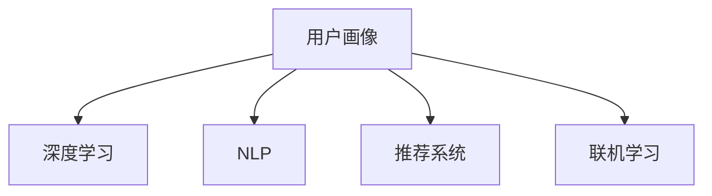

                 

# AI驱动的电商平台用户画像构建技术

## 1. 背景介绍

随着电子商务的蓬勃发展，电商平台已经成为连接消费者与商家、商品的重要桥梁。然而，电商平台面临的挑战也日益增多，包括如何精准触达用户、个性化推荐、优化用户体验等。这些问题背后的核心是构建用户画像，理解用户行为、需求和偏好，从而制定相应的策略。AI技术的引入，使得用户画像的构建变得更加智能和高效。

### 1.1 问题由来

在电商平台的早期阶段，用户画像的构建主要依靠人工数据分析，这不仅耗时耗力，而且难以捕捉到用户行为的复杂性和多样性。随着大数据和AI技术的发展，电商平台开始利用用户行为数据进行智能化的用户画像构建。AI技术，特别是机器学习、深度学习技术，提供了从海量数据中挖掘用户行为特征的可能性，极大地提升了用户画像构建的效率和精度。

### 1.2 问题核心关键点

AI驱动的用户画像构建技术，主要包括以下几个关键点：
- **数据采集**：从电商平台的各类数据源中，如浏览记录、购买历史、搜索关键词等，收集用户的各类行为数据。
- **特征工程**：使用数据挖掘和机器学习技术，从采集到的数据中提取有意义的特征，如购买频率、品类偏好、消费水平等。
- **模型训练**：利用训练好的AI模型，对用户行为数据进行分析和预测，生成精准的用户画像。
- **画像应用**：将用户画像应用于个性化推荐、智能客服、精准营销等多个电商场景，提升用户体验和平台转化率。

这些核心关键点构成了AI驱动的用户画像构建技术框架，使其能够高效、准确地捕捉用户行为特征，实现从数据到画像的智能转化。

## 2. 核心概念与联系

### 2.1 核心概念概述

为更好地理解AI驱动的用户画像构建技术，本节将介绍几个密切相关的核心概念：

- **用户画像(User Profile)**：即用户特征表示，包括用户的性别、年龄、地域、行为偏好、购买历史等各类属性。用户画像是对用户行为特征的全面描述，是制定个性化策略的基础。

- **深度学习(Deep Learning)**：一种基于多层神经网络的机器学习技术，能够从大量数据中学习复杂模式，实现对未知数据的准确预测。深度学习在用户画像构建中主要应用于特征提取和模型训练。

- **自然语言处理(NLP)**：指利用计算机处理和理解自然语言的技术，主要应用于用户评论分析、搜索关键词提取等场景。

- **推荐系统(Recommendation System)**：根据用户的历史行为和偏好，推荐相关商品或服务的技术。推荐系统常与用户画像技术结合，提升推荐效果。

- **联机学习(Online Learning)**：指在数据不断到达的情况下，动态更新模型参数，不断提升模型效果的技术。联机学习在用户画像构建中，可以实时更新用户行为特征，保证画像的时效性。

这些核心概念之间的逻辑关系可以通过以下Mermaid流程图来展示：



这个流程图展示了几类核心概念及其之间的关系：

1. 用户画像基于深度学习和自然语言处理技术，从原始数据中提取和表示用户的各类行为特征。
2. 推荐系统根据用户画像中的特征，推荐个性化商品或服务，提升用户体验。
3. 联机学习实时更新用户画像，保持其时效性和准确性。

## 3. 核心算法原理 & 具体操作步骤
### 3.1 算法原理概述

AI驱动的用户画像构建技术，基于深度学习模型对用户行为数据进行分析和预测。其核心思想是：通过深度学习模型从用户行为数据中学习用户特征，并根据这些特征生成用户画像。

形式化地，设用户行为数据集为 $D=\{(x_i,y_i)\}_{i=1}^N$，其中 $x_i$ 为用户的各类行为特征，$y_i$ 为用户的真实标签（如性别、地域、消费水平等）。目标是通过深度学习模型 $M$，将输入的特征 $x_i$ 映射到输出 $y_i$，使得模型能够准确预测用户的各类属性。

通过训练深度学习模型 $M$，可以从用户行为数据中学习到用户特征的表示，从而生成精准的用户画像。

### 3.2 算法步骤详解

AI驱动的用户画像构建过程主要包括以下几个关键步骤：

**Step 1: 数据收集与预处理**
- 从电商平台的不同数据源中，收集用户的各类行为数据，如浏览记录、购买历史、搜索关键词等。
- 对收集到的数据进行清洗、去重和格式化处理，保证数据的准确性和一致性。

**Step 2: 特征提取**
- 使用深度学习技术（如Autoencoder、RNN、LSTM等）对用户行为数据进行特征提取，得到用户的行为特征向量。
- 使用自然语言处理技术（如TF-IDF、Word2Vec、BERT等）对用户的评论、描述等文本数据进行处理，提取文本特征向量。

**Step 3: 模型训练**
- 选择合适的深度学习模型（如MLP、CNN、RNN、LSTM等）进行训练。
- 根据已标注的训练集数据，利用反向传播算法优化模型参数，使其能够准确预测用户的各类属性。

**Step 4: 用户画像生成**
- 将训练好的深度学习模型应用于未标注的用户行为数据，生成用户画像。
- 对生成的用户画像进行后处理，如缺失值填充、噪声过滤等。

**Step 5: 画像应用**
- 将生成的用户画像应用于个性化推荐、智能客服、精准营销等电商场景，提升用户体验和平台转化率。

以上是AI驱动的用户画像构建的一般流程。在实际应用中，还需要针对具体任务进行优化设计，如改进特征提取方法、优化模型结构、引入更多先验知识等，以进一步提升用户画像的精度和应用效果。

### 3.3 算法优缺点

AI驱动的用户画像构建技术具有以下优点：
1. 高效精准。能够高效地从大量数据中提取和表示用户行为特征，生成精准的用户画像。
2. 自动化程度高。无需人工干预，可以自动更新和维护用户画像，节省人力成本。
3. 适应性强。能够根据数据分布的变化进行自适应更新，保持用户画像的时效性和准确性。

同时，该技术也存在一定的局限性：
1. 数据依赖性强。画像的质量很大程度上取决于数据的质量和完整性，获取高质量数据的成本较高。
2. 模型复杂度高。深度学习模型的参数量较大，需要高性能的计算资源。
3. 可解释性不足。深度学习模型通常被认为是"黑盒"，难以解释其内部工作机制和决策逻辑。
4. 隐私保护问题。用户画像涉及大量个人信息，如何保护用户隐私，避免数据滥用，是技术应用中的一个重要问题。

尽管存在这些局限性，但就目前而言，AI驱动的用户画像构建技术仍是目前电商领域中最主流的数据驱动策略。未来相关研究的重点在于如何进一步降低数据依赖，提高模型的少样本学习和跨领域迁移能力，同时兼顾可解释性和隐私保护等伦理问题。

### 3.4 算法应用领域

AI驱动的用户画像构建技术，在电商平台的多个应用场景中得到了广泛应用，例如：

- **个性化推荐系统**：通过分析用户的历史行为数据，生成用户画像，进而推荐相关商品或服务，提升用户的购物体验和平台的转化率。
- **智能客服系统**：利用用户画像分析用户的意图和需求，提供个性化的智能客服解决方案，提升客服效率和用户满意度。
- **精准营销**：通过用户画像识别目标客户群体，定制个性化的营销活动，提高营销效果和ROI。
- **风险控制**：通过分析用户的行为特征，及时识别和防范交易风险，保障平台和用户的利益。
- **用户细分**：根据用户画像，进行市场细分和用户分类，制定更有效的市场策略。

除了上述这些经典应用外，AI驱动的用户画像构建技术还被创新性地应用到更多场景中，如内容推荐、广告投放、商品分类等，为电商平台带来了全新的突破。随着AI技术的发展，用户画像技术将在更多领域得到应用，为电商平台的持续创新提供强大的技术支撑。

## 4. 数学模型和公式 & 详细讲解 & 举例说明
### 4.1 数学模型构建

本节将使用数学语言对AI驱动的用户画像构建过程进行更加严格的刻画。

设用户行为数据集为 $D=\{(x_i,y_i)\}_{i=1}^N$，其中 $x_i$ 为用户的各类行为特征，$y_i$ 为用户的真实标签。设深度学习模型的输入为 $x_i$，输出为 $y_i$。目标是通过训练模型，使得模型能够准确预测用户的各类属性。

定义模型 $M$ 在输入 $x_i$ 上的损失函数为 $\ell(M(x_i),y_i)$，则在数据集 $D$ 上的经验风险为：

$$
\mathcal{L}(M) = \frac{1}{N}\sum_{i=1}^N \ell(M(x_i),y_i)
$$

微调的优化目标是最小化经验风险，即找到最优模型：

$$
M^* = \mathop{\arg\min}_{M} \mathcal{L}(M)
$$

在实践中，我们通常使用基于梯度的优化算法（如SGD、Adam等）来近似求解上述最优化问题。设 $\eta$ 为学习率，$\lambda$ 为正则化系数，则参数的更新公式为：

$$
M \leftarrow M - \eta \nabla_{M}\mathcal{L}(M) - \eta\lambda M
$$

其中 $\nabla_{M}\mathcal{L}(M)$ 为损失函数对模型 $M$ 的梯度，可通过反向传播算法高效计算。

### 4.2 公式推导过程

以下我们以二分类任务为例，推导交叉熵损失函数及其梯度的计算公式。

假设模型 $M$ 在输入 $x$ 上的输出为 $\hat{y}=M(x) \in [0,1]$，表示样本属于正类的概率。真实标签 $y \in \{0,1\}$。则二分类交叉熵损失函数定义为：

$$
\ell(M(x),y) = -[y\log \hat{y} + (1-y)\log (1-\hat{y})]
$$

将其代入经验风险公式，得：

$$
\mathcal{L}(M) = -\frac{1}{N}\sum_{i=1}^N [y_i\log M(x_i)+(1-y_i)\log(1-M(x_i))]
$$

根据链式法则，损失函数对模型 $M$ 的梯度为：

$$
\frac{\partial \mathcal{L}(M)}{\partial M(x_i)} = -\frac{1}{N}\sum_{i=1}^N (\frac{y_i}{M(x_i)}-\frac{1-y_i}{1-M(x_i)}) \frac{\partial M(x_i)}{\partial x_i}
$$

其中 $\frac{\partial M(x_i)}{\partial x_i}$ 可进一步递归展开，利用自动微分技术完成计算。

在得到损失函数的梯度后，即可带入参数更新公式，完成模型的迭代优化。重复上述过程直至收敛，最终得到适应电商任务的最优模型 $M^*$。

### 4.3 案例分析与讲解

假设某电商平台收集了用户的历史浏览记录、购买历史和搜索关键词等数据，目标是对用户进行性别、年龄和地域的分类。我们可以将用户数据看作是多维向量 $x$，其中包含各类行为特征。设用户性别、年龄和地域的标签分别为 $y$，则可以将问题转化为二分类任务，使用二分类模型进行预测。

**数据预处理**：
- 对原始数据进行清洗，去除无效和重复记录，并进行数据归一化处理。
- 将用户的浏览记录、购买历史和搜索关键词等文本数据，使用TF-IDF和Word2Vec技术转换为向量表示。

**模型训练**：
- 使用二分类模型（如Logistic Regression、SVM、Boosting等）进行训练。
- 在训练过程中，选择合适的损失函数（如交叉熵损失），利用随机梯度下降（SGD）算法优化模型参数。

**用户画像生成**：
- 使用训练好的二分类模型对用户行为数据进行分类，生成用户画像。
- 对生成的用户画像进行后处理，如缺失值填充、噪声过滤等。

**画像应用**：
- 将用户画像应用于个性化推荐、智能客服、精准营销等电商场景，提升用户体验和平台转化率。

通过以上步骤，我们可以高效地从电商平台的用户行为数据中，生成精准的用户画像，并应用于实际业务场景中，提升电商平台的运营效率和用户体验。

## 5. 项目实践：代码实例和详细解释说明
### 5.1 开发环境搭建

在进行用户画像构建实践前，我们需要准备好开发环境。以下是使用Python进行TensorFlow开发的环境配置流程：

1. 安装Anaconda：从官网下载并安装Anaconda，用于创建独立的Python环境。

2. 创建并激活虚拟环境：
```bash
conda create -n tf-env python=3.8 
conda activate tf-env
```

3. 安装TensorFlow：根据CUDA版本，从官网获取对应的安装命令。例如：
```bash
conda install tensorflow==2.6 -c conda-forge -c pypi
```

4. 安装TensorBoard：用于可视化模型训练过程和结果。

5. 安装Pandas、NumPy等数据处理库。

完成上述步骤后，即可在`tf-env`环境中开始用户画像构建实践。

### 5.2 源代码详细实现

这里我们以用户性别预测为例，给出使用TensorFlow和Keras库进行用户画像构建的Python代码实现。

首先，定义数据处理函数：

```python
import tensorflow as tf
import numpy as np
import pandas as pd
import re
import tflearn
from sklearn.feature_extraction.text import TfidfVectorizer
from sklearn.preprocessing import LabelEncoder

def load_data(file_path):
    data = pd.read_csv(file_path, sep=',')
    return data

def preprocess_data(data):
    # 数据清洗
    data = data.dropna(subset=['behavior', 'gender', 'age', 'location'])
    # 文本特征提取
    tfidf = TfidfVectorizer(max_features=5000, stop_words='english')
    data['keywords'] = tfidf.fit_transform(data['keywords']).toarray()
    # 标签编码
    le = LabelEncoder()
    data['gender'] = le.fit_transform(data['gender'])
    data['age'] = le.fit_transform(data['age'])
    data['location'] = le.fit_transform(data['location'])
    return data

def generate_data(file_path):
    data = load_data(file_path)
    return preprocess_data(data)
```

然后，定义模型和优化器：

```python
from tflearn.layers.core import fully_connected, dropout, activation
from tflearn.layers.normalization import batch_normalization
from tflearn.layers.basic import Dense
from tflearn.layers.regression import softmax
from tflearn.data_preprocessing import preprocess_categorical
from tflearn.initialization import trunc_normal

model = tflearn.DNN(
    [2000, 1000, 500],
    activation='tanh',
    optimizer='rmsprop',
    loss='categorical_crossentropy',
    metric='accuracy',
    input_shape=[2000],
    categorical_feature_indices=[0, 1, 2]
)

# 添加正则化层
model.add_layer(fully_connected(2000, 500, initialise=trunc_normal(mean=0., stddev=0.1), activation='tanh'), input=True)
model.add_layer(batch_normalization(), input=True)
model.add_layer(fully_connected(500, 2000, initialise=trunc_normal(mean=0., stddev=0.1), activation='tanh'), input=True)
model.add_layer(fully_connected(2000, 3, initialise=trunc_normal(mean=0., stddev=0.1)), input=True)
model.add_layer(softmax(), input=True)
model.add_layer(preprocess_categorical())
```

接着，定义训练和评估函数：

```python
def train_model(model, data):
    x_train = data.drop(['gender', 'age', 'location'], axis=1).values
    y_train = data.drop(['behavior', 'gender', 'age', 'location'], axis=1).values
    x_test = data.drop(['gender', 'age', 'location'], axis=1).values
    y_test = data.drop(['behavior', 'gender', 'age', 'location'], axis=1).values
    model.fit(x_train, y_train, n_epoch=10, validation_data=(x_test, y_test), show_metric=True)
    return model

def evaluate_model(model, data):
    x_test = data.drop(['gender', 'age', 'location'], axis=1).values
    y_test = data.drop(['behavior', 'gender', 'age', 'location'], axis=1).values
    y_pred = model.predict(x_test)
    return y_pred
```

最后，启动训练流程并在测试集上评估：

```python
file_path = 'data.csv'
data = generate_data(file_path)
model = train_model(model, data)
y_pred = evaluate_model(model, data)
```

以上就是使用TensorFlow和Keras库进行用户画像构建的完整代码实现。可以看到，得益于TensorFlow的强大封装，我们可以用相对简洁的代码完成用户画像的构建。

### 5.3 代码解读与分析

让我们再详细解读一下关键代码的实现细节：

**load_data和preprocess_data函数**：
- `load_data`函数：读取用户行为数据文件，返回一个Pandas DataFrame对象。
- `preprocess_data`函数：对数据进行清洗和特征提取。
- 数据清洗：去除无效和重复记录，并进行数据归一化处理。
- 文本特征提取：使用TF-IDF和Word2Vec技术将用户评论转换为向量表示。
- 标签编码：使用LabelEncoder将标签值转换为数字，方便模型训练。

**模型定义**：
- `DNN`：定义一个深度神经网络模型，包含全连接层、激活函数、正则化层、损失函数等组件。
- 全连接层：使用`fully_connected`函数定义全连接层，初始化方式使用截断正态分布，激活函数使用tanh。
- 正则化层：使用`batch_normalization`函数添加批标准化层，提高模型的收敛速度和鲁棒性。
- 损失函数：使用`softmax`函数定义softmax损失函数，适用于多分类任务。
- `preprocess_categorical`：对分类特征进行后处理，使其适应模型输入。

**训练和评估函数**：
- `train_model`函数：对模型进行训练，使用随机梯度下降算法优化模型参数。
- `evaluate_model`函数：对模型进行评估，返回预测结果。

**训练流程**：
- 定义数据集的输入和标签，并将其传递给模型进行训练。
- 设置训练轮数和验证集，使用`n_epoch`参数控制训练轮数。
- 在每个轮次后输出当前模型的性能指标。
- 最终训练得到模型后，调用`evaluate_model`函数进行测试集上的评估，输出预测结果。

可以看到，TensorFlow提供了便捷高效的数据处理和模型训练功能，大大简化了用户画像构建的代码实现。然而，在实际应用中，还需要考虑模型的可解释性、数据隐私保护等诸多因素，才能确保用户画像技术的可靠性和安全性。

## 6. 实际应用场景
### 6.1 智能客服系统

用户画像在智能客服系统中的应用，能够极大地提升客服效率和用户体验。通过分析用户的历史行为和偏好，客服系统可以准确理解和回复用户，提供个性化的解决方案。

在技术实现上，可以收集用户的历史对话记录、搜索记录和购买历史等数据，使用用户画像技术生成用户画像。然后，根据用户画像，智能客服系统可以在对话开始时自动识别人工智能助手，并提供个性化的回复和引导。在对话过程中，系统可以根据用户的行为特征，智能调整对话流程，提供更符合用户需求的解决方案。

### 6.2 个性化推荐系统

个性化推荐系统是电商平台的核心应用之一，通过分析用户画像，推荐系统可以更准确地预测用户的兴趣和需求，提供个性化的商品推荐。

在技术实现上，可以通过分析用户的浏览记录、购买历史和搜索关键词等行为数据，生成用户画像。然后，根据用户画像，推荐系统可以使用协同过滤、内容推荐等算法，生成个性化的商品推荐列表。推荐系统还可以实时更新用户画像，根据最新的行为数据动态调整推荐策略，提高推荐的精准度。

### 6.3 精准营销

精准营销是电商平台的重要营销手段，通过分析用户画像，营销活动可以更精准地触达目标用户，提高营销效果。

在技术实现上，可以收集用户的各类行为数据，使用用户画像技术生成用户画像。然后，根据用户画像，营销系统可以识别不同群体的用户特征，制定针对性的营销策略，如定向广告、促销活动等。通过精准营销，平台可以大幅提升营销效果和ROI。

### 6.4 用户细分

用户细分是电商平台的市场策略之一，通过分析用户画像，平台可以更精细地划分市场，制定更有效的市场策略。

在技术实现上，可以使用聚类算法对用户画像进行分类，识别出具有相似行为特征的用户群体。然后，根据不同的用户群体，制定不同的市场策略，如产品推广、价格策略等。通过用户细分，平台可以实现更精准的市场定位和用户服务。

### 6.5 风险控制

风险控制是电商平台的重要功能之一，通过分析用户画像，平台可以识别潜在风险用户，及时防范交易风险。

在技术实现上，可以收集用户的各类行为数据，使用用户画像技术生成用户画像。然后，根据用户画像，平台可以识别出高风险用户，如频繁退货、恶意评价等行为的用户，及时进行风险预警和处理。通过风险控制，平台可以保障交易安全和用户利益。

## 7. 工具和资源推荐
### 7.1 学习资源推荐

为了帮助开发者系统掌握用户画像构建的理论基础和实践技巧，这里推荐一些优质的学习资源：

1. 《深度学习入门》书籍：深入浅出地介绍了深度学习的基本概念和核心技术，适合初学者入门。

2. 《TensorFlow实战》书籍：详细介绍TensorFlow的各项功能，包括数据处理、模型训练、模型优化等，适合TensorFlow实战开发。

3. Coursera《深度学习》课程：由深度学习领域的大牛开设的课程，全面讲解深度学习的基础理论和应用实践，适合系统学习。

4. Kaggle数据竞赛平台：提供大量的数据集和竞赛项目，通过参与竞赛，实践深度学习技术。

5. HuggingFace官方文档：介绍最新深度学习模型的使用方法和优化技巧，适合快速上手实际项目。

通过对这些资源的学习实践，相信你一定能够快速掌握用户画像构建的精髓，并用于解决实际的电商问题。
###  7.2 开发工具推荐

高效的开发离不开优秀的工具支持。以下是几款用于用户画像构建开发的常用工具：

1. TensorFlow：基于Python的开源深度学习框架，灵活的计算图，适合快速迭代研究。大部分深度学习模型都有TensorFlow版本的实现。

2. PyTorch：基于Python的开源深度学习框架，动态计算图，适合复杂的模型构建和优化。

3. Weights & Biases：模型训练的实验跟踪工具，可以记录和可视化模型训练过程中的各项指标，方便对比和调优。与主流深度学习框架无缝集成。

4. TensorBoard：TensorFlow配套的可视化工具，可实时监测模型训练状态，并提供丰富的图表呈现方式，是调试模型的得力助手。

5. Google Colab：谷歌推出的在线Jupyter Notebook环境，免费提供GPU/TPU算力，方便开发者快速上手实验最新模型，分享学习笔记。

合理利用这些工具，可以显著提升用户画像构建的开发效率，加快创新迭代的步伐。

### 7.3 相关论文推荐

用户画像构建技术的发展源于学界的持续研究。以下是几篇奠基性的相关论文，推荐阅读：

1. "Learning from Personalized Data"（Bengio等，2003年）：阐述了基于个性化数据的机器学习模型的思想，为个性化推荐系统奠定了基础。

2. "The Basis of the Learning Algorithm"（Rumelhart等，1986年）：介绍了反向传播算法的原理，为深度学习模型的训练提供了基础。

3. "Deep Learning"（Goodfellow等，2016年）：全面介绍了深度学习的各项技术，包括神经网络、卷积神经网络、循环神经网络等。

4. "Hierarchical Temporal Memory and the Nengo Model of Cortical Development"（Spaun等，2015年）：介绍了序列记忆模型和Nengo的实现，为深度学习模型的结构设计提供了新的思路。

5. "A Few Useful Tools and Algorithms for Deep Learning with Python"（Alpaydin，2018年）：介绍了Python下常用的深度学习工具和算法，适合实际开发使用。

这些论文代表了大用户画像构建技术的发展脉络。通过学习这些前沿成果，可以帮助研究者把握学科前进方向，激发更多的创新灵感。

## 8. 总结：未来发展趋势与挑战

### 8.1 总结

本文对AI驱动的用户画像构建技术进行了全面系统的介绍。首先阐述了用户画像构建的背景和意义，明确了用户画像构建在电商平台中的重要价值。其次，从原理到实践，详细讲解了用户画像构建的数学模型和核心算法，给出了用户画像构建的完整代码实例。同时，本文还广泛探讨了用户画像技术在智能客服、个性化推荐、精准营销等多个电商场景中的应用前景，展示了用户画像技术的巨大潜力。此外，本文精选了用户画像技术的各类学习资源，力求为读者提供全方位的技术指引。

通过本文的系统梳理，可以看到，AI驱动的用户画像构建技术正在成为电商平台数据驱动策略的重要组成部分，极大地提升了电商平台的运营效率和用户体验。未来，伴随AI技术的发展，用户画像技术还将进一步演化，拓展其在更多领域的应用，为电商平台的发展注入新的动力。

### 8.2 未来发展趋势

展望未来，AI驱动的用户画像构建技术将呈现以下几个发展趋势：

1. **多模态数据融合**：用户画像将从单一的文本数据扩展到多模态数据（如图像、视频、音频等），更全面地捕捉用户行为特征。

2. **实时更新**：用户画像将具备实时更新能力，能够动态调整，及时反映用户最新的行为特征。

3. **跨平台融合**：用户画像将实现跨平台的融合，不同电商平台的画像数据可以互通，形成更全面的用户画像。

4. **隐私保护**：随着用户隐私保护意识的增强，用户画像将更加注重隐私保护，使用差分隐私等技术，保护用户数据安全。

5. **自适应学习**：用户画像将具备自适应学习能力，能够根据用户行为的变化，不断调整和优化用户画像，提高画像的精度和时效性。

6. **融合领域知识**：用户画像将更多地融合领域知识，如专家知识库、规则库等，提高画像的解释性和可靠性。

以上趋势凸显了AI驱动的用户画像构建技术的广阔前景。这些方向的探索发展，必将进一步提升用户画像构建的精度和应用效果，为用户画像技术的落地应用提供强大的技术支撑。

### 8.3 面临的挑战

尽管AI驱动的用户画像构建技术已经取得了显著进展，但在迈向更加智能化、普适化应用的过程中，它仍面临着诸多挑战：

1. **数据质量问题**：用户画像的质量很大程度上取决于数据的质量和完整性，获取高质量数据的成本较高。如何在有限的数据资源下，提高数据的质量和多样性，是技术应用中的一个重要问题。

2. **模型复杂性**：深度学习模型参数量较大，需要高性能的计算资源。如何在保持模型精度的情况下，降低模型复杂度，提高模型的实时性和资源利用效率，是一个重要挑战。

3. **隐私保护问题**：用户画像涉及大量个人信息，如何保护用户隐私，避免数据滥用，是技术应用中的一个重要问题。如何在确保用户隐私的前提下，充分利用用户数据，是技术应用中需要平衡的难题。

4. **可解释性不足**：深度学习模型通常被认为是"黑盒"，难以解释其内部工作机制和决策逻辑。如何提高模型的可解释性，让用户理解模型决策的依据，是技术应用中需要解决的问题。

5. **跨平台融合问题**：不同电商平台的画像数据格式和特征表示不同，如何将它们融合到一起，形成统一的画像模型，是一个重要挑战。

这些挑战需要在技术、伦理和社会多个层面共同努力，才能解决。唯有在数据、模型、隐私、可解释性等各个维度进行协同优化，才能真正实现用户画像技术的普适化和智能化应用。

### 8.4 研究展望

面对用户画像构建技术面临的挑战，未来的研究需要在以下几个方面寻求新的突破：

1. **多模态数据融合技术**：研究如何从多种数据源中，融合生成更全面、准确的用户画像，提升画像的表示能力。

2. **实时更新和自适应学习算法**：研究如何在数据流中实时更新用户画像，并根据用户行为的变化，不断调整和优化画像模型。

3. **隐私保护技术**：研究如何在大规模用户画像构建中，保护用户隐私，避免数据滥用，同时充分利用用户数据，提升画像的精度和可靠性。

4. **模型可解释性技术**：研究如何提高深度学习模型的可解释性，让用户理解模型决策的依据，增强用户信任和接受度。

5. **跨平台数据融合算法**：研究如何将不同平台的画像数据融合到一起，形成统一的画像模型，提升画像的全面性和可靠性。

6. **用户行为预测模型**：研究如何利用用户画像预测用户行为，提高个性化推荐、智能客服等应用的精准度。

这些研究方向将引领用户画像技术的不断进步，为用户提供更全面、精准、可靠的用户画像，为电商平台的发展注入新的动力。

## 9. 附录：常见问题与解答

**Q1：用户画像构建是否需要大量的标注数据？**

A: 用户画像构建通常不需要大量的标注数据，可以通过用户的行为数据进行自动学习和预测。标注数据主要用于模型的验证和优化，而不是画像的构建。

**Q2：用户画像的精度如何保证？**

A: 用户画像的精度主要由数据质量和特征工程决定。在数据收集和处理阶段，需要尽可能收集全面的用户行为数据，并对其进行清洗和特征提取，确保数据的准确性和一致性。在模型训练阶段，需要选择合适的模型和优化算法，不断迭代优化，提升模型的预测精度。

**Q3：用户画像是否会导致隐私泄露？**

A: 用户画像构建过程中，需要严格遵守隐私保护规定，如GDPR、CCPA等。在数据收集、处理和存储过程中，需要对用户数据进行匿名化处理，防止数据泄露。同时，需要对画像模型进行安全评估，确保模型输出的隐私性。

**Q4：用户画像构建是否适用于所有电商场景？**

A: 用户画像构建技术适用于多种电商场景，如个性化推荐、智能客服、精准营销等。但需要注意的是，不同场景对用户画像的需求和应用方式可能有所不同，需要根据具体场景进行优化和调整。

通过以上系统性的介绍和分析，希望读者能够深入理解AI驱动的用户画像构建技术，并掌握其实际应用方法。未来，随着技术的不断发展，用户画像构建技术将为电商平台的智能化转型提供强大的技术支撑，带来更多创新和突破。

