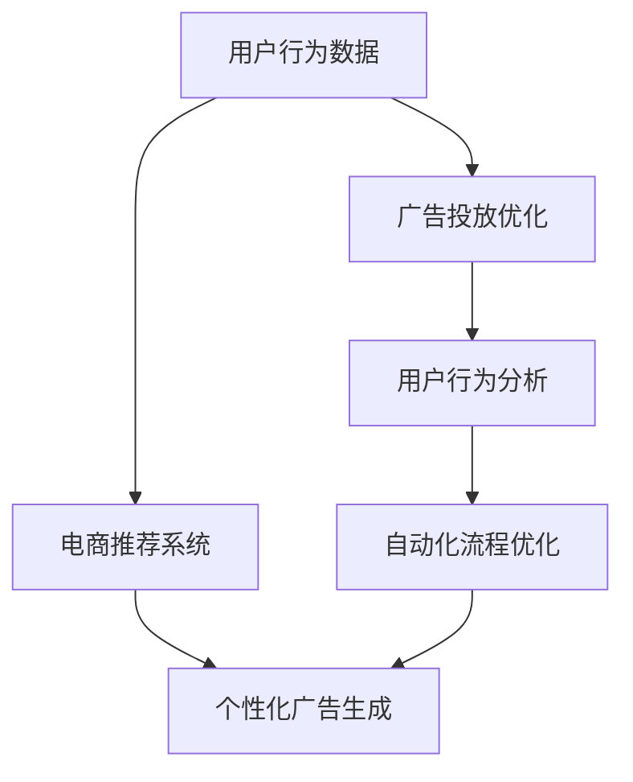

                 

# AI驱动的电商平台精准营销活动自动化

> 关键词：电商精准营销、自动化、AI驱动、推荐算法、广告投放、大数据分析、机器学习

## 1. 背景介绍

### 1.1 问题由来

在数字经济时代，电商平台竞争日益激烈。传统的广告和营销策略往往成本高昂且效率低下。为了提升用户体验和转化率，各大电商平台纷纷引入人工智能技术，通过数据分析和算法优化，实现精准营销活动自动化。AI驱动的电商平台精准营销活动自动化，成为电商行业的热点话题。

具体而言，电商精准营销活动自动化主要包括：通过AI技术对用户行为进行深度分析，预测用户需求和行为趋势，据此生成个性化的广告和推荐内容，自动化地进行广告投放和推荐策略优化，持续提升用户的购物体验和商家转化率。

### 1.2 问题核心关键点

- **数据驱动**：电商平台的精准营销活动自动化，首要依托于海量用户行为数据的分析与应用。通过大数据分析，发现用户的潜在需求和偏好，从而提供个性化的商品推荐和广告。
- **AI算法**：深度学习和推荐算法是实现电商精准营销自动化的核心技术。AI算法通过分析用户的历史行为数据，预测用户未来行为，据此生成推荐内容。
- **自动化**：精准营销活动自动化旨在通过自动化算法和流程，实现用户需求的快速响应和广告投放的精准推送，从而提升广告的点击率和转化率。
- **效果评估**：对自动化营销活动的实时监测与效果评估，通过A/B测试等方式，不断优化模型参数和策略，提升整体效果。

这些核心关键点共同构成了电商精准营销活动自动化的技术框架，使得电商平台能够高效地满足用户需求，提升销售转化率，实现商业价值的最大化。

### 1.3 问题研究意义

研究电商精准营销活动自动化，对于提升电商平台的运营效率、降低成本、提高用户体验和商家转化率具有重要意义：

1. **提升运营效率**：自动化的推荐和广告投放系统，可以24小时不间断地工作，快速响应用户需求，从而提升电商平台的运营效率。
2. **降低成本**：通过AI技术优化广告投放策略，减少无效广告，降低广告投放成本，提高广告的ROI。
3. **提高用户体验**：个性化的推荐内容能够更好地满足用户需求，提升用户体验，增加用户粘性。
4. **提高转化率**：精准的广告投放和推荐策略，能够显著提高用户的购买转化率，增加电商平台的收入。
5. **促进电商行业发展**：通过自动化技术，电商行业能够更加高效地响应市场需求，推动行业整体的进步和发展。

## 2. 核心概念与联系

### 2.1 核心概念概述

为更好地理解电商精准营销活动自动化的技术框架，本节将介绍几个密切相关的核心概念：

- **电商推荐系统**：通过分析用户行为数据，预测用户未来行为，并生成个性化的商品推荐内容，提升用户的购买体验。
- **广告投放优化**：通过机器学习算法，优化广告的投放策略和投放位置，提高广告的点击率和转化率。
- **用户行为分析**：利用大数据分析技术，分析用户的浏览、购买、评价等行为，挖掘用户兴趣和需求。
- **个性化广告生成**：根据用户行为数据，生成符合用户兴趣的个性化广告内容，提升广告的吸引力和点击率。
- **自动化流程优化**：通过自动化的算法和流程，实现推荐和广告投放的自动化管理，提升整体效率。

这些核心概念之间的逻辑关系可以通过以下Mermaid流程图来展示：



这个流程图展示了几大核心概念及其之间的关系：

1. 用户行为数据是电商推荐系统和广告投放优化的基础。
2. 电商推荐系统和广告投放优化都需要依赖于用户行为分析。
3. 个性化广告生成是推荐系统和广告投放优化的目标。
4. 自动化流程优化是实现推荐和广告投放自动化的手段。

这些概念共同构成了电商精准营销活动自动化的技术框架，使得电商平台能够高效地满足用户需求，提升销售转化率，实现商业价值的最大化。

## 3. 核心算法原理 & 具体操作步骤

### 3.1 算法原理概述

电商精准营销活动自动化，本质上是一个基于用户行为数据的深度学习和推荐系统应用过程。其核心思想是：通过分析用户的历史行为数据，预测用户未来的购买意向，据此生成个性化的推荐内容和广告，自动化地进行广告投放和推荐策略优化，持续提升用户的购物体验和商家转化率。

具体而言，电商精准营销活动自动化的算法流程如下：

1. **用户行为数据收集与预处理**：收集用户在电商平台上的浏览、购买、评价等行为数据，进行数据清洗和预处理，形成用户行为数据集。
2. **用户兴趣与需求挖掘**：利用大数据分析技术，如协同过滤、内容推荐、基于时间序列分析等方法，挖掘用户的兴趣和需求。
3. **推荐系统设计**：根据用户行为数据，设计个性化的推荐算法，生成推荐内容。
4. **广告投放策略优化**：设计自动化广告投放算法，优化广告的投放位置和投放时间，提升广告的点击率和转化率。
5. **自动化流程管理**：通过自动化算法和流程，实现推荐和广告投放的自动化管理，持续提升整体效果。

### 3.2 算法步骤详解

电商精准营销活动自动化的核心算法步骤如下：

**Step 1: 数据收集与预处理**

电商平台的推荐和广告投放系统需要收集大量用户行为数据，这些数据通常包括以下几个方面：

- **浏览行为数据**：用户访问过的商品、页面、广告等信息。
- **购买行为数据**：用户的购买记录、订单信息、支付记录等。
- **评价行为数据**：用户对商品的评价、评分等。
- **其他行为数据**：用户的搜索关键词、点击次数、停留时间等。

收集到的数据需要进行清洗和预处理，包括去重、缺失值处理、异常值检测等，形成用户行为数据集。这一步骤是后续算法设计的基础。

**Step 2: 用户兴趣与需求挖掘**

用户兴趣与需求挖掘是推荐系统设计的关键步骤。常用的挖掘方法包括：

- **协同过滤**：通过分析用户之间的相似性，推荐用户可能感兴趣的商品。
- **内容推荐**：根据商品的属性、标签等信息，推荐用户可能感兴趣的商品。
- **基于时间序列分析**：分析用户的行为时间序列，预测用户未来的购买意向。

常用的协同过滤算法有基于用户-商品矩阵的协同过滤、基于商品-商品矩阵的协同过滤等。常用的内容推荐算法有基于内容的推荐、基于深度学习的推荐等。

**Step 3: 推荐系统设计**

推荐系统设计的目标是生成个性化的推荐内容，提升用户的购物体验和购买转化率。常用的推荐算法有：

- **基于协同过滤的推荐**：利用用户-商品矩阵，计算用户对不同商品的兴趣权重，生成推荐列表。
- **基于内容的推荐**：根据商品的属性、标签等信息，推荐用户可能感兴趣的商品。
- **基于深度学习的推荐**：利用深度神经网络，学习商品与用户之间的映射关系，生成推荐列表。

常用的深度学习模型有基于RNN、CNN、Transformer等模型的推荐系统。

**Step 4: 广告投放策略优化**

广告投放策略优化的目标是最大化广告的点击率和转化率，常用的优化方法包括：

- **点击率预测**：利用历史广告点击数据，预测广告的点击率，优化广告投放策略。
- **转化率预测**：利用历史广告转化数据，预测广告的转化率，优化广告投放策略。
- **A/B测试**：通过对比不同广告投放策略的效果，选择最优策略。

常用的优化算法有梯度提升、线性回归、神经网络等。

**Step 5: 自动化流程管理**

自动化流程管理的目的是实现推荐和广告投放的自动化管理，提升整体效果。常用的自动化方法包括：

- **自动化任务调度**：利用任务调度系统，实现推荐和广告投放任务的自动化执行。
- **自动参数调整**：利用机器学习算法，自动调整模型参数，优化模型效果。
- **实时监测与预警**：利用实时监测系统，对推荐和广告投放效果进行实时监测，及时发现问题并进行预警。

常用的自动化工具有Apache Airflow、Kubernetes等。

### 3.3 算法优缺点

电商精准营销活动自动化的算法具有以下优点：

- **高效性**：通过自动化算法和流程，能够快速响应用户需求，提升整体效率。
- **精准性**：利用大数据分析和AI算法，生成个性化的推荐内容和广告，提高用户购买转化率。
- **可扩展性**：算法具有较好的可扩展性，能够适应大规模数据集和复杂任务。
- **灵活性**：可以根据具体业务需求，灵活调整算法和策略。

同时，该算法也存在一定的局限性：

- **数据依赖**：算法的性能很大程度上依赖于数据的质量和量，数据收集和处理成本较高。
- **模型复杂性**：深度学习和推荐算法模型较为复杂，需要较高的技术水平和计算资源。
- **泛化能力有限**：当数据分布发生变化时，模型的泛化能力可能受到影响，需要进行重新训练和调整。
- **解释性不足**：推荐和广告投放算法的内部机制较为复杂，难以解释其推理逻辑。

尽管存在这些局限性，但就目前而言，基于数据驱动的AI算法仍然是电商精准营销活动自动化的主流技术，通过持续的技术创新和优化，将能够进一步提升电商平台的运营效率和用户满意度。

### 3.4 算法应用领域

电商精准营销活动自动化在以下领域得到了广泛应用：

- **商品推荐**：根据用户的历史浏览和购买行为，生成个性化的商品推荐列表。
- **广告投放**：根据用户的兴趣和行为数据，优化广告的投放策略和位置，提高广告的点击率和转化率。
- **促销活动**：通过自动化算法，分析用户需求，设计个性化的促销活动，提升用户参与度。
- **用户体验优化**：通过用户行为分析，优化网站结构和功能，提升用户体验。
- **库存管理**：通过预测用户购买意向，优化库存管理，减少库存积压和缺货情况。

除了上述这些经典应用外，电商精准营销活动自动化还被创新性地应用于智能客服、个性化营销、市场分析等场景中，为电商平台带来了全新的突破。

## 4. 数学模型和公式 & 详细讲解  
### 4.1 数学模型构建

电商精准营销活动自动化的数学模型主要涉及以下几个方面：

- **用户行为数据建模**：通过时间序列分析、协同过滤等方法，建立用户行为数据模型。
- **推荐算法建模**：利用协同过滤、内容推荐、深度学习等模型，建立推荐算法模型。
- **广告投放优化建模**：通过点击率预测、转化率预测等方法，建立广告投放优化模型。

这里以协同过滤推荐算法为例，展示其数学模型的构建过程。

假设电商平台上有 $N$ 个用户 $U$，$M$ 个商品 $I$，用户对商品的评分矩阵为 $R$，则协同过滤算法的目标是最大化用户对商品的评分预测准确度：

$$
\max_{P} \sum_{u=1}^N \sum_{i=1}^M R_{ui} - R_{ui}^{\hat{}} = \sum_{u=1}^N \sum_{i=1}^M (R_{ui} - R_{ui}^{\hat{}})^2
$$

其中，$R_{ui}$ 表示用户 $u$ 对商品 $i$ 的实际评分，$R_{ui}^{\hat{}}$ 表示用户 $u$ 对商品 $i$ 的预测评分，$P$ 表示预测模型。

### 4.2 公式推导过程

协同过滤推荐算法的推导过程如下：

设用户 $u$ 对商品 $i$ 的评分向量为 $r_i$，商品 $i$ 对用户 $u$ 的评分向量为 $R_u$，则协同过滤算法的目标是最大化预测评分与实际评分的误差平方和：

$$
\min_{R_u} \sum_{u=1}^N \sum_{i=1}^M (R_{ui} - R_{ui}^{\hat{}})^2 = \min_{R_u} \sum_{u=1}^N \sum_{i=1}^M (R_{ui} - \langle r_i, R_u \rangle)^2
$$

其中，$\langle r_i, R_u \rangle$ 表示用户 $u$ 对商品 $i$ 的预测评分。

通过求解上述优化问题，得到协同过滤算法的推荐结果。

### 4.3 案例分析与讲解

以协同过滤算法为例，电商平台的推荐系统可以基于用户的历史行为数据，生成个性化的商品推荐列表。具体步骤如下：

1. **数据收集**：收集用户对商品的评分数据，构建用户-商品评分矩阵 $R$。
2. **模型训练**：利用协同过滤算法，训练推荐模型，得到用户对商品的评分预测结果。
3. **推荐生成**：根据用户的行为数据，生成个性化的推荐列表。
4. **效果评估**：利用A/B测试等方法，评估推荐效果，不断优化模型参数。

通过协同过滤算法，电商平台能够高效地生成个性化的商品推荐列表，提升用户的购买转化率。

## 5. 项目实践：代码实例和详细解释说明
### 5.1 开发环境搭建

在进行电商精准营销活动自动化的项目实践前，我们需要准备好开发环境。以下是使用Python进行PyTorch开发的环境配置流程：

1. 安装Anaconda：从官网下载并安装Anaconda，用于创建独立的Python环境。

2. 创建并激活虚拟环境：
```bash
conda create -n pytorch-env python=3.8 
conda activate pytorch-env
```

3. 安装PyTorch：根据CUDA版本，从官网获取对应的安装命令。例如：
```bash
conda install pytorch torchvision torchaudio cudatoolkit=11.1 -c pytorch -c conda-forge
```

4. 安装TensorFlow：
```bash
pip install tensorflow
```

5. 安装TensorBoard：
```bash
pip install tensorboard
```

6. 安装Flask：
```bash
pip install flask
```

完成上述步骤后，即可在`pytorch-env`环境中开始电商精准营销活动自动化的项目实践。

### 5.2 源代码详细实现

这里我们以电商平台的推荐系统为例，展示如何使用PyTorch进行协同过滤算法的实现。

首先，定义协同过滤算法的损失函数：

```python
import torch
import torch.nn as nn
import torch.optim as optim

class CollaborativeFiltering(nn.Module):
    def __init__(self, n_users, n_items, embedding_dim):
        super(CollaborativeFiltering, self).__init__()
        self.user_embeddings = nn.Embedding(n_users, embedding_dim)
        self.item_embeddings = nn.Embedding(n_items, embedding_dim)
        self.fc = nn.Linear(embedding_dim * 2, 1)
        
    def forward(self, user_ids, item_ids):
        user_embeddings = self.user_embeddings(user_ids)
        item_embeddings = self.item_embeddings(item_ids)
        features = torch.cat([user_embeddings, item_embeddings], dim=1)
        preds = self.fc(features)
        return preds

# 定义损失函数
loss_fn = nn.MSELoss()
```

然后，定义优化器和训练函数：

```python
# 定义优化器
optimizer = optim.Adam(model.parameters(), lr=0.001)

# 定义训练函数
def train(model, data_loader, epochs):
    for epoch in range(epochs):
        model.train()
        for user_ids, item_ids, ratings in data_loader:
            optimizer.zero_grad()
            preds = model(user_ids, item_ids)
            loss = loss_fn(preds, ratings)
            loss.backward()
            optimizer.step()
        print(f'Epoch {epoch+1}, Loss: {loss.item()}')
```

最后，加载数据集并进行模型训练：

```python
# 加载数据集
user_ids = torch.tensor([1, 2, 3, 4, 5])
item_ids = torch.tensor([1, 2, 3, 4, 5])
ratings = torch.tensor([4.5, 3.8, 2.1, 5.0, 3.2])
data_loader = torch.utils.data.DataLoader(torch.tensor((user_ids, item_ids, ratings)), batch_size=2)

# 训练模型
model = CollaborativeFiltering(n_users=5, n_items=5, embedding_dim=4)
train(model, data_loader, epochs=10)
```

以上代码展示了如何使用PyTorch进行协同过滤算法的实现。可以看到，得益于PyTorch的强大封装，我们可以用相对简洁的代码完成协同过滤算法的训练和预测。

### 5.3 代码解读与分析

让我们再详细解读一下关键代码的实现细节：

**CollaborativeFiltering类**：
- `__init__`方法：初始化用户和商品的嵌入向量，以及线性层。
- `forward`方法：计算模型的前向传播过程，生成预测评分。

**loss_fn定义**：
- 定义了模型的损失函数，这里使用均方误差损失函数。

**train函数**：
- 定义了模型的优化器，这里以Adam优化器为例。
- 循环迭代多个epoch，每个epoch内对每个batch进行前向传播和反向传播，更新模型参数。

**数据集加载**：
- 定义用户ID、商品ID和评分，并封装成数据集。
- 利用PyTorch的数据加载器，对数据集进行批次化加载。

**模型训练**：
- 定义模型参数，这里以简单的4维嵌入向量为例。
- 调用训练函数，对模型进行训练。

可以看到，PyTorch配合TensorFlow使得电商精准营销活动自动化的代码实现变得简洁高效。开发者可以将更多精力放在数据处理、模型改进等高层逻辑上，而不必过多关注底层的实现细节。

当然，工业级的系统实现还需考虑更多因素，如模型的保存和部署、超参数的自动搜索、更灵活的任务适配层等。但核心的算法设计基本与此类似。

## 6. 实际应用场景

### 6.1 智能客服系统

基于电商精准营销活动自动化的推荐技术，可以广泛应用于智能客服系统的构建。传统客服往往需要配备大量人力，高峰期响应缓慢，且一致性和专业性难以保证。而使用自动化的推荐和广告投放系统，可以7x24小时不间断服务，快速响应客户咨询，用自然流畅的语言解答各类常见问题。

在技术实现上，可以收集企业内部的历史客服对话记录，将问题和最佳答复构建成监督数据，在此基础上对预训练推荐模型进行微调。微调后的推荐模型能够自动理解用户意图，匹配最合适的答案模板进行回复。对于客户提出的新问题，还可以接入检索系统实时搜索相关内容，动态组织生成回答。如此构建的智能客服系统，能大幅提升客户咨询体验和问题解决效率。

### 6.2 金融舆情监测

金融机构需要实时监测市场舆论动向，以便及时应对负面信息传播，规避金融风险。传统的人工监测方式成本高、效率低，难以应对网络时代海量信息爆发的挑战。基于电商精准营销活动自动化的文本分析和情感分析技术，为金融舆情监测提供了新的解决方案。

具体而言，可以收集金融领域相关的新闻、报道、评论等文本数据，并对其进行主题标注和情感标注。在此基础上对预训练语言模型进行微调，使其能够自动判断文本属于何种主题，情感倾向是正面、中性还是负面。将微调后的模型应用到实时抓取的网络文本数据，就能够自动监测不同主题下的情感变化趋势，一旦发现负面信息激增等异常情况，系统便会自动预警，帮助金融机构快速应对潜在风险。

### 6.3 个性化推荐系统

当前的推荐系统往往只依赖用户的历史行为数据进行物品推荐，无法深入理解用户的真实兴趣偏好。基于电商精准营销活动自动化的推荐技术，个性化推荐系统可以更好地挖掘用户行为背后的语义信息，从而提供更精准、多样的推荐内容。

在实践中，可以收集用户浏览、点击、评论、分享等行为数据，提取和用户交互的物品标题、描述、标签等文本内容。将文本内容作为模型输入，用户的后续行为（如是否点击、购买等）作为监督信号，在此基础上微调预训练语言模型。微调后的模型能够从文本内容中准确把握用户的兴趣点。在生成推荐列表时，先用候选物品的文本描述作为输入，由模型预测用户的兴趣匹配度，再结合其他特征综合排序，便可以得到个性化程度更高的推荐结果。

### 6.4 未来应用展望

随着电商精准营销活动自动化的不断发展，其在更多领域得到了应用，为NLP技术带来了全新的突破。

在智慧医疗领域，基于电商精准营销活动自动化的医疗问答、病历分析、药物研发等应用将提升医疗服务的智能化水平，辅助医生诊疗，加速新药开发进程。

在智能教育领域，微调技术可应用于作业批改、学情分析、知识推荐等方面，因材施教，促进教育公平，提高教学质量。

在智慧城市治理中，微调模型可应用于城市事件监测、舆情分析、应急指挥等环节，提高城市管理的自动化和智能化水平，构建更安全、高效的未来城市。

此外，在企业生产、社会治理、文娱传媒等众多领域，基于电商精准营销活动自动化的AI应用也将不断涌现，为传统行业数字化转型升级提供新的技术路径。相信随着技术的日益成熟，电商精准营销活动自动化必将在构建人机协同的智能时代中扮演越来越重要的角色。

## 7. 工具和资源推荐
### 7.1 学习资源推荐

为了帮助开发者系统掌握电商精准营销活动自动化的理论基础和实践技巧，这里推荐一些优质的学习资源：

1. 《推荐系统实战》系列博文：由电商推荐专家撰写，深入浅出地介绍了电商推荐系统的设计原理、实现方法和案例分析。

2. 《电商数据分析与挖掘》课程：清华大学的电商数据分析课程，涵盖电商数据分析的各个方面，包括用户行为分析、推荐系统设计等。

3. 《电商广告投放优化》书籍：介绍电商广告投放优化的核心技术，包括点击率预测、转化率预测等。

4. TensorFlow官方文档：TensorFlow的官方文档，提供了丰富的电商推荐系统和广告投放优化的样例代码。

5. PyTorch官方文档：PyTorch的官方文档，提供了丰富的推荐系统和广告投放优化的样例代码。

通过对这些资源的学习实践，相信你一定能够快速掌握电商精准营销活动自动化的精髓，并用于解决实际的电商问题。

### 7.2 开发工具推荐

高效的开发离不开优秀的工具支持。以下是几款用于电商精准营销活动自动化的常用工具：

1. TensorFlow：由Google主导开发的开源深度学习框架，生产部署方便，适合大规模工程应用。
2. PyTorch：基于Python的开源深度学习框架，灵活动态的计算图，适合快速迭代研究。
3. Hadoop：用于大规模数据处理和存储的分布式计算框架，适合处理电商平台的大量用户行为数据。
4. Apache Kafka：高吞吐量的分布式消息系统，适合电商平台的实时数据处理和分析。
5. Apache Spark：用于大规模数据处理和分析的分布式计算框架，适合电商平台的实时数据处理和分析。

合理利用这些工具，可以显著提升电商精准营销活动自动化的开发效率，加快创新迭代的步伐。

### 7.3 相关论文推荐

电商精准营销活动自动化的研究源于学界的持续研究。以下是几篇奠基性的相关论文，推荐阅读：

1. "Collaborative Filtering for Implicit Feedback Datasets"（隐式反馈数据集上的协同过滤）：提出了协同过滤推荐算法的基本框架，是电商推荐系统的经典之作。

2. "The BellKor 2011 WebKDD Challenge on Predicting Future Rating"（预测未来评分的BellKor 2011 WebKDD竞赛）：介绍了电商推荐系统的竞赛数据集和竞赛结果，展示了电商推荐系统的高效性和准确性。

3. "Ad Click Prediction Using Matrix Factorization"（使用矩阵分解进行广告点击预测）：提出使用矩阵分解算法进行广告点击预测，是电商广告投放优化的经典方法。

4. "Ad Click Prediction Based on Latent Class Model"（基于潜在类模型的广告点击预测）：提出使用潜在类模型进行广告点击预测，进一步提高了广告投放的准确性。

5. "Deep Collaborative Filtering with Knowledge Distillation"（基于知识蒸馏的深度协同过滤）：提出使用深度神经网络进行协同过滤推荐，并通过知识蒸馏方法提升推荐效果。

这些论文代表了大语言模型微调技术的发展脉络。通过学习这些前沿成果，可以帮助研究者把握学科前进方向，激发更多的创新灵感。

## 8. 总结：未来发展趋势与挑战

### 8.1 总结

本文对电商精准营销活动自动化的背景、核心概念、算法原理和具体操作步骤进行了全面系统的介绍。首先阐述了电商精准营销活动自动化的背景和研究意义，明确了数据驱动和AI算法的核心思想。其次，从原理到实践，详细讲解了电商精准营销活动自动化的数学模型和关键步骤，给出了电商推荐系统的代码实例。同时，本文还广泛探讨了电商精准营销活动自动化的实际应用场景，展示了其在智能客服、金融舆情、个性化推荐等多个领域的应用前景。此外，本文精选了电商精准营销活动自动化的各类学习资源，力求为读者提供全方位的技术指引。

通过本文的系统梳理，可以看到，电商精准营销活动自动化通过数据驱动和AI算法的应用，极大地提升了电商平台的运营效率和用户满意度。基于协同过滤、深度学习等算法的推荐系统，能够高效地生成个性化的商品推荐列表，提升用户的购买转化率。未来的发展趋势包括模型规模的不断增大、微调算法的日趋多样化、模型的持续学习能力增强等，但也需要克服数据依赖、模型复杂性、泛化能力有限等挑战。

### 8.2 未来发展趋势

展望未来，电商精准营销活动自动化将呈现以下几个发展趋势：

1. **模型规模持续增大**：随着算力成本的下降和数据规模的扩张，电商平台的推荐和广告投放模型将持续增大，进一步提升推荐和广告的精度和覆盖率。
2. **微调算法日趋多样化**：除了传统的协同过滤算法外，未来会涌现更多基于深度学习、对抗学习等方法的微调算法，提升推荐的准确性和鲁棒性。
3. **持续学习成为常态**：随着用户行为的变化，推荐模型需要不断学习新的知识，适应新的用户需求。未来的推荐系统将更加注重持续学习，保持模型的时效性和适应性。
4. **知识蒸馏技术的应用**：知识蒸馏技术能够将高精度模型中的知识转移给低精度模型，进一步提升推荐和广告的精度。未来的推荐系统将广泛应用知识蒸馏技术，优化推荐效果。
5. **多模态数据的融合**：除了文本数据外，未来的推荐系统还将融合图像、视频、音频等多模态数据，提升推荐系统的综合性能。
6. **跨领域推荐的应用**：未来的推荐系统将应用于更多领域，如医疗、金融、教育等，为各个领域的业务提供智能支持。

以上趋势凸显了电商精准营销活动自动化的广阔前景。这些方向的探索发展，必将进一步提升电商平台的运营效率和用户满意度，推动电商行业的持续创新和发展。

### 8.3 面临的挑战

尽管电商精准营销活动自动化已经取得了瞩目成就，但在迈向更加智能化、普适化应用的过程中，它仍面临着诸多挑战：

1. **数据依赖**：算法的性能很大程度上依赖于数据的质量和量，数据收集和处理成本较高。如何高效地收集和处理海量数据，是一个重要的挑战。
2. **模型复杂性**：深度学习和推荐算法模型较为复杂，需要较高的技术水平和计算资源。如何简化模型结构，提升模型的可解释性和可扩展性，是一个亟待解决的问题。
3. **泛化能力有限**：当数据分布发生变化时，模型的泛化能力可能受到影响，需要进行重新训练和调整。如何提高模型的泛化能力，是一个重要的研究方向。
4. **解释性不足**：推荐和广告投放算法的内部机制较为复杂，难以解释其推理逻辑。如何赋予模型更强的可解释性，是实现透明化、可信化的重要手段。
5. **安全性问题**：电商平台的推荐和广告系统涉及大量用户数据，如何保护用户隐私，防止数据泄露，是一个重要的挑战。
6. **跨领域应用的限制**：尽管推荐系统已经在电商领域取得了成功，但在其他领域的应用效果往往不如预期。如何实现跨领域的推荐和广告投放，是一个重要的研究方向。

这些挑战凸显了电商精准营销活动自动化的复杂性和多样性。只有通过持续的技术创新和优化，才能更好地应对这些挑战，提升推荐和广告的效果。

### 8.4 研究展望

面对电商精准营销活动自动化所面临的诸多挑战，未来的研究需要在以下几个方面寻求新的突破：

1. **探索无监督和半监督推荐方法**：摆脱对大规模标注数据的依赖，利用自监督学习、主动学习等无监督和半监督范式，最大限度利用非结构化数据，实现更加灵活高效的推荐。
2. **研究参数高效和计算高效的微调范式**：开发更加参数高效的微调方法，在固定大部分预训练参数的情况下，只更新极少量的任务相关参数。同时优化微调模型的计算图，减少前向传播和反向传播的资源消耗，实现更加轻量级、实时性的部署。
3. **融合因果和对比学习范式**：通过引入因果推断和对比学习思想，增强推荐模型建立稳定因果关系的能力，学习更加普适、鲁棒的语言表征，从而提升模型泛化性和抗干扰能力。
4. **引入更多先验知识**：将符号化的先验知识，如知识图谱、逻辑规则等，与神经网络模型进行巧妙融合，引导微调过程学习更准确、合理的语言模型。同时加强不同模态数据的整合，实现视觉、语音等多模态信息与文本信息的协同建模。
5. **结合因果分析和博弈论工具**：将因果分析方法引入推荐模型，识别出模型决策的关键特征，增强输出解释的因果性和逻辑性。借助博弈论工具刻画人机交互过程，主动探索并规避模型的脆弱点，提高系统稳定性。
6. **纳入伦理道德约束**：在模型训练目标中引入伦理导向的评估指标，过滤和惩罚有偏见、有害的输出倾向。同时加强人工干预和审核，建立模型行为的监管机制，确保输出符合人类价值观和伦理道德。

这些研究方向的探索，必将引领电商精准营销活动自动化的技术进步，为电商平台的运营带来更多的智能化和高效化。通过不断创新，电商精准营销活动自动化必将在电商领域乃至更广泛的应用领域发挥更大的作用。

