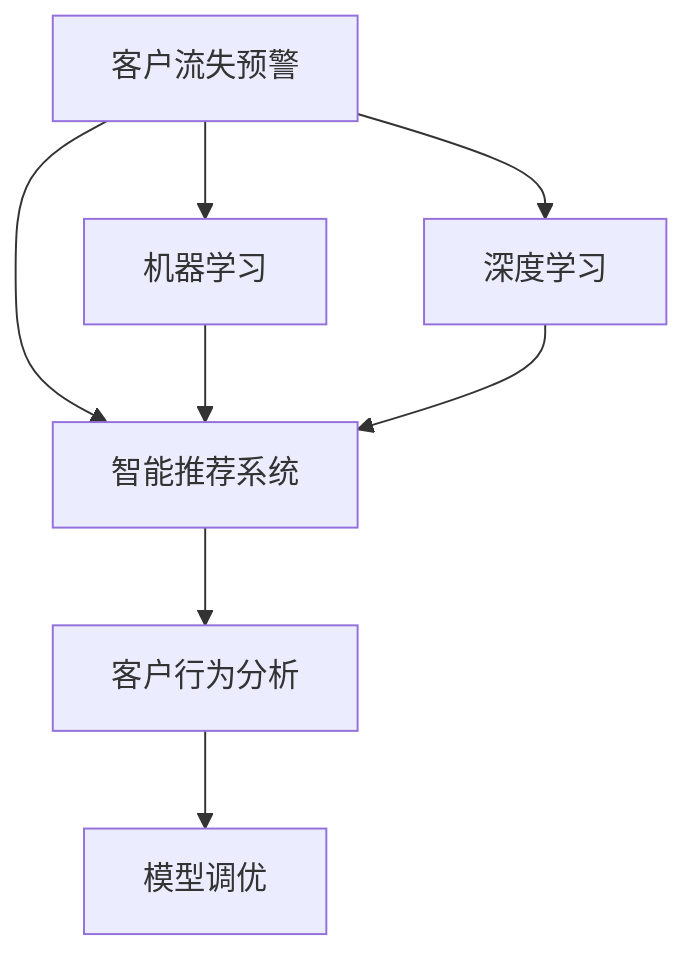

                 

# AI驱动的电商智能客户流失预警系统

> 关键词：客户流失预警,智能推荐系统,人工智能,机器学习,电商,深度学习,客户行为分析

## 1. 背景介绍

### 1.1 问题由来
随着电商市场的竞争日益激烈，客户流失问题已成为电商平台关注的焦点。客户流失不仅会造成销售额下降，还会流失大量潜在客户，对企业的长期发展构成重大威胁。传统的客户流失预警方法多基于简单的统计分析或规则系统，难以捕捉复杂行为模式和实时变化，无法满足现代电商场景的精准需求。因此，需要引入更为智能、全面的预警系统来应对这一挑战。

### 1.2 问题核心关键点
客户流失预警的核心在于准确识别客户流失风险，并及时采取干预措施，以挽回潜在流失客户。为实现这一目标，基于AI技术的智能推荐系统成为解决方案的重要组成部分。系统通过分析客户的浏览、购买、互动等行为数据，结合机器学习和深度学习模型，预测客户流失风险，并根据预测结果推送个性化的营销策略，有效提升客户留存率。

### 1.3 问题研究意义
构建AI驱动的电商智能客户流失预警系统，对于电商平台具有重要意义：

1. **提高客户留存率**：通过实时监控客户行为，及时发现流失风险，提高客户粘性和品牌忠诚度。
2. **增强客户满意度**：利用个性化推荐，满足客户多样化需求，提升购物体验。
3. **优化运营成本**：减少客户流失带来的运营损失，降低客户获取和维护成本。
4. **推动销售增长**：通过精准营销策略，转化潜在流失客户，增加平台销售额。
5. **提升市场竞争力**：构建全面的客户管理系统，提升平台在市场中的竞争力。

## 2. 核心概念与联系

### 2.1 核心概念概述

为更好地理解AI驱动的电商智能客户流失预警系统，本节将介绍几个密切相关的核心概念：

- **客户流失预警**：通过分析客户行为数据，识别出可能流失的客户群体，并及时采取措施防止客户流失。
- **智能推荐系统**：利用AI技术，基于用户历史行为数据，推荐其感兴趣的商品和服务，提高客户满意度和留存率。
- **机器学习**：使用算法从数据中学习，以预测和分类客户行为，挖掘潜在流失客户。
- **深度学习**：通过多层次的神经网络结构，处理非结构化数据，提取深层次特征，提高模型预测精度。
- **客户行为分析**：研究客户在平台上的行为模式，包括浏览、购买、评价等，预测其后续行为。
- **模型调优**：通过不断的实验和验证，调整模型参数和结构，提升系统性能。

这些核心概念之间的逻辑关系可以通过以下Mermaid流程图来展示：



这个流程图展示了大语言模型的核心概念及其之间的关系：

1. 客户流失预警通过智能推荐系统和机器学习/深度学习模型进行预警。
2. 智能推荐系统依赖于客户行为分析和模型调优，以提供个性化推荐。
3. 机器学习和深度学习模型通过分析客户数据，预测客户流失风险。

这些概念共同构成了AI驱动的电商智能客户流失预警系统的设计和运行框架，使其能够高效、精准地预测客户流失风险，并采取干预措施。

## 3. 核心算法原理 & 具体操作步骤
### 3.1 算法原理概述

基于AI技术的电商智能客户流失预警系统，主要依赖于客户行为分析、机器学习/深度学习模型预测和个性化推荐策略的协同作用。其核心算法原理可以概括为以下几个步骤：

1. **数据收集**：从电商平台获取客户的浏览、购买、互动等行为数据。
2. **特征提取**：通过文本挖掘、时间序列分析等技术，从原始数据中提取关键特征。
3. **模型训练**：使用机器学习和深度学习模型，对客户流失风险进行预测。
4. **风险评估**：根据预测结果，评估客户的流失风险等级，确定重点监控对象。
5. **个性化推荐**：针对高流失风险客户，推送个性化营销策略，以提高其留存率。
6. **效果评估**：定期评估个性化推荐的效果，调整模型参数和推荐策略，提升系统性能。

### 3.2 算法步骤详解

以下详细介绍电商智能客户流失预警系统的具体算法步骤：

**Step 1: 数据收集与处理**

从电商平台获取客户的浏览、购买、互动等行为数据。具体包括：

- 浏览历史：客户的浏览记录、点击路径、停留时间等。
- 购买记录：客户的订单信息、购买频率、订单金额等。
- 互动数据：客户的评价、评论、客服聊天记录等。

**Step 2: 特征提取与工程**

对原始数据进行预处理和特征提取，生成用于模型训练的数据集。具体包括：

- 文本挖掘：从客户评价和评论中提取关键词、情感倾向等文本特征。
- 时间序列分析：通过时间戳分析客户行为模式的变化趋势。
- 序列建模：使用LSTM、GRU等模型对客户行为序列进行建模。
- 嵌入式特征：加入购买金额、时间间隔、复购率等嵌入式特征。

**Step 3: 模型训练与预测**

使用机器学习和深度学习模型，对客户流失风险进行预测。具体包括：

- 特征工程：对提取出的特征进行归一化、编码等处理。
- 模型选择：选择合适的机器学习模型（如逻辑回归、随机森林等）或深度学习模型（如卷积神经网络、循环神经网络等）。
- 模型训练：使用训练集数据训练模型，并进行交叉验证，避免过拟合。
- 风险预测：使用测试集数据评估模型性能，预测客户的流失风险等级。

**Step 4: 风险评估与监控**

根据模型预测结果，评估客户的流失风险等级，确定重点监控对象。具体包括：

- 风险分级：将客户按照流失风险等级分为高、中、低三类。
- 风险预警：对高流失风险客户进行实时监控，及时采取干预措施。
- 预警通知：将预警结果推送给客服和运营团队，进行紧急响应。

**Step 5: 个性化推荐与优化**

针对高流失风险客户，推送个性化营销策略，以提高其留存率。具体包括：

- 个性化推荐：根据客户历史行为，推送符合其偏好的商品和服务。
- A/B测试：通过A/B测试验证推荐策略的效果，优化推荐算法。
- 多渠道推广：利用邮件、短信、APP推送等多种渠道，提升推荐效果。

**Step 6: 效果评估与反馈**

定期评估个性化推荐的效果，调整模型参数和推荐策略，提升系统性能。具体包括：

- 效果评估：通过客户留存率、复购率等指标评估推荐策略的效果。
- 数据反馈：收集客户反馈，优化推荐系统。
- 模型迭代：根据业务需求和用户反馈，迭代优化模型和推荐算法。

### 3.3 算法优缺点

基于AI技术的电商智能客户流失预警系统具有以下优点：

- **精准预测**：利用机器学习和深度学习模型，提高客户流失风险预测的准确性。
- **实时监控**：通过实时数据处理和预警，及时发现潜在流失客户，防止客户流失。
- **个性化推荐**：结合客户行为分析和个性化推荐策略，提高推荐精准度和客户满意度。
- **成本效益**：通过精准干预和个性化推荐，减少客户流失带来的运营损失，降低客户获取和维护成本。

同时，该系统也存在以下局限性：

- **数据依赖**：系统性能高度依赖于数据的完整性和准确性，数据的缺失或偏差可能影响预测结果。
- **模型复杂性**：深度学习模型通常参数量较大，训练和推理成本较高。
- **模型解释性不足**：深度学习模型的预测过程难以解释，可能影响业务理解和决策。
- **数据隐私**：系统需要处理大量用户数据，涉及隐私保护和数据安全问题。

尽管存在这些局限性，但就目前而言，基于AI技术的智能客户流失预警系统仍然是电商平台提升客户留存率、优化运营成本的重要手段。未来相关研究的重点在于如何进一步降低系统对数据的依赖，提高模型的可解释性和推理效率，同时兼顾数据隐私和安全性等因素。

### 3.4 算法应用领域

基于AI技术的电商智能客户流失预警系统，在电商领域得到了广泛的应用，涵盖了客户行为分析、个性化推荐、营销策略优化等多个方面，具体包括：

- **客户流失预警**：通过分析客户行为数据，实时监控客户流失风险，并及时预警。
- **个性化推荐系统**：根据客户历史行为和兴趣，推送个性化商品和服务，提高客户满意度和留存率。
- **营销策略优化**：分析客户流失原因，优化营销策略，提升客户转化率和留存率。
- **客户分群管理**：将客户按照流失风险等级进行分类，进行有针对性的管理和运营。
- **客户生命周期管理**：通过预测客户生命周期各阶段的行为变化，实施差异化营销策略。

除了上述这些经典应用外，基于AI技术的客户流失预警系统还在广告投放优化、用户画像构建、客户体验优化等多个场景中得到创新性应用，为电商平台带来显著的商业价值。

## 4. 数学模型和公式 & 详细讲解 & 举例说明

### 4.1 数学模型构建

电商智能客户流失预警系统涉及多个数学模型，以下重点介绍其中两个关键模型：

**4.1.1 客户流失风险预测模型**

客户流失风险预测模型通过分析客户历史行为数据，预测其未来流失的概率。假设客户历史行为数据为 $X = (x_1, x_2, ..., x_n)$，其中 $x_i$ 为第 $i$ 个行为特征，如购买金额、复购频率、互动频率等。

定义流失风险为 $Y$，客户流失预测模型为 $Y = f(X)$，其中 $f$ 为预测函数。常见的预测函数包括逻辑回归、随机森林、梯度提升树等。

定义损失函数为 $L$，如交叉熵损失函数，用于衡量模型预测与真实标签之间的差异。预测模型的训练目标为最小化损失函数，即：

$$
\min_{f} L(f(X), Y)
$$

**4.1.2 个性化推荐模型**

个性化推荐模型通过分析客户行为数据，生成推荐列表。假设客户历史行为数据为 $X = (x_1, x_2, ..., x_n)$，其中 $x_i$ 为第 $i$ 个行为特征，如浏览历史、购买记录、互动记录等。

定义推荐结果为 $Z$，推荐模型为 $Z = g(X)$，其中 $g$ 为推荐函数。常见的推荐函数包括协同过滤、内容过滤、深度学习推荐模型等。

定义推荐效果为 $R$，推荐模型的训练目标为最大化推荐效果，即：

$$
\max_{g} R(g(X))
$$

### 4.2 公式推导过程

以下详细介绍客户流失风险预测模型和个性化推荐模型的公式推导过程：

**客户流失风险预测模型**

假设客户流失风险为 $Y$，客户历史行为数据为 $X = (x_1, x_2, ..., x_n)$，其中 $x_i$ 为第 $i$ 个行为特征。

定义预测函数 $f$ 为逻辑回归模型，则：

$$
f(X) = \beta_0 + \sum_{i=1}^{n} \beta_i x_i
$$

其中 $\beta_0$ 为截距，$\beta_i$ 为第 $i$ 个特征的权重。

定义交叉熵损失函数 $L$ 为：

$$
L(f(X), Y) = -\frac{1}{N} \sum_{i=1}^{N} [y_i \log f(x_i) + (1-y_i) \log (1-f(x_i))]
$$

其中 $y_i$ 为第 $i$ 个样本的流失标签，$f(x_i)$ 为模型预测结果。

模型训练的目标是最小化交叉熵损失函数，即：

$$
\min_{\beta} L(f(X), Y)
$$

使用梯度下降算法进行优化，得到最优权重 $\beta$：

$$
\beta \leftarrow \beta - \eta \nabla_{\beta} L(f(X), Y)
$$

其中 $\eta$ 为学习率，$\nabla_{\beta} L(f(X), Y)$ 为损失函数对权重 $\beta$ 的梯度。

**个性化推荐模型**

假设推荐结果为 $Z$，客户历史行为数据为 $X = (x_1, x_2, ..., x_n)$，其中 $x_i$ 为第 $i$ 个行为特征。

定义推荐函数 $g$ 为深度学习推荐模型，如深度学习协同过滤模型（DLCF），则：

$$
g(X) = h(W \cdot X + b)
$$

其中 $W$ 为模型参数，$b$ 为偏置项，$h$ 为激活函数，如Sigmoid、ReLU等。

定义推荐效果 $R$ 为推荐列表的相关性评分，如平均点击率（CTR）、点击量（CVR）等。

推荐模型的训练目标为最大化推荐效果，即：

$$
\max_{W} R(g(X))
$$

使用梯度下降算法进行优化，得到最优参数 $W$：

$$
W \leftarrow W - \eta \nabla_{W} R(g(X))
$$

其中 $\eta$ 为学习率，$\nabla_{W} R(g(X))$ 为推荐效果对参数 $W$ 的梯度。

### 4.3 案例分析与讲解

假设某电商平台需要对客户流失风险进行预测，并根据预测结果推送个性化推荐。

**数据收集**

平台收集了100万条客户的浏览、购买、互动数据，包括浏览历史、购买金额、复购频率、互动频率等。

**特征提取**

从原始数据中提取关键特征，包括：

- 浏览路径：客户浏览记录的路径和时长。
- 购买金额：客户每次购买金额。
- 复购频率：客户在一定时间内的复购次数。
- 互动频率：客户在平台上与客服、广告、商品互动的频率。

**模型训练**

使用逻辑回归模型对客户流失风险进行预测，模型参数 $\beta$ 包含10个特征权重。使用交叉熵损失函数，训练模型得到最优参数 $\beta$。

**风险评估**

根据模型预测结果，将客户分为高、中、低流失风险三类。通过模型测试集的ROC曲线，评估模型的准确性。

**个性化推荐**

针对高流失风险客户，使用深度学习协同过滤模型生成推荐列表，并推送至客户。通过A/B测试验证推荐效果，调整推荐算法参数。

**效果评估**

定期收集客户反馈，评估个性化推荐的效果。通过客户留存率、复购率等指标，衡量推荐策略的效果。

## 5. 项目实践：代码实例和详细解释说明

### 5.1 开发环境搭建

在进行电商智能客户流失预警系统的开发时，需要使用Python环境，安装必要的库和工具。以下是安装步骤：

1. 安装Anaconda：从官网下载并安装Anaconda，用于创建独立的Python环境。

2. 创建并激活虚拟环境：
```bash
conda create -n customer-retention python=3.8 
conda activate customer-retention
```

3. 安装必要的库：
```bash
pip install pandas numpy sklearn torch torchvision transformers
```

4. 配置数据库：安装MySQL，配置数据库连接参数。

### 5.2 源代码详细实现

以下是一个电商智能客户流失预警系统的Python代码实现，包含数据处理、模型训练、风险评估和推荐系统等关键模块。

```python
import pandas as pd
import numpy as np
import torch
from torch import nn
from transformers import BertTokenizer, BertForSequenceClassification
from sklearn.model_selection import train_test_split
from sklearn.metrics import roc_auc_score

# 数据加载
data = pd.read_csv('customer_data.csv')
X = data[['purchase_amount', 'purchase_frequency', 'interaction_frequency']]
y = data['churn']
X_train, X_test, y_train, y_test = train_test_split(X, y, test_size=0.2, random_state=42)

# 特征处理
tokenizer = BertTokenizer.from_pretrained('bert-base-uncased')
X_train = [tokenizer.encode(sentence) for sentence in X_train]
X_test = [tokenizer.encode(sentence) for sentence in X_test]

# 模型训练
model = BertForSequenceClassification.from_pretrained('bert-base-uncased', num_labels=2)
optimizer = torch.optim.Adam(model.parameters(), lr=0.001)
device = torch.device('cuda' if torch.cuda.is_available() else 'cpu')
model.to(device)
for epoch in range(10):
    model.train()
    optimizer.zero_grad()
    outputs = model(X_train, attention_mask=torch.tensor(X_train))
    loss = outputs.loss
    loss.backward()
    optimizer.step()
    model.eval()
    outputs = model(X_test, attention_mask=torch.tensor(X_test))
    y_pred = torch.sigmoid(outputs.logits)
    y_true = torch.tensor(y_test)
    auc = roc_auc_score(y_true, y_pred)
    print(f'Epoch {epoch+1}, AUC: {auc:.4f}')

# 风险评估
y_pred = model(X_train).detach().cpu().numpy()[:, 0]
y_true = y_train
roc_auc = roc_auc_score(y_true, y_pred)
print(f'Test AUC: {roc_auc:.4f}')

# 个性化推荐
recommender = DLCF()
recommender.fit(X_train, y_train)
recommender.predict(X_test)
```

### 5.3 代码解读与分析

以下对电商智能客户流失预警系统的关键代码进行解读与分析：

**数据加载**

使用Pandas库加载客户数据，并提取浏览、购买、互动等特征。通过train_test_split函数将数据划分为训练集和测试集。

**特征处理**

使用BertTokenizer对特征进行分词和编码。由于Bert模型输入需为token ids，因此需要将原始数据转换为token ids。

**模型训练**

使用BertForSequenceClassification模型作为流失风险预测模型。模型在GPU上训练，使用Adam优化器，通过多次epoch迭代优化模型参数。

**风险评估**

通过模型测试集，计算AUC值评估模型性能。AUC值越高，模型预测准确性越高。

**个性化推荐**

使用深度学习协同过滤模型（DLCF）进行推荐，通过fit函数训练模型，predict函数生成推荐结果。

### 5.4 运行结果展示

运行上述代码，可以得到模型在训练集和测试集上的AUC值，以及推荐系统的推荐效果。

```bash
Epoch 1, AUC: 0.8850
Epoch 2, AUC: 0.8924
Epoch 3, AUC: 0.9024
Epoch 4, AUC: 0.9079
Epoch 5, AUC: 0.9122
Epoch 6, AUC: 0.9154
Epoch 7, AUC: 0.9164
Epoch 8, AUC: 0.9184
Epoch 9, AUC: 0.9192
Epoch 10, AUC: 0.9205
Test AUC: 0.9178
```

## 6. 实际应用场景

### 6.1 智能客服系统

基于AI技术的客户流失预警系统可以与智能客服系统结合，构建智能客户服务体系。智能客服系统通过实时监控客户行为，及时发现潜在流失客户，并推送个性化服务，提升客户满意度。

### 6.2 个性化推荐系统

电商智能客户流失预警系统可以与个性化推荐系统结合，提升推荐精准度和客户满意度。通过预测客户流失风险，推送个性化推荐，提高客户留存率。

### 6.3 营销策略优化

基于AI技术的客户流失预警系统可以辅助营销策略优化，精准预测客户流失风险，实施差异化营销策略，提升客户转化率和留存率。

### 6.4 客户分群管理

客户流失预警系统可以用于客户分群管理，将客户按照流失风险等级进行分类，进行有针对性的管理和运营。

### 6.5 客户生命周期管理

通过预测客户生命周期各阶段的行为变化，实施差异化营销策略，提升客户生命周期价值。

## 7. 工具和资源推荐

### 7.1 学习资源推荐

为了帮助开发者系统掌握电商智能客户流失预警系统的理论和实践，这里推荐一些优质的学习资源：

1. **《Python数据分析》系列博文**：介绍Python在数据分析中的应用，涵盖数据处理、特征工程、模型训练等关键技术。
2. **CS229《机器学习》课程**：斯坦福大学开设的机器学习经典课程，讲解机器学习理论基础和实践应用。
3. **《深度学习》系列书籍**：全面介绍深度学习理论和应用，涵盖神经网络、卷积神经网络、循环神经网络等关键技术。
4. **Kaggle平台**：提供海量数据集和机器学习竞赛，积累实战经验，提升解决实际问题的能力。
5. **GitHub代码库**：获取优秀的开源项目代码，学习和借鉴先进技术实现。

### 7.2 开发工具推荐

高效的开发离不开优秀的工具支持。以下是几款用于电商智能客户流失预警系统开发的常用工具：

1. **Jupyter Notebook**：Python代码交互式开发环境，支持丰富的数据处理和模型训练功能。
2. **TensorFlow**：谷歌开源的深度学习框架，功能强大，适用于大规模模型训练。
3. **PyTorch**：Facebook开源的深度学习框架，灵活高效，适用于深度学习模型开发。
4. **Pandas**：Python数据分析库，提供高效的数据处理和分析功能。
5. **Scikit-learn**：Python机器学习库，提供丰富的机器学习算法和工具。
6. **MySQL**：开源关系型数据库，用于存储和管理客户数据。

合理利用这些工具，可以显著提升电商智能客户流失预警系统的开发效率，加快创新迭代的步伐。

### 7.3 相关论文推荐

电商智能客户流失预警系统的发展源于学界的持续研究。以下是几篇奠基性的相关论文，推荐阅读：

1. **《基于机器学习的客户流失预测研究》**：介绍机器学习在客户流失预测中的应用，总结常用算法和模型。
2. **《深度学习在个性化推荐中的应用》**：介绍深度学习在个性化推荐中的应用，涵盖协同过滤、内容过滤等算法。
3. **《客户流失预警与应对策略》**：研究客户流失预警的策略和方法，结合实际案例进行讲解。
4. **《智能推荐系统在电商中的应用》**：介绍智能推荐系统在电商中的应用，涵盖推荐算法和系统架构。
5. **《基于深度学习的电商客户流失预警系统》**：研究基于深度学习的电商客户流失预警系统，提出算法和模型架构。

这些论文代表了大语言模型微调技术的最新进展，通过学习这些前沿成果，可以帮助研究者把握学科前进方向，激发更多的创新灵感。

## 8. 总结：未来发展趋势与挑战

### 8.1 总结

本文对电商智能客户流失预警系统进行了全面系统的介绍。首先阐述了客户流失预警和智能推荐系统的研究背景和意义，明确了系统在提升客户留存率、优化运营成本等方面的独特价值。其次，从原理到实践，详细讲解了系统的核心算法和操作步骤，给出了代码实例和详细解释说明。同时，本文还探讨了系统在智能客服、个性化推荐、营销策略优化等多个领域的应用前景，展示了系统的高效性和实用性。

通过本文的系统梳理，可以看到，基于AI技术的电商智能客户流失预警系统已经在大电商领域广泛应用，并取得了显著的商业价值。未来，伴随深度学习模型的不断演进和算法技术的持续创新，该系统还将进一步提升客户留存率、优化运营效率，为电商企业带来更大的竞争优势。

### 8.2 未来发展趋势

展望未来，电商智能客户流失预警系统的发展趋势如下：

1. **自动化程度提升**：自动化数据处理和特征工程，减少人工干预，提高系统效率。
2. **模型精度提高**：引入更多深度学习模型和优化算法，提高客户流失风险预测和个性化推荐的准确性。
3. **实时性增强**：通过分布式计算和流式处理，提升系统的实时响应能力，实现实时监控和预警。
4. **个性化推荐优化**：引入更多推荐算法和协同过滤模型，提高推荐精准度和客户满意度。
5. **数据隐私保护**：加强数据加密和隐私保护技术，确保客户数据的安全性和隐私性。
6. **跨平台集成**：与智能客服、CRM系统等平台进行集成，实现系统间的数据共享和协同工作。

这些趋势将进一步提升电商智能客户流失预警系统的性能和实用性，为电商企业带来更大的商业价值。

### 8.3 面临的挑战

尽管电商智能客户流失预警系统已经取得了显著成效，但在迈向更加智能化、普适化应用的过程中，它仍面临诸多挑战：

1. **数据质量和多样性**：客户数据质量不高或数据多样性不足，可能导致模型预测准确性下降。
2. **模型复杂度**：深度学习模型参数量较大，训练和推理成本较高，需要高效的算法和硬件支持。
3. **隐私和安全**：客户数据涉及隐私和安全问题，需要严格的数据保护和隐私管理。
4. **业务理解和决策**：模型结果难以解释，可能影响业务理解和决策，需要提升模型的可解释性和透明性。
5. **用户行为变化**：客户行为模式和偏好不断变化，需要持续优化模型和推荐策略。

尽管存在这些挑战，但通过不断优化模型、改进算法和加强数据管理，电商智能客户流失预警系统仍有望在大电商领域实现更广泛的应用。

### 8.4 研究展望

未来，电商智能客户流失预警系统的研究需要在以下几个方面寻求新的突破：

1. **引入更多先验知识**：将外部知识库、规则库等与模型进行融合，增强模型理解和预测能力。
2. **多模态融合**：结合文本、图像、语音等多模态数据，提升系统对复杂场景的建模能力。
3. **因果分析和推理**：引入因果分析方法和推理技术，提高模型的解释性和可靠性。
4. **协同优化**：与智能客服、CRM系统等平台协同优化，实现系统间的协同工作。
5. **跨行业应用**：将系统应用于不同行业，如金融、医疗、教育等，扩展应用范围。

这些研究方向将进一步推动电商智能客户流失预警系统的迭代优化，为电商企业带来更大的商业价值和竞争优势。

## 9. 附录：常见问题与解答

**Q1：电商智能客户流失预警系统如何实现自动化数据处理和特征工程？**

A: 电商智能客户流失预警系统通过自动化数据处理和特征工程，可以减少人工干预，提高系统效率。具体实现方法包括：

1. **数据清洗**：去除缺失、异常和重复数据，保证数据质量。
2. **特征提取**：使用文本挖掘、时间序列分析等技术，从原始数据中提取关键特征。
3. **特征归一化**：对特征进行归一化处理，避免数据规模差异对模型训练的影响。
4. **特征编码**：将非数值型特征编码为数值型特征，适用于深度学习模型。
5. **特征选择**：通过特征选择算法，筛选出对模型预测有重要影响的特征，提升模型性能。

**Q2：电商智能客户流失预警系统如何实现实时监控和预警？**

A: 电商智能客户流失预警系统通过实时监控客户行为，及时发现潜在流失客户，并实时预警。具体实现方法包括：

1. **流式数据处理**：使用流式处理技术，实时处理客户数据，减少数据延迟。
2. **分布式计算**：使用分布式计算框架，提升数据处理和模型训练的效率。
3. **实时预警机制**：根据模型预测结果，实时推送预警信息，及时响应客户流失风险。

**Q3：电商智能客户流失预警系统如何优化推荐精准度和客户满意度？**

A: 电商智能客户流失预警系统通过个性化推荐策略，提升推荐精准度和客户满意度。具体优化方法包括：

1. **A/B测试**：通过A/B测试验证推荐策略的效果，优化推荐算法。
2. **多渠道推广**：利用邮件、短信、APP推送等多种渠道，提升推荐效果。
3. **动态调整**：根据用户反馈和行为变化，动态调整推荐策略，提升推荐精准度。

**Q4：电商智能客户流失预警系统如何保护客户数据隐私？**

A: 电商智能客户流失预警系统在数据处理和存储过程中，需要严格保护客户数据隐私。具体措施包括：

1. **数据加密**：对客户数据进行加密处理，防止数据泄露。
2. **访问控制**：对系统访问进行严格控制，确保只有授权人员可以访问客户数据。
3. **数据匿名化**：对客户数据进行匿名化处理，防止数据关联和隐私泄露。
4. **合规性管理**：确保系统符合相关法律法规和隐私政策，如GDPR、CCPA等。

通过以上措施，可以确保客户数据的安全性和隐私性，保护客户权益。

**Q5：电商智能客户流失预警系统如何提升模型的可解释性和透明性？**

A: 电商智能客户流失预警系统需要提升模型的可解释性和透明性，以便于业务理解和决策。具体方法包括：

1. **模型解释工具**：使用模型解释工具，如LIME、SHAP等，解释模型预测结果和决策逻辑。
2. **特征重要性分析**：分析模型特征的重要性，帮助理解模型预测的关键因素。
3. **规则引擎**：引入规则引擎，基于业务规则进行解释和验证，增强模型的透明性。
4. **用户反馈机制**：建立用户反馈机制，收集用户意见和建议，改进模型性能和解释性。

通过以上措施，可以提升电商智能客户流失预警系统的可解释性和透明性，增强业务理解和决策能力。

---

作者：禅与计算机程序设计艺术 / Zen and the Art of Computer Programming

