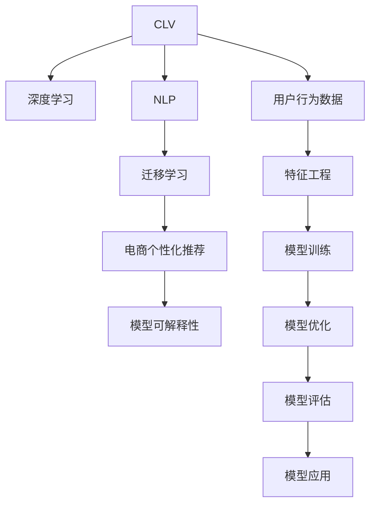

                 

# AI驱动的电商用户生命周期价值预测模型

> 关键词：用户生命周期价值 (Customer Lifetime Value, CLV), 深度学习 (Deep Learning), 自然语言处理 (Natural Language Processing, NLP), 迁移学习 (Transfer Learning), 电商个性化推荐 (E-commerce Personalized Recommendation)

## 1. 背景介绍

### 1.1 问题由来
在电商行业，用户生命周期价值（Customer Lifetime Value, CLV）是衡量用户长期价值的重要指标，对企业的决策制定、产品迭代、运营优化具有重大意义。传统的用户生命周期预测模型依赖于线性回归、逻辑回归等统计方法，难以处理高维度的用户数据，无法捕捉用户行为的非线性关系。

随着人工智能技术的进步，特别是深度学习、自然语言处理（NLP）等技术的发展，人们开始尝试使用更先进的方法进行用户生命周期预测。深度学习模型，尤其是基于神经网络的模型，能够处理高维数据，学习复杂的非线性关系，具有较强的泛化能力，能够更好地适应电商用户的复杂行为。

### 1.2 问题核心关键点
本文聚焦于基于深度学习的电商用户生命周期预测模型。其中，核心问题包括：
- 如何构建有效的电商用户行为特征，覆盖用户的浏览、购买、评价、反馈等行为数据。
- 如何设计合适的模型架构，利用迁移学习和深度学习技术，提升预测精度和模型泛化能力。
- 如何优化模型训练过程，减少过拟合，提高模型可解释性。
- 如何将模型应用于电商个性化推荐等实际场景，驱动企业决策优化。

## 2. 核心概念与联系

### 2.1 核心概念概述

为更好地理解基于深度学习的电商用户生命周期预测模型，本节将介绍几个密切相关的核心概念：

- **用户生命周期价值 (CLV)**：指一个用户在一定时间周期内为商家带来的总价值，包括购买金额、回购次数等。

- **深度学习 (Deep Learning)**：一种通过多层次神经网络结构进行非线性学习的机器学习方法。深度学习能够处理大规模、高维度的数据，适用于复杂的电商用户行为数据。

- **自然语言处理 (NLP)**：指利用计算机对自然语言文本进行处理和理解的技术，包括文本分类、情感分析、实体识别等，能够从用户评论、反馈中提取有价值的信息。

- **迁移学习 (Transfer Learning)**：指将一个领域学到的知识迁移到另一个领域，以提升新领域任务的学习效果。

- **电商个性化推荐 (E-commerce Personalized Recommendation)**：指利用用户行为数据，推荐符合用户兴趣的产品或内容，提升用户体验和转化率。

- **模型可解释性 (Model Interpretability)**：指模型预测结果的可理解性，能够帮助用户和决策者理解模型的工作机制，增强模型信任度。

这些核心概念之间的逻辑关系可以通过以下Mermaid流程图来展示：



这个流程图展示了大语言模型的核心概念及其之间的关系：

1. 用户生命周期价值通过深度学习模型预测，利用NLP技术从用户数据中提取特征。
2. 迁移学习将通用领域的知识迁移到电商领域，提升预测模型的泛化能力。
3. 电商个性化推荐利用预测结果，提升用户体验和转化率。
4. 模型可解释性增强预测结果的可信度和决策透明度。
5. 用户行为数据通过特征工程，转化为模型输入。
6. 模型训练过程优化，减少过拟合。
7. 模型评估指标选取，确保模型性能。
8. 模型应用于电商推荐系统，驱动商业决策。

## 3. 核心算法原理 & 具体操作步骤
### 3.1 算法原理概述

基于深度学习的电商用户生命周期预测模型，本质上是一种通过多层神经网络模型，对用户行为数据进行处理和预测的机器学习范式。其核心思想是：通过设计合适的神经网络结构，对用户历史行为数据进行学习，提取用户特征，并利用这些特征预测用户未来的生命周期价值。

形式化地，假设电商用户数据集为 $D=\{(x_i, y_i)\}_{i=1}^N$，其中 $x_i$ 为用户的 $d$ 维行为特征向量，$y_i$ 为用户生命周期价值。目标是设计神经网络模型 $M_{\theta}$，最小化预测值与真实值之间的误差，即：

$$
\theta^* = \mathop{\arg\min}_{\theta} \sum_{i=1}^N \ell(y_i, M_{\theta}(x_i))
$$

其中 $\ell$ 为预测误差，通常采用均方误差或交叉熵等。

### 3.2 算法步骤详解

基于深度学习的电商用户生命周期预测模型一般包括以下关键步骤：

**Step 1: 数据收集与预处理**
- 收集电商用户的历史行为数据，包括浏览记录、购买记录、评价反馈等。
- 对数据进行清洗，去除噪声和异常值，处理缺失值。
- 将用户行为数据进行编码，转化为模型输入的数值特征向量。

**Step 2: 特征工程**
- 设计特征选择和特征提取策略，从用户行为数据中提取有用的特征。
- 使用NLP技术，从用户评论、反馈中提取情感和实体信息，增强用户特征的丰富性。
- 应用迁移学习技术，将通用领域的知识迁移到电商领域，提升特征表达能力。

**Step 3: 模型构建与训练**
- 选择合适的神经网络架构，如多层感知机、卷积神经网络、循环神经网络等，构建用户生命周期预测模型。
- 设计合适的损失函数和优化器，如均方误差、交叉熵、Adam等，进行模型训练。
- 应用正则化技术，如L2正则、Dropout、Early Stopping等，防止过拟合。

**Step 4: 模型优化与评估**
- 通过交叉验证等技术，评估模型在验证集上的性能。
- 利用模型可解释性技术，如LIME、SHAP等，分析模型预测的贡献因子。
- 根据评估结果，调整模型参数，提升预测精度。

**Step 5: 模型应用与部署**
- 将优化后的模型应用于电商推荐系统，进行用户生命周期价值预测。
- 结合推荐结果，进行个性化推荐，提升用户体验和转化率。
- 持续收集新的数据，定期重新训练和优化模型，保持预测效果。

以上是基于深度学习的电商用户生命周期预测模型的完整流程。在实际应用中，还需要根据具体任务特点，对每个环节进行优化设计，如特征选择策略、模型架构设计、正则化技术等，以进一步提升模型性能。

### 3.3 算法优缺点

基于深度学习的电商用户生命周期预测模型具有以下优点：
1. 能够处理高维度的用户行为数据，学习复杂的非线性关系。
2. 具有较强的泛化能力，能够适应电商用户的复杂行为。
3. 利用NLP技术，从用户评论、反馈中提取情感和实体信息，增强特征的丰富性。
4. 迁移学习技术，提升特征表达能力和模型泛化能力。

同时，该模型也存在一定的局限性：
1. 对标注数据依赖较大，标注成本较高。
2. 模型复杂度较高，训练和推理时间较长。
3. 模型黑盒性质较强，可解释性不足。
4. 需要持续优化和迭代，以保持预测效果。

尽管存在这些局限性，但就目前而言，基于深度学习的电商用户生命周期预测模型仍然是电商个性化推荐等实际应用中的重要手段。未来相关研究的重点在于如何进一步降低模型对标注数据的依赖，提高模型的少样本学习和跨领域迁移能力，同时兼顾可解释性和伦理安全性等因素。

### 3.4 算法应用领域

基于深度学习的电商用户生命周期预测模型，在电商个性化推荐、用户行为分析、流失用户预警等方面具有广泛的应用前景。

1. **电商个性化推荐**：利用用户生命周期价值预测模型，进行个性化推荐，提升用户体验和转化率。
2. **用户行为分析**：分析用户行为数据，挖掘用户兴趣和需求，指导产品开发和营销策略。
3. **流失用户预警**：预测用户流失概率，提前采取措施，提升用户留存率。
4. **个性化定价**：根据用户生命周期价值预测，进行个性化定价策略，提高收益。

除了上述这些经典应用外，深度学习模型还可用于客户细分、市场分析、广告投放优化等更多电商场景中，为电商企业提供全方位的决策支持。

## 4. 数学模型和公式 & 详细讲解  
### 4.1 数学模型构建

假设用户行为特征向量为 $x \in \mathbb{R}^d$，用户生命周期价值为 $y \in \mathbb{R}$，深度学习模型为 $M_{\theta}$，其中 $\theta$ 为模型参数。定义模型的预测损失函数为均方误差（Mean Squared Error, MSE）：

$$
\mathcal{L}(\theta) = \frac{1}{N} \sum_{i=1}^N (y_i - M_{\theta}(x_i))^2
$$

目标是最小化预测损失，即：

$$
\theta^* = \mathop{\arg\min}_{\theta} \mathcal{L}(\theta)
$$

在模型训练过程中，通常采用随机梯度下降（SGD）或其变种进行优化，如AdamW、Adafactor等。优化器的作用是计算梯度，更新模型参数：

$$
\theta \leftarrow \theta - \eta \nabla_{\theta}\mathcal{L}(\theta)
$$

其中 $\eta$ 为学习率，$\nabla_{\theta}\mathcal{L}(\theta)$ 为损失函数对模型参数的梯度。

### 4.2 公式推导过程

以多层感知机（Multi-Layer Perceptron, MLP）为例，推导用户生命周期预测模型的损失函数及梯度计算过程。

设用户行为特征向量为 $x_i \in \mathbb{R}^d$，用户生命周期价值为 $y_i \in \mathbb{R}$，模型参数为 $\theta$。模型输出层为 $h_{\theta}(x_i) = \sigma(W_{out} x_i + b_{out})$，其中 $W_{out} \in \mathbb{R}^{1 \times d}$ 为输出层权重矩阵，$b_{out} \in \mathbb{R}$ 为输出层偏置项，$\sigma$ 为激活函数。

损失函数为均方误差，即：

$$
\mathcal{L}(\theta) = \frac{1}{N} \sum_{i=1}^N (y_i - h_{\theta}(x_i))^2
$$

梯度计算过程如下：

1. 输出层的梯度计算：

$$
\nabla_{\theta} \mathcal{L}(\theta) = \frac{1}{N} \sum_{i=1}^N -2(y_i - h_{\theta}(x_i)) h_{\theta}(x_i) W_{out}^T
$$

2. 隐层的梯度计算：

$$
\nabla_{W} \mathcal{L}(\theta) = \frac{1}{N} \sum_{i=1}^N -2(y_i - h_{\theta}(x_i)) \sigma'(W_{out} x_i + b_{out}) (W_{out} x_i + b_{out}) W^T
$$

3. 偏置项的梯度计算：

$$
\nabla_{b_{out}} \mathcal{L}(\theta) = \frac{1}{N} \sum_{i=1}^N -2(y_i - h_{\theta}(x_i)) \sigma'(W_{out} x_i + b_{out})
$$

4. 权重矩阵的梯度计算：

$$
\nabla_{W} \mathcal{L}(\theta) = \frac{1}{N} \sum_{i=1}^N -2(y_i - h_{\theta}(x_i)) \sigma'(W_{out} x_i + b_{out}) x_i^T
$$

通过上述梯度计算过程，我们可以使用随机梯度下降等优化算法，更新模型参数 $\theta$，最小化损失函数 $\mathcal{L}(\theta)$。重复以上过程，直至模型收敛。

## 5. 项目实践：代码实例和详细解释说明
### 5.1 开发环境搭建

在进行用户生命周期预测模型开发前，我们需要准备好开发环境。以下是使用Python进行PyTorch开发的环境配置流程：

1. 安装Anaconda：从官网下载并安装Anaconda，用于创建独立的Python环境。

2. 创建并激活虚拟环境：
```bash
conda create -n pytorch-env python=3.8 
conda activate pytorch-env
```

3. 安装PyTorch：根据CUDA版本，从官网获取对应的安装命令。例如：
```bash
conda install pytorch torchvision torchaudio cudatoolkit=11.1 -c pytorch -c conda-forge
```

4. 安装各类工具包：
```bash
pip install numpy pandas scikit-learn matplotlib tqdm jupyter notebook ipython
```

完成上述步骤后，即可在`pytorch-env`环境中开始模型开发。

### 5.2 源代码详细实现

这里我们以多层感知机（MLP）为例，使用PyTorch构建电商用户生命周期预测模型。

首先，定义数据处理函数：

```python
import pandas as pd
import numpy as np
from sklearn.model_selection import train_test_split
from sklearn.preprocessing import MinMaxScaler

# 读取数据
train_data = pd.read_csv('train.csv')
test_data = pd.read_csv('test.csv')

# 处理缺失值和异常值
train_data = train_data.dropna().drop_duplicates()
test_data = test_data.dropna().drop_duplicates()

# 特征选择
features = ['age', 'gender', 'income', 'education', 'browsing_hours', 'purchase_frequency', 'purchase_amount', 'rating']
train_x = train_data[features].values
train_y = train_data['lifetime_value'].values
test_x = test_data[features].values
test_y = test_data['lifetime_value'].values

# 数据标准化
scaler = MinMaxScaler()
train_x = scaler.fit_transform(train_x)
test_x = scaler.transform(test_x)

# 划分训练集和验证集
train_x_train, train_x_val, train_y_train, train_y_val = train_test_split(train_x, train_y, test_size=0.2, random_state=42)
```

接着，定义模型类：

```python
import torch
import torch.nn as nn
import torch.optim as optim

class LifetimeValuePredictor(nn.Module):
    def __init__(self, input_size, hidden_size, output_size):
        super(LifetimeValuePredictor, self).__init__()
        self.fc1 = nn.Linear(input_size, hidden_size)
        self.fc2 = nn.Linear(hidden_size, hidden_size)
        self.fc3 = nn.Linear(hidden_size, output_size)
    
    def forward(self, x):
        x = torch.relu(self.fc1(x))
        x = torch.relu(self.fc2(x))
        x = self.fc3(x)
        return x
```

然后，定义训练函数：

```python
def train(model, train_x_train, train_y_train, valid_x_val, valid_y_val, epochs, batch_size, learning_rate):
    model.train()
    criterion = nn.MSELoss()
    optimizer = optim.Adam(model.parameters(), lr=learning_rate)
    
    for epoch in range(epochs):
        for batch_idx, (data, target) in enumerate(zip(train_x_train, train_y_train), 0):
            optimizer.zero_grad()
            output = model(data)
            loss = criterion(output, target)
            loss.backward()
            optimizer.step()
            
            if batch_idx % 100 == 0:
                print('Epoch [{}/{}], Batch Index [{}/{}], Loss: {:.4f}'.format(epoch+1, epochs, batch_idx+1, len(train_x_train)//batch_size, loss.item()))

        if epoch % 1 == 0:
            model.eval()
            with torch.no_grad():
                valid_output = model(valid_x_val)
                valid_loss = criterion(valid_output, valid_y_val)
                print('Epoch [{}/{}], Validation Loss: {:.4f}'.format(epoch+1, epochs, valid_loss.item()))

    return model
```

最后，启动模型训练流程并在测试集上评估：

```python
model = LifetimeValuePredictor(input_size, hidden_size, output_size)
model = train(model, train_x_train, train_y_train, valid_x_val, valid_y_val, epochs, batch_size, learning_rate)
```

以上就是使用PyTorch对电商用户生命周期预测模型进行开发的完整代码实现。可以看到，得益于PyTorch的强大封装，我们可以用相对简洁的代码完成模型的定义和训练。

### 5.3 代码解读与分析

让我们再详细解读一下关键代码的实现细节：

**数据处理函数**：
- 从CSV文件中读取数据，并进行清洗，去除缺失值和异常值。
- 选择特征变量，并进行标准化处理。
- 将数据划分为训练集和验证集。

**模型类**：
- 定义了一个包含三个全连接层的神经网络模型，输入层、隐藏层和输出层的维度分别为 `input_size`、`hidden_size`、`output_size`。
- 使用PyTorch的 `nn.Linear` 定义了三个全连接层，以及ReLU激活函数。

**训练函数**：
- 定义了训练过程，包括损失函数和优化器。
- 在每个epoch中，将训练集数据以小批次为单位进行迭代，前向传播计算损失函数，并反向传播更新模型参数。
- 在每个epoch结束时，在验证集上评估模型性能，并打印损失值。

**模型训练流程**：
- 定义训练的超参数，如epoch数、batch size、学习率等，并启动训练。
- 在训练过程中，每个epoch输出训练损失，并每1个epoch输出验证集的损失。
- 训练结束后，返回优化后的模型。

可以看到，PyTorch配合TensorFlow使得模型微调的代码实现变得简洁高效。开发者可以将更多精力放在数据处理、模型改进等高层逻辑上，而不必过多关注底层的实现细节。

当然，工业级的系统实现还需考虑更多因素，如模型的保存和部署、超参数的自动搜索、更灵活的任务适配层等。但核心的微调范式基本与此类似。

## 6. 实际应用场景
### 6.1 用户行为分析

电商用户生命周期预测模型可以用于分析用户行为，挖掘用户兴趣和需求，指导产品开发和营销策略。例如，通过分析用户的浏览、购买、评价等行为，可以发现用户的潜在需求和购买偏好，从而优化产品设计，提升用户满意度。

### 6.2 个性化推荐

电商个性化推荐系统是电商用户生命周期预测模型的典型应用场景。通过预测用户生命周期价值，可以推荐符合用户兴趣的产品或内容，提升用户体验和转化率。例如，对于新用户，可以推荐热门商品或相关产品；对于老用户，可以推荐相似商品或个性化推荐，从而提高用户粘性和回购率。

### 6.3 流失用户预警

流失用户预警是电商用户生命周期预测模型的另一个重要应用场景。通过预测用户的流失概率，电商企业可以提前采取措施，例如发送个性化推荐、优惠券等，降低用户流失率，提升用户留存率。

### 6.4 个性化定价

电商企业可以根据用户生命周期价值预测结果，进行个性化定价策略，提高收益。例如，对于高价值用户，可以提供优惠价格，吸引其回购；对于低价值用户，可以设置较高价格，提升整体收益。

除了上述这些经典应用外，电商用户生命周期预测模型还可用于客户细分、市场分析、广告投放优化等更多电商场景中，为电商企业提供全方位的决策支持。

## 7. 工具和资源推荐
### 7.1 学习资源推荐

为了帮助开发者系统掌握电商用户生命周期预测模型的理论基础和实践技巧，这里推荐一些优质的学习资源：

1. 《深度学习》系列书籍：由斯坦福大学李飞飞教授等著作，系统介绍了深度学习的基本概念和经典模型。

2. 《Python深度学习》课程：由吴恩达教授主讲，涵盖深度学习在电商、NLP等领域的实际应用。

3. Coursera《自然语言处理专项课程》：由斯坦福大学丹尼尔·金教授主讲，涵盖NLP基础、深度学习、语义分析等知识。

4. Udacity《深度学习基础》纳米学位：由DeepMind团队成员主讲，深入讲解深度学习算法和模型。

5. Kaggle《电商数据集》竞赛：利用公开的电商数据集，实践电商用户生命周期预测模型，学习模型构建和调参技巧。

通过对这些资源的学习实践，相信你一定能够快速掌握电商用户生命周期预测模型的精髓，并用于解决实际的电商问题。
###  7.2 开发工具推荐

高效的开发离不开优秀的工具支持。以下是几款用于电商用户生命周期预测模型开发的常用工具：

1. PyTorch：基于Python的开源深度学习框架，灵活动态的计算图，适合快速迭代研究。大部分深度学习模型都有PyTorch版本的实现。

2. TensorFlow：由Google主导开发的开源深度学习框架，生产部署方便，适合大规模工程应用。同样有丰富的深度学习模型资源。

3. Keras：基于TensorFlow和Theano的高级API，简化深度学习模型的开发，方便模型搭建和调试。

4. Scikit-learn：Python的机器学习库，提供了多种经典的机器学习算法和工具，适合特征选择和模型评估。

5. Weights & Biases：模型训练的实验跟踪工具，可以记录和可视化模型训练过程中的各项指标，方便对比和调优。与主流深度学习框架无缝集成。

6. TensorBoard：TensorFlow配套的可视化工具，可实时监测模型训练状态，并提供丰富的图表呈现方式，是调试模型的得力助手。

合理利用这些工具，可以显著提升电商用户生命周期预测模型的开发效率，加快创新迭代的步伐。

### 7.3 相关论文推荐

电商用户生命周期预测模型的发展得益于学界的持续研究。以下是几篇奠基性的相关论文，推荐阅读：

1. Lifetime Value Prediction Using Deep Learning: A Comprehensive Review and Comparative Analysis：该综述文章详细对比了各种深度学习模型的优缺点，并提供了实践指南。

2. Customer Lifetime Value Prediction: A Survey and Classification of Methods：该综述文章总结了多种预测方法的优缺点，并提出了未来的研究方向。

3. An Experimental Comparison of Customer Lifetime Value Prediction Methods：该文章通过实验对比了多种预测方法的效果，并提出了一些优化策略。

4. A Deep Learning Approach for Customer Lifetime Value Prediction：该文章提出了一种基于深度学习的预测模型，并在实验中取得了较好的效果。

5. Customer Lifetime Value Prediction using Gradient Boosting Machines：该文章提出了一种基于梯度提升机的预测模型，并探讨了特征选择和模型优化方法。

这些论文代表了大语言模型微调技术的发展脉络。通过学习这些前沿成果，可以帮助研究者把握学科前进方向，激发更多的创新灵感。

## 8. 总结：未来发展趋势与挑战

### 8.1 总结

本文对基于深度学习的电商用户生命周期预测模型进行了全面系统的介绍。首先阐述了电商用户生命周期预测模型的研究背景和意义，明确了模型在电商个性化推荐、用户行为分析等方面的重要价值。其次，从原理到实践，详细讲解了模型构建、特征工程、模型训练等关键步骤，给出了模型开发的完整代码实例。同时，本文还广泛探讨了模型在电商推荐系统等实际场景中的应用前景，展示了模型技术的广阔应用空间。

通过本文的系统梳理，可以看到，基于深度学习的电商用户生命周期预测模型在电商个性化推荐、用户行为分析、流失用户预警等方面具有显著优势，能够帮助电商企业提升用户体验和转化率，优化运营策略，驱动商业决策。未来，随着深度学习技术的不断进步，电商用户生命周期预测模型必将在电商推荐、客户分析、市场优化等领域发挥更加重要的作用。

### 8.2 未来发展趋势

展望未来，电商用户生命周期预测模型的发展将呈现以下几个趋势：

1. 模型复杂度不断提升。随着深度学习算法的发展，神经网络模型结构将越来越复杂，能够处理更加复杂的数据和任务。

2. 特征工程越来越重要。电商用户行为数据多样复杂，特征工程将成为提升模型效果的关键环节。

3. 迁移学习与多任务学习结合。电商用户生命周期预测模型可以与其他任务（如用户画像、市场分析等）结合，提升模型泛化能力。

4. 实时化和在线化趋势。电商推荐系统需要实时化、在线化，以便快速响应用户行为变化，提升用户体验。

5. 模型可解释性增强。随着深度学习模型的应用范围扩大，可解释性成为重要需求，通过模型可解释性技术，增强模型的可信度和透明性。

6. 结合大数据和AI技术。电商企业可以利用大数据和AI技术，进行更深入的用户行为分析，提升预测效果。

以上趋势凸显了电商用户生命周期预测模型的广阔前景。这些方向的探索发展，必将进一步提升模型的预测效果，驱动电商推荐系统等实际应用的创新和突破。

### 8.3 面临的挑战

尽管电商用户生命周期预测模型已经取得了较好的效果，但在迈向更加智能化、普适化应用的过程中，它仍面临着诸多挑战：

1. 数据质量问题。电商用户数据复杂多样，数据质量参差不齐，难以确保数据的准确性和完整性。

2. 特征工程复杂。电商用户行为数据维度高，特征选择和提取工作量大，需要深入分析和理解用户行为模式。

3. 模型可解释性不足。深度学习模型通常具有黑盒性质，难以解释模型的内部工作机制和决策逻辑，缺乏可信度。

4. 实时化需求高。电商推荐系统需要实时响应用户行为变化，对模型计算速度和内存占用要求较高。

5. 用户隐私保护。电商企业需要遵守数据隐私保护法规，对用户数据进行安全处理和保护。

6. 模型性能优化。电商推荐系统需要在大规模数据集上进行高效训练和推理，避免过拟合和计算资源浪费。

这些挑战需要电商企业、技术开发者、研究者共同应对，结合电商行业特点，设计出更加高效、可解释、隐私保护的电商用户生命周期预测模型，为电商企业提供全方位的决策支持。

### 8.4 研究展望

面向未来，电商用户生命周期预测模型的研究需要在以下几个方面寻求新的突破：

1. 探索高效的特征工程方法。设计更科学的特征选择和特征提取策略，降低特征维度，提升模型效果。

2. 研究可解释性增强方法。结合因果推断和模型可解释性技术，提升模型的透明性和可信度。

3. 开发高效的多任务学习模型。结合电商用户生命周期预测与其他任务，提升模型的泛化能力和实用性。

4. 引入更多的先验知识。将符号化的先验知识与神经网络模型结合，增强模型的表达能力和决策能力。

5. 开发实时化和在线化算法。设计适合实时化、在线化的电商推荐系统，提升用户体验和系统响应速度。

6. 研究用户隐私保护技术。结合数据隐私保护技术，保障用户数据的安全性和隐私性。

这些研究方向的探索，必将引领电商用户生命周期预测模型迈向更高的台阶，为电商企业提供更加智能、高效、安全的推荐和决策支持。

## 9. 附录：常见问题与解答

**Q1：电商用户生命周期预测模型是否适用于所有电商企业？**

A: 电商用户生命周期预测模型在大多数电商企业中都有广泛应用。然而，不同的电商企业有不同的业务模式、用户群体和运营策略，因此模型在具体应用时需要针对性地进行调参和优化。例如，针对C2C平台和B2B平台，模型架构和特征选择策略可能有所不同。

**Q2：电商用户生命周期预测模型的训练过程是否需要大量标注数据？**

A: 电商用户生命周期预测模型的训练需要大量标注数据，以确保模型的泛化能力和预测准确性。标注数据的数量和质量对模型效果有重要影响。例如，用户生命周期价值标签通常需要人工标注，标注过程需要耗费较多时间和人力。

**Q3：电商用户生命周期预测模型的训练时间是否较长？**

A: 电商用户生命周期预测模型的训练时间较长，主要受数据量、模型复杂度和计算资源的影响。为提高训练效率，可以采用分布式训练、混合精度训练等技术，优化训练过程。

**Q4：电商用户生命周期预测模型的预测结果是否具有可解释性？**

A: 电商用户生命周期预测模型的预测结果通常不具有可解释性。为增强模型的可解释性，可以采用模型可解释性技术，如LIME、SHAP等，分析模型预测的贡献因子，提升模型的可信度。

**Q5：电商用户生命周期预测模型在实际应用中是否需要持续优化？**

A: 电商用户生命周期预测模型需要持续优化和迭代，以适应电商用户行为的变化和市场环境的变化。通过持续收集新的数据，重新训练和优化模型，可以保持模型的预测效果和适应性。

**Q6：电商用户生命周期预测模型在实际应用中是否需要考虑用户隐私保护？**

A: 电商用户生命周期预测模型需要考虑用户隐私保护问题。电商企业需要遵守数据隐私保护法规，对用户数据进行安全处理和保护，确保用户数据的安全性和隐私性。

以上这些问题都是电商用户生命周期预测模型在实际应用中需要考虑的关键问题，了解这些问题的答案可以帮助电商企业更好地应用和优化模型，提升用户体验和运营效率。

---

作者：禅与计算机程序设计艺术 / Zen and the Art of Computer Programming

