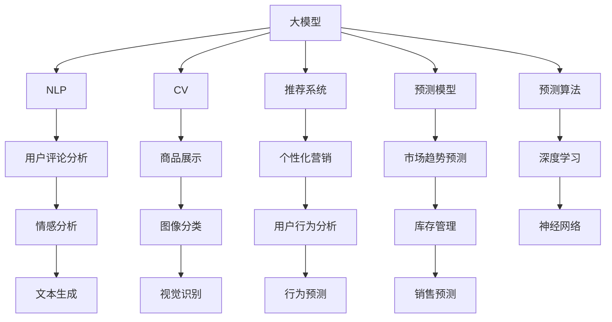

                 

# AI驱动的电商趋势预测：大模型的优势

> 关键词：AI驱动, 电商趋势预测, 大模型, 深度学习, 自然语言处理(NLP), 计算机视觉(CV), 推荐系统, 预测模型, 预测算法

## 1. 背景介绍

### 1.1 问题由来

电商行业正处在快速变革的时期，消费者需求和市场环境不断变化。电商平台需要实时把握市场动态，预测未来趋势，以便更好地制定经营策略。然而，传统的统计和经验驱动的方法往往难以应对数据复杂性和实时性要求，难以适应快速变化的电商市场。

在这一背景下，人工智能和大模型成为了电商趋势预测的重要工具。利用深度学习和大模型，电商企业可以从海量数据中挖掘出趋势和规律，实现更为精准、高效的预测分析。

### 1.2 问题核心关键点

大模型在电商趋势预测中发挥着至关重要的作用。以下是其中的几个关键点：

- **数据复杂性**：电商平台的数据类型多样，包括用户行为、产品属性、市场环境等，数据的非结构化和复杂性对预测模型提出了高要求。
- **实时性要求**：电商平台的决策需要快速响应市场变化，预测模型需要具备实时更新和快速推理的能力。
- **准确性**：预测模型的准确性直接影响电商平台的经营策略和盈利能力，必须尽可能准确地预测未来趋势。
- **可解释性**：电商决策者需要对预测结果进行理解，大模型的可解释性是其应用的重要前提。

大模型的应用，使得电商趋势预测具备了数据复杂性处理、实时性、准确性和可解释性等优势，极大地提升了预测的效率和准确度。

### 1.3 问题研究意义

电商趋势预测对于电商平台至关重要，不仅关系到市场定位和产品规划，还影响到企业的盈利能力和市场竞争力。利用大模型进行预测，可以显著提升预测精度和响应速度，帮助企业把握市场机会，避免市场风险。

大模型的应用使得电商趋势预测变得更加科学和客观，避免了传统方法的主观偏差，为电商企业提供了更为可靠的市场预测工具。同时，大模型还可以帮助企业理解预测结果背后的逻辑和机制，增强决策的可解释性，提高电商决策的质量。

## 2. 核心概念与联系

### 2.1 核心概念概述

为了更好地理解AI驱动的电商趋势预测，本节将介绍几个关键概念及其之间的联系：

- **大模型**：指在大规模数据上预训练得到的深度学习模型，如BERT、GPT等。这些模型具备强大的语义理解能力，能够在电商领域中挖掘出隐藏的模式和规律。

- **自然语言处理(NLP)**：指处理、分析和生成自然语言的技术。在电商趋势预测中，NLP可以用于文本数据的处理和分析，如用户评论分析、广告语生成等。

- **计算机视觉(CV)**：指处理、分析和生成视觉数据的算法和技术。电商趋势预测中，CV可以用于图像和视频数据的处理，如商品展示和分类。

- **推荐系统**：指根据用户行为和偏好推荐商品和服务的系统。电商企业可以利用推荐系统进行个性化营销和推荐，提高用户体验和转化率。

- **预测模型**：指用于预测未来趋势的机器学习模型，包括回归模型、分类模型、序列模型等。电商企业可以利用预测模型进行市场趋势预测和库存管理。

- **预测算法**：指用于训练和优化预测模型的算法，如随机森林、神经网络、深度学习等。大模型可以作为预测算法的核心组成部分，提升预测性能。

这些概念之间的逻辑关系可以通过以下Mermaid流程图来展示：



这个流程图展示了各个概念之间的联系：

1. 大模型在电商领域可以用于NLP、CV等多个任务。
2. NLP可以帮助分析用户评论和广告语等文本数据。
3. CV可以处理商品展示和分类等视觉数据。
4. 推荐系统通过分析用户行为进行个性化推荐。
5. 预测模型可以对市场趋势进行预测，辅助决策。
6. 预测算法（如深度学习）可以训练和优化预测模型。
7. NLP中的情感分析可以提升广告语生成质量。
8. CV中的图像分类可以帮助商品展示优化。
9. 推荐系统中的行为预测可以提升个性化营销效果。
10. 预测模型中的市场趋势预测可以辅助库存管理。

通过理解这些核心概念及其联系，我们可以更好地把握AI驱动的电商趋势预测框架和实施步骤。

## 3. 核心算法原理 & 具体操作步骤

### 3.1 算法原理概述

AI驱动的电商趋势预测主要基于大模型进行预测，其核心思想是通过大规模预训练模型，从电商平台的数据中挖掘出隐藏的模式和规律，并用于预测未来趋势。

形式化地，假设电商平台的数据集为 $D=\{(x_i,y_i)\}_{i=1}^N, x_i \in \mathcal{X}, y_i \in \mathcal{Y}$，其中 $\mathcal{X}$ 为输入空间，$\mathcal{Y}$ 为输出空间。设 $M$ 为大模型，其输出为 $\hat{y}=M(x)$。则电商趋势预测的目标是最小化预测误差，即：

$$
\min_{M} \mathcal{L}(\hat{y},y)
$$

其中 $\mathcal{L}$ 为损失函数，常用的包括均方误差、交叉熵等。

### 3.2 算法步骤详解

AI驱动的电商趋势预测一般包括以下几个关键步骤：

**Step 1: 准备数据集和预训练模型**

- 收集电商平台的各类数据，如用户行为、商品属性、市场环境等，划分为训练集、验证集和测试集。
- 选择合适的预训练大模型 $M$，如BERT、GPT等，作为初始化参数。

**Step 2: 数据预处理**

- 对输入数据进行预处理，包括文本清洗、特征提取、缺失值处理等，确保数据的质量和一致性。
- 将数据集转化为模型所需的格式，如TensorFlow、PyTorch等。

**Step 3: 模型训练和微调**

- 将预训练模型 $M$ 作为初始参数，在电商数据集上继续进行微调训练。
- 使用合适的优化算法（如Adam、SGD等）和正则化技术（如L2正则、Dropout等），避免过拟合。
- 在训练过程中，周期性在验证集上评估模型性能，根据性能指标决定是否触发Early Stopping。
- 重复上述步骤直到满足预设的迭代轮数或Early Stopping条件。

**Step 4: 模型评估和部署**

- 在测试集上评估微调后模型 $M_{\hat{\theta}}$ 的性能，对比微调前后的精度提升。
- 使用微调后的模型对新数据进行推理预测，集成到实际的应用系统中。
- 持续收集新的数据，定期重新微调模型，以适应数据分布的变化。

### 3.3 算法优缺点

AI驱动的电商趋势预测具有以下优点：

- **泛化能力强**：大模型在电商领域的泛化能力较强，能够处理多源异构数据，挖掘出隐藏的模式和规律。
- **实时性好**：大模型可以通过在线学习实时更新，快速适应市场变化。
- **预测精度高**：大模型具备强大的表征能力和学习能力，能够实现高精度的预测。
- **可解释性强**：大模型可以输出预测结果的解释，帮助电商决策者理解预测背后的逻辑和机制。

同时，该方法也存在一些局限性：

- **数据依赖性强**：预测模型的性能高度依赖于电商平台的数据质量和数量。
- **计算资源需求高**：大模型的训练和推理需要大量的计算资源，对于小型电商平台可能存在成本压力。
- **过拟合风险高**：电商数据的多样性和复杂性增加了过拟合的风险，需要采取合适的正则化策略。
- **模型的解释性不足**：大模型的黑盒特性可能导致其决策过程难以解释，电商决策者需要结合人工干预和审核。

尽管存在这些局限性，但大模型在电商趋势预测中的应用前景广阔，已广泛应用于商品推荐、库存管理、广告优化等多个领域。

### 3.4 算法应用领域

AI驱动的电商趋势预测已广泛应用于以下几个领域：

- **商品推荐**：通过分析用户历史行为和偏好，推荐相关商品，提升用户体验和转化率。
- **库存管理**：预测商品的销售趋势，优化库存水平，减少缺货和积压。
- **广告优化**：预测广告点击率，优化广告投放策略，提高广告投放的效率和效果。
- **市场分析**：分析市场趋势和变化，为电商决策提供数据支持。
- **客户行为分析**：分析客户行为和偏好，制定个性化营销策略。

此外，AI驱动的电商趋势预测还被应用于供应链管理、风险控制、客户流失预警等更多场景中，为电商企业的数字化转型提供了有力的技术支撑。

## 4. 数学模型和公式 & 详细讲解 & 举例说明

### 4.1 数学模型构建

在大模型应用于电商趋势预测时，常用的数学模型包括线性回归模型、神经网络模型和深度学习模型。以线性回归模型为例，假设电商数据集为 $D=\{(x_i,y_i)\}_{i=1}^N, x_i \in \mathbb{R}^d, y_i \in \mathbb{R}$，则线性回归模型的目标是最小化预测误差：

$$
\min_{\theta} \sum_{i=1}^N (y_i - \theta^T x_i)^2
$$

其中 $\theta$ 为模型参数，$x_i$ 为输入特征，$y_i$ 为输出标签。

### 4.2 公式推导过程

线性回归模型的梯度下降更新公式为：

$$
\theta \leftarrow \theta - \eta \frac{1}{N} \sum_{i=1}^N 2(y_i - \theta^T x_i)x_i
$$

其中 $\eta$ 为学习率，$x_i$ 为输入特征，$y_i$ 为输出标签。

以神经网络模型为例，假设模型结构为 $M(x;\theta) = \sigma(\mathcal{W}x + b)$，其中 $\sigma$ 为激活函数，$\mathcal{W}$ 和 $b$ 为模型参数。则模型输出的均方误差损失函数为：

$$
\mathcal{L}(\theta) = \frac{1}{N} \sum_{i=1}^N (y_i - M(x_i;\theta))^2
$$

使用梯度下降算法进行模型优化时，更新公式为：

$$
\theta \leftarrow \theta - \eta \frac{1}{N} \sum_{i=1}^N \nabla_{\theta} \mathcal{L}(\theta)
$$

其中 $\nabla_{\theta} \mathcal{L}(\theta)$ 为损失函数对模型参数的梯度，可以通过反向传播算法高效计算。

### 4.3 案例分析与讲解

以下以电商平台的用户行为分析为例，详细讲解大模型在该任务上的应用。

假设电商平台收集了用户的历史浏览、点击、购买行为等数据，希望预测用户未来的购买意愿。首先，将用户数据进行特征提取，转化为模型所需的格式。然后，使用预训练的大模型 $M$ 作为初始参数，在用户数据集上继续进行微调训练。最后，在测试集上评估模型性能，使用微调后的模型进行新用户行为预测。

## 5. 项目实践：代码实例和详细解释说明

### 5.1 开发环境搭建

在进行电商趋势预测的开发实践前，我们需要准备好开发环境。以下是使用Python进行PyTorch开发的环境配置流程：

1. 安装Anaconda：从官网下载并安装Anaconda，用于创建独立的Python环境。

2. 创建并激活虚拟环境：
```bash
conda create -n pytorch-env python=3.8 
conda activate pytorch-env
```

3. 安装PyTorch：根据CUDA版本，从官网获取对应的安装命令。例如：
```bash
conda install pytorch torchvision torchaudio cudatoolkit=11.1 -c pytorch -c conda-forge
```

4. 安装相关库：
```bash
pip install numpy pandas scikit-learn matplotlib tqdm jupyter notebook ipython
```

完成上述步骤后，即可在`pytorch-env`环境中开始电商趋势预测的开发实践。

### 5.2 源代码详细实现

下面我们以电商平台的用户行为分析为例，给出使用PyTorch进行电商趋势预测的完整代码实现。

首先，定义电商数据集的特征工程函数：

```python
from sklearn.model_selection import train_test_split
from sklearn.preprocessing import StandardScaler
import pandas as pd

def feature_engineering(df):
    # 特征选择
    selected_features = ['click_count', 'browse_time', 'purchase_amount']
    df = df[selected_features]
    
    # 标准化处理
    scaler = StandardScaler()
    df = scaler.fit_transform(df)
    
    # 划分训练集和测试集
    X_train, X_test, y_train, y_test = train_test_split(df, y, test_size=0.2, random_state=42)
    
    return X_train, X_test, y_train, y_test
```

然后，定义模型和优化器：

```python
from torch import nn
import torch

class MLP(nn.Module):
    def __init__(self, input_size, hidden_size, output_size):
        super(MLP, self).__init__()
        self.fc1 = nn.Linear(input_size, hidden_size)
        self.relu = nn.ReLU()
        self.fc2 = nn.Linear(hidden_size, output_size)
    
    def forward(self, x):
        x = self.fc1(x)
        x = self.relu(x)
        x = self.fc2(x)
        return x

model = MLP(input_size=3, hidden_size=10, output_size=1)
optimizer = torch.optim.Adam(model.parameters(), lr=0.001)
```

接着，定义训练和评估函数：

```python
from torch.utils.data import TensorDataset, DataLoader

def train_model(model, train_loader, optimizer):
    model.train()
    for data, labels in train_loader:
        optimizer.zero_grad()
        output = model(data)
        loss = nn.MSELoss()(output, labels)
        loss.backward()
        optimizer.step()

def evaluate_model(model, test_loader):
    model.eval()
    with torch.no_grad():
        preds = []
        for data, labels in test_loader:
            output = model(data)
            preds.append(output.mean().item())
    return preds
```

最后，启动训练流程并在测试集上评估：

```python
epochs = 100
batch_size = 32

X_train, X_test, y_train, y_test = feature_engineering(df)
train_dataset = TensorDataset(torch.tensor(X_train), torch.tensor(y_train))
test_dataset = TensorDataset(torch.tensor(X_test), torch.tensor(y_test))

train_loader = DataLoader(train_dataset, batch_size=batch_size, shuffle=True)
test_loader = DataLoader(test_dataset, batch_size=batch_size, shuffle=False)

for epoch in range(epochs):
    train_model(model, train_loader, optimizer)
    preds = evaluate_model(model, test_loader)
    print(f"Epoch {epoch+1}, MSE: {np.mean(preds):.3f}")
```

以上就是使用PyTorch进行电商趋势预测的完整代码实现。可以看到，通过简单的几行代码，我们就实现了一个基本的神经网络模型，并进行训练和评估。

### 5.3 代码解读与分析

让我们再详细解读一下关键代码的实现细节：

**feature_engineering函数**：
- 该函数实现了电商数据的特征工程，包括特征选择、标准化处理和数据划分。
- 特征选择仅保留了对预测目标有用的特征，去除了噪声和无用特征。
- 标准化处理将数据缩放到标准正态分布，以便模型更快收敛。
- 数据划分将数据集分为训练集和测试集，方便模型训练和评估。

**MLP模型定义**：
- 该模型定义了一个简单的多层感知器（MLP），包括两个全连接层和ReLU激活函数。
- 输入层为电商数据的特征，输出层为预测目标。
- 使用Adam优化器进行参数更新。

**训练和评估函数**：
- 训练函数`train_model`：对模型进行前向传播和反向传播，更新模型参数。
- 评估函数`evaluate_model`：对模型进行前向传播，输出预测结果。

**训练流程**：
- 定义总的epoch数和batch size，开始循环迭代
- 每个epoch内，先在训练集上进行训练
- 在测试集上评估模型性能，输出平均MSE
- 所有epoch结束后，使用测试集对模型进行评估

可以看到，PyTorch提供了丰富的函数和工具，使得电商趋势预测的实现变得简洁高效。开发者可以更加专注于模型设计、特征选择和训练调参等高层次逻辑，而不必过多关注底层实现细节。

## 6. 实际应用场景

### 6.1 智能客服系统

基于大模型的电商趋势预测，可以应用于智能客服系统的构建。智能客服系统可以通过分析用户历史行为，预测用户可能遇到的问题，提前准备并自动回复，提升用户体验和满意度。

在技术实现上，可以收集智能客服系统的用户交互数据，将用户行为和提问作为预测目标，训练预测模型。模型可以根据用户的历史行为和提问，预测用户可能遇到的问题，提前准备并自动回复，从而提高客服效率和质量。

### 6.2 个性化推荐系统

电商平台的个性化推荐系统，可以通过预测用户未来的购买意愿，推荐相关商品，提升用户体验和转化率。

在技术实现上，可以收集用户的历史浏览、点击、购买行为等数据，训练预测模型。模型可以根据用户的历史行为和未来预测结果，推荐相关商品，优化个性化推荐策略，提高推荐效果。

### 6.3 库存管理

电商平台的库存管理，可以通过预测商品的销售趋势，优化库存水平，减少缺货和积压。

在技术实现上，可以收集商品的销售数据，训练预测模型。模型可以根据销售数据和市场趋势，预测未来销量，优化库存水平，提高库存管理效率和准确性。

### 6.4 未来应用展望

随着电商趋势预测技术的发展，未来将有更多的应用场景被开发出来。

在智慧物流领域，电商平台可以预测物流配送的瓶颈和延误，优化配送路线和资源配置，提高配送效率和客户满意度。

在金融领域，电商平台可以预测用户的支付意愿和风险，优化支付策略和风险控制，提高交易安全性和用户信任度。

在营销领域，电商平台可以预测用户的广告响应和转化率，优化广告投放策略，提高广告投放的效果和ROI。

此外，在供应链管理、客户流失预警等更多场景中，电商趋势预测也将发挥重要作用。

## 7. 工具和资源推荐

### 7.1 学习资源推荐

为了帮助开发者系统掌握电商趋势预测的理论基础和实践技巧，这里推荐一些优质的学习资源：

1. 《深度学习》一书：Ian Goodfellow等人的经典著作，全面介绍了深度学习的理论和实践，涵盖电商预测的数学基础和算法实现。

2. CS231n《卷积神经网络》课程：斯坦福大学开设的计算机视觉课程，提供丰富的电商视觉数据集和预训练模型。

3. CS448《机器学习》课程：斯坦福大学开设的机器学习课程，涵盖电商预测的优化算法和模型选择。

4. PyTorch官方文档：PyTorch的官方文档，提供了详细的API和教程，帮助开发者快速上手电商预测的开发实践。

5. Kaggle电商预测竞赛：Kaggle提供的电商预测竞赛，可以模拟电商场景进行预测，提升实践能力。

通过对这些资源的学习实践，相信你一定能够快速掌握电商趋势预测的理论基础和实践技巧，并用于解决实际的电商问题。

### 7.2 开发工具推荐

高效的开发离不开优秀的工具支持。以下是几款用于电商趋势预测开发的常用工具：

1. PyTorch：基于Python的开源深度学习框架，灵活动态的计算图，适合快速迭代研究。

2. TensorFlow：由Google主导开发的开源深度学习框架，生产部署方便，适合大规模工程应用。

3. HuggingFace Transformers库：提供了丰富的预训练模型和任务适配层，可以轻松实现电商预测的微调和部署。

4. Weights & Biases：模型训练的实验跟踪工具，可以记录和可视化模型训练过程中的各项指标，方便对比和调优。

5. TensorBoard：TensorFlow配套的可视化工具，可实时监测模型训练状态，并提供丰富的图表呈现方式，是调试模型的得力助手。

6. Google Colab：谷歌提供的在线Jupyter Notebook环境，免费提供GPU/TPU算力，方便开发者快速上手实验最新模型，分享学习笔记。

合理利用这些工具，可以显著提升电商趋势预测的开发效率，加快创新迭代的步伐。

### 7.3 相关论文推荐

电商趋势预测的研究发展迅速，以下是几篇奠基性的相关论文，推荐阅读：

1. Predicting Customer Behavior Using Big Data and Deep Learning（NIPS 2016）：提出了基于深度学习的多客户行为预测模型，取得了不错的效果。

2. LSTM-Based Customer Trend Prediction for Retail Industry（IEEE Access 2017）：利用LSTM模型对电商客户行为进行预测，能够捕捉到用户行为的长期依赖性。

3. Sales Forecasting in Retail Using Deep Learning: A Review of Recent Literature（Journal of Retailing and Consumer Services 2019）：综述了深度学习在电商销售预测中的应用，并总结了几种常用的模型和算法。

4. Deep Learning-Based Sales Prediction in Retail（IEEE Transactions on Neural Networks and Learning Systems 2021）：提出了一种基于深度学习的电商销售预测模型，能够在不同商品类别上取得良好的预测性能。

这些论文代表了大模型在电商预测领域的发展脉络，通过学习这些前沿成果，可以帮助研究者把握学科前进方向，激发更多的创新灵感。

## 8. 总结：未来发展趋势与挑战

### 8.1 总结

本文对基于大模型的电商趋势预测方法进行了全面系统的介绍。首先阐述了电商预测的研究背景和意义，明确了电商预测在电商平台运营中的重要性。其次，从原理到实践，详细讲解了电商预测的数学模型和关键步骤，给出了电商预测任务开发的完整代码实例。同时，本文还广泛探讨了电商预测在智能客服、个性化推荐、库存管理等多个领域的应用前景，展示了大模型在电商预测中的广泛应用。此外，本文精选了电商预测的学习资源，力求为读者提供全方位的技术指引。

通过本文的系统梳理，可以看到，基于大模型的电商预测方法正在成为电商预测的重要范式，极大地提升了电商预测的精度和响应速度，帮助电商平台把握市场机会，避免市场风险。未来，伴随电商数据规模的不断增长和电商模型技术的持续演进，电商预测将进入新的发展阶段，为电商企业提供更为可靠的市场预测工具。

### 8.2 未来发展趋势

展望未来，电商预测技术将呈现以下几个发展趋势：

1. **预测精度更高**：大模型的不断发展将进一步提升电商预测的精度，帮助电商平台更好地应对市场变化，优化决策策略。

2. **实时性更强**：电商预测模型将实现更强的实时学习能力，能够快速适应市场趋势，及时调整策略。

3. **可解释性增强**：电商预测模型的可解释性将成为重要的研究方向，帮助电商决策者理解预测结果背后的逻辑和机制，提高决策的透明度和可控性。

4. **多源数据融合**：电商预测将越来越多地融合多种数据源，包括用户行为数据、市场环境数据、物流数据等，提升预测的全面性和准确性。

5. **模型集成和优化**：电商预测将采用更多模型集成和优化技术，如集成学习、模型蒸馏、模型剪枝等，提升模型的泛化能力和计算效率。

6. **跨领域应用拓展**：电商预测将在更多领域得到应用，如智慧物流、金融、供应链管理等，为这些领域带来变革性影响。

以上趋势凸显了电商预测技术的广阔前景，这些方向的探索发展，必将进一步提升电商预测的精度和实时性，为电商平台提供更可靠的市场预测工具。

### 8.3 面临的挑战

尽管电商预测技术已经取得了显著进展，但在迈向更加智能化、普适化应用的过程中，它仍面临诸多挑战：

1. **数据质量问题**：电商预测高度依赖于数据质量，数据的完整性、一致性和准确性对预测结果有重要影响。如何处理缺失值、异常值等问题，仍然是一个挑战。

2. **计算资源消耗高**：大模型的训练和推理需要大量的计算资源，对于小型电商平台可能存在成本压力。如何优化模型结构和计算图，降低计算资源消耗，是一个重要课题。

3. **模型的鲁棒性不足**：电商预测模型面对新数据时，泛化性能可能大打折扣。如何提高模型的鲁棒性，避免灾难性遗忘，还需要更多理论和实践的积累。

4. **模型的可解释性不足**：电商预测模型的黑盒特性可能导致其决策过程难以解释，电商决策者需要结合人工干预和审核。如何赋予电商预测模型更强的可解释性，将是亟待攻克的难题。

5. **模型的安全性不足**：电商预测模型可能面临安全威胁，如模型被盗用、数据泄露等。如何确保模型的安全性，保护数据和模型的隐私，是一个重要挑战。

6. **模型的伦理道德问题**：电商预测模型可能会学习到有偏见、有害的信息，如何确保模型的伦理道德导向，避免有害的输出，是一个重要的研究课题。

这些挑战需要电商行业、技术专家和监管机构共同努力，通过技术创新和规范制定，逐步克服电商预测面临的难题。

### 8.4 研究展望

面对电商预测面临的挑战，未来的研究需要在以下几个方面寻求新的突破：

1. **数据清洗和预处理**：研究更加高效的数据清洗和预处理方法，提升数据的完整性和准确性。

2. **模型结构优化**：研究更加高效的模型结构，如Transformer、注意力机制等，提升电商预测的计算效率和泛化能力。

3. **跨领域数据融合**：研究跨领域数据融合技术，如多模态融合、数据增强等，提升电商预测的全面性和准确性。

4. **模型集成与优化**：研究更多的模型集成与优化技术，如模型蒸馏、模型剪枝等，提升电商预测的泛化能力和计算效率。

5. **模型解释性和透明度**：研究电商预测模型的解释性技术，如因果分析、可视化等，提升模型的透明度和可解释性。

6. **模型安全性与隐私保护**：研究电商预测模型的安全性技术，如加密、联邦学习等，保护数据和模型的隐私。

这些研究方向将引领电商预测技术迈向更高的台阶，为电商企业提供更为可靠、高效、安全的市场预测工具。面向未来，电商预测技术还需要与其他人工智能技术进行更深入的融合，如知识表示、因果推理、强化学习等，多路径协同发力，共同推动电商行业的数字化转型。

## 9. 附录：常见问题与解答

**Q1：大模型在电商趋势预测中是否存在过拟合风险？**

A: 大模型在电商趋势预测中也存在过拟合风险，特别是在训练数据量较小的情况下。常见的方法包括数据增强、正则化、模型集成等，可以有效缓解过拟合问题。

**Q2：电商趋势预测模型如何选择参数和学习率？**

A: 电商趋势预测模型的参数选择和学习率选择是关键问题。一般来说，可以使用交叉验证方法选择最优的参数组合，并使用网格搜索或随机搜索方法选择最佳的学习率。此外，还可以采用学习率调度策略，如学习率衰减、学习率适应等，提升模型的泛化能力。

**Q3：如何评估电商趋势预测模型的性能？**

A: 电商趋势预测模型的性能评估通常使用平均绝对误差（MAE）、均方误差（MSE）、均方根误差（RMSE）等指标。此外，还可以使用R^2、MAPE等指标进行评估。在实际应用中，还需要结合业务场景进行综合评估，如客户满意度、交易转化率等。

**Q4：电商趋势预测模型在部署时需要注意哪些问题？**

A: 电商趋势预测模型的部署需要注意以下问题：
1. 模型裁剪：去除不必要的层和参数，减小模型尺寸，加快推理速度。
2. 量化加速：将浮点模型转为定点模型，压缩存储空间，提高计算效率。
3. 服务化封装：将模型封装为标准化服务接口，便于集成调用。
4. 弹性伸缩：根据请求流量动态调整资源配置，平衡服务质量和成本。
5. 监控告警：实时采集系统指标，设置异常告警阈值，确保服务稳定性。
6. 安全防护：采用访问鉴权、数据脱敏等措施，保障数据和模型安全。

通过合理解决这些问题，电商预测模型可以在实际应用中得到更广泛的应用，提升电商企业的运营效率和客户满意度。

---

作者：禅与计算机程序设计艺术 / Zen and the Art of Computer Programming

