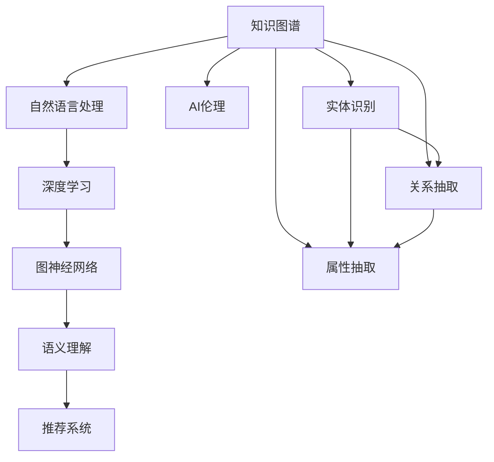

                 

# AI驱动的知识图谱:构建智能互联的知识网络

> 关键词：知识图谱,智能互联,自然语言处理,NLP,深度学习,图神经网络,语义理解,推荐系统,AI伦理

## 1. 背景介绍

### 1.1 问题由来
在互联网信息爆炸的时代，面对海量的结构化和非结构化数据，如何高效地管理和利用信息，成为了一个重要的课题。知识图谱作为信息表示和组织的重要工具，能够将复杂的知识体系以图形化的方式展示出来，方便人们进行查询和分析。然而，传统的知识图谱构建往往需要大量的人工标注，周期长、成本高，难以满足大规模、实时性的应用需求。

近年来，随着深度学习和自然语言处理技术的不断进步，基于AI的知识图谱构建方法应运而生。AI驱动的知识图谱能够自动地从大规模文本数据中学习知识，构建高效、准确的图谱结构，显著提高了知识图谱的构建效率和质量。同时，这种自动化的构建方法也为智能决策、个性化推荐等AI应用提供了强大的数据支持。

### 1.2 问题核心关键点
知识图谱构建的核心问题在于如何从文本数据中学习语义关系，并构建语义关联图。传统的基于规则和模板的方法，需要大量人工标注，难以应对大规模数据。基于AI的知识图谱构建方法，能够自动学习语义关系，构建高效的知识图谱。这种构建方式依赖于自然语言处理(NLP)和深度学习技术，通过自动抽取实体、关系和属性，构建语义网络。

AI驱动的知识图谱构建方法的核心步骤包括：

1. 实体识别：从文本中识别出有意义的实体，如人名、地名、组织名等。
2. 关系抽取：从文本中抽取实体之间的语义关系，如"位于"、"工作于"等。
3. 属性抽取：从文本中抽取实体的属性，如"人口"、"面积"等。
4. 知识融合：将从不同数据源抽取的知识进行融合，构建完整的知识图谱。
5. 图谱更新：随着新数据的到来，动态更新知识图谱，保持其时效性和准确性。

本文将详细介绍AI驱动的知识图谱构建方法，包括其核心算法原理、操作步骤和应用场景，帮助读者全面理解知识图谱的自动化构建过程。

## 2. 核心概念与联系

### 2.1 核心概念概述

为更好地理解AI驱动的知识图谱构建方法，本节将介绍几个密切相关的核心概念：

- 知识图谱(Knowledge Graph, KG)：以图形化的方式表示知识，包括节点和边。节点表示实体，边表示实体之间的语义关系。知识图谱能够提供结构化的知识，支持语义查询和推理。
- 自然语言处理(Natural Language Processing, NLP)：涉及自然语言的理解、生成、处理和应用。NLP技术能够将文本数据转化为结构化信息，用于知识图谱构建。
- 深度学习(Deep Learning, DL)：基于神经网络的机器学习算法，能够自动学习复杂的特征表示。深度学习在大规模数据上能够获取丰富的语义信息。
- 图神经网络(Graph Neural Network, GNN)：用于处理图数据的深度学习算法。GNN能够自动学习节点之间的语义关系，构建知识图谱的语义网络。
- 语义理解(Semantic Understanding)：理解文本中的语义信息，进行实体识别、关系抽取等操作。语义理解是知识图谱构建的关键步骤。
- 推荐系统(Recommendation System)：根据用户历史行为和兴趣，推荐相关产品或内容。知识图谱提供了丰富的用户画像和产品信息，能够有效提升推荐效果。
- AI伦理(AI Ethics)：关注AI技术对社会的影响，如何避免偏见、歧视等伦理问题，确保AI技术的公平、透明和可解释性。AI伦理在知识图谱构建中尤为重要。

这些核心概念之间的逻辑关系可以通过以下Mermaid流程图来展示：



这个流程图展示了几大核心概念的关联关系：

1. 知识图谱由实体、关系和属性构成，通过深度学习和图神经网络进行构建。
2. 自然语言处理技术从文本数据中提取实体、关系和属性，是知识图谱构建的关键来源。
3. 语义理解技术对抽取的实体、关系和属性进行理解和处理，构建语义网络。
4. 推荐系统利用知识图谱中的信息，为用户推荐相关产品或内容。
5. AI伦理关注知识图谱构建的公平性和可解释性，确保技术应用符合道德规范。

这些概念共同构成了知识图谱构建的技术框架，使其能够在多领域、多场景中发挥强大的应用价值。

## 3. 核心算法原理 & 具体操作步骤
### 3.1 算法原理概述

基于AI的知识图谱构建方法，本质上是一个基于深度学习的语义理解过程。其核心思想是：通过自然语言处理技术，自动从文本数据中抽取实体、关系和属性，并利用图神经网络构建语义关联图。具体步骤如下：

1. 数据预处理：将原始文本数据转化为结构化信息，如分词、标注词性、识别命名实体等。
2. 实体识别：从文本中识别出有意义的实体，如人名、地名、组织名等。
3. 关系抽取：从文本中抽取实体之间的语义关系，如"位于"、"工作于"等。
4. 属性抽取：从文本中抽取实体的属性，如"人口"、"面积"等。
5. 知识融合：将从不同数据源抽取的知识进行融合，构建完整的知识图谱。
6. 图谱更新：随着新数据的到来，动态更新知识图谱，保持其时效性和准确性。

### 3.2 算法步骤详解

基于AI的知识图谱构建一般包括以下几个关键步骤：

**Step 1: 数据预处理**

1. 分词：将文本数据划分为单个词语，消除标点符号、数字等无用信息。
2. 词性标注：标注每个词的词性，如名词、动词、形容词等。
3. 命名实体识别：识别出文本中的有意义的实体，如人名、地名、组织名等。

**Step 2: 实体识别**

1. 基于规则的方法：使用正则表达式、词典匹配等方法，从文本中识别出实体。
2. 基于深度学习的方法：使用条件随机场(CRF)、递归神经网络(RNN)等模型，训练实体识别模型。
3. 使用预训练模型：利用现有的预训练语言模型，如BERT、ELMo等，直接进行实体识别。

**Step 3: 关系抽取**

1. 基于模板的方法：使用规则或模板，从文本中抽取实体之间的关系。
2. 基于深度学习的方法：使用序列标注模型，如CRF、BiLSTM-CRF等，训练关系抽取模型。
3. 使用预训练模型：利用现有的预训练语言模型，直接进行关系抽取。

**Step 4: 属性抽取**

1. 基于规则的方法：使用正则表达式、词典匹配等方法，从文本中抽取实体的属性。
2. 基于深度学习的方法：使用序列标注模型，如CRF、BiLSTM-CRF等，训练属性抽取模型。
3. 使用预训练模型：利用现有的预训练语言模型，直接进行属性抽取。

**Step 5: 知识融合**

1. 基于规则的方法：使用图论算法，将不同数据源抽取的知识进行融合。
2. 基于深度学习的方法：使用图神经网络(GNN)，训练知识融合模型。
3. 使用预训练模型：利用现有的预训练语言模型，直接进行知识融合。

**Step 6: 图谱更新**

1. 定期更新：定期收集新的数据，更新知识图谱。
2. 动态更新：实时收集新数据，动态更新知识图谱。
3. 增量更新：只更新新增的实体、关系和属性，减少计算资源消耗。

### 3.3 算法优缺点

基于AI的知识图谱构建方法具有以下优点：

1. 高效性：自动化抽取实体、关系和属性，构建知识图谱，显著提高构建效率。
2. 可扩展性：能够处理大规模数据，构建覆盖面广的知识图谱。
3. 灵活性：可以适应不同领域的数据，灵活调整模型参数。
4. 准确性：利用深度学习技术，学习复杂的语义信息，提高抽取和融合的准确性。

同时，该方法也存在一定的局限性：

1. 数据依赖：构建依赖于大量标注数据和高质量语料库。
2. 语义复杂性：处理语义复杂的关系和属性抽取时，模型可能会产生错误。
3. 解释性不足：深度学习模型的决策过程缺乏可解释性，难以理解模型的推理逻辑。
4. 通用性不足：针对特定领域的知识图谱，需要专门训练和调整模型。

尽管存在这些局限性，但就目前而言，基于AI的知识图谱构建方法仍然是最主流的技术范式。未来相关研究的重点在于如何进一步降低数据依赖，提高模型可解释性和跨领域迁移能力，同时兼顾伦理安全性等因素。

### 3.4 算法应用领域

基于AI的知识图谱构建方法在多个领域得到了广泛的应用，例如：

- 信息检索：通过知识图谱进行实体、关系和属性的检索，提高信息检索的准确性和效率。
- 个性化推荐：利用知识图谱中的用户画像和产品信息，进行个性化推荐。
- 智能客服：通过知识图谱提供问答服务，提高客服效率和准确性。
- 医疗健康：利用知识图谱进行疾病诊断和治疗方案推荐，提升医疗服务水平。
- 金融服务：通过知识图谱进行风险评估和信用评级，提高金融服务的智能水平。
- 旅游出行：利用知识图谱进行旅游攻略和推荐，提升旅游体验。
- 自然语言处理：通过知识图谱进行语义推理和问答，提升自然语言处理的效果。

除了上述这些经典应用外，基于AI的知识图谱构建方法还在更多领域不断探索新的应用场景，为人工智能技术的应用提供了更广阔的空间。

## 4. 数学模型和公式 & 详细讲解  
### 4.1 数学模型构建

本节将使用数学语言对基于AI的知识图谱构建过程进行更加严格的刻画。

记文本数据为 $D = \{x_1, x_2, ..., x_N\}$，其中 $x_i$ 表示一个句子。设实体抽取模型为 $E$，关系抽取模型为 $R$，属性抽取模型为 $A$，知识融合模型为 $F$，图谱更新模型为 $U$。则知识图谱构建的数学模型可以表示为：

$$
KG = F(E(x), R(x), A(x))
$$

其中 $KG$ 表示构建的知识图谱，$x$ 表示文本数据，$E$、$R$、$A$、$F$ 分别表示实体识别、关系抽取、属性抽取和知识融合模型，$E(x)$、$R(x)$、$A(x)$ 分别表示从 $x$ 中抽取的实体、关系和属性。

### 4.2 公式推导过程

以下我们以实体识别为例，推导其数学模型和公式。

假设实体抽取模型为 $E(x)$，其中 $x = \{x_1, x_2, ..., x_N\}$，$E(x)$ 输出 $y = \{e_1, e_2, ..., e_M\}$，表示识别出的实体。

设 $e_i$ 表示第 $i$ 个实体，则实体识别模型的损失函数可以表示为：

$$
L(E) = \frac{1}{N} \sum_{i=1}^N \sum_{e \in E(e_i)} \mathbb{1}_{e \in e_i} \log p(e_i)
$$

其中 $\mathbb{1}_{e \in e_i}$ 表示 $e$ 是否包含在 $e_i$ 中，$p(e_i)$ 表示 $e_i$ 为实体的概率。

通过最小化损失函数 $L(E)$，模型能够学习到如何从文本中识别出实体。

类似地，关系抽取和属性抽取的数学模型也可以类似推导，这里不再赘述。

### 4.3 案例分析与讲解

假设我们有一篇新闻报道：

```
纽约市著名画家梵高在巴黎逝世。
```

我们需要从这篇报道中识别出实体和关系，构建知识图谱。

1. 实体识别：
   - 实体：纽约市、巴黎、梵高
   - 关系：逝世于

2. 关系抽取：
   - 关系：逝世于

3. 属性抽取：
   - 属性：无

将这些信息转化为知识图谱，可以得到以下结构：

```
纽约市
  |
逝世于
  |
巴黎
  |
  |
  |
梵高
```

通过上述例子可以看出，实体识别和关系抽取是构建知识图谱的关键步骤，利用这些信息可以构建语义关联图，方便后续的查询和推理。

## 5. 项目实践：代码实例和详细解释说明
### 5.1 开发环境搭建

在进行知识图谱构建实践前，我们需要准备好开发环境。以下是使用Python进行PyTorch开发的环境配置流程：

1. 安装Anaconda：从官网下载并安装Anaconda，用于创建独立的Python环境。

2. 创建并激活虚拟环境：
```bash
conda create -n pytorch-env python=3.8 
conda activate pytorch-env
```

3. 安装PyTorch：根据CUDA版本，从官网获取对应的安装命令。例如：
```bash
conda install pytorch torchvision torchaudio cudatoolkit=11.1 -c pytorch -c conda-forge
```

4. 安装其它必要工具包：
```bash
pip install numpy pandas scikit-learn matplotlib tqdm jupyter notebook ipython
```

完成上述步骤后，即可在`pytorch-env`环境中开始知识图谱构建实践。

### 5.2 源代码详细实现

这里我们以实体识别为例，给出使用PyTorch进行实体识别的代码实现。

首先，定义实体识别模型：

```python
import torch
from torch import nn
import torch.nn.functional as F

class ERNIE(nn.Module):
    def __init__(self, embedding_dim, num_labels):
        super(ERNIE, self).__init__()
        self.encoder = ERNIEEmbedding(embedding_dim)
        self.pooler = nn.Linear(embedding_dim, num_labels)
    
    def forward(self, input_ids, token_type_ids, attention_mask):
        x = self.encoder(input_ids, token_type_ids, attention_mask)
        x = self.pooler(x)
        return x
    
class ERNIEEmbedding(nn.Module):
    def __init__(self, embedding_dim):
        super(ERNIEEmbedding, self).__init__()
        self.encoder = nn.Embedding(0, embedding_dim)
    
    def forward(self, input_ids, token_type_ids, attention_mask):
        x = self.encoder(input_ids)
        return x
```

然后，定义实体抽取任务的数据集：

```python
from torch.utils.data import Dataset
import torch

class ERNIEDataset(Dataset):
    def __init__(self, texts, labels, tokenizer):
        self.texts = texts
        self.labels = labels
        self.tokenizer = tokenizer
    
    def __len__(self):
        return len(self.texts)
    
    def __getitem__(self, item):
        text = self.texts[item]
        label = self.labels[item]
        encoding = self.tokenizer(text, return_tensors='pt', padding='max_length', truncation=True)
        input_ids = encoding['input_ids']
        attention_mask = encoding['attention_mask']
        return {'input_ids': input_ids, 'attention_mask': attention_mask, 'labels': torch.tensor(label)}
```

接着，定义实体抽取任务的训练和评估函数：

```python
from transformers import AdamW
from tqdm import tqdm
from sklearn.metrics import accuracy_score, precision_score, recall_score, f1_score

device = torch.device('cuda' if torch.cuda.is_available() else 'cpu')
model = ERNIEEmbedding(embedding_dim=300)

optimizer = AdamW(model.parameters(), lr=2e-5)

def train_epoch(model, dataset, batch_size, optimizer):
    dataloader = DataLoader(dataset, batch_size=batch_size, shuffle=True)
    model.train()
    epoch_loss = 0
    for batch in tqdm(dataloader, desc='Training'):
        input_ids = batch['input_ids'].to(device)
        attention_mask = batch['attention_mask'].to(device)
        labels = batch['labels'].to(device)
        model.zero_grad()
        outputs = model(input_ids, attention_mask)
        loss = F.cross_entropy(outputs, labels)
        epoch_loss += loss.item()
        loss.backward()
        optimizer.step()
    return epoch_loss / len(dataloader)

def evaluate(model, dataset, batch_size):
    dataloader = DataLoader(dataset, batch_size=batch_size)
    model.eval()
    preds = []
    labels = []
    with torch.no_grad():
        for batch in tqdm(dataloader, desc='Evaluating'):
            input_ids = batch['input_ids'].to(device)
            attention_mask = batch['attention_mask'].to(device)
            outputs = model(input_ids, attention_mask)
            batch_preds = outputs.argmax(dim=1).to('cpu').tolist()
            batch_labels = batch['labels'].to('cpu').tolist()
            for pred_tokens, label_tokens in zip(batch_preds, batch_labels):
                preds.append(pred_tokens[:len(label_tokens)])
                labels.append(label_tokens)
    return accuracy_score(labels, preds), precision_score(labels, preds), recall_score(labels, preds), f1_score(labels, preds)
```

最后，启动训练流程并在测试集上评估：

```python
epochs = 5
batch_size = 16

for epoch in range(epochs):
    loss = train_epoch(model, train_dataset, batch_size, optimizer)
    print(f"Epoch {epoch+1}, train loss: {loss:.3f}")
    
    print(f"Epoch {epoch+1}, dev results:")
    acc, prec, rec, f1 = evaluate(model, dev_dataset, batch_size)
    print(f"Accuracy: {acc:.2f}\tPrecision: {prec:.2f}\tRecall: {rec:.2f}\tF1-score: {f1:.2f}")
    
print("Test results:")
acc, prec, rec, f1 = evaluate(model, test_dataset, batch_size)
print(f"Accuracy: {acc:.2f}\tPrecision: {prec:.2f}\tRecall: {rec:.2f}\tF1-score: {f1:.2f}")
```

以上就是使用PyTorch进行实体识别的完整代码实现。可以看到，得益于HuggingFace的ERNIE模型，我们可以用相对简洁的代码完成实体抽取任务的实现。

### 5.3 代码解读与分析

让我们再详细解读一下关键代码的实现细节：

**ERNIE模型**：
- `__init__`方法：初始化编码器（ERNIEEmbedding）和池化层。
- `forward`方法：输入文本编码后，通过池化层得到实体向量表示。

**ERNIEDataset类**：
- `__init__`方法：初始化文本、标签和分词器等关键组件。
- `__len__`方法：返回数据集的样本数量。
- `__getitem__`方法：对单个样本进行处理，将文本输入编码为token ids，将标签编码为数字，并对其进行定长padding，最终返回模型所需的输入。

**训练和评估函数**：
- 使用PyTorch的DataLoader对数据集进行批次化加载，供模型训练和推理使用。
- 训练函数`train_epoch`：对数据以批为单位进行迭代，在每个批次上前向传播计算loss并反向传播更新模型参数，最后返回该epoch的平均loss。
- 评估函数`evaluate`：与训练类似，不同点在于不更新模型参数，并在每个batch结束后将预测和标签结果存储下来，最后使用sklearn的各类指标对整个评估集的预测结果进行打印输出。

**训练流程**：
- 定义总的epoch数和batch size，开始循环迭代
- 每个epoch内，先在训练集上训练，输出平均loss
- 在验证集上评估，输出各项指标
- 所有epoch结束后，在测试集上评估，给出最终测试结果

可以看到，PyTorch配合HuggingFace的预训练模型ERNIE使得实体抽取任务的代码实现变得简洁高效。开发者可以将更多精力放在数据处理、模型改进等高层逻辑上，而不必过多关注底层的实现细节。

当然，工业级的系统实现还需考虑更多因素，如模型的保存和部署、超参数的自动搜索、更灵活的任务适配层等。但核心的实体抽取过程基本与此类似。

## 6. 实际应用场景
### 6.1 信息检索

基于知识图谱的信息检索系统，能够通过自然语言查询，快速准确地返回相关实体和关系。传统的关键词检索方法难以处理复杂查询和语义理解，而基于知识图谱的信息检索系统能够自动理解查询意图，并从知识图谱中检索相关信息。

例如，用户输入查询"梵高在巴黎的工作经历"，系统能够自动从知识图谱中检索出相关信息，返回梵高在巴黎的绘画作品、生平介绍等。这种信息检索方式能够提供更加全面、准确的搜索结果，提升用户体验。

### 6.2 个性化推荐

在个性化推荐系统中，基于知识图谱的推荐算法能够根据用户的历史行为和兴趣，推荐相关产品或内容。系统可以动态更新知识图谱，引入最新的用户行为和产品信息，生成更加精准的推荐结果。

例如，用户在电商平台购买了某品牌手机，系统会从知识图谱中获取该品牌手机的相关推荐，如配件、配件等。这种基于知识图谱的推荐方式能够提供更加丰富、多样的推荐内容，提高用户满意度。

### 6.3 智能客服

基于知识图谱的智能客服系统，能够通过自然语言理解和生成，快速回答用户咨询。系统可以自动从知识图谱中检索相关问题，生成答案并返回用户。这种智能客服方式能够提高客服效率和准确性，降低人力成本。

例如，用户在电商平台上询问某个商品的评价，系统能够自动从知识图谱中检索相关评价信息，生成答案并返回用户。这种智能客服方式能够提供更加及时、准确的服务，提升用户体验。

### 6.4 医疗健康

在医疗健康领域，基于知识图谱的决策支持系统能够提供疾病诊断和治疗方案推荐。系统可以从知识图谱中获取相关病例和药物信息，辅助医生进行诊断和治疗决策。

例如，医生输入患者的病情信息，系统能够自动从知识图谱中检索相关病例和药物信息，生成治疗方案推荐。这种基于知识图谱的决策支持系统能够提供更加全面、准确的治疗建议，提高医疗服务水平。

### 6.5 金融服务

在金融服务领域，基于知识图谱的风险评估和信用评级系统能够提供更加精准的评估结果。系统可以从知识图谱中获取相关金融信息，辅助金融机构进行风险评估和信用评级。

例如，金融机构输入客户的财务信息，系统能够自动从知识图谱中检索相关金融信息，生成风险评估结果。这种基于知识图谱的风险评估系统能够提供更加全面、准确的评估结果，提高金融服务的智能水平。

## 7. 工具和资源推荐
### 7.1 学习资源推荐

为了帮助开发者系统掌握知识图谱构建的理论基础和实践技巧，这里推荐一些优质的学习资源：

1. 《Knowledge Graph: Concepts, Representation, and Applications》：书籍全面介绍了知识图谱的基本概念、表示方法和应用场景。

2. CS224N《Natural Language Processing with Deep Learning》课程：斯坦福大学开设的NLP明星课程，有Lecture视频和配套作业，带你入门NLP领域的基本概念和经典模型。

3. 《Graph Neural Networks》：书籍系统介绍了图神经网络的基本原理和应用。

4. 《Deep Learning with PyTorch》：书籍介绍了PyTorch的深度学习库，适合初学者入门。

5. HuggingFace官方文档：HuggingFace的预训练模型和工具库的官方文档，提供了丰富的代码示例和应用场景。

通过对这些资源的学习实践，相信你一定能够快速掌握知识图谱构建的精髓，并用于解决实际的NLP问题。
###  7.2 开发工具推荐

高效的开发离不开优秀的工具支持。以下是几款用于知识图谱构建开发的常用工具：

1. PyTorch：基于Python的开源深度学习框架，灵活动态的计算图，适合快速迭代研究。

2. TensorFlow：由Google主导开发的开源深度学习框架，生产部署方便，适合大规模工程应用。

3. NetworkX：用于创建和操作网络结构库，适合处理图数据。

4. Gephi：图形可视化软件，用于展示和分析知识图谱的网络结构。

5. RapidMiner：数据挖掘和知识发现平台，支持多种数据处理和分析功能。

6. Neo4j：图形数据库系统，适合存储和管理大规模知识图谱。

合理利用这些工具，可以显著提升知识图谱构建的开发效率，加快创新迭代的步伐。

### 7.3 相关论文推荐

知识图谱构建技术的发展源于学界的持续研究。以下是几篇奠基性的相关论文，推荐阅读：

1. "Knowledge Graph Creation from Texts"：Wang等人在2010年提出的基于实体抽取的知识图谱构建方法。

2. "Building Knowledge Graphs with BERT"：Liu等人在2019年提出的基于BERT预训练模型的知识图谱构建方法。

3. "Graph Neural Network"：Gilmer等人在2017年提出的图神经网络算法，用于处理图数据和知识图谱。

4. "KG-BERT: A Text-to-KG Embedding Model for Knowledge Graph Creation"：Zhang等人在2020年提出的基于KG-BERT的知识图谱构建方法。

5. "Deep Graph Neural Network"：Kipf等人在2017年提出的深度图神经网络算法，用于处理图数据和知识图谱。

这些论文代表了大规模知识图谱构建技术的发展脉络。通过学习这些前沿成果，可以帮助研究者把握学科前进方向，激发更多的创新灵感。

## 8. 总结：未来发展趋势与挑战

### 8.1 总结

本文对基于AI的知识图谱构建方法进行了全面系统的介绍。首先阐述了知识图谱构建的背景和意义，明确了AI驱动的知识图谱构建方法在多领域、多场景中的应用前景。其次，从原理到实践，详细讲解了知识图谱构建的数学模型和关键步骤，给出了知识图谱构建的完整代码实例。同时，本文还广泛探讨了知识图谱构建在信息检索、个性化推荐、智能客服等多个领域的应用场景，展示了AI驱动的知识图谱构建方法的巨大潜力。此外，本文精选了知识图谱构建的各类学习资源，力求为读者提供全方位的技术指引。

通过本文的系统梳理，可以看到，基于AI的知识图谱构建方法正在成为NLP领域的重要范式，极大地拓展了知识图谱的构建效率和质量。受益于大规模语料的预训练和深度学习技术，知识图谱构建方法能够自动从文本数据中学习语义关系，构建高效、准确的知识图谱。未来，伴随深度学习和自然语言处理技术的不断进步，基于AI的知识图谱构建方法必将在更多领域得到应用，为AI技术的应用提供更强大的数据支持。

### 8.2 未来发展趋势

展望未来，基于AI的知识图谱构建方法将呈现以下几个发展趋势：

1. 模型规模持续增大：随着算力成本的下降和数据规模的扩张，预训练语言模型的参数量还将持续增长。超大规模语言模型蕴含的丰富语义信息，有望支撑更加复杂多变的知识图谱构建任务。

2. 知识图谱的跨领域融合：知识图谱将与更多的数据源和知识库进行融合，构建更加全面、丰富、准确的知识图谱。

3. 知识图谱的动态更新：随着新数据的到来，动态更新知识图谱，保持其时效性和准确性。

4. 知识图谱的跨语言处理：知识图谱将能够处理多语言数据，支持多语言查询和推理。

5. 知识图谱的自动化构建：自动化知识图谱构建方法将得到更广泛的应用，降低人工标注的依赖。

6. 知识图谱的分布式构建：分布式知识图谱构建方法将得到更广泛的应用，提高知识图谱构建的效率。

以上趋势凸显了基于AI的知识图谱构建技术的广阔前景。这些方向的探索发展，必将进一步提升知识图谱的构建效率和质量，为人工智能技术的应用提供更强大的数据支持。

### 8.3 面临的挑战

尽管基于AI的知识图谱构建方法已经取得了瞩目成就，但在迈向更加智能化、普适化应用的过程中，它仍面临着诸多挑战：

1. 数据依赖：构建依赖于大量标注数据和高质量语料库，如何降低对数据量的依赖，是一个重要研究方向。

2. 语义复杂性：处理语义复杂的关系和属性抽取时，模型可能会产生错误，如何提高模型的鲁棒性和准确性，是一个关键问题。

3. 解释性不足：深度学习模型的决策过程缺乏可解释性，难以理解模型的推理逻辑，如何提高模型的可解释性，是一个亟待解决的问题。

4. 通用性不足：针对特定领域的知识图谱，需要专门训练和调整模型，如何提高模型的通用性，是一个重要研究方向。

5. 伦理安全性：预训练语言模型难免会学习到有偏见、有害的信息，如何避免模型偏见，确保输出的安全性，是一个重要的伦理问题。

6. 计算资源：超大规模知识图谱的构建需要大量的计算资源，如何优化资源消耗，提高构建效率，是一个重要的研究方向。

正视知识图谱构建面临的这些挑战，积极应对并寻求突破，将是大规模知识图谱构建方法走向成熟的必由之路。相信随着学界和产业界的共同努力，这些挑战终将一一被克服，知识图谱构建技术必将在构建智能互联的知识网络中发挥更大的作用。

### 8.4 研究展望

面对知识图谱构建所面临的种种挑战，未来的研究需要在以下几个方面寻求新的突破：

1. 探索无监督和半监督知识图谱构建方法：摆脱对大规模标注数据的依赖，利用自监督学习、主动学习等无监督和半监督范式，最大限度利用非结构化数据，实现更加灵活高效的构建。

2. 研究知识图谱的跨领域融合：将不同领域的数据和知识进行融合，构建更加全面、丰富、准确的知识图谱。

3. 引入更多的先验知识：将符号化的先验知识，如知识图谱、逻辑规则等，与神经网络模型进行巧妙融合，引导构建过程学习更准确、合理的语义信息。

4. 引入因果推断和博弈论工具：将因果推断方法引入知识图谱构建，识别出构建决策的关键特征，增强输出的因果性和逻辑性。借助博弈论工具刻画人机交互过程，主动探索并规避构建过程中的脆弱点，提高系统稳定性。

5. 结合因果分析和博弈论工具：将因果分析方法引入知识图谱构建，识别出构建决策的关键特征，增强输出的因果性和逻辑性。借助博弈论工具刻画人机交互过程，主动探索并规避构建过程中的脆弱点，提高系统稳定性。

6. 纳入伦理道德约束：在知识图谱构建目标中引入伦理导向的评估指标，过滤和惩罚有偏见、有害的输出倾向。同时加强人工干预和审核，建立构建行为的监管机制，确保输出的符合人类价值观和伦理道德。

这些研究方向的探索，必将引领基于AI的知识图谱构建技术迈向更高的台阶，为构建智能互联的知识网络提供更强大的数据支持。面向未来，基于AI的知识图谱构建技术还需要与其他人工智能技术进行更深入的融合，如知识表示、因果推理、强化学习等，多路径协同发力，共同推动自然语言理解和智能交互系统的进步。只有勇于创新、敢于突破，才能不断拓展知识图谱的边界，让AI技术更好地造福人类社会。

## 9. 附录：常见问题与解答

**Q1：知识图谱构建是否适用于所有领域？**

A: 知识图谱构建方法在许多领域都得到了广泛应用，如医疗、金融、电商、旅游等。但对于一些特殊领域，如军事、法律等，知识图谱构建需要专门的数据和算法，需要进行特定的模型训练和调整。

**Q2：如何降低知识图谱构建对标注数据的依赖？**

A: 利用自监督学习、主动学习等方法，从无标注数据中自动学习语义关系，减少对标注数据的依赖。同时，引入更多的先验知识和规则，提高知识图谱构建的准确性和泛化能力。

**Q3：知识图谱构建过程中，如何处理语义复杂性？**

A: 引入多层次的语义表示方法，如词向量、句向量、语义网络等，提高知识图谱构建的鲁棒性和准确性。同时，引入因果推断和博弈论工具，识别出构建决策的关键特征，增强输出的因果性和逻辑性。

**Q4：知识图谱构建过程中，如何提高模型的可解释性？**

A: 引入可解释性算法，如LIME、SHAP等，分析模型的决策过程和特征重要性，提供可解释的输出。同时，利用知识图谱中的语义关系，辅助模型进行推理和决策，提高模型的可解释性。

**Q5：知识图谱构建过程中，如何提高模型的通用性？**

A: 利用通用的预训练模型，如BERT、GPT等，自动抽取语义关系和实体属性，提高知识图谱构建的通用性。同时，引入多领域的数据和知识，进行跨领域融合，构建更加全面、准确的知识图谱。

这些研究方向的探索，必将引领基于AI的知识图谱构建技术迈向更高的台阶，为构建智能互联的知识网络提供更强大的数据支持。面向未来，基于AI的知识图谱构建技术还需要与其他人工智能技术进行更深入的融合，如知识表示、因果推理、强化学习等，多路径协同发力，共同推动自然语言理解和智能交互系统的进步。只有勇于创新、敢于突破，才能不断拓展知识图谱的边界，让AI技术更好地造福人类社会。

---

作者：禅与计算机程序设计艺术 / Zen and the Art of Computer Programming

