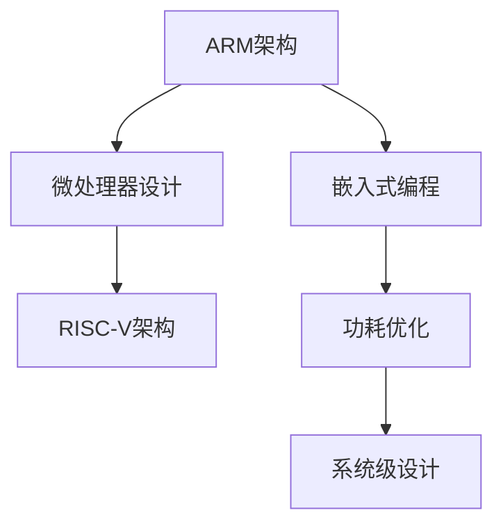

                 

# ARM 架构：嵌入式系统设计

> 关键词：ARM架构，嵌入式系统设计，微处理器设计，RISC-V架构，嵌入式编程，功耗优化，系统级设计

## 1. 背景介绍

### 1.1 问题由来
随着物联网、智能设备、移动通信等技术的飞速发展，嵌入式系统在现代科技和社会生活中扮演了越来越重要的角色。嵌入式系统通常集成度高、资源有限，需要通过高效的硬件设计实现复杂的控制和运算任务。为此，ARM架构凭借其高性价比、低功耗、易用性等优势，成为了嵌入式系统开发的主流选择。

### 1.2 问题核心关键点
嵌入式系统设计涉及多个层面，包括硬件架构设计、微处理器设计、操作系统设计、应用软件开发等。其中，微处理器设计是硬件设计中的核心环节，直接决定了整个系统的性能和功耗。ARM架构作为当前最流行的嵌入式微处理器架构之一，其设计原理和应用实践对嵌入式系统设计具有重要参考价值。

## 2. 核心概念与联系

### 2.1 核心概念概述

为了更好地理解ARM架构及其在嵌入式系统中的应用，本节将介绍几个关键概念：

- **ARM架构**：一种基于精简指令集计算的微处理器架构，其设计理念包括高性能、低功耗、易用性等。ARM架构广泛应用于各种嵌入式系统，从简单的物联网设备到高性能的移动计算平台。
- **微处理器设计**：硬件设计中最重要的环节之一，涉及微处理器核心的设计、内存和IO接口的设计、以及功耗优化等。微处理器设计是嵌入式系统设计的基石。
- **RISC-V架构**：一种开源的精简指令集架构，由加州大学柏克莱分校设计，旨在提供自由、开放的平台以促进计算创新。RISC-V架构与ARM架构在理念上有相似之处，可以视为ARM架构的有益补充。
- **嵌入式编程**：嵌入式系统开发中不可或缺的技能，涉及底层硬件编程、驱动程序开发、系统级编程等。嵌入式编程需要深入理解硬件特性和编程模型。
- **功耗优化**：嵌入式系统设计中必须考虑的关键因素，特别是在便携式和电池供电设备中。功耗优化包括硬件架构设计、软件算法优化、休眠模式管理等。
- **系统级设计**：涉及硬件、软件、应用等多个层面，强调系统的整体性能和用户体验。系统级设计需要跨学科的知识和技能，包括电子工程、软件工程、机械工程等。

这些核心概念之间的逻辑关系可以通过以下Mermaid流程图来展示：



这个流程图展示了ARM架构在嵌入式系统设计中的核心位置，并通过与RISC-V架构、嵌入式编程、功耗优化、系统级设计等概念的联系，构建了完整的嵌入式系统设计框架。

## 3. 核心算法原理 & 具体操作步骤
### 3.1 算法原理概述

ARM架构的核心算法原理主要包括指令集架构、寄存器结构、存储管理、中断处理等方面。其核心思想是通过精简指令集和高效的设计，实现高性能、低功耗的微处理器。以下是ARM架构的几个关键特性：

1. **精简指令集**：ARM架构采用精简指令集，指令数目少但功能强大，这有助于提高指令执行速度和效率，降低芯片面积和功耗。
2. **寄存器优化**：ARM架构大量使用寄存器，减少对内存的访问，提高数据处理速度。
3. **流水线技术**：ARM架构采用多级流水线技术，通过并行处理指令，提高处理速度和效率。
4. **嵌入式系统兼容性**：ARM架构在嵌入式系统中具有广泛的兼容性，支持多种操作系统和应用。

### 3.2 算法步骤详解

基于ARM架构的微处理器设计主要包括以下几个关键步骤：

1. **需求分析**：确定系统的功能和性能需求，如处理速度、功耗、内存要求等。
2. **架构选型**：根据需求选择合适的架构类型，如ARM Cortex-A、ARM Cortex-M等。
3. **硬件设计**：设计微处理器的核心，包括指令集设计、寄存器结构、内存管理单元设计等。
4. **软件开发**：编写驱动程序和应用软件，实现系统功能。
5. **测试验证**：进行全面的测试验证，确保硬件和软件协同工作，达到预期性能。
6. **优化调整**：根据测试结果进行功耗优化、性能调优等调整，提高系统性能。

### 3.3 算法优缺点

ARM架构在嵌入式系统设计中具有以下优点：

1. **高性能**：ARM架构的高效指令集和流水线技术，使其具有高处理速度和效率。
2. **低功耗**：ARM架构的寄存器优化和睡眠模式管理，有助于降低芯片功耗。
3. **易用性**：ARM架构的广泛应用和丰富的资源库，使得嵌入式系统开发更加便捷。
4. **兼容性**：ARM架构的广泛兼容性，使其能够支持多种操作系统和应用。

同时，ARM架构也存在一些缺点：

1. **成本较高**：ARM架构的高性能和高兼容性，导致其授权费用较高。
2. **限制较多**：ARM架构的指令集和硬件设计受到ARM公司的限制，难以完全自由设计。
3. **系统复杂性**：ARM架构的复杂性要求开发者具备较强的硬件和软件知识，学习曲线较陡。

### 3.4 算法应用领域

ARM架构在嵌入式系统设计中具有广泛的应用领域，包括但不限于以下几类：

1. **物联网设备**：如智能家居、可穿戴设备等，需要高性能、低功耗的微处理器。
2. **移动设备**：如智能手机、平板电脑等，需要高性能、兼容性好、易维护的微处理器。
3. **工业控制**：如自动化生产线、智能机器人等，需要高性能、稳定可靠的微处理器。
4. **医疗设备**：如健康监测、远程医疗等，需要高性能、安全可靠的微处理器。
5. **汽车电子**：如车载信息系统、智能驾驶等，需要高性能、实时响应快的微处理器。

这些应用领域展示了ARM架构在嵌入式系统设计中的强大生命力和广泛适用性。

## 4. 数学模型和公式 & 详细讲解  
### 4.1 数学模型构建

ARM架构的数学模型构建主要涉及微处理器的硬件描述和性能分析。以下以ARM Cortex-A系列为例，构建其性能模型：

- **时钟周期分析**：ARM Cortex-A系列微处理器采用流水线技术，每个指令需要多个时钟周期执行。假设一个指令需要n个时钟周期执行，则其性能模型为：
  $$
  T_{\text{clock}} = \frac{C}{f} \cdot n
  $$
  其中，$C$为时钟周期，$f$为时钟频率，$n$为指令执行所需时钟周期数。

- **吞吐量分析**：吞吐量是指单位时间内处理器执行的指令数。假设处理器每个时钟周期执行一条指令，则吞吐量模型为：
  $$
  T_{\text{throughput}} = \frac{1}{T_{\text{clock}}}
  $$

### 4.2 公式推导过程

以上公式展示了ARM Cortex-A系列微处理器的时钟周期和吞吐量模型。这些模型可以帮助设计师评估处理器的性能和功耗。

### 4.3 案例分析与讲解

假设设计一款ARM Cortex-A5微处理器，其时钟频率为500MHz，每个时钟周期执行一条指令。假设基准指令的执行时钟周期数为4，则其时钟周期和吞吐量计算如下：
- 时钟周期：$T_{\text{clock}} = \frac{1}{500} \cdot 4 = 0.008$
- 吞吐量：$T_{\text{throughput}} = \frac{1}{0.008} = 125$ MIPS

## 5. 项目实践：代码实例和详细解释说明
### 5.1 开发环境搭建

进行ARM架构的微处理器设计，需要使用专业的硬件设计工具和开发环境。以下是一个典型的开发环境搭建流程：

1. **安装HDL设计工具**：如Xilinx Vivado、Synopsys Design Compiler等。这些工具支持硬件描述语言（HDL）的输入和仿真。
2. **安装嵌入式开发环境**：如Keil、IAR等，这些工具支持嵌入式系统编程和调试。
3. **搭建仿真环境**：如Modelsim、VCS等，这些工具支持硬件设计和算法仿真。

### 5.2 源代码详细实现

以下是一个简单的ARM微处理器设计示例，展示了ARM Cortex-M0微处理器的实现：

```assembly
.text
.global main
main:
    MOV R0, #1      ; 设置寄存器R0的值为1
    MOV R1, #2      ; 设置寄存器R1的值为2
    ADD R2, R0, R1  ; 将R0和R1的值相加，结果存入R2
    MOVPCR R3, R2   ; 将R2的值存储到片内数据RAM
    MOV A, #10      ; 设置累加器A的值为10
    SUBS A, A, #5   ; 累加器A减5
    BLS exit       ; 如果A的值为0或更小，跳转到exit标签
    MOV R0, A      ; 将累加器A的值存储到R0
exit:
    MOV R0, R2      ; 将片内数据RAM的值存储到R0
    B exit          ; 跳转到exit标签
```

### 5.3 代码解读与分析

上述代码展示了ARM Cortex-M0微处理器的基本功能，包括寄存器读写、算术运算、数据存储等。通过使用HDL工具，可以将这些汇编代码转化为硬件描述语言，并进行仿真验证。

### 5.4 运行结果展示

运行上述代码，观察寄存器R0和R2的值变化，验证算术运算和数据存储的正确性。

## 6. 实际应用场景
### 6.1 智能家居设备

智能家居设备如智能灯泡、智能插座等，需要高性能、低功耗的微处理器。ARM架构的微处理器设计正好满足了这些需求。通过设计高性能的微处理器，可以实现智能家居设备的远程控制、状态监测、数据传输等功能。

### 6.2 移动设备

移动设备如智能手机、平板电脑等，需要高性能、兼容性好、易维护的微处理器。ARM架构的微处理器设计在移动设备中广泛应用，满足了这些需求。通过设计高性能的微处理器，可以实现手机应用、平板电脑游戏、视频通话等功能。

### 6.3 工业控制系统

工业控制系统如自动化生产线、智能机器人等，需要高性能、稳定可靠的微处理器。ARM架构的微处理器设计在工业控制系统中具有广泛应用，满足了这些需求。通过设计高性能的微处理器，可以实现生产线的自动控制、设备监测、故障诊断等功能。

### 6.4 未来应用展望

随着物联网、智能设备、移动通信等技术的不断进步，ARM架构在嵌入式系统设计中的应用前景广阔。未来的发展趋势包括：

1. **多核设计**：未来的ARM微处理器可能采用多核设计，提高处理能力和并发性。
2. **AI集成**：未来的ARM微处理器可能集成AI加速器，提高机器学习和深度学习的能力。
3. **边缘计算**：未来的ARM微处理器可能支持边缘计算，实现本地数据处理和智能决策。
4. **低功耗设计**：未来的ARM微处理器可能采用更加低功耗的设计，提高设备的续航能力。
5. **安全设计**：未来的ARM微处理器可能采用更强的安全设计，保护设备和数据的安全。

这些趋势将推动ARM架构在嵌入式系统设计中不断发展和创新，满足日益复杂和多样化的应用需求。

## 7. 工具和资源推荐
### 7.1 学习资源推荐

为了帮助开发者深入理解ARM架构及其在嵌入式系统中的应用，以下是几本优秀的学习资源推荐：

1. **《ARM体系结构与编程》**：详细介绍了ARM架构的设计原理、指令集和编程方法，适合嵌入式系统开发初学者。
2. **《嵌入式系统设计》**：介绍了嵌入式系统设计的各个层面，包括硬件设计、软件开发、系统级设计等，适合嵌入式系统开发中高级读者。
3. **《嵌入式系统设计实践》**：通过具体项目实践，展示了嵌入式系统设计从需求分析到系统调试的全过程，适合实践导向的学习者。

通过学习这些资源，可以系统地掌握ARM架构及其在嵌入式系统中的应用。

### 7.2 开发工具推荐

以下是几款常用的嵌入式系统开发工具：

1. **Xilinx Vivado**：一款功能强大的FPGA设计工具，支持ARM微处理器设计的硬件描述和仿真。
2. **Synopsys Design Compiler**：一款先进的综合工具，可以将HDL代码转化为物理实现。
3. **Keil**：一款流行的嵌入式系统编程工具，支持ARM微处理器的编译和调试。
4. **Modelsim**：一款强大的硬件仿真工具，支持ARM微处理器的设计验证和性能分析。
5. **VCS**：一款高级的仿真工具，支持复杂的嵌入式系统仿真和性能分析。

这些工具提供了丰富的功能和接口，支持ARM微处理器设计的各个环节。

### 7.3 相关论文推荐

以下是几篇关于ARM架构及其在嵌入式系统中的应用的重要论文：

1. **《The Cortex-M Series Microprocessors》**：介绍ARM Cortex-M系列微处理器的设计原理和应用。
2. **《Performance Analysis of ARM Cortex-A Series Processors》**：分析ARM Cortex-A系列微处理器的性能和功耗。
3. **《Design and Implementation of ARM-Based SoCs for Edge Computing》**：介绍基于ARM的片上系统（SoC）设计及其在边缘计算中的应用。
4. **《Power Optimization Techniques for ARM-Based Embedded Systems》**：介绍ARM微处理器的功耗优化技术和方法。

这些论文代表了ARM架构及其在嵌入式系统设计中的最新研究成果。

## 8. 总结：未来发展趋势与挑战
### 8.1 研究成果总结

本文详细介绍了ARM架构及其在嵌入式系统设计中的应用，从核心概念、算法原理、操作步骤、案例分析等多个层面进行了全面系统的讲解。ARM架构凭借其高性能、低功耗、易用性等优势，成为了嵌入式系统设计的主流选择。通过深入理解ARM架构的设计原理和应用实践，可以更好地应用于各种嵌入式系统，提升系统的性能和用户体验。

### 8.2 未来发展趋势

展望未来，ARM架构在嵌入式系统设计中将面临以下发展趋势：

1. **多核设计**：未来的ARM微处理器可能采用多核设计，提高处理能力和并发性，适应复杂多变的应用需求。
2. **AI集成**：未来的ARM微处理器可能集成AI加速器，提高机器学习和深度学习的能力，拓展嵌入式系统的应用范围。
3. **边缘计算**：未来的ARM微处理器可能支持边缘计算，实现本地数据处理和智能决策，推动智慧城市、工业互联网等领域的发展。
4. **低功耗设计**：未来的ARM微处理器可能采用更加低功耗的设计，提高设备的续航能力，满足便携式和电池供电设备的需求。
5. **安全设计**：未来的ARM微处理器可能采用更强的安全设计，保护设备和数据的安全，增强系统的可靠性和稳定性。

这些趋势将推动ARM架构在嵌入式系统设计中不断发展和创新，满足日益复杂和多样化的应用需求。

### 8.3 面临的挑战

尽管ARM架构在嵌入式系统设计中具有诸多优势，但在向更高性能和更复杂系统迈进的过程中，仍面临以下挑战：

1. **功耗管理**：高性能计算和低功耗设计之间的平衡，需要持续优化。
2. **系统安全性**：嵌入式系统面临的安全威胁日益复杂，如何保护系统安全成为重要课题。
3. **应用生态**：ARM架构的生态系统需要进一步完善，支持更多操作系统和开发工具。
4. **人才短缺**：ARM架构设计涉及多个学科的知识和技能，培养具备相应能力的人才具有挑战性。
5. **国际竞争**：ARM架构的全球市场竞争激烈，如何在激烈竞争中保持优势具有挑战性。

这些挑战需要通过技术创新、生态建设、人才培养等多方面努力来克服。

### 8.4 研究展望

面对ARM架构在嵌入式系统设计中面临的挑战，未来的研究应在以下几个方面寻求新的突破：

1. **功耗优化**：开发更加高效的多核和低功耗设计方法，提高系统的能效比。
2. **安全增强**：引入硬件安全技术和加密算法，增强系统的安全性。
3. **应用拓展**：支持更多操作系统和应用生态，拓展ARM架构的应用范围。
4. **人才培养**：培养更多具备交叉学科知识的人才，推动ARM架构的发展。
5. **国际合作**：加强国际合作和技术交流，推动ARM架构在全球市场的竞争力。

这些研究方向将推动ARM架构在嵌入式系统设计中不断发展和创新，满足日益复杂和多样化的应用需求。

## 9. 附录：常见问题与解答

**Q1：嵌入式系统中ARM架构和RISC-V架构有什么区别？**

A: ARM架构和RISC-V架构都是精简指令集架构，但两者在授权方式、开放程度、设计理念等方面存在差异。ARM架构采用闭源授权方式，由ARM公司控制设计；RISC-V架构采用开放授权方式，由加州大学柏克莱分校维护。

**Q2：ARM架构的微处理器设计中，如何实现高性能和低功耗的平衡？**

A: 实现高性能和低功耗的平衡，需要采用多级流水线、寄存器优化、时钟频率控制等技术。同时，设计时需考虑应用场景，根据不同需求进行优化。

**Q3：嵌入式系统设计中，如何进行功耗优化？**

A: 功耗优化涉及硬件架构设计和软件算法优化两个方面。硬件架构设计需采用低功耗设计技术，如动态电压频率调节、休眠模式管理等；软件算法优化需优化算法复杂度和运行效率，减少不必要的计算。

**Q4：ARM架构在嵌入式系统设计中的应用前景如何？**

A: ARM架构具有高性能、低功耗、易用性等优势，广泛应用于物联网、移动设备、工业控制等多个领域。随着技术的发展，ARM架构在嵌入式系统设计中的应用前景广阔。

**Q5：嵌入式系统设计中，如何进行系统级设计？**

A: 系统级设计需考虑硬件、软件、应用等多个层面。需进行需求分析、架构选型、硬件设计、软件开发、测试验证等步骤。系统级设计需跨学科的知识和技能，注重整体性能和用户体验。

---

作者：禅与计算机程序设计艺术 / Zen and the Art of Computer Programming

