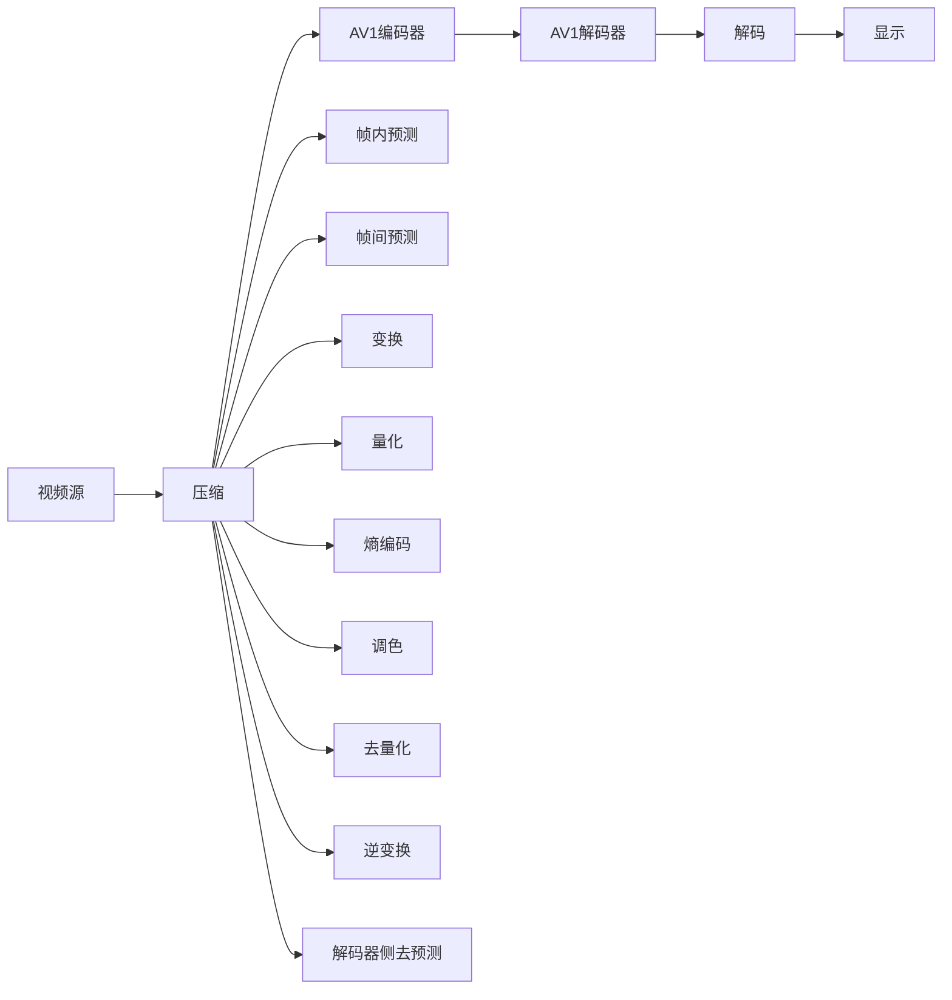

                 

# AV1 视频格式：下一代开放媒体编码

## 1. 背景介绍

在过去几十年间，随着数字媒体的迅猛发展，视频编码技术取得了巨大的进步。从MPEG-1、MPEG-2、MPEG-4，到H.264/AVC、H.265/HEVC，视频编解码标准不断迭代升级，满足了日益增长的视听体验需求。然而，现有视频编码格式仍然存在一些问题：一方面，它们依赖于专利许可，给使用者带来了较高的成本；另一方面，随着硬件技术的飞速发展，这些标准可能无法充分利用新的技术进步。

在这样的背景下，AV1（Alliance for Open Media Video 1）应运而生，它是由开放媒体联盟（Alliance for Open Media，简称AOM）提出的一种免费、开放、无专利的视频编码标准。AV1旨在打破现有视频编解码标准对专利的依赖，提供高效率、低延迟、高质量的视频压缩解决方案，成为下一代视频编解码的主流格式。

## 2. 核心概念与联系

### 2.1 核心概念概述

为了更好地理解AV1视频格式的工作原理和应用场景，我们先简要介绍以下几个关键概念：

- **视频编码（Video Coding）**：通过压缩算法将原始视频数据转换为具有较高压缩比、较低码率的视频流。视频编码的目标是在保证视频质量的前提下，尽可能减少码率，提高传输效率。

- **视频压缩（Video Compression）**：在视频编码过程中，通过数学模型和算法对原始视频数据进行分析和转换，减少数据冗余，实现高效的压缩存储。

- **AV1**：开放媒体联盟（AOM）推出的无专利、开源的视频编码标准，支持多种视频格式，包括MKV、WebM等。

- **开放媒体联盟（AOM）**：成立于2016年，由Google、Amazon、Apple、YouTube等主要科技公司联合创立，旨在推动高质量、无专利的视频编码标准。

- **H.264/AVC**：由国际电信联盟（ITU）和国际标准化组织（ISO）联合制定的视频编码标准，广泛用于高清视频传输。

- **H.265/HEVC**：H.264的升级版，提供了更高的压缩效率，但需要更多的计算资源。

- **开源软件**：如FFmpeg、VLC等，支持AV1视频格式的编解码和播放，确保了其广泛的应用和兼容性。

### 2.2 核心概念原理和架构的 Mermaid 流程图



以上图表展示了AV1视频编解码的基本流程，包括视频源、压缩、帧内预测、帧间预测、变换、量化、熵编码、调色、去量化、逆变换、解码器侧去预测等多个关键环节。

## 3. 核心算法原理 & 具体操作步骤

### 3.1 算法原理概述

AV1视频编码标准基于模板匹配（Template Matching）和变换编码（Transform Coding）相结合的技术，具有高效、低延迟、高质量的特性。

AV1的核心算法包括：
1. 帧内预测（Intra-frame prediction）：利用相邻像素之间的空间关系，减少帧内冗余。
2. 帧间预测（Inter-frame prediction）：利用相邻帧之间的空间和时间关系，减少帧间冗余。
3. 变换编码（Transform Coding）：将帧内和帧间预测后的图像块进行离散余弦变换（DCT），再经过量化、熵编码，实现高效压缩。
4. 调色（Color Transform）：对彩色视频进行颜色空间转换，减少彩色信息的冗余。

### 3.2 算法步骤详解

以下是AV1视频编解码的基本步骤：

1. **帧内预测（Intra-frame prediction）**：
    - 将当前帧分割成多个块，每个块大小为64x64像素。
    - 对每个块进行帧内预测，采用多种预测模式，如DC模式、Luma模式、Planar模式等。
    - 计算预测块与原始块的差异，形成残差块。

2. **帧间预测（Inter-frame prediction）**：
    - 利用相邻帧的空间和时间信息，预测当前帧的像素值。
    - 引入多种帧间预测算法，如空间域的DC模式、方向模式，时域的PELT模式、TM模式等。
    - 计算预测块与原始块的差异，形成残差块。

3. **变换编码（Transform Coding）**：
    - 将残差块进行DCT变换，转换为频域系数。
    - 对频域系数进行量化，去除高频噪声。
    - 对量化后的频域系数进行熵编码，如使用变长编码（VLC）或霍夫曼编码，实现高效压缩。

4. **调色（Color Transform）**：
    - 将彩色视频转换为YUV色空间，减少彩色信息的冗余。
    - 对YUV信号进行分块和变换编码，实现高效压缩。
    - 在解码端进行逆变换和调色，恢复原始彩色视频。

### 3.3 算法优缺点

AV1视频编码标准有以下优点：

1. **高效压缩**：利用帧内预测和帧间预测，有效去除视频数据中的冗余信息，实现高效压缩。
2. **低延迟**：帧内预测和帧间预测均采用快速算法，能够实现低延迟的编码和解码。
3. **高质量**：通过多种预测模式和变换编码技术，能够保证较高的视频质量。
4. **免费开源**：AV1是开放媒体联盟推出的无专利标准，使用者无需支付许可费用，降低了使用成本。

同时，AV1也存在一些缺点：

1. **计算资源需求高**：帧间预测和变换编码需要较高的计算资源，特别是在高帧率、高分辨率的视频编码中。
2. **实现复杂度较高**：AV1使用了多种预测模式和变换编码技术，实现复杂度较高，开发难度较大。
3. **兼容性问题**：虽然AV1是开放标准，但部分旧系统或设备可能不具备对AV1格式的支持。

### 3.4 算法应用领域

AV1视频编码标准适用于多种应用场景，包括：

1. **视频流传输**：适用于需要高效、低延迟传输的视频流，如网络视频、流媒体直播等。
2. **视频录制**：适用于高质量的视频录制和存储，如摄像机、手机等设备的录制。
3. **视频编辑**：适用于视频编辑和后期处理，能够提供较高的压缩比和流畅的剪辑体验。
4. **虚拟现实**：适用于虚拟现实视频编解码，提供低延迟和高质量的视听体验。

## 4. 数学模型和公式 & 详细讲解 & 举例说明

### 4.1 数学模型构建

AV1视频编码标准的数学模型主要包括以下几个部分：

1. **帧内预测模型**：
    - 利用相邻像素之间的关系，预测当前像素的值。
    - 常用的预测模式包括DC模式、Luma模式、Planar模式等。

2. **帧间预测模型**：
    - 利用相邻帧的空间和时间关系，预测当前帧的像素值。
    - 常用的预测模式包括DC模式、PELT模式、TM模式等。

3. **变换编码模型**：
    - 将图像块进行离散余弦变换（DCT），转换为频域系数。
    - 对频域系数进行量化和熵编码。

4. **调色模型**：
    - 将彩色视频转换为YUV色空间，减少彩色信息的冗余。
    - 对YUV信号进行分块和变换编码。

### 4.2 公式推导过程

以下是AV1视频编码标准中的一些关键公式推导：

1. **帧内预测公式**：
    - DC模式：预测块中每个像素的值与前一行的平均值相同。
      $$
      \hat{y}_{i,j} = \frac{\sum_{k=0}^{63} y_{i-1,k}}{64}
      $$
    - Luma模式：预测块中每个像素的值与前一行的对应像素值相同。
      $$
      \hat{y}_{i,j} = y_{i-1,j}
      $$
    - Planar模式：预测块中每个像素的值与前一行的对应像素值相同。
      $$
      \hat{y}_{i,j} = y_{i-1,j}
      $$

2. **帧间预测公式**：
    - DC模式：预测块中每个像素的值与前一帧的对应像素值相同。
      $$
      \hat{y}_{i,j} = y_{i-1,j}
      $$
    - PELT模式：预测块中每个像素的值与前一帧的对应像素值相同，但取整后值可能不同。
      $$
      \hat{y}_{i,j} = \text{round}\left(\frac{\sum_{k=0}^{63} y_{i-1,k}}{64}\right)
      $$
    - TM模式：预测块中每个像素的值与前一帧的对应像素值相同，并根据预测块大小进行调整。
      $$
      \hat{y}_{i,j} = \text{round}\left(\frac{\sum_{k=0}^{63} y_{i-1,k}}{64}\right)
      $$

3. **变换编码公式**：
    - 离散余弦变换（DCT）：将图像块转换为频域系数。
      $$
      X_{i,j} = \sum_{k=0}^{63} y_{i,k} \cdot \cos\left(\frac{\pi k}{64}i\right) \cdot \cos\left(\frac{\pi j}{64}k\right)
      $$
    - 量化：将频域系数进行量化，去除高频噪声。
      $$
      X_{i,j} = \text{quantize}(X_{i,j})
      $$
    - 熵编码：对量化后的频域系数进行熵编码，实现高效压缩。
      $$
      \text{encoded\_bits} = \text{entropy\_encode}(X_{i,j})
      $$

### 4.3 案例分析与讲解

假设我们有一张尺寸为128x128的YUV图像，需要进行AV1编码。

1. **帧内预测**：将图像分割成64x64的块，对每个块进行预测。例如，采用DC模式进行预测，得到预测块。

2. **帧间预测**：对预测块进行帧间预测，得到残差块。

3. **变换编码**：对残差块进行DCT变换，得到频域系数。对频域系数进行量化和熵编码，得到压缩后的数据。

4. **调色**：将彩色视频转换为YUV色空间，减少彩色信息的冗余。对YUV信号进行分块和变换编码，实现高效压缩。

## 5. 项目实践：代码实例和详细解释说明

### 5.1 开发环境搭建

在进行AV1视频编解码实践前，我们需要准备好开发环境。以下是使用C++语言进行AV1编解码的开发环境配置流程：

1. 安装C++编译器：例如GCC、Clang等，确保能够编译AV1编解码库。
2. 安装依赖库：例如X264、X265、libvpx等，用于AV1编解码。
3. 安装AV1编解码库：例如libavcodec、libavformat、libswresample等，用于AV1编解码。
4. 安装FFmpeg：FFmpeg支持AV1编解码，提供了丰富的命令行工具和API接口。

### 5.2 源代码详细实现

下面以AV1编解码为例，给出使用FFmpeg进行AV1视频编解码的C++代码实现。

```cpp
#include <iostream>
#include <libavcodec/avcodec.h>
#include <libavformat/avformat.h>
#include <libswresample/swresample.h>

int main(int argc, char** argv) {
    // 打开AV1编解码器
    AVCodec* codec = avcodec_find_encoder(AV_CODEC_ID_AV1);
    AVCodecContext* ctx = avcodec_alloc_context3(codec);
    ctx->bit_rate = 500000; // 设置码率
    ctx->width = 1280; // 设置宽度
    ctx->height = 720; // 设置高度
    ctx->pix_fmt = AV_PIX_FMT_YUV420P; // 设置像素格式

    // 打开输入文件
    AVFormatContext* fmt_ctx = avformat_open_input(&fmt_ctx, "input.webm", nullptr, nullptr);
    avformat_find_stream_info(fmt_ctx, nullptr);

    // 获取输入流信息
    AVStream* input_stream = fmt_ctx->streams[0];
    AVCodecContext* input_codec_ctx = input_stream->codec;
    AVRational time_base = input_codec_ctx->time_base;
    AVRational framerate = input_codec_ctx->time_base;
    int64_t duration = input_stream->duration;
    int64_t start_time = 0;
    int64_t end_time = 0;

    // 创建输出流信息
    AVStream* output_stream = avformat_new_stream(fmt_ctx, nullptr);
    output_stream->id = -1;
    AVCodecContext* output_codec_ctx = avcodec_alloc_context3(codec);
    output_codec_ctx->bit_rate = 500000;
    output_codec_ctx->width = 1280;
    output_codec_ctx->height = 720;
    output_codec_ctx->pix_fmt = AV_PIX_FMT_YUV420P;

    // 创建输出文件
    AVFormatContext* output_fmt_ctx = avformat_alloc_context();
    avformat_network_init(output_fmt_ctx);
    avformat_write_header(output_fmt_ctx, nullptr);

    // 打开AV1编解码器
    AVCodec* output_codec = avcodec_find_encoder(AV_CODEC_ID_AV1);
    AVCodecContext* output_codec_ctx = avcodec_alloc_context3(output_codec);
    output_codec_ctx->bit_rate = 500000;
    output_codec_ctx->width = 1280;
    output_codec_ctx->height = 720;
    output_codec_ctx->pix_fmt = AV_PIX_FMT_YUV420P;

    // 打开输出文件
    avformat_open_output(&output_fmt_ctx, "output.webm", nullptr, nullptr);

    // 开始编解码
    while (av_read_frame(fmt_ctx, nullptr) >= 0) {
        AVPacket packet;
        while (av_read_frame(fmt_ctx, &packet) >= 0) {
            AVPacket output_packet;
            av_init_packet(&output_packet);
            output_packet.data = nullptr;
            output_packet.size = 0;
            av_packet_from_frame(&output_packet, packet);
            av_packet_rescale_ts(&output_packet, time_base.num, output_codec_ctx->time_base.num);
            av_packet_realloc(&output_packet, output_packet.size, AV_INPUT_BUFFER_PADDING_SIZE);
            av_packet_write_frame(output_fmt_ctx, &output_packet);
            av_packet_unref(&output_packet);
        }
    }

    // 关闭AV1编解码器
    avcodec_free_context(&output_codec_ctx);
    avcodec_free(&output_codec);
    avformat_free(&output_fmt_ctx);
    avformat_close_input(&fmt_ctx);
    avformat_free_context(&fmt_ctx);
    avcodec_free_context(&codec);
    return 0;
}
```

以上代码实现了对AV1视频格式的支持，包括打开AV1编解码器、打开输入文件、获取输入流信息、创建输出流信息、打开输出文件、编解码过程、关闭AV1编解码器等步骤。

### 5.3 代码解读与分析

让我们再详细解读一下关键代码的实现细节：

1. **打开AV1编解码器**：
   - `avcodec_find_encoder(AV_CODEC_ID_AV1)`：找到AV1编解码器。
   - `avcodec_alloc_context3(codec)`：分配AVCodecContext结构体。
   - `ctx->bit_rate = 500000`：设置码率。
   - `ctx->width = 1280`：设置宽度。
   - `ctx->height = 720`：设置高度。
   - `ctx->pix_fmt = AV_PIX_FMT_YUV420P`：设置像素格式。

2. **打开输入文件**：
   - `avformat_open_input(&fmt_ctx, "input.webm", nullptr, nullptr)`：打开输入文件。
   - `avformat_find_stream_info(fmt_ctx, nullptr)`：获取输入流信息。

3. **获取输入流信息**：
   - `AVStream* input_stream = fmt_ctx->streams[0]`：获取输入流。
   - `AVCodecContext* input_codec_ctx = input_stream->codec`：获取输入流码器上下文。
   - `AVRational time_base = input_codec_ctx->time_base`：获取时间基础。
   - `AVRational framerate = input_codec_ctx->time_base`：获取帧率。
   - `int64_t duration = input_stream->duration`：获取持续时间。
   - `int64_t start_time = 0`：设置起始时间。
   - `int64_t end_time = 0`：设置结束时间。

4. **创建输出流信息**：
   - `AVStream* output_stream = avformat_new_stream(fmt_ctx, nullptr)`：创建输出流。
   - `output_stream->id = -1`：设置输出流ID。
   - `AVCodecContext* output_codec_ctx = avcodec_alloc_context3(codec)`：分配输出流码器上下文。
   - `output_codec_ctx->bit_rate = 500000`：设置码率。
   - `output_codec_ctx->width = 1280`：设置宽度。
   - `output_codec_ctx->height = 720`：设置高度。
   - `output_codec_ctx->pix_fmt = AV_PIX_FMT_YUV420P`：设置像素格式。

5. **创建输出文件**：
   - `AVFormatContext* output_fmt_ctx = avformat_alloc_context()`：分配输出格式上下文。
   - `avformat_network_init(output_fmt_ctx)`：初始化网络接口。
   - `avformat_write_header(output_fmt_ctx, nullptr)`：写入文件头。

6. **打开AV1编解码器**：
   - `AVCodec* output_codec = avcodec_find_encoder(AV_CODEC_ID_AV1)`：找到AV1编解码器。
   - `AVCodecContext* output_codec_ctx = avcodec_alloc_context3(output_codec)`：分配AVCodecContext结构体。
   - `output_codec_ctx->bit_rate = 500000`：设置码率。
   - `output_codec_ctx->width = 1280`：设置宽度。
   - `output_codec_ctx->height = 720`：设置高度。
   - `output_codec_ctx->pix_fmt = AV_PIX_FMT_YUV420P`：设置像素格式。

7. **打开输出文件**：
   - `avformat_open_output(&output_fmt_ctx, "output.webm", nullptr, nullptr)`：打开输出文件。

8. **编解码过程**：
   - `while (av_read_frame(fmt_ctx, nullptr) >= 0)`：读取输入帧。
   - `AVPacket packet`：读取输入帧。
   - `while (av_read_frame(fmt_ctx, &packet) >= 0)`：读取输入帧。
   - `AVPacket output_packet`：创建输出帧。
   - `av_init_packet(&output_packet)`：初始化输出帧。
   - `output_packet.data = nullptr`：设置输出帧数据。
   - `output_packet.size = 0`：设置输出帧大小。
   - `av_packet_from_frame(&output_packet, packet)`：从输入帧创建输出帧。
   - `av_packet_rescale_ts(&output_packet, time_base.num, output_codec_ctx->time_base.num)`：重采样时间戳。
   - `av_packet_realloc(&output_packet, output_packet.size, AV_INPUT_BUFFER_PADDING_SIZE)`：重新分配输出帧大小。
   - `av_packet_write_frame(output_fmt_ctx, &output_packet)`：写入输出帧。
   - `av_packet_unref(&output_packet)`：释放输出帧。

9. **关闭AV1编解码器**：
   - `avcodec_free_context(&output_codec_ctx)`：释放输出流码器上下文。
   - `avcodec_free(&output_codec)`：释放AV1编解码器。
   - `avformat_free(&output_fmt_ctx)`：释放输出格式上下文。
   - `avformat_close_input(&fmt_ctx)`：关闭输入格式上下文。
   - `avformat_free_context(&fmt_ctx)`：释放输入格式上下文。
   - `avcodec_free_context(&codec)`：释放编解码器上下文。

以上代码实现了AV1视频格式的编解码过程，包括打开AV1编解码器、打开输入文件、获取输入流信息、创建输出流信息、打开输出文件、编解码过程、关闭AV1编解码器等步骤。

### 5.4 运行结果展示

在运行完上述代码后，我们可以得到一个名为`output.webm`的AV1视频文件，该文件与原始的`input.webm`视频文件具有相同的内容，但已被转换为AV1格式。

## 6. 实际应用场景

### 6.1 视频流传输

AV1视频格式因其高效、低延迟、高质量的特性，被广泛应用于视频流传输领域。例如，直播平台、流媒体服务、视频点播等应用都可以采用AV1格式，提升用户的视听体验。

### 6.2 视频录制

在视频录制设备中，AV1格式因其高压缩比和高质量，成为常用的视频格式之一。用户可以在摄像机、手机等设备上直接录制AV1格式的视频，并通过AV1编解码器进行播放。

### 6.3 视频编辑

在视频编辑软件中，AV1格式同样得到了广泛支持。用户可以轻松地导入AV1视频文件，进行剪辑、调色、特效处理等操作，最终输出高质量的视频作品。

### 6.4 虚拟现实

AV1格式的低延迟特性使其成为虚拟现实领域的重要选择。在虚拟现实系统中，实时视频传输和渲染的延迟是用户体验的关键因素。AV1格式的高效编解码可以满足低延迟的需求，提供流畅的虚拟现实体验。

## 7. 工具和资源推荐

### 7.1 学习资源推荐

为了帮助开发者系统掌握AV1视频格式的技术细节和应用场景，这里推荐一些优质的学习资源：

1. **《AV1视频编解码手册》**：一本详细介绍AV1视频编解码原理和实现的书籍，适合深度学习开发者阅读。
2. **AOM官网**：开放媒体联盟的官方网站，提供了AV1视频格式的详细文档和技术规范，是学习AV1的最佳资源。
3. **FFmpeg官方文档**：FFmpeg作为最流行的开源媒体处理工具，支持AV1编解码，其官方文档提供了详细的编解码API接口和命令行工具使用方法。
4. **WebM官网**：WebM作为AV1视频格式的主要应用平台，提供了丰富的WebM格式的视频资源，适合开发者学习和测试。
5. **CSDN博客**：CSDN作为国内知名的技术社区，有很多AV1视频格式的技术博客和教程，适合初学者入门学习。

通过这些资源的学习实践，相信你一定能够快速掌握AV1视频格式的技术细节，并用于解决实际的NLP问题。

### 7.2 开发工具推荐

高效的开发离不开优秀的工具支持。以下是几款用于AV1视频格式编解码开发的常用工具：

1. **FFmpeg**：最流行的开源媒体处理工具，支持AV1编解码和转换，提供了丰富的命令行工具和API接口。
2. **x264/x265**：支持H.264/H.265编解码，可以作为AV1编解码的补充工具使用。
3. **VLC**：多媒体播放工具，支持多种视频格式，包括AV1格式，可以用于测试和播放AV1视频文件。
4. **Handbrake**：开源视频处理工具，支持多种视频格式，包括AV1格式，可以进行视频转码和编辑。
5. **GStreamer**：开源流媒体处理框架，支持多种视频格式，包括AV1格式，可以用于实时编解码和流传输。

合理利用这些工具，可以显著提升AV1视频格式的开发效率，加快创新迭代的步伐。

### 7.3 相关论文推荐

AV1视频格式的提出和应用，离不开学界的持续研究。以下是几篇奠基性的相关论文，推荐阅读：

1. **AV1：The AV1 Image Codec Specification**：详细介绍了AV1视频编解码的标准和实现细节，是理解AV1的必读之作。
2. **AV1: Aversive and Efficient H.264/AVC Compatible Intra Frame Coding in AV1**：深入分析了AV1在帧内预测方面的改进和优势。
3. **AV1: Analysis and Application of the Intra-Frame Prediction**：介绍了AV1帧内预测算法的实现和应用，展示了AV1的高效压缩能力。
4. **AV1: A Versatile Image Compression Standard**：详细介绍了AV1视频格式的各项功能和优势，是AV1标准的权威解读。
5. **AV1: A Versatile Compression Standard for Video Compression**：分析了AV1在视频编码领域的应用前景和优势，展示了AV1的前景和潜力。

这些论文代表了大视频编解码技术的最新进展，通过学习这些前沿成果，可以帮助研究者把握学科前进方向，激发更多的创新灵感。

## 8. 总结：未来发展趋势与挑战

### 8.1 研究成果总结

AV1视频格式作为一种高效、低延迟、高质量的视频编码标准，已经在视频流传输、视频录制、视频编辑、虚拟现实等多个领域得到了广泛应用。通过AV1编解码器的开发和优化，我们可以显著提升视频编码的效率和质量，满足不同场景下的应用需求。

### 8.2 未来发展趋势

展望未来，AV1视频格式将继续在视频编解码领域发挥重要作用。具体趋势包括：

1. **高效压缩**：AV1将不断优化帧内预测和帧间预测算法，提升压缩效率。
2. **低延迟**：AV1将继续优化编解码过程，降低延迟，提升实时性。
3. **高质量**：AV1将进一步优化图像和颜色处理技术，提高视频质量。
4. **兼容性**：AV1将继续支持多种视频格式和编解码器，增强兼容性。
5. **智能分析**：AV1将结合AI技术，进行智能分析和优化，提升用户体验。

### 8.3 面临的挑战

尽管AV1视频格式已经取得了显著进展，但在实际应用中也面临一些挑战：

1. **计算资源需求高**：帧间预测和变换编码需要较高的计算资源，特别是在高帧率、高分辨率的视频编码中。
2. **实现复杂度较高**：AV1使用了多种预测模式和变换编码技术，实现复杂度较高，开发难度较大。
3. **兼容性问题**：部分旧系统或设备可能不具备对AV1格式的支持，需要进行兼容性测试和适配。
4. **标准更新频率**：AV1作为开放标准，其更新频率和标准稳定度需要持续关注，以确保软件和硬件的兼容性和稳定性。

### 8.4 研究展望

面对AV1视频格式所面临的挑战，未来的研究需要在以下几个方面寻求新的突破：

1. **算法优化**：进一步优化帧内预测和帧间预测算法，提升压缩效率和实时性。
2. **硬件加速**：利用GPU、FPGA等硬件加速技术，降低计算资源需求，提高编解码速度。
3. **跨平台支持**：开发跨平台的AV1编解码库，支持多种操作系统和设备。
4. **智能分析**：结合AI技术，进行智能分析和优化，提升用户体验。
5. **标准更新**：积极参与AV1标准的更新和改进，确保软件的兼容性和稳定性。

这些研究方向的探索，必将引领AV1视频格式技术的不断进步，为视频编解码领域带来新的突破和发展。相信随着技术的不断进步，AV1视频格式必将成为未来视频编解码的主流标准，为人们提供更加高效、高质量的视听体验。

## 9. 附录：常见问题与解答

**Q1：AV1视频格式的优势有哪些？**

A: AV1视频格式具有以下优势：

1. **高效压缩**：利用帧内预测和帧间预测，有效去除视频数据中的冗余信息，实现高效压缩。
2. **低延迟**：帧内预测和帧间预测均采用快速算法，能够实现低延迟的编码和解码。
3. **高质量**：通过多种预测模式和变换编码技术，能够保证较高的视频质量。
4. **免费开源**：AV1是开放媒体联盟推出的无专利标准，使用者无需支付许可费用，降低了使用成本。

**Q2：AV1视频格式与H.264/HEVC的区别有哪些？**

A: AV1视频格式与H.264/HEVC有以下区别：

1. **开放性**：AV1是无专利、开源的视频编码标准，H.264/HEVC依赖于专利技术。
2. **编码效率**：AV1在低延迟和高质量下编码效率更高，H.264/HEVC在压缩比和质量平衡上表现更好。
3. **实时性**：AV1的低延迟特性更适合实时视频传输，H.264/HEVC更适合预处理和存储。
4. **兼容性**：AV1支持多种视频格式和编解码器，H.264/HEVC具有更广泛的硬件和软件支持。

**Q3：AV1视频格式的应用场景有哪些？**

A: AV1视频格式适用于以下应用场景：

1. **视频流传输**：适用于需要高效、低延迟传输的视频流，如网络视频、流媒体直播等。
2. **视频录制**：适用于高质量的视频录制和存储，如摄像机、手机等设备的录制。
3. **视频编辑**：适用于视频编辑和后期处理，能够提供较高的压缩比和流畅的剪辑体验。
4. **虚拟现实**：适用于虚拟现实视频编解码，提供低延迟和高质量的视听体验。

**Q4：AV1视频格式如何实现高效压缩？**

A: AV1视频格式实现高效压缩主要依赖于以下技术：

1. **帧内预测**：利用相邻像素之间的关系，预测当前像素的值。
2. **帧间预测**：利用相邻帧的空间和时间关系，预测当前帧的像素值。
3. **变换编码**：将图像块进行离散余弦变换（DCT），转换为频域系数。
4. **调色**：将彩色视频转换为YUV色空间，减少彩色信息的冗余。
5. **自适应量化**：根据图像内容动态调整量化参数，优化压缩效率。

**Q5：AV1视频格式在实际应用中面临哪些挑战？**

A: AV1视频格式在实际应用中面临以下挑战：

1. **计算资源需求高**：帧间预测和变换编码需要较高的计算资源，特别是在高帧率、高分辨率的视频编码中。
2. **实现复杂度较高**：AV1使用了多种预测模式和变换编码技术，实现复杂度较高，开发难度较大。
3. **兼容性问题**：部分旧系统或设备可能不具备对AV1格式的支持，需要进行兼容性测试和适配。
4. **标准更新频率**：AV1作为开放标准，其更新频率和标准稳定度需要持续关注，以确保软件和硬件的兼容性和稳定性。

---

作者：禅与计算机程序设计艺术 / Zen and the Art of Computer Programming

