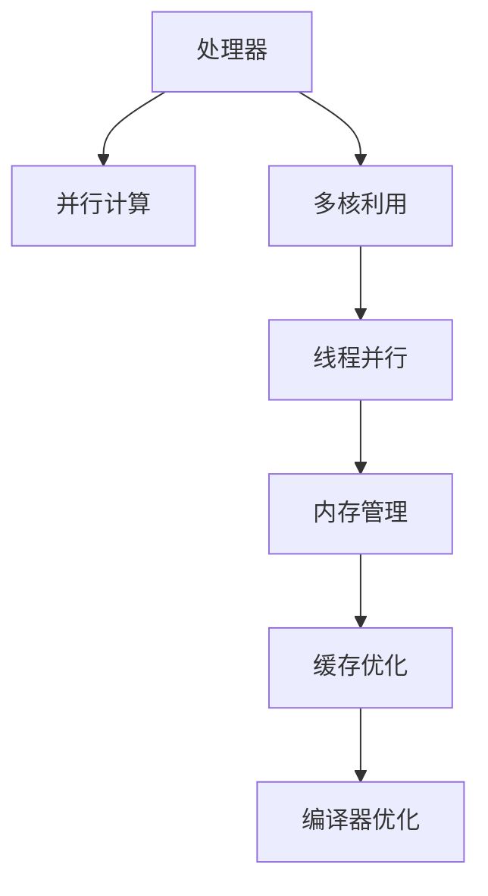

                 

# CPU 优化：充分利用处理器

> 关键词：CPU优化, 处理器, 高性能计算, 多核利用, 线程并行, 内存管理, 缓存优化, 编译器优化

## 1. 背景介绍

### 1.1 问题由来
随着计算任务的复杂性不断增加，对CPU性能的需求也随之提升。然而，即使在最新的处理器上，CPU的物理核心数量是有限的，每个核心的计算能力也并非无限。如何在有限的物理资源下，最大限度地提升计算性能？这一问题迫切需要有效的CPU优化策略来解决。

### 1.2 问题核心关键点
CPU优化问题的核心在于如何高效利用处理器资源，通过并行计算和优化算法来加速任务执行。其关键点包括：

- **并行计算**：将一个任务分解为多个子任务，在不同的CPU核心上同时执行，以提高计算效率。
- **多核利用**：充分挖掘CPU多核架构的潜能，通过多线程并行实现任务加速。
- **内存管理**：优化内存使用，减少内存访问延迟，提高缓存命中率。
- **缓存优化**：通过合理设计数据结构和算法，提升缓存的命中率，减少缓存缺失。
- **编译器优化**：利用编译器的优化工具，自动生成更高效的代码。

### 1.3 问题研究意义
CPU优化对于提升计算性能、降低能耗、加快任务处理速度具有重要意义。随着深度学习、高性能计算、大数据等领域的快速发展，CPU优化技术的应用愈加广泛，成为提高系统整体性能的关键。

通过CPU优化，可以：
1. **提升计算速度**：通过并行计算和多核利用，加速计算密集型任务的执行。
2. **降低能耗**：优化算法和资源分配，减少不必要的计算，降低能耗。
3. **改善用户体验**：优化后的程序运行更快，用户体验更佳。
4. **增强竞争力**：优化后的应用在市场竞争中更具优势。

## 2. 核心概念与联系

### 2.1 核心概念概述

为更好地理解CPU优化技术，本节将介绍几个关键概念：

- **处理器(Processor)**：CPU是计算机的核心部件，负责执行指令和数据处理。
- **并行计算(Parallel Computing)**：通过同时执行多个任务来提升计算效率。
- **多核利用(Multicore Utilization)**：利用多个物理核心，同时执行任务。
- **线程并行(Thread Parallelism)**：利用软件手段模拟多核并行，提升任务执行速度。
- **内存管理(Memory Management)**：优化内存使用，减少内存访问延迟。
- **缓存优化(Cache Optimization)**：通过合理设计，提高缓存命中率，减少缓存缺失。
- **编译器优化(Compiler Optimization)**：利用编译器的优化工具，自动生成更高效的代码。

这些概念之间的关系可以通过以下Mermaid流程图来展示：



这个流程图展示了CPU优化的各个关键点，以及它们之间的联系和相互作用。

## 3. 核心算法原理 & 具体操作步骤

### 3.1 算法原理概述

CPU优化涉及到多个领域的算法和原理，本节将从整体上概述这些关键原理。

- **任务分解**：将一个大任务分解为多个子任务，每个子任务可以并行执行。
- **负载均衡**：将任务均匀地分配到各个核心上，避免某些核心过载。
- **线程调度**：合理调度线程，确保任务能够高效地并行执行。
- **内存分页**：通过内存分页，将程序数据分配到合适的内存页面，减少内存访问延迟。
- **缓存策略**：设计合理的缓存策略，提升缓存命中率，减少缓存缺失。
- **编译器优化**：利用编译器的优化指令和工具，自动生成更高效的代码。

### 3.2 算法步骤详解

CPU优化通常包括以下几个关键步骤：

**Step 1: 任务分解**
- 分析任务，将其分解为多个独立的子任务。
- 使用数据流图或任务图描述任务分解，确保每个子任务是独立的。

**Step 2: 负载均衡**
- 将任务均匀地分配到各个物理核心上。
- 使用动态负载均衡算法，根据各核心的计算能力动态调整任务分配。

**Step 3: 线程调度**
- 设计合理的线程调度策略，确保线程的公平和高效。
- 利用线程池等技术，复用线程，减少线程创建和销毁的开销。

**Step 4: 内存分页**
- 将程序数据分配到内存中合适的页面，避免频繁的内存交换。
- 利用分段和分页技术，将程序分为多个逻辑段，每个段独立管理。

**Step 5: 缓存优化**
- 分析数据访问模式，设计合理的缓存策略。
- 利用缓存预取和缓存融合技术，提升缓存命中率，减少缓存缺失。

**Step 6: 编译器优化**
- 利用编译器的优化指令和工具，自动生成更高效的代码。
- 对编译器进行自定义优化，针对特定任务生成优化后的代码。

### 3.3 算法优缺点

CPU优化方法具有以下优点：
1. **提升计算效率**：通过并行计算和多核利用，显著提升计算速度。
2. **降低能耗**：优化算法和资源分配，减少不必要的计算，降低能耗。
3. **改善用户体验**：优化后的程序运行更快，用户体验更佳。
4. **增强竞争力**：优化后的应用在市场竞争中更具优势。

同时，这些方法也存在一定的局限性：
1. **实现复杂度较高**：优化过程需要深入理解任务的特性和计算机架构，实现起来相对复杂。
2. **性能提升有限**：某些优化方法的效果可能并不显著，特别是对于小规模任务。
3. **依赖硬件**：优化方法依赖于处理器和内存等硬件资源，不同硬件的优化效果可能有所不同。
4. **维护成本高**：优化后的代码维护成本较高，需要定期更新和调整。

尽管存在这些局限性，CPU优化仍然是大规模计算和高性能计算领域的重要技术，能够显著提升系统性能，降低成本，增强竞争力。

### 3.4 算法应用领域

CPU优化技术在多个领域得到了广泛应用，例如：

- **高性能计算**：在科学计算、数据分析、人工智能等领域，CPU优化技术被广泛应用，以提升计算性能。
- **大数据处理**：在大数据存储和处理中，CPU优化技术通过并行计算和多核利用，加速数据处理和分析。
- **图像和视频处理**：在图像和视频处理中，CPU优化技术通过线程并行和缓存优化，提升处理速度。
- **游戏和图形渲染**：在游戏和图形渲染中，CPU优化技术通过多核利用和线程并行，提升渲染性能。
- **数据库管理系统**：在数据库管理系统中，CPU优化技术通过并行查询和多核利用，加速数据查询和处理。

除了上述这些典型应用外，CPU优化技术还被广泛应用于操作系统、网络通信、工业控制等众多领域，为系统的高效运行提供了有力保障。

## 4. 数学模型和公式 & 详细讲解 & 举例说明

### 4.1 数学模型构建

本节将使用数学语言对CPU优化过程中的关键算法进行更加严格的刻画。

假设CPU处理器的核心数量为 $C$，每个核心的计算能力为 $f$，任务的处理时间为 $T$，每个核心的计算速率约为 $g$。任务被分解为 $N$ 个子任务，每个子任务的处理时间为 $t$。

### 4.2 公式推导过程

首先，我们需要计算每个子任务在一个核心上的并行处理时间，以及整个任务的总处理时间。

设 $P_i$ 为第 $i$ 个子任务在一个核心上的并行处理时间，则：

$$ P_i = \frac{t}{C} $$

整个任务在一个核心上的并行处理时间为 $P = \sum_{i=1}^N P_i = \frac{T}{C}$。

### 4.3 案例分析与讲解

假设任务被分解为两个子任务，每个子任务的处理时间分别为 $t_1$ 和 $t_2$，每个核心的计算速率分别为 $g_1$ 和 $g_2$。

- **并行处理时间**：
  $$ P_1 = \frac{t_1}{C}, \quad P_2 = \frac{t_2}{C} $$

- **总并行处理时间**：
  $$ P = \frac{t_1}{C} + \frac{t_2}{C} $$

- **任务总处理时间**：
  $$ T = P \times C = t_1 + t_2 $$

通过上述公式，我们可以计算出任务的并行处理时间和总处理时间，从而评估并行计算的效率。

## 5. 项目实践：代码实例和详细解释说明

### 5.1 开发环境搭建

在进行CPU优化实践前，我们需要准备好开发环境。以下是使用C++进行优化的环境配置流程：

1. 安装编译器：使用GCC或Clang等编译器，安装编译器工具链。
2. 安装开发库：安装必要的开发库，如OpenMP、MPI等。
3. 安装调试工具：安装调试工具，如gdb、valgrind等。
4. 配置优化选项：在编译命令中设置优化选项，如-O2、-fopenmp等。

完成上述步骤后，即可在Linux环境下开始优化实践。

### 5.2 源代码详细实现

下面以多核并行计算为例，给出使用OpenMP进行C++代码优化的示例。

```cpp
#include <iostream>
#include <omp.h>

void parallel_task(int* data, int size) {
    #pragma omp parallel for
    for (int i = 0; i < size; ++i) {
        data[i] = i * 2;
    }
}

int main() {
    int size = 100000000;
    int* data = new int[size];
    parallel_task(data, size);
    for (int i = 0; i < size; ++i) {
        std::cout << data[i] << " ";
    }
    delete[] data;
    return 0;
}
```

在上述代码中，我们定义了一个 `parallel_task` 函数，使用 `#pragma omp parallel for` 指令开启多核并行计算。通过并行计算，每个线程对数组 `data` 进行赋值操作，从而加速任务执行。

### 5.3 代码解读与分析

让我们再详细解读一下关键代码的实现细节：

**OpenMP**：
- `#pragma omp parallel for`：开启并行计算，将数组赋值操作并行化。
- `omp_get_num_threads()`：获取当前并行计算线程数。

**数据结构**：
- `int* data`：定义一个整型数组，用于存储并行计算的结果。
- `size`：定义数组大小，用于控制并行计算的范围。

**算法实现**：
- `for (int i = 0; i < size; ++i)`：遍历数组，对每个元素进行赋值操作。
- `data[i] = i * 2`：将数组元素赋值为 `i` 的两倍。

通过上述代码，我们展示了如何利用OpenMP进行多核并行计算。OpenMP提供了一种便捷的并行编程方式，能够高效利用多核处理器，提升计算效率。

## 6. 实际应用场景

### 6.1 高性能计算

在科学计算、数据分析等领域，高性能计算是必不可少的。CPU优化技术通过并行计算和多核利用，能够显著提升计算性能，加速任务的执行。

例如，在气象预报、气候模拟、金融模型等领域，CPU优化技术被广泛应用于计算密集型任务。通过并行计算和多核利用，能够快速计算出复杂的数学模型，提供准确的预测结果。

### 6.2 大数据处理

在大数据存储和处理中，CPU优化技术通过并行计算和多核利用，加速数据处理和分析。

例如，在Hadoop、Spark等大数据处理框架中，CPU优化技术被广泛应用。通过并行计算和多核利用，能够加速数据读取、处理和存储，提高系统的吞吐量和响应速度。

### 6.3 图像和视频处理

在图像和视频处理中，CPU优化技术通过线程并行和缓存优化，提升处理速度。

例如，在图像处理软件如Photoshop、视频编辑软件如Premiere中，CPU优化技术被广泛应用于图像和视频处理。通过线程并行和缓存优化，能够快速处理大型图像和视频文件，提升用户体验。

### 6.4 游戏和图形渲染

在游戏和图形渲染中，CPU优化技术通过多核利用和线程并行，提升渲染性能。

例如，在游戏引擎如Unity、Unreal Engine中，CPU优化技术被广泛应用于图形渲染。通过多核利用和线程并行，能够实时渲染复杂的场景和特效，提升游戏的视觉效果和运行速度。

## 7. 工具和资源推荐

### 7.1 学习资源推荐

为了帮助开发者系统掌握CPU优化的理论基础和实践技巧，这里推荐一些优质的学习资源：

1. 《高性能计算与并行算法》系列书籍：系统讲解了高性能计算和并行算法的基本原理和实现方法。
2. 《并行编程》课程：介绍并行编程的基本概念和实现方法，适合初学者入门。
3. 《OpenMP教程》：详细讲解了OpenMP的用法和最佳实践，帮助开发者高效利用多核处理器。
4. 《CUDA编程》书籍：介绍CUDA并行计算的实现方法和最佳实践，适合深度学习和高性能计算开发者。
5. 《缓存优化技术》文章：系统讲解了缓存优化的基本原理和实现方法，帮助开发者提升缓存命中率，减少缓存缺失。

通过对这些资源的学习实践，相信你一定能够快速掌握CPU优化的精髓，并用于解决实际的计算问题。

### 7.2 开发工具推荐

高效的开发离不开优秀的工具支持。以下是几款用于CPU优化开发的常用工具：

1. GCC/Clang：高性能编译器，支持多线程和并行计算。
2. OpenMP：一种便捷的并行编程方式，支持多线程和任务并行。
3. MPI：一种高效的多进程并行计算框架，支持大规模计算任务。
4. gdb：强大的调试工具，支持多线程和并行计算的调试。
5. valgrind：内存调试工具，帮助开发者发现内存泄漏和缓存缺失等问题。

合理利用这些工具，可以显著提升CPU优化任务的开发效率，加快创新迭代的步伐。

### 7.3 相关论文推荐

CPU优化技术的发展源于学界的持续研究。以下是几篇奠基性的相关论文，推荐阅读：

1. "A Survey of Parallel Computation" by Hennessy et al.：综述了并行计算的基本原理和实现方法。
2. "Accelerating Deep Learning with High-Performance GPUs" by Smith et al.：介绍了使用GPU进行深度学习的优化方法。
3. "Optimization Techniques for CUDA" by Scalmani et al.：详细讲解了CUDA并行计算的优化方法。
4. "Efficient Memory Access and Data Layout for Multicore Architectures" by Puri et al.：介绍了多核架构下的内存访问和数据布局优化方法。
5. "Optimizing Compilers for Parallelism and Scalability" by Torczon et al.：系统讲解了编译器优化的方法和工具。

这些论文代表了大规模计算和高性能计算的发展脉络。通过学习这些前沿成果，可以帮助研究者把握学科前进方向，激发更多的创新灵感。

## 8. 总结：未来发展趋势与挑战

### 8.1 总结

本文对CPU优化技术进行了全面系统的介绍。首先阐述了CPU优化技术的研究背景和意义，明确了并行计算、多核利用、内存管理、缓存优化、编译器优化等关键技术的作用。其次，从原理到实践，详细讲解了CPU优化的数学模型和算法步骤，给出了优化任务开发的完整代码实例。同时，本文还探讨了CPU优化在多个实际应用场景中的应用，展示了CPU优化的广阔前景。

通过本文的系统梳理，可以看到，CPU优化技术在提高计算性能、降低能耗、提升用户体验等方面具有重要价值。未来，伴随高性能计算和并行计算的不断发展，CPU优化技术必将迎来更多的突破和应用，成为提高系统整体性能的关键。

### 8.2 未来发展趋势

展望未来，CPU优化技术将呈现以下几个发展趋势：

1. **超大规模并行计算**：随着多核处理器和GPU的计算能力不断提升，超大规模并行计算成为可能。超大规模并行计算将进一步推动科学计算、数据分析等领域的发展。

2. **异构计算融合**：CPU、GPU、FPGA等异构计算平台的融合，将带来更高的计算效率和更低的能耗。异构计算技术将加速高性能计算和大数据处理的应用。

3. **软件定义计算(SDC)**：通过编程语言和框架对计算资源进行抽象和调度，实现更灵活、更高效的计算资源利用。软件定义计算技术将进一步提升计算系统的智能化水平。

4. **智能调度算法**：基于机器学习和优化算法，实现更智能、更高效的计算资源分配。智能调度算法将提高系统的资源利用率和计算性能。

5. **低功耗计算**：针对移动设备和小型化计算设备，优化计算算法和资源利用，实现更高效、更节能的计算。低功耗计算技术将推动移动设备和物联网的应用。

以上趋势凸显了CPU优化技术的广阔前景。这些方向的探索发展，必将进一步提升计算系统的性能和能效，推动计算技术的进步。

### 8.3 面临的挑战

尽管CPU优化技术已经取得了显著进展，但在迈向更加智能化、普适化应用的过程中，仍面临诸多挑战：

1. **性能瓶颈**：尽管并行计算和多核利用能够显著提升计算性能，但某些计算密集型任务仍然存在性能瓶颈。如何进一步提升计算效率，需要更多的算法和优化技术。

2. **能耗问题**：并行计算和多核利用虽然能够提升计算性能，但也会带来更高的能耗。如何在提升性能的同时，降低能耗，需要更多的节能技术和优化方法。

3. **可扩展性**：随着任务的复杂性不断增加，系统的可扩展性成为新的挑战。如何构建更灵活、更可扩展的计算系统，需要更多的研究和技术突破。

4. **开发者门槛**：并行计算和多核利用的开发需要更高的技术门槛。如何降低开发门槛，提高开发效率，需要更多的工具和框架支持。

5. **应用场景限制**：尽管CPU优化技术在许多领域得到了广泛应用，但某些特殊应用场景仍然存在局限性。如何打破应用场景限制，拓展优化技术的应用范围，需要更多的创新和探索。

### 8.4 研究展望

面对CPU优化技术面临的挑战，未来的研究需要在以下几个方面寻求新的突破：

1. **异构计算技术**：开发异构计算平台的优化方法，利用CPU、GPU、FPGA等计算资源的融合，提升计算效率和能效。

2. **智能调度算法**：研究智能调度算法，利用机器学习和优化算法，实现更高效、更智能的计算资源分配。

3. **新型编程模型**：开发新型编程模型，实现更灵活、更高效的计算资源抽象和调度。

4. **低功耗计算技术**：研究低功耗计算技术，开发更高效、更节能的计算方法，推动移动设备和物联网的应用。

5. **多核优化工具**：开发多核优化工具，帮助开发者更轻松、更高效地实现多核并行计算。

6. **硬件加速技术**：开发硬件加速技术，利用FPGA、ASIC等硬件资源，提升计算性能和能效。

这些研究方向的探索，必将引领CPU优化技术迈向更高的台阶，为构建高性能计算系统和智能计算系统铺平道路。面向未来，CPU优化技术还需要与其他计算技术进行更深入的融合，如GPU优化、量子计算等，多路径协同发力，共同推动计算技术的进步。只有勇于创新、敢于突破，才能不断拓展计算技术的边界，让计算技术更好地造福人类社会。

## 9. 附录：常见问题与解答

**Q1：CPU优化是否适用于所有计算任务？**

A: CPU优化通常适用于计算密集型任务，如科学计算、数据分析、图像处理、视频处理等。但对于I/O密集型任务，CPU优化效果可能有限。I/O密集型任务需要通过优化I/O操作和网络通信等手段来提升性能。

**Q2：CPU优化是否会影响程序的复杂度？**

A: CPU优化通常需要更多的算法和工具支持，可能会增加程序的复杂度。但优化后的程序运行更快，能效更高，总体上提升系统的性能和可靠性。

**Q3：CPU优化是否会影响程序的稳定性？**

A: CPU优化通常不会影响程序的稳定性，但需要仔细设计和测试。优化过程中需要考虑线程安全、内存一致性等问题，避免出现竞态条件和数据竞争。

**Q4：CPU优化是否会影响程序的可维护性？**

A: CPU优化通常会增加程序的复杂度，但通过良好的文档和注释，可以提升代码的可读性和可维护性。优化后的程序运行更快，稳定性更高，能够更好地满足用户的性能需求。

**Q5：CPU优化是否会影响程序的调试难度？**

A: CPU优化通常不会影响程序的调试难度，但需要更精细的调试工具和策略。优化过程中需要考虑多线程、并发等问题，避免出现死锁、饥饿等异常。

这些问题的解答展示了CPU优化的实际应用场景和潜在风险，帮助开发者更好地理解和应用CPU优化技术。

---

作者：禅与计算机程序设计艺术 / Zen and the Art of Computer Programming

