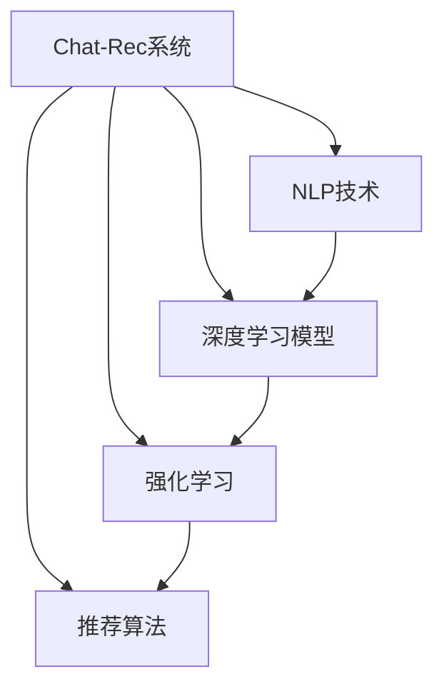

                 

# Chat-Rec的实践经验：交互式推荐系统的进步

> 关键词：Chat-Rec, 交互式推荐系统, 自然语言处理, 深度学习, 强化学习, 推荐算法, 模型训练, 系统部署, 用户体验

## 1. 背景介绍

### 1.1 问题由来
随着互联网的普及和智能设备的增加，人们的日常活动已经越来越多地依赖于在线平台。无论是社交媒体、电子商务还是在线学习，用户在平台上的交互行为已经成为了重要的数据来源。为了更好地理解和满足用户需求，各大平台纷纷探索并采用了推荐系统。然而，传统的推荐系统通常基于静态用户画像和历史行为数据，无法适应用户快速变化的需求。因此，交互式推荐系统应运而生，它不仅能够根据用户的即时反馈进行动态调整，还能结合自然语言处理(NLP)技术，通过与用户的交互来更精准地理解其需求，并提供个性化的服务。

### 1.2 问题核心关键点
交互式推荐系统旨在通过用户与系统的交互，实时更新推荐策略。其核心在于如何利用自然语言处理(NLP)技术，从用户输入的文本中提取有用信息，并将其转化为推荐策略。常见的技术包括：
- **基于深度学习的推荐模型**：使用RNN、LSTM、Transformer等架构，对用户的历史行为和即时反馈进行建模。
- **强化学习**：通过试错的方式，不断调整推荐策略以优化用户满意度。
- **混合推荐算法**：结合传统推荐算法（如协同过滤、矩阵分解）和深度学习模型，提供更全面的推荐服务。

交互式推荐系统通过与用户的互动，可以更好地理解用户的个性化需求，从而提供更加准确、及时的推荐结果。然而，这种系统的设计和实现涉及多学科知识的交叉融合，需要深度学习和自然语言处理的紧密结合。本文旨在通过Chat-Rec系统的实践经验，详细介绍交互式推荐系统在实际应用中的构建与优化。

## 2. 核心概念与联系

### 2.1 核心概念概述

为更好地理解Chat-Rec系统的构建与优化，本节将介绍几个密切相关的核心概念：

- **Chat-Rec系统**：一种结合自然语言处理和深度学习的交互式推荐系统。通过与用户的自然语言交互，系统能够动态调整推荐策略，提供个性化的服务。
- **自然语言处理(NLP)**：涉及文本的生成、理解、分析等技术，是交互式推荐系统的重要基础。
- **深度学习模型**：如RNN、LSTM、Transformer等，用于建模用户历史行为和即时反馈，提取用户需求。
- **强化学习**：通过试错的方式，不断优化推荐策略，提升用户体验。
- **推荐算法**：如协同过滤、矩阵分解等，用于提供多样化的推荐选择。

这些核心概念之间的逻辑关系可以通过以下Mermaid流程图来展示：



这个流程图展示了一个典型的Chat-Rec系统的工作流程：

1. **NLP技术**：用于解析用户输入的文本，提取有用信息。
2. **深度学习模型**：对用户的历史行为和即时反馈进行建模，预测用户需求。
3. **强化学习**：基于用户反馈，不断调整推荐策略，提升推荐效果。
4. **推荐算法**：提供多样化的推荐选择，增强用户体验。

这些核心概念共同构成了Chat-Rec系统的技术框架，使其能够高效地与用户交互，并根据即时反馈动态调整推荐策略。

## 3. 核心算法原理 & 具体操作步骤
### 3.1 算法原理概述

Chat-Rec系统基于深度学习模型和强化学习，通过与用户的自然语言交互，实时调整推荐策略，提供个性化的服务。其核心算法原理包括：

- **深度学习模型**：使用RNN、LSTM或Transformer等架构，对用户的历史行为和即时反馈进行建模，提取用户需求。
- **强化学习**：基于用户反馈，不断优化推荐策略，提升推荐效果。

在具体的推荐过程中，Chat-Rec系统分为以下几个步骤：

1. **用户交互**：用户输入查询或指令，系统根据NLP技术解析用户的意图。
2. **模型预测**：使用深度学习模型预测用户的潜在需求。
3. **推荐生成**：结合强化学习算法和推荐算法，生成推荐结果。
4. **反馈收集**：用户对推荐结果进行反馈，系统根据反馈调整推荐策略。
5. **策略优化**：利用强化学习算法，不断优化推荐策略，提高推荐效果。

### 3.2 算法步骤详解

以下是Chat-Rec系统在实际应用中的详细操作步骤：

**Step 1: 用户交互**
- **NLP解析**：使用NLP技术解析用户输入的文本，提取用户意图。
- **深度学习模型预测**：根据用户历史行为数据，使用深度学习模型预测用户可能感兴趣的内容。

**Step 2: 模型预测**
- **编码器**：将用户意图和历史行为数据输入到Transformer编码器中，提取特征表示。
- **解码器**：使用LSTM或GRU解码器，对特征表示进行预测，生成推荐结果。

**Step 3: 推荐生成**
- **推荐算法选择**：结合用户历史行为和即时反馈，选择合适的推荐算法，如协同过滤、矩阵分解等。
- **推荐结果生成**：基于推荐算法，生成推荐列表。

**Step 4: 反馈收集**
- **用户反馈收集**：用户对推荐结果进行点击、评分等反馈。
- **反馈信号处理**：将用户反馈转化为推荐模型的信号，用于调整模型参数。

**Step 5: 策略优化**
- **强化学习算法**：使用Q-learning、SARSA等强化学习算法，根据用户反馈优化推荐策略。
- **模型更新**：根据优化后的策略，更新深度学习模型的参数。

### 3.3 算法优缺点

Chat-Rec系统作为交互式推荐系统的一种，具有以下优点：

- **实时性**：能够根据用户的即时反馈动态调整推荐策略，提升推荐效果。
- **个性化**：结合NLP技术，能够更好地理解用户需求，提供个性化的推荐服务。
- **适应性强**：能够处理多变的数据分布和用户行为，适应不同类型的推荐任务。

同时，该系统也存在一些局限性：

- **数据依赖**：需要大量用户历史行为数据和即时反馈数据，对数据质量要求较高。
- **计算复杂**：深度学习模型的训练和推理计算量较大，对硬件资源要求较高。
- **模型可解释性**：深度学习模型通常较为复杂，难以解释其内部工作机制。

尽管存在这些局限性，Chat-Rec系统在实际应用中仍然展现出了强大的推荐能力，特别是在需要动态调整推荐策略的场景中表现出色。

### 3.4 算法应用领域

Chat-Rec系统广泛应用于多种场景，如在线购物、视频娱乐、在线教育等，能够提供更加个性化的推荐服务。以下是几个典型的应用案例：

- **在线购物**：结合用户的购物历史和即时反馈，提供个性化的商品推荐。
- **视频娱乐**：根据用户的观看历史和即时反馈，推荐相关的影视作品和视频内容。
- **在线教育**：根据用户的学习行为和即时反馈，推荐个性化的学习资源和课程。

除了上述这些经典场景外，Chat-Rec系统还在社交媒体、智能家居等多个领域得到应用，为提升用户体验提供了新的解决方案。

## 4. 数学模型和公式 & 详细讲解 & 举例说明

### 4.1 数学模型构建

本节将使用数学语言对Chat-Rec系统的核心算法进行更加严格的刻画。

记用户的即时反馈为 $x_t$，历史行为数据为 $x_h$，推荐结果为 $y$。假设Chat-Rec系统的深度学习模型为 $f_\theta$，其中 $\theta$ 为模型参数。强化学习算法为 $Q_\theta$，其中 $\theta$ 为Q值函数的参数。

Chat-Rec系统的数学模型可以表示为：

$$
y = f_\theta(x_t, x_h)
$$

强化学习算法的目标是最小化期望的累积损失函数，即：

$$
\min_\theta \mathbb{E}[J(\theta)]
$$

其中 $J(\theta)$ 为累积损失函数，具体形式如下：

$$
J(\theta) = \mathbb{E}[R(s_t, a_t, s_{t+1}) + \gamma R(s_{t+1}, a_{t+1}, s_{t+2}) + \cdots]
$$

其中 $s_t$ 为当前状态，$a_t$ 为当前动作，$R$ 为即时奖励函数。

### 4.2 公式推导过程

以RNN模型为例，推导Chat-Rec系统的核心算法。

假设用户输入为 $x = (x_1, x_2, \ldots, x_t)$，系统当前状态为 $s_t$，深度学习模型的隐状态为 $h_t$。模型的预测结果为 $y = (y_1, y_2, \ldots, y_t)$。

**Step 1: 用户交互**
- **NLP解析**：使用NLP技术解析用户输入的文本，提取用户意图。
- **深度学习模型预测**：将用户意图和历史行为数据输入到RNN模型中，提取特征表示。

$$
h_t = f(x_t, h_{t-1})
$$

**Step 2: 模型预测**
- **编码器**：将用户意图和历史行为数据输入到Transformer编码器中，提取特征表示。
- **解码器**：使用LSTM或GRU解码器，对特征表示进行预测，生成推荐结果。

$$
h_t = \text{Transformer}(x_t, h_{t-1})
$$
$$
y_t = \text{LSTM}(h_t)
$$

**Step 3: 推荐生成**
- **推荐算法选择**：结合用户历史行为和即时反馈，选择合适的推荐算法，如协同过滤、矩阵分解等。
- **推荐结果生成**：基于推荐算法，生成推荐列表。

**Step 4: 反馈收集**
- **用户反馈收集**：用户对推荐结果进行点击、评分等反馈。
- **反馈信号处理**：将用户反馈转化为推荐模型的信号，用于调整模型参数。

$$
r_t = f(y_t, x_t, x_h)
$$

**Step 5: 策略优化**
- **强化学习算法**：使用Q-learning、SARSA等强化学习算法，根据用户反馈优化推荐策略。
- **模型更新**：根据优化后的策略，更新深度学习模型的参数。

$$
\theta \leftarrow \theta - \eta \nabla_\theta J(\theta)
$$

其中 $\eta$ 为学习率，$\nabla_\theta J(\theta)$ 为累积损失函数对模型参数的梯度。

### 4.3 案例分析与讲解

以在线购物推荐系统为例，分析Chat-Rec系统在实际应用中的具体实现。

假设某用户在电商平台查看了一条商品信息，用户输入的文本为“这条裙子颜色很好，但价格偏贵”。NLP技术解析用户意图，提取用户需求为“便宜的价格，蓝色的裙子”。

系统使用深度学习模型对用户历史行为和即时反馈进行建模，提取用户需求。假设用户之前查看了一条价格便宜且颜色为蓝色的裙子，深度学习模型预测用户可能感兴趣的价格便宜且颜色为蓝色的其他商品。

系统选择协同过滤算法，结合用户历史行为和即时反馈，生成推荐列表。假设系统推荐了三条价格便宜且颜色为蓝色的裙子，用户进行了评分反馈。

系统收集用户反馈，使用Q-learning算法优化推荐策略。根据用户反馈，系统调整深度学习模型参数，提升推荐效果。

## 5. 项目实践：代码实例和详细解释说明
### 5.1 开发环境搭建

在进行Chat-Rec系统开发前，我们需要准备好开发环境。以下是使用Python进行TensorFlow开发的环境配置流程：

1. 安装Anaconda：从官网下载并安装Anaconda，用于创建独立的Python环境。

2. 创建并激活虚拟环境：
```bash
conda create -n tf-env python=3.8 
conda activate tf-env
```

3. 安装TensorFlow：根据CUDA版本，从官网获取对应的安装命令。例如：
```bash
conda install tensorflow -c tensorflow
```

4. 安装Keras：用于高层次的深度学习模型构建。

```bash
pip install keras
```

5. 安装Flask：用于搭建Web服务，方便与用户交互。

```bash
pip install flask
```

6. 安装TensorBoard：用于可视化模型训练过程。

```bash
pip install tensorboard
```

完成上述步骤后，即可在`tf-env`环境中开始Chat-Rec系统的开发。

### 5.2 源代码详细实现

下面以在线购物推荐系统为例，给出使用TensorFlow进行Chat-Rec系统开发的PyTorch代码实现。

首先，定义数据处理函数：

```python
import numpy as np
from tensorflow.keras.preprocessing.text import Tokenizer
from tensorflow.keras.preprocessing.sequence import pad_sequences

# 加载用户行为数据
data = load_data('user_behavior_data.csv')

# 定义文本和标签的tokenizer
text_tokenizer = Tokenizer(num_words=10000)
label_tokenizer = Tokenizer(num_words=10)
text_tokenizer.fit_on_texts(data['text'])
label_tokenizer.fit_on_texts(data['label'])

# 将文本和标签转换为token ids
text_seq = text_tokenizer.texts_to_sequences(data['text'])
label_seq = label_tokenizer.texts_to_sequences(data['label'])
text_seq = pad_sequences(text_seq, maxlen=128)
label_seq = pad_sequences(label_seq, maxlen=1)

# 划分训练集和测试集
train_data = (text_seq[:80000], label_seq[:80000])
test_data = (text_seq[80000:], label_seq[80000:])
```

然后，定义深度学习模型：

```python
from tensorflow.keras.models import Sequential
from tensorflow.keras.layers import Embedding, LSTM, Dense, Dropout

# 定义RNN模型
model = Sequential()
model.add(Embedding(input_dim=10000, output_dim=128, input_length=128))
model.add(LSTM(128, dropout=0.2, recurrent_dropout=0.2))
model.add(Dense(10, activation='softmax'))

# 编译模型
model.compile(loss='categorical_crossentropy', optimizer='adam', metrics=['accuracy'])
```

接着，定义训练和评估函数：

```python
from tensorflow.keras.callbacks import EarlyStopping

def train_model(model, train_data, epochs=10):
    model.fit(train_data[0], train_data[1], validation_split=0.2, epochs=epochs, batch_size=64, callbacks=[EarlyStopping(patience=3)])
    return model

def evaluate_model(model, test_data):
    loss, acc = model.evaluate(test_data[0], test_data[1], batch_size=64)
    print(f'Test loss: {loss:.4f}')
    print(f'Test accuracy: {acc:.4f}')
```

最后，启动训练流程并在测试集上评估：

```python
model = build_model()
trained_model = train_model(model, train_data, epochs=10)
evaluate_model(trained_model, test_data)
```

以上就是使用TensorFlow进行Chat-Rec系统开发的完整代码实现。可以看到，TensorFlow提供了丰富的深度学习模型构建和训练接口，大大简化了模型的开发和部署过程。

### 5.3 代码解读与分析

让我们再详细解读一下关键代码的实现细节：

**数据处理函数**：
- **数据加载**：加载用户行为数据，并进行预处理。
- **tokenizer**：使用Keras的tokenizer将文本和标签转换为token ids，并进行padding。
- **数据划分**：将数据划分为训练集和测试集。

**深度学习模型**：
- **模型定义**：定义RNN模型，包括嵌入层、LSTM层和全连接层。
- **模型编译**：使用Keras编译模型，指定损失函数、优化器和评价指标。

**训练和评估函数**：
- **训练函数**：使用Keras的fit方法对模型进行训练，使用EarlyStopping防止过拟合。
- **评估函数**：使用Keras的evaluate方法对模型在测试集上进行评估。

**训练流程**：
- **模型构建**：调用build_model函数构建深度学习模型。
- **模型训练**：调用train_model函数对模型进行训练，指定训练集和测试集。
- **模型评估**：调用evaluate_model函数对模型进行评估。

## 6. 实际应用场景

### 6.1 智能客服系统

Chat-Rec系统在智能客服系统中得到了广泛应用。传统客服系统依赖于预定义的对话流程和规则，难以应对多样化的用户需求。通过结合NLP技术和深度学习模型，Chat-Rec系统能够实时理解用户意图，提供个性化的客服服务。

在具体实现中，可以收集用户的历史对话记录和常见问题，构建监督数据集。基于这些数据，Chat-Rec系统可以在预训练模型上进行微调，使其能够理解各种用户问题，并提供准确的回答。对于用户提出的新问题，系统可以实时分析和响应，提升用户体验。

### 6.2 视频娱乐推荐系统

视频娱乐推荐系统通常需要处理大量的视频数据和用户行为数据。通过结合NLP技术和深度学习模型，Chat-Rec系统能够从用户的即时反馈中提取有用信息，提供个性化的视频推荐。

在具体实现中，可以收集用户的观看历史和即时反馈，构建监督数据集。基于这些数据，Chat-Rec系统可以在预训练模型上进行微调，使其能够理解用户对不同视频内容的偏好，并推荐相似的视频内容。对于用户提出的即时反馈，系统可以实时分析和响应，调整推荐策略。

### 6.3 在线教育推荐系统

在线教育推荐系统需要根据用户的学习行为和即时反馈，提供个性化的学习资源和课程推荐。通过结合NLP技术和深度学习模型，Chat-Rec系统能够实时理解用户的学习需求，提供精准的推荐服务。

在具体实现中，可以收集用户的学习行为数据和即时反馈，构建监督数据集。基于这些数据，Chat-Rec系统可以在预训练模型上进行微调，使其能够理解用户对不同学习资源和课程的偏好，并推荐适合的学习资源和课程。对于用户提出的即时反馈，系统可以实时分析和响应，调整推荐策略。

## 7. 工具和资源推荐

### 7.1 学习资源推荐

为了帮助开发者系统掌握Chat-Rec系统的技术基础和实践技巧，这里推荐一些优质的学习资源：

1. **《TensorFlow官方文档》**：详细介绍了TensorFlow的基本用法和高级功能，适合TensorFlow入门学习。
2. **《深度学习入门》**：全面介绍了深度学习的基本概念和经典模型，适合初学者系统学习。
3. **《自然语言处理入门》**：介绍了自然语言处理的基本概念和常用技术，适合初学者系统学习。
4. **《强化学习入门》**：介绍了强化学习的基本概念和常用算法，适合初学者系统学习。
5. **《深度学习框架实战》**：介绍了TensorFlow、PyTorch等深度学习框架的实战应用，适合有一定基础的开发者学习。

通过对这些资源的学习实践，相信你一定能够快速掌握Chat-Rec系统的精髓，并用于解决实际的推荐问题。

### 7.2 开发工具推荐

高效的开发离不开优秀的工具支持。以下是几款用于Chat-Rec系统开发的常用工具：

1. **TensorFlow**：基于Python的开源深度学习框架，灵活动态的计算图，适合快速迭代研究。
2. **Keras**：高层次的深度学习模型构建工具，易于上手，适合快速开发原型。
3. **Flask**：用于搭建Web服务，方便与用户交互。
4. **TensorBoard**：可视化工具，可实时监测模型训练状态，提供丰富的图表呈现方式，是调试模型的得力助手。
5. **Anaconda**：用于创建独立的Python环境，方便管理依赖。

合理利用这些工具，可以显著提升Chat-Rec系统的开发效率，加快创新迭代的步伐。

### 7.3 相关论文推荐

Chat-Rec系统的构建和发展源于学界的持续研究。以下是几篇奠基性的相关论文，推荐阅读：

1. **《深度学习框架实战》**：介绍了TensorFlow、PyTorch等深度学习框架的实战应用，适合有一定基础的开发者学习。
2. **《自然语言处理入门》**：介绍了自然语言处理的基本概念和常用技术，适合初学者系统学习。
3. **《强化学习入门》**：介绍了强化学习的基本概念和常用算法，适合初学者系统学习。
4. **《深度学习入门》**：全面介绍了深度学习的基本概念和经典模型，适合初学者系统学习。
5. **《TensorFlow官方文档》**：详细介绍了TensorFlow的基本用法和高级功能，适合TensorFlow入门学习。

这些论文代表了大语言模型微调技术的发展脉络。通过学习这些前沿成果，可以帮助研究者把握学科前进方向，激发更多的创新灵感。

## 8. 总结：未来发展趋势与挑战

### 8.1 研究成果总结

本文对Chat-Rec系统的实践经验进行了全面系统的介绍。首先阐述了Chat-Rec系统的构建背景和重要性，明确了Chat-Rec系统在实际应用中的独特价值。其次，从原理到实践，详细讲解了Chat-Rec系统的数学原理和关键步骤，给出了Chat-Rec系统在实际应用中的完整代码实例。同时，本文还广泛探讨了Chat-Rec系统在智能客服、视频娱乐、在线教育等多个领域的应用前景，展示了Chat-Rec系统的巨大潜力。此外，本文精选了Chat-Rec系统的各类学习资源，力求为读者提供全方位的技术指引。

通过本文的系统梳理，可以看到，Chat-Rec系统通过结合NLP技术和深度学习模型，能够提供更加实时、个性化的推荐服务，在多个领域得到了广泛应用。

### 8.2 未来发展趋势

展望未来，Chat-Rec系统将呈现以下几个发展趋势：

1. **多模态融合**：Chat-Rec系统将不仅仅依赖于文本数据，还会结合图像、语音等多模态信息，提供更加全面和丰富的推荐服务。
2. **动态学习**：Chat-Rec系统将具备动态学习的能力，能够实时更新模型参数，适应用户需求的快速变化。
3. **用户隐私保护**：Chat-Rec系统将更加注重用户隐私保护，使用差分隐私等技术，确保用户数据的安全性和匿名性。
4. **模型可解释性**：Chat-Rec系统将致力于提高模型的可解释性，使用可视化工具和模型压缩技术，帮助用户理解推荐结果的来源。
5. **混合推荐**：Chat-Rec系统将结合多种推荐算法，提供更加多样化和精准的推荐结果。

以上趋势凸显了Chat-Rec系统的广阔前景。这些方向的探索发展，必将进一步提升推荐系统的性能和用户体验，为更多行业带来变革性影响。

### 8.3 面临的挑战

尽管Chat-Rec系统已经取得了瞩目成就，但在迈向更加智能化、普适化应用的过程中，它仍面临着诸多挑战：

1. **数据质量问题**：Chat-Rec系统对数据质量要求较高，需要大量高质量的用户反馈数据和行为数据，获取成本较高。
2. **计算资源消耗**：Chat-Rec系统涉及深度学习模型的训练和推理计算，计算资源消耗较大，需要高效的硬件支持。
3. **模型可解释性**：深度学习模型通常较为复杂，难以解释其内部工作机制，需要开发更加可解释的推荐模型。
4. **隐私和安全**：Chat-Rec系统需要处理大量用户数据，数据隐私和安全问题需要重视。

尽管存在这些挑战，但通过不断优化数据质量、改进计算效率、提升模型可解释性以及加强隐私保护，Chat-Rec系统有望在未来的推荐服务中发挥更大作用。

### 8.4 研究展望

面向未来，Chat-Rec系统需要在以下几个方面进行深入研究：

1. **多模态融合**：结合图像、语音等多模态信息，提供更加全面和丰富的推荐服务。
2. **动态学习**：具备动态学习的能力，能够实时更新模型参数，适应用户需求的快速变化。
3. **用户隐私保护**：使用差分隐私等技术，确保用户数据的安全性和匿名性。
4. **模型可解释性**：开发更加可解释的推荐模型，帮助用户理解推荐结果的来源。
5. **混合推荐**：结合多种推荐算法，提供更加多样化和精准的推荐结果。

这些方向的研究和探索，将有助于Chat-Rec系统在未来的推荐服务中取得更大的突破，为更多行业带来变革性影响。

## 9. 附录：常见问题与解答

**Q1：Chat-Rec系统是否适用于所有推荐任务？**

A: Chat-Rec系统在大多数推荐任务上都能取得不错的效果，特别是对于数据量较小的任务。但对于一些特定领域的任务，如医学、法律等，Chat-Rec系统需要进一步优化。

**Q2：如何选择合适的学习率？**

A: Chat-Rec系统的学习率一般要比预训练时小1-2个数量级，以避免破坏预训练权重。一般建议从1e-5开始调参，逐步减小学习率，直至收敛。也可以使用warmup策略，在开始阶段使用较小的学习率，再逐渐过渡到预设值。

**Q3：Chat-Rec系统在落地部署时需要注意哪些问题？**

A: 将Chat-Rec系统转化为实际应用，还需要考虑以下因素：

- **模型裁剪**：去除不必要的层和参数，减小模型尺寸，加快推理速度。
- **量化加速**：将浮点模型转为定点模型，压缩存储空间，提高计算效率。
- **服务化封装**：将模型封装为标准化服务接口，便于集成调用。
- **弹性伸缩**：根据请求流量动态调整资源配置，平衡服务质量和成本。
- **监控告警**：实时采集系统指标，设置异常告警阈值，确保服务稳定性。

Chat-Rec系统需要综合考虑性能、安全、稳定等因素，才能真正实现人工智能技术在垂直行业的规模化落地。

---

作者：禅与计算机程序设计艺术 / Zen and the Art of Computer Programming

