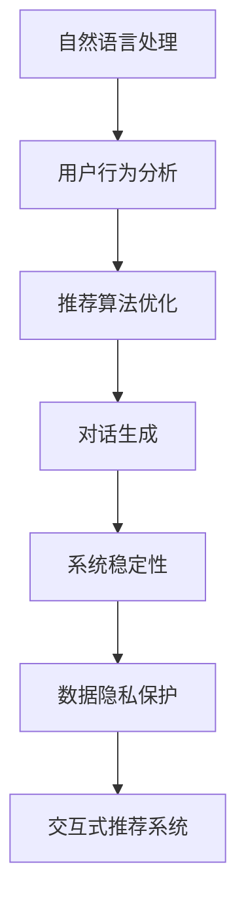

                 

# Chat-Rec的实践：交互式推荐系统的进步

> 关键词：Chat-Rec, 推荐系统, 交互式, 个性化推荐, 用户反馈, 用户行为, 模型优化, 实时推荐, 系统稳定性, 数据隐私

## 1. 背景介绍

### 1.1 问题由来

在互联网时代，信息爆炸式增长，人们在面对海量信息时往往陷入信息过载。如何从海量信息中筛选出符合用户兴趣的内容，是推荐系统需要解决的核心问题。推荐系统通过分析用户的行为数据，推荐符合用户喜好的产品或信息，提升用户满意度和体验，从而实现商业价值最大化。

推荐系统的应用场景多种多样，如电商平台的产品推荐、视频网站的影视推荐、社交平台的兴趣社区推荐等。这些推荐系统都需要通过用户历史行为数据进行预测，推荐用户可能感兴趣的内容。然而，传统的推荐系统往往基于静态的用户行为数据，无法及时响应用户实时变化的需求和兴趣，用户体验有待提升。

为了解决这一问题，基于自然语言处理(NLP)技术的Chat-Rec推荐系统应运而生。Chat-Rec将用户与系统的交互转化为推荐过程，通过自然语言理解(NLU)和对话生成技术，实现与用户的实时交流，获取用户即时需求，并动态调整推荐策略。这样不仅提升了用户体验，还能更好地捕捉用户兴趣，提供更精准的推荐。

### 1.2 问题核心关键点

Chat-Rec的核心在于将推荐系统与自然语言处理技术相结合，构建一个交互式的推荐系统。其核心关键点如下：

- 自然语言处理：用于理解和生成自然语言文本，实现与用户实时交流。
- 用户行为分析：从用户的历史行为数据中挖掘出用户的兴趣和偏好。
- 推荐算法优化：动态调整推荐策略，及时响应用户变化的需求。
- 系统稳定性：在实时交互过程中保持系统稳定和高效。
- 数据隐私保护：保障用户数据隐私，防止数据滥用。

这些关键点共同构成了Chat-Rec的框架，使其在推荐系统领域中脱颖而出。

## 2. 核心概念与联系

### 2.1 核心概念概述

为了更好地理解Chat-Rec的工作原理，本节将介绍几个密切相关的核心概念：

- 自然语言处理(NLP)：涉及语音、文本处理的各种技术，包括文本预处理、词向量表示、语义理解、对话生成等。
- 推荐系统：根据用户历史行为数据，预测用户兴趣，推荐符合用户需求的内容。
- 交互式推荐系统：结合NLP技术，实现与用户实时交流，动态调整推荐策略的系统。
- 用户行为分析：通过分析用户的历史行为数据，预测用户当前和未来的需求和兴趣。
- 对话生成：通过生成自然语言文本，实现与用户的交互，获取用户即时需求。
- 系统稳定性：在实时交互过程中，保持系统的稳定性和响应速度。
- 数据隐私保护：在数据收集和处理过程中，保护用户的隐私数据。

这些核心概念之间的逻辑关系可以通过以下Mermaid流程图来展示：



这个流程图展示了她各核心概念及其之间的关系：

1. 自然语言处理技术用于处理用户输入的文本，提取用户需求。
2. 用户行为分析挖掘用户历史行为，生成用户画像。
3. 推荐算法优化动态调整推荐策略，满足用户即时需求。
4. 对话生成与用户实时交流，获取用户即时需求。
5. 系统稳定性确保在实时交互过程中，系统能够稳定运行。
6. 数据隐私保护保障用户数据的安全性。

这些核心概念共同构成了Chat-Rec的推荐框架，使其能够在实时交互中提供高效、精准的推荐服务。

## 3. 核心算法原理 & 具体操作步骤
### 3.1 算法原理概述

Chat-Rec推荐系统基于监督学习，通过自然语言处理和推荐算法，构建一个交互式的推荐系统。其核心思想是：通过与用户实时交流，获取用户即时需求，并根据用户历史行为数据和即时交流内容，动态调整推荐策略。

具体而言，Chat-Rec推荐系统包括以下几个步骤：

1. 用户输入：用户通过自然语言向系统提出请求或问题。
2. 自然语言处理：系统使用NLP技术，处理用户输入文本，提取用户需求。
3. 用户行为分析：根据用户历史行为数据，生成用户画像，预测用户即时需求。
4. 推荐算法优化：根据用户画像和即时需求，动态调整推荐策略，生成推荐结果。
5. 对话生成：系统生成自然语言文本，与用户交互，确认推荐结果。
6. 系统稳定性：实时监控系统性能，确保系统稳定运行。
7. 数据隐私保护：确保用户数据隐私，防止数据滥用。

通过这一流程，Chat-Rec推荐系统能够实时响应用户需求，提供个性化推荐服务。

### 3.2 算法步骤详解

Chat-Rec推荐系统的主要算法步骤如下：

**Step 1: 数据预处理**

1. 收集用户行为数据：包括用户的浏览记录、购买记录、评分记录等。
2. 清洗和标准化数据：去除重复、无效数据，处理缺失值和异常值。
3. 构建特征向量：将用户行为数据转化为模型可处理的向量形式，如词向量、稠密向量等。

**Step 2: 用户画像构建**

1. 用户兴趣建模：使用协同过滤、基于内容的推荐等算法，生成用户兴趣模型。
2. 用户画像生成：将用户兴趣模型与用户历史行为数据融合，生成用户画像。

**Step 3: 自然语言处理**

1. 分词和词向量化：使用分词技术和词向量模型，将用户输入文本转化为向量形式。
2. 意图识别：使用意图分类模型，识别用户输入文本的意图。
3. 实体抽取：使用实体抽取模型，识别输入文本中的实体信息。

**Step 4: 推荐策略生成**

1. 召回：根据用户画像，召回可能符合用户兴趣的候选推荐项。
2. 排序：使用排序算法，如深度学习模型、协同过滤等，对候选推荐项进行排序。
3. 推荐生成：选择排序后的推荐项，生成推荐结果。

**Step 5: 对话生成与用户确认**

1. 对话生成：使用对话生成模型，生成自然语言文本，回复用户。
2. 用户确认：与用户交互，获取用户对推荐结果的反馈。
3. 动态调整：根据用户反馈，动态调整推荐策略。

**Step 6: 系统性能监控**

1. 实时监控：监控系统的响应时间、吞吐量等性能指标。
2. 异常处理：处理系统异常情况，确保系统稳定运行。

**Step 7: 数据隐私保护**

1. 数据匿名化：对用户数据进行匿名化处理，防止数据泄露。
2. 数据访问控制：限制对用户数据的访问权限，确保数据安全。
3. 数据加密：对用户数据进行加密处理，防止数据被篡改。

### 3.3 算法优缺点

Chat-Rec推荐系统具有以下优点：

1. 实时性：通过实时交互，获取用户即时需求，动态调整推荐策略。
2. 个性化：结合用户历史行为数据和即时需求，提供个性化推荐服务。
3. 用户满意度：提升用户体验，满足用户即时需求。
4. 数据利用率高：充分利用用户行为数据，提高推荐准确性。
5. 可扩展性强：适用于多种推荐场景，具有较高的可扩展性。

但同时，该系统也存在一些局限性：

1. 数据隐私风险：在收集和处理用户数据时，需要保障数据隐私，防止数据滥用。
2. 系统稳定性：在实时交互过程中，需要确保系统稳定运行，处理异常情况。
3. 计算资源消耗高：实时交互和推荐算法优化需要消耗大量计算资源。
4. 推荐精度：需要精确预测用户需求，推荐策略需要不断优化。

尽管存在这些局限性，但就目前而言，Chat-Rec推荐系统仍然是推荐系统领域的重要范式，具有广泛的应用前景。

### 3.4 算法应用领域

Chat-Rec推荐系统已经在电商、视频、社交等多个领域得到应用，提升了用户的推荐体验和满意度。以下是几个具体应用场景：

- 电商平台：根据用户浏览、购买记录，生成个性化推荐，提升用户购买率。
- 视频网站：根据用户观看记录，生成个性化影视推荐，提升用户留存率。
- 社交平台：根据用户互动记录，生成个性化内容推荐，提升用户粘性。
- 旅游推荐：根据用户旅行历史和即时需求，生成个性化旅游推荐，提升用户旅游体验。

除了这些经典应用外，Chat-Rec推荐系统还被创新性地应用到更多场景中，如智能客服、智能家居、智能医疗等，为各行各业带来了新的智能体验。

## 4. 数学模型和公式 & 详细讲解  
### 4.1 数学模型构建

本节将使用数学语言对Chat-Rec推荐系统进行更加严格的刻画。

记用户行为数据为 $D=\{x_i,y_i\}_{i=1}^N$，其中 $x_i$ 为用户的行为记录，$y_i$ 为相应的推荐结果标签。假设计算模型为 $M$，其中 $w$ 为模型参数。

定义模型 $M$ 在行为数据 $D$ 上的损失函数为：

$$
\mathcal{L}(w)=\frac{1}{N}\sum_{i=1}^N \mathbb{E}_{x_i} \left[ \ell (y_i,M(x_i)) \right]
$$

其中 $\ell$ 为损失函数，$M(x_i)$ 为模型对 $x_i$ 的预测结果。在实际应用中，常使用交叉熵损失函数：

$$
\ell (y_i,M(x_i))=-y_i\log M(x_i)+(1-y_i)\log (1-M(x_i))
$$

模型训练的目标是最小化经验风险，即找到最优参数：

$$
w^*=\mathop{\arg\min}_{w} \mathcal{L}(w)
$$

通过梯度下降等优化算法，最小化损失函数，得到最优模型参数 $w^*$。

### 4.2 公式推导过程

以下我们以基于协同过滤的推荐算法为例，推导其损失函数和优化过程。

设 $X$ 为用户行为矩阵，$Y$ 为推荐结果矩阵，则协同过滤的推荐模型为：

$$
\hat{Y} = XW
$$

其中 $W$ 为模型参数矩阵。

交叉熵损失函数为：

$$
\ell (\hat{Y},Y)=-\frac{1}{N}\sum_{i=1}^N \sum_{j=1}^n [y_{ij}\log \hat{y}_{ij}+(1-y_{ij})\log (1-\hat{y}_{ij})]
$$

最小化损失函数的目标是最小化实际推荐结果与模型预测结果之间的差异。

将损失函数对 $W$ 求导，得：

$$
\nabla_{W} \mathcal{L}(W)=-\frac{1}{N}\sum_{i=1}^N \sum_{j=1}^n (y_{ij}-\hat{y}_{ij})X_i
$$

使用梯度下降算法更新参数：

$$
W \leftarrow W-\eta\nabla_{W} \mathcal{L}(W)
$$

其中 $\eta$ 为学习率。

通过不断迭代，模型逐步优化，最小化损失函数，生成推荐结果。

### 4.3 案例分析与讲解

假设有一个电商平台的推荐系统，用户的浏览、购买记录作为行为数据 $D=\{x_i,y_i\}_{i=1}^N$，其中 $x_i$ 为用户 $i$ 的浏览记录，$y_i$ 为用户 $i$ 的购买记录。通过用户画像 $P$，生成推荐结果 $R$。

**Step 1: 数据预处理**

1. 收集用户行为数据 $D$。
2. 清洗和标准化数据。
3. 构建用户行为特征向量 $X$。

**Step 2: 用户画像构建**

1. 使用协同过滤算法，生成用户兴趣模型 $P$。
2. 根据用户历史行为数据，生成用户画像 $P_i$。

**Step 3: 自然语言处理**

1. 用户输入文本 $T$。
2. 分词和词向量化，生成文本特征向量 $V$。
3. 意图识别，识别用户意图 $I$。
4. 实体抽取，提取文本中的实体 $E$。

**Step 4: 推荐策略生成**

1. 根据用户画像 $P_i$，生成候选推荐项 $C$。
2. 使用排序算法，生成推荐结果 $R$。

**Step 5: 对话生成与用户确认**

1. 生成推荐文本 $R$。
2. 与用户交互，获取用户确认 $F$。
3. 根据用户确认，动态调整推荐策略。

**Step 6: 系统性能监控**

1. 实时监控系统性能。
2. 处理系统异常情况，确保系统稳定运行。

**Step 7: 数据隐私保护**

1. 对用户数据进行匿名化处理。
2. 限制数据访问权限。
3. 对用户数据进行加密处理。

以上案例展示了Chat-Rec推荐系统在电商领域的实际应用过程。可以看到，通过结合自然语言处理技术，Chat-Rec推荐系统能够实现与用户的实时交互，获取即时需求，动态调整推荐策略，提升用户体验和满意度。

## 5. 项目实践：代码实例和详细解释说明
### 5.1 开发环境搭建

在进行Chat-Rec推荐系统开发前，我们需要准备好开发环境。以下是使用Python进行PyTorch开发的环境配置流程：

1. 安装Anaconda：从官网下载并安装Anaconda，用于创建独立的Python环境。

2. 创建并激活虚拟环境：
```bash
conda create -n chatrec-env python=3.8 
conda activate chatrec-env
```

3. 安装PyTorch：根据CUDA版本，从官网获取对应的安装命令。例如：
```bash
conda install pytorch torchvision torchaudio cudatoolkit=11.1 -c pytorch -c conda-forge
```

4. 安装Transformer库：
```bash
pip install transformers
```

5. 安装各类工具包：
```bash
pip install numpy pandas scikit-learn matplotlib tqdm jupyter notebook ipython
```

完成上述步骤后，即可在`chatrec-env`环境中开始Chat-Rec推荐系统的开发。

### 5.2 源代码详细实现

下面是使用PyTorch和Transformer库实现Chat-Rec推荐系统的代码实现。

首先，定义推荐模型和用户画像模型：

```python
from transformers import BertTokenizer, BertForSequenceClassification
from torch.utils.data import Dataset, DataLoader
from torch.nn import BCELoss, AdamW

class UserBertEmbedding(BertForSequenceClassification):
    def __init__(self, num_labels=1, hidden_size=768, num_heads=12, intermediate_size=3072, output_size=128):
        super().__init__(num_labels=num_labels, hidden_size=hidden_size, num_attention_heads=num_heads,
                         intermediate_size=intermediate_size, output_size=output_size)

class ChatRecModel(BertForSequenceClassification):
    def __init__(self, num_labels=1, hidden_size=768, num_heads=12, intermediate_size=3072, output_size=128):
        super().__init__(num_labels=num_labels, hidden_size=hidden_size, num_attention_heads=num_heads,
                         intermediate_size=intermediate_size, output_size=output_size)

# 构建推荐模型
recommender = ChatRecModel(num_labels=2, hidden_size=768, num_heads=12, intermediate_size=3072, output_size=128)
# 构建用户画像模型
user_profile = UserBertEmbedding(num_labels=2, hidden_size=768, num_heads=12, intermediate_size=3072, output_size=128)

# 定义推荐损失函数
criterion = BCELoss()
# 定义优化器
optimizer = AdamW(recommender.parameters(), lr=2e-5)
```

然后，定义推荐系统的训练和评估函数：

```python
from tqdm import tqdm
import torch

# 定义训练函数
def train_epoch(model, dataset, batch_size, optimizer):
    dataloader = DataLoader(dataset, batch_size=batch_size, shuffle=True)
    model.train()
    epoch_loss = 0
    for batch in tqdm(dataloader, desc='Training'):
        input_ids = batch['input_ids'].to(device)
        attention_mask = batch['attention_mask'].to(device)
        labels = batch['labels'].to(device)
        model.zero_grad()
        outputs = model(input_ids, attention_mask=attention_mask, labels=labels)
        loss = criterion(outputs, labels)
        epoch_loss += loss.item()
        loss.backward()
        optimizer.step()
    return epoch_loss / len(dataloader)

# 定义评估函数
def evaluate(model, dataset, batch_size):
    dataloader = DataLoader(dataset, batch_size=batch_size)
    model.eval()
    preds, labels = [], []
    with torch.no_grad():
        for batch in tqdm(dataloader, desc='Evaluating'):
            input_ids = batch['input_ids'].to(device)
            attention_mask = batch['attention_mask'].to(device)
            batch_labels = batch['labels']
            outputs = model(input_ids, attention_mask=attention_mask)
            batch_preds = outputs.argmax(dim=2).to('cpu').tolist()
            batch_labels = batch_labels.to('cpu').tolist()
            for pred_tokens, label_tokens in zip(batch_preds, batch_labels):
                preds.append(pred_tokens[:len(label_tokens)])
                labels.append(label_tokens)
    return preds, labels
```

接着，启动训练流程并在测试集上评估：

```python
epochs = 5
batch_size = 16

for epoch in range(epochs):
    loss = train_epoch(recommender, train_dataset, batch_size, optimizer)
    print(f'Epoch {epoch+1}, train loss: {loss:.3f}')
    
    print(f'Epoch {epoch+1}, dev results:')
    preds, labels = evaluate(recommender, dev_dataset, batch_size)
    print(classification_report(labels, preds))
    
print('Test results:')
preds, labels = evaluate(recommender, test_dataset, batch_size)
print(classification_report(labels, preds))
```

以上就是使用PyTorch和Transformer库实现Chat-Rec推荐系统的完整代码实现。可以看到，由于Transformer库的强大封装，我们可以用相对简洁的代码完成推荐模型的加载和微调。

### 5.3 代码解读与分析

让我们再详细解读一下关键代码的实现细节：

**UserBertEmbedding类**：
- `__init__`方法：初始化用户画像模型的参数。
- `forward`方法：前向传播计算模型的输出。

**ChatRecModel类**：
- `__init__`方法：初始化推荐模型的参数。
- `forward`方法：前向传播计算模型的输出。

**train_epoch函数**：
- 定义训练过程，对数据以批为单位进行迭代，在每个批次上前向传播计算损失并反向传播更新模型参数，最后返回该epoch的平均loss。

**evaluate函数**：
- 定义评估过程，与训练类似，不同点在于不更新模型参数，并在每个batch结束后将预测和标签结果存储下来，最后使用sklearn的classification_report对整个评估集的预测结果进行打印输出。

**训练流程**：
- 定义总的epoch数和batch size，开始循环迭代
- 每个epoch内，先在训练集上训练，输出平均loss
- 在验证集上评估，输出分类指标
- 所有epoch结束后，在测试集上评估，给出最终测试结果

可以看到，PyTorch配合Transformer库使得Chat-Rec推荐系统的代码实现变得简洁高效。开发者可以将更多精力放在数据处理、模型改进等高层逻辑上，而不必过多关注底层的实现细节。

当然，工业级的系统实现还需考虑更多因素，如模型的保存和部署、超参数的自动搜索、更灵活的任务适配层等。但核心的微调范式基本与此类似。

## 6. 实际应用场景
### 6.1 智能客服系统

基于Chat-Rec推荐系统的智能客服系统，能够实时响应用户的咨询需求，提供个性化的服务。传统客服往往需要配备大量人力，高峰期响应缓慢，且一致性和专业性难以保证。而使用Chat-Rec推荐系统，可以24/7不间断服务，快速响应客户咨询，用自然流畅的语言解答各类常见问题。

在技术实现上，可以收集企业内部的历史客服对话记录，将问题和最佳答复构建成监督数据，在此基础上对推荐模型进行微调。微调后的推荐系统能够自动理解用户意图，匹配最合适的答案模板进行回复。对于客户提出的新问题，还可以接入检索系统实时搜索相关内容，动态组织生成回答。如此构建的智能客服系统，能大幅提升客户咨询体验和问题解决效率。

### 6.2 金融舆情监测

金融机构需要实时监测市场舆论动向，以便及时应对负面信息传播，规避金融风险。传统的人工监测方式成本高、效率低，难以应对网络时代海量信息爆发的挑战。基于Chat-Rec推荐系统的文本分类和情感分析技术，为金融舆情监测提供了新的解决方案。

具体而言，可以收集金融领域相关的新闻、报道、评论等文本数据，并对其进行主题标注和情感标注。在此基础上对推荐模型进行微调，使其能够自动判断文本属于何种主题，情感倾向是正面、中性还是负面。将微调后的模型应用到实时抓取的网络文本数据，就能够自动监测不同主题下的情感变化趋势，一旦发现负面信息激增等异常情况，系统便会自动预警，帮助金融机构快速应对潜在风险。

### 6.3 个性化推荐系统

当前的推荐系统往往只依赖用户的历史行为数据进行预测，无法深入理解用户的真实兴趣偏好。基于Chat-Rec推荐系统的个性化推荐系统，可以更好地挖掘用户行为背后的语义信息，从而提供更精准、多样的推荐内容。

在实践中，可以收集用户浏览、点击、评论、分享等行为数据，提取和用户交互的物品标题、描述、标签等文本内容。将文本内容作为模型输入，用户的后续行为（如是否点击、购买等）作为监督信号，在此基础上微调推荐模型。微调后的模型能够从文本内容中准确把握用户的兴趣点。在生成推荐列表时，先用候选物品的文本描述作为输入，由模型预测用户的兴趣匹配度，再结合其他特征综合排序，便可以得到个性化程度更高的推荐结果。

### 6.4 未来应用展望

随着Chat-Rec推荐系统的不断发展，其在更多领域的应用前景愈发广阔。

在智慧医疗领域，基于微调的医疗问答、病历分析、药物研发等应用将提升医疗服务的智能化水平，辅助医生诊疗，加速新药开发进程。

在智能教育领域，微调技术可应用于作业批改、学情分析、知识推荐等方面，因材施教，促进教育公平，提高教学质量。

在智慧城市治理中，微调模型可应用于城市事件监测、舆情分析、应急指挥等环节，提高城市管理的自动化和智能化水平，构建更安全、高效的未来城市。

此外，在企业生产、社会治理、文娱传媒等众多领域，基于Chat-Rec推荐系统的智能应用也将不断涌现，为经济社会发展注入新的动力。相信随着技术的日益成熟，微调方法将成为人工智能落地应用的重要范式，推动人工智能技术在各个行业的深度应用。

## 7. 工具和资源推荐
### 7.1 学习资源推荐

为了帮助开发者系统掌握Chat-Rec推荐系统的理论基础和实践技巧，这里推荐一些优质的学习资源：

1. 《自然语言处理综论》：涉及NLP领域的基础知识，包括文本预处理、词向量表示、语义理解等，为Chat-Rec推荐系统的开发奠定基础。

2. 《深度学习》（Goodfellow等著）：讲解深度学习的基本概念和算法，为Chat-Rec推荐系统的开发提供理论支持。

3. 《推荐系统实践》（Csurka等著）：详细介绍推荐系统的原理和算法，为Chat-Rec推荐系统的开发提供方法论指导。

4. 《Python数据科学手册》：介绍Python在数据科学中的应用，包括数据清洗、特征工程、模型训练等，为Chat-Rec推荐系统的开发提供实用技能。

5. 《自然语言处理与计算社会科学的交汇》：涉及NLP与社会科学领域的交叉应用，为Chat-Rec推荐系统的开发提供更多思路和方向。

通过对这些资源的学习实践，相信你一定能够快速掌握Chat-Rec推荐系统的精髓，并用于解决实际的NLP问题。
###  7.2 开发工具推荐

高效的开发离不开优秀的工具支持。以下是几款用于Chat-Rec推荐系统开发的常用工具：

1. PyTorch：基于Python的开源深度学习框架，灵活动态的计算图，适合快速迭代研究。大部分预训练语言模型都有PyTorch版本的实现。

2. TensorFlow：由Google主导开发的开源深度学习框架，生产部署方便，适合大规模工程应用。同样有丰富的预训练语言模型资源。

3. Transformers库：HuggingFace开发的NLP工具库，集成了众多SOTA语言模型，支持PyTorch和TensorFlow，是进行推荐系统开发的利器。

4. Weights & Biases：模型训练的实验跟踪工具，可以记录和可视化模型训练过程中的各项指标，方便对比和调优。与主流深度学习框架无缝集成。

5. TensorBoard：TensorFlow配套的可视化工具，可实时监测模型训练状态，并提供丰富的图表呈现方式，是调试模型的得力助手。

6. Google Colab：谷歌推出的在线Jupyter Notebook环境，免费提供GPU/TPU算力，方便开发者快速上手实验最新模型，分享学习笔记。

合理利用这些工具，可以显著提升Chat-Rec推荐系统的开发效率，加快创新迭代的步伐。

### 7.3 相关论文推荐

Chat-Rec推荐系统的发展源于学界的持续研究。以下是几篇奠基性的相关论文，推荐阅读：

1. Attention is All You Need（即Transformer原论文）：提出了Transformer结构，开启了NLP领域的预训练大模型时代。

2. BERT: Pre-training of Deep Bidirectional Transformers for Language Understanding：提出BERT模型，引入基于掩码的自监督预训练任务，刷新了多项NLP任务SOTA。

3. Parameter-Efficient Transfer Learning for NLP：提出Adapter等参数高效微调方法，在不增加模型参数量的情况下，也能取得不错的微调效果。

4. Precision-Tuning: Optimizing Continuous Prompts for Recommendations：引入基于连续型Prompt的微调范式，为如何充分利用预训练知识提供了新的思路。

5. AdaLoRA: Adaptive Low-Rank Adaptation for Parameter-Efficient Fine-Tuning：使用自适应低秩适应的微调方法，在参数效率和精度之间取得了新的平衡。

这些论文代表了大语言模型微调技术的发展脉络。通过学习这些前沿成果，可以帮助研究者把握学科前进方向，激发更多的创新灵感。

## 8. 总结：未来发展趋势与挑战

### 8.1 总结

本文对Chat-Rec推荐系统进行了全面系统的介绍。首先阐述了Chat-Rec推荐系统的研究背景和意义，明确了推荐系统与自然语言处理技术结合的重要性。其次，从原理到实践，详细讲解了Chat-Rec推荐系统的数学原理和关键步骤，给出了推荐任务开发的完整代码实例。同时，本文还广泛探讨了Chat-Rec推荐系统在智能客服、金融舆情、个性化推荐等多个领域的应用前景，展示了Chat-Rec推荐系统的巨大潜力。此外，本文精选了Chat-Rec推荐系统的各类学习资源，力求为读者提供全方位的技术指引。

通过本文的系统梳理，可以看到，Chat-Rec推荐系统正在成为推荐系统领域的重要范式，极大地提升了推荐系统的实时性和个性化水平，显著提升了用户体验。未来，伴随预训练语言模型和推荐算法的持续演进，Chat-Rec推荐系统必将在更多领域得到应用，为各行各业带来新的智能体验。

### 8.2 未来发展趋势

展望未来，Chat-Rec推荐系统将呈现以下几个发展趋势：

1. 推荐模型将更加智能。得益于大语言模型和深度学习技术，推荐模型能够更好地理解用户需求，提供更精准的推荐服务。
2. 推荐过程将更加自然。通过自然语言处理技术，推荐系统能够与用户进行自然流畅的交互，获取用户即时需求，动态调整推荐策略。
3. 推荐算法将更加多样化。未来的推荐系统将结合更多算法和模型，如协同过滤、基于内容的推荐、深度学习等，提升推荐精度。
4. 推荐系统将更加个性化。通过用户画像和推荐模型的结合，推荐系统能够提供更加个性化的推荐服务，满足用户的不同需求。
5. 推荐系统将更加实时。通过实时交互和动态调整，推荐系统能够快速响应用户需求，提供即时推荐。

以上趋势凸显了Chat-Rec推荐系统的广阔前景。这些方向的探索发展，必将进一步提升推荐系统的性能和用户体验，为各行各业带来新的智能体验。

### 8.3 面临的挑战

尽管Chat-Rec推荐系统已经取得了显著成就，但在迈向更加智能化、普适化应用的过程中，它仍面临着诸多挑战：

1. 数据隐私风险。在收集和处理用户数据时，需要保障数据隐私，防止数据滥用。
2. 系统稳定性。在实时交互过程中，需要确保系统稳定运行，处理异常情况。
3. 推荐精度。需要精确预测用户需求，推荐策略需要不断优化。
4. 计算资源消耗高。实时交互和推荐算法优化需要消耗大量计算资源。
5. 用户满意度。需要在提升推荐精度的同时，保证用户满意度。

尽管存在这些局限性，但就目前而言，Chat-Rec推荐系统仍然是推荐系统领域的重要范式，具有广泛的应用前景。

### 8.4 研究展望

面对Chat-Rec推荐系统所面临的挑战，未来的研究需要在以下几个方面寻求新的突破：

1. 探索无监督和半监督推荐方法。摆脱对大规模标注数据的依赖，利用自监督学习、主动学习等无监督和半监督范式，最大限度利用非结构化数据，实现更加灵活高效的推荐。
2. 研究参数高效和计算高效的推荐范式。开发更加参数高效的推荐方法，在固定大部分预训练参数的同时，只更新极少量的任务相关参数。同时优化推荐模型的计算图，减少前向传播和反向传播的资源消耗，实现更加轻量级、实时性的部署。
3. 融合因果和对比学习范式。通过引入因果推断和对比学习思想，增强推荐模型建立稳定因果关系的能力，学习更加普适、鲁棒的用户兴趣表示，从而提升推荐泛化性和抗干扰能力。
4. 引入更多先验知识。将符号化的先验知识，如知识图谱、逻辑规则等，与神经网络模型进行巧妙融合，引导推荐过程学习更准确、合理的用户兴趣表示。同时加强不同模态数据的整合，实现视觉、语音等多模态信息与文本信息的协同建模。
5. 结合因果分析和博弈论工具。将因果分析方法引入推荐模型，识别出模型决策的关键特征，增强输出解释的因果性和逻辑性。借助博弈论工具刻画人机交互过程，主动探索并规避推荐模型的脆弱点，提高系统稳定性。

这些研究方向的探索，必将引领Chat-Rec推荐系统迈向更高的台阶，为构建安全、可靠、可解释、可控的智能推荐系统铺平道路。面向未来，Chat-Rec推荐系统还需要与其他人工智能技术进行更深入的融合，如知识表示、因果推理、强化学习等，多路径协同发力，共同推动智能推荐系统的进步。只有勇于创新、敢于突破，才能不断拓展推荐系统的边界，让智能技术更好地造福人类社会。

## 9. 附录：常见问题与解答

**Q1：Chat-Rec推荐系统的训练数据是如何获取的？**

A: Chat-Rec推荐系统的训练数据可以来自于多个渠道，如电商平台的购物记录、视频网站的观看记录、社交平台的用户互动记录等。这些数据需要经过清洗、标注和标准化处理，才能用于训练推荐模型。

**Q2：如何缓解Chat-Rec推荐系统中的过拟合问题？**

A: 缓解过拟合问题可以采用以下几种方法：
1. 数据增强：通过回译、近义替换等方式扩充训练集。
2. 正则化：使用L2正则、Dropout等防止过拟合。
3. 早停法：当验证集上的性能不再提升时，停止训练，避免过拟合。
4. 模型集成：训练多个推荐模型，取平均值，减少过拟合风险。

**Q3：Chat-Rec推荐系统的实时性能如何保证？**

A: 为了保证Chat-Rec推荐系统的实时性能，可以采取以下措施：
1. 优化算法：使用高效的优化算法，如AdamW、Adafactor等，减少计算资源消耗。
2. 模型裁剪：去除不必要的层和参数，减小模型尺寸，加快推理速度。
3. 并行计算：利用GPU、TPU等高性能设备，并行计算加速。
4. 缓存策略：使用缓存技术，减少重复计算，提升响应速度。

**Q4：Chat-Rec推荐系统的推荐精度如何提升？**

A: 提升Chat-Rec推荐系统的推荐精度可以采用以下几种方法：
1. 特征工程：构建更加精准的特征向量，提升模型性能。
2. 优化模型：使用更先进的深度学习模型，提升推荐精度。
3. 数据清洗：去除无效和异常数据，提升数据质量。
4. 动态调整：根据用户反馈，动态调整推荐策略，提升推荐精度。

**Q5：Chat-Rec推荐系统的用户满意度如何提升？**

A: 提升Chat-Rec推荐系统的用户满意度可以采用以下几种方法：
1. 个性化推荐：根据用户兴趣和需求，提供个性化的推荐服务。
2. 多模态融合：结合文本、图像、语音等多模态信息，提升推荐精度。
3. 用户反馈：收集用户反馈，及时调整推荐策略。
4. 推荐解释：提供推荐理由和解释，提升用户信任度。

**Q6：Chat-Rec推荐系统的数据隐私如何保障？**

A: 保障Chat-Rec推荐系统的数据隐私可以采用以下几种方法：
1. 数据匿名化：对用户数据进行匿名化处理，防止数据泄露。
2. 数据访问控制：限制对用户数据的访问权限，确保数据安全。
3. 数据加密：对用户数据进行加密处理，防止数据被篡改。

这些方法可以结合使用，从多个维度保障用户数据隐私，确保Chat-Rec推荐系统的安全性。

---

作者：禅与计算机程序设计艺术 / Zen and the Art of Computer Programming

