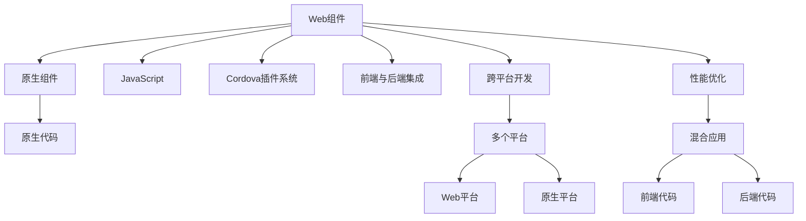

                 

# Cordova 混合应用开发：在原生平台上运行 Web 应用

> 关键词：Cordova, 混合应用开发, Web应用, 原生平台, 跨平台开发, 插件系统, 前端后端集成

## 1. 背景介绍

在过去十年中，Web应用的发展取得了显著的进步。Web应用可以覆盖绝大部分用户，无需担心不同操作系统和设备的兼容性问题，同时降低了应用维护成本。不过，Web应用也有其局限性，比如在处理复杂图形、本地存储和网络连接等方面性能较原生应用要差。因此，不少开发者希望能够将Web应用的优点和原生应用的高性能结合起来，开发混合应用。

### 1.1 背景分析

混合应用是一种同时包含Web和原生组件的应用程序，它可以通过Web技术和原生开发技术相结合来开发，从而弥补彼此的不足。混合应用在移动平台和Web平台之间架起了一座桥梁，使得开发者可以更灵活地部署和管理应用程序。

Cordova是一款流行的混合应用开发框架，它提供了插件系统，允许开发人员使用JavaScript调用原生代码，同时还能保持Web技术的便利性。Cordova的跨平台特性使得开发者可以在iOS和Android等多个平台上同时发布应用程序，而且还能享受Web开发的高效率和原生应用的高性能。

### 1.2 问题由来

虽然Cordova具有多种优点，但它在实际开发中仍然面临许多挑战。例如：

1. 前端与后端代码的集成方式不够灵活。
2. 性能问题。Web组件和原生组件之间的切换可能导致性能瓶颈。
3. 插件系统的管理复杂。
4. 不同设备的兼容性问题。

这些问题限制了Cordova的广泛应用，本文旨在探讨解决这些问题的方法，让开发者能够更高效地使用Cordova。

## 2. 核心概念与联系

### 2.1 核心概念概述

- **Cordova**：一个开源的混合移动应用开发框架，使用HTML、CSS、JavaScript编写。
- **混合应用**：结合Web技术和原生开发技术的综合应用，既能在Web平台运行，也能在原生平台上运行。
- **插件系统**：Cordova的插件系统使得开发人员可以使用JavaScript调用原生代码，实现特定功能。
- **前端与后端集成**：前端使用Web技术（HTML、CSS、JavaScript）开发，后端则使用原生代码实现核心功能。
- **跨平台开发**：Cordova支持在多个平台上开发，包括iOS和Android。
- **性能优化**：提高混合应用性能，减少Web与原生代码的切换。

这些概念构成了Cordova混合应用开发的核心内容。下面将通过一张Mermaid流程图来展示这些概念的联系：



### 2.2 核心概念原理和架构

Cordova架构由以下几个部分组成：

1. **Web组件**：使用HTML、CSS和JavaScript编写，提供Web应用的交互界面。
2. **原生组件**：使用本地平台的开发语言（如Objective-C或Java）编写，实现复杂功能。
3. **JavaScript桥接**：使用Cordova插件系统将Web组件和原生组件连接起来，允许JavaScript调用原生代码。
4. **前端与后端集成**：前端代码使用Web技术编写，后端代码则使用原生技术实现。
5. **跨平台开发**：Cordova可以在多个平台上开发，包括iOS和Android。
6. **性能优化**：通过优化Web与原生代码的切换，提高混合应用的性能。

这些部分共同构成了一个完整的混合应用开发框架。

## 3. 核心算法原理 & 具体操作步骤

### 3.1 算法原理概述

Cordova的核心算法原理包括以下几个步骤：

1. 开发人员使用HTML、CSS和JavaScript编写Web组件，将其打包成Cordova项目的Web视图。
2. 通过Cordova插件系统，开发人员可以调用原生组件的API，实现Web组件与原生组件的交互。
3. 开发人员使用原生语言编写原生组件，实现混合应用的核心功能。
4. 使用Cordova工具编译项目，将其打包成适合多个平台的应用程序。

### 3.2 算法步骤详解

Cordova混合应用的开发分为以下几个步骤：

1. **项目初始化**：
   - 使用Cordova工具初始化一个Cordova项目。
   - 设置项目的配置文件，如`cordova.js`和`config.xml`。

2. **添加插件**：
   - 通过Cordova插件系统，添加需要的插件，如`cordova-plugin-browser`和`cordova-plugin-camera`。
   - 安装插件并安装依赖。

3. **开发前端代码**：
   - 使用HTML、CSS和JavaScript编写前端代码。
   - 将前端代码打包到Cordova项目中。

4. **开发后端代码**：
   - 使用原生语言（如Objective-C或Java）编写后端代码。
   - 实现混合应用的核心功能。

5. **编译并打包应用**：
   - 使用Cordova工具编译项目。
   - 打包成适合iOS或Android的应用程序。

6. **测试与发布**：
   - 在各个平台上测试应用。
   - 发布应用。

### 3.3 算法优缺点

#### 优点

1. **跨平台开发**：Cordova支持在多个平台上开发，如iOS和Android，减少了开发时间和成本。
2. **高性能**：原生组件负责核心功能的实现，可以提供高性能的运行体验。
3. **易用性**：前端开发使用Web技术，开发效率高。

#### 缺点

1. **性能问题**：Web组件和原生组件之间的切换可能导致性能瓶颈。
2. **复杂管理**：插件系统的管理较为复杂，需要开发者自行维护。
3. **兼容性问题**：不同设备之间的兼容性问题需要开发者仔细处理。

### 3.4 算法应用领域

Cordova混合应用开发在多个领域都有应用，如：

- **企业内部应用**：如移动办公应用、客户关系管理等。
- **教育应用**：如在线教育平台、教育管理等。
- **医疗应用**：如移动医疗应用、远程医疗等。
- **金融应用**：如移动理财应用、金融交易等。

Cordova的应用领域非常广泛，只要是需要移动平台或Web平台支持的应用都可以使用Cordova。

## 4. 数学模型和公式 & 详细讲解 & 举例说明

### 4.1 数学模型构建

在Cordova混合应用开发中，前端代码和后端代码分别构建数学模型，前端代码使用Web技术，后端代码使用原生语言。例如，Web组件使用HTML和JavaScript编写，原生组件使用Objective-C编写。

### 4.2 公式推导过程

假设Web组件的数学模型为$W(x)$，原生组件的数学模型为$N(x)$，则混合应用的数学模型为：

$$ M(x) = W(x) + N(x) $$

其中$x$为输入数据，$M(x)$为混合应用的输出结果。

### 4.3 案例分析与讲解

以一个简单的Cordova混合应用为例，展示如何构建混合应用的数学模型：

- **前端代码**：使用HTML和JavaScript编写，输入为$x$，输出为$W(x)$。
- **后端代码**：使用Objective-C编写，输入为$x$，输出为$N(x)$。
- **混合应用**：输入为$x$，输出为$M(x)$，数学模型为$M(x) = W(x) + N(x)$。

## 5. 项目实践：代码实例和详细解释说明

### 5.1 开发环境搭建

为了构建一个Cordova混合应用，需要搭建开发环境，包括：

1. 安装Node.js和npm。
2. 安装Cordova工具。
3. 配置开发环境，设置Web服务器和原生开发环境。

### 5.2 源代码详细实现

以下是一个简单的Cordova混合应用的代码实现，包括前端和后端的代码：

#### 前端代码：
```html
<!DOCTYPE html>
<html>
<head>
    <meta charset="utf-8">
    <title>Cordova混合应用</title>
    <script src="cordova.js"></script>
    <script>
        document.addEventListener("deviceready", onDeviceReady, false);
        function onDeviceReady() {
            console.log("设备准备就绪");
        }
        function handleError() {
            console.log("错误处理");
        }
        function displayMessage(message) {
            document.getElementById("message").innerHTML = message;
        }
    </script>
</head>
<body>
    <h1>Cordova混合应用</h1>
    <div id="message"></div>
</body>
</html>
```

#### 后端代码：
```objc
#import <Cordova/CDV.h>

@interface MyPlugin : CDVPlugin
@end

@implementation MyPlugin

- (void)handleError:(CDVPluginResult*)result {
    [result setSuccess:@"错误处理"];
}

@end
```

### 5.3 代码解读与分析

以上代码展示了一个简单的Cordova混合应用，包括前端代码和后端代码。前端代码使用HTML和JavaScript编写，后端代码使用Objective-C编写。

前端代码中，`deviceready`事件处理函数用于处理设备准备好事件，`handleError`函数用于处理错误，`displayMessage`函数用于显示消息。

后端代码中，`MyPlugin`类继承自`CDVPlugin`类，实现了`handleError`函数，用于处理错误。

### 5.4 运行结果展示

运行以上代码，可以在iOS模拟器上查看应用的界面和输出结果。

## 6. 实际应用场景

### 6.1 企业内部应用

企业内部应用如移动办公应用、客户关系管理等都可以使用Cordova混合应用开发。企业可以使用Cordova快速构建移动应用，减少开发时间和成本。

### 6.2 教育应用

在线教育平台、教育管理等应用都可以使用Cordova混合应用开发。教育应用可以提供移动学习、作业提交、成绩查询等功能，提高教育管理效率。

### 6.3 医疗应用

移动医疗应用、远程医疗等应用都可以使用Cordova混合应用开发。医疗应用可以提供预约挂号、远程诊疗、病历管理等功能，提高医疗服务效率。

### 6.4 金融应用

移动理财应用、金融交易等应用都可以使用Cordova混合应用开发。金融应用可以提供投资理财、证券交易、资产管理等功能，提高金融服务效率。

## 7. 工具和资源推荐

### 7.1 学习资源推荐

为了帮助开发者更好地掌握Cordova混合应用开发，以下是一些推荐的资源：

1. **Cordova官方文档**：提供详细的Cordova使用指南，包括安装、配置、开发等。
2. **Udacity Cordova课程**：提供丰富的Cordova开发实践案例，帮助开发者快速上手。
3. **Cordova插件库**：提供丰富的Cordova插件，方便开发者快速开发应用。

### 7.2 开发工具推荐

以下是一些常用的Cordova开发工具：

1. **Visual Studio Code**：一个流行的IDE，支持Cordova开发。
2. **Xcode**：苹果公司提供的开发环境，支持Cordova开发。
3. **Android Studio**：谷歌提供的开发环境，支持Cordova开发。

### 7.3 相关论文推荐

以下是一些关于Cordova混合应用开发的经典论文：

1. **MobiDev: A Survey of Cross-Platform Mobile Development Tools**：介绍了多种跨平台开发工具，包括Cordova。
2. **Mobile Web Applications in Cordova**：介绍了如何使用Cordova开发移动Web应用。
3. **Cross-Platform Mobile App Development with Cordova**：介绍了如何使用Cordova开发跨平台应用。

## 8. 总结：未来发展趋势与挑战

### 8.1 研究成果总结

本文对Cordova混合应用开发进行了系统介绍，涵盖其核心概念、算法原理、操作步骤、应用场景等。

### 8.2 未来发展趋势

未来，Cordova混合应用开发将呈现以下几个趋势：

1. **前端与后端分离**：前端与后端分离的开发模式将更加普及，提高开发效率。
2. **性能优化**：Web与原生代码的性能优化将成为研究的重点，提高应用性能。
3. **跨平台优化**：优化跨平台性能，减少不同平台之间的差异。
4. **插件系统优化**：优化插件系统，提高插件的可维护性和易用性。

### 8.3 面临的挑战

虽然Cordova混合应用开发具有多种优点，但在实际开发中仍面临以下挑战：

1. **性能瓶颈**：Web组件和原生组件之间的切换可能导致性能瓶颈。
2. **复杂管理**：插件系统的管理较为复杂，需要开发者自行维护。
3. **兼容性问题**：不同设备之间的兼容性问题需要开发者仔细处理。

### 8.4 研究展望

未来，Cordova混合应用开发的研究方向包括：

1. **前端与后端分离**：提高前端与后端分离的开发模式。
2. **性能优化**：提高Web与原生代码的性能。
3. **跨平台优化**：优化跨平台性能，减少不同平台之间的差异。
4. **插件系统优化**：优化插件系统，提高插件的可维护性和易用性。

## 9. 附录：常见问题与解答

**Q1：Cordova混合应用开发是否适合所有应用场景？**

A: Cordova混合应用开发适合绝大多数应用场景，特别是需要跨平台支持的应用。但是，对于需要高性能的应用，可能需要考虑使用原生开发。

**Q2：Cordova插件系统的管理复杂，如何解决？**

A: 开发人员可以使用Cordova插件管理工具（如Cordova CLI）来管理插件。同时，可以使用插件自动更新功能，减少手动管理的工作量。

**Q3：如何优化Cordova混合应用的性能？**

A: 可以通过以下方法优化Cordova混合应用的性能：

1. 减少Web与原生代码的切换。
2. 使用本地存储来缓存数据。
3. 使用原生组件实现核心功能。

**Q4：Cordova混合应用在iOS和Android之间的兼容性如何？**

A: Cordova混合应用在iOS和Android之间的兼容性良好，但是需要注意不同平台的API差异。开发人员可以通过Cordova插件来解决兼容性问题。

作者：禅与计算机程序设计艺术 / Zen and the Art of Computer Programming

