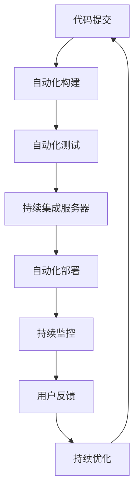

                 

## DevOps 实践：持续交付和持续部署

在当今高度敏捷的软件开发和运维环境中，DevOps（开发与运维）理念的应用已经成为了企业提升竞争力、加快产品上市速度的关键。持续交付（Continuous Delivery）和持续部署（Continuous Deployment）作为DevOps的核心实践，强调了自动化流程、高质量交付和快速响应市场变化的能力。本文将深入探讨DevOps实践的基础原理、核心概念、操作步骤，并结合实际项目案例，展示如何通过持续交付和持续部署构建高效、稳定的IT系统。

## 1. 背景介绍

### 1.1 问题由来
在过去的软件开发和运维模式下，开发团队和运维团队常常处于分离状态，导致交付周期长、变更风险高、系统稳定性差。随着互联网和云计算的普及，企业对产品的迭代速度和质量提出了更高的要求，传统的运维模式已无法满足这一需求。DevOps理念的提出，旨在打破开发与运维的壁垒，通过自动化工具和流程，实现更高效的协作和快速响应的持续交付和持续部署。

### 1.2 问题核心关键点
持续交付和持续部署的核心在于通过自动化流程和工具，实现软件产品的快速、安全、可靠的交付和部署。其关键点包括：
1. 自动化构建与测试：通过CI/CD工具链，自动化构建、测试和部署过程，确保软件的高质量交付。
2. 持续监控与反馈：在部署过程中，实时监控系统运行状态，及时发现和解决问题，确保系统稳定性。
3. 持续优化与迭代：根据用户反馈和系统监控数据，不断优化产品功能和性能，实现快速迭代和持续改进。

## 2. 核心概念与联系

### 2.1 核心概念概述

为了更好地理解持续交付和持续部署的实现机制，本节将介绍几个关键概念：

- 持续交付（Continuous Delivery）：指通过自动化工具和流程，在每次代码变更后，快速构建、测试并准备软件产品发布的过程。其目的是确保软件在发布前的质量，同时提供快速回滚的能力，避免发布后出现问题。
- 持续部署（Continuous Deployment）：指在持续交付的基础上，进一步自动化发布过程，确保每次代码变更都能直接部署到生产环境。其目标是最小化发布停机时间，提升系统的可靠性和可用性。
- 持续集成（Continuous Integration）：指开发团队频繁提交代码变更，通过自动化工具及时构建和测试代码，快速发现和修复问题，确保代码质量。
- 持续监控（Continuous Monitoring）：指在软件部署和运行过程中，实时监控系统状态，及时发现异常和性能瓶颈，提供数据驱动的优化建议，确保系统稳定性和性能。
- 自动化测试（Automated Testing）：指通过编写自动化测试脚本，实现对代码变更的快速测试和验证，减少人为错误，提升产品质量。

这些概念之间的逻辑关系可以通过以下Mermaid流程图来展示：

```mermaid
graph TB
    A[持续集成(CI)] --> B[持续交付(CD)]
    B --> C[持续部署(CD)]
    A --> D[持续监控(CM)]
    C --> D
    A --> E[自动化测试(AT)]
    A --> F[持续交付]
    F --> G[持续部署]
```

这个流程图展示了持续集成、持续交付、持续部署、持续监控和自动化测试之间的关联关系：

1. 持续集成作为整个流程的起点，负责频繁构建和测试代码变更。
2. 持续交付在此基础上，确保构建的产品在发布前通过所有必要的测试和验证。
3. 持续部署进一步自动化发布过程，确保代码变更能够直接部署到生产环境。
4. 持续监控在发布和运行过程中实时监测系统状态，提供实时反馈和优化建议。
5. 自动化测试为持续集成提供基础保障，通过快速、全面的测试验证代码质量。

这些概念共同构成了DevOps实践的核心，通过自动化工具和流程，实现软件的快速、高效、可靠的交付和部署。

### 2.2 核心概念原理和架构的 Mermaid 流程图

以下是持续交付和持续部署的详细工作流程：



该流程图详细展示了持续交付和持续部署的各个环节：

1. **代码提交**：开发者频繁提交代码变更到版本控制系统。
2. **自动化构建**：CI工具自动从版本库拉取最新代码，构建出可执行的软件包。
3. **自动化测试**：对构建的软件包进行全面的自动化测试，确保代码质量。
4. **持续集成服务器**：集成所有构建和测试结果，验证软件包的完备性和稳定性。
5. **自动化部署**：通过CI/CD工具链，将验证通过的软件包自动部署到预定义的测试环境和生产环境。
6. **持续监控**：在部署和运行过程中，实时监测系统状态，提供异常告警和性能数据。
7. **用户反馈**：根据用户反馈和监控数据，持续优化和改进产品功能和性能。

## 3. 核心算法原理 & 具体操作步骤

### 3.1 算法原理概述

持续交付和持续部署的实现，依赖于一系列自动化工具和流程的协同工作。其核心算法原理可以归纳为以下几个方面：

1. 自动化构建：通过CI工具链，自动拉取最新代码，构建出可执行的软件包。
2. 自动化测试：通过编写自动化测试脚本，快速验证代码变更，确保代码质量。
3. 自动化部署：通过CI/CD工具链，自动将验证通过的软件包部署到目标环境。
4. 持续监控：通过实时监控工具，收集系统运行数据，及时发现和解决问题。

这些自动化流程的设计和实施，需要遵循一些基本原则：

1. **高频次提交**：开发者频繁提交代码变更，确保代码变更能够快速整合和验证。
2. **自动化工具**：使用自动化工具链，减少人为干预，提升交付效率和质量。
3. **持续反馈**：在每个环节实时反馈结果，及时发现和修复问题，避免延误。
4. **预定义流程**：定义清晰、可复用的流程和规则，确保流程的一致性和可控性。

### 3.2 算法步骤详解

持续交付和持续部署的实现步骤如下：

1. **持续集成(CI)流程设计**：
   - 设计持续集成流程，包括代码提交、自动化构建、自动化测试和持续集成服务器。
   - 配置CI工具链，如Jenkins、GitLab CI、Travis CI等，实现代码自动化构建和测试。
   - 定义自动化测试脚本，涵盖单元测试、集成测试和系统测试。

2. **持续交付(CD)流程设计**：
   - 设计持续交付流程，包括自动化构建、自动化测试、持续集成服务器和自动化部署。
   - 配置CD工具链，如Jenkins、GitLab CI、CircleCI等，实现自动化构建、测试和部署。
   - 定义自动化部署策略，包括部署到测试环境和生产环境的规则和步骤。

3. **持续监控(CM)流程设计**：
   - 设计持续监控流程，包括实时监控工具、日志收集和分析、异常告警和性能监控。
   - 配置监控工具，如Prometheus、Grafana、ELK Stack等，实现系统运行数据的实时收集和分析。
   - 定义监控指标和告警策略，确保系统状态的及时发现和响应。

4. **持续优化(CO)流程设计**：
   - 设计持续优化流程，包括用户反馈收集、性能数据分析、代码优化和功能改进。
   - 配置用户反馈渠道，如邮件、短信、系统接口等，实时获取用户反馈。
   - 分析性能数据和用户反馈，识别系统瓶颈和改进点，进行代码优化和功能改进。

### 3.3 算法优缺点

持续交付和持续部署具有以下优点：
1. 提升交付效率：通过自动化流程，大幅缩短软件交付周期，快速响应市场需求。
2. 提高代码质量：频繁构建和测试，及时发现和修复问题，确保代码质量。
3. 增强系统可靠性：通过持续监控，及时发现和解决问题，提升系统稳定性。
4. 降低运维成本：自动化流程减少人为干预，降低运维成本，提升运维效率。

同时，这些方法也存在一些局限性：
1. 工具链复杂度高：需要配置和维护多个自动化工具和流程，增加了复杂性。
2. 依赖基础设施：对网络、硬件和软件基础设施要求较高，需要进行充分的资源规划。
3. 初期投入较大：需要投入大量时间和资源进行流程设计和工具配置，初期成本较高。
4. 对人员要求高：需要具备高水平的技术和项目管理能力，维护自动化流程和工具链。

### 3.4 算法应用领域

持续交付和持续部署在IT系统的各个环节都有广泛应用，具体包括：

1. 软件开发：通过CI/CD流程，实现软件的持续构建、测试和部署。
2. 应用发布：通过自动化部署流程，实现应用的无缝发布和更新。
3. 系统运维：通过持续监控流程，实时监测系统状态，及时发现和解决问题。
4. 用户反馈：通过用户反馈渠道，快速收集用户意见，进行系统优化和改进。

此外，持续交付和持续部署也广泛应用于云计算、大数据、人工智能等领域的IT系统建设中，成为推动技术创新和业务发展的关键驱动力。

## 4. 数学模型和公式 & 详细讲解 & 举例说明

### 4.1 数学模型构建

为了更好地理解持续交付和持续部署的数学模型，本节将建立一些基础数学模型。

假设软件开发周期为$T$，每次代码提交为$N$次，每次提交后通过自动化构建和测试的概率为$P$，部署到生产环境的概率为$Q$，持续监控的概率为$R$。则总的交付效率$E$和系统可靠性$S$可以分别表示为：

$$
E = \frac{N}{T}PQ
$$

$$
S = 1 - \left(1 - R\right)^{T-N}
$$

其中，$E$表示每次提交后成功交付的概率，$S$表示系统在整个开发周期内保持稳定可靠的概率。

### 4.2 公式推导过程

在持续交付和持续部署的实际应用中，模型参数的计算需要结合具体业务场景进行调整。例如，每次提交后通过自动化构建和测试的概率$P$，可以通过测试覆盖率和缺陷率来计算；部署到生产环境的概率$Q$，可以通过部署自动化流程和环境配置的可靠性来评估。

### 4.3 案例分析与讲解

以一个电商平台的持续交付和持续部署为例，分析其应用过程：

1. **持续集成(CI)**：
   - 配置GitLab CI，实现自动拉取代码、构建和测试。
   - 编写自动化测试脚本，涵盖单元测试、集成测试和系统测试。

2. **持续交付(CD)**：
   - 配置Jenkins Pipeline，实现自动化构建、测试和部署。
   - 定义部署策略，包括测试环境部署和生产环境部署。

3. **持续监控(CM)**：
   - 配置Prometheus和Grafana，实时监控系统运行数据。
   - 定义告警策略，确保系统异常及时发现和响应。

4. **持续优化(CO)**：
   - 配置用户反馈渠道，实时收集用户意见。
   - 分析性能数据和用户反馈，识别系统瓶颈和改进点。

通过持续交付和持续部署的应用，电商平台实现了快速、高效的交付和部署，大幅提升了用户体验和系统稳定性。

## 5. 项目实践：代码实例和详细解释说明

### 5.1 开发环境搭建

在进行持续交付和持续部署实践前，需要先搭建开发环境。以下是使用Jenkins和GitLab CI搭建DevOps环境的步骤：

1. **安装Jenkins**：
   - 从官网下载最新版本的Jenkins。
   - 安装Jenkins插件，如Git Plugin、Pipeline Plugin等，支持与GitLab集成。
   - 配置Jenkins系统环境，包括系统用户、环境变量、插件等。

2. **配置GitLab CI**：
   - 登录GitLab，进入项目的CI/CD配置界面。
   - 配置CI流程，包括构建、测试和部署步骤。
   - 定义CI/CD触发器，支持手动触发和自动化触发。

3. **部署应用**：
   - 配置Jenkins Pipeline，实现应用的自动化构建、测试和部署。
   - 定义部署策略，包括测试环境部署和生产环境部署。

### 5.2 源代码详细实现

以下是使用Jenkins和GitLab CI搭建持续交付和持续部署环境的代码实现：

```python
# Jenkins Pipeline脚本示例
pipeline {
    agent any
    stages {
        stage('构建') {
            steps {
                sh 'mvn clean install'
            }
        }
        stage('测试') {
            steps {
                sh 'mvn test'
            }
        }
        stage('部署') {
            steps {
                sh 'mvn spring-boot:run'
            }
        }
    }
}

# GitLab CI脚本示例
stages:
  - build:
    script:
      - echo "开始构建"
      - mvn clean install
  - test:
    script:
      - echo "开始测试"
      - mvn test
  - deploy:
    script:
      - echo "开始部署"
      - mvn spring-boot:run
```

### 5.3 代码解读与分析

让我们再详细解读一下关键代码的实现细节：

**Jenkins Pipeline脚本**：
- 定义了构建、测试和部署三个阶段。
- 每个阶段包含相应的构建和测试命令，如Maven的clean install和mvn test。
- 部署阶段使用mvn spring-boot:run命令，将应用部署到指定环境。

**GitLab CI脚本**：
- 定义了构建、测试和部署三个阶段。
- 每个阶段包含相应的构建和测试命令，如echo、mvn clean install和mvn test。
- 部署阶段使用mvn spring-boot:run命令，将应用部署到指定环境。

这些代码示例展示了使用Jenkins和GitLab CI进行持续交付和持续部署的基本流程。通过构建、测试和部署的自动化执行，可以快速、高效地交付软件应用。

### 5.4 运行结果展示

以下是Jenkins Pipeline和GitLab CI运行结果的示例：

- Jenkins Pipeline运行结果：
  - 构建阶段：显示构建进度和日志。
  - 测试阶段：显示测试进度和日志。
  - 部署阶段：显示部署进度和日志。

- GitLab CI运行结果：
  - 构建阶段：显示构建进度和日志。
  - 测试阶段：显示测试进度和日志。
  - 部署阶段：显示部署进度和日志。

## 6. 实际应用场景

### 6.1 电商平台的持续交付和持续部署

电商平台的持续交付和持续部署可以显著提升用户体验和系统稳定性。通过配置Jenkins Pipeline和GitLab CI，实现应用的自动化构建、测试和部署，可以快速响应市场需求，提升应用的质量和性能。

### 6.2 金融系统的持续交付和持续部署

金融系统的持续交付和持续部署可以保障系统的高可靠性和安全性。通过配置Jenkins Pipeline和GitLab CI，实现应用的自动化构建、测试和部署，可以快速修复漏洞和问题，确保系统稳定运行。

### 6.3 医疗应用的持续交付和持续部署

医疗应用的持续交付和持续部署可以提升系统的医疗辅助能力和患者体验。通过配置Jenkins Pipeline和GitLab CI，实现应用的自动化构建、测试和部署，可以快速更新医疗数据和模型，确保系统具备最新的医疗知识和信息。

### 6.4 未来应用展望

随着持续交付和持续部署技术的不断发展，未来将在更多领域得到应用，为各行业带来变革性影响。

在智慧城市治理中，持续交付和持续部署可以提升城市管理的自动化和智能化水平，构建更安全、高效的未来城市。

在智慧教育领域，持续交付和持续部署可以为教育公平提供新的技术支持，提高教学质量。

在智慧医疗领域，持续交付和持续部署可以提升医疗服务的智能化水平，辅助医生诊疗，加速新药开发进程。

此外，在智能制造、智能家居、智能交通等众多领域，持续交付和持续部署技术也将不断涌现，为经济社会发展注入新的动力。

## 7. 工具和资源推荐

### 7.1 学习资源推荐

为了帮助开发者系统掌握持续交付和持续部署的理论基础和实践技巧，这里推荐一些优质的学习资源：

1. **《DevOps实践指南》**：介绍DevOps的基本概念、最佳实践和工具链，是入门DevOps的好书。
2. **《持续交付：构建可靠的软件发布流程》**：深入讲解持续交付的核心思想和实现方法，适合技术和管理人员阅读。
3. **《持续部署：自动化构建、测试和部署》**：详细讲解持续部署的关键技术和工具链，提供丰富的代码实现和案例分析。
4. **《Jenkins权威指南》**：提供Jenkins的全面使用指南和案例实践，帮助开发者快速搭建持续集成和持续交付流程。
5. **《GitLab CI/CD实践指南》**：提供GitLab CI/CD的配置和实践指导，适合GitLab CI/CD的高级用户。

通过对这些资源的学习实践，相信你一定能够快速掌握持续交付和持续部署的精髓，并用于解决实际的IT问题。

### 7.2 开发工具推荐

高效的开发离不开优秀的工具支持。以下是几款用于持续交付和持续部署开发的常用工具：

1. **Jenkins**：开源的自动化工具，支持持续集成和持续交付，广泛应用于企业级IT系统建设中。
2. **GitLab CI/CD**：GitLab的持续集成和持续部署工具，集成于GitLab平台，支持CI/CD管道的快速构建和部署。
3. **Jenkins Pipeline**：基于Jenkins的插件，支持Pipeline脚本编写，实现持续交付和持续部署的自动化执行。
4. **Prometheus**：开源的监控工具，支持实时监控和告警，广泛应用于系统监控和故障分析。
5. **Grafana**：开源的数据可视化工具，支持多种数据源的图表展示和告警配置，与Prometheus无缝集成。
6. **ELK Stack**：包含Elasticsearch、Logstash和Kibana的日志管理工具，支持实时日志收集和分析，广泛应用于系统运维和故障排查。

合理利用这些工具，可以显著提升持续交付和持续部署的开发效率，加快创新迭代的步伐。

### 7.3 相关论文推荐

持续交付和持续部署技术的发展源于学界的持续研究。以下是几篇奠基性的相关论文，推荐阅读：

1. **《持续集成：自动化软件开发实践》**：提出持续集成概念，并讨论其对软件质量的影响。
2. **《持续交付：构建可靠的软件发布流程》**：提出持续交付的概念，并介绍其与持续集成的区别。
3. **《持续部署：自动化构建、测试和部署》**：详细讲解持续部署的核心思想和实现方法，并提供大量代码示例。
4. **《DevOps：软件开发和运维的新范式》**：讨论DevOps的基本思想和最佳实践，为持续交付和持续部署提供理论支持。
5. **《持续监控：保障系统稳定性和性能》**：介绍持续监控的核心思想和技术手段，帮助开发者实时监控系统状态。

这些论文代表了大规模软件交付和部署技术的发展脉络。通过学习这些前沿成果，可以帮助研究者把握学科前进方向，激发更多的创新灵感。

## 8. 总结：未来发展趋势与挑战

### 8.1 总结

本文对持续交付和持续部署实践进行了全面系统的介绍。首先阐述了持续交付和持续部署的基础原理和核心概念，明确了其在提升软件交付效率和系统稳定性方面的独特价值。其次，从原理到实践，详细讲解了持续交付和持续部署的数学模型和操作步骤，给出了具体项目的代码实现。同时，本文还广泛探讨了持续交付和持续部署在多个领域的应用前景，展示了其广泛的应用潜力。

通过本文的系统梳理，可以看到，持续交付和持续部署技术正在成为软件开发和运维的重要范式，极大地提升了软件的交付效率和系统稳定性，为IT系统的快速迭代和高效运维提供了有力保障。

### 8.2 未来发展趋势

展望未来，持续交付和持续部署技术将呈现以下几个发展趋势：

1. **自动化程度提升**：未来的持续交付和持续部署将更加自动化和智能化，通过AI技术实现自动化流程的优化和调优。
2. **跨平台支持**：持续交付和持续部署技术将支持更多平台和环境，包括云原生、边缘计算等新兴技术。
3. **多工具集成**：未来的持续交付和持续部署将更加集成化，通过统一的平台实现多种自动化工具的协同工作。
4. **全生命周期管理**：持续交付和持续部署将覆盖软件开发的各个阶段，从需求分析、设计、开发到测试、部署和运维，实现全生命周期的自动化管理。
5. **持续优化与迭代**：持续交付和持续部署将更加注重系统优化和迭代，通过持续监控和用户反馈，不断提升系统性能和用户体验。

以上趋势凸显了持续交付和持续部署技术的广阔前景。这些方向的探索发展，必将进一步提升软件开发和运维的效率和质量，为IT系统的稳定性和可靠性提供有力保障。

### 8.3 面临的挑战

尽管持续交付和持续部署技术已经取得了显著成效，但在实际应用中仍面临诸多挑战：

1. **工具链复杂度高**：持续交付和持续部署需要配置和维护多个自动化工具和流程，增加了复杂性。
2. **依赖基础设施**：对网络、硬件和软件基础设施要求较高，需要进行充分的资源规划。
3. **初期投入较大**：需要投入大量时间和资源进行流程设计和工具配置，初期成本较高。
4. **对人员要求高**：需要具备高水平的技术和项目管理能力，维护自动化流程和工具链。

### 8.4 研究展望

面对持续交付和持续部署技术面临的这些挑战，未来的研究需要在以下几个方面寻求新的突破：

1. **简化工具链**：开发更加集成化和简化的工具链，减少工具配置的复杂性。
2. **优化资源配置**：通过云计算和边缘计算等技术，优化资源的配置和利用。
3. **提升自动化水平**：引入AI技术，实现自动化流程的优化和调优。
4. **增强系统可靠性**：通过持续监控和异常处理，提升系统的可靠性和稳定性。
5. **优化用户反馈机制**：建立高效的用户反馈机制，及时获取和处理用户意见。

这些研究方向的探索，必将引领持续交付和持续部署技术迈向更高的台阶，为软件开发和运维提供更加高效、可靠和智能的解决方案。

## 9. 附录：常见问题与解答

**Q1：持续交付和持续部署与持续集成有何区别？**

A: 持续交付和持续集成都是DevOps的重要组成部分，但持续交付更注重软件的交付和发布，确保软件在发布前的质量；持续集成则更侧重于代码的频繁构建和测试，确保代码变更的质量。简单来说，持续集成是持续交付的基础，持续交付是持续集成的延伸。

**Q2：持续交付和持续部署的自动化流程应该如何设计？**

A: 持续交付和持续部署的自动化流程设计需要考虑以下几个关键点：
1. **高频次提交**：开发团队频繁提交代码变更，确保代码变更能够快速整合和验证。
2. **自动化工具链**：使用自动化工具链，减少人为干预，提升交付效率和质量。
3. **持续反馈**：在每个环节实时反馈结果，及时发现和修复问题，避免延误。
4. **预定义流程**：定义清晰、可复用的流程和规则，确保流程的一致性和可控性。

**Q3：持续交付和持续部署的应用场景有哪些？**

A: 持续交付和持续部署在软件开发和运维的各个环节都有广泛应用，具体包括：
1. 软件开发：通过CI/CD流程，实现软件的持续构建、测试和部署。
2. 应用发布：通过自动化部署流程，实现应用的无缝发布和更新。
3. 系统运维：通过持续监控流程，实时监测系统状态，及时发现和解决问题。
4. 用户反馈：通过用户反馈渠道，快速收集用户意见，进行系统优化和改进。

此外，持续交付和持续部署也广泛应用于云计算、大数据、人工智能等领域的IT系统建设中，成为推动技术创新和业务发展的关键驱动力。

**Q4：持续交付和持续部署的实现需要哪些关键工具？**

A: 持续交付和持续部署的实现需要以下关键工具：
1. Jenkins：开源的自动化工具，支持持续集成和持续交付。
2. GitLab CI/CD：GitLab的持续集成和持续部署工具，集成于GitLab平台。
3. Jenkins Pipeline：基于Jenkins的插件，支持Pipeline脚本编写。
4. Prometheus：开源的监控工具，支持实时监控和告警。
5. Grafana：开源的数据可视化工具，支持多种数据源的图表展示和告警配置。
6. ELK Stack：包含Elasticsearch、Logstash和Kibana的日志管理工具。

合理利用这些工具，可以显著提升持续交付和持续部署的开发效率，加快创新迭代的步伐。

**Q5：持续交付和持续部署的实现需要哪些关键步骤？**

A: 持续交付和持续部署的实现需要以下关键步骤：
1. 配置持续集成流程，包括代码提交、自动化构建和测试。
2. 配置持续交付流程，包括自动化构建、测试和部署。
3. 配置持续监控流程，实时监测系统状态，及时发现和解决问题。
4. 配置持续优化流程，收集用户反馈和性能数据，进行系统优化和改进。

通过这些步骤的实施，可以实现持续交付和持续部署的自动化执行，提升软件的交付效率和系统稳定性。

---

作者：禅与计算机程序设计艺术 / Zen and the Art of Computer Programming

