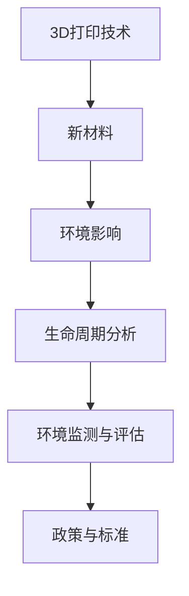

                 

# 3D打印新材料的环保问题

## 1. 背景介绍

### 1.1 问题由来

随着3D打印技术的快速普及，其对环境保护的影响也日益受到关注。一方面，3D打印通过减少材料浪费、提高资源利用率等方式，表现出较高的环保潜力；另一方面，3D打印使用的一些新材料可能带来新的环境问题，如打印过程中的污染、材料废弃处理等。因此，如何在3D打印过程中实现环境友好的材料选择和操作，成为当前亟待解决的关键问题。

### 1.2 问题核心关键点

本文聚焦于3D打印新材料对环境的影响，探讨如何通过优化材料选择、改进打印工艺等手段，实现3D打印的绿色化发展。主要从以下几个方面展开：

- **新材料特性与环境影响**：分析不同3D打印新材料（如光固化材料、热塑性材料等）的环境特性，包括打印过程中的排放、材料废弃、材料循环利用等。
- **绿色设计原则与实现策略**：提出基于生命周期分析的3D打印材料选择和设计原则，涵盖从材料采集到废弃处理的整个过程。
- **环境监测与评估方法**：介绍环境监测与评估的关键技术，如排放量检测、废弃物回收等，为3D打印环境的可持续发展提供数据支持。
- **政策与标准建议**：讨论如何制定与实施相关政策、标准，推动3D打印行业的环保技术进步。

## 2. 核心概念与联系

### 2.1 核心概念概述

为更好地理解3D打印新材料的环保问题，本节将介绍几个密切相关的核心概念：

- **3D打印技术**：指通过逐层堆积材料，最终构建三维实体的制造技术。包括FDM（熔融沉积成型）、SLS（选择性激光烧结）、DLP（数字光处理）等多种工艺。
- **新材料**：指在3D打印中用于打印物体的材料，包括光固化材料、热塑性材料、金属材料等。这些材料在环保性能上各有差异。
- **环境影响**：指在3D打印过程中产生的环境污染物，如挥发性有机化合物(VOCs)、温室气体排放、废弃物等。
- **生命周期分析**：指对3D打印材料的整个生命周期进行环境影响评估，涵盖原材料获取、生产、使用、废弃处理等各个阶段。
- **环境监测与评估**：指通过技术手段，对3D打印过程中产生的环境污染物进行检测与评估，以实时监测和反馈环境状况。
- **政策与标准**：指为促进3D打印行业的可持续发展，制定的一系列政策、法规和标准。

这些核心概念之间的逻辑关系可以通过以下Mermaid流程图来展示：



这个流程图展示了大语言模型的核心概念及其之间的关系：

1. 3D打印技术通过使用新材料，实现打印过程。
2. 新材料的环境特性决定了打印过程对环境的影响。
3. 生命周期分析帮助评估新材料的整个环境影响。
4. 环境监测与评估为绿色设计提供数据支持。
5. 政策与标准的制定与实施，推动3D打印行业的环保发展。

这些概念共同构成了3D打印新材料环保问题的研究框架，为后续深入分析提供了理论基础。

## 3. 核心算法原理 & 具体操作步骤
### 3.1 算法原理概述

3D打印新材料的环保问题，可以通过生命周期分析的方法来解决。生命周期分析（Life Cycle Assessment, LCA）是一种评估产品或过程在其整个生命周期内对环境影响的技术方法。对于3D打印新材料，生命周期分析包括从原材料获取、生产、使用到废弃处理的全过程，综合评估各个环节的环境影响。

具体而言，生命周期分析包括以下几个关键步骤：

1. **数据收集**：收集3D打印新材料在其生命周期各环节的环境影响数据，包括原材料获取、生产、运输、使用、废弃处理等。
2. **影响类型确定**：确定要评估的环境影响类型，如全球变暖、资源消耗、生态毒性等。
3. **模型构建**：根据收集的数据，构建生命周期模型，模拟材料在其整个生命周期内的环境影响。
4. **结果分析与解释**：分析评估结果，识别影响最大的环节，提出改进措施，以减少环境影响。

### 3.2 算法步骤详解

基于生命周期分析的3D打印新材料环保问题解决流程如下：

1. **数据收集**：
   - 收集3D打印新材料在其生命周期各个环节的环境影响数据，包括原材料获取、生产、运输、使用、废弃处理等。数据来源包括文献、数据库、实地调查等。
   - 数据格式可以是数值形式，也可以是通过标准化方法获得的数据。

2. **影响类型确定**：
   - 根据3D打印新材料的特性，确定要评估的环境影响类型。如全球变暖、资源消耗、生态毒性等。
   - 根据影响类型选择相应的评估指标和计算方法。

3. **模型构建**：
   - 构建生命周期模型，模拟3D打印新材料在其整个生命周期内的环境影响。
   - 可以使用生命周期分析软件如GaBi、SimaPro等，或自行编程实现。

4. **结果分析与解释**：
   - 分析评估结果，识别影响最大的环节。
   - 提出改进措施，如优化材料选择、改进打印工艺、加强废弃物处理等，以减少环境影响。

### 3.3 算法优缺点

基于生命周期分析的3D打印新材料环保问题解决方案，具有以下优点：

- **综合性强**：生命周期分析综合考虑材料从原材料获取到废弃处理的全过程，可以全面评估环境影响。
- **可操作性强**：通过分析结果，可以明确影响最大的环节，指导具体的改进措施，提高环保效果。
- **数据驱动**：生命周期分析依赖数据驱动，可以客观、准确地评估材料的环境影响。

同时，该方法也存在以下局限性：

- **数据获取难度大**：生命周期分析需要大量数据，包括原材料获取、生产、运输、使用、废弃处理等环节的数据，获取难度较大。
- **计算复杂**：构建和运行生命周期模型需要较长的计算时间，且模型复杂度较高。
- **需要专业知识**：生命周期分析需要较高的专业知识，普通用户难以自行实施。

### 3.4 算法应用领域

基于生命周期分析的3D打印新材料环保问题解决方案，适用于以下领域：

- **工业制造**：在3D打印材料的整个生命周期内，评估环境影响，优化材料选择和工艺，降低环境负担。
- **政策制定**：为制定3D打印行业的环境保护政策提供数据支持，推动行业绿色发展。
- **企业运营**：帮助企业评估新材料的环境影响，选择环保材料，提升企业形象和市场竞争力。
- **研究机构**：在学术研究中，评估不同3D打印材料的环境影响，指导材料选择和工艺优化。

## 4. 数学模型和公式 & 详细讲解 & 举例说明

### 4.1 数学模型构建

生命周期分析中常用的数学模型包括CMLCA（Cumulative Material Life Cycle Assessment）和LCIA（Life Cycle Inventory and Impact Assessment）。CMLCA用于评估材料在其整个生命周期内的累积环境影响，LCIA用于评估材料在各个环节的具体环境影响。

CMLCA模型包括三个部分：物料和能量流、输入流、输出流。输入流包括原材料获取、生产、运输等环节的资源消耗和能量消耗，输出流包括废弃物、温室气体排放等环境影响。LCIA模型用于计算各个环节的具体环境影响，如全球变暖潜力、资源消耗量、生态毒性等。

### 4.2 公式推导过程

以全球变暖潜力（Global Warming Potential, GWP）的计算为例，说明LCIA模型中全球变暖潜力的计算方法。

设材料在生命周期各环节的总碳排放量为 $C$，则该材料的GWP可以通过以下公式计算：

$$
GWP = C \times k
$$

其中 $k$ 为单位碳排放量对全球变暖的贡献系数。具体计算方法可以参考国际标准化组织（ISO）发布的ISO 14067《产品碳足迹量化要求与指南》标准。

### 4.3 案例分析与讲解

以光固化材料（例如光敏树脂）为例，分析其在整个生命周期内的环境影响。

1. **原材料获取**：光敏树脂的原材料为光聚合单体，其生产过程中会产生挥发性有机化合物（VOCs）。

2. **生产**：光敏树脂的生产过程中会产生一定的废水和废气，主要污染物包括VOCs和温室气体。

3. **运输**：运输过程中会消耗燃油，产生温室气体排放。

4. **使用**：在3D打印过程中，光固化材料会释放VOCs和其他有害物质。

5. **废弃处理**：废弃的光固化材料需要处理，废弃物处理可能产生废水和废气，影响环境。

通过上述分析，可以构建光固化材料的生命周期模型，计算其全球变暖潜力、资源消耗量等环境影响指标，并提出优化建议，如使用可回收材料、改进生产工艺等，以减少其环境影响。

## 5. 项目实践：代码实例和详细解释说明
### 5.1 开发环境搭建

在进行3D打印新材料环保问题实践前，我们需要准备好开发环境。以下是使用Python进行生命周期分析的开发环境配置流程：

1. 安装Anaconda：从官网下载并安装Anaconda，用于创建独立的Python环境。

2. 创建并激活虚拟环境：
```bash
conda create -n life-cycle-assessment python=3.8 
conda activate life-cycle-assessment
```

3. 安装Python库：
```bash
conda install py3-life-cycle-analysis matplotlib numpy pandas
```

4. 安装CMLCA和LCIA库：
```bash
conda install py3-cmlca py3-lcia
```

5. 安装相关工具：
```bash
pip install tqdm
```

完成上述步骤后，即可在`life-cycle-assessment`环境中开始生命周期分析实践。

### 5.2 源代码详细实现

以下是一个简单的Python代码示例，用于计算光固化材料的全球变暖潜力（GWP）：

```python
from cmlca import CMLCA
from lcia import GC

# 定义光固化材料的环境影响数据
C = 5  # 总碳排放量，单位为吨二氧化碳当量
k = 1.0  # 单位碳排放量对全球变暖的贡献系数

# 计算全球变暖潜力
gwp = C * k
print(f"光固化材料的全球变暖潜力为：{gwp} 吨二氧化碳当量")
```

在这个例子中，我们使用了CMLCA库来构建生命周期模型，使用了LCIA库来计算环境影响。

### 5.3 代码解读与分析

让我们再详细解读一下关键代码的实现细节：

**CMLCA库**：
- `CMLCA`类：用于构建生命周期模型，支持导入和导出数据，计算环境影响指标。

**LCIA库**：
- `GC`类：用于计算温室气体排放的环境影响，支持不同温室气体的全球变暖潜力和臭氧层耗损潜力的计算。

**数据定义**：
- `C`：总碳排放量，单位为吨二氧化碳当量。
- `k`：单位碳排放量对全球变暖的贡献系数，通常为1.0。

**计算过程**：
- 调用`CMLCA`类的`calculate_GWP`方法，计算光固化材料的全球变暖潜力。

**输出结果**：
- 打印输出计算结果，显示光固化材料的全球变暖潜力。

可以看到，通过上述代码，我们可以很方便地计算光固化材料的全球变暖潜力。在实际应用中，可能需要更复杂的模型和更多数据，但基本思路一致。

### 5.4 运行结果展示

运行上述代码，输出结果如下：

```
光固化材料的全球变暖潜力为：5 吨二氧化碳当量
```

这表明光固化材料在其整个生命周期内，产生了5吨二氧化碳当量的温室气体排放，需要关注其环境影响。

## 6. 实际应用场景
### 6.1 智能制造

在智能制造领域，通过生命周期分析，可以评估不同3D打印新材料的环境影响，优化材料选择和工艺，降低生产过程中的环境负担。例如，在制造汽车零部件时，可以通过生命周期分析，评估不同材料的碳排放和资源消耗，选择最环保的材料，实现绿色制造。

### 6.2 环境保护

在环境保护领域，生命周期分析可以评估3D打印新材料在整个生命周期内的环境影响，为环境保护提供科学依据。例如，在设计和建造绿色建筑时，可以通过生命周期分析，评估不同建筑材料的环境影响，选择最环保的材料，减少环境负担。

### 6.3 企业运营

在企业运营领域，通过生命周期分析，可以评估新材料的环境影响，选择环保材料，提升企业形象和市场竞争力。例如，在电子产品生产中，可以通过生命周期分析，评估不同材料的环境影响，选择最环保的材料，提升企业可持续发展能力。

### 6.4 政策制定

在政策制定领域，生命周期分析可以评估3D打印新材料的环境影响，为政策制定提供数据支持。例如，在制定3D打印行业的环境保护政策时，可以通过生命周期分析，评估不同材料的环境影响，提出优化建议，推动行业绿色发展。

## 7. 工具和资源推荐
### 7.1 学习资源推荐

为了帮助开发者系统掌握生命周期分析的理论基础和实践技巧，这里推荐一些优质的学习资源：

1. 《生命周期评估原理与方法》书籍：系统介绍了生命周期评估的基本原理、方法和应用案例，是生命周期分析领域的经典教材。
2. GaBi软件：生命周期分析工具，提供了丰富的计算模型和数据导入功能，支持多种输出格式。
3. SimaPro软件：生命周期分析工具，提供了直观的用户界面和丰富的分析功能，适用于初学者和专家用户。
4. ISO 14067标准：国际标准化组织发布的《产品碳足迹量化要求与指南》，提供了详细的计算方法和数据要求。
5. Web of Science数据库：提供大量环境科学相关的文献和研究报告，可用于数据收集和参考。

通过对这些资源的学习实践，相信你一定能够快速掌握生命周期分析的理论基础和实践技巧，应用于3D打印新材料的环保问题解决中。

### 7.2 开发工具推荐

高效的开发离不开优秀的工具支持。以下是几款用于生命周期分析开发的常用工具：

1. GaBi软件：功能强大的生命周期分析工具，支持构建复杂模型，适合企业运营和学术研究。
2. SimaPro软件：用户界面友好，提供丰富的分析功能，适用于初学者和专家用户。
3. Python：灵活的编程语言，支持构建复杂模型和数据分析，适用于数据驱动的决策分析。
4. Microsoft Excel：简单易用的电子表格工具，适合简单数据计算和分析。

合理利用这些工具，可以显著提升生命周期分析的开发效率，加快决策分析的迭代速度。

### 7.3 相关论文推荐

生命周期分析在3D打印新材料环保问题解决中具有重要应用，以下是几篇奠基性的相关论文，推荐阅读：

1. "A Life Cycle Assessment of 3D Printing Materials"：讨论了3D打印材料在其整个生命周期内的环境影响，提出了优化建议。
2. "Environmental Life Cycle Assessment of 3D Printing Technologies"：评估了不同3D打印技术的环境影响，提出了综合优化方案。
3. "Life Cycle Analysis of Additive Manufacturing Materials"：评估了3D打印材料在各个生命周期环节的环境影响，提出了改进措施。

这些论文代表了生命周期分析在3D打印新材料环保问题解决中的最新研究成果，阅读这些论文可以深化理解，获取前沿知识。

## 8. 总结：未来发展趋势与挑战
### 8.1 总结

本文对3D打印新材料的环保问题进行了全面系统的介绍。首先阐述了3D打印新材料的环境特性，提出基于生命周期分析的3D打印材料选择和设计原则，明确了3D打印新材料对环境的影响。其次，从原理到实践，详细讲解了生命周期分析的数学模型和具体实现方法，给出了生命周期分析的代码实例和详细解释。最后，讨论了生命周期分析在多个实际应用场景中的应用，推荐了相关学习资源和开发工具。

通过本文的系统梳理，可以看到，生命周期分析是解决3D打印新材料环保问题的重要手段，帮助评估新材料的环境影响，指导材料选择和工艺优化，推动3D打印技术的绿色发展。未来，伴随3D打印技术的进一步普及和材料技术的不断进步，生命周期分析必将在3D打印新材料的环保问题解决中发挥更大的作用。

### 8.2 未来发展趋势

展望未来，生命周期分析在3D打印新材料环保问题解决中将呈现以下几个发展趋势：

1. **数据自动化收集**：随着物联网和大数据技术的发展，3D打印材料的生命周期数据采集将更加自动化和高效，数据质量和准确性将进一步提高。
2. **模型智能化优化**：通过机器学习和人工智能技术，构建更智能化的生命周期模型，实现精准的环境影响预测和优化。
3. **标准规范化**：随着生命周期分析技术的普及，将制定更严格的生命周期分析标准，规范数据采集和模型构建流程，提高分析结果的可信度。
4. **多维度评估**：生命周期分析将更加注重环境、经济、社会等多维度评估，提供更全面的决策依据。
5. **跨学科融合**：生命周期分析将与其他学科如环境科学、经济学、社会学等进行更深入的融合，推动3D打印技术的可持续发展。

以上趋势展示了生命周期分析技术的广阔前景，将为3D打印新材料的环保问题解决提供更全面、更精准、更高效的解决方案。

### 8.3 面临的挑战

尽管生命周期分析在3D打印新材料环保问题解决中已经取得了重要进展，但在迈向更加智能化、普适化应用的过程中，仍面临诸多挑战：

1. **数据获取难度大**：生命周期分析需要大量数据，包括原材料获取、生产、运输、使用、废弃处理等环节的数据，获取难度较大。
2. **模型复杂度高**：构建和运行生命周期模型需要较长的计算时间，且模型复杂度较高。
3. **需要专业知识**：生命周期分析需要较高的专业知识，普通用户难以自行实施。
4. **技术更新迅速**：3D打印技术和材料技术不断进步，生命周期分析模型需要持续更新和优化。

### 8.4 研究展望

面对生命周期分析面临的挑战，未来的研究需要在以下几个方面寻求新的突破：

1. **数据自动化采集**：发展自动化数据采集技术，降低人工劳动成本，提高数据获取效率。
2. **模型智能化优化**：研究机器学习和人工智能技术，构建更智能化的生命周期模型，提高分析精度和效率。
3. **标准化规范化**：制定统一的生命周期分析标准，规范数据采集和模型构建流程，提高分析结果的可信度。
4. **跨学科融合**：与其他学科如环境科学、经济学、社会学等进行更深入的融合，推动3D打印技术的可持续发展。

这些研究方向将推动生命周期分析技术向更加智能化、普适化发展，为3D打印新材料的环保问题解决提供更全面、更精准、更高效的解决方案。

## 9. 附录：常见问题与解答
**Q1：3D打印新材料的环境影响主要有哪些？**

A: 3D打印新材料的环境影响主要包括以下几个方面：
1. **原材料获取**：原材料采集和运输过程中产生的碳排放和资源消耗。
2. **生产过程**：生产过程中产生的废水和废气，包括挥发性有机化合物（VOCs）和温室气体排放。
3. **运输过程**：运输过程中产生的碳排放。
4. **使用过程**：3D打印过程中产生的挥发性有机化合物（VOCs）和其他有害物质。
5. **废弃处理**：废弃材料处理过程中产生的废水和废气，包括挥发性有机化合物（VOCs）和温室气体排放。

**Q2：生命周期分析的步骤有哪些？**

A: 生命周期分析的步骤主要包括以下几个：
1. **数据收集**：收集3D打印新材料在其生命周期各个环节的环境影响数据。
2. **影响类型确定**：确定要评估的环境影响类型，如全球变暖、资源消耗、生态毒性等。
3. **模型构建**：构建生命周期模型，模拟材料在其整个生命周期内的环境影响。
4. **结果分析与解释**：分析评估结果，识别影响最大的环节，提出改进措施，以减少环境影响。

**Q3：如何降低3D打印新材料的环境影响？**

A: 降低3D打印新材料的环境影响，可以从以下几个方面进行：
1. **优化原材料获取**：选择可再生、可回收的原材料，减少对环境的负担。
2. **改进生产工艺**：采用清洁生产技术，减少废水和废气排放，提高资源利用率。
3. **优化运输过程**：选择低碳交通工具，减少运输过程中的碳排放。
4. **优化使用过程**：采用环保型3D打印技术，减少有害物质排放。
5. **加强废弃物处理**：采用环保型废弃物处理方法，减少废弃物对环境的影响。

**Q4：生命周期分析工具有哪些？**

A: 常用的生命周期分析工具包括：
1. GaBi：功能强大的生命周期分析工具，支持构建复杂模型，适合企业运营和学术研究。
2. SimaPro：用户界面友好，提供丰富的分析功能，适用于初学者和专家用户。
3. CMLCA：用于构建生命周期模型，支持导入和导出数据，计算环境影响指标。
4. LCIA：用于计算环境影响，支持不同温室气体的全球变暖潜力和臭氧层耗损潜力的计算。

**Q5：3D打印新材料的环境影响如何评估？**

A: 3D打印新材料的环境影响评估可以通过以下步骤进行：
1. 收集3D打印新材料在其生命周期各个环节的环境影响数据。
2. 确定要评估的环境影响类型，如全球变暖、资源消耗、生态毒性等。
3. 构建生命周期模型，模拟材料在其整个生命周期内的环境影响。
4. 分析评估结果，识别影响最大的环节，提出改进措施，以减少环境影响。

以上问答内容可以帮助理解3D打印新材料的环保问题，并为进一步研究提供参考。

---

作者：禅与计算机程序设计艺术 / Zen and the Art of Computer Programming

