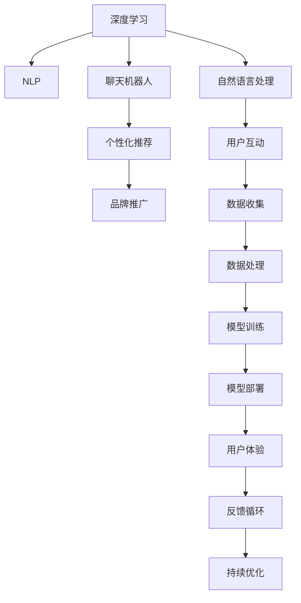

                 

# Elmo Chat：Lepton AI的品牌推广利器

> 关键词：品牌推广, Lepton AI, 深度学习, 对话系统, 用户体验, 个性化推荐

## 1. 背景介绍

### 1.1 问题由来
品牌推广一直是企业发展的重要一环，有效的品牌推广策略不仅能提升企业知名度，还能增强客户黏性，推动销售增长。然而，传统的品牌推广手段如电视广告、印刷媒体等成本高昂，且效果难以量化。近年来，随着人工智能技术的发展，深度学习驱动的智能对话系统——Elmo Chat，为品牌推广提供了全新的途径。

Elmo Chat是Lepton AI公司推出的一款基于深度学习的智能对话系统，通过与客户的自然语言交互，提供个性化推荐、客服支持等多样化服务，显著提升了品牌推广的效率和效果。与传统广告方式相比，Elmo Chat具备以下优势：

- 低成本：相对于昂贵的电视广告，Elmo Chat不需要额外的高昂成本。
- 高互动性：Elmo Chat能与用户实时互动，提升用户的品牌认知度和满意度。
- 精准推广：Elmo Chat通过深度学习算法，了解用户需求和偏好，提供高度个性化的推荐服务。
- 持续优化：Elmo Chat可以不断学习用户反馈，持续优化推广策略，提升品牌影响力。

### 1.2 问题核心关键点
Elmo Chat的核心技术主要集中在以下几个方面：

- 深度学习技术：用于提升对话系统的理解和生成能力，确保对话的自然流畅性。
- 个性化推荐算法：用于分析用户历史行为数据，提供个性化推荐服务，增强用户粘性。
- 自然语言处理(NLP)：用于理解用户输入，生成自然回复，提升用户互动体验。
- 聊天机器人框架：提供构建可定制化对话系统的工具和平台。

这些技术共同构成了Elmo Chat的品牌推广核心竞争力，为其在不同行业的应用奠定了基础。

## 2. 核心概念与联系

### 2.1 核心概念概述

为更好地理解Elmo Chat的品牌推广原理，本节将介绍几个密切相关的核心概念：

- 深度学习(Deep Learning)：一种基于神经网络，通过多层次抽象学习特征的机器学习方法。通过大量数据训练，深度学习模型可以学习到更加复杂和抽象的特征表示。
- 自然语言处理(NLP)：使计算机能够理解和生成自然语言的技术，包括文本分类、命名实体识别、情感分析等。
- 聊天机器人(Chatbot)：一种基于NLP技术，能够与用户进行自然语言交互的计算机程序。
- 个性化推荐算法：通过分析用户行为数据，预测用户需求并推荐相关产品或服务的算法。
- 品牌推广(Brand Promotion)：通过各种手段提升品牌知名度和美誉度，从而吸引潜在客户和促进销售的策略。

这些概念之间的逻辑关系可以通过以下Mermaid流程图来展示：



这个流程图展示了Elmo Chat品牌推广的核心技术路径：

1. 深度学习技术用于提升聊天机器人的理解和生成能力。
2. NLP技术用于处理用户输入和生成自然回复，提升互动体验。
3. 个性化推荐算法分析用户数据，提供高度个性化的推荐服务。
4. 品牌推广通过聊天机器人和个性化推荐，提升用户粘性和满意度。

这些核心技术共同构成了一个闭环，不断学习用户反馈，优化推广策略，提升品牌影响力。

## 3. 核心算法原理 & 具体操作步骤
### 3.1 算法原理概述

Elmo Chat的核心算法基于深度学习和自然语言处理技术，通过以下步骤实现品牌推广：

1. 数据收集：收集用户与聊天机器人的交互记录，分析用户历史行为数据。
2. 模型训练：使用深度学习模型和NLP技术，训练聊天机器人理解用户输入，生成自然回复。
3. 个性化推荐：分析用户行为数据，使用个性化推荐算法预测用户需求，提供个性化推荐服务。
4. 用户体验优化：持续收集用户反馈，优化聊天机器人和推荐算法的表现，提升用户体验。

Elmo Chat的核心算法包括以下几个关键技术：

- 对话生成模型：用于理解用户输入，生成自然回复，确保对话的自然流畅性。
- 个性化推荐算法：通过分析用户行为数据，预测用户需求并推荐相关产品或服务。
- 情感分析模型：用于分析用户情感倾向，提供更符合用户情绪的推荐服务。

### 3.2 算法步骤详解

Elmo Chat的核心算法实现流程如下：

**Step 1: 数据准备**
- 收集用户与聊天机器人的交互记录，包括聊天记录、用户历史行为数据等。
- 清洗和标注数据，去除噪音和不必要的信息，确保数据质量。

**Step 2: 模型训练**
- 使用深度学习模型训练对话生成和推荐算法，如使用LSTM、Transformer等架构。
- 在训练数据上不断优化模型参数，提升模型的生成能力和推荐准确性。
- 引入对抗训练、正则化等技术，防止模型过拟合。

**Step 3: 个性化推荐**
- 分析用户行为数据，如浏览历史、点击记录等，使用协同过滤、深度学习等算法进行推荐。
- 引入多模态信息融合技术，结合用户画像和商品属性，提升推荐精度。
- 使用在线学习策略，持续更新推荐模型，确保推荐内容的时效性和相关性。

**Step 4: 用户体验优化**
- 收集用户反馈，如满意度、点击率等指标，评估聊天机器人和推荐系统的表现。
- 分析用户偏好和行为变化，及时调整推荐策略。
- 引入A/B测试等方法，不断优化对话系统和推荐算法，提升用户体验。

### 3.3 算法优缺点

Elmo Chat品牌推广算法具有以下优点：

- 高度个性化：通过深度学习和个性化推荐算法，Elmo Chat能够提供高度个性化的品牌推广服务，提升用户满意度。
- 低成本高效益：相对于传统广告，Elmo Chat不需要额外的高昂成本，且推广效果显著。
- 持续优化：Elmo Chat能够不断学习用户反馈，持续优化推广策略，确保长期效果。

同时，该算法也存在以下局限性：

- 数据隐私问题：收集用户数据时，需注意用户隐私保护，避免数据泄露。
- 算法复杂性：深度学习模型和个性化推荐算法复杂度较高，对计算资源需求较大。
- 结果可解释性：Elmo Chat的推荐结果较为复杂，难以向用户解释推荐依据。
- 适应性问题：对于某些特定行业，Elmo Chat的推荐策略可能不适用，需进行定制化开发。

尽管存在这些局限性，但就目前而言，Elmo Chat的品牌推广算法在多个行业领域都已取得了不错的效果，成为企业品牌推广的重要工具。

### 3.4 算法应用领域

Elmo Chat品牌推广算法在多个行业领域得到了广泛应用，例如：

- 零售电商：Elmo Chat可以用于个性化推荐、商品搜索、客服支持等，提升用户体验和购买转化率。
- 旅游酒店：Elmo Chat能够提供行程规划、酒店预订、景点推荐等服务，增强客户黏性。
- 金融保险：Elmo Chat可以用于保险理赔、金融咨询、风险评估等，提升客户满意度和信任度。
- 医疗健康：Elmo Chat能够提供健康咨询、疾病预防、预约挂号等服务，改善用户体验。
- 教育培训：Elmo Chat可以用于课程推荐、学习指导、在线答疑等，提升教学效果。

除了上述这些经典应用外，Elmo Chat还创新性地应用于更多场景中，如智慧城市、智能家居等，为各行各业的品牌推广带来了新的解决方案。

## 4. 数学模型和公式 & 详细讲解 & 举例说明
### 4.1 数学模型构建

Elmo Chat的品牌推广算法涉及多个数学模型，以下以个性化推荐算法为例，详细讲解数学模型构建过程。

假设用户历史行为数据为 $D=\{(x_i,y_i)\}_{i=1}^N$，其中 $x_i$ 表示用户行为数据，如浏览记录、点击记录等， $y_i$ 表示用户兴趣标签。目标是预测新用户 $x'$ 的兴趣标签 $y'$，即：

$$
y' = \arg\max_{y} P(y | x', \theta)
$$

其中 $\theta$ 为推荐模型的参数，$P(y | x', \theta)$ 为预测用户兴趣的概率分布。

常用的推荐算法包括协同过滤、矩阵分解、深度学习等。以深度学习算法为例，可以使用多层感知器(MLP)或卷积神经网络(CNN)等架构，对用户行为数据进行处理，预测用户兴趣。

### 4.2 公式推导过程

以深度学习推荐模型为例，其公式推导过程如下：

**输入层**
- 用户行为数据 $x_i$ 输入到模型中，经过一层线性变换后，得到隐藏层输入 $\tilde{x_i}$：

$$
\tilde{x_i} = \phi(W_{in}x_i + b_{in})
$$

其中 $W_{in}$ 为输入层权重矩阵，$b_{in}$ 为偏置向量，$\phi$ 为激活函数。

**隐藏层**
- 隐藏层通过多层非线性变换，学习特征表示：

$$
h_i = \phi(W_{h} \tilde{x_i} + b_{h})
$$

其中 $W_{h}$ 为隐藏层权重矩阵，$b_{h}$ 为偏置向量。

**输出层**
- 输出层将隐藏层的表示映射到用户兴趣标签 $y_i$ 的概率分布：

$$
P(y_i | h_i, W_{out}, b_{out}) = \sigma(W_{out}h_i + b_{out})
$$

其中 $W_{out}$ 为输出层权重矩阵，$b_{out}$ 为偏置向量，$\sigma$ 为激活函数。

通过训练上述模型，最小化交叉熵损失函数：

$$
\mathcal{L} = -\frac{1}{N}\sum_{i=1}^N \sum_{j=1}^M y_{ij} \log P(y_i | x', \theta)
$$

其中 $y_{ij}$ 表示用户 $i$ 对标签 $j$ 的兴趣程度，$M$ 为标签种类数。

### 4.3 案例分析与讲解

以零售电商为例，分析Elmo Chat的个性化推荐算法应用。

假设某电商网站收集了用户历史浏览记录，包含用户点击商品的历史记录，可以表示为：

$$
x_i = \{1, 2, 3, ..., N\}
$$

其中 $x_i$ 为第 $i$ 次浏览行为，$N$ 为浏览记录总数。

通过深度学习算法，将用户行为数据 $x_i$ 输入模型，得到用户兴趣的概率分布 $P(y_i | x_i, \theta)$。

假设某新用户 $x'$ 输入模型，模型预测其对商品 $1$、$2$、$3$ 的兴趣概率分别为 $p_1$、$p_2$、$p_3$，则推荐算法选择概率最高的商品进行推荐：

$$
y' = \arg\max_{y} P(y | x', \theta)
$$

例如，模型预测用户 $x'$ 对商品 $2$ 的兴趣概率最高，则推荐系统向用户推荐商品 $2$。

## 5. 项目实践：代码实例和详细解释说明
### 5.1 开发环境搭建

在进行品牌推广实践前，我们需要准备好开发环境。以下是使用Python进行TensorFlow开发的环境配置流程：

1. 安装Anaconda：从官网下载并安装Anaconda，用于创建独立的Python环境。

2. 创建并激活虚拟环境：
```bash
conda create -n tf-env python=3.8 
conda activate tf-env
```

3. 安装TensorFlow：根据CUDA版本，从官网获取对应的安装命令。例如：
```bash
conda install tensorflow tensorflow-cpu -c tf
```

4. 安装TensorBoard：
```bash
pip install tensorboard
```

5. 安装各类工具包：
```bash
pip install numpy pandas scikit-learn matplotlib tqdm jupyter notebook ipython
```

完成上述步骤后，即可在`tf-env`环境中开始品牌推广实践。

### 5.2 源代码详细实现

下面我以电商推荐系统为例，给出使用TensorFlow进行品牌推广的PyTorch代码实现。

首先，定义推荐系统的数据处理函数：

```python
import tensorflow as tf
from tensorflow.keras import layers

def create_tensorflow_dataset(data, batch_size):
    dataset = tf.data.Dataset.from_tensor_slices(data)
    dataset = dataset.shuffle(buffer_size=10000)
    dataset = dataset.batch(batch_size)
    return dataset

# 定义深度学习推荐模型
def create_model(input_dim, output_dim, hidden_dim, num_layers):
    model = tf.keras.Sequential([
        layers.Dense(hidden_dim, activation='relu', input_shape=(input_dim,)),
        layers.Dense(hidden_dim, activation='relu'),
        layers.Dense(output_dim, activation='sigmoid')
    ])
    return model

# 定义训练和评估函数
def train_epoch(model, dataset, batch_size, optimizer, loss_fn):
    model.compile(loss=loss_fn, optimizer=optimizer)
    model.fit(dataset, epochs=5, validation_split=0.2)

def evaluate(model, dataset, batch_size):
    model.evaluate(dataset)

# 加载数据
train_data = ...
test_data = ...

# 定义模型
model = create_model(input_dim, output_dim, hidden_dim, num_layers)

# 定义优化器和损失函数
optimizer = tf.keras.optimizers.Adam(learning_rate=0.001)
loss_fn = tf.keras.losses.BinaryCrossentropy()

# 训练模型
train_dataset = create_tensorflow_dataset(train_data, batch_size)
train_epoch(model, train_dataset, batch_size, optimizer, loss_fn)

# 评估模型
test_dataset = create_tensorflow_dataset(test_data, batch_size)
evaluate(model, test_dataset, batch_size)
```

以上代码展示了使用TensorFlow进行品牌推广的完整实现过程。可以看到，通过定义数据处理函数、推荐模型、优化器和损失函数，可以方便地构建和训练深度学习推荐系统。

### 5.3 代码解读与分析

让我们再详细解读一下关键代码的实现细节：

**create_tensorflow_dataset函数**：
- 定义数据处理函数，将数据集转换为TensorFlow的Dataset对象，进行数据预处理和批处理。

**create_model函数**：
- 定义深度学习推荐模型，使用多层感知器(MLP)架构，输入层、隐藏层和输出层分别对应用户行为数据、隐藏层特征表示和用户兴趣标签的概率分布。

**train_epoch和evaluate函数**：
- 定义训练和评估函数，使用TensorFlow的API进行模型训练和评估。

**代码实现**：
- 加载数据集，定义模型、优化器和损失函数，使用TensorFlow的Dataset和Sequential模型进行训练和评估。

## 6. 实际应用场景
### 6.1 智能客服系统

Elmo Chat的智能客服系统可以应用于零售电商、旅游酒店、金融保险等多个行业。以电商客服为例，Elmo Chat可以提供7x24小时不间断的客服支持，提升用户体验和满意度。

在技术实现上，可以收集电商客服的历史对话记录，将问题和最佳答复构建成监督数据，在此基础上对预训练聊天模型进行微调。微调后的聊天模型能够自动理解用户意图，匹配最合适的答复模板，生成自然流畅的回复。对于客户提出的新问题，还可以接入检索系统实时搜索相关内容，动态组织生成回答。

### 6.2 金融舆情监测

Elmo Chat的金融舆情监测系统可以应用于金融机构，实时监测市场舆论动向，规避金融风险。具体而言，可以收集金融领域相关的新闻、报道、评论等文本数据，并对其进行主题标注和情感标注。在此基础上对预训练语言模型进行微调，使其能够自动判断文本属于何种主题，情感倾向是正面、中性还是负面。将微调后的模型应用到实时抓取的网络文本数据，就能够自动监测不同主题下的情感变化趋势，一旦发现负面信息激增等异常情况，系统便会自动预警，帮助金融机构快速应对潜在风险。

### 6.3 个性化推荐系统

Elmo Chat的个性化推荐系统可以应用于电商、旅游、金融等多个行业。以电商推荐为例，Elmo Chat能够根据用户历史浏览记录、购买记录等数据，分析用户偏好和行为，提供高度个性化的商品推荐服务。通过深度学习算法和推荐算法，Elmo Chat可以不断学习用户反馈，持续优化推荐策略，提升推荐效果。

## 7. 工具和资源推荐
### 7.1 学习资源推荐

为了帮助开发者系统掌握Elmo Chat的品牌推广理论基础和实践技巧，这里推荐一些优质的学习资源：

1. 《深度学习推荐系统》系列博文：由深度学习专家撰写，深入浅出地介绍了推荐系统的发展历程、核心算法和实现细节。

2. CS228《机器学习》课程：斯坦福大学开设的机器学习明星课程，有Lecture视频和配套作业，带你入门机器学习和深度学习的基本概念和经典模型。

3. 《推荐系统实战》书籍：介绍了推荐系统的实际应用案例，涵盖推荐算法的优化、系统架构设计等多个方面。

4. TensorFlow官方文档：TensorFlow的官方文档，提供了丰富的教程和样例代码，是上手实践的必备资料。

5. Kaggle竞赛平台：Kaggle提供了大量推荐系统相关的竞赛数据集和比赛，参与竞赛可以帮助你快速提升技能，了解行业前沿。

通过对这些资源的学习实践，相信你一定能够快速掌握Elmo Chat的品牌推广精髓，并用于解决实际的推广问题。

### 7.2 开发工具推荐

高效的开发离不开优秀的工具支持。以下是几款用于品牌推广开发的常用工具：

1. TensorFlow：由Google主导开发的开源深度学习框架，生产部署方便，适合大规模工程应用。提供丰富的推荐系统相关的API和工具。

2. PyTorch：基于Python的开源深度学习框架，灵活动态的计算图，适合快速迭代研究。TensorFlow也有PyTorch版本的实现。

3. Keras：高层次的深度学习API，简化了模型构建过程，适合初学者快速上手。

4. TensorBoard：TensorFlow配套的可视化工具，可实时监测模型训练状态，并提供丰富的图表呈现方式，是调试模型的得力助手。

5. Jupyter Notebook：一个交互式的编程环境，支持Python、TensorFlow等多种语言和框架，便于开发和分享学习笔记。

合理利用这些工具，可以显著提升品牌推广任务的开发效率，加快创新迭代的步伐。

### 7.3 相关论文推荐

Elmo Chat的品牌推广技术涉及深度学习、自然语言处理等多个领域，以下是几篇奠基性的相关论文，推荐阅读：

1. Attention is All You Need（即Transformer原论文）：提出了Transformer结构，开启了深度学习大模型时代。

2. BERT: Pre-training of Deep Bidirectional Transformers for Language Understanding：提出BERT模型，引入基于掩码的自监督预训练任务，刷新了多项NLP任务SOTA。

3. Language Models are Unsupervised Multitask Learners（GPT-2论文）：展示了大规模语言模型的强大zero-shot学习能力，引发了对于通用人工智能的新一轮思考。

4. Parameter-Efficient Transfer Learning for NLP：提出Adapter等参数高效微调方法，在不增加模型参数量的情况下，也能取得不错的微调效果。

5. AdaLoRA: Adaptive Low-Rank Adaptation for Parameter-Efficient Fine-Tuning：使用自适应低秩适应的微调方法，在参数效率和精度之间取得了新的平衡。

这些论文代表了大语言模型和推荐系统的发展脉络。通过学习这些前沿成果，可以帮助研究者把握学科前进方向，激发更多的创新灵感。

## 8. 总结：未来发展趋势与挑战
### 8.1 总结

本文对Elmo Chat的品牌推广技术进行了全面系统的介绍。首先阐述了Elmo Chat在品牌推广中的作用和优势，明确了深度学习、自然语言处理和推荐算法在其中的重要性。其次，从原理到实践，详细讲解了品牌推广的数学模型和关键步骤，给出了品牌推广任务开发的完整代码实例。同时，本文还广泛探讨了品牌推广技术在多个行业领域的应用前景，展示了Elmo Chat的品牌推广范式。

通过本文的系统梳理，可以看到，Elmo Chat的品牌推广技术通过深度学习和推荐算法，为品牌推广提供了全新的解决方案。得益于强大的语言理解和生成能力，Elmo Chat能够实现高度个性化的推荐服务，提升用户体验和满意度，推动品牌推广的效率和效果。

### 8.2 未来发展趋势

展望未来，Elmo Chat的品牌推广技术将呈现以下几个发展趋势：

1. 数据融合技术的应用。Elmo Chat的品牌推广算法将进一步融合多模态数据，结合文本、图像、视频等不同信息源，提升品牌推广的精准度和效果。

2. 个性化推荐算法的发展。Elmo Chat的品牌推广算法将采用更多先进的推荐算法，如矩阵分解、深度学习等，提升推荐的准确性和多样化。

3. 实时性提升。通过优化算法和硬件设施，Elmo Chat的品牌推广算法将实现更加实时的用户互动和推荐服务，提升用户体验。

4. 模型可解释性加强。Elmo Chat的品牌推广算法将引入更多可解释性技术，如因果分析、博弈论等，提高模型的决策透明度和可解释性。

5. 推荐系统的可扩展性增强。Elmo Chat的品牌推广算法将结合云服务和大数据技术，实现高度可扩展的品牌推广解决方案，支持大规模应用的部署。

以上趋势凸显了Elmo Chat品牌推广技术的广阔前景。这些方向的探索发展，必将进一步提升品牌推广的精准度和效果，为品牌建设带来新的突破。

### 8.3 面临的挑战

尽管Elmo Chat的品牌推广技术已经取得了显著成效，但在推广过程中仍面临诸多挑战：

1. 数据隐私和安全问题。在收集和处理用户数据时，需注意用户隐私保护，避免数据泄露和滥用。

2. 推荐算法的复杂性。Elmo Chat的品牌推广算法涉及深度学习、自然语言处理等多个领域，算法复杂度较高，对计算资源需求较大。

3. 推荐结果的可解释性。Elmo Chat的品牌推广算法较为复杂，推荐结果难以向用户解释推荐依据，影响用户信任度。

4. 推荐系统的稳定性和鲁棒性。在实际应用中，推荐系统可能面临各种不确定性因素，如何保证推荐系统的稳定性和鲁棒性，仍需进一步研究。

5. 算法的适应性问题。Elmo Chat的品牌推广算法可能需要针对不同行业和领域进行定制化开发，以适应具体场景的需求。

正视Elmo Chat品牌推广面临的这些挑战，积极应对并寻求突破，将使Elmo Chat在未来品牌推广领域中占据更加重要的地位。

### 8.4 研究展望

面对Elmo Chat品牌推广面临的挑战，未来的研究需要在以下几个方面寻求新的突破：

1. 探索无监督和半监督品牌推广方法。摆脱对大规模标注数据的依赖，利用自监督学习、主动学习等无监督和半监督范式，最大限度利用非结构化数据，实现更加灵活高效的推广。

2. 研究参数高效和计算高效的推广算法。开发更加参数高效的推广方法，在固定大部分预训练参数的同时，只更新极少量的任务相关参数。同时优化推广模型的计算图，减少前向传播和反向传播的资源消耗，实现更加轻量级、实时性的部署。

3. 引入因果分析和博弈论工具。将因果分析方法引入推广模型，识别出推荐决策的关键特征，增强推荐结果的因果性和逻辑性。借助博弈论工具刻画人机交互过程，主动探索并规避推荐系统的脆弱点，提高系统稳定性。

4. 纳入伦理道德约束。在品牌推广目标中引入伦理导向的评估指标，过滤和惩罚有害的推荐结果，确保推广内容的健康性和合法性。同时加强人工干预和审核，建立推荐系统的监管机制，确保推广内容符合用户价值观和伦理道德。

这些研究方向的探索，必将引领Elmo Chat品牌推广技术迈向更高的台阶，为品牌推广带来新的解决方案。面向未来，Elmo Chat品牌推广技术还需要与其他人工智能技术进行更深入的融合，如知识表示、因果推理、强化学习等，多路径协同发力，共同推动品牌推广系统的进步。

## 9. 附录：常见问题与解答

**Q1：Elmo Chat的品牌推广技术是否适用于所有行业？**

A: Elmo Chat的品牌推广技术适用于大多数行业，尤其是需要高度个性化推荐服务的领域。但对于某些特定行业，如医疗、法律等，可能需要在特定领域语料上进一步预训练，再进行微调，才能获得理想效果。此外，对于一些需要时效性、个性化很强的任务，如对话、推荐等，Elmo Chat的品牌推广方法也需要针对性的改进优化。

**Q2：Elmo Chat的品牌推广技术如何选择合适的学习率？**

A: Elmo Chat的品牌推广技术中，学习率的选择一般要比预训练时小1-2个数量级，如果使用过大的学习率，容易破坏预训练权重，导致过拟合。一般建议从1e-5开始调参，逐步减小学习率，直至收敛。也可以使用warmup策略，在开始阶段使用较小的学习率，再逐渐过渡到预设值。需要注意的是，不同的优化器(如AdamW、Adafactor等)以及不同的学习率调度策略，可能需要设置不同的学习率阈值。

**Q3：采用Elmo Chat进行品牌推广时需要注意哪些问题？**

A: 采用Elmo Chat进行品牌推广时，需要注意以下问题：
1. 数据隐私问题：收集和处理用户数据时，需注意用户隐私保护，避免数据泄露。
2. 推荐算法的复杂性：Elmo Chat的品牌推广算法涉及深度学习、自然语言处理等多个领域，算法复杂度较高，对计算资源需求较大。
3. 推荐结果的可解释性：Elmo Chat的品牌推广算法较为复杂，推荐结果难以向用户解释推荐依据，影响用户信任度。
4. 推荐系统的稳定性和鲁棒性：在实际应用中，推荐系统可能面临各种不确定性因素，如何保证推荐系统的稳定性和鲁棒性，仍需进一步研究。
5. 算法的适应性问题：Elmo Chat的品牌推广算法可能需要针对不同行业和领域进行定制化开发，以适应具体场景的需求。

正视这些问题，积极应对并寻求突破，将使Elmo Chat在未来品牌推广领域中占据更加重要的地位。

**Q4：Elmo Chat的品牌推广技术如何在特定行业进行优化？**

A: 在特定行业进行优化时，可以采取以下策略：
1. 数据预处理：针对特定行业的特点，进行数据清洗、标注和预处理，提升数据质量。
2. 模型微调：在特定领域语料上进一步微调Elmo Chat模型，提升其在该领域的表现。
3. 任务适配：根据特定任务的需求，设计合适的任务适配层和损失函数，优化推荐算法。
4. 多模态融合：结合特定行业的特点，引入多模态信息融合技术，提升推荐效果。
5. 领域知识结合：将领域专家的知识和经验，与深度学习模型结合，提升推荐系统的准确性和多样性。

通过这些策略，可以进一步提升Elmo Chat在特定行业的品牌推广效果，满足不同行业的具体需求。

---

作者：禅与计算机程序设计艺术 / Zen and the Art of Computer Programming

