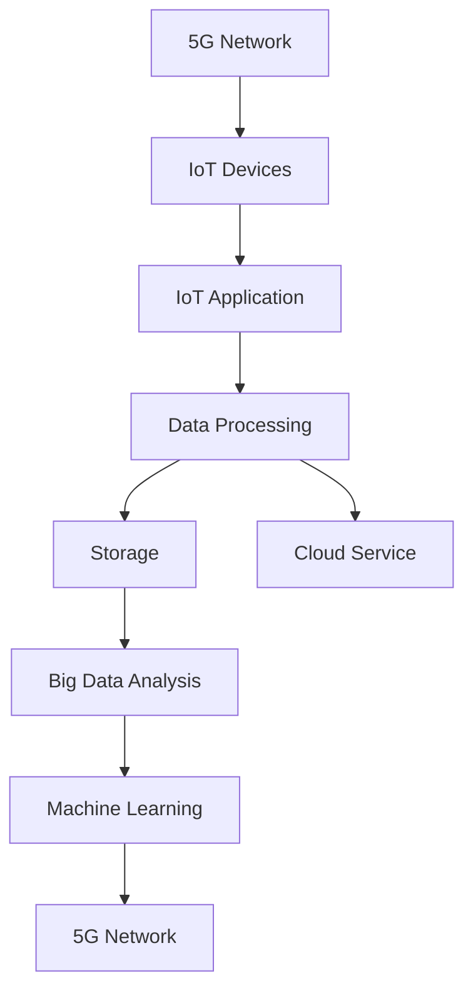

                 

# 5G 物联网应用场景：高速低延迟连接的创新应用

> 关键词：5G, 物联网, 高速连接, 低延迟, 创新应用, 工业互联网, 智能城市, 远程医疗, 工业自动化

## 1. 背景介绍

### 1.1 问题由来

随着5G技术的商业化落地，物联网(IoT)应用场景的多样化和规模化发展，如何充分利用5G的独特优势，拓展物联网的创新应用，已成为学界和产业界共同关注的热点话题。5G网络不仅提供了更高的传输速率和更大的连接密度，更重要的是其微秒级的低延迟特性，为实时性要求较高的应用提供了有力保障。本文将围绕5G物联网应用场景，探讨高速低延迟连接在多个创新应用中的实践和挑战，期望为开发者和研究者提供一些思路和参考。

## 2. 核心概念与联系

### 2.1 核心概念概述

要理解5G物联网的创新应用，首先需要对核心概念有清晰的认识：

- **5G**：代表第五代移动通信技术，相比于4G，5G在传输速率、连接密度、低延迟等方面有了显著提升。
- **物联网(IoT)**：通过各种传感器、终端设备等实现物品与互联网的连接，进而实现信息采集、传输、存储、处理等功能。
- **高速连接**：指5G提供的峰值下载速率超过10Gbps，上传速率超过1Gbps，极大提升了数据传输效率。
- **低延迟**：5G网络的时延一般在1-10毫秒之间，能够满足需要实时响应的应用场景。

这些概念之间相互作用，共同构建了5G物联网应用的基础。

### 2.2 核心概念原理和架构的 Mermaid 流程图



该流程图展示了5G网络与IoT设备、应用、数据处理、存储、云计算、大数据分析、机器学习等各环节的关联关系。

## 3. 核心算法原理 & 具体操作步骤

### 3.1 算法原理概述

5G物联网应用的创新在于利用5G网络的特性，拓展和深化物联网的应用场景。其中，高速连接和低延迟特性是关键。以下是基于5G物联网的核心算法原理：

1. **高速连接**：通过5G网络提供的强大数据传输能力，物联网设备可以实时获取大量数据，从而实现更高频次的数据采集和分析。
2. **低延迟**：低延迟使得物联网应用能够实时处理数据，快速响应控制指令，满足实时性要求高的场景。

这些原理在工业互联网、智能城市、远程医疗、智能制造等领域中得以应用，带来了全新的创新成果。

### 3.2 算法步骤详解

基于5G物联网应用的算法步骤如下：

**Step 1: 数据采集与传输**
- 物联网设备通过5G网络实时采集各类数据。
- 数据通过5G网络传输到云端或本地边缘计算平台。

**Step 2: 数据处理与分析**
- 在云端或边缘计算平台，对采集数据进行预处理和分析。
- 利用大数据分析和机器学习算法，从数据中提取有用的信息。

**Step 3: 决策与控制**
- 根据分析结果，对物联网设备进行决策和控制，如自动调节设备参数、优化运行策略等。

**Step 4: 反馈与优化**
- 将决策和控制结果反馈到物联网设备，调整优化后的运行状态。
- 通过不断迭代，提升物联网系统的智能化水平。

### 3.3 算法优缺点

5G物联网应用的算法具有以下优点：

1. **高效性**：5G网络的高速连接和低延迟特性，极大提升了数据传输和处理效率。
2. **实时性**：物联网应用能够实时响应数据变化，满足工业自动化、智能交通、远程医疗等对实时性的要求。
3. **扩展性**：物联网设备能够快速扩展，支持海量设备连接。

但同时，该算法也存在一些缺点：

1. **高成本**：5G网络建设和维护成本较高，对中小企业和家庭用户而言，成本较高。
2. **隐私问题**：大量的设备连接和数据传输可能带来隐私泄露风险。
3. **安全性**：5G网络的安全防护需进一步加强，以抵御黑客攻击和数据篡改。

### 3.4 算法应用领域

5G物联网的算法在以下领域得到了广泛应用：

- **工业互联网**：利用5G网络的高速和低延迟特性，实现工厂设备的实时监控、故障预测、生产调度和质量控制。
- **智能城市**：通过智能路灯、交通信号灯等设备，实现城市交通流量监测、智能交通管理、环境监测等功能。
- **远程医疗**：在5G网络的支持下，远程手术、远程诊断、远程监控等应用得以实现，提升了医疗服务的普及性和效率。
- **智能制造**：实现生产线的实时数据采集和分析，优化生产流程，提高生产效率和产品质量。

## 4. 数学模型和公式 & 详细讲解 & 举例说明

### 4.1 数学模型构建

以智能制造为例，构建数学模型如下：

**输入**：实时采集的传感器数据 $x = (x_1, x_2, ..., x_n)$

**输出**：优化后的生产参数 $\theta = (\theta_1, \theta_2, ..., \theta_m)$

**目标**：最小化生产成本 $C$ 和产品合格率 $R$

$$
\min_{\theta} C + \lambda R
$$

其中 $C$ 为生产成本，$R$ 为产品合格率，$\lambda$ 为权衡因子。

### 4.2 公式推导过程

在优化目标函数 $C + \lambda R$ 时，可以使用梯度下降算法进行求解。具体步骤如下：

1. 计算损失函数 $L$ 关于生产参数 $\theta$ 的梯度 $\nabla L$。
2. 根据梯度 $\nabla L$ 更新生产参数 $\theta$。
3. 迭代上述过程，直至收敛。

公式推导过程如下：

$$
\nabla L = \nabla C + \lambda \nabla R
$$

更新公式：

$$
\theta \leftarrow \theta - \eta \nabla L
$$

其中 $\eta$ 为学习率。

### 4.3 案例分析与讲解

以某制造企业为例，该企业利用5G网络采集了生产线的实时数据，包括温度、压力、振动等指标。通过优化生产参数，提升了生产效率和产品质量。具体优化过程如下：

1. 采集数据：利用5G网络实时采集生产线的温度、压力、振动等数据。
2. 数据处理：在边缘计算平台上，对采集数据进行预处理，消除噪声和异常值。
3. 模型训练：在云端利用机器学习算法，对处理后的数据进行训练，得到优化后的生产参数。
4. 控制执行：将优化后的生产参数通过5G网络传输回生产线，实现自动调节和优化。

## 5. 项目实践：代码实例和详细解释说明

### 5.1 开发环境搭建

开发5G物联网应用需要搭建包含云计算、边缘计算、大数据分析、机器学习等组件的开发环境。以下是在AWS上搭建开发环境的步骤：

1. 在AWS上创建EC2实例，安装操作系统和依赖软件包。
2. 配置数据库和消息队列，用于存储和管理数据。
3. 搭建Kubernetes集群，支持容器的部署和管理。
4. 安装大数据分析工具Hadoop、Spark和机器学习框架TensorFlow、PyTorch。

### 5.2 源代码详细实现

以下是一个基于5G网络实时监控的Python代码示例：

```python
import paho.mqtt.client as mqtt
import json
from paho.mqtt.client import BlockingMixIn
from kafka import KafkaProducer

class DataBroker(BlockingMixIn, mqtt.Client):
    def __init__(self):
        super().__init__()
        self.on_connect = self.on_connect
        self.on_message = self.on_message
        self.producer = KafkaProducer(bootstrap_servers='localhost:9092')

    def on_connect(self, client, userdata, flags, rc):
        print("Connected to MQTT broker")
        self.subscribe('sensor/data')

    def on_message(self, client, userdata, msg):
        data = json.loads(msg.payload)
        self.producer.send('sensor/data', json.dumps(data).encode('utf-8'))

if __name__ == '__main__':
    broker = DataBroker()
    broker.loop_forever()
```

该代码通过MQTT协议接收传感器数据，并将其通过Kafka发送至大数据分析平台。

### 5.3 代码解读与分析

- `DataBroker` 类继承自 `mqtt.Client`，重写 `on_connect` 和 `on_message` 方法。
- `on_connect` 方法在连接成功时触发，用于订阅 `sensor/data` 主题。
- `on_message` 方法在接收到消息时触发，用于将消息解析为JSON格式，并通过Kafka发送至大数据分析平台。
- 通过MQTT和Kafka，实现了传感器数据的实时采集和处理。

### 5.4 运行结果展示

运行上述代码，可以实时监控传感器数据的变化，并将其转发至大数据分析平台。以下是运行结果示例：

```
Connected to MQTT broker
{"temperature": 28.5, "pressure": 1000.2, "vibration": 0.03}
```

## 6. 实际应用场景

### 6.1 工业互联网

在工业互联网中，5G网络的高速低延迟特性，可以实现工厂设备的实时监控和优化。例如，某制造企业通过5G网络采集生产线上的温度、压力、振动等数据，利用机器学习算法优化生产参数，提高了生产效率和产品质量。

### 6.2 智能城市

在智能城市中，5G网络的高速连接和低延迟特性，可以实现城市基础设施的智能化管理。例如，智能路灯通过5G网络实时监控交通流量，智能调节灯光亮度和颜色，降低了能耗，提升了城市的美观度和安全性。

### 6.3 远程医疗

在远程医疗中，5G网络的高速低延迟特性，可以实现远程手术、远程诊断、远程监控等功能。例如，某远程医疗平台利用5G网络实现实时视频传输和数据采集，提升了医疗服务的可及性和效率。

### 6.4 未来应用展望

未来，5G物联网的创新应用将进一步拓展，以下是几个潜在的方向：

1. **智能家居**：通过5G网络实现家居设备的互联互通，提供智能化的生活服务。
2. **智慧农业**：利用5G网络采集田间地头的实时数据，实现精准农业、智能灌溉、病虫害预警等功能。
3. **智能交通**：通过5G网络实现车辆、道路、交通信号灯等的互联互通，提升交通安全和效率。
4. **远程教育**：利用5G网络实现高质量的视频传输和数据采集，提供沉浸式的远程教育体验。

## 7. 工具和资源推荐

### 7.1 学习资源推荐

1. **《5G物联网应用设计与实践》**：该书系统介绍了5G网络与物联网的结合应用，涵盖数据采集、数据传输、数据分析、决策控制等多个环节。
2. **《智能制造与工业互联网》**：该书深入探讨了工业互联网的架构和应用，提供了丰富的案例和实践经验。
3. **《5G网络技术与应用》**：该书详细讲解了5G网络的原理和应用场景，为5G物联网开发者提供了全面的理论基础。

### 7.2 开发工具推荐

1. **AWS**：提供全面的云服务和工具，支持5G物联网应用的全生命周期管理。
2. **Azure**：提供强大的云平台和开发工具，支持物联网设备的连接和管理。
3. **Google Cloud Platform**：提供高性能的云计算和分析工具，支持大规模数据处理和机器学习算法。

### 7.3 相关论文推荐

1. **5G for Industrial IoT: Opportunities and Challenges**：该论文探讨了5G技术在工业物联网中的应用，提出了具体的应用场景和实现方案。
2. **IoT-Enabled Smart Cities: A Survey**：该论文综述了5G网络在智能城市中的应用，提供了丰富的案例和应用场景。
3. **Remote Healthcare with 5G: Opportunities and Challenges**：该论文探讨了5G网络在远程医疗中的应用，提出了具体的技术方案和挑战。

## 8. 总结：未来发展趋势与挑战

### 8.1 研究成果总结

本文系统介绍了5G网络在物联网应用中的创新应用，涵盖了工业互联网、智能城市、远程医疗等多个领域。通过高速低延迟连接，实现了实时数据采集、传输、处理和优化，提升了各行业的智能化水平。

### 8.2 未来发展趋势

未来，5G物联网的发展将呈现以下几个趋势：

1. **更广泛的应用场景**：随着5G网络的普及，物联网应用将拓展到更多领域，如智能家居、智慧农业、智能交通等。
2. **更智能的决策能力**：利用机器学习和人工智能技术，提升物联网系统的决策能力，实现更精准、智能的运行管理。
3. **更安全的数据保护**：随着物联网设备的普及，数据安全将变得越来越重要，需要加强数据加密和隐私保护。

### 8.3 面临的挑战

尽管5G物联网发展前景广阔，但仍面临诸多挑战：

1. **高成本**：5G网络的建设和维护成本较高，可能影响中小企业的应用。
2. **数据隐私和安全**：大量的设备连接和数据传输可能带来隐私泄露和数据安全问题。
3. **技术标准不统一**：各厂商的设备和网络标准不统一，可能影响物联网系统的互联互通。

### 8.4 研究展望

未来，在5G物联网的研究中，需要重点关注以下几个方向：

1. **边缘计算**：将数据处理和分析任务部署到边缘计算设备上，减少数据传输的延迟和成本。
2. **隐私保护技术**：研究数据加密、匿名化等技术，保护物联网设备的数据隐私和安全。
3. **跨平台互操作性**：制定统一的技术标准，提升不同厂商设备和网络之间的互操作性。

## 9. 附录：常见问题与解答

**Q1: 5G网络与4G网络的主要区别是什么？**

A: 5G网络相比于4G网络，在传输速率、连接密度、低延迟等方面有显著提升。5G网络支持的峰值下载速率超过10Gbps，上传速率超过1Gbps，能够实现毫秒级低延迟，支持大规模设备连接。

**Q2: 5G物联网应用有哪些优势？**

A: 5G物联网应用具有以下几个优势：
1. 高速连接：5G网络提供了强大的数据传输能力，物联网设备可以实时获取大量数据。
2. 低延迟：5G网络的低延迟特性，使得物联网应用能够实时响应数据变化。
3. 扩展性强：5G网络支持海量设备连接，能够快速扩展。

**Q3: 5G物联网应用面临哪些挑战？**

A: 5G物联网应用面临以下挑战：
1. 高成本：5G网络的建设和维护成本较高。
2. 数据隐私和安全：大量的设备连接和数据传输可能带来隐私泄露和数据安全问题。
3. 技术标准不统一：各厂商的设备和网络标准不统一，可能影响物联网系统的互联互通。

**Q4: 如何提升5G物联网应用的安全性？**

A: 提升5G物联网应用的安全性，可以从以下几个方面入手：
1. 数据加密：利用数据加密技术，保护数据传输的安全性。
2. 访问控制：采用访问控制机制，限制设备对网络的访问权限。
3. 安全监测：实时监测网络流量，发现异常行为及时响应。

**Q5: 5G物联网应用在实际场景中有哪些应用？**

A: 5G物联网应用在实际场景中有以下应用：
1. 工业互联网：利用5G网络实现工厂设备的实时监控、故障预测、生产调度和质量控制。
2. 智能城市：通过智能路灯、交通信号灯等设备，实现城市交通流量监测、智能交通管理、环境监测等功能。
3. 远程医疗：在5G网络的支持下，实现远程手术、远程诊断、远程监控等应用。

---

作者：禅与计算机程序设计艺术 / Zen and the Art of Computer Programming

