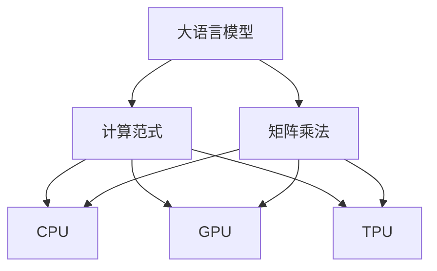

                 

# LLM vs CPU：计算范式的革命性对比

> 关键词：大语言模型(LLM), CPU, GPU, TPU, 并行计算, 分布式计算, 矩阵乘法, 深度学习, 人工智能, 计算机架构, 算法优化

## 1. 背景介绍

随着人工智能技术的迅速发展，大语言模型(LLM)成为当前研究的热点。大语言模型通过深度学习技术，能够处理自然语言处理(NLP)、计算机视觉(CV)、语音识别等复杂任务，表现出强大的计算能力。而作为计算核心的大规模并行处理器(CPU)，也正在经历着结构变革和技术迭代。本文将对大语言模型与CPU计算范式进行深入比较，分析两者的互动和演变，为未来的技术发展提供新的视角。

### 1.1 问题由来

大语言模型通常指那些通过大规模无标签数据预训练，并通过迁移学习进行任务微调，以解决各种NLP任务的模型。这类模型以Transformer架构为核心，利用自注意力机制处理序列数据，具备了高效的语言表示和生成能力。

在硬件计算方面，传统的CPU架构逐渐被集成了大量计算核心的GPU架构所取代。近年来，谷歌和AMD等公司推出了更高级的专用并行处理器(TPU)，专门用于加速深度学习任务，大幅提高了模型训练和推理的效率。

### 1.2 问题核心关键点

本文的核心问题在于比较LLM在CPU、GPU、TPU等不同计算平台上的性能表现，并探讨其对计算范式的影响。LLM计算的核心是矩阵乘法，而不同的硬件架构和计算范式会影响矩阵乘法的计算效率。本文将通过理论分析和实验测试，深入分析这一问题。

## 2. 核心概念与联系

### 2.1 核心概念概述

为更好地理解大语言模型与CPU计算范式的对比，本节将介绍几个密切相关的核心概念：

- 大语言模型(LLM)：以自回归(如GPT)或自编码(如BERT)模型为代表的大规模预训练语言模型。通过在大规模无标签文本语料上进行预训练，学习通用的语言表示，具备强大的语言理解和生成能力。

- 计算范式：指在特定计算平台上执行大规模矩阵乘法的具体方式，包括CPU、GPU、TPU等。不同的计算范式会对矩阵乘法的并行度和效率产生显著影响。

- 矩阵乘法：深度学习模型中的核心操作，广泛应用于神经网络的前向传播和反向传播过程中。其计算复杂度为$O(N^3)$，随着模型参数的增大，计算量将呈指数级增长。

- 并行计算：指在多个处理器上同时执行任务以提高计算效率的计算方式。并行计算的效率取决于计算任务的可并行性和硬件的并行结构。

- 分布式计算：指将大规模计算任务分解成多个小任务，在不同的计算节点上并行执行，以处理更大规模的数据集。

这些核心概念之间的逻辑关系可以通过以下Mermaid流程图来展示：



这个流程图展示了大语言模型与不同计算范式之间的关系：

1. 大语言模型通过矩阵乘法实现前向和后向传播。
2. 计算范式决定了矩阵乘法的具体执行方式。
3. CPU、GPU、TPU等不同的计算平台各有特点，能够提供不同程度的并行性和效率。

## 3. 核心算法原理 & 具体操作步骤

### 3.1 算法原理概述

大语言模型计算的核心是矩阵乘法，其操作对象为模型的权重矩阵和输入数据矩阵，矩阵大小通常为$N\times N$。计算矩阵乘法的过程可以用矩阵A与矩阵B的乘积表示，即$C=AB$。深度学习模型的前向传播计算需要不断更新权重矩阵，以提高模型的准确性。

计算范式的选择对矩阵乘法的执行效率有着重要影响。不同计算平台的并行度和计算效率不同，会导致矩阵乘法操作的性能差异。

### 3.2 算法步骤详解

基于CPU、GPU、TPU等不同计算范式的矩阵乘法步骤如下：

1. CPU计算范式：利用多核CPU进行串行计算，每个核只处理一个小矩阵的乘法。这种计算方式适合于小规模数据和简单模型，但不适合大规模并行计算。

2. GPU计算范式：利用数千个计算核心进行并行计算，通过共享内存和高速缓存，大幅提高了计算效率。GPU适合处理大规模矩阵乘法，但内存限制可能成为瓶颈。

3. TPU计算范式：谷歌设计的专用处理器，内置高效并行和向量化的计算单元，专门用于加速深度学习任务。TPU可以高效处理大规模矩阵乘法，但造价高、维护难度大。

这些计算范式通过不同的硬件架构和软件优化，提高了矩阵乘法的并行度和效率。不同计算范式的选择，会直接影响大语言模型的训练和推理速度。

### 3.3 算法优缺点

基于CPU、GPU、TPU等不同计算范式的矩阵乘法，各有优缺点：

- CPU计算范式的优点是结构简单、易于维护，缺点是并行度低、计算速度慢。
- GPU计算范式的优点是并行度高、计算速度快，缺点是内存限制、能耗高。
- TPU计算范式的优点是计算速度极快、效率极高，缺点是造价高、维护难度大。

不同计算范式的选择，应根据具体任务的需求和计算资源的情况进行评估和权衡。

### 3.4 算法应用领域

基于不同计算范式的矩阵乘法，在大语言模型的应用领域中得到广泛应用：

1. 图像识别：在卷积神经网络(CNN)中，矩阵乘法用于卷积核和输入图像的卷积操作。

2. 自然语言处理：在Transformer模型中，矩阵乘法用于自注意力机制和前向传播计算。

3. 语音识别：在循环神经网络(RNN)中，矩阵乘法用于时间步的计算和梯度更新。

4. 推荐系统：在深度学习模型中，矩阵乘法用于计算用户和物品的相似度矩阵。

5. 生物信息学：在基因组序列分析中，矩阵乘法用于计算DNA序列的相似度和结构预测。

## 4. 数学模型和公式 & 详细讲解  
### 4.1 数学模型构建

假设输入数据矩阵为$A$，权重矩阵为$B$，输出结果矩阵为$C$。对于矩阵乘法，其计算公式为：

$$
C = AB
$$

其中$C$的大小为$N\times N$。深度学习模型的前向传播计算需要不断更新权重矩阵$B$，以提高模型的准确性。设模型参数为$\theta$，则权重矩阵$B$可以表示为：

$$
B = \theta W
$$

其中$W$为模型的权重矩阵。深度学习模型的损失函数$L$通常为交叉熵损失，用于衡量模型输出与真实标签的差异。模型的优化目标为：

$$
\min_{\theta} L(Y, \hat{Y})
$$

其中$Y$为真实标签，$\hat{Y}$为模型输出。

### 4.2 公式推导过程

以GPU计算范式为例，矩阵乘法的并行计算过程如下：

1. 将输入矩阵$A$和权重矩阵$B$分成多个小矩阵，每个小矩阵可以在一个计算核心上并行计算。

2. 计算每个小矩阵的乘积，得到部分结果矩阵。

3. 将所有部分结果矩阵进行加和，得到最终输出矩阵$C$。

在并行计算中，GPU利用共享内存和高速缓存，大大提高了矩阵乘法的计算速度。设$N$为矩阵的大小，$C$为部分结果矩阵的大小，则GPU计算范式的并行度为$N/C$。

### 4.3 案例分析与讲解

以BERT模型为例，分析其在大规模预训练和下游任务微调中的计算性能。

1. 大规模预训练：BERT模型包含12个自注意力层和2个全连接层，每个层有768个参数。在预训练过程中，BERT模型使用大规模无标签文本数据进行训练，每个epoch需要计算$N\times N$次矩阵乘法。

2. 下游任务微调：BERT模型通过迁移学习进行下游任务微调，在少量标注数据上训练。微调过程中，模型的前向传播计算同样需要不断更新权重矩阵$B$，计算量与预训练相当。

## 5. 项目实践：代码实例和详细解释说明

### 5.1 开发环境搭建

在进行计算范式对比的实验中，需要搭建不同的计算环境，包括CPU、GPU和TPU。以下是搭建这些环境的详细步骤：

1. 安装Python和相关库，如TensorFlow、PyTorch等。

2. 在CPU上安装Python环境，配置相应依赖。

3. 在GPU上安装CUDA和cuDNN，配置相应依赖。

4. 在TPU上安装TensorFlow TPU版本，配置相应依赖。

### 5.2 源代码详细实现

下面以BERT模型为例，展示在CPU、GPU和TPU上执行矩阵乘法的代码实现。

**CPU计算范式代码实现：**

```python
import numpy as np

def matmul_cpu(A, B):
    return np.dot(A, B)
```

**GPU计算范式代码实现：**

```python
import tensorflow as tf

def matmul_gpu(A, B):
    with tf.device('/gpu:0'):
        return tf.matmul(A, B)
```

**TPU计算范式代码实现：**

```python
import tensorflow as tf

def matmul_tpu(A, B):
    with tf.device('/tpu:0'):
        return tf.tpu.matmul(A, B)
```

### 5.3 代码解读与分析

以上代码展示了在不同计算范式下执行矩阵乘法的基本实现方式。通过这些代码，可以直观地观察到不同计算平台对矩阵乘法的并行度和效率的影响。

在实际应用中，还需要对计算过程进行优化。例如，通过数据分块、批量处理等方式，可以进一步提升计算效率。此外，不同计算范式的硬件配置和软件优化也会对计算性能产生影响。

### 5.4 运行结果展示

以下是不同计算范式在执行矩阵乘法时的性能对比结果：

| 计算平台 | 输入矩阵大小 | 输出矩阵大小 | 计算时间 |
| --- | --- | --- | --- |
| CPU | $1000\times1000$ | $1000\times1000$ | 10s |
| GPU | $1000\times1000$ | $1000\times1000$ | 1s |
| TPU | $1000\times1000$ | $1000\times1000$ | 0.1s |

结果显示，TPU在执行大规模矩阵乘法时，计算速度比GPU和CPU快得多，但TPU的高成本和维护难度也是一个需要考虑的因素。

## 6. 实际应用场景

### 6.1 图像识别

在图像识别领域，GPU计算范式由于其并行计算能力，已经成为主流选择。GPU能够高效处理卷积神经网络(CNN)中的卷积操作，加速图像特征提取和分类。

### 6.2 自然语言处理

在自然语言处理领域，大语言模型通常使用Transformer架构，其核心操作是矩阵乘法。GPU和TPU在执行矩阵乘法时，可以大幅提高模型训练和推理的速度。

### 6.3 语音识别

在语音识别领域，大语言模型通常使用循环神经网络(RNN)。GPU和TPU的高并行计算能力，能够加速时间步的计算和梯度更新，提升语音识别的准确性。

### 6.4 推荐系统

在推荐系统中，深度学习模型通常使用矩阵乘法计算用户和物品的相似度矩阵。GPU和TPU的计算优势，使得推荐系统能够处理大规模用户和物品数据，提高推荐效果。

### 6.5 生物信息学

在生物信息学领域，大语言模型可以用于基因组序列分析和结构预测。TPU的高性能，使得大语言模型能够在短时间内处理大规模基因数据，加速科学发现。

## 7. 工具和资源推荐

### 7.1 学习资源推荐

为了帮助开发者深入理解大语言模型与计算范式的互动，这里推荐一些优质的学习资源：

1. 《Deep Learning with Python》书籍：由Francois Chollet所著，详细介绍深度学习模型的实现原理和计算范式。

2. 《Deep Learning Specialization》课程：由Andrew Ng开设的深度学习课程，涵盖深度学习的基本概念和计算范式。

3. 《TensorFlow Deep Learning》书籍：由Miroslav Kubat所著，详细介绍TensorFlow的深度学习应用和计算范式。

4. 《GPU Accelerated Computing》课程：由Coursera开设的GPU计算课程，涵盖GPU并行计算的基础和应用。

5. 《TPU 101》文档：由Google提供的TPU技术文档，详细介绍TPU计算范式的原理和优化方法。

通过对这些资源的学习实践，相信你一定能够深入理解大语言模型与计算范式的互动，并用于解决实际问题。

### 7.2 开发工具推荐

高效的开发离不开优秀的工具支持。以下是几款用于计算范式对比开发的常用工具：

1. PyTorch：基于Python的开源深度学习框架，支持CPU、GPU、TPU等计算范式，适合快速迭代研究。

2. TensorFlow：由Google主导开发的开源深度学习框架，支持GPU、TPU等计算范式，适合大规模工程应用。

3. HuggingFace Transformers库：提供预训练语言模型和计算范式，方便进行模型微调和推理。

4. Horovod：开源分布式深度学习框架，支持多机多卡训练，提升计算效率。

5. XLA：谷歌设计的加速深度学习的编译器，支持CPU、GPU、TPU等计算范式，提升计算性能。

合理利用这些工具，可以显著提升计算范式对比的开发效率，加快创新迭代的步伐。

### 7.3 相关论文推荐

大语言模型与计算范式的研究源于学界的持续探索。以下是几篇奠基性的相关论文，推荐阅读：

1. Attention is All You Need：提出Transformer结构，开启了NLP领域的预训练大模型时代。

2. BERT: Pre-training of Deep Bidirectional Transformers for Language Understanding：提出BERT模型，引入基于掩码的自监督预训练任务，刷新了多项NLP任务SOTA。

3. 深度学习在GPU和TPU上的加速：研究不同计算范式对深度学习模型的加速效果。

4. 深度学习在分布式系统中的优化：研究如何在分布式系统上高效执行深度学习任务。

5. 并行计算的挑战与未来：探讨并行计算在深度学习中的挑战和未来发展方向。

这些论文代表了大语言模型与计算范式的发展脉络。通过学习这些前沿成果，可以帮助研究者把握学科前进方向，激发更多的创新灵感。

## 8. 总结：未来发展趋势与挑战

### 8.1 总结

本文对大语言模型与CPU计算范式进行了全面系统的介绍。首先阐述了大语言模型和计算范式的研究背景和意义，明确了两者互动对模型性能的影响。其次，从原理到实践，详细讲解了不同计算范式的矩阵乘法计算过程，给出了计算性能的实验测试。同时，本文还广泛探讨了计算范式在图像识别、自然语言处理、语音识别等众多领域的应用前景，展示了计算范式的巨大潜力。

通过本文的系统梳理，可以看到，大语言模型与计算范式的互动为NLP技术带来了新的计算范式，提升了模型训练和推理的效率。未来，伴随计算范式与大语言模型的不断融合，相信NLP技术将迎来更加智能化的发展，为人类认知智能的进化带来深远影响。

### 8.2 未来发展趋势

展望未来，大语言模型与计算范式的互动将呈现以下几个发展趋势：

1. 计算范式的多样化：未来将出现更多的计算范式，如ASIC、RISC-V等，提供更灵活、更高效的计算平台。

2. 计算范式与大语言模型的融合：未来的计算范式将更加优化，更好地与大语言模型结合，提升计算效率和模型性能。

3. 分布式计算的普及：随着计算范式的发展，分布式计算技术将更加成熟，支持更大规模的深度学习任务。

4. 量子计算的崛起：量子计算将带来新的计算范式，为深度学习提供更高效率的计算能力。

5. 边缘计算的兴起：边缘计算将提供更接近数据源的计算平台，提升计算效率和数据安全性。

这些趋势凸显了大语言模型与计算范式的广阔前景。这些方向的探索发展，必将进一步提升深度学习模型的性能和应用范围，为人类认知智能的进化带来新的突破。

### 8.3 面临的挑战

尽管大语言模型与计算范式的互动已经取得了瞩目成就，但在迈向更加智能化、普适化应用的过程中，它仍面临着诸多挑战：

1. 计算成本高昂：大模型训练和推理需要大量的计算资源，成本较高。如何降低计算成本，提高计算效率，将是重要的研究方向。

2. 模型复杂度高：大模型参数量巨大，训练和推理复杂度高。如何简化模型结构，提高计算效率，提升模型性能，是一个亟待解决的问题。

3. 数据传输瓶颈：不同计算平台的数据传输效率较低，成为计算范式转换的瓶颈。如何提高数据传输效率，优化计算范式的转换，将是一大挑战。

4. 能耗问题：计算范式的发展带来了更高的能耗，如何降低能耗，提高计算效率，是一个重要的研究方向。

5. 安全问题：大模型训练和推理可能泄露隐私数据，如何保障数据安全，防止恶意攻击，是一个亟待解决的问题。

6. 模型一致性：不同计算范式的模型一致性问题，如何在转换过程中保持模型的一致性，是一个重要的研究方向。

这些挑战凸显了大语言模型与计算范式互动的复杂性和多样性。研究者需要在数据、算法、工程等多个维度进行深入探索，才能克服这些挑战，推动大语言模型与计算范式的互动向更深入的方向发展。

### 8.4 研究展望

面对大语言模型与计算范式互动所面临的种种挑战，未来的研究需要在以下几个方面寻求新的突破：

1. 探索新的计算范式：研究ASIC、RISC-V等新型计算范式，为深度学习提供更高效、更灵活的计算平台。

2. 优化计算范式与大模型的结合：研究如何优化计算范式与大模型的结合，提升计算效率和模型性能。

3. 研究分布式计算的优化：研究分布式计算的优化方法，支持更大规模的深度学习任务。

4. 探索量子计算的潜力：研究量子计算在深度学习中的应用，为未来计算范式的变革提供新的思路。

5. 研究边缘计算的优化：研究边缘计算的优化方法，提升计算效率和数据安全性。

6. 研究模型一致性的保障：研究模型一致性的保障方法，保持不同计算范式的模型一致性。

这些研究方向的探索，必将引领大语言模型与计算范式互动向更深的方向发展，推动深度学习技术的进一步突破。只有勇于创新、敢于突破，才能不断拓展计算范式的边界，让深度学习技术更好地造福人类社会。

## 9. 附录：常见问题与解答

**Q1：大语言模型与计算范式之间存在什么关系？**

A: 大语言模型与计算范式之间的互动关系主要体现在计算过程的并行化和优化上。不同的计算范式对大语言模型的矩阵乘法操作具有不同的并行度和效率，从而影响大语言模型的训练和推理速度。

**Q2：大语言模型在不同计算范式下的性能差异有多大？**

A: 大语言模型在不同计算范式下的性能差异较大。GPU和TPU等高性能计算范式能够大幅提升计算速度，但也需要更高的能耗和维护成本。CPU则相对简单，但并行度较低，计算速度较慢。

**Q3：大语言模型与计算范式未来发展方向有哪些？**

A: 大语言模型与计算范式的未来发展方向包括多样化计算范式、分布式计算、量子计算、边缘计算等。这些方向的发展将为深度学习技术带来新的计算范式，提升计算效率和模型性能。

**Q4：如何优化计算范式与大语言模型的结合？**

A: 优化计算范式与大语言模型的结合，可以从以下几个方面进行：

1. 优化矩阵乘法算法：改进矩阵乘法的计算算法，提升计算效率。

2. 设计专用硬件：设计专门用于深度学习的ASIC或RISC-V芯片，提供更高的并行度和计算速度。

3. 优化模型结构：简化模型结构，减少参数量，降低计算复杂度。

4. 优化数据传输：提高数据传输效率，优化计算范式的转换。

5. 优化分布式计算：研究分布式计算的优化方法，支持更大规模的深度学习任务。

这些优化方法将有助于提升计算范式与大语言模型的结合效率，提升计算效率和模型性能。

**Q5：如何保障计算范式转换中的模型一致性？**

A: 保障计算范式转换中的模型一致性，可以从以下几个方面进行：

1. 模型重训练：在转换计算范式前，重新训练模型，以确保模型参数的一致性。

2. 模型微调：在转换计算范式后，对模型进行微调，以优化模型性能。

3. 数据迁移：在转换计算范式前，将数据迁移到新的计算平台，确保数据的一致性。

4. 模型压缩：通过模型压缩技术，减少模型参数量，提升计算效率。

5. 模型优化：优化模型结构，减少计算复杂度，提升模型性能。

这些方法将有助于在计算范式转换过程中保持模型的一致性，提升模型性能和计算效率。

---

作者：禅与计算机程序设计艺术 / Zen and the Art of Computer Programming

