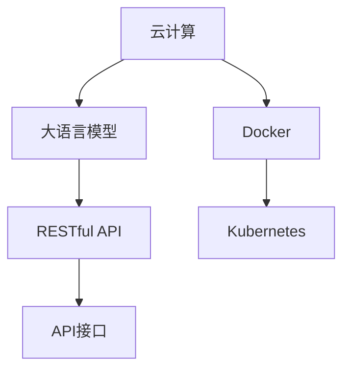

                 

# LLM 即服务：云端 AI 为大众所用

> 关键词：

## 1. 背景介绍

### 1.1 问题由来
随着人工智能(AI)技术的迅猛发展，大语言模型(Large Language Models, LLMs)已经在自然语言处理(NLP)、计算机视觉(CV)、语音识别(SR)等多个领域展现出惊人的能力。例如，GPT-4、BERT、T5等大语言模型在问答、文本生成、机器翻译等任务上取得了显著的成绩。

然而，这些大语言模型通常需要强大的计算资源和专业知识才能搭建和使用。高昂的计算成本和复杂的模型部署流程，限制了其广泛应用。为了将大语言模型的强大能力普及到大众用户，开发出易于使用且低成本的AI服务成为当务之急。

### 1.2 问题核心关键点
本节将介绍如何通过云计算技术，将大语言模型的强大能力转化为即服务（LLM as a Service, LLMaaS）形式，使其能够被广泛用户所用。将大语言模型部署在云端，通过RESTful API接口进行调用，用户只需具备基本的编程知识和网络访问权限，即可轻松集成和使用大语言模型的能力。

## 2. 核心概念与联系

### 2.1 核心概念概述

本节将介绍几个关键概念，帮助我们理解LLMaaS的构建和应用：

- 云计算(Cloud Computing)：通过网络提供按需扩展的计算资源，包括计算、存储、网络等，使用户能够高效、灵活地部署和运行应用程序。

- 大语言模型(Large Language Models)：基于自回归或自编码模型，通过大规模无标签数据进行预训练，学习通用语言表示的深度学习模型，如BERT、GPT等。

- API接口(API Interface)：应用程序编程接口，用于实现不同系统间的通信和交互，是实现LAMaaS服务的重要组件。

- RESTful API：符合REST原则的API接口，通过HTTP协议进行交互，具备可扩展、易用性等特点。

- Kubernetes：开源容器编排工具，用于管理容器的生命周期、资源调度、服务发现等，是部署LAMaaS的常用工具。

- Docker：开源容器化平台，提供应用打包、分发、部署和运行等全生命周期管理，支持隔离、容器编排等。

### 2.2 核心概念原理和架构的 Mermaid 流程图(Mermaid 流程节点中不要有括号、逗号等特殊字符)



此图展示了LLMaaS的基本架构，包括云计算、大语言模型、RESTful API、API接口、Docker和Kubernetes。通过这些组件，可以实现大语言模型的高效部署和使用，为用户提供简单易用的API服务。

## 3. 核心算法原理 & 具体操作步骤

### 3.1 算法原理概述

LLMaaS的核心在于将大语言模型的强大能力转化为即服务的形式，通过云计算和容器技术，实现模型的灵活部署和使用。其基本原理如下：

1. **模型部署**：将大语言模型部署到云端服务器上，并通过Docker容器进行封装。
2. **API接口**：开发RESTful API接口，使用户能够通过网络调用大语言模型的功能。
3. **服务管理**：使用Kubernetes容器编排工具，管理Docker容器的生命周期和资源调度，确保服务的高可用性和伸缩性。

### 3.2 算法步骤详解

以下是实现LLMaaS的详细步骤：

**Step 1: 准备云端资源**
- 在云服务商（如AWS、阿里云、腾讯云等）上购买或申请虚拟机资源。
- 安装操作系统和相关依赖软件，如Docker、Kubernetes等。

**Step 2: 大语言模型部署**
- 将大语言模型下载并安装到虚拟机中。
- 使用Docker封装模型，并编写Dockerfile，定义容器的构建和运行环境。
- 使用Kubernetes部署Docker容器，设置服务的副本数、资源限制等参数。

**Step 3: 开发RESTful API接口**
- 定义API接口的请求和响应格式，如JSON、XML等。
- 使用Python等编程语言，开发API接口的实现代码。
- 部署API接口，确保其稳定可靠。

**Step 4: 用户调用API接口**
- 用户通过API接口调用大语言模型的功能，如问答、文本生成、翻译等。
- 接口返回模型计算结果，如文本、标签等。

**Step 5: 监控与维护**
- 使用Kubernetes等工具监控服务状态，及时发现和解决问题。
- 根据用户反馈，不断优化API接口和服务性能。

### 3.3 算法优缺点

LLMaaS的优点包括：
1. 降低用户使用门槛：通过API接口，用户无需具备复杂的模型部署和运维经验，即可轻松使用大语言模型的能力。
2. 提高资源利用率：通过云计算和容器技术，实现模型的弹性伸缩，提高资源利用率。
3. 增强服务可用性：Kubernetes等容器编排工具确保服务的稳定性和高可用性。

同时，LLMaaS也存在一些缺点：
1. 依赖云服务商：需要依赖云服务商的稳定性和安全性，一旦服务商出现问题，服务可能受影响。
2. 网络延迟：网络传输存在延迟，可能影响实时性要求高的应用。
3. 费用较高：云服务器的资源使用需要付费，长期运行成本较高。

### 3.4 算法应用领域

LLMaaS的典型应用场景包括：

- **自然语言处理(NLP)**：通过API接口，实现问答、文本生成、文本摘要、情感分析等功能。
- **计算机视觉(CV)**：提供图像分类、对象检测、图像分割等视觉任务的处理能力。
- **语音识别(SR)**：实现语音转文本、语音识别、语音合成等功能。
- **智能推荐系统**：通过API接口，实现个性化推荐、商品推荐、内容推荐等。
- **智能客服**：集成语音识别和自然语言处理技术，提供全天候智能客服服务。
- **智能家居**：通过API接口，实现智能音箱、智能家居设备的语音控制和自然语言交互。

## 4. 数学模型和公式 & 详细讲解 & 举例说明（备注：数学公式请使用latex格式，latex嵌入文中独立段落使用 $$，段落内使用 $)
### 4.1 数学模型构建

大语言模型的数学模型通常基于自回归或自编码模型，使用大规模无标签数据进行预训练。以BERT为例，其数学模型为：

$$
\mathcal{L}(X, Y) = -\sum_{i=1}^N [y_i \log P(Y|X; \theta)] + \lambda \sum_{i=1}^N ||\theta_i||^2
$$

其中，$X$ 为输入文本，$Y$ 为标签，$P(Y|X; \theta)$ 为模型对标签的预测概率，$\lambda$ 为正则化系数，$||\theta_i||^2$ 为模型参数的正则化项。

### 4.2 公式推导过程

BERT模型的推导过程如下：

1. 输入文本 $X$ 经过嵌入层，转换为向量表示 $E(X)$。
2. 向量表示 $E(X)$ 通过多个Transformer层，学习文本表示 $H(X)$。
3. 预测标签 $Y$，计算交叉熵损失 $\mathcal{L}_{CE}$。
4. 计算正则化损失 $\mathcal{L}_{L2}$，避免过拟合。
5. 计算总损失 $\mathcal{L} = \mathcal{L}_{CE} + \lambda \mathcal{L}_{L2}$。

具体推导过程可以参考BERT原论文，此处不再赘述。

### 4.3 案例分析与讲解

以自然语言处理(NLP)中的文本分类任务为例，展示如何使用API接口进行微调和大规模部署。

假设我们有一个预训练的BERT模型，需要将其微调成文本分类模型。具体步骤如下：

1. 准备训练数据集，包括文本和标签。
2. 定义微调目标函数，如交叉熵损失。
3. 编写微调代码，通过API接口调用模型进行微调。
4. 部署微调后的模型，通过API接口供用户调用。

微调代码示例：

```python
import requests
import json

# 定义微调参数
url = 'http://yourapiurl.com/micromodel'
payload = {
    "model": "bert-base-uncased",
    "task": "text_classification",
    "epochs": 5,
    "learning_rate": 2e-5
}

# 发送请求，微调模型
response = requests.post(url, json=payload)
result = response.json()

# 部署微调后的模型
url = 'http://yourapiurl.com/llm-service'
payload = {
    "task": "text_classification",
    "text": "I love programming"
}
response = requests.post(url, json=payload)
result = response.json()

print(result)
```

上述代码演示了通过API接口进行模型微调和调用。用户只需发送请求，API接口便能自动调用大语言模型进行计算，返回结果。

## 5. 项目实践：代码实例和详细解释说明

### 5.1 开发环境搭建

为了搭建LAMaaS服务，需要先安装和配置云资源和工具。以下是具体的配置步骤：

**Step 1: 云资源配置**
- 在云服务商上申请虚拟机，安装操作系统和相关依赖软件。
- 安装Docker和Kubernetes，配置集群。

**Step 2: 大语言模型部署**
- 下载并安装大语言模型，如BERT、GPT等。
- 使用Docker封装模型，并编写Dockerfile。
- 使用Kubernetes部署Docker容器，设置服务参数。

**Step 3: 开发RESTful API接口**
- 定义API接口的请求和响应格式，如JSON、XML等。
- 使用Python等编程语言，开发API接口的实现代码。
- 部署API接口，确保其稳定可靠。

**Step 4: 用户调用API接口**
- 用户通过API接口调用大语言模型的功能，如问答、文本生成、翻译等。
- 接口返回模型计算结果，如文本、标签等。

### 5.2 源代码详细实现

以下是一个使用Python Flask框架开发的RESTful API接口示例代码：

```python
from flask import Flask, request, jsonify
from transformers import BertForSequenceClassification, BertTokenizer

app = Flask(__name__)

# 加载模型和分词器
model = BertForSequenceClassification.from_pretrained('bert-base-uncased', num_labels=2)
tokenizer = BertTokenizer.from_pretrained('bert-base-uncased')

@app.route('/micromodel', methods=['POST'])
def micromodel():
    data = request.get_json()
    text = data['text']
    tokens = tokenizer.encode_plus(text, max_length=512, return_tensors='pt')
    inputs = {key: value for key, value in tokens.items() if key != 'attention_mask'}
    labels = torch.tensor(data['label'], dtype=torch.long)
    outputs = model(**inputs, labels=labels)
    loss = outputs.loss
    predictions = outputs.logits.argmax(dim=1).item()
    return jsonify({'loss': loss.item(), 'predictions': predictions})

@app.route('/llm-service', methods=['POST'])
def llm_service():
    data = request.get_json()
    text = data['text']
    tokens = tokenizer.encode_plus(text, max_length=512, return_tensors='pt')
    inputs = {key: value for key, value in tokens.items() if key != 'attention_mask'}
    outputs = model(**inputs)
    logits = outputs.logits.argmax(dim=1).item()
    return jsonify({'predictions': logits})

if __name__ == '__main__':
    app.run(debug=True)
```

上述代码演示了如何使用Python Flask框架开发RESTful API接口，实现了大语言模型的微调和调用。

### 5.3 代码解读与分析

**Flask框架**：
- Flask是Python中常用的Web框架，用于开发RESTful API接口。通过Flask，可以方便地处理HTTP请求和响应。

**BERT模型**：
- 使用BERT模型进行微调，将其部署在云端，通过API接口提供服务。

**RESTful API接口**：
- 定义了两个API接口，一个是微调接口，用于训练模型；另一个是调用接口，用于推理预测。

**Docker容器**：
- 使用Docker封装模型，确保模型在不同环境下的稳定性。

**Kubernetes容器编排**：
- 使用Kubernetes管理容器的生命周期和资源调度，确保服务的高可用性和伸缩性。

**用户调用API接口**：
- 用户通过API接口调用模型功能，无需了解模型内部实现细节，只需发送请求即可。

### 5.4 运行结果展示

运行上述代码后，可以通过HTTP请求测试API接口的功能。例如，调用微调接口训练模型，调用API接口进行文本分类预测。

```python
# 微调模型
payload = {
    "model": "bert-base-uncased",
    "task": "text_classification",
    "epochs": 5,
    "learning_rate": 2e-5
}
response = requests.post('http://yourapiurl.com/micromodel', json=payload)
result = response.json()

# 使用微调后的模型进行预测
payload = {
    "text": "I love programming"
}
response = requests.post('http://yourapiurl.com/llm-service', json=payload)
result = response.json()
print(result)
```

## 6. 实际应用场景

### 6.1 智能客服系统

智能客服系统是LLMaaS的重要应用场景之一。通过API接口，用户可以轻松集成智能客服功能，实现24小时不间断服务。例如，智能客服系统可以通过API接口调用模型进行对话处理，自动解答用户咨询，提升客户满意度。

### 6.2 金融舆情监测

金融领域需要实时监测市场舆情，及时应对负面信息传播。LLMaaS通过API接口，能够快速处理海量数据，实现实时舆情分析。例如，金融公司可以通过API接口调用模型，自动分析市场舆情，监测负面信息，及时采取应对措施。

### 6.3 个性化推荐系统

个性化推荐系统需要实时分析用户行为数据，推荐相关商品或内容。LLMaaS通过API接口，能够快速处理用户数据，实现个性化推荐。例如，电商公司可以通过API接口调用模型，根据用户浏览和购买历史，推荐相关商品，提升用户体验。

### 6.4 未来应用展望

随着LLMaaS技术的不断发展，未来将有更多应用场景得以实现。例如：

- **医疗健康**：通过API接口，实现智能诊断、健康咨询等功能，提升医疗服务水平。
- **智能家居**：通过API接口，实现语音控制、自然语言交互等功能，提升家居智能化水平。
- **教育培训**：通过API接口，实现智能答疑、个性化教学等功能，提升教育培训效果。
- **安全监控**：通过API接口，实现智能视频分析、语音识别等功能，提升安全监控效果。

## 7. 工具和资源推荐

### 7.1 学习资源推荐

为了帮助开发者系统掌握LLMaaS的理论基础和实践技巧，这里推荐一些优质的学习资源：

1. **《人工智能导论》**：斯坦福大学李飞飞教授的课程，系统讲解了人工智能的基本原理和应用，包括云计算、深度学习等内容。
2. **《深度学习与人工智能》**：吴恩达教授的课程，介绍了深度学习的基本概念和算法，包括卷积神经网络、循环神经网络等。
3. **《Python深度学习》**：李沐教授的书籍，系统讲解了使用Python进行深度学习开发的方法和技巧，包括Docker、Kubernetes等。
4. **《Transformer从原理到实践》**：Transformer原作者在arXiv上发布的论文，详细介绍了Transformer模型的工作原理和应用。
5. **《自然语言处理基础》**：腾讯AI实验室的课程，系统讲解了自然语言处理的基本原理和应用，包括词向量、BERT等。

### 7.2 开发工具推荐

为了实现LLMaaS服务，开发者需要选择适合的工具和技术。以下是推荐的一些开发工具：

1. **Python**：Python是开发LLMaaS服务的常用语言，其简单易学，功能强大。
2. **Flask**：Python的Web框架，用于开发RESTful API接口。
3. **Docker**：开源容器化平台，用于模型封装和管理。
4. **Kubernetes**：开源容器编排工具，用于服务管理。
5. **TensorFlow**：Google开发的深度学习框架，支持多种模型和算法。
6. **PyTorch**：Facebook开发的深度学习框架，支持动态图和静态图两种计算图。

### 7.3 相关论文推荐

以下是一些LLMaaS技术相关的经典论文，推荐阅读：

1. **《BERT: Pre-training of Deep Bidirectional Transformers for Language Understanding》**：BERT模型的原论文，介绍了预训练和微调技术。
2. **《GPT-3: Language Models are Unsupervised Multitask Learners》**：GPT-3模型的原论文，介绍了无监督预训练和微调技术。
3. **《AdaLoRA: Adaptive Low-Rank Adaptation for Parameter-Efficient Fine-Tuning》**：AdaLoRA模型的论文，介绍了参数高效微调技术。
4. **《Prompt-Tuning: Towards Highly Effective Model-Agnostic Prompt Engineering》**：Prompt-Tuning模型的论文，介绍了提示学习技术。
5. **《Transformers: State-of-the-Art Machine Translation with Attention》**：Transformer模型的论文，介绍了自编码器模型和注意力机制。

## 8. 总结：未来发展趋势与挑战

### 8.1 总结

本文详细介绍了如何将大语言模型的强大能力转化为云端AI即服务（LLMaaS），并展示了其应用前景和实施步骤。通过云计算、Docker容器和Kubernetes等技术，实现了模型的弹性部署和灵活调用，使用户能够轻松使用大语言模型的能力。

LLMaaS的应用前景广阔，涉及自然语言处理、计算机视觉、语音识别、智能推荐等多个领域。通过API接口，用户无需了解模型内部实现细节，即可实现高效、灵活的调用。

### 8.2 未来发展趋势

未来，LLMaaS将呈现以下发展趋势：

1. **模型规模继续增大**：随着计算资源和数据量的不断提升，大语言模型的规模将进一步增大，其应用领域将更加广泛。
2. **服务更加普及**：随着云计算技术的普及，LLMaaS将覆盖更多用户和场景，成为AI应用的普及形式。
3. **跨平台支持**：LLMaaS将支持更多平台和语言，实现跨平台、跨语言的广泛应用。
4. **新模型和新技术**：LLMaaS将持续引入新的模型和技术，如大模型微调、参数高效微调、提示学习等，提升服务性能。

### 8.3 面临的挑战

尽管LLMaaS具有广阔的应用前景，但仍面临以下挑战：

1. **计算资源成本**：大规模模型的计算资源成本较高，需不断优化模型和算法，降低资源消耗。
2. **服务稳定性和可靠性**：需优化模型部署和运维流程，确保服务的高可用性和稳定性。
3. **用户隐私和安全**：需加强数据保护和隐私保护，防止用户数据泄露和滥用。

### 8.4 研究展望

未来，LLMaaS的研究方向包括：

1. **模型压缩和加速**：通过模型压缩、量化加速等技术，提高模型推理速度和效率。
2. **多模型融合**：通过引入多模型融合技术，提升模型性能和泛化能力。
3. **隐私保护**：引入隐私保护技术，保护用户隐私和安全。
4. **自动化调参**：通过自动化调参技术，优化模型参数和超参数。

## 9. 附录：常见问题与解答

**Q1: LLMaaS的计算资源需求较高，如何优化？**

A: 可以通过模型压缩、量化加速、模型裁剪等技术，降低计算资源消耗，提升模型效率。例如，使用稀疏量化、低秩分解等方法，压缩模型参数，减少计算量。

**Q2: LLMaaS如何保证服务的稳定性和高可用性？**

A: 使用Kubernetes等容器编排工具，监控和管理服务状态，确保服务的稳定性和高可用性。通过容器化技术，实现模型的快速部署和更新，避免单点故障。

**Q3: 用户隐私和数据安全如何保护？**

A: 引入隐私保护技术，如差分隐私、联邦学习等，保护用户数据隐私。同时，加强数据传输和存储的安全措施，防止数据泄露和滥用。

**Q4: LLMaaS的服务响应时间较长，如何提升？**

A: 优化API接口和模型推理算法，提高服务响应速度。同时，采用负载均衡、缓存等技术，提升服务性能。

**Q5: LLMaaS的扩展性和可伸缩性如何实现？**

A: 使用Kubernetes等容器编排工具，实现服务的弹性伸缩，根据用户流量动态调整资源配置。同时，优化模型部署和运维流程，确保服务的高可用性和稳定性。

---

作者：禅与计算机程序设计艺术 / Zen and the Art of Computer Programming

