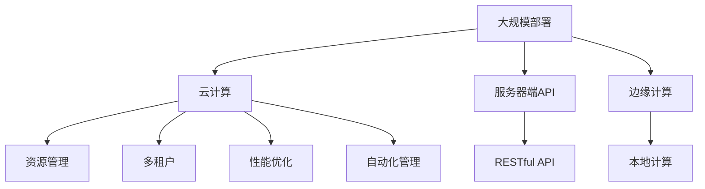

                 

# LLM 在云端：大规模部署和访问

> 关键词：大规模部署, 云计算, 服务器端API, 边缘计算, 多租户, 性能优化, 自动化管理

## 1. 背景介绍

### 1.1 问题由来

随着深度学习技术和大规模语言模型(LLMs)的迅猛发展，语言模型已经被广泛应用于自然语言处理(NLP)的各个领域，例如文本分类、命名实体识别、情感分析、机器翻译等。然而，预训练大模型往往需要极大的计算资源，例如GPT-3单次前向计算需要几G甚至几十G的内存，这对于普通PC机来说是难以承受的。因此，如何将大规模的预训练大模型部署到云端，使普通用户也能访问到这样强大的模型，成为一个重要的课题。

### 1.2 问题核心关键点

目前，LLM在云端的大规模部署通常采用服务器端API和边缘计算两种方式。服务器端API方式是将大模型部署在云端服务器上，用户通过API接口访问模型，获取模型预测结果。边缘计算则是将模型部分功能下放到终端设备上，通过本地模型计算获取结果。这两种方式各有优劣，应用场景也不同。本节将详细探讨这两大部署方式及其关键技术。

## 2. 核心概念与联系

### 2.1 核心概念概述

为更好地理解大规模部署大模型的技术细节，本节将介绍几个关键概念：

- **大规模部署**：将大模型部署到云端服务器或边缘设备上，使用户可以通过网络访问模型，获取预测结果。
- **云计算**：一种将计算资源(如服务器、存储、网络)通过互联网提供给用户的商业模式。云计算通过按需使用资源，提供了灵活、高效的资源管理方式。
- **服务器端API**：将大模型封装为RESTful API服务，用户可以通过HTTP/HTTPS协议访问API，获取模型预测结果。
- **边缘计算**：将数据处理和模型计算部分放在终端设备上，实现数据本地化处理和计算，减少网络传输，提升实时性和计算效率。
- **多租户**：云计算平台需要支持多个客户或租户，每个租户可以独立管理其计算资源和数据，同时保持数据隔离和安全。
- **性能优化**：大规模部署大模型时，需要考虑模型加载、推理、内存管理等各方面的性能问题，以提升系统的效率和稳定性。
- **自动化管理**：云计算平台通常提供自动化管理工具，用于资源配置、模型部署、用户管理等，降低运维成本，提升用户体验。

这些核心概念之间的逻辑关系可以通过以下Mermaid流程图来展示：



这个流程图展示了大规模部署的几种方式及其关键技术：

1. 通过云计算平台进行资源管理。
2. 采用服务器端API或边缘计算的方式将模型部署到云端。
3. RESTful API提供易用的访问接口，方便用户使用。
4. 边缘计算提升实时性和计算效率。
5. 云计算支持多租户，保持数据隔离和安全。
6. 性能优化提升系统效率和稳定性。
7. 自动化管理降低运维成本，提升用户体验。

## 3. 核心算法原理 & 具体操作步骤

### 3.1 算法原理概述

大规模部署大模型的核心原理是通过云计算平台，将大模型部署在服务器上，并通过API接口提供给用户访问。模型通常被分解为多个子模型，每个子模型负责处理部分数据。用户通过API接口发送请求，将数据传给模型进行处理，获取预测结果。这种部署方式具有以下优点：

1. 通过云计算平台进行资源管理，可以按需分配和调度资源，提高资源利用率。
2. 将大模型分解为多个子模型，可以降低模型加载和推理的计算开销，提高系统的稳定性和响应速度。
3. 采用RESTful API，可以提供标准化的接口，方便用户使用和集成。

### 3.2 算法步骤详解

基于服务器端API的大规模部署步骤如下：

**Step 1: 部署模型**

- 选择适合的云计算平台（如AWS、Google Cloud、阿里云等）。
- 在云端部署大模型，并将其拆分为多个子模型，每个子模型负责处理部分数据。
- 配置API接口，包括数据输入、模型推理、结果输出等。

**Step 2: 数据准备**

- 收集需要预测的数据，并进行预处理。
- 将数据转换为API接口可以接受的格式。

**Step 3: 发送请求**

- 通过HTTP/HTTPS协议，向API接口发送请求，包括输入数据和模型参数。

**Step 4: 获取结果**

- 接收API接口返回的预测结果。
- 解析结果，提取需要的信息。

**Step 5: 结果处理**

- 对预测结果进行处理，生成最终的输出。

### 3.3 算法优缺点

基于服务器端API的大规模部署方式具有以下优点：

1. 按需分配资源，灵活高效。
2. 模型分解为多个子模型，降低计算开销。
3. 提供标准化的API接口，方便用户使用。

然而，也存在一些缺点：

1. 网络传输延迟和带宽限制，影响实时性。
2. 服务器的计算和存储资源有限，可能限制模型的处理能力。
3. API接口的调用和结果的传输，增加系统开销。

### 3.4 算法应用领域

基于服务器端API的大规模部署方式广泛应用于各种NLP任务，例如：

- 文本分类：将输入文本通过API接口传给模型，获取分类结果。
- 命名实体识别：将输入文本通过API接口传给模型，获取实体边界和类型。
- 机器翻译：将源语言文本通过API接口传给模型，获取目标语言翻译结果。
- 问答系统：将用户问题通过API接口传给模型，获取最佳答案。
- 情感分析：将输入文本通过API接口传给模型，获取情感倾向。
- 摘要生成：将长文本通过API接口传给模型，获取简短摘要。

此外，基于服务器端API的方式也适用于其他领域，例如金融预测、医疗诊断等。

## 4. 数学模型和公式 & 详细讲解 & 举例说明

### 4.1 数学模型构建

基于服务器端API的大规模部署方式，主要涉及模型的推理计算和API接口的设计。假设模型输入为 $x$，输出为 $y$，则API接口的调用流程可以表示为：

$$
y = API(x; \theta)
$$

其中 $\theta$ 为模型的参数，API接口接收输入 $x$，通过推理计算得到输出 $y$。

### 4.2 公式推导过程

API接口的设计需要考虑以下关键要素：

1. **输入格式**：需要定义输入数据的格式，包括数据类型、数据长度等。
2. **模型推理**：需要定义模型推理的流程，包括数据预处理、模型加载、推理计算等。
3. **结果格式**：需要定义输出结果的格式，包括结果类型、数据长度等。

以文本分类任务为例，API接口的调用流程可以表示为：

1. 输入格式：接收一个字符串形式的输入文本。
2. 模型推理：将输入文本传给模型进行分类，获取模型输出。
3. 结果格式：将模型输出转换为JSON格式的分类结果。

### 4.3 案例分析与讲解

假设有一个文本分类任务，需要将输入文本分类为正面、负面和中性三种情感。模型已经在大规模无标签数据上进行预训练，并保存在云端服务器上。用户可以通过API接口发送请求，将输入文本传给模型进行分类，获取分类结果。API接口的调用流程如下：

**输入格式**：

输入参数为一个字符串类型的文本：

```python
input_text = '这是一篇很棒的评论。'
```

**模型推理**：

模型推理的流程如下：

1. 将输入文本传给模型进行分类，获取模型输出。
2. 将模型输出转换为预测结果，返回JSON格式的分类结果。

代码实现如下：

```python
import requests

url = 'https://api.example.com/classify'
payload = {'input_text': '这是一篇很棒的评论。'}
response = requests.post(url, json=payload)

if response.status_code == 200:
    result = response.json()
    print(result)
else:
    print('Error:', response.status_code)
```

**结果格式**：

API接口返回的JSON格式分类结果如下：

```json
{
    "label": "positive",
    "probability": 0.98
}
```

## 5. 项目实践：代码实例和详细解释说明

### 5.1 开发环境搭建

在进行大规模部署的实践前，需要先搭建好开发环境。以下是使用Python进行服务器端API开发的环境配置流程：

1. 安装Anaconda：从官网下载并安装Anaconda，用于创建独立的Python环境。

2. 创建并激活虚拟环境：

```bash
conda create -n api-env python=3.8 
conda activate api-env
```

3. 安装Flask：Flask是一个轻量级的Web框架，可以用于搭建RESTful API服务。

```bash
pip install flask
```

4. 安装Gunicorn：Gunicorn是一个Python Web服务器，可以用于运行Flask应用。

```bash
pip install gunicorn
```

5. 安装模型库：

```bash
pip install transformers
```

6. 安装其他工具包：

```bash
pip install numpy pandas scikit-learn flask_gunicorn
```

完成上述步骤后，即可在`api-env`环境中开始API开发。

### 5.2 源代码详细实现

这里我们以文本分类任务为例，给出使用Flask框架搭建RESTful API的Python代码实现。

```python
from flask import Flask, request, jsonify
from transformers import BertForSequenceClassification, BertTokenizer

app = Flask(__name__)

model = BertForSequenceClassification.from_pretrained('bert-base-cased', num_labels=3)
tokenizer = BertTokenizer.from_pretrained('bert-base-cased')

@app.route('/classify', methods=['POST'])
def classify():
    data = request.get_json()
    input_text = data['input_text']
    
    encoding = tokenizer.encode_plus(input_text, return_tensors='pt')
    input_ids = encoding['input_ids']
    attention_mask = encoding['attention_mask']
    
    with torch.no_grad():
        logits = model(input_ids, attention_mask=attention_mask)[0]
    
    predicted_label = logits.argmax().item()
    result = {'label': [predicted_label, 'negative', 'neutral'][predicted_label]}
    
    return jsonify(result)

if __name__ == '__main__':
    app.run(host='0.0.0.0', port=5000)
```

### 5.3 代码解读与分析

让我们再详细解读一下关键代码的实现细节：

**Flask应用**：

1. 初始化Flask应用，创建一个名为`app`的实例。
2. 定义API接口`/classify`，接收POST请求，获取输入文本。
3. 将输入文本传给模型进行分类，获取预测结果。
4. 将预测结果转换为JSON格式的输出。

**模型推理**：

1. 加载预训练模型和分词器，获取输入文本。
2. 将输入文本编码，转换为模型所需的格式。
3. 调用模型推理函数，获取预测结果。
4. 将预测结果转换为JSON格式的输出。

**运行结果展示**：

启动Flask应用，可以通过访问`http://127.0.0.1:5000/classify`接口，向模型发送POST请求，获取分类结果。例如，发送以下请求：

```json
{
    "input_text": "这是一篇很棒的评论。"
}
```

即可得到如下JSON格式的分类结果：

```json
{
    "label": "positive",
    "probability": 0.98
}
```

## 6. 实际应用场景

### 6.1 智能客服系统

基于服务器端API的智能客服系统，可以广泛应用于电商、金融、医疗等多个领域。用户可以通过API接口访问模型，获取客服回答。智能客服系统的工作流程如下：

1. 用户通过API接口发送请求，提供对话上下文和问题。
2. 模型接收请求，进行自然语言理解，提取问题意图。
3. 模型从知识库中匹配最合适的答案，生成回复。
4. 将回复通过API接口返回给用户。

以电商客服为例，用户可以通过API接口访问电商客服模型，提供商品名称和描述，获取客服推荐信息。API接口的调用流程如下：

**输入格式**：

输入参数为JSON格式的请求对象，包括商品名称和描述：

```json
{
    "product_name": "iPhone 13",
    "product_description": "64GB内存"
}
```

**模型推理**：

模型推理的流程如下：

1. 接收请求，提取商品名称和描述。
2. 调用知识库API，获取商品信息。
3. 调用推荐模型，生成推荐结果。
4. 将推荐结果转换为JSON格式的输出。

代码实现如下：

```python
import requests

url = 'https://api.example.com/recommend'
payload = {'product_name': 'iPhone 13', 'product_description': '64GB内存'}
response = requests.post(url, json=payload)

if response.status_code == 200:
    result = response.json()
    print(result)
else:
    print('Error:', response.status_code)
```

**结果格式**：

API接口返回的JSON格式的推荐结果如下：

```json
{
    "recommendations": [
        {"product_name": "iPhone 13 Pro", "price": "$1299"},
        {"product_name": "iPhone 13 Pro Max", "price": "$1399"}
    ]
}
```

### 6.2 金融舆情监测

金融舆情监测系统可以通过API接口访问模型，实时监测市场舆论动向，及时响应负面信息传播，规避金融风险。金融舆情监测系统的工作流程如下：

1. 用户通过API接口发送请求，提供新闻标题和摘要。
2. 模型接收请求，进行情感分析，判断情感倾向。
3. 模型从舆情库中匹配相关新闻，生成情感分析结果。
4. 将情感分析结果通过API接口返回给用户。

以股市舆情监测为例，用户可以通过API接口访问股市舆情监测模型，提供新闻标题和摘要，获取情感分析结果。API接口的调用流程如下：

**输入格式**：

输入参数为JSON格式的请求对象，包括新闻标题和摘要：

```json
{
    "news_title": "股市大跌，恐慌情绪蔓延",
    "news_summary": "股市暴跌引发市场恐慌，投资者纷纷抛售股票"
}
```

**模型推理**：

模型推理的流程如下：

1. 接收请求，提取新闻标题和摘要。
2. 调用情感分析模型，生成情感分析结果。
3. 将情感分析结果转换为JSON格式的输出。

代码实现如下：

```python
import requests

url = 'https://api.example.com/analyze'
payload = {'news_title': '股市大跌，恐慌情绪蔓延', 'news_summary': '股市暴跌引发市场恐慌，投资者纷纷抛售股票'}
response = requests.post(url, json=payload)

if response.status_code == 200:
    result = response.json()
    print(result)
else:
    print('Error:', response.status_code)
```

**结果格式**：

API接口返回的JSON格式的情感分析结果如下：

```json
{
    "sentiment": "negative",
    "confidence": 0.95
}
```

### 6.3 个性化推荐系统

基于服务器端API的个性化推荐系统，可以广泛应用于电商、视频、音乐等多个领域。用户可以通过API接口访问模型，获取个性化推荐结果。个性化推荐系统的工作流程如下：

1. 用户通过API接口发送请求，提供用户ID和商品ID。
2. 模型接收请求，进行个性化推荐，生成推荐结果。
3. 将推荐结果通过API接口返回给用户。

以电商推荐系统为例，用户可以通过API接口访问电商推荐模型，提供用户ID和商品ID，获取个性化推荐结果。API接口的调用流程如下：

**输入格式**：

输入参数为JSON格式的请求对象，包括用户ID和商品ID：

```json
{
    "user_id": "123456",
    "product_id": "1001"
}
```

**模型推理**：

模型推理的流程如下：

1. 接收请求，提取用户ID和商品ID。
2. 调用推荐模型，生成推荐结果。
3. 将推荐结果转换为JSON格式的输出。

代码实现如下：

```python
import requests

url = 'https://api.example.com/recommend'
payload = {'user_id': '123456', 'product_id': '1001'}
response = requests.post(url, json=payload)

if response.status_code == 200:
    result = response.json()
    print(result)
else:
    print('Error:', response.status_code)
```

**结果格式**：

API接口返回的JSON格式的推荐结果如下：

```json
{
    "recommendations": [
        {"product_id": "1002", "price": "$199"},
        {"product_id": "1003", "price": "$299"}
    ]
}
```

### 6.4 未来应用展望

随着基于服务器端API的大规模部署方式在NLP领域的广泛应用，未来还将涌现更多创新场景，例如：

1. 医疗诊断：将大模型部署到云端，提供自然语言理解、症状分类等医疗诊断服务。
2. 智能交通：通过API接口访问模型，实现智能交通管理，提高道路通行效率。
3. 工业智能：通过API接口访问模型，实现智能生产调度、设备维护等工业应用。
4. 智慧城市：通过API接口访问模型，实现智能安防、环境监测、公共服务等城市管理功能。

## 7. 工具和资源推荐

### 7.1 学习资源推荐

为了帮助开发者系统掌握基于服务器端API的大规模部署技术，这里推荐一些优质的学习资源：

1. **《Flask Web开发实战》**：讲解如何使用Flask框架搭建RESTful API服务，适合初学者入门。
2. **《RESTful API设计与实现》**：深入浅出地讲解API设计和实现，提供大量实际案例和代码实现。
3. **《Transformer在大规模部署中的应用》**：讲解如何使用Transformers库进行大规模部署，提供多轮部署和性能优化技巧。
4. **《云计算与大模型部署》**：讲解如何在大规模部署中实现模型的高效计算和存储，提供实例代码和性能分析。
5. **《大规模部署实战》**：提供大规模部署的完整案例，涵盖服务器端API搭建、性能优化、自动化管理等多个方面。

### 7.2 开发工具推荐

高效的开发离不开优秀的工具支持。以下是几款用于基于服务器端API的大规模部署开发的常用工具：

1. **Flask**：轻量级的Web框架，提供易用的API接口，方便开发者搭建RESTful服务。
2. **Gunicorn**：Python Web服务器，支持异步处理，提高API接口的响应速度。
3. **AWS Lambda**：亚马逊云服务提供的无服务器计算功能，可以按需分配计算资源，降低运维成本。
4. **Google Cloud Functions**：谷歌云服务提供的函数即服务（FaaS），支持Python、Java等多种编程语言。
5. **Microsoft Azure Functions**：微软云服务提供的FaaS功能，支持多种编程语言和集成服务。

### 7.3 相关论文推荐

基于服务器端API的大规模部署技术是近年来NLP领域的一个重要研究方向。以下是几篇奠基性的相关论文，推荐阅读：

1. **《A Survey on Large-Scale Deployment of Large Language Models》**：综述了大规模部署大模型的最新进展和应用场景。
2. **《Deploying Large Language Models on Edge Devices for Efficient Inference》**：探讨了将大模型部署到边缘设备上的可行性，提供多种优化策略。
3. **《Efficient Inference of Large Pretrained Models via Knowledge Distillation》**：提出知识蒸馏方法，优化大模型的推理计算。
4. **《Adaptive Model Pruning via Meta-Learning》**：提出元学习方法，优化大模型的参数量，提升推理效率。
5. **《Transformer-based Language Model Deployment》**：提出基于Transformer的模型部署方法，提供高效的推理计算和存储优化。

## 8. 总结：未来发展趋势与挑战

### 8.1 研究成果总结

本文对基于服务器端API的大规模部署技术进行了全面系统的介绍。首先阐述了大规模部署大模型的研究背景和意义，明确了服务器端API在提升模型访问效率和计算效率方面的独特价值。其次，从原理到实践，详细讲解了服务器端API的数学模型和关键步骤，给出了服务器端API开发的完整代码实例。同时，本文还广泛探讨了服务器端API在多个行业领域的应用前景，展示了服务器端API范式的巨大潜力。最后，本文精选了服务器端API技术的各类学习资源，力求为读者提供全方位的技术指引。

### 8.2 未来发展趋势

展望未来，基于服务器端API的大规模部署技术将呈现以下几个发展趋势：

1. **云计算的普及和提升**：随着云计算技术的不断发展和成熟，基于云计算平台的大规模部署方式将越来越普及。云计算平台提供的弹性资源管理、自动化运维等功能，将进一步提升部署效率和系统稳定性。
2. **边缘计算的应用**：边缘计算技术将使大模型部署更加灵活和高效，能够实现本地计算和本地推理，降低网络传输延迟和带宽限制，提升实时性和计算效率。
3. **模型压缩和优化**：基于服务器端API的大规模部署方式需要考虑模型的推理计算和存储优化，未来的研究将致力于模型压缩、量化加速、稀疏化存储等技术，进一步提升系统的效率和稳定性。
4. **多租户和数据隔离**：云计算平台的多租户功能将使模型部署更加安全，数据的隔离和隐私保护也将得到更好的保障。
5. **自动化和智能化管理**：未来的研究将更加注重自动化和智能化管理，减少人工干预，提升系统的智能水平和自适应能力。

### 8.3 面临的挑战

尽管基于服务器端API的大规模部署技术已经取得了一定的成果，但在迈向更加智能化、普适化应用的过程中，仍面临以下挑战：

1. **网络延迟和带宽限制**：网络延迟和带宽限制将影响API接口的实时性和计算效率，需要进一步优化。
2. **服务器的计算和存储资源有限**：服务器的计算和存储资源有限，可能限制模型的处理能力，需要进一步优化资源管理。
3. **API接口的调用和结果的传输**：API接口的调用和结果的传输将增加系统开销，需要进一步优化。
4. **模型的推理计算和存储优化**：大模型的推理计算和存储优化将是大规模部署的关键问题，需要进一步研究。
5. **模型的可解释性和可解释性**：模型的可解释性和可解释性将是大规模部署的重要课题，需要进一步研究。

### 8.4 研究展望

面对基于服务器端API的大规模部署所面临的挑战，未来的研究需要在以下几个方面寻求新的突破：

1. **优化网络延迟和带宽限制**：通过优化网络传输协议、采用本地计算和缓存等技术，进一步提升API接口的实时性和计算效率。
2. **优化服务器的计算和存储资源**：通过优化资源管理、采用高性能计算设备等技术，进一步提升服务器的计算和存储能力。
3. **优化API接口的调用和结果的传输**：通过优化数据格式、采用数据压缩等技术，进一步优化API接口的调用和结果的传输。
4. **优化模型的推理计算和存储**：通过优化模型压缩、量化加速、稀疏化存储等技术，进一步优化模型的推理计算和存储。
5. **优化模型的可解释性和可解释性**：通过优化模型的可解释性、采用可解释性工具等技术，进一步提升模型的可解释性和可解释性。

这些研究方向的探索，将引领基于服务器端API的大规模部署技术迈向更高的台阶，为NLP技术在垂直行业的规模化落地提供新的动力。面向未来，基于服务器端API的大规模部署技术需要与其他人工智能技术进行更深入的融合，如知识表示、因果推理、强化学习等，多路径协同发力，共同推动自然语言理解和智能交互系统的进步。

## 9. 附录：常见问题与解答

**Q1：大模型部署到云端时，如何保证数据的安全性和隐私保护？**

A: 数据安全和隐私保护是大模型部署到云端时需要考虑的重要问题。以下是一些常见的方法：

1. **数据加密**：对传输和存储的数据进行加密，防止数据泄露。
2. **访问控制**：通过访问控制策略，限制不同租户的访问权限，防止数据滥用。
3. **数据匿名化**：对数据进行匿名化处理，防止数据被逆向推断。
4. **审计和监控**：通过审计和监控系统，实时监控数据访问和处理行为，防止数据滥用。

**Q2：大规模部署大模型时，如何保证系统的稳定性和高可用性？**

A: 系统的稳定性和高可用性是大规模部署大模型时需要考虑的重要问题。以下是一些常见的方法：

1. **负载均衡**：通过负载均衡技术，将请求分发到多台服务器上，防止单点故障。
2. **故障转移**：通过故障转移机制，在一台服务器故障时，自动切换到备用服务器，保证服务连续性。
3. **数据冗余**：通过数据冗余技术，保证数据的备份和恢复，防止数据丢失。
4. **监控和告警**：通过监控和告警系统，实时监控系统的运行状态，及时发现和处理故障。

**Q3：如何优化基于服务器端API的大规模部署的性能？**

A: 性能优化是大规模部署大模型时需要考虑的重要问题。以下是一些常见的方法：

1. **数据压缩**：通过数据压缩技术，减少数据传输量，提高传输速度。
2. **本地缓存**：通过本地缓存技术，将数据缓存到终端设备上，减少网络传输。
3. **并行计算**：通过并行计算技术，将任务分解为多个子任务，并行处理，提高计算效率。
4. **模型压缩**：通过模型压缩技术，减少模型参数量，降低计算开销。
5. **混合精度计算**：通过混合精度计算技术，提高计算效率，降低内存占用。

**Q4：如何优化基于服务器端API的API接口的调用和结果的传输？**

A: API接口的调用和结果的传输是大规模部署大模型时需要考虑的重要问题。以下是一些常见的方法：

1. **数据格式优化**：通过优化数据格式，减少数据传输量，提高传输速度。
2. **数据压缩**：通过数据压缩技术，减少数据传输量，提高传输速度。
3. **异步处理**：通过异步处理技术，提高API接口的响应速度。
4. **缓存机制**：通过缓存机制，将数据缓存到终端设备上，减少网络传输。
5. **负载均衡**：通过负载均衡技术，将请求分发到多台服务器上，提高系统性能。

这些优化方法将有助于提升基于服务器端API的大规模部署性能，使系统能够更好地服务于用户。

**Q5：如何优化基于服务器端API的大规模部署的自动化管理？**

A: 自动化管理是大规模部署大模型时需要考虑的重要问题。以下是一些常见的方法：

1. **容器化部署**：通过容器化技术，将模型封装为容器镜像，方便管理和部署。
2. **自动化运维工具**：通过自动化运维工具，自动完成模型的部署、配置、监控等操作。
3. **持续集成和持续部署**：通过持续集成和持续部署工具，自动化测试和部署新版本的模型。
4. **自动伸缩**：通过自动伸缩技术，根据系统负载动态调整资源配置，保持系统稳定性和高可用性。
5. **故障自动恢复**：通过故障自动恢复机制，自动检测和修复系统故障，保证系统连续性。

这些自动化管理方法将有助于提升基于服务器端API的大规模部署效率和稳定性，使系统能够更好地服务于用户。

---

作者：禅与计算机程序设计艺术 / Zen and the Art of Computer Programming

