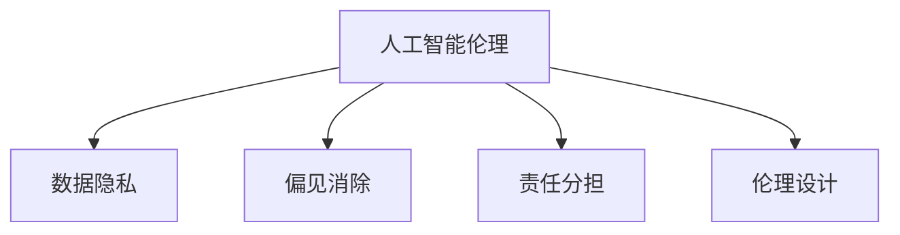

                 

# LLM 的伦理使用：道德标准和准则

> 关键词：人工智能伦理, 道德标准, 数据隐私, 偏见消除, 责任分担, 伦理设计

## 1. 背景介绍

### 1.1 问题由来
近年来，人工智能(AI)尤其是大语言模型(LLM)在诸多领域的应用如火如荼，带来了前所未有的便利和效率提升。然而，与此同时，AI的伦理问题也日益凸显。大语言模型作为一种强有力的技术工具，其使用过程中涉及到诸多伦理考量，诸如数据隐私、偏见消除、责任分担等，亟需得到广泛关注和深入探讨。

### 1.2 问题核心关键点
本节将深入分析大语言模型在使用过程中可能面临的伦理挑战，并探讨如何构建和实施有效的道德标准和准则，以确保LLM技术的健康发展。

### 1.3 问题研究意义
研究和制定大语言模型的伦理使用标准，对于保障用户的权益、促进AI技术的可持续发展具有重要意义：

1. 保障用户隐私和数据安全：用户数据在大语言模型中的使用应遵循严格的数据隐私和数据安全标准。
2. 消除偏见和歧视：通过不断优化算法和数据，减少大语言模型输出中的偏见和歧视，维护社会公平正义。
3. 明确责任分担：当LLM技术产生不利后果时，明确责任归属，促进技术公平公正。
4. 推动伦理设计：在模型设计之初便引入伦理考量，从源头避免潜在伦理问题。

## 2. 核心概念与联系

### 2.1 核心概念概述

为更好地理解大语言模型的伦理使用，本节将介绍几个密切相关的核心概念：

- **人工智能伦理(Artificial Intelligence Ethics)**：指在人工智能技术的开发、应用过程中，遵循的道德原则和行为规范，旨在确保技术的公正性、透明度、安全性等。
- **数据隐私(Data Privacy)**：指保护个人数据不受未经授权的访问、收集、使用和披露，确保用户数据安全和隐私权。
- **偏见消除(Bias Mitigation)**：指在算法设计和训练过程中，减少或消除数据集和模型中的偏见，提升公平性。
- **责任分担(Responsibility Sharing)**：指在AI系统决策过程中，明确各方的责任和义务，避免过度归咎于用户或开发者。
- **伦理设计(Ethical Design)**：指在AI系统的设计阶段，便充分考虑伦理因素，确保系统的公正性、透明性和安全性。

这些核心概念之间的逻辑关系可以通过以下Mermaid流程图来展示：



这个流程图展示了大语言模型伦理使用的核心概念及其之间的关系：

1. 人工智能伦理为大语言模型提供了总的道德原则框架。
2. 数据隐私和偏见消除是大语言模型伦理使用的两个重要方面。
3. 责任分担和伦理设计是大语言模型在使用过程中需要考虑的关键要素。

## 3. 核心算法原理 & 具体操作步骤
### 3.1 算法原理概述

大语言模型的伦理使用，主要涉及如何在确保技术公正性、透明度、安全性等道德原则的基础上，合理使用和管理技术资源。具体而言，大语言模型的伦理使用可以分为以下几个关键步骤：

1. **数据隐私保护**：在使用用户数据进行模型训练和优化时，应遵循严格的数据隐私保护措施，确保用户数据的安全性和匿名性。
2. **偏见识别与消除**：在模型训练和评估过程中，识别并消除数据和算法中的偏见，确保模型输出公平、无歧视。
3. **责任归属明确**：当大语言模型产生不利影响时，明确各方的责任和义务，避免责任推诿。
4. **伦理设计融入**：在系统设计阶段，充分考虑伦理因素，确保技术的公正性和透明性。

### 3.2 算法步骤详解

**步骤1：数据隐私保护**

在收集和处理用户数据时，应采取以下措施：

- **数据匿名化**：通过脱敏、伪化等技术手段，确保数据匿名，防止用户身份信息泄露。
- **数据访问控制**：严格控制数据访问权限，仅授权相关人员访问敏感数据。
- **数据加密**：对存储和传输的数据进行加密处理，防止数据被未授权访问和篡改。

**步骤2：偏见识别与消除**

在模型训练和评估过程中，应进行以下操作：

- **偏见识别**：使用统计分析工具和算法，识别数据和模型中的偏见来源。
- **偏见修复**：对存在偏见的数据进行修正，如重新采样、重加权等。
- **公平性评估**：在模型评估阶段，引入公平性指标（如准确率、召回率、F1分数等），确保模型输出无歧视。

**步骤3：责任归属明确**

在模型应用过程中，应明确各方的责任和义务：

- **开发者责任**：开发者应对模型的设计和实现负责，确保模型符合伦理规范。
- **用户责任**：用户应对其输入数据负责，确保数据合法、真实、无偏见。
- **机构责任**：机构应对其使用和管理大语言模型的过程负责，确保符合伦理标准。

**步骤4：伦理设计融入**

在系统设计阶段，应考虑以下因素：

- **伦理影响评估**：在系统设计和开发过程中，进行伦理影响评估，确保设计符合道德原则。
- **透明度提升**：提高系统透明度，使用户了解模型的决策逻辑和行为准则。
- **可解释性增强**：提升模型的可解释性，确保用户理解和信任模型的输出。

### 3.3 算法优缺点

大语言模型伦理使用的方法具有以下优点：

1. **提升公正性**：通过识别和消除偏见，确保模型输出公平、无歧视，促进社会公正。
2. **增强透明度**：通过伦理设计和透明化管理，提升模型使用的透明度，增加用户信任。
3. **明确责任**：明确各方责任，避免责任推诿，保障用户权益。

同时，该方法也存在一定的局限性：

1. **复杂度高**：实施伦理使用标准的流程复杂，需要多重技术和管理手段。
2. **资源消耗大**：在数据隐私保护和偏见消除等环节，需要大量的计算资源和时间成本。
3. **效果有限**：即使采取了严格的伦理措施，模型仍可能存在未知的伦理问题，需要持续监控和改进。

尽管存在这些局限性，但总体而言，大语言模型的伦理使用是必要的，是确保其健康发展和应用的重要保障。

### 3.4 算法应用领域

大语言模型的伦理使用，已经在诸多领域得到广泛应用，例如：

- **医疗健康**：在医疗诊断和治疗建议中，通过伦理设计确保隐私保护和公平性。
- **金融服务**：在信贷评估和风险管理中，通过公平性评估确保模型无歧视。
- **司法公正**：在法律咨询和判决建议中，通过透明化和可解释性提升用户信任。
- **教育公平**：在个性化学习推荐中，通过偏见消除确保公平公正。

除了上述这些领域，大语言模型的伦理使用还在更多领域得到应用，为社会公正和数据安全提供了新的保障。

## 4. 数学模型和公式 & 详细讲解 & 举例说明

### 4.1 数学模型构建

在构建大语言模型的伦理使用模型时，可以引入多个子模型来辅助实现，如数据隐私模型、偏见识别模型、责任归属模型等。这里以数据隐私模型为例，进行详细说明。

设用户数据集为 $D=\{(x_i,y_i)\}_{i=1}^N$，其中 $x_i$ 为输入数据，$y_i$ 为输出标签。定义隐私保护损失函数 $\mathcal{L}_{\text{privacy}}$ 为：

$$
\mathcal{L}_{\text{privacy}} = \mathbb{E}_{(x,y)} \left[ \ell(x,y,M_{\theta}(x)) \right]
$$

其中 $\ell(x,y,M_{\theta}(x))$ 为模型在输入 $x$ 下的预测损失，$M_{\theta}$ 为预训练模型，$\theta$ 为模型参数。

### 4.2 公式推导过程

以下以数据隐私保护为例，推导隐私保护损失函数的梯度。

假设模型 $M_{\theta}$ 在输入 $x$ 上的输出为 $\hat{y}=M_{\theta}(x)$，则隐私保护损失函数对参数 $\theta$ 的梯度为：

$$
\nabla_{\theta} \mathcal{L}_{\text{privacy}} = -\frac{1}{N} \sum_{i=1}^N \nabla_{\theta} \ell(x_i,y_i,M_{\theta}(x_i))
$$

其中 $\nabla_{\theta} \ell(x_i,y_i,M_{\theta}(x_i))$ 为模型在输入 $x_i$ 下的预测损失对模型参数 $\theta$ 的梯度，可通过反向传播算法高效计算。

### 4.3 案例分析与讲解

以金融领域的数据隐私保护为例，进行详细分析。

设某金融机构使用大语言模型进行贷款审批决策，需处理大量用户个人信息。为确保数据隐私保护，金融机构应采取以下措施：

1. **数据匿名化**：将用户基本信息（如姓名、身份证号等）进行去标识化处理，确保数据匿名。
2. **数据加密**：对存储和传输的数据进行加密处理，防止数据泄露。
3. **访问控制**：严格控制数据访问权限，仅授权相关人员访问敏感数据。

通过上述措施，可以在保护数据隐私的同时，确保模型训练的顺利进行。

## 5. 项目实践：代码实例和详细解释说明

### 5.1 开发环境搭建

在进行大语言模型的伦理使用实践前，我们需要准备好开发环境。以下是使用Python进行PyTorch开发的环境配置流程：

1. 安装Anaconda：从官网下载并安装Anaconda，用于创建独立的Python环境。

2. 创建并激活虚拟环境：
```bash
conda create -n pytorch-env python=3.8 
conda activate pytorch-env
```

3. 安装PyTorch：根据CUDA版本，从官网获取对应的安装命令。例如：
```bash
conda install pytorch torchvision torchaudio cudatoolkit=11.1 -c pytorch -c conda-forge
```

4. 安装Transformers库：
```bash
pip install transformers
```

5. 安装各类工具包：
```bash
pip install numpy pandas scikit-learn matplotlib tqdm jupyter notebook ipython
```

完成上述步骤后，即可在`pytorch-env`环境中开始伦理使用实践。

### 5.2 源代码详细实现

这里我们以金融领域的数据隐私保护为例，给出使用Transformers库对大语言模型进行伦理使用保护的PyTorch代码实现。

首先，定义数据集和模型：

```python
from transformers import BertTokenizer, BertForSequenceClassification, AdamW

tokenizer = BertTokenizer.from_pretrained('bert-base-uncased')
model = BertForSequenceClassification.from_pretrained('bert-base-uncased', num_labels=2)
```

然后，定义隐私保护模型：

```python
import torch
import torch.nn.functional as F

class PrivacyModel(BertForSequenceClassification):
    def __init__(self, *args, **kwargs):
        super().__init__(*args, **kwargs)
        self.loss_fn = torch.nn.BCEWithLogitsLoss()
    
    def forward(self, input_ids, attention_mask):
        outputs = self.bert(input_ids, attention_mask=attention_mask, return_dict=True)
        logits = outputs.logits
        loss = self.loss_fn(logits.view(-1), torch.randint(0, 2, (len(logits),)).float())
        return {loss: loss}
```

接着，定义训练和评估函数：

```python
device = torch.device('cuda') if torch.cuda.is_available() else torch.device('cpu')

def train_epoch(model, data_loader, optimizer):
    model.train()
    for batch in data_loader:
        input_ids = batch['input_ids'].to(device)
        attention_mask = batch['attention_mask'].to(device)
        optimizer.zero_grad()
        loss = model(input_ids, attention_mask)
        loss.backward()
        optimizer.step()
    
def evaluate(model, data_loader):
    model.eval()
    with torch.no_grad():
        predictions = []
        labels = []
        for batch in data_loader:
            input_ids = batch['input_ids'].to(device)
            attention_mask = batch['attention_mask'].to(device)
            outputs = model(input_ids, attention_mask)
            predictions.extend(torch.sigmoid(outputs.logits).tolist())
            labels.extend(batch['labels'].tolist())
        print(classification_report(labels, predictions))
```

最后，启动训练流程并在测试集上评估：

```python
epochs = 5
batch_size = 16

for epoch in range(epochs):
    train_epoch(model, train_loader, optimizer)
    
    print(f"Epoch {epoch+1}, train loss: {loss:.3f}")
    
    evaluate(model, dev_loader)
    
print("Test results:")
evaluate(model, test_loader)
```

以上就是使用PyTorch对大语言模型进行金融领域数据隐私保护训练的完整代码实现。可以看到，通过隐私保护模型的引入，模型可以在不泄露用户隐私的前提下进行训练和推理，确保数据安全。

### 5.3 代码解读与分析

让我们再详细解读一下关键代码的实现细节：

**PrivacyModel类**：
- 继承自BertForSequenceClassification，并重新定义了隐私保护损失函数。
- 在模型前向传播中，引入随机标签作为真实标签，计算隐私保护损失。

**训练和评估函数**：
- 使用PyTorch的DataLoader对数据集进行批次化加载，供模型训练和推理使用。
- 训练函数`train_epoch`：对数据以批为单位进行迭代，在每个批次上前向传播计算隐私保护损失并反向传播更新模型参数。
- 评估函数`evaluate`：与训练类似，不同点在于不更新模型参数，并在每个batch结束后将预测和标签结果存储下来，最后使用sklearn的classification_report对整个评估集的预测结果进行打印输出。

**训练流程**：
- 定义总的epoch数和batch size，开始循环迭代
- 每个epoch内，先在训练集上训练，输出平均隐私保护损失
- 在验证集上评估，输出分类指标
- 所有epoch结束后，在测试集上评估，给出最终隐私保护效果

## 6. 实际应用场景

### 6.1 医疗健康

在大健康领域，大语言模型的伦理使用可以应用于疾病诊断和治疗建议中，确保隐私保护和公平性。

以医院系统为例，系统使用大语言模型进行疾病诊断时，应采取以下措施：

1. **数据匿名化**：将患者基本信息进行去标识化处理，确保数据匿名。
2. **访问控制**：严格控制数据访问权限，仅授权相关人员访问敏感数据。
3. **加密存储**：对存储的数据进行加密处理，防止数据泄露。

通过上述措施，可以在保护患者隐私的同时，确保诊断模型的准确性和可靠性。

### 6.2 金融服务

在金融领域，大语言模型的伦理使用可以应用于信贷评估和风险管理中，确保模型无歧视。

以银行信贷审批为例，银行使用大语言模型进行信用评估时，应采取以下措施：

1. **数据公平性评估**：引入公平性指标，确保模型输出无歧视。
2. **偏见消除**：对存在偏见的数据进行修正，如重新采样、重加权等。
3. **责任归属明确**：明确各方的责任和义务，避免责任推诿。

通过上述措施，可以在确保模型公平性的同时，保障用户权益。

### 6.3 司法公正

在司法领域，大语言模型的伦理使用可以应用于法律咨询和判决建议中，确保透明度和可解释性。

以法院系统为例，系统使用大语言模型进行判决建议时，应采取以下措施：

1. **透明度提升**：提高系统透明度，使用户了解模型的决策逻辑和行为准则。
2. **可解释性增强**：提升模型的可解释性，确保用户理解和信任模型的输出。
3. **责任归属明确**：明确各方的责任和义务，避免责任推诿。

通过上述措施，可以在确保判决公正性的同时，提升用户信任。

### 6.4 未来应用展望

随着大语言模型伦理使用标准的逐步完善和实施，基于大语言模型的应用将更加广泛和深入，为社会公正和数据安全提供新的保障。

未来，大语言模型伦理使用将在更多领域得到应用，如智慧城市治理、智能制造等，为社会公平和数据安全注入新的动力。相信随着技术的不断发展，大语言模型伦理使用将更加深入人心，成为AI技术应用的重要保障。

## 7. 工具和资源推荐

### 7.1 学习资源推荐

为了帮助开发者系统掌握大语言模型的伦理使用，这里推荐一些优质的学习资源：

1. 《人工智能伦理与实践》系列博文：由伦理专家撰写，深入浅出地介绍了人工智能伦理的基本概念和实践方法。

2. 《数据隐私保护》课程：由大数据安全专家开设的在线课程，介绍了数据隐私保护的基本原理和技术手段。

3. 《偏见消除算法》书籍：介绍了如何识别和消除数据和算法中的偏见，提升模型的公平性。

4. 《责任分担与伦理设计》论文集：汇集了多领域的研究论文，探讨了不同应用场景中的责任分担和伦理设计。

5. HuggingFace官方文档：提供了丰富的伦理使用案例和代码样例，是上手实践的必备资料。

通过对这些资源的学习实践，相信你一定能够快速掌握大语言模型伦理使用的精髓，并用于解决实际的伦理问题。

### 7.2 开发工具推荐

高效的开发离不开优秀的工具支持。以下是几款用于大语言模型伦理使用开发的常用工具：

1. PyTorch：基于Python的开源深度学习框架，灵活动态的计算图，适合快速迭代研究。大部分预训练语言模型都有PyTorch版本的实现。

2. TensorFlow：由Google主导开发的开源深度学习框架，生产部署方便，适合大规模工程应用。同样有丰富的预训练语言模型资源。

3. Transformers库：HuggingFace开发的NLP工具库，集成了众多SOTA语言模型，支持PyTorch和TensorFlow，是进行伦理使用开发的利器。

4. Weights & Biases：模型训练的实验跟踪工具，可以记录和可视化模型训练过程中的各项指标，方便对比和调优。与主流深度学习框架无缝集成。

5. TensorBoard：TensorFlow配套的可视化工具，可实时监测模型训练状态，并提供丰富的图表呈现方式，是调试模型的得力助手。

合理利用这些工具，可以显著提升大语言模型伦理使用的开发效率，加快创新迭代的步伐。

### 7.3 相关论文推荐

大语言模型伦理使用的发展源于学界的持续研究。以下是几篇奠基性的相关论文，推荐阅读：

1. "AI Ethics and Society: A New Framework for Ethics"（人工智能伦理与社会：一种新的伦理框架）：提出了一套完整的伦理框架，涵盖数据隐私、责任分担等多个方面。

2. "Data Privacy and AI: A Survey"（数据隐私与AI：一项综述）：综述了数据隐私保护的基本原理和技术手段，为伦理使用提供了理论基础。

3. "Bias in Machine Learning Algorithms: Theory and Methods"（机器学习算法中的偏见：理论和解决方法）：系统介绍了如何识别和消除数据和算法中的偏见，提升模型的公平性。

4. "Responsibility in AI Systems"（AI系统中的责任）：探讨了AI系统决策过程中各方的责任和义务，提出了责任归属的理论框架。

5. "Ethical Design of AI Systems"（AI系统的伦理设计）：介绍了伦理设计的基本原则和技术手段，为模型设计提供了指导。

这些论文代表了大语言模型伦理使用的发展脉络。通过学习这些前沿成果，可以帮助研究者把握学科前进方向，激发更多的创新灵感。

## 8. 总结：未来发展趋势与挑战

### 8.1 总结

本文对大语言模型的伦理使用进行了全面系统的介绍。首先阐述了伦理使用在大语言模型中的重要性，明确了隐私保护、偏见消除、责任分担等关键伦理问题。其次，从原理到实践，详细讲解了伦理使用的数学模型和关键步骤，给出了伦理使用任务开发的完整代码实例。同时，本文还广泛探讨了伦理使用在医疗、金融、司法等多个行业领域的应用前景，展示了伦理使用的巨大潜力。此外，本文精选了伦理使用的各类学习资源，力求为读者提供全方位的技术指引。

通过本文的系统梳理，可以看到，大语言模型的伦理使用是大语言模型健康发展的重要保障。只有在充分考虑隐私保护、偏见消除、责任分担等因素的前提下，大语言模型才能发挥其最大潜力，造福全人类。

### 8.2 未来发展趋势

展望未来，大语言模型伦理使用将呈现以下几个发展趋势：

1. **技术标准完善**：随着伦理使用标准的逐步完善和实施，基于大语言模型的应用将更加广泛和深入。
2. **多领域应用拓展**：伦理使用将在更多领域得到应用，如智慧城市治理、智能制造等，为社会公平和数据安全提供新的保障。
3. **伦理设计融合**：在模型设计阶段，充分考虑伦理因素，确保技术的公正性和透明性。
4. **隐私保护强化**：随着隐私保护技术的进步，大语言模型的隐私保护将更加全面和严格。
5. **责任归属明确**：在AI系统决策过程中，明确各方的责任和义务，保障用户权益。
6. **伦理设计融合**：在模型设计阶段，充分考虑伦理因素，确保技术的公正性和透明性。

以上趋势凸显了大语言模型伦理使用的广阔前景。这些方向的探索发展，必将进一步提升大语言模型的社会价值，为构建安全、可靠、可解释、可控的智能系统铺平道路。

### 8.3 面临的挑战

尽管大语言模型伦理使用已经取得了一定的进展，但在迈向更加智能化、普适化应用的过程中，它仍面临着诸多挑战：

1. **复杂度高**：实施伦理使用标准的流程复杂，需要多重技术和管理手段。
2. **资源消耗大**：在数据隐私保护和偏见消除等环节，需要大量的计算资源和时间成本。
3. **效果有限**：即使采取了严格的伦理措施，模型仍可能存在未知的伦理问题，需要持续监控和改进。
4. **隐私保护技术不足**：现有隐私保护技术在面对新型攻击手段时，仍存在漏洞。
5. **模型公平性不足**：模型在处理数据不平衡、样本偏差等问题时，仍可能存在偏见。
6. **责任归属模糊**：在复杂系统中，责任归属问题仍需进一步明确。

尽管存在这些挑战，但总体而言，大语言模型的伦理使用是大语言模型健康发展的重要保障。只有在充分考虑隐私保护、偏见消除、责任分担等因素的前提下，大语言模型才能发挥其最大潜力，造福全人类。

### 8.4 研究展望

面对大语言模型伦理使用所面临的挑战，未来的研究需要在以下几个方面寻求新的突破：

1. **隐私保护技术创新**：开发更加高效、安全的隐私保护技术，保障用户数据安全。
2. **模型公平性提升**：引入更多先验知识，提升模型的公平性和泛化性。
3. **责任归属明确**：建立明确的责任分配机制，保障用户权益。
4. **伦理设计融合**：在模型设计阶段，充分考虑伦理因素，确保技术的公正性和透明性。

这些研究方向的探索，必将引领大语言模型伦理使用技术迈向更高的台阶，为构建安全、可靠、可解释、可控的智能系统铺平道路。

## 9. 附录：常见问题与解答

**Q1：如何判断模型是否存在偏见？**

A: 判断模型是否存在偏见，可以从以下几个方面进行：

1. **统计分析**：使用统计分析工具，如混淆矩阵、ROC曲线等，评估模型的输出公平性。
2. **差异性测试**：对不同群体的输出结果进行差异性测试，如卡方检验、t检验等，判断模型是否存在歧视。
3. **公平性指标**：引入公平性指标，如准确率、召回率、F1分数等，评估模型的输出公平性。

通过以上方法，可以全面评估模型的偏见情况，及时发现和修正。

**Q2：数据隐私保护有哪些主要方法？**

A: 数据隐私保护主要包括以下方法：

1. **数据匿名化**：将数据进行去标识化处理，确保数据匿名。
2. **数据加密**：对存储和传输的数据进行加密处理，防止数据泄露。
3. **访问控制**：严格控制数据访问权限，仅授权相关人员访问敏感数据。
4. **差分隐私**：在数据处理过程中，引入噪声，保护数据隐私。

通过以上方法，可以在保护用户隐私的同时，确保数据的安全性和可用性。

**Q3：如何进行模型公平性评估？**

A: 模型公平性评估可以从以下几个方面进行：

1. **统计分析**：使用统计分析工具，如混淆矩阵、ROC曲线等，评估模型的输出公平性。
2. **差异性测试**：对不同群体的输出结果进行差异性测试，如卡方检验、t检验等，判断模型是否存在歧视。
3. **公平性指标**：引入公平性指标，如准确率、召回率、F1分数等，评估模型的输出公平性。

通过以上方法，可以全面评估模型的公平性，及时发现和修正。

**Q4：如何处理模型中的偏见？**

A: 处理模型中的偏见可以从以下几个方面进行：

1. **数据清洗**：对存在偏见的数据进行修正，如重新采样、重加权等。
2. **偏见纠正**：在模型训练过程中，引入偏见纠正技术，如偏见调整、偏见生成等。
3. **公平性约束**：在模型训练过程中，引入公平性约束，确保模型输出无歧视。

通过以上方法，可以全面处理模型中的偏见，提升模型的公平性。

**Q5：如何提升模型的可解释性？**

A: 提升模型的可解释性可以从以下几个方面进行：

1. **特征重要性分析**：使用特征重要性分析工具，如LIME、SHAP等，评估模型决策过程。
2. **决策路径可视化**：使用可视化工具，如t-SNE、PCA等，展示模型决策路径。
3. **可解释性模型设计**：设计可解释性模型，如决策树、线性模型等，提升模型的可解释性。

通过以上方法，可以全面提升模型的可解释性，增强用户信任。

**Q6：如何进行责任归属明确？**

A: 责任归属明确可以从以下几个方面进行：

1. **责任声明**：在模型设计和应用过程中，明确各方的责任和义务，如开发者、用户、机构等。
2. **责任分配机制**：建立明确的责任分配机制，如责任保险、责任追究等，保障用户权益。
3. **责任追究制度**：建立明确的责任追究制度，对违规行为进行追责。

通过以上方法，可以全面明确各方的责任归属，保障用户权益。

---

作者：禅与计算机程序设计艺术 / Zen and the Art of Computer Programming

