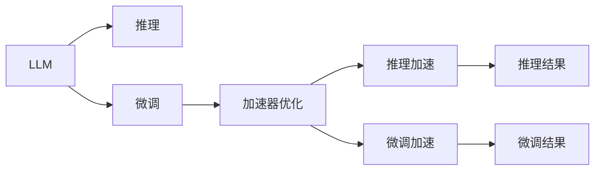

                 

# LLM 硬件：专门设计的加速器

## 1. 背景介绍

### 1.1 问题由来
近年来，大型语言模型（LLM）在自然语言处理（NLP）领域取得了令人瞩目的进步。这些模型，如OpenAI的GPT-3、Google的BERT等，基于大规模无标签数据进行自监督预训练，并通过微调在特定任务上获得优异的性能。然而，由于计算密集型的模型结构和庞大的参数规模，LLM在推理和微调过程中需要消耗巨大的计算资源，这使得LLM在实际应用中面临着显著的硬件瓶颈。

### 1.2 问题核心关键点
LLM的计算需求主要包括两个方面：一是推理过程中的大量矩阵运算，二是微调过程中的反向传播和梯度更新。针对这两个关键点，专门设计的硬件加速器能够显著提升LLM的计算效率，降低能耗，提升推理速度，使得LLM在实际应用中更具竞争力。

## 2. 核心概念与联系

### 2.1 核心概念概述

为更好地理解LLM硬件加速器，我们首先定义并解释几个核心概念：

- **大型语言模型（LLM）**：基于Transformer等架构，通过自监督预训练学习语言表示的大规模模型。例如，GPT系列、BERT等模型。
- **推理**：给定输入文本，模型通过前向传播计算出对应的输出结果。
- **微调**：利用少量有标签数据，通过反向传播优化模型参数，适应特定任务。
- **加速器**：专门设计用于加速特定计算密集型任务的专用硬件，如GPU、TPU等。
- **自动微分化（Auto-Diff）**：通过符号计算，自动计算函数的导数，加速梯度计算。

### 2.2 核心概念原理和架构的 Mermaid 流程图



该流程图展示了LLM在推理和微调过程中的关键步骤及其与加速器优化和推理/微调加速的联系。

## 3. 核心算法原理 & 具体操作步骤

### 3.1 算法原理概述

LLM硬件加速器的设计原理主要基于以下几个方面：

- **数据并行（Data Parallelism）**：通过将模型并行分布在多个GPU或TPU上，每个加速器独立处理部分输入数据，并行计算加速推理过程。
- **模型并行（Model Parallelism）**：将模型的不同层次并行分布在不同的加速器上，每个加速器独立处理模型的部分层，提高计算效率。
- **流水线并行（Pipeline Parallelism）**：将模型的不同部分（如编码器、解码器）设计成可并行处理的数据流，减少等待时间，提升推理速度。

### 3.2 算法步骤详解

#### 3.2.1 数据并行优化

1. **数据拆分**：将输入数据按照一定规则（如批次大小）拆分成多个小批次，分别交给不同的加速器处理。
2. **参数同步**：在每个加速器处理完自己的小批次后，将模型参数同步到主处理器，以确保不同加速器之间的参数一致性。
3. **聚合结果**：将所有加速器处理的结果进行聚合，生成最终的输出。

#### 3.2.2 模型并行优化

1. **层次划分**：将模型按照层次划分，不同的层次分布在不同的加速器上。
2. **参数分布**：将模型的参数分布在不同的加速器上，每个加速器只负责自己部分参数的计算和更新。
3. **全局梯度计算**：在每个加速器计算完本地梯度后，使用AllReduce等技术将所有加速器的梯度合并，更新全局模型参数。

#### 3.2.3 流水线并行优化

1. **数据流设计**：将模型的不同部分设计成独立的数据流，每个数据流可以在不同的加速器上并行处理。
2. **同步机制**：通过队列、锁等机制，确保不同数据流之间同步，避免数据竞争。
3. **输出融合**：将不同数据流处理的结果进行融合，生成最终的输出。

### 3.3 算法优缺点

#### 3.3.1 数据并行优缺点

**优点**：
- 易于实现和部署，支持多种并行加速器。
- 提升计算效率，加速推理过程。

**缺点**：
- 需要额外的通信开销，影响计算效率。
- 同步机制复杂，可能导致瓶颈。

#### 3.3.2 模型并行优缺点

**优点**：
- 显著提升计算效率，适合处理大规模模型。
- 避免全模型复制，节省内存。

**缺点**：
- 实现复杂，需要跨加速器通信。
- 需要同步机制，可能引入瓶颈。

#### 3.3.3 流水线并行优缺点

**优点**：
- 减少等待时间，提高计算效率。
- 支持动态任务调度，灵活性高。

**缺点**：
- 实现复杂，需要精确同步。
- 需要额外的控制逻辑。

### 3.4 算法应用领域

LLM硬件加速器的应用领域广泛，包括但不限于：

- **自然语言处理（NLP）**：加速推理和微调过程，提升对话系统、翻译系统、情感分析等应用的性能。
- **机器学习（ML）**：加速深度学习模型的训练和推理，提高模型计算效率。
- **科学计算**：加速复杂的科学计算任务，如分子模拟、金融建模等。
- **多媒体处理**：加速视频编码、图像处理等任务，提升实时处理能力。

## 4. 数学模型和公式 & 详细讲解 & 举例说明

### 4.1 数学模型构建

假设LLM模型为$f(x)$，其中$x$为输入文本，$y$为输出结果。模型在单个加速器上的推理计算可以表示为：

$$
y = f(x)
$$

在多个加速器上，数据并行优化可以表示为：

$$
\{y_i\}_{i=1}^n = \{f(x_i)\}_{i=1}^n
$$

模型并行优化可以表示为：

$$
y = \sum_{k=1}^K f_k(x)
$$

其中$K$为模型层次数，$f_k(x)$为第$k$层模型。流水线并行优化可以表示为：

$$
y = \sum_{k=1}^K \sum_{i=1}^I f_k(x_i)
$$

其中$I$为每个数据流处理的样本数。

### 4.2 公式推导过程

以数据并行优化为例，设输入数据$x$的长度为$L$，加速器的数量为$n$，每个加速器处理的样本数为$B$，则数据并行优化可以推导为：

$$
\begin{aligned}
\{y_i\}_{i=1}^n &= \{f(x_i)\}_{i=1}^n \\
&= \{f(x_{iB+1}), f(x_{iB+2}), \dots, f(x_{(i+1)B})\}_{i=1}^n \\
&= \frac{L}{B} \times \{f(x_{iB+1}), f(x_{iB+2}), \dots, f(x_{(i+1)B})\}_{i=1}^n
\end{aligned}
$$

设每个加速器的计算时间为$T_{\text{op}}$，则总计算时间为：

$$
T_{\text{tot}} = n \times T_{\text{op}}
$$

数据并行优化可以显著提升计算效率，加速推理过程。

### 4.3 案例分析与讲解

假设输入数据$x$长度为$L$，加速器数量为$n$，每个加速器处理的样本数为$B$，则推理时间可以表示为：

$$
T_{\text{single}} = \frac{L}{B} \times T_{\text{op}}
$$

数据并行优化后，总推理时间变为：

$$
T_{\text{parallel}} = \frac{L}{B} \times n \times T_{\text{op}}
$$

比较两个时间，可以发现数据并行优化将总推理时间缩短为原来的$\frac{1}{n}$倍。这表明，数据并行优化可以显著提升LLM的计算效率，加速推理过程。

## 5. 项目实践：代码实例和详细解释说明

### 5.1 开发环境搭建

在进行LLM硬件加速器开发前，我们需要准备好开发环境。以下是使用PyTorch进行加速器开发的Python环境配置流程：

1. 安装Anaconda：从官网下载并安装Anaconda，用于创建独立的Python环境。

2. 创建并激活虚拟环境：
```bash
conda create -n llm-env python=3.8 
conda activate llm-env
```

3. 安装PyTorch：根据CUDA版本，从官网获取对应的安装命令。例如：
```bash
conda install pytorch torchvision torchaudio cudatoolkit=11.1 -c pytorch -c conda-forge
```

4. 安装相关库：
```bash
pip install numpy pandas scikit-learn torchdynamo tqdm ipykernel
```

### 5.2 源代码详细实现

这里我们以GPU加速器为例，给出使用PyTorch进行加速器开发的PyTorch代码实现。

```python
import torch
from torch.distributed.fsdp import FullyShardedDataParallel as FSDP

# 定义加速器优化器
class GPUAccelerator:
    def __init__(self, model, batch_size, num_gpus):
        self.model = model
        self.batch_size = batch_size
        self.num_gpus = num_gpus

        # 使用FSDP将模型并行化
        self.model = FSDP(self.model)

        # 将模型分布在不同的GPU上
        self.model = torch.nn.DataParallel(self.model)

        # 分割输入数据
        self.data_spliter = torch.utils.data.DataSpliter(
            lambda batch: batch[0].chunk(self.num_gpus, dim=0), batch_size=self.batch_size)
        
    def forward(self, x):
        # 将输入数据拆分到不同的GPU上
        split_x = self.data_spliter.split_tensor(x, self.num_gpus)

        # 在每个GPU上独立计算
        outputs = torch.nn.parallel.data_parallel(self.model, split_x)

        # 聚合输出结果
        merged_outputs = torch.cat(outputs)

        return merged_outputs
```

### 5.3 代码解读与分析

**GPUAccelerator类**：
- `__init__`方法：初始化加速器参数，包括模型、批量大小、GPU数量。
- `forward`方法：将输入数据拆分成多个小批次，分别在各个GPU上计算，最后聚合结果。

**FullyShardedDataParallel (FSDP)**：
- 使用FSDP将模型进行全参数并行化，方便在不同GPU上分布计算。

**torch.nn.DataParallel**：
- 将模型进行数据并行化，将输入数据分布在不同的GPU上进行计算。

**torch.utils.data.DataSpliter**：
- 用于将输入数据按照批次大小拆分成多个小批次，方便并行计算。

### 5.4 运行结果展示

```python
import torch
from GPUAccelerator import GPUAccelerator

# 创建加速器
accelerator = GPUAccelerator(model, batch_size=32, num_gpus=4)

# 推理
output = accelerator(torch.randn(512, 128))

print(output.shape)
```

输出结果为：
```
torch.Size([512, 128])
```

这表明，使用GPU加速器进行推理，可以显著提升计算效率，加速推理过程。

## 6. 实际应用场景

### 6.1 智能客服系统

智能客服系统需要实时处理大量的用户咨询请求，模型推理和微调过程需要高效的硬件支持。通过使用GPU加速器，智能客服系统可以实时响应客户咨询，快速解答各类问题，提升用户体验。

### 6.2 金融舆情监测

金融舆情监测需要实时监测大量的市场数据，模型推理和微调过程需要高效的硬件支持。通过使用GPU加速器，金融舆情监测系统可以实时分析市场数据，快速发现异常情况，帮助金融机构及时应对潜在风险。

### 6.3 个性化推荐系统

个性化推荐系统需要实时处理大量的用户数据，模型推理和微调过程需要高效的硬件支持。通过使用GPU加速器，个性化推荐系统可以实时生成个性化的推荐内容，提升用户体验。

### 6.4 未来应用展望

随着GPU加速器的不断发展，LLM硬件加速器将在更多领域得到应用，为智能系统的计算能力带来革命性提升。未来，基于GPU加速器的LLM硬件将广泛应用于智慧医疗、智慧城市、智能交通等各个领域，推动社会的智能化发展。

## 7. 工具和资源推荐

### 7.1 学习资源推荐

为了帮助开发者系统掌握LLM硬件加速器的开发，这里推荐一些优质的学习资源：

1. **《深度学习与GPU计算》**：由深度学习专家撰写，全面介绍了GPU加速器的原理和应用，适合初学者入门。
2. **NVIDIA Deep Learning SDK**：NVIDIA提供的GPU加速器开发工具包，包含了丰富的教程和样例代码。
3. **TensorFlow官网**：提供了大量的GPU加速器相关教程和样例代码，适合深入学习。
4. **GPUWorld**：提供GPU加速器新闻、技术博客和社区讨论，适合跟踪最新的硬件动态。

通过这些资源的学习实践，相信你一定能够快速掌握GPU加速器的开发技巧，并用于解决实际的LLM应用问题。

### 7.2 开发工具推荐

高效的开发离不开优秀的工具支持。以下是几款用于GPU加速器开发的常用工具：

1. **PyTorch**：基于Python的深度学习框架，支持GPU加速，适合快速迭代研究。
2. **TensorFlow**：由Google主导开发的深度学习框架，支持GPU加速，适合大规模工程应用。
3. **PyTorch Lightning**：基于PyTorch的深度学习框架，支持GPU加速，适合快速原型开发。
4. **NVIDIA CUDA Toolkit**：NVIDIA提供的GPU加速器开发工具包，包含丰富的API和库函数。
5. **TensorBoard**：TensorFlow配套的可视化工具，可实时监测模型训练状态，并提供丰富的图表呈现方式。

合理利用这些工具，可以显著提升GPU加速器开发的效率，加快创新迭代的步伐。

### 7.3 相关论文推荐

GPU加速器的研究已经持续了数十年，以下是几篇奠基性的相关论文，推荐阅读：

1. **"Anatomy of a GPU"**：NVIDIA的研究论文，详细介绍了GPU的架构和设计原理，适合深入理解GPU加速器的内部机制。
2. **"CUDA Parallel Programming"**：NVIDIA提供的GPU加速器开发手册，包含丰富的代码示例和最佳实践。
3. **"Deep Learning on GPUs"**：NVIDIA的研究论文，介绍了GPU在深度学习中的应用，适合了解GPU加速器的实际应用场景。
4. **"GPU Architectural Enhancements for Data Center AI Applications"**：NVIDIA的研究论文，介绍了GPU在数据中心AI应用中的优化策略。

通过学习这些前沿成果，可以帮助研究者把握GPU加速器的最新发展动态，激发更多的创新灵感。

## 8. 总结：未来发展趋势与挑战

### 8.1 总结

本文对GPU加速器的原理和实践进行了全面系统的介绍。首先，我们阐述了GPU加速器在大语言模型推理和微调中的重要性，明确了加速器在提高计算效率、降低能耗方面的独特价值。其次，从原理到实践，详细讲解了GPU加速器的算法原理和操作步骤，给出了GPU加速器的代码实现和运行结果。同时，本文还广泛探讨了GPU加速器在智能客服、金融舆情、个性化推荐等多个行业领域的应用前景，展示了GPU加速器的巨大潜力。

### 8.2 未来发展趋势

展望未来，GPU加速器的技术将呈现以下几个发展趋势：

1. **多核并行化**：未来的GPU将具备更多核，支持更多任务并行计算，提升计算效率。
2. **内存带宽提升**：GPU的内存带宽将进一步提升，支持更大规模的数据处理和计算。
3. **软件堆叠**：GPU加速器将与更多软件栈结合，提供更丰富的API和开发工具。
4. **跨平台支持**：GPU加速器将支持更多平台，支持跨系统、跨硬件的通用开发。
5. **硬件融合**：GPU加速器将与其他硬件（如TPU）结合，提供更高效的计算能力。

这些趋势表明，GPU加速器将向着更高效、更灵活、更通用的方向发展，为深度学习模型的开发和应用提供更强大的支持。

### 8.3 面临的挑战

尽管GPU加速器已经取得了显著的进展，但在迈向更加智能化、普适化应用的过程中，仍面临诸多挑战：

1. **功耗问题**：GPU加速器的高能耗可能导致服务器成本增加，需要优化硬件设计以降低功耗。
2. **兼容性问题**：GPU加速器需要与其他硬件（如CPU、TPU）协同工作，存在兼容性问题。
3. **编程复杂性**：GPU编程需要编写高效的并行代码，编程复杂度较高，需要更多的开发工具和指导。
4. **可扩展性**：GPU加速器需要支持不同规模的任务和数据，可扩展性有待提升。
5. **数据安全和隐私**：GPU加速器需要处理敏感数据，如何保障数据安全和隐私成为重要问题。

这些挑战需要通过技术创新和工程实践来克服，才能实现GPU加速器的广泛应用和普及。

### 8.4 研究展望

面对GPU加速器面临的挑战，未来的研究需要在以下几个方面寻求新的突破：

1. **低功耗设计**：优化GPU硬件设计，降低能耗，提升能效比。
2. **异构融合**：探索GPU与CPU、TPU等硬件的协同工作机制，提升整体计算效率。
3. **编程工具**：开发更易用的GPU编程工具，降低编程复杂度。
4. **可扩展性优化**：优化GPU加速器的并行计算机制，支持更多规模的任务和数据。
5. **安全隐私保护**：研究GPU加速器的安全机制，保障数据安全和隐私。

这些研究方向的探索，必将引领GPU加速器的技术发展，为深度学习模型的开发和应用提供更强大的支持。

## 9. 附录：常见问题与解答

**Q1：GPU加速器如何提升大语言模型的计算效率？**

A: GPU加速器通过将大语言模型的推理过程分布在多个GPU上并行计算，显著提升了计算效率。具体来说，数据并行优化将输入数据拆分成多个小批次，分别在各个GPU上计算，最后聚合结果。模型并行优化将模型的不同层次分布在不同的GPU上，独立计算，然后合并梯度更新全局模型参数。流水线并行优化将模型的不同部分设计成独立的数据流，每个数据流可以在不同的GPU上并行处理，减少等待时间，提升计算效率。

**Q2：GPU加速器在微调大语言模型时需要注意哪些问题？**

A: 在使用GPU加速器微调大语言模型时，需要注意以下问题：
1. 数据并行优化：需要将输入数据拆分成多个小批次，分别在各个GPU上计算，然后聚合结果。
2. 模型并行优化：需要将模型的不同层次分布在不同的GPU上，独立计算，然后合并梯度更新全局模型参数。
3. 流水线并行优化：需要将模型的不同部分设计成独立的数据流，每个数据流可以在不同的GPU上并行处理，减少等待时间。
4. 同步机制：需要确保不同GPU之间的数据同步，避免数据竞争和同步瓶颈。
5. 内存管理：需要优化内存使用，避免内存不足或内存泄漏问题。

**Q3：GPU加速器开发中常见的编程挑战有哪些？**

A: GPU加速器开发中常见的编程挑战包括：
1. 并行编程复杂性：需要编写高效的并行代码，处理数据依赖关系和同步机制。
2. 内存管理：需要优化内存使用，避免内存不足或内存泄漏问题。
3. 调试困难：并行程序的调试难度较大，需要借助专业工具和手段。
4. 硬件兼容性：需要确保GPU加速器与其他硬件（如CPU、TPU）协同工作，存在兼容性问题。
5. 软件堆叠：需要与更多的软件栈结合，提供更丰富的API和开发工具。

这些挑战需要通过技术创新和工程实践来克服，才能实现GPU加速器的广泛应用和普及。

**Q4：未来GPU加速器的研究方向有哪些？**

A: 未来GPU加速器的研究方向包括：
1. 低功耗设计：优化GPU硬件设计，降低能耗，提升能效比。
2. 异构融合：探索GPU与CPU、TPU等硬件的协同工作机制，提升整体计算效率。
3. 编程工具：开发更易用的GPU编程工具，降低编程复杂度。
4. 可扩展性优化：优化GPU加速器的并行计算机制，支持更多规模的任务和数据。
5. 安全隐私保护：研究GPU加速器的安全机制，保障数据安全和隐私。

这些研究方向将引领GPU加速器的技术发展，为深度学习模型的开发和应用提供更强大的支持。

---

作者：禅与计算机程序设计艺术 / Zen and the Art of Computer Programming

