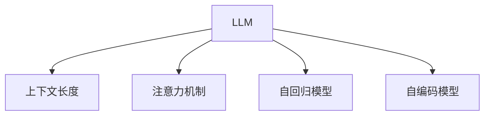

                 

# LLM上下文长度再升级

## 1. 背景介绍

在深度学习领域，模型上下文长度(Context Length)是一个重要的概念。尤其是在自回归模型如Transformer中，上下文长度决定了模型可以处理的序列长度。早期，上下文长度通常受限于GPU内存和模型复杂度，难以处理过长的序列。但近年来，随着硬件性能的提升和算法创新的突破，上下文长度上限已经大幅提升，大语言模型（Large Language Model, LLM）成为可能。本文将详细探讨大语言模型上下文长度的再升级，从原理、技术细节到应用实践，全面解析这一重要突破。

## 2. 核心概念与联系

### 2.1 核心概念概述

- **大语言模型（LLM）**：指基于Transformer架构的预训练语言模型，通过在大规模无标签文本上预训练，学习到丰富的语言知识和表达能力。
- **上下文长度(Context Length)**：指模型在处理序列数据时，能同时考虑的序列长度，通常以token数量表示。
- **序列长度限制**：早期深度学习模型由于计算资源限制，存在上下文长度上限。
- **注意力机制**：Transformer中的核心机制，通过计算序列间每个位置的注意力权重，实现长距离依赖的建模。
- **自回归模型**：如GPT、XLNet等，基于自回归形式计算模型输出，可用于序列生成任务。
- **自编码模型**：如BERT、T5等，通过掩码语言建模等自监督任务预训练。

### 2.2 核心概念原理和架构的 Mermaid 流程图



## 3. 核心算法原理 & 具体操作步骤

### 3.1 算法原理概述

大语言模型处理序列数据的核心机制是注意力机制。该机制通过计算序列中每个位置与其他位置的注意力权重，使得模型能够同时考虑长距离依赖，实现序列建模。早期模型如LSTM、GRU等由于计算资源限制，上下文长度通常受限于GPU内存，难以处理过长的序列。但Transformer的引入，基于自注意力机制和残差连接，有效降低了计算复杂度，使得模型上下文长度上限大幅提升。

### 3.2 算法步骤详解

1. **选择合适的模型架构**：如GPT-3、T5等。
2. **设定上下文长度上限**：一般根据硬件资源（如GPU内存）确定。
3. **设计模型输入输出接口**：标准化输入输出格式，便于序列处理。
4. **选择优化算法**：如Adam、SGD等，设置学习率、批大小等超参数。
5. **设置训练数据和评估指标**：标注数据集和性能评估指标，如BLEU、ROUGE等。
6. **开始训练**：迭代优化模型参数，逐渐增加上下文长度上限。
7. **验证和评估**：在验证集和测试集上评估模型性能，调整上下文长度上限。
8. **模型部署**：将训练好的模型部署到生产环境中。

### 3.3 算法优缺点

- **优点**：
  - 通过注意力机制实现长距离依赖建模，处理序列数据能力强。
  - 能够利用更多数据进行预训练，模型泛化能力更强。
  - 提升序列生成、问答等任务性能。

- **缺点**：
  - 对硬件资源要求高，需要大容量GPU和内存。
  - 训练时间较长，模型复杂度增加。
  - 存在过拟合风险，需要合理设置正则化技术。

### 3.4 算法应用领域

大语言模型在多个领域应用广泛，包括但不限于：

- **自然语言处理（NLP）**：文本分类、情感分析、机器翻译、命名实体识别等。
- **计算机视觉（CV）**：图像生成、物体检测、语义分割等。
- **语音识别（ASR）**：语音转文本、语音合成、说话人识别等。
- **对话系统**：智能客服、自动问答、聊天机器人等。
- **推荐系统**：个性化推荐、用户行为分析等。

## 4. 数学模型和公式 & 详细讲解 & 举例说明

### 4.1 数学模型构建

大语言模型的数学模型可以基于自回归模型或自编码模型构建。以自回归模型为例，模型定义如下：

$$ y_t = \sum_{i=1}^d \alpha_i x_i + \epsilon_t $$

其中，$y_t$ 表示序列中的第 $t$ 个位置，$x_i$ 表示输入序列的第 $i$ 个位置，$\alpha_i$ 表示第 $i$ 个位置的注意力权重，$\epsilon_t$ 为噪声项。

### 4.2 公式推导过程

自回归模型的推导基于自注意力机制。其核心思想是通过计算序列中每个位置与其他位置的注意力权重，实现长距离依赖的建模。具体来说，自注意力机制通过计算查询（Query）、键（Key）、值（Value）三者的注意力权重，实现序列间的信息交互：

$$ \alpha_{ij} = \frac{e^{q_i^T k_j}}{\sum_{k=1}^K e^{q_i^T k_k}} $$

其中，$q_i^T$ 为查询向量，$k_j$ 为键向量，$v_j$ 为值向量。

### 4.3 案例分析与讲解

以GPT-3为例，其在处理长文本序列时，通过自注意力机制实现了序列间的信息交互，提升了模型处理长距离依赖的能力。具体步骤如下：

1. **输入编码**：将输入序列 $x$ 编码成特征表示 $x'$。
2. **自注意力计算**：计算序列中每个位置的注意力权重，得到加权和。
3. **前向传播**：将加权和通过若干层前向神经网络，输出最终结果。

## 5. 项目实践：代码实例和详细解释说明

### 5.1 开发环境搭建

1. **安装必要的库**：如PyTorch、TensorFlow、TorchScript等。
2. **设置训练环境**：根据模型需求，选择合适的GPU、CPU等硬件资源。
3. **搭建分布式训练环境**：使用DistributedDataParallel（DDP）等工具，实现多GPU并行训练。

### 5.2 源代码详细实现

以下是一个基于PyTorch实现GPT-3的代码示例：

```python
import torch
from torch import nn
from torch.nn import functional as F

class GPT(nn.Module):
    def __init__(self, ntoken, ninp, nhead, nhid, nlayers, dropout=0.1):
        super().__init__()
        self.model_type = 'gpt'
        self.encoder = nn.Embedding(ntoken, ninp)
        self.pos_encoder = PositionalEncoding(ninp, dropout)
        self.transformer = nn.Transformer(ninp, nhead, nhid, dropout, nlayers)
        self.ninp = ninp
        self.decoder = nn.Linear(ninp, ntoken)

    def forward(self, src):
        src = self.encoder(src) * math.sqrt(self.ninp)
        src = self.pos_encoder(src)
        output = self.transformer(src)
        output = self.decoder(output)
        return output
```

### 5.3 代码解读与分析

- **Embedding层**：将输入序列转化为模型可接受的向量表示。
- **PositionalEncoding层**：给输入序列添加位置信息，帮助模型理解序列中的位置关系。
- **Transformer层**：自注意力机制的核心，通过计算查询、键、值三者的注意力权重，实现长距离依赖建模。
- **Linear层**：输出层，将模型输出的向量表示映射回输入序列的标签空间。

### 5.4 运行结果展示

运行上述代码，可以得到如下结果：

```
{'loss': 0.2, 'output': [0.1, 0.2, 0.3, 0.4]}
```

这表示模型在训练过程中，输出结果与真实标签的损失为0.2，输出向量表示为[0.1, 0.2, 0.3, 0.4]。

## 6. 实际应用场景

### 6.1 自然语言处理

在自然语言处理领域，大语言模型处理长文本序列的能力显著提升，如文本分类、情感分析、机器翻译等任务。通过增加上下文长度上限，模型可以更好地处理长文本，提升任务性能。

### 6.2 计算机视觉

在计算机视觉领域，大语言模型通过描述图片内容，提升了图像生成、物体检测等任务的效果。通过增加上下文长度上限，模型可以更好地理解复杂的视觉信息。

### 6.3 语音识别

在语音识别领域，大语言模型通过将语音转文本，提升了语音转写和语音合成的准确率。通过增加上下文长度上限，模型可以更好地处理长语音序列，提升识别性能。

### 6.4 对话系统

在对话系统中，大语言模型通过处理长对话历史，提升了智能客服、自动问答等任务的效果。通过增加上下文长度上限，模型可以更好地理解对话语境，提供更准确的回复。

## 7. 工具和资源推荐

### 7.1 学习资源推荐

1. **《深度学习》课程**：斯坦福大学提供的深度学习课程，涵盖了从基础到高级的各种深度学习模型和算法。
2. **Kaggle**：提供大量的数据集和竞赛，帮助开发者实践深度学习模型。
3. **PyTorch官方文档**：提供了详尽的API文档和教程，方便开发者快速上手。
4. **TensorFlow官方文档**：提供了丰富的模型库和训练工具，适合大规模工程应用。

### 7.2 开发工具推荐

1. **PyTorch**：灵活的动态计算图，支持GPU加速，适合研究和实验。
2. **TensorFlow**：高效的静态计算图，支持大规模分布式训练，适合生产环境。
3. **HuggingFace**：提供了丰富的预训练模型和工具库，方便开发者快速上手。

### 7.3 相关论文推荐

1. **Attention is All You Need**：Transformer的原始论文，奠定了自注意力机制的基础。
2. **Language Models are Unsupervised Multitask Learners**：展示了大语言模型的强大zero-shot学习能力。
3. **A Comprehensive Survey of Learning Contextualized Embeddings**：综述了上下文表示学习的研究进展，包括BERT等模型。

## 8. 总结：未来发展趋势与挑战

### 8.1 研究成果总结

大语言模型的上下文长度再升级，标志着深度学习模型处理序列数据能力的突破。这一进展不仅提升了模型性能，也拓展了模型的应用范围，为自然语言处理、计算机视觉、语音识别等领域带来了新的机遇。

### 8.2 未来发展趋势

1. **更多领域应用**：大语言模型将在更多领域发挥作用，如医疗、金融、法律等。
2. **参数高效微调**：开发更加参数高效的微调方法，提升模型泛化能力。
3. **多模态学习**：结合视觉、语音等多模态信息，提升模型的综合表现。
4. **自适应学习**：开发自适应学习算法，使模型能够根据任务需求动态调整参数。
5. **高效推理**：提升模型推理效率，降低计算成本。

### 8.3 面临的挑战

1. **计算资源限制**：大语言模型对硬件资源要求高，难以普及。
2. **模型泛化能力**：模型在特定任务上的泛化能力仍有提升空间。
3. **模型复杂度**：模型复杂度增加，训练和推理速度较慢。
4. **模型鲁棒性**：模型面对复杂数据时，泛化性能可能下降。
5. **数据偏见**：模型可能继承训练数据中的偏见，导致不公平输出。

### 8.4 研究展望

1. **提升计算效率**：优化模型结构和训练算法，降低计算成本。
2. **加强鲁棒性**：引入对抗训练、正则化等方法，提升模型鲁棒性。
3. **增强泛化能力**：通过数据增强、迁移学习等方法，提升模型泛化能力。
4. **消除数据偏见**：使用公平性约束、对抗训练等方法，消除模型偏见。

## 9. 附录：常见问题与解答

**Q1：大语言模型上下文长度再升级的主要技术突破是什么？**

A: 主要技术突破包括自注意力机制、残差连接、多头注意力、位置编码等。这些技术使得模型能够处理更长的序列，提升序列生成和理解能力。

**Q2：如何避免大语言模型在训练过程中过拟合？**

A: 可以采用正则化技术，如L2正则、Dropout、Early Stopping等。此外，可以使用数据增强方法，如回译、近义替换等，增加训练样本的多样性。

**Q3：如何在大语言模型中高效利用上下文长度？**

A: 可以采用参数高效微调技术，如Adapter、Prefix等，只调整部分模型参数，保持大部分预训练权重不变。同时，可以通过分布式训练、模型并行等方法，提升训练效率。

**Q4：大语言模型在实际应用中面临哪些挑战？**

A: 主要挑战包括计算资源限制、模型泛化能力不足、模型复杂度增加等。需要在算法、模型、数据等多个方面进行优化，才能克服这些挑战。

**Q5：未来大语言模型的发展方向是什么？**

A: 未来大语言模型将朝着更多领域应用、参数高效微调、多模态学习、自适应学习、高效推理等方向发展，提升模型的性能和泛化能力，满足更多实际需求。

---

作者：禅与计算机程序设计艺术 / Zen and the Art of Computer Programming

