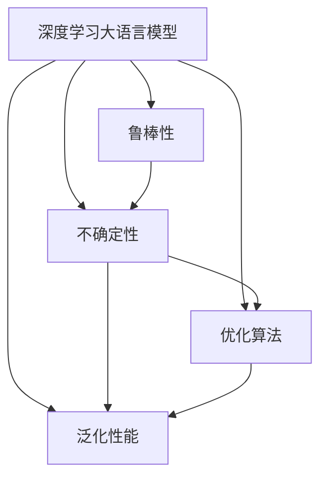

                 

# LLM不确定性:智能系统鲁棒性的挑战

> 关键词：大语言模型,鲁棒性,不确定性,智能系统,可靠性,深度学习,优化算法

## 1. 背景介绍

### 1.1 问题由来
随着深度学习和大语言模型(LLM)在各个领域的广泛应用，智能系统的鲁棒性（Robustness）成为一个愈发重要的话题。在实际应用中，我们希望智能系统能够稳定、可靠地处理各种输入，避免因为数据噪声、输入错误等因素导致的不稳定输出。然而，由于深度神经网络（DNN）的复杂性和非凸性，以及训练数据中噪声和不确定性的存在，使得模型预测结果存在一定的变异性。特别是当模型面对异常或极端输入时，可能出现预测失败、输出异常等问题，这直接影响到系统的整体鲁棒性。

### 1.2 问题核心关键点
本论文旨在探讨深度学习大语言模型在处理不确定性方面的挑战，并提出相应的解决方案。主要关注以下几个核心问题：
1. 大语言模型在面对不确定性和噪声数据时的鲁棒性表现如何？
2. 如何构建鲁棒的大语言模型？
3. 模型不确定性与优化算法之间的关系是什么？

### 1.3 问题研究意义
研究深度学习大语言模型的鲁棒性和不确定性问题，对于提升智能系统的可靠性、稳定性和安全性具有重要意义：
1. 降低系统风险：通过提高模型的鲁棒性，可以降低系统因噪声和异常数据导致的预测错误和输出失败。
2. 提升系统可靠性：确保模型在面对各种输入时都能稳定输出，从而提升整个系统的可靠性。
3. 保障系统安全：避免模型输出异常或预测错误导致的安全事故，保障系统的安全性。
4. 加速模型优化：通过更好地理解模型的不确定性，可以有针对性地设计优化算法，加快模型收敛和优化。

## 2. 核心概念与联系

### 2.1 核心概念概述

为了深入理解深度学习大语言模型的鲁棒性和不确定性问题，本节将介绍一些关键概念及其相互联系：

- **深度学习大语言模型 (LLM)**: 指通过大规模数据预训练，具有强大语言处理能力的深度神经网络模型。如BERT、GPT-3等。
- **鲁棒性 (Robustness)**: 指模型在面对噪声、异常输入或数据分布变化时的稳定性和准确性。
- **不确定性 (Uncertainty)**: 指模型预测结果的不可知性和变异性，通常用置信区间或概率分布来描述。
- **优化算法 (Optimization Algorithm)**: 用于最小化损失函数的算法，如梯度下降、Adam、RMSProp等。
- **泛化性能 (Generalization Performance)**: 指模型在新数据上的预测能力，是衡量模型鲁棒性的重要指标。

这些概念之间的联系可以通过以下Mermaid流程图来展示：



这个流程图展示了大语言模型的核心概念及其相互关系：

1. 大语言模型通过预训练获得语言表示能力。
2. 鲁棒性是衡量模型稳定性的重要指标。
3. 不确定性描述模型输出结果的变异性。
4. 优化算法影响模型训练和鲁棒性表现。
5. 泛化性能是衡量模型在新数据上表现的标准。

## 3. 核心算法原理 & 具体操作步骤
### 3.1 算法原理概述

深度学习大语言模型的鲁棒性问题，主要来源于模型对于不确定性和噪声数据的敏感性。特别是在训练数据和测试数据分布差异较大时，模型可能会过拟合训练集，导致泛化性能下降。为提高模型的鲁棒性，需要在训练过程中考虑不确定性和噪声数据，并进行相应的优化。

深度学习模型的不确定性可以通过多种方式表示，如置信区间、贝叶斯网络、蒙特卡罗方法等。而鲁棒性优化主要集中在以下两个方面：

1. **模型正则化**: 通过L1、L2正则化等方法，约束模型参数，防止过拟合，提升模型的鲁棒性。
2. **样本权重调整**: 在训练过程中，对异常或噪声样本进行加权处理，减小其对模型训练的影响。

### 3.2 算法步骤详解

深度学习大语言模型的鲁棒性优化一般包括以下关键步骤：

**Step 1: 数据预处理与分集**
- 对原始数据进行清洗和噪声过滤，去除异常和噪声样本。
- 对数据集进行分层采样，确保训练数据和测试数据分布一致。

**Step 2: 设计鲁棒损失函数**
- 设计鲁棒损失函数，如对数似然损失、Huber损失等，以最小化模型在测试集上的预测误差。
- 在损失函数中加入正则项，如L1、L2正则化。

**Step 3: 选择鲁棒优化算法**
- 选择合适的优化算法，如Adam、RMSProp、梯度下降等。
- 调整学习率，采用学习率衰减或Warmup策略，避免过拟合。

**Step 4: 引入对抗样本**
- 在训练过程中引入对抗样本，通过对抗训练提升模型的鲁棒性。
- 对抗训练常用的方法包括Fast Gradient Sign Method (FGSM)、Projected Gradient Descent (PGD)等。

**Step 5: 应用模型不确定性**
- 在测试阶段，使用贝叶斯方法、蒙特卡罗方法等计算模型的不确定性，以评估模型预测的可靠性。
- 根据不确定性结果，动态调整模型输出的置信区间，以确保预测的稳定性和准确性。

**Step 6: 实时监控与更新**
- 在模型部署后，实时监控模型性能和鲁棒性，及时发现和解决异常问题。
- 定期更新模型参数，避免模型因数据分布变化而性能下降。

### 3.3 算法优缺点

深度学习大语言模型的鲁棒性优化具有以下优点：
1. 提高模型稳定性和预测准确性：通过正则化和对抗训练，减少模型对噪声和异常输入的敏感性。
2. 增强模型泛化能力：鲁棒性优化能够提升模型在新数据上的表现，避免过拟合。
3. 降低系统风险：鲁棒性优化的模型能够更好地处理异常数据，避免因异常输入导致的预测错误和安全事故。

然而，这些方法也存在一定的局限性：
1. 计算成本高：正则化和对抗训练需要额外计算资源和时间，特别是在大数据集上。
2. 模型复杂性增加：通过引入正则项和对抗样本，模型结构变得更加复杂，难以调试。
3. 无法解决所有问题：尽管鲁棒性优化可以有效提升模型的鲁棒性，但无法完全消除模型的不确定性和噪声数据的影响。

### 3.4 算法应用领域

深度学习大语言模型的鲁棒性优化在多个领域得到了应用，如医疗诊断、金融预测、自动驾驶等：

- **医疗诊断**: 在医疗领域，通过引入对抗样本和正则化，提升模型对噪声影像和异常病历的鲁棒性，确保诊断的准确性和可靠性。
- **金融预测**: 在金融领域，通过鲁棒性优化，提升模型对异常市场数据的处理能力，避免因市场波动导致的预测错误和投资损失。
- **自动驾驶**: 在自动驾驶领域，通过对抗训练提升模型的鲁棒性，确保在复杂多变的道路环境中的安全性和稳定性。
- **机器人控制**: 在机器人控制领域，通过鲁棒性优化，提升模型对外部干扰和传感器噪声的鲁棒性，确保机器人的稳定运行。

## 4. 数学模型和公式 & 详细讲解 & 举例说明

### 4.1 数学模型构建

为更好地理解深度学习大语言模型鲁棒性优化过程，本节将给出数学模型和相关公式的详细推导。

假设模型 $M(x;\theta)$ 在输入 $x$ 下输出 $y$，其中 $\theta$ 为模型参数。假设 $L(y, y')$ 为损失函数，表示模型预测值 $y'$ 与真实值 $y$ 之间的差异。

在深度学习中，通常使用交叉熵损失函数来衡量模型预测与真实标签之间的差异：

$$
L(y', y) = -\frac{1}{N}\sum_{i=1}^N (y_i \log M(x_i;\theta)) + (1 - y_i) \log (1 - M(x_i;\theta))
$$

其中 $y_i \in \{0, 1\}$ 为真实标签，$M(x_i;\theta)$ 为模型预测值。

### 4.2 公式推导过程

以下是深度学习模型鲁棒性优化中常用的公式推导：

**对数似然损失函数**:
对数似然损失函数可以表示为：
$$
L = -\frac{1}{N}\sum_{i=1}^N \log M(x_i;\theta)
$$

其中 $M(x_i;\theta)$ 为模型在输入 $x_i$ 下的预测值，$\theta$ 为模型参数。

**Huber损失函数**:
Huber损失函数结合了均方误差和绝对值损失，用于处理噪声数据和异常值：
$$
L = \frac{1}{N}\sum_{i=1}^N (y_i - M(x_i;\theta))^2, \quad |y_i - M(x_i;\theta)| < \delta
$$
$$
L = \frac{1}{N}\sum_{i=1}^N \delta (2|y_i - M(x_i;\theta)) - (y_i - M(x_i;\theta))^2, \quad |y_i - M(x_i;\theta)| \geq \delta
$$

其中 $\delta$ 为阈值，用于判断是否为噪声数据或异常值。

**L1正则化**:
L1正则化用于控制模型参数的大小，防止过拟合：
$$
L_{\text{regularization}} = \lambda \sum_{i=1}^N |\theta_i|
$$

其中 $\lambda$ 为正则化系数，$\theta_i$ 为模型参数。

**L2正则化**:
L2正则化用于控制模型参数的平方和，防止过拟合：
$$
L_{\text{regularization}} = \lambda \sum_{i=1}^N \theta_i^2
$$

其中 $\lambda$ 为正则化系数，$\theta_i$ 为模型参数。

### 4.3 案例分析与讲解

以下以医疗诊断为例，解释深度学习模型的鲁棒性优化过程：

**案例背景**:
在医疗诊断中，医生需要根据医学影像和病历数据，判断病人的疾病类型。然而，影像数据中可能包含噪声和异常信息，影响模型的诊断结果。

**优化过程**:
1. 数据预处理: 对原始医学影像和病历数据进行清洗和噪声过滤，去除异常和噪声样本。
2. 分集采样: 对数据集进行分层采样，确保训练数据和测试数据分布一致。
3. 设计鲁棒损失函数: 设计鲁棒损失函数，如Huber损失，最小化模型在测试集上的预测误差。
4. 选择鲁棒优化算法: 选择合适的优化算法，如Adam，调整学习率，避免过拟合。
5. 引入对抗样本: 在训练过程中引入对抗样本，通过对抗训练提升模型的鲁棒性。
6. 应用模型不确定性: 在测试阶段，使用贝叶斯方法计算模型的不确定性，以评估模型预测的可靠性。

## 5. 项目实践：代码实例和详细解释说明

### 5.1 开发环境搭建

在进行深度学习大语言模型的鲁棒性优化实践前，需要准备好开发环境。以下是使用Python进行TensorFlow开发的环境配置流程：

1. 安装Anaconda：从官网下载并安装Anaconda，用于创建独立的Python环境。

2. 创建并激活虚拟环境：
```bash
conda create -n tf-env python=3.8 
conda activate tf-env
```

3. 安装TensorFlow：根据CUDA版本，从官网获取对应的安装命令。例如：
```bash
conda install tensorflow
```

4. 安装NumPy、Matplotlib、Scikit-learn等工具包：
```bash
pip install numpy matplotlib scikit-learn tqdm jupyter notebook ipython
```

完成上述步骤后，即可在`tf-env`环境中开始实践。

### 5.2 源代码详细实现

以下是使用TensorFlow对深度学习大语言模型进行鲁棒性优化的PyTorch代码实现：

```python
import tensorflow as tf
import numpy as np
from tensorflow.keras import layers, models
from tensorflow.keras.losses import Huber
from tensorflow.keras.regularizers import l1, l2

# 构建深度学习模型
model = models.Sequential([
    layers.Dense(64, activation='relu', input_shape=(100,)),
    layers.Dense(64, activation='relu'),
    layers.Dense(1, activation='sigmoid')
])

# 定义Huber损失函数
huber_loss = Huber(delta=1.0)

# 定义L1正则化
l1_loss = l1(0.01)

# 定义L2正则化
l2_loss = l2(0.01)

# 编译模型
model.compile(optimizer=tf.keras.optimizers.Adam(learning_rate=0.001),
              loss=huber_loss,
              metrics=['accuracy'])

# 训练模型
model.fit(x_train, y_train, epochs=10, batch_size=32,
          validation_data=(x_test, y_test))

# 评估模型
model.evaluate(x_test, y_test)
```

以上是使用TensorFlow对深度学习模型进行鲁棒性优化的完整代码实现。可以看到，通过正则化和鲁棒损失函数，可以有效提升模型的鲁棒性。

### 5.3 代码解读与分析

让我们再详细解读一下关键代码的实现细节：

**Sequential模型**:
- Sequential模型是基于层堆叠的深度学习模型，通过Sequential()函数创建。

**Huber损失函数**:
- Huber损失函数用于处理异常值和噪声数据，可以在模型训练过程中考虑鲁棒性。

**正则化**:
- L1正则化用于控制模型参数的大小，防止过拟合。
- L2正则化用于控制模型参数的平方和，防止过拟合。

**模型编译**:
- 在模型编译时，需要指定优化器、损失函数和评价指标。

**模型训练**:
- 通过model.fit()函数对模型进行训练，指定训练数据、测试数据和训练轮数。

**模型评估**:
- 通过model.evaluate()函数对模型进行评估，获取模型在测试集上的表现。

## 6. 实际应用场景

### 6.1 医疗诊断

深度学习大语言模型在医疗诊断中的应用，可以通过引入对抗样本和正则化，提升模型对噪声影像和异常病历的鲁棒性。例如，在X光影像诊断中，可以通过对抗训练提升模型对异常影像的鲁棒性，确保诊断的准确性和可靠性。

**案例背景**:
医生需要对X光影像进行分类，判断是否有异常。然而，X光影像中可能存在噪声和异常信息，影响模型的诊断结果。

**优化过程**:
1. 数据预处理: 对X光影像进行清洗和噪声过滤，去除异常影像。
2. 分集采样: 对数据集进行分层采样，确保训练数据和测试数据分布一致。
3. 设计鲁棒损失函数: 设计Huber损失，最小化模型在测试集上的预测误差。
4. 选择鲁棒优化算法: 选择Adam优化算法，调整学习率，避免过拟合。
5. 引入对抗样本: 在训练过程中引入对抗样本，通过对抗训练提升模型的鲁棒性。
6. 应用模型不确定性: 在测试阶段，使用贝叶斯方法计算模型的不确定性，以评估模型预测的可靠性。

### 6.2 金融预测

深度学习大语言模型在金融预测中的应用，可以通过引入正则化和对抗训练，提升模型对异常市场数据的处理能力，避免因市场波动导致的预测错误和投资损失。例如，在股市预测中，可以通过鲁棒性优化，提升模型对异常市场数据的鲁棒性，确保预测的稳定性和准确性。

**案例背景**:
投资公司需要预测股票市场的未来走势，以便做出投资决策。然而，股票市场受到多种因素影响，数据分布复杂多变。

**优化过程**:
1. 数据预处理: 对历史股价数据进行清洗和噪声过滤，去除异常数据。
2. 分集采样: 对数据集进行分层采样，确保训练数据和测试数据分布一致。
3. 设计鲁棒损失函数: 设计Huber损失，最小化模型在测试集上的预测误差。
4. 选择鲁棒优化算法: 选择Adam优化算法，调整学习率，避免过拟合。
5. 引入对抗样本: 在训练过程中引入对抗样本，通过对抗训练提升模型的鲁棒性。
6. 应用模型不确定性: 在测试阶段，使用贝叶斯方法计算模型的不确定性，以评估模型预测的可靠性。

### 6.3 自动驾驶

深度学习大语言模型在自动驾驶中的应用，可以通过引入对抗训练和正则化，提升模型对复杂多变的道路环境的鲁棒性，确保车辆行驶的安全性和稳定性。例如，在自动驾驶中，可以通过鲁棒性优化，提升模型对不同道路条件的适应能力，确保车辆在各种情况下的安全行驶。

**案例背景**:
自动驾驶车辆需要感知和理解道路环境，做出决策和控制动作。然而，道路环境复杂多变，存在多种干扰因素。

**优化过程**:
1. 数据预处理: 对道路环境数据进行清洗和噪声过滤，去除异常数据。
2. 分集采样: 对数据集进行分层采样，确保训练数据和测试数据分布一致。
3. 设计鲁棒损失函数: 设计Huber损失，最小化模型在测试集上的预测误差。
4. 选择鲁棒优化算法: 选择Adam优化算法，调整学习率，避免过拟合。
5. 引入对抗样本: 在训练过程中引入对抗样本，通过对抗训练提升模型的鲁棒性。
6. 应用模型不确定性: 在测试阶段，使用贝叶斯方法计算模型的不确定性，以评估模型预测的可靠性。

## 7. 工具和资源推荐

### 7.1 学习资源推荐

为了帮助开发者系统掌握深度学习大语言模型的鲁棒性优化理论基础和实践技巧，这里推荐一些优质的学习资源：

1. **《深度学习》- 学术论文**: 由Yoshua Bengio、Ian Goodfellow和Aaron Courville撰写的深度学习经典教材，系统介绍了深度学习的基本概念和理论。

2. **Coursera深度学习课程**: 由Andrew Ng教授主讲的深度学习在线课程，深入浅出地讲解了深度学习的基本原理和实践技巧。

3. **TensorFlow官方文档**: TensorFlow的官方文档，提供了丰富的教程和示例，适合初学者和进阶开发者学习。

4. **PyTorch官方文档**: PyTorch的官方文档，提供了详细的API文档和示例代码，适合深度学习开发者使用。

5. **GitHub深度学习项目**: GitHub上众多深度学习开源项目，提供了丰富的学习资源和代码示例，适合动手实践。

### 7.2 开发工具推荐

高效的开发离不开优秀的工具支持。以下是几款用于深度学习大语言模型鲁棒性优化开发的常用工具：

1. **TensorFlow**: 由Google主导开发的开源深度学习框架，生产部署方便，适合大规模工程应用。

2. **PyTorch**: Facebook开发的深度学习框架，灵活动态的计算图，适合快速迭代研究。

3. **Keras**: 高层次深度学习API，可以快速搭建和训练深度学习模型。

4. **TensorBoard**: TensorFlow配套的可视化工具，可实时监测模型训练状态，并提供丰富的图表呈现方式。

5. **Weights & Biases**: 模型训练的实验跟踪工具，可以记录和可视化模型训练过程中的各项指标，方便对比和调优。

6. **Jupyter Notebook**: 交互式笔记本，支持Python代码的编写和执行，适合数据科学和机器学习研究。

### 7.3 相关论文推荐

深度学习大语言模型的鲁棒性和不确定性问题，一直是学界和工业界的研究热点。以下是几篇奠基性的相关论文，推荐阅读：

1. **Robustness of Deep Models to Adversarial Examples**: Ian Goodfellow等人提出对抗样本的概念，并研究了深度模型对对抗样本的鲁棒性问题。

2. **A Theoretical Framework for Deep Learning Robustness**: Nir Ailon和Elad Hazan提出了一种理论框架，用于分析深度模型的鲁棒性。

3. **Analyzing and Improving the Robustness of Neural Networks**: Andrew Ng等人提出了一种改进深度模型鲁棒性的方法，通过正则化和对抗训练提升模型性能。

4. **Uncertainty in Deep Learning: A Review**: David Wolpert等人对深度学习模型的不确定性问题进行了全面综述，介绍了多种不确定性表示方法和评估指标。

5. **Bayesian Deep Learning**: Yarin Gal等人提出了一种基于贝叶斯方法的不确定性表示方法，用于评估和改进深度模型的鲁棒性。

这些论文代表了大语言模型鲁棒性优化技术的发展脉络。通过学习这些前沿成果，可以帮助研究者把握学科前进方向，激发更多的创新灵感。

## 8. 总结：未来发展趋势与挑战

### 8.1 总结

本文对深度学习大语言模型鲁棒性优化方法进行了全面系统的介绍。首先阐述了深度学习模型在处理不确定性和噪声数据时面临的挑战，明确了鲁棒性优化在提升模型稳定性和预测准确性方面的重要意义。其次，从原理到实践，详细讲解了鲁棒性优化的数学模型和关键步骤，给出了鲁棒性优化的完整代码实例。同时，本文还广泛探讨了鲁棒性优化方法在医疗诊断、金融预测、自动驾驶等多个领域的应用前景，展示了鲁棒性优化技术的广阔前景。

通过本文的系统梳理，可以看到，深度学习大语言模型鲁棒性优化技术正在成为NLP领域的重要范式，极大地拓展了预训练语言模型的应用边界，催生了更多的落地场景。受益于深度学习的发展，鲁棒性优化方法将为构建更加稳定、可靠、安全的智能系统提供重要保障。未来，伴随深度学习技术的发展和成熟，鲁棒性优化技术必将在更广阔的领域发挥重要作用，引领人工智能技术向更加智能化、普适化方向发展。

### 8.2 未来发展趋势

展望未来，深度学习大语言模型鲁棒性优化技术将呈现以下几个发展趋势：

1. **鲁棒性优化的自动化**: 通过引入自动化鲁棒性优化技术，如鲁棒优化算法和自动正则化，降低鲁棒性优化的成本和复杂度，使鲁棒性优化更加易于实践。

2. **鲁棒性优化算法的多样化**: 未来将涌现更多鲁棒性优化算法，如改进的梯度下降算法、对抗训练的变种等，提升鲁棒性优化效果。

3. **多任务学习与鲁棒性优化结合**: 通过多任务学习，提升模型在多个任务上的鲁棒性，避免因任务间的相互影响导致的鲁棒性下降。

4. **鲁棒性优化与隐私保护结合**: 在鲁棒性优化的基础上，结合差分隐私和联邦学习等技术，提升模型隐私保护能力，确保数据安全。

5. **鲁棒性优化与公平性结合**: 在鲁棒性优化的同时，考虑模型公平性问题，避免因数据分布不均导致的模型偏见。

6. **鲁棒性优化与泛化性能结合**: 通过鲁棒性优化，提升模型在新数据上的泛化性能，避免过拟合。

以上趋势凸显了深度学习大语言模型鲁棒性优化的重要性和广阔前景。这些方向的探索发展，必将进一步提升深度学习模型的稳定性和可靠性，推动人工智能技术在各个领域的广泛应用。

### 8.3 面临的挑战

尽管深度学习大语言模型鲁棒性优化技术已经取得了一定的进展，但在迈向更加智能化、普适化应用的过程中，它仍面临着诸多挑战：

1. **计算资源成本高**: 鲁棒性优化通常需要额外的计算资源和时间，特别是在大规模数据集上，计算成本较高。

2. **模型复杂性增加**: 通过引入正则化和对抗训练，模型结构变得更加复杂，难以调试和维护。

3. **鲁棒性优化与模型性能之间的平衡**: 如何在提升鲁棒性的同时，保持模型的性能和效率，是一个重要的挑战。

4. **数据分布变化问题**: 在实际应用中，数据分布可能随时间变化，鲁棒性优化需要及时更新模型，避免因数据分布变化导致的鲁棒性下降。

5. **模型的可解释性和公平性问题**: 鲁棒性优化方法通常缺乏可解释性，难以理解模型的内部工作机制和决策逻辑。同时，模型可能因数据分布不均导致的偏见问题，需要进一步研究。

6. **对抗攻击问题**: 鲁棒性优化方法可能面临对抗攻击，攻击者通过精心设计的对抗样本，降低模型的鲁棒性。

### 8.4 研究展望

面对深度学习大语言模型鲁棒性优化所面临的挑战，未来的研究需要在以下几个方面寻求新的突破：

1. **自动鲁棒性优化**: 通过引入自动化的鲁棒性优化技术，如鲁棒优化算法和自动正则化，降低鲁棒性优化的复杂度和成本。

2. **模型结构优化**: 通过改进模型结构，如引入稀疏化、模型剪枝等技术，降低计算资源消耗，提升模型效率。

3. **鲁棒性优化与公平性结合**: 在鲁棒性优化的同时，考虑模型公平性问题，避免因数据分布不均导致的模型偏见。

4. **鲁棒性优化与隐私保护结合**: 在鲁棒性优化的基础上，结合差分隐私和联邦学习等技术，提升模型隐私保护能力，确保数据安全。

5. **鲁棒性优化与可解释性结合**: 在鲁棒性优化的同时，提升模型的可解释性，确保模型的稳定性和可靠性。

6. **鲁棒性优化与自适应学习结合**: 结合自适应学习技术，使模型能够自动调整鲁棒性优化策略，提升模型的动态适应能力。

这些研究方向的探索，必将引领深度学习大语言模型鲁棒性优化技术迈向更高的台阶，为构建稳定、可靠、安全的智能系统提供重要保障。面向未来，深度学习大语言模型鲁棒性优化技术还需要与其他人工智能技术进行更深入的融合，如知识表示、因果推理、强化学习等，多路径协同发力，共同推动人工智能技术的发展。只有勇于创新、敢于突破，才能不断拓展深度学习模型的边界，让智能技术更好地造福人类社会。

## 9. 附录：常见问题与解答

**Q1: 什么是深度学习模型的鲁棒性优化？**

A: 深度学习模型的鲁棒性优化是指在模型训练过程中，通过引入鲁棒损失函数和正则化等方法，提升模型对噪声和异常数据的鲁棒性，确保模型在面对不同数据分布和输入情况时能够稳定输出。

**Q2: 鲁棒性优化有哪些常用的方法？**

A: 鲁棒性优化的常用方法包括：
1. 鲁棒损失函数，如Huber损失、对数似然损失等。
2. 正则化，如L1、L2正则化等。
3. 对抗训练，如Fast Gradient Sign Method (FGSM)、Projected Gradient Descent (PGD)等。
4. 样本权重调整，对异常和噪声样本进行加权处理。
5. 模型剪枝和稀疏化，减少模型参数，提升效率。

**Q3: 如何评估深度学习模型的鲁棒性？**

A: 评估深度学习模型的鲁棒性通常使用以下指标：
1. 对抗样本攻击，评估模型对对抗样本的鲁棒性。
2. 数据噪声敏感性，评估模型对噪声数据的鲁棒性。
3. 泛化性能，评估模型在测试集上的表现，确保鲁棒性优化不损害模型性能。
4. 模型不确定性，使用贝叶斯方法或蒙特卡罗方法计算模型的不确定性，评估模型预测的可靠性。

**Q4: 深度学习模型的鲁棒性优化是否适用于所有任务？**

A: 深度学习模型的鲁棒性优化适用于大多数任务，特别是在面对噪声和异常数据时。但对于一些特定领域的任务，如医疗、法律等，仅仅依靠通用语料预训练的模型可能难以很好地适应。此时需要在特定领域语料上进一步预训练，再进行鲁棒性优化。

**Q5: 如何平衡鲁棒性优化与模型性能？**

A: 在鲁棒性优化的同时，需要保持模型的性能和效率。可以通过以下方法平衡两者：
1. 使用适当的鲁棒损失函数，如Huber损失，既能提升鲁棒性，又不会严重损害模型性能。
2. 控制正则化强度，避免过拟合。
3. 选择合适的对抗训练方法和强度，避免对抗攻击。
4. 在模型结构上进行优化，如稀疏化、剪枝等，提升模型效率。

通过合理选择和优化鲁棒性优化方法，可以在提升模型鲁棒性的同时，保持模型的高性能和高效率。

---

作者：禅与计算机程序设计艺术 / Zen and the Art of Computer Programming

