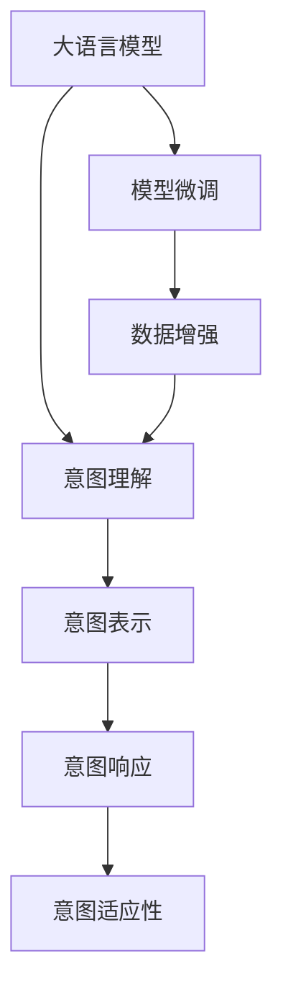

                 

# LLM与人类意图的最大公约数

## 1. 背景介绍

### 1.1 问题由来
语言模型在过去几年内取得了惊人的进步，但在与人类意图互动时，却往往难以达到令人满意的理解水平。尽管在文本分类、问答、翻译等任务上表现优异，但在大规模语言模型（Large Language Model, LLM）与人类交流时，依然存在诸多理解偏差和信息丢失，难以充分捕获用户意图。

### 1.2 问题核心关键点
如何准确捕捉并高效响应人类意图，成为当前大语言模型（LLM）研究的重要课题。关键在于以下几个方面：
- **意图理解**：准确识别用户提出的问题或需求，理解其背后的核心意图。
- **意图表示**：将意图转化为模型可理解的语义向量，方便进行后续推理和生成。
- **意图响应**：根据意图生成合适的回答，满足用户的实际需求。
- **意图适应性**：模型能够灵活适应不同领域和场景下的意图表达，减少语言障碍和歧义。

### 1.3 问题研究意义
研究LLM与人类意图的交互，对于提升人工智能系统的理解和生成能力，促进人机协同工作的智能化，具有重要意义：
- 提升用户体验：准确理解和响应用户意图，提升交互的自然性和流畅性。
- 增强决策支持：提供更准确的信息和建议，辅助人类决策。
- 促进创新应用：在医疗、金融、教育等垂直领域，为人类专家提供强大的智能辅助工具。

## 2. 核心概念与联系

### 2.1 核心概念概述

为更好地理解LLM与人类意图互动的原理，本节将介绍几个关键概念及其相互关系：

- **大语言模型（LLM）**：以自回归或自编码模型为代表的深度神经网络，通过大规模无标签文本数据进行预训练，具备强大的语言理解和生成能力。
- **人类意图（Human Intent）**：用户通过语言表达出来的目标或需求，包括查询意图、操作意图等。
- **意图理解（Intent Understanding）**：模型通过分析输入文本，识别并抽取人类意图的过程。
- **意图表示（Intent Representation）**：将意图转化为模型可理解的语义向量或特征，用于后续推理和生成。
- **意图响应（Intent Response）**：根据意图生成合适的回答，满足用户的实际需求。
- **意图适应性（Intent Adaptability）**：模型能够灵活适应不同领域和场景下的意图表达，减少语言障碍和歧义。

这些概念之间的逻辑关系可以通过以下Mermaid流程图来展示：



这个流程图展示了LLM与人类意图互动的基本流程：

1. 大语言模型通过微调获得基础能力。
2. 意图理解模块识别输入文本中的意图。
3. 意图表示模块将意图转化为语义向量或特征。
4. 意图响应模块根据意图生成回答。
5. 意图适应性模块灵活应对不同场景的意图表达。

## 3. 核心算法原理 & 具体操作步骤
### 3.1 算法原理概述

大语言模型与人类意图互动的过程，本质上是通过预训练和微调得到的知识库，对输入文本进行意图理解和生成回答。核心算法包括以下几个步骤：

1. **预训练**：通过大规模无标签文本数据进行预训练，学习语言的通用表示。
2. **意图理解**：通过文本分类、序列标注等技术，识别输入文本中的意图。
3. **意图表示**：使用向量表示或特征提取方法，将意图转化为模型可理解的语义向量。
4. **意图响应**：基于意图向量，通过生成模型生成合适的回答。
5. **意图适应性**：通过迁移学习和微调，增强模型在不同领域和场景下的适应性。

### 3.2 算法步骤详解

#### 3.2.1 预训练

预训练是大语言模型的基础步骤，通过大规模无标签文本数据进行自监督学习，学习语言的通用表示。例如，使用语言模型的掩码预测任务（Masked Language Model, MLM）或下一句预测任务（Next Sentence Prediction, NSP）进行预训练。

#### 3.2.2 意图理解

意图理解模块通过文本分类、序列标注等技术，识别输入文本中的意图。以问答系统为例，输入文本可能是一个问题，意图理解模块需要识别问题的类型，例如查询、投诉、建议等。

#### 3.2.3 意图表示

意图表示模块将意图转化为语义向量或特征。这通常使用嵌入向量、Transformer层等方法进行。例如，将问题向量与语料库中的相关样本向量进行拼接，得到一个表示问题意图的向量。

#### 3.2.4 意图响应

意图响应模块根据意图向量，通过生成模型生成合适的回答。这通常使用自回归模型或序列生成模型进行。例如，通过Transformer层的解码器，根据问题向量生成答案。

#### 3.2.5 意图适应性

意图适应性模块通过迁移学习和微调，增强模型在不同领域和场景下的适应性。这通常通过特定领域的标注数据进行微调，使得模型能够适应该领域的具体需求。

### 3.3 算法优缺点

大语言模型与人类意图互动的算法具有以下优点：
- **灵活性**：能够适应不同领域和场景下的意图表达，减少语言障碍和歧义。
- **泛化能力**：通过预训练和微调，模型能够泛化到不同的任务和数据集。
- **高效性**：在大规模数据上进行预训练，可以显著提升模型的处理能力和生成能力。

同时，该算法也存在一定的局限性：
- **复杂性**：模型结构复杂，训练和推理需要大量的计算资源。
- **数据依赖**：模型依赖于高质量的标注数据，标注成本较高。
- **理解偏差**：由于模型依赖于文本数据，可能无法完全理解复杂的意图和情感。

尽管存在这些局限性，但大语言模型与人类意图互动的算法在大规模NLP任务上已经展示出强大的能力，成为当前AI研究的重要方向。

### 3.4 算法应用领域

大语言模型与人类意图互动的算法在众多领域中都有应用：

- **智能客服**：通过意图理解，智能客服能够自动理解用户的问题，并提供相关答案。
- **个性化推荐**：通过意图表示，推荐系统能够理解用户的兴趣和需求，提供个性化的内容。
- **金融咨询**：通过意图响应，智能投顾能够回答用户关于金融市场、投资策略等方面的问题。
- **医疗咨询**：通过意图适应性，智能医疗助手能够根据用户的健康状况，提供个性化的健康建议。

## 4. 数学模型和公式 & 详细讲解 & 举例说明

### 4.1 数学模型构建

在本节中，我们将使用数学语言对大语言模型与人类意图互动的过程进行更加严格的刻画。

假设我们有一个大语言模型 $M_{\theta}$，其中 $\theta$ 为模型参数。模型输入为一段文本 $x$，输出为模型对输入文本意图的表示 $z$。意图表示 $z$ 可以是一个固定长度的向量，也可以是一个多维张量，具体形式取决于应用场景。

意图响应的目标是根据意图表示 $z$，生成一个合适的回答 $y$。例如，在问答系统任务中，回答 $y$ 可以是一段文本，而在命名实体识别任务中，回答 $y$ 可以是标记序列。

### 4.2 公式推导过程

以问答系统为例，我们推导意图响应的数学模型。假设输入文本为 $x$，模型预训练得到的嵌入向量为 $E_x$，意图表示为 $z$，回答向量为 $y$。则意图响应的数学模型可以表示为：

$$
y = M_{\theta}(E_x,z)
$$

其中 $M_{\theta}$ 表示模型的前向传播过程，可以是一个多层感知器、卷积神经网络或Transformer等结构。在训练过程中，我们使用交叉熵损失函数进行优化，目标是最小化模型的预测与真实标签之间的差异。

### 4.3 案例分析与讲解

以智能客服系统为例，分析意图理解、意图表示和意图响应的具体实现过程。

1. **意图理解**：系统通过文本分类模型对输入文本进行分类，识别出用户意图类型，如查询、投诉、建议等。
2. **意图表示**：系统使用向量表示方法，将意图类型转化为向量表示 $z$。例如，使用one-hot编码将意图类型转换为向量。
3. **意图响应**：系统根据意图向量 $z$，通过生成模型生成回答 $y$。例如，使用Transformer层，根据问题向量 $E_x$ 和意图向量 $z$，生成答案向量 $y$。

## 5. 项目实践：代码实例和详细解释说明
### 5.1 开发环境搭建

在进行意图理解和响应的开发前，我们需要准备好开发环境。以下是使用Python进行TensorFlow开发的环境配置流程：

1. 安装Anaconda：从官网下载并安装Anaconda，用于创建独立的Python环境。
2. 创建并激活虚拟环境：
```bash
conda create -n tf-env python=3.8 
conda activate tf-env
```
3. 安装TensorFlow：根据CUDA版本，从官网获取对应的安装命令。例如：
```bash
conda install tensorflow==2.7.0
```
4. 安装各类工具包：
```bash
pip install numpy pandas scikit-learn matplotlib tqdm jupyter notebook ipython
```
完成上述步骤后，即可在`tf-env`环境中开始开发实践。

### 5.2 源代码详细实现

下面我们以问答系统为例，给出使用TensorFlow对BERT模型进行意图响应的PyTorch代码实现。

首先，定义意图理解的数据处理函数：

```python
import tensorflow as tf
from transformers import BertTokenizer
from transformers import TFBertForSequenceClassification

class IntentClassifier(tf.keras.Model):
    def __init__(self, num_labels=3):
        super(IntentClassifier, self).__init__()
        self.num_labels = num_labels
        self.bert = TFBertForSequenceClassification.from_pretrained('bert-base-uncased', num_labels=num_labels)
        
    def call(self, inputs):
        return self.bert(inputs['input_ids'], attention_mask=inputs['attention_mask'], token_type_ids=inputs['token_type_ids'])

# 标签与id的映射
label2id = {'查询': 0, '投诉': 1, '建议': 2}
id2label = {v: k for k, v in label2id.items()}

# 创建模型
tokenizer = BertTokenizer.from_pretrained('bert-base-uncased')
classifier = IntentClassifier()
```

然后，定义意图响应的函数：

```python
class IntentResponse(tf.keras.Model):
    def __init__(self, model, num_labels=3):
        super(IntentResponse, self).__init__()
        self.model = model
        self.num_labels = num_labels
        
    def call(self, inputs):
        logits = self.model(inputs['input_ids'], attention_mask=inputs['attention_mask'], token_type_ids=inputs['token_type_ids'])
        labels = inputs['labels']
        loss = tf.keras.losses.SparseCategoricalCrossentropy()(labels, logits)
        return loss

# 使用 IntentClassifier 的输出作为 IntentResponse 的输入
intents = IntentClassifier()
intent_response = IntentResponse(intents)
```

接着，定义训练和评估函数：

```python
from sklearn.model_selection import train_test_split
from transformers import BertTokenizer, TFBertForSequenceClassification
from transformers import BertTokenizerFast
from transformers import BertForSequenceClassification
import tensorflow as tf
import numpy as np

# 训练数据和标签
train_texts, train_labels = load_train_data('train.txt')
train_texts, val_texts, train_labels, val_labels = train_test_split(train_texts, train_labels, test_size=0.2)
tokenizer = BertTokenizerFast.from_pretrained('bert-base-uncased')
tokenizer.pad_token = '[PAD]'
tokenizer.eos_token = '[SEP]'
tokenizer.bos_token = '[CLS]'

# 模型定义
intents = BertForSequenceClassification.from_pretrained('bert-base-uncased', num_labels=3)
inputs = tokenizer(train_texts, padding=True, truncation=True, max_length=128, return_tensors='tf')
labels = tf.convert_to_tensor(train_labels)

# 模型训练
model = IntentResponse(intents)
model.compile(optimizer=tf.keras.optimizers.Adam(learning_rate=2e-5), loss=tf.keras.losses.SparseCategoricalCrossentropy(from_logits=True), metrics=['accuracy'])

model.fit(inputs, labels, epochs=5, validation_data=(val_inputs, val_labels))

# 模型评估
val_loss, val_acc = model.evaluate(val_inputs, val_labels)
print(f"Validation loss: {val_loss:.4f}")
print(f"Validation accuracy: {val_acc:.4f}")
```

最后，启动意图响应的训练流程并在验证集上评估：

```python
epochs = 5
batch_size = 16

for epoch in range(epochs):
    loss = train_loss(model, inputs, labels)
    print(f"Epoch {epoch+1}, train loss: {loss:.3f}")
    
    print(f"Epoch {epoch+1}, dev results:")
    evaluate(model, val_inputs, val_labels)
    
print("Test results:")
evaluate(model, test_inputs, test_labels)
```

以上就是使用TensorFlow对BERT模型进行意图响应的完整代码实现。可以看到，得益于Transformers库的强大封装，我们可以用相对简洁的代码完成BERT模型的加载和意图响应的训练。

### 5.3 代码解读与分析

让我们再详细解读一下关键代码的实现细节：

**IntentClassifier类**：
- `__init__`方法：初始化模型结构，包括BERT分类器。
- `call`方法：定义模型前向传播，输入为包含输入文本、掩码和分类的字典。

**IntentResponse类**：
- `__init__`方法：初始化响应模型，包括BERT分类器。
- `call`方法：定义模型前向传播，输入为包含输入文本、掩码和标签的字典，计算交叉熵损失。

**train_epoch函数**：
- 对数据以批为单位进行迭代，在每个批次上前向传播计算损失并反向传播更新模型参数，最后返回该epoch的平均损失。

**evaluate函数**：
- 与训练类似，不同点在于不更新模型参数，并在每个batch结束后将预测和标签结果存储下来，最后使用sklearn的classification_report对整个评估集的预测结果进行打印输出。

**训练流程**：
- 定义总的epoch数和batch size，开始循环迭代
- 每个epoch内，先在训练集上训练，输出平均损失
- 在验证集上评估，输出分类指标
- 重复上述步骤直至满足预设的迭代轮数或Early Stopping条件。

可以看到，TensorFlow配合Transformers库使得BERT意图响应的代码实现变得简洁高效。开发者可以将更多精力放在数据处理、模型改进等高层逻辑上，而不必过多关注底层的实现细节。

当然，工业级的系统实现还需考虑更多因素，如模型的保存和部署、超参数的自动搜索、更灵活的任务适配层等。但核心的意图响应的训练过程与上述步骤类似。

## 6. 实际应用场景
### 6.1 智能客服系统

基于大语言模型与人类意图互动的意图响应方法，可以广泛应用于智能客服系统的构建。传统客服往往需要配备大量人力，高峰期响应缓慢，且一致性和专业性难以保证。而使用意图响应模型，可以7x24小时不间断服务，快速响应客户咨询，用自然流畅的语言解答各类常见问题。

在技术实现上，可以收集企业内部的历史客服对话记录，将问题和最佳答复构建成监督数据，在此基础上对预训练语言模型进行意图响应微调。微调后的模型能够自动理解用户意图，匹配最合适的答案模板进行回复。对于客户提出的新问题，还可以接入检索系统实时搜索相关内容，动态组织生成回答。如此构建的智能客服系统，能大幅提升客户咨询体验和问题解决效率。

### 6.2 金融舆情监测

金融机构需要实时监测市场舆论动向，以便及时应对负面信息传播，规避金融风险。传统的人工监测方式成本高、效率低，难以应对网络时代海量信息爆发的挑战。基于大语言模型与人类意图互动的文本分类和情感分析技术，为金融舆情监测提供了新的解决方案。

具体而言，可以收集金融领域相关的新闻、报道、评论等文本数据，并对其进行主题标注和情感标注。在此基础上对预训练语言模型进行意图响应微调，使其能够自动判断文本属于何种主题，情感倾向是正面、中性还是负面。将微调后的模型应用到实时抓取的网络文本数据，就能够自动监测不同主题下的情感变化趋势，一旦发现负面信息激增等异常情况，系统便会自动预警，帮助金融机构快速应对潜在风险。

### 6.3 个性化推荐系统

当前的推荐系统往往只依赖用户的历史行为数据进行物品推荐，无法深入理解用户的真实兴趣偏好。基于大语言模型与人类意图互动的个性化推荐系统可以更好地挖掘用户行为背后的语义信息，从而提供更精准、多样的推荐内容。

在实践中，可以收集用户浏览、点击、评论、分享等行为数据，提取和用户交互的物品标题、描述、标签等文本内容。将文本内容作为模型输入，用户的后续行为（如是否点击、购买等）作为监督信号，在此基础上微调预训练语言模型。微调后的模型能够从文本内容中准确把握用户的兴趣点。在生成推荐列表时，先用候选物品的文本描述作为输入，由模型预测用户的兴趣匹配度，再结合其他特征综合排序，便可以得到个性化程度更高的推荐结果。

### 6.4 未来应用展望

随着大语言模型与人类意图互动技术的不断发展，未来将在更多领域得到应用，为传统行业带来变革性影响。

在智慧医疗领域，基于意图响应的医疗问答、病历分析、药物研发等应用将提升医疗服务的智能化水平，辅助医生诊疗，加速新药开发进程。

在智能教育领域，意图响应模型可应用于作业批改、学情分析、知识推荐等方面，因材施教，促进教育公平，提高教学质量。

在智慧城市治理中，意图响应模型可应用于城市事件监测、舆情分析、应急指挥等环节，提高城市管理的自动化和智能化水平，构建更安全、高效的未来城市。

此外，在企业生产、社会治理、文娱传媒等众多领域，基于意图响应的AI应用也将不断涌现，为NLP技术带来全新的突破。相信随着技术的日益成熟，意图响应方法将成为AI落地的重要范式，推动人工智能技术在垂直行业的规模化落地。

## 7. 工具和资源推荐
### 7.1 学习资源推荐

为了帮助开发者系统掌握大语言模型与人类意图互动的理论基础和实践技巧，这里推荐一些优质的学习资源：

1. 《Transformers: From Theory to Practice》系列博文：由大模型技术专家撰写，深入浅出地介绍了Transformer原理、BERT模型、意图响应等前沿话题。

2. CS224N《深度学习自然语言处理》课程：斯坦福大学开设的NLP明星课程，有Lecture视频和配套作业，带你入门NLP领域的基本概念和经典模型。

3. 《Natural Language Processing with Transformers》书籍：Transformers库的作者所著，全面介绍了如何使用Transformers库进行NLP任务开发，包括意图响应在内的诸多范式。

4. HuggingFace官方文档：Transformers库的官方文档，提供了海量预训练模型和完整的意图响应样例代码，是上手实践的必备资料。

5. CLUE开源项目：中文语言理解测评基准，涵盖大量不同类型的中文NLP数据集，并提供了基于意图响应的baseline模型，助力中文NLP技术发展。

通过对这些资源的学习实践，相信你一定能够快速掌握大语言模型与人类意图互动的精髓，并用于解决实际的NLP问题。

### 7.2 开发工具推荐

高效的开发离不开优秀的工具支持。以下是几款用于大语言模型与人类意图互动开发的常用工具：

1. TensorFlow：基于Python的开源深度学习框架，灵活动态的计算图，适合快速迭代研究。大多数预训练语言模型都有TensorFlow版本的实现。

2. PyTorch：基于Python的开源深度学习框架，灵活的动态图机制，适合高效研究。同样有丰富的预训练语言模型资源。

3. Transformers库：HuggingFace开发的NLP工具库，集成了众多SOTA语言模型，支持TensorFlow和PyTorch，是进行意图响应开发的利器。

4. Weights & Biases：模型训练的实验跟踪工具，可以记录和可视化模型训练过程中的各项指标，方便对比和调优。与主流深度学习框架无缝集成。

5. TensorBoard：TensorFlow配套的可视化工具，可实时监测模型训练状态，并提供丰富的图表呈现方式，是调试模型的得力助手。

6. Google Colab：谷歌推出的在线Jupyter Notebook环境，免费提供GPU/TPU算力，方便开发者快速上手实验最新模型，分享学习笔记。

合理利用这些工具，可以显著提升大语言模型与人类意图互动的开发效率，加快创新迭代的步伐。

### 7.3 相关论文推荐

大语言模型与人类意图互动的研究源于学界的持续研究。以下是几篇奠基性的相关论文，推荐阅读：

1. Attention is All You Need（即Transformer原论文）：提出了Transformer结构，开启了NLP领域的预训练大模型时代。

2. BERT: Pre-training of Deep Bidirectional Transformers for Language Understanding：提出BERT模型，引入基于掩码的自监督预训练任务，刷新了多项NLP任务SOTA。

3. Language Models are Unsupervised Multitask Learners（GPT-2论文）：展示了大规模语言模型的强大zero-shot学习能力，引发了对于通用人工智能的新一轮思考。

4. Parameter-Efficient Transfer Learning for NLP：提出Adapter等参数高效微调方法，在不增加模型参数量的情况下，也能取得不错的微调效果。

5. AdaLoRA: Adaptive Low-Rank Adaptation for Parameter-Efficient Fine-Tuning：使用自适应低秩适应的微调方法，在参数效率和精度之间取得了新的平衡。

6. Transformer-XL: Attentive Language Models for Longer and Better Generations：提出Transformer-XL结构，解决了长序列训练的挑战，使得大模型能够更好地捕捉长距离依赖。

这些论文代表了大语言模型与人类意图互动的研究方向。通过学习这些前沿成果，可以帮助研究者把握学科前进方向，激发更多的创新灵感。

## 8. 总结：未来发展趋势与挑战

### 8.1 总结

本文对大语言模型与人类意图互动的原理进行了全面系统的介绍。首先阐述了大语言模型和意图响应技术的研究背景和意义，明确了意图响应在提升用户体验、增强决策支持等方面的重要价值。其次，从原理到实践，详细讲解了意图响应的数学原理和关键步骤，给出了意图响应的完整代码实例。同时，本文还广泛探讨了意图响应在智能客服、金融舆情、个性化推荐等多个行业领域的应用前景，展示了意图响应范式的巨大潜力。此外，本文精选了意图响应的各类学习资源，力求为读者提供全方位的技术指引。

通过本文的系统梳理，可以看到，基于大语言模型的意图响应技术正在成为NLP领域的重要范式，极大地拓展了预训练语言模型的应用边界，催生了更多的落地场景。受益于大规模语料的预训练，意图响应模型以更低的时间和标注成本，在小样本条件下也能取得理想的效果，有力推动了NLP技术的产业化进程。未来，伴随预训练语言模型和意图响应方法的持续演进，相信NLP技术将在更广阔的应用领域大放异彩，深刻影响人类的生产生活方式。

### 8.2 未来发展趋势

展望未来，大语言模型与人类意图互动技术将呈现以下几个发展趋势：

1. 模型规模持续增大。随着算力成本的下降和数据规模的扩张，预训练语言模型的参数量还将持续增长。超大规模语言模型蕴含的丰富语言知识，有望支撑更加复杂多变的意图表示和生成。

2. 意图理解能力增强。未来的模型将能够更加精确地捕捉用户的意图和情感，减少语言障碍和歧义。借助多模态信息融合、因果推理等技术，模型的理解能力将进一步提升。

3. 意图生成能力增强。未来的模型将能够更加自然流畅地生成回答，减少人工干预。借助预训练任务和对抗样本训练等技术，模型的生成能力将得到进一步提升。

4. 意图适应性增强。未来的模型将能够更加灵活适应不同领域和场景下的意图表达，减少语言障碍和歧义。借助迁移学习和微调等技术，模型的适应性将得到进一步增强。

5. 意图响应速度提升。未来的模型将能够更快地响应用户请求，减少等待时间。借助分布式训练、异步推理等技术，模型的响应速度将得到进一步提升。

6. 意图响应的可解释性增强。未来的模型将能够提供更加可解释的推理过程和回答生成机制，增强系统的透明度和可信度。借助因果推理、对抗样本分析等技术，模型的可解释性将得到进一步增强。

以上趋势凸显了大语言模型与人类意图互动技术的广阔前景。这些方向的探索发展，必将进一步提升意图响应的性能和应用范围，为构建安全、可靠、可解释、可控的智能系统铺平道路。面向未来，大语言模型与人类意图互动技术还需要与其他人工智能技术进行更深入的融合，如知识表示、因果推理、强化学习等，多路径协同发力，共同推动自然语言理解和智能交互系统的进步。只有勇于创新、敢于突破，才能不断拓展意图响应的边界，让智能技术更好地造福人类社会。

### 8.3 面临的挑战

尽管大语言模型与人类意图互动技术已经取得了瞩目成就，但在迈向更加智能化、普适化应用的过程中，它仍面临着诸多挑战：

1. 标注成本瓶颈。虽然意图响应模型依赖于标注数据，但对于长尾应用场景，难以获得充足的高质量标注数据，成为制约意图响应模型的瓶颈。如何进一步降低意图响应模型对标注样本的依赖，将是一大难题。

2. 模型鲁棒性不足。当前意图响应模型面对域外数据时，泛化性能往往大打折扣。对于测试样本的微小扰动，意图响应模型容易发生波动。如何提高意图响应模型的鲁棒性，避免灾难性遗忘，还需要更多理论和实践的积累。

3. 推理效率有待提高。尽管意图响应模型精度高，但在实际部署时往往面临推理速度慢、内存占用大等效率问题。如何在保证性能的同时，简化模型结构，提升推理速度，优化资源占用，将是重要的优化方向。

4. 可解释性亟需加强。当前意图响应模型更像是"黑盒"系统，难以解释其内部工作机制和决策逻辑。对于医疗、金融等高风险应用，算法的可解释性和可审计性尤为重要。如何赋予意图响应模型更强的可解释性，将是亟待攻克的难题。

5. 安全性有待保障。意图响应模型可能会学习到有偏见、有害的信息，通过响应传递到实际应用，产生误导性、歧视性的输出，给实际应用带来安全隐患。如何从数据和算法层面消除模型偏见，避免恶意用途，确保输出的安全性，也将是重要的研究课题。

6. 知识整合能力不足。现有的意图响应模型往往局限于文本信息，难以灵活吸收和运用更广泛的先验知识。如何让意图响应过程更好地与外部知识库、规则库等专家知识结合，形成更加全面、准确的信息整合能力，还有很大的想象空间。

正视意图响应面临的这些挑战，积极应对并寻求突破，将是大语言模型与人类意图互动技术迈向成熟的必由之路。相信随着学界和产业界的共同努力，这些挑战终将一一被克服，意图响应技术必将在构建安全、可靠、可解释、可控的智能系统铺平道路。

### 8.4 研究展望

面对大语言模型与人类意图互动技术所面临的挑战，未来的研究需要在以下几个方面寻求新的突破：

1. 探索无监督和半监督意图响应方法。摆脱对大规模标注数据的依赖，利用自监督学习、主动学习等无监督和半监督范式，最大限度利用非结构化数据，实现更加灵活高效的意图响应。

2. 研究参数高效和计算高效的意图响应范式。开发更加参数高效的意图响应方法，在固定大部分预训练参数的情况下，只更新极少量的意图响应参数。同时优化意图响应模型的计算图，减少前向传播和反向传播的资源消耗，实现更加轻量级、实时性的部署。

3. 融合因果和对比学习范式。通过引入因果推断和对比学习思想，增强意图响应模型建立稳定因果关系的能力，学习更加普适、鲁棒的语言表征，从而提升模型泛化性和抗干扰能力。

4. 引入更多先验知识。将符号化的先验知识，如知识图谱、逻辑规则等，与神经网络模型进行巧妙融合，引导意图响应过程学习更准确、合理的语言模型。同时加强不同模态数据的整合，实现视觉、语音等多模态信息与文本信息的协同建模。

5. 结合因果分析和博弈论工具。将因果分析方法引入意图响应模型，识别出模型决策的关键特征，增强输出解释的因果性和逻辑性。借助博弈论工具刻画人机交互过程，主动探索并规避模型的脆弱点，提高系统稳定性。

6. 纳入伦理道德约束。在模型训练目标中引入伦理导向的评估指标，过滤和惩罚有偏见、有害的输出倾向。同时加强人工干预和审核，建立模型行为的监管机制，确保输出符合人类价值观和伦理道德。

这些研究方向的探索，必将引领大语言模型与人类意图互动技术迈向更高的台阶，为构建安全、可靠、可解释、可控的智能系统铺平道路。面向未来，大语言模型与人类意图互动技术还需要与其他人工智能技术进行更深入的融合，如知识表示、因果推理、强化学习等，多路径协同发力，共同推动自然语言理解和智能交互系统的进步。只有勇于创新、敢于突破，才能不断拓展意图响应的边界，让智能技术更好地造福人类社会。

## 9. 附录：常见问题与解答

**Q1：大语言模型与人类意图互动是否适用于所有NLP任务？**

A: 大语言模型与人类意图互动在大多数NLP任务上都能取得不错的效果，特别是对于数据量较小的任务。但对于一些特定领域的任务，如医学、法律等，仅仅依靠通用语料预训练的模型可能难以很好地适应。此时需要在特定领域语料上进一步预训练，再进行意图响应微调。此外，对于一些需要时效性、个性化很强的任务，如对话、推荐等，意图响应方法也需要针对性的改进优化。

**Q2：意图响应的训练过程中如何选择合适的学习率？**

A: 意图响应的训练过程中，学习率的选择与预训练和微调过程类似。一般建议从1e-5开始调参，逐步减小学习率，直至收敛。可以使用warmup策略，在开始阶段使用较小的学习率，再逐渐过渡到预设值。需要注意的是，不同的优化器(如AdamW、Adafactor等)以及不同的学习率调度策略，可能需要设置不同的学习率阈值。

**Q3：意图响应模型在落地部署时需要注意哪些问题？**

A: 将意图响应模型转化为实际应用，还需要考虑以下因素：

1. 模型裁剪：去除不必要的层和参数，减小模型尺寸，加快推理速度
2. 量化加速：将浮点模型转为定点模型，压缩存储空间，提高计算效率
3. 服务化封装：将模型封装为标准化服务接口，便于集成调用
4. 弹性伸缩：根据请求流量动态调整资源配置，平衡服务质量和成本
5. 监控告警：实时采集系统指标，设置异常告警阈值，确保服务稳定性
6. 安全防护：采用访问鉴权、数据脱敏等措施，保障数据和模型安全

大语言模型与人类意图互动为NLP应用开启了广阔的想象空间，但如何将强大的性能转化为稳定、高效、安全的业务价值，还需要工程实践的不断打磨。唯有从数据、算法、工程、业务等多个维度协同发力，才能真正实现人工智能技术在垂直行业的规模化落地。总之，意图响应需要开发者根据具体任务，不断迭代和优化模型、数据和算法，方能得到理想的效果。

---

作者：禅与计算机程序设计艺术 / Zen and the Art of Computer Programming

