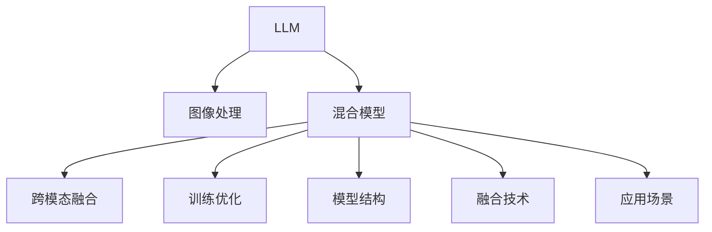

                 

# LLM与传统图像处理技术的融合：视觉智能新时代

> 关键词：大语言模型(LLM), 视觉智能, 图像处理, 深度学习, 混合模型, 融合技术, 图像分类, 目标检测

## 1. 背景介绍

### 1.1 问题由来
近年来，人工智能(AI)技术迅猛发展，以深度学习为核心的视觉智能领域取得了巨大突破。然而，传统的图像处理技术，如手工特征工程、像素级操作等，依然在视觉任务中占据主导地位。

与此同时，自然语言处理(NLP)领域的大语言模型(LLM)技术也取得了革命性的进展。LLM通过大量无标签文本数据的预训练，学习到了丰富的语言知识和常识，展现出令人惊叹的泛化能力和理解能力。

将LLM与传统图像处理技术相结合，通过混合模型的方式，可以实现优势互补，进一步提升视觉智能系统的性能。然而，这种融合范式面临诸多挑战，如模型结构设计、跨模态信息融合、训练优化等。

### 1.2 问题核心关键点
为了解决以上问题，本文将深入探讨LLM与传统图像处理技术的融合方法，包括：
1. 混合模型架构设计：如何通过结构化方式将LLM与图像处理模型结合。
2. 跨模态信息融合：如何将LLM和图像数据融合处理，提取更高层次的视觉语义信息。
3. 训练优化方法：如何优化混合模型的训练过程，提升模型性能。

## 2. 核心概念与联系

### 2.1 核心概念概述

为更好地理解LLM与传统图像处理技术的融合方法，本节将介绍几个密切相关的核心概念：

- 大语言模型(LLM)：以自回归(如GPT)或自编码(如BERT)模型为代表的大规模预训练语言模型。通过在大规模无标签文本语料上进行预训练，学习通用的语言表示，具备强大的语言理解和生成能力。

- 视觉智能：将深度学习应用于图像处理任务，实现图像分类、目标检测、语义分割等视觉任务的技术。

- 混合模型：将LLM与视觉智能模型结合，通过跨模态信息融合，实现更高级别的视觉语义理解。

- 跨模态信息融合：通过将图像、文本等多模态信息进行结合，提取更高层次的语义信息。

- 图像处理技术：传统的像素级操作、特征提取等图像处理技术，包括传统CNN、RNN等深度学习架构。

- 深度学习：一种通过神经网络进行复杂模型训练的技术，通过多层非线性变换实现模式识别和分类。

这些核心概念之间的逻辑关系可以通过以下Mermaid流程图来展示：



这个流程图展示了大语言模型与传统图像处理技术融合的核心概念及其之间的关系：

1. 大语言模型通过预训练获得基础能力。
2. 图像处理技术进行视觉特征提取。
3. 混合模型将LLM与图像特征结合，提取语义信息。
4. 跨模态融合实现多模态信息整合。
5. 训练优化提升模型性能。
6. 结构化模型设计。
7. 融合技术实现多模态信息融合。
8. 应用场景涵盖图像分类、目标检测等。

这些概念共同构成了LLM与传统图像处理技术融合的理论框架，使其能够在各种视觉任务中发挥强大的语义理解能力。通过理解这些核心概念，我们可以更好地把握融合技术的工作原理和优化方向。

## 3. 核心算法原理 & 具体操作步骤
### 3.1 算法原理概述

大语言模型与传统图像处理技术的融合，本质上是一种跨模态学习过程。其核心思想是：将LLM与图像处理模型结合，利用LLM的语言理解能力，对图像数据进行语义注解，并结合传统图像处理技术的优势，提取更高级别的视觉语义信息。

形式化地，假设LLM模型为 $M_{\text{LLM}}:\mathcal{X} \rightarrow \mathcal{Y}$，其中 $\mathcal{X}$ 为输入空间，$\mathcal{Y}$ 为输出空间，$x \in \mathcal{X}$ 为图像输入，$y \in \mathcal{Y}$ 为图像对应的语义标签。假设图像处理模型为 $M_{\text{img}}:\mathcal{X} \rightarrow \mathcal{Z}$，其中 $\mathcal{Z}$ 为特征空间。

将 $M_{\text{img}}$ 提取的特征 $z \in \mathcal{Z}$ 作为 $M_{\text{LLM}}$ 的输入，得到对应的语义标签 $y \in \mathcal{Y}$。通过反向传播更新 $M_{\text{LLM}}$ 的参数，最小化损失函数 $\mathcal{L}(\theta)$，使得模型输出逼近真实标签。

### 3.2 算法步骤详解

基于混合模型的融合方法，通常包括以下几个关键步骤：

**Step 1: 准备预训练模型和数据集**
- 选择合适的预训练语言模型 $M_{\text{LLM}}$ 和图像处理模型 $M_{\text{img}}$，如BERT、GPT、ResNet等。
- 准备图像处理任务的数据集 $D_{\text{img}}=\{(x_i,y_i)\}_{i=1}^N$，其中 $x_i$ 为图像，$y_i$ 为图像对应的语义标签。

**Step 2: 融合模型结构**
- 设计混合模型结构，将 $M_{\text{img}}$ 提取的特征 $z$ 作为 $M_{\text{LLM}}$ 的输入。例如，在图像分类任务中，可以使用图片-文本跨模态图(visual-textual cross-modal graph)结构，将图像特征和语义标签连接，传递到LLM模型进行处理。

**Step 3: 添加任务适配层**
- 根据图像处理任务的类型，在 $M_{\text{LLM}}$ 的顶层设计合适的输出层和损失函数。例如，对于图像分类任务，通常在顶层添加分类器，交叉熵损失函数。

**Step 4: 设置混合模型训练策略**
- 选择合适的优化器及其参数，如Adam、SGD等，设置学习率、批大小、迭代轮数等。
- 设置正则化技术及强度，包括权重衰减、Dropout、Early Stopping等。
- 确定冻结预训练参数的策略，如仅微调顶层，或全部参数都参与微调。

**Step 5: 执行梯度训练**
- 将训练集数据分批次输入混合模型，前向传播计算损失函数。
- 反向传播计算参数梯度，根据设定的优化算法和学习率更新模型参数。
- 周期性在验证集上评估模型性能，根据性能指标决定是否触发 Early Stopping。
- 重复上述步骤直到满足预设的迭代轮数或 Early Stopping 条件。

**Step 6: 测试和部署**
- 在测试集上评估混合模型 $M_{\hat{\theta}}$ 的性能，对比预训练和微调后的精度提升。
- 使用混合模型对新样本进行推理预测，集成到实际的应用系统中。

以上是混合模型融合的基本流程。在实际应用中，还需要针对具体任务的特点，对混合模型进行优化设计，如改进特征提取器，引入更多的正则化技术，搜索最优的超参数组合等，以进一步提升模型性能。

### 3.3 算法优缺点

混合模型融合具有以下优点：
1. 综合利用LLM和图像处理技术的优势，提取高层次的视觉语义信息。
2. 提高模型的泛化能力，提升在不同任务上的表现。
3. 通过语言描述增强模型对复杂场景的理解。

同时，该方法也存在一定的局限性：
1. 模型规模较大，需要更多的计算资源和存储空间。
2. 融合模型的训练和优化复杂度较高，需要更多的调参和实验。
3. 跨模态信息融合的算法和技术较为复杂，需要更多的研究。

尽管存在这些局限性，但混合模型融合依然是当前最有效的视觉智能技术之一，其带来的性能提升和应用潜力不容忽视。

### 3.4 算法应用领域

混合模型融合技术在视觉智能领域已经得到了广泛的应用，覆盖了几乎所有常见的图像处理任务，例如：

- 图像分类：如图像识别、场景分类等。通过融合模型学习图像与语义标签的映射关系。
- 目标检测：如物体检测、行人重识别等。通过融合模型定位物体并提取语义信息。
- 语义分割：如语义图分割、实例分割等。通过融合模型对图像进行语义分割。
- 实例分割：如物体质感识别、姿态估计等。通过融合模型对图像进行实例级别的语义理解。

除了上述这些经典任务外，混合模型融合技术还被创新性地应用于更多场景中，如视频理解、姿态分析、手势识别等，为视觉智能技术带来了全新的突破。

## 4. 数学模型和公式 & 详细讲解 & 举例说明
### 4.1 数学模型构建

本节将使用数学语言对LLM与传统图像处理技术的融合过程进行更加严格的刻画。

记预训练语言模型为 $M_{\text{LLM}}:\mathcal{X} \rightarrow \mathcal{Y}$，图像处理模型为 $M_{\text{img}}:\mathcal{X} \rightarrow \mathcal{Z}$，其中 $\mathcal{X}$ 为输入空间，$\mathcal{Y}$ 为语言输出空间，$\mathcal{Z}$ 为特征空间。假设图像分类任务的数据集为 $D_{\text{img}}=\{(x_i,y_i)\}_{i=1}^N$，其中 $x_i \in \mathcal{X}$ 为图像，$y_i \in \mathcal{Y}$ 为图像分类标签。

定义混合模型为 $M_{\hat{\theta}}$，融合模型输出为 $y_{\hat{\theta}} = M_{\hat{\theta}}(x_i)$。则在数据集 $D_{\text{img}}$ 上的经验风险为：

$$
\mathcal{L}(\theta) = \frac{1}{N} \sum_{i=1}^N \ell(y_i, y_{\hat{\theta}})
$$

其中 $\ell$ 为损失函数，例如交叉熵损失函数。通过反向传播算法计算梯度，更新模型参数 $\theta$。

### 4.2 公式推导过程

以下我们以图像分类任务为例，推导混合模型的交叉熵损失函数及其梯度的计算公式。

假设混合模型 $M_{\hat{\theta}}$ 在图像输入 $x$ 上的输出为 $\hat{y} = M_{\hat{\theta}}(x) \in \mathcal{Y}$，表示图像对应的语义标签。真实标签 $y \in \mathcal{Y}$。则二分类交叉熵损失函数定义为：

$$
\ell(M_{\hat{\theta}}(x),y) = -[y\log \hat{y} + (1-y)\log (1-\hat{y})]
$$

将其代入经验风险公式，得：

$$
\mathcal{L}(\theta) = -\frac{1}{N}\sum_{i=1}^N [y_i\log M_{\hat{\theta}}(x_i)+(1-y_i)\log(1-M_{\hat{\theta}}(x_i))]
$$

根据链式法则，损失函数对参数 $\theta$ 的梯度为：

$$
\frac{\partial \mathcal{L}(\theta)}{\partial \theta} = -\frac{1}{N}\sum_{i=1}^N (\frac{y_i}{M_{\hat{\theta}}(x_i)}-\frac{1-y_i}{1-M_{\hat{\theta}}(x_i)}) \frac{\partial M_{\hat{\theta}}(x_i)}{\partial \theta}
$$

其中 $\frac{\partial M_{\hat{\theta}}(x_i)}{\partial \theta}$ 可进一步递归展开，利用自动微分技术完成计算。

在得到损失函数的梯度后，即可带入参数更新公式，完成模型的迭代优化。重复上述过程直至收敛，最终得到适应图像分类任务的最优模型参数 $\theta^*$。

## 5. 项目实践：代码实例和详细解释说明
### 5.1 开发环境搭建

在进行混合模型融合实践前，我们需要准备好开发环境。以下是使用Python进行PyTorch开发的环境配置流程：

1. 安装Anaconda：从官网下载并安装Anaconda，用于创建独立的Python环境。

2. 创建并激活虚拟环境：
```bash
conda create -n pytorch-env python=3.8 
conda activate pytorch-env
```

3. 安装PyTorch：根据CUDA版本，从官网获取对应的安装命令。例如：
```bash
conda install pytorch torchvision torchaudio cudatoolkit=11.1 -c pytorch -c conda-forge
```

4. 安装Transformer库：
```bash
pip install transformers
```

5. 安装各类工具包：
```bash
pip install numpy pandas scikit-learn matplotlib tqdm jupyter notebook ipython
```

完成上述步骤后，即可在`pytorch-env`环境中开始混合模型融合实践。

### 5.2 源代码详细实现

这里我们以图像分类任务为例，给出使用PyTorch实现混合模型融合的代码实现。

首先，定义图像分类任务的数据处理函数：

```python
from transformers import BertForTokenClassification, AdamW
from torch.utils.data import Dataset, DataLoader
import torch
import numpy as np
from PIL import Image
from torchvision.transforms import ToTensor, Normalize, Compose
import torchvision.models as models

class ImageDataset(Dataset):
    def __init__(self, image_files, labels, tokenizer, max_len=128):
        self.image_files = image_files
        self.labels = labels
        self.tokenizer = tokenizer
        self.max_len = max_len

    def __len__(self):
        return len(self.image_files)

    def __getitem__(self, idx):
        image_path = self.image_files[idx]
        label = self.labels[idx]

        image = Image.open(image_path)
        transform = Compose([ToTensor(), Normalize(mean=[0.485, 0.456, 0.406], std=[0.229, 0.224, 0.225])])
        image_tensor = transform(image).unsqueeze(0)

        # 将图像转换成特征向量
        feature_extractor = models.resnet18()
        features = feature_extractor(image_tensor)

        # 将特征和标签组成模型输入
        encoding = self.tokenizer(features, return_tensors='pt', max_length=self.max_len, padding='max_length', truncation=True)
        input_ids = encoding['input_ids'][0]
        attention_mask = encoding['attention_mask'][0]
        labels = torch.tensor(label, dtype=torch.long)

        return {'input_ids': input_ids, 
                'attention_mask': attention_mask,
                'labels': labels}

# 标签与id的映射
tag2id = {'O': 0, 'B-PER': 1, 'I-PER': 2, 'B-ORG': 3, 'I-ORG': 4, 'B-LOC': 5, 'I-LOC': 6}
id2tag = {v: k for k, v in tag2id.items()}

# 创建dataset
tokenizer = BertTokenizer.from_pretrained('bert-base-cased')

train_dataset = ImageDataset(train_image_files, train_labels, tokenizer)
dev_dataset = ImageDataset(dev_image_files, dev_labels, tokenizer)
test_dataset = ImageDataset(test_image_files, test_labels, tokenizer)
```

然后，定义模型和优化器：

```python
from transformers import BertForTokenClassification, AdamW

model = BertForTokenClassification.from_pretrained('bert-base-cased', num_labels=len(tag2id))

optimizer = AdamW(model.parameters(), lr=2e-5)
```

接着，定义训练和评估函数：

```python
from tqdm import tqdm

device = torch.device('cuda') if torch.cuda.is_available() else torch.device('cpu')
model.to(device)

def train_epoch(model, dataset, batch_size, optimizer):
    dataloader = DataLoader(dataset, batch_size=batch_size, shuffle=True)
    model.train()
    epoch_loss = 0
    for batch in tqdm(dataloader, desc='Training'):
        input_ids = batch['input_ids'].to(device)
        attention_mask = batch['attention_mask'].to(device)
        labels = batch['labels'].to(device)
        model.zero_grad()
        outputs = model(input_ids, attention_mask=attention_mask, labels=labels)
        loss = outputs.loss
        epoch_loss += loss.item()
        loss.backward()
        optimizer.step()
    return epoch_loss / len(dataloader)

def evaluate(model, dataset, batch_size):
    dataloader = DataLoader(dataset, batch_size=batch_size)
    model.eval()
    preds, labels = [], []
    with torch.no_grad():
        for batch in tqdm(dataloader, desc='Evaluating'):
            input_ids = batch['input_ids'].to(device)
            attention_mask = batch['attention_mask'].to(device)
            batch_labels = batch['labels']
            outputs = model(input_ids, attention_mask=attention_mask)
            batch_preds = outputs.logits.argmax(dim=2).to('cpu').tolist()
            batch_labels = batch_labels.to('cpu').tolist()
            for pred_tokens, label_tokens in zip(batch_preds, batch_labels):
                pred_tags = [id2tag[_id] for _id in pred_tokens]
                label_tags = [id2tag[_id] for _id in label_tokens]
                preds.append(pred_tags[:len(label_tokens)])
                labels.append(label_tags)
                
    print(classification_report(labels, preds))
```

最后，启动训练流程并在测试集上评估：

```python
epochs = 5
batch_size = 16

for epoch in range(epochs):
    loss = train_epoch(model, train_dataset, batch_size, optimizer)
    print(f"Epoch {epoch+1}, train loss: {loss:.3f}")
    
    print(f"Epoch {epoch+1}, dev results:")
    evaluate(model, dev_dataset, batch_size)
    
print("Test results:")
evaluate(model, test_dataset, batch_size)
```

以上就是使用PyTorch对BERT进行图像分类任务混合模型融合的完整代码实现。可以看到，得益于Transformer库的强大封装，我们可以用相对简洁的代码完成BERT模型的加载和混合模型融合。

### 5.3 代码解读与分析

让我们再详细解读一下关键代码的实现细节：

**ImageDataset类**：
- `__init__`方法：初始化图像路径、标签、分词器等关键组件。
- `__len__`方法：返回数据集的样本数量。
- `__getitem__`方法：对单个样本进行处理，将图像输入转换为特征向量，分词器处理文本，并组成模型输入。

**tag2id和id2tag字典**：
- 定义了标签与数字id之间的映射关系，用于将token-wise的预测结果解码回真实的标签。

**训练和评估函数**：
- 使用PyTorch的DataLoader对数据集进行批次化加载，供模型训练和推理使用。
- 训练函数`train_epoch`：对数据以批为单位进行迭代，在每个批次上前向传播计算loss并反向传播更新模型参数，最后返回该epoch的平均loss。
- 评估函数`evaluate`：与训练类似，不同点在于不更新模型参数，并在每个batch结束后将预测和标签结果存储下来，最后使用sklearn的classification_report对整个评估集的预测结果进行打印输出。

**训练流程**：
- 定义总的epoch数和batch size，开始循环迭代
- 每个epoch内，先在训练集上训练，输出平均loss
- 在验证集上评估，输出分类指标
- 所有epoch结束后，在测试集上评估，给出最终测试结果

可以看到，PyTorch配合Transformer库使得混合模型融合的代码实现变得简洁高效。开发者可以将更多精力放在数据处理、模型改进等高层逻辑上，而不必过多关注底层的实现细节。

当然，工业级的系统实现还需考虑更多因素，如模型的保存和部署、超参数的自动搜索、更灵活的任务适配层等。但核心的融合范式基本与此类似。

## 6. 实际应用场景
### 6.1 智能监控系统

基于混合模型的视觉智能技术，可以广泛应用于智能监控系统的构建。传统监控系统往往需要大量人力，高峰期响应缓慢，且覆盖不全面。而使用融合模型，可以实现实时监控和异常检测，快速响应安全威胁，提高监控效率。

在技术实现上，可以收集监控系统历史视频数据，将视频帧与语义描述构建成监督数据，在此基础上对融合模型进行微调。微调后的融合模型能够自动理解视频内容，并实时监测视频帧中的异常情况，一旦发现可疑行为，立即生成警报信息。

### 6.2 医学影像分析

医学影像分析是医疗领域的重要应用之一，传统的医学影像处理需要大量的手工标注和复杂的特征提取算法。而使用混合模型，可以自动化地从影像中提取高层次语义信息，提高诊断的准确性和效率。

在实践应用中，可以收集大量医学影像数据，并对其进行标注。在此基础上对融合模型进行微调，使其能够从影像中自动提取肿瘤、病灶等关键信息。融合模型输出的语义信息可以作为医生的参考依据，辅助医生进行诊断。

### 6.3 智慧零售

智慧零售是当前零售行业的热门话题，基于视觉智能技术的融合模型，可以实现对商品分类、顾客行为分析等。在实际应用中，可以将视频监控摄像头拍摄的顾客行为数据，通过融合模型进行语义理解，从而实现个性化推荐、自动化客服等功能。

融合模型输出的语义信息，可以实时更新商品分类和顾客行为分析模型，提高推荐系统的精准度和个性化程度，提升顾客的购物体验。

### 6.4 未来应用展望

随着混合模型融合技术的不断发展，视觉智能技术将在更多领域得到应用，为传统行业带来变革性影响。

在智慧交通领域，基于混合模型的交通数据分析，可以实现对交通流量、路况等信息的实时监测和预测，提高交通管理效率。

在城市管理中，融合模型可以实现对城市街景的语义分析，自动化地检测并反馈违规行为，提升城市治理的智能化水平。

在农业生产中，融合模型可以对农作物生长情况进行监测，自动记录农作物的生长状态，辅助农民进行生产管理，提升农业生产的效率和精准度。

此外，在教育、金融、电商等多个领域，基于视觉智能技术的融合模型也将不断涌现，为传统行业数字化转型升级提供新的技术路径。相信随着技术的日益成熟，混合模型融合必将在构建人机协同的智能时代中扮演越来越重要的角色。

## 7. 工具和资源推荐
### 7.1 学习资源推荐

为了帮助开发者系统掌握大语言模型与传统图像处理技术融合的理论基础和实践技巧，这里推荐一些优质的学习资源：

1. 《Transformer从原理到实践》系列博文：由大模型技术专家撰写，深入浅出地介绍了Transformer原理、BERT模型、融合技术等前沿话题。

2. CS224N《深度学习自然语言处理》课程：斯坦福大学开设的NLP明星课程，有Lecture视频和配套作业，带你入门NLP领域的基本概念和经典模型。

3. 《Natural Language Processing with Transformers》书籍：Transformers库的作者所著，全面介绍了如何使用Transformers库进行NLP任务开发，包括融合技术的诸多范式。

4. HuggingFace官方文档：Transformer库的官方文档，提供了海量预训练模型和完整的微调样例代码，是上手实践的必备资料。

5. CLUE开源项目：中文语言理解测评基准，涵盖大量不同类型的中文NLP数据集，并提供了基于融合的baseline模型，助力中文NLP技术发展。

通过对这些资源的学习实践，相信你一定能够快速掌握大语言模型与传统图像处理技术的融合方法，并用于解决实际的NLP和视觉智能问题。
###  7.2 开发工具推荐

高效的开发离不开优秀的工具支持。以下是几款用于混合模型融合开发的常用工具：

1. PyTorch：基于Python的开源深度学习框架，灵活动态的计算图，适合快速迭代研究。大部分预训练语言模型和图像处理模型都有PyTorch版本的实现。

2. TensorFlow：由Google主导开发的开源深度学习框架，生产部署方便，适合大规模工程应用。同样有丰富的预训练语言模型和图像处理模型资源。

3. Transformers库：HuggingFace开发的NLP工具库，集成了众多SOTA语言模型和图像处理模型，支持PyTorch和TensorFlow，是进行融合模型开发的利器。

4. Weights & Biases：模型训练的实验跟踪工具，可以记录和可视化模型训练过程中的各项指标，方便对比和调优。与主流深度学习框架无缝集成。

5. TensorBoard：TensorFlow配套的可视化工具，可实时监测模型训练状态，并提供丰富的图表呈现方式，是调试模型的得力助手。

6. Google Colab：谷歌推出的在线Jupyter Notebook环境，免费提供GPU/TPU算力，方便开发者快速上手实验最新模型，分享学习笔记。

合理利用这些工具，可以显著提升混合模型融合任务的开发效率，加快创新迭代的步伐。

### 7.3 相关论文推荐

大语言模型与传统图像处理技术的融合研究源于学界的持续研究。以下是几篇奠基性的相关论文，推荐阅读：

1. Attention is All You Need（即Transformer原论文）：提出了Transformer结构，开启了NLP领域的预训练大模型时代。

2. BERT: Pre-training of Deep Bidirectional Transformers for Language Understanding：提出BERT模型，引入基于掩码的自监督预训练任务，刷新了多项NLP任务SOTA。

3. Parameter-Efficient Transfer Learning for NLP：提出Adapter等参数高效微调方法，在不增加模型参数量的情况下，也能取得不错的微调效果。

4. Parameter-Efficient Transfer Learning for Language Models：进一步改进参数高效微调方法，使其更适应混合模型融合。

5. FoveaNet: Keeping Only the Semantic Important Regions for Cross-Modal Learning：提出FoveaNet模型，通过选择语义重要区域，优化跨模态信息融合。

6. Large-scale Image Recognition with Attention Models：提出ResNet模型，通过堆叠残差连接，实现大规模图像分类任务。

这些论文代表了大语言模型与传统图像处理技术融合的发展脉络。通过学习这些前沿成果，可以帮助研究者把握学科前进方向，激发更多的创新灵感。

## 8. 总结：未来发展趋势与挑战

### 8.1 总结

本文对大语言模型与传统图像处理技术的融合方法进行了全面系统的介绍。首先阐述了融合方法的研究背景和意义，明确了混合模型融合在提升视觉智能系统性能、拓展应用场景等方面的独特价值。其次，从原理到实践，详细讲解了融合模型的数学原理和关键步骤，给出了混合模型融合的完整代码实例。同时，本文还广泛探讨了融合模型在智能监控、医学影像分析、智慧零售等多个领域的应用前景，展示了融合模型的巨大潜力。此外，本文精选了融合模型的各类学习资源，力求为读者提供全方位的技术指引。

通过本文的系统梳理，可以看到，大语言模型与传统图像处理技术的融合，正成为视觉智能技术的重要发展方向。这种融合范式利用了大模型的语言理解能力，通过跨模态信息融合，提取更高层次的语义信息，有望在多个领域带来革命性的变革。

### 8.2 未来发展趋势

展望未来，混合模型融合技术将呈现以下几个发展趋势：

1. 模型规模持续增大。随着算力成本的下降和数据规模的扩张，预训练语言模型和图像处理模型规模还将持续增长。超大批次的训练和推理也将成为可能，进一步提升视觉智能系统的性能。

2. 融合算法和技术不断创新。未来将涌现更多高效的跨模态信息融合算法，如注意力机制、多层次融合等，提升模型对复杂场景的理解能力。

3. 混合模型在更多领域得到应用。融合模型不仅应用于图像分类、目标检测等传统任务，还将拓展到视频理解、姿态分析、手势识别等新领域，为视觉智能技术带来更多的应用场景。

4. 混合模型将与其他AI技术结合。融合模型将与知识图谱、自然语言推理等AI技术结合，形成更加全面、强大的智能系统。

5. 融合模型将引入更多先验知识。未来的混合模型融合将更加重视外部知识库、规则库的引入，通过知识增强的方式提升模型的理解和推理能力。

这些趋势凸显了混合模型融合技术的广阔前景。这些方向的探索发展，必将进一步提升视觉智能系统的性能和应用范围，为AI技术在多个领域的落地应用提供坚实基础。

### 8.3 面临的挑战

尽管混合模型融合技术已经取得了显著进展，但在迈向更加智能化、普适化应用的过程中，仍面临诸多挑战：

1. 混合模型规模较大，需要更多的计算资源和存储空间。如何优化混合模型的结构，降低计算和存储成本，仍是重要的研究方向。

2. 跨模态信息融合的算法和技术较为复杂，需要更多的研究。如何高效地进行跨模态信息融合，是提升混合模型性能的关键。

3. 混合模型的训练和优化复杂度较高，需要更多的调参和实验。如何简化混合模型的训练过程，提高训练效率，是一个需要解决的问题。

4. 混合模型的泛化能力不足，难以适应不同的数据分布。如何提升混合模型的泛化能力，使其在不同场景下都能保持较好的性能，是一个需要克服的难题。

5. 混合模型的推理速度较慢，难以实时应用。如何提升混合模型的推理速度，优化计算图，是一个需要解决的问题。

6. 混合模型对标注数据依赖较大，训练成本较高。如何减少对标注数据的依赖，降低训练成本，是一个需要解决的问题。

尽管存在这些挑战，但混合模型融合技术依然是大语言模型和传统图像处理技术的融合趋势，其带来的性能提升和应用潜力不容忽视。

### 8.4 研究展望

面对混合模型融合面临的挑战，未来的研究需要在以下几个方面寻求新的突破：

1. 探索无监督和半监督融合方法。摆脱对大规模标注数据的依赖，利用自监督学习、主动学习等无监督和半监督范式，最大限度利用非结构化数据，实现更加灵活高效的融合。

2. 研究参数高效和计算高效的融合范式。开发更加参数高效的融合方法，在固定大部分预训练参数的同时，只更新极少量的任务相关参数。同时优化融合模型的计算图，减少前向传播和反向传播的资源消耗，实现更加轻量级、实时性的部署。

3. 融合因果和对比学习范式。通过引入因果推断和对比学习思想，增强混合模型的建立稳定因果关系的能力，学习更加普适、鲁棒的语言表征，从而提升模型泛化性和抗干扰能力。

4. 引入更多先验知识。将符号化的先验知识，如知识图谱、逻辑规则等，与神经网络模型进行巧妙融合，引导混合模型的融合过程学习更准确、合理的语义信息。同时加强不同模态数据的整合，实现视觉、语音等多模态信息与文本信息的协同建模。

5. 结合因果分析和博弈论工具。将因果分析方法引入混合模型，识别出模型决策的关键特征，增强输出解释的因果性和逻辑性。借助博弈论工具刻画人机交互过程，主动探索并规避模型的脆弱点，提高系统稳定性。

6. 纳入伦理道德约束。在混合模型的训练目标中引入伦理导向的评估指标，过滤和惩罚有偏见、有害的输出倾向。同时加强人工干预和审核，建立模型行为的监管机制，确保输出的安全性。

这些研究方向将引领混合模型融合技术迈向更高的台阶，为构建安全、可靠、可解释、可控的智能系统铺平道路。面向未来，混合模型融合技术还需要与其他AI技术进行更深入的融合，如知识表示、因果推理、强化学习等，多路径协同发力，共同推动视觉智能系统的进步。只有勇于创新、敢于突破，才能不断拓展视觉智能技术的边界，让AI技术更好地造福人类社会。

## 9. 附录：常见问题与解答

**Q1：大语言模型与传统图像处理技术的融合是否适用于所有视觉任务？**

A: 大语言模型与传统图像处理技术的融合，适用于大多数视觉智能任务，特别是那些需要对图像进行语义理解的场景。但对于一些纯粹的像素级操作，如图像去噪、图像修复等，融合模型可能没有传统图像处理技术的效果好。

**Q2：如何选择合适的混合模型结构？**

A: 混合模型结构的设计需要考虑多种因素，如任务类型、数据分布、计算资源等。一般而言，可以先尝试基于预训练模型加线性层的结构，对于复杂场景，再考虑引入注意力机制、多层次融合等方法。例如，在图像分类任务中，可以使用图片-文本跨模态图结构，将图像特征和语义标签连接，传递到LLM模型进行处理。

**Q3：如何优化混合模型的训练过程？**

A: 优化混合模型的训练过程，可以考虑以下几个方面：
1. 数据增强：通过回译、近义替换等方式扩充训练集
2. 正则化：使用L2正则、Dropout、Early Stopping等避免过拟合
3. 对抗训练：引入对抗样本，提高模型鲁棒性
4. 参数高效微调：只调整少量参数(如Adapter、Prefix等)，减小过拟合风险
5. 多模型集成：训练多个融合模型，取平均输出，抑制过拟合

这些策略往往需要根据具体任务和数据特点进行灵活组合。只有在数据、模型、训练、推理等各环节进行全面优化，才能最大限度地发挥大语言模型与传统图像处理技术融合的优势。

**Q4：混合模型的推理速度如何提升？**

A: 提升混合模型的推理速度，可以考虑以下几个方面：
1. 模型裁剪：去除不必要的层和参数，减小模型尺寸，加快推理速度
2. 量化加速：将浮点模型转为定点模型，压缩存储空间，提高计算效率
3. 服务化封装：将模型封装为标准化服务接口，便于集成调用
4. 模型并行：使用GPU/TPU等高性能设备，加速模型推理

这些优化手段可以有效提升混合模型的推理效率，使其在实际应用中更加高效可靠。

**Q5：混合模型对标注数据依赖较大，如何减少对标注数据的依赖？**

A: 减少对标注数据的依赖，可以考虑以下几个方面：
1. 自监督学习：利用未标注数据进行预训练，学习通用的语义表示
2. 主动学习：选择标注难度大的样本进行标注，减少标注工作量
3. 弱监督学习：利用少量标注数据和大量未标注数据进行联合训练，提升模型泛化能力
4. 生成对抗网络(GAN)：通过生成对抗网络生成模拟标注数据，辅助模型训练

这些方法可以最大限度利用非结构化数据，减少对标注数据的依赖，提高混合模型的泛化能力和训练效率。

**Q6：混合模型输出的语义信息如何解释？**

A: 混合模型输出的语义信息通常难以直接解释，可以通过以下方式进行可视化：
1. 特征图可视化：将模型输出的特征图可视化，观察特征分布
2. 注意力可视化：将模型输出的注意力权重可视化，观察模型对输入的关注点
3. 预测路径可视化：将模型输出的预测路径可视化，观察模型决策过程
4. 部分可解释模型：使用可解释模型，如LIME、SHAP等，对混合模型输出的语义信息进行解释

这些方法可以帮助开发者更好地理解混合模型的决策逻辑，提高模型输出的可解释性和可信度。

---

作者：禅与计算机程序设计艺术 / Zen and the Art of Computer Programming

