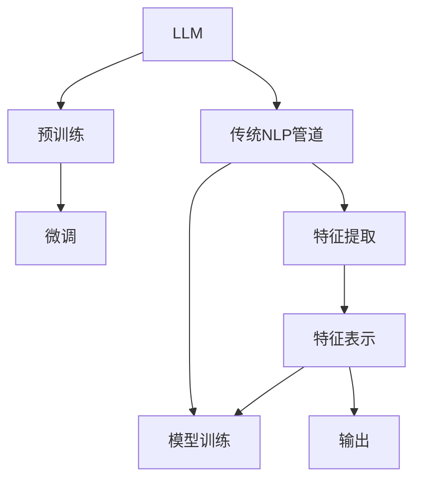

                 

# LLM与传统自然语言处理管道的对比与融合

> 关键词：LLM, 自然语言处理, 神经网络, 传统NLP, 深度学习, 语言模型, 序列到序列, 混合体系结构

## 1. 背景介绍

### 1.1 问题由来
自然语言处理（NLP）是计算机科学和人工智能领域的一个重要分支，致力于使计算机能够理解、解释和生成自然语言。传统NLP处理流程通常基于一系列固定的预处理步骤和算法，从文本中提取出特征，然后使用机器学习模型进行预测或分类。这些模型包括传统的统计模型（如N-gram模型）、逻辑规则模型和基于神经网络的模型（如递归神经网络RNN和卷积神经网络CNN）。

近年来，大规模预训练语言模型（Large Language Models, LLMs）的兴起，带来了自然语言处理范式的革命性变革。LLMs通过在海量无标签文本数据上进行预训练，学习到丰富的语言知识，并能够高效适应下游任务的微调（Fine-Tuning）。这一范式革新了NLP处理流程，将自然语言理解和生成的能力提升到了前所未有的高度。

本文旨在探讨大语言模型（LLMs）与传统NLP管道的区别与融合，对比二者的优缺点，并展望未来的发展趋势。通过深入分析，希望能够为NLP领域的研究者和开发者提供有价值的参考。

## 2. 核心概念与联系

### 2.1 核心概念概述

- **大语言模型（LLM）**：以Transformer为代表的深度学习模型，通过在大规模无标签文本数据上进行自监督预训练，学习通用语言知识。预训练后的模型通常在大规模标注数据集上进行微调，以适应特定任务。

- **传统自然语言处理（NLP）管道**：基于一系列固定的预处理步骤和算法，提取文本特征，使用机器学习模型进行预测或分类。包括统计模型、逻辑规则模型和基于神经网络的模型。

- **序列到序列（Seq2Seq）模型**：一类用于文本生成、翻译等任务的人工智能模型，其核心思想是将输入序列映射到输出序列，广泛应用于机器翻译、文本摘要等领域。

- **混合体系结构**：结合传统NLP管道和LLMs的优势，构建的混合处理流程。通过在管道中引入预训练模型，结合二者特点，提升处理效率和准确性。

这些核心概念之间的逻辑关系可以通过以下Mermaid流程图来展示：



这个流程图展示了大语言模型和传统NLP管道的核心概念及其之间的关系：

1. 大语言模型通过预训练获得基础能力。
2. 微调是对预训练模型进行任务特定的优化，调整模型参数以适应下游任务。
3. 传统NLP管道使用固定步骤提取文本特征，然后使用机器学习模型进行预测或分类。
4. 特征表示和模型训练是传统NLP管道的关键步骤。
5. 特征表示通过预训练模型进行优化，进一步提升模型性能。

这些核心概念共同构成了大语言模型和传统NLP管道的学习框架，使其能够在各种场景下发挥各自优势。通过理解这些核心概念，我们可以更好地把握两种处理方式的工作原理和优化方向。

## 3. 核心算法原理 & 具体操作步骤
### 3.1 算法原理概述

大语言模型与传统NLP管道的核心区别在于处理流程和模型结构。LLM通过自监督预训练，学习到语言的通用表示，并在下游任务上进行微调，以适应特定任务需求。而传统NLP管道则是基于一系列固定的预处理步骤和算法，从文本中提取特征，使用机器学习模型进行预测或分类。

大语言模型的处理流程包括预训练和微调两个阶段。预训练阶段，模型在大规模无标签文本数据上自监督学习，学习语言的通用表示。微调阶段，模型在特定任务的数据集上进行有监督训练，以调整参数，适应任务需求。

传统NLP管道的处理流程则相对固定，主要包括特征提取和模型训练两个步骤。特征提取阶段，文本通过一系列预处理步骤，如分词、词性标注等，提取为模型所需的特征表示。模型训练阶段，提取的特征输入到机器学习模型中，进行预测或分类。

### 3.2 算法步骤详解

#### 大语言模型处理流程：

1. **预训练阶段**：
    - 收集大规模无标签文本数据，作为预训练语料。
    - 使用自监督任务（如掩码语言模型、下一句预测等）训练预训练模型。
    - 预训练模型学习到语言的通用表示，如BERT、GPT等。

2. **微调阶段**：
    - 针对特定任务，收集少量标注数据。
    - 使用微调算法（如SGD、Adam等）和优化器更新模型参数。
    - 在标注数据集上训练模型，调整参数以适应任务需求。
    - 评估微调后的模型性能，测试其在特定任务上的效果。

#### 传统NLP管道处理流程：

1. **特征提取**：
    - 对文本进行预处理，如分词、词性标注、去除停用词等。
    - 提取文本的特征表示，如词袋模型、TF-IDF、N-gram等。

2. **模型训练**：
    - 使用机器学习算法（如SVM、随机森林等）训练分类或回归模型。
    - 使用标注数据集训练模型，优化模型参数。
    - 评估模型性能，测试其在测试集上的效果。

### 3.3 算法优缺点

**大语言模型的优点：**

1. **通用性强**：通过预训练和微调，LLM可以适应多种下游任务，如分类、匹配、生成等，适用于NLP的各个领域。
2. **效果显著**：在学术界和工业界的诸多任务上，LLM已经刷新了最先进的性能指标。
3. **参数高效**：利用参数高效微调技术，在固定大部分预训练参数的情况下，仍可取得不错的提升。
4. **灵活性强**：微调模型可以方便地更新以适应新的任务需求。

**大语言模型的缺点：**

1. **依赖标注数据**：微调的效果很大程度上取决于标注数据的质量和数量，获取高质量标注数据的成本较高。
2. **迁移能力有限**：当目标任务与预训练数据的分布差异较大时，微调的性能提升有限。
3. **可解释性不足**：微调模型的决策过程通常缺乏可解释性，难以对其推理逻辑进行分析和调试。

**传统NLP管道的优点：**

1. **解释性强**：特征提取和模型训练过程透明，易于理解和调试。
2. **对标注数据依赖小**：传统模型通常依赖于较少的标注数据进行训练。
3. **适应性广**：适用于各种类型的特征提取和模型选择。

**传统NLP管道的缺点：**

1. **模型效果受限**：受限于预处理步骤和特征表示，性能可能不如深度学习模型。
2. **需要手动设计特征**：特征提取过程需要手动设计，可能存在特征丢失或过拟合的问题。
3. **处理复杂度高**：处理复杂文本时，特征提取和模型训练步骤繁琐。

### 3.4 算法应用领域

大语言模型和传统NLP管道在多个领域都有广泛应用，例如：

- **文本分类**：如情感分析、主题分类等，通过微调获得分类模型。
- **命名实体识别**：识别文本中的人名、地名、机构名等特定实体。
- **关系抽取**：从文本中抽取实体之间的语义关系。
- **问答系统**：对自然语言问题给出答案，微调生成模型。
- **机器翻译**：将源语言文本翻译成目标语言，微调翻译模型。
- **文本摘要**：将长文本压缩成简短摘要，微调摘要模型。

除了上述这些经典任务外，LLM和传统NLP管道在文本生成、代码生成、数据增强等更多场景中都有创新应用，为NLP技术带来了新的突破。

## 4. 数学模型和公式 & 详细讲解 & 举例说明

### 4.1 数学模型构建

本节将使用数学语言对大语言模型和传统NLP管道的处理流程进行更加严格的刻画。

**大语言模型预训练模型**：
- 假设输入文本为 $x$，预训练模型为 $M_{\theta}$，输出为 $y$。
- 预训练模型在无标签数据集上进行自监督学习，学习通用语言表示 $y = M_{\theta}(x)$。
- 预训练任务通常为掩码语言模型、下一句预测等，以最大化模型的预测能力。

**微调模型**：
- 假设下游任务为 $T$，标注数据集为 $D$。
- 微调模型 $M_{\theta_t}$ 在标注数据集上进行有监督学习，更新参数以适应任务需求。
- 微调过程通过损失函数 $\mathcal{L}$ 进行优化，最小化模型输出与真实标签的差异。

**传统NLP管道**：
- 假设输入文本为 $x$，特征提取器为 $F$，机器学习模型为 $M$。
- 特征提取器将文本转换为特征表示 $f(x)$。
- 机器学习模型 $M$ 将特征表示映射到输出 $y$，进行分类或回归。

### 4.2 公式推导过程

#### 大语言模型预训练：
假设预训练模型为 $M_{\theta}$，输入文本为 $x$，预训练任务为掩码语言模型，输出为 $y$。预训练模型的目标是最小化预测错误，即：

$$
\mathcal{L}_{\text{pretrain}} = -\log P(y|x)
$$

其中 $P(y|x)$ 表示模型在输入文本 $x$ 下，预测输出 $y$ 的概率分布。

#### 微调模型：
假设下游任务为 $T$，标注数据集为 $D=\{(x_i, y_i)\}_{i=1}^N$，微调模型为 $M_{\theta_t}$。微调模型的目标是最小化损失函数 $\mathcal{L}$，即：

$$
\mathcal{L}(M_{\theta_t},D) = \frac{1}{N}\sum_{i=1}^N \ell(M_{\theta_t}(x_i),y_i)
$$

其中 $\ell$ 表示损失函数，如交叉熵损失。微调过程通过梯度下降等优化算法更新模型参数，最小化损失函数。

#### 传统NLP管道：
假设输入文本为 $x$，特征提取器为 $F$，机器学习模型为 $M$。特征提取器的目标是最小化特征表示 $f(x)$ 与输入文本 $x$ 之间的差异，即：

$$
\mathcal{L}_{\text{features}} = -\log P(f(x)|x)
$$

其中 $P(f(x)|x)$ 表示特征提取器在输入文本 $x$ 下，生成特征表示 $f(x)$ 的概率分布。

机器学习模型的目标是最小化模型输出与真实标签之间的差异，即：

$$
\mathcal{L}_{\text{model}} = -\log P(y|f(x))
$$

其中 $P(y|f(x))$ 表示机器学习模型在特征表示 $f(x)$ 下，生成输出 $y$ 的概率分布。

### 4.3 案例分析与讲解

#### 案例一：情感分析

假设输入文本为电影评论，输出为情感极性（正、负、中性）。

**大语言模型**：
- 使用掩码语言模型进行预训练。
- 在标注电影评论数据集上进行微调，最小化损失函数 $\mathcal{L}(M_{\theta_t},D)$。
- 微调后的模型将文本映射为情感向量，通过阈值判断情感极性。

**传统NLP管道**：
- 使用词袋模型或TF-IDF进行特征提取。
- 使用SVM或随机森林等机器学习模型进行训练，最小化损失函数 $\mathcal{L}_{\text{model}}$。
- 训练后的模型将特征表示映射为情感极性。

#### 案例二：命名实体识别

假设输入文本为新闻报道，输出为命名实体（人名、地名、机构名）。

**大语言模型**：
- 使用掩码语言模型进行预训练。
- 在标注新闻报道数据集上进行微调，最小化损失函数 $\mathcal{L}(M_{\theta_t},D)$。
- 微调后的模型将文本映射为命名实体向量，通过阈值判断命名实体类别。

**传统NLP管道**：
- 使用词性标注器进行特征提取。
- 使用SVM或随机森林等机器学习模型进行训练，最小化损失函数 $\mathcal{L}_{\text{model}}$。
- 训练后的模型将特征表示映射为命名实体类别。

## 5. 项目实践：代码实例和详细解释说明

### 5.1 开发环境搭建

在进行大语言模型和传统NLP管道的项目实践前，我们需要准备好开发环境。以下是使用Python进行PyTorch开发的环境配置流程：

1. 安装Anaconda：从官网下载并安装Anaconda，用于创建独立的Python环境。

2. 创建并激活虚拟环境：
```bash
conda create -n pytorch-env python=3.8 
conda activate pytorch-env
```

3. 安装PyTorch：根据CUDA版本，从官网获取对应的安装命令。例如：
```bash
conda install pytorch torchvision torchaudio cudatoolkit=11.1 -c pytorch -c conda-forge
```

4. 安装Transformers库：
```bash
pip install transformers
```

5. 安装各类工具包：
```bash
pip install numpy pandas scikit-learn matplotlib tqdm jupyter notebook ipython
```

完成上述步骤后，即可在`pytorch-env`环境中开始项目实践。

### 5.2 源代码详细实现

这里以情感分析任务为例，给出使用PyTorch和Transformers库进行大语言模型微调的代码实现。

首先，定义情感分析的数据处理函数：

```python
from transformers import BertTokenizer
from torch.utils.data import Dataset
import torch

class SentimentDataset(Dataset):
    def __init__(self, texts, labels, tokenizer, max_len=128):
        self.texts = texts
        self.labels = labels
        self.tokenizer = tokenizer
        self.max_len = max_len
        
    def __len__(self):
        return len(self.texts)
    
    def __getitem__(self, item):
        text = self.texts[item]
        label = self.labels[item]
        
        encoding = self.tokenizer(text, return_tensors='pt', max_length=self.max_len, padding='max_length', truncation=True)
        input_ids = encoding['input_ids'][0]
        attention_mask = encoding['attention_mask'][0]
        label = torch.tensor(label, dtype=torch.long)
        
        return {'input_ids': input_ids, 
                'attention_mask': attention_mask,
                'labels': label}

# 创建dataset
tokenizer = BertTokenizer.from_pretrained('bert-base-cased')

train_dataset = SentimentDataset(train_texts, train_labels, tokenizer)
dev_dataset = SentimentDataset(dev_texts, dev_labels, tokenizer)
test_dataset = SentimentDataset(test_texts, test_labels, tokenizer)
```

然后，定义模型和优化器：

```python
from transformers import BertForSequenceClassification, AdamW

model = BertForSequenceClassification.from_pretrained('bert-base-cased', num_labels=3)

optimizer = AdamW(model.parameters(), lr=2e-5)
```

接着，定义训练和评估函数：

```python
from torch.utils.data import DataLoader
from tqdm import tqdm
from sklearn.metrics import classification_report

device = torch.device('cuda') if torch.cuda.is_available() else torch.device('cpu')
model.to(device)

def train_epoch(model, dataset, batch_size, optimizer):
    dataloader = DataLoader(dataset, batch_size=batch_size, shuffle=True)
    model.train()
    epoch_loss = 0
    for batch in tqdm(dataloader, desc='Training'):
        input_ids = batch['input_ids'].to(device)
        attention_mask = batch['attention_mask'].to(device)
        labels = batch['labels'].to(device)
        model.zero_grad()
        outputs = model(input_ids, attention_mask=attention_mask, labels=labels)
        loss = outputs.loss
        epoch_loss += loss.item()
        loss.backward()
        optimizer.step()
    return epoch_loss / len(dataloader)

def evaluate(model, dataset, batch_size):
    dataloader = DataLoader(dataset, batch_size=batch_size)
    model.eval()
    preds, labels = [], []
    with torch.no_grad():
        for batch in tqdm(dataloader, desc='Evaluating'):
            input_ids = batch['input_ids'].to(device)
            attention_mask = batch['attention_mask'].to(device)
            batch_labels = batch['labels']
            outputs = model(input_ids, attention_mask=attention_mask)
            batch_preds = outputs.logits.argmax(dim=2).to('cpu').tolist()
            batch_labels = batch_labels.to('cpu').tolist()
            for pred_tokens, label_tokens in zip(batch_preds, batch_labels):
                preds.append(pred_tokens)
                labels.append(label_tokens)
                
    print(classification_report(labels, preds))
```

最后，启动训练流程并在测试集上评估：

```python
epochs = 5
batch_size = 16

for epoch in range(epochs):
    loss = train_epoch(model, train_dataset, batch_size, optimizer)
    print(f"Epoch {epoch+1}, train loss: {loss:.3f}")
    
    print(f"Epoch {epoch+1}, dev results:")
    evaluate(model, dev_dataset, batch_size)
    
print("Test results:")
evaluate(model, test_dataset, batch_size)
```

以上就是使用PyTorch和Transformers库对BERT模型进行情感分析任务微调的完整代码实现。可以看到，得益于Transformers库的强大封装，我们可以用相对简洁的代码完成BERT模型的加载和微调。

### 5.3 代码解读与分析

让我们再详细解读一下关键代码的实现细节：

**SentimentDataset类**：
- `__init__`方法：初始化文本、标签、分词器等关键组件。
- `__len__`方法：返回数据集的样本数量。
- `__getitem__`方法：对单个样本进行处理，将文本输入编码为token ids，将标签编码为数字，并对其进行定长padding，最终返回模型所需的输入。

**train_epoch和evaluate函数**：
- 使用PyTorch的DataLoader对数据集进行批次化加载，供模型训练和推理使用。
- 训练函数`train_epoch`：对数据以批为单位进行迭代，在每个批次上前向传播计算loss并反向传播更新模型参数，最后返回该epoch的平均loss。
- 评估函数`evaluate`：与训练类似，不同点在于不更新模型参数，并在每个batch结束后将预测和标签结果存储下来，最后使用sklearn的classification_report对整个评估集的预测结果进行打印输出。

**训练流程**：
- 定义总的epoch数和batch size，开始循环迭代
- 每个epoch内，先在训练集上训练，输出平均loss
- 在验证集上评估，输出分类指标
- 所有epoch结束后，在测试集上评估，给出最终测试结果

可以看到，PyTorch配合Transformers库使得BERT微调的代码实现变得简洁高效。开发者可以将更多精力放在数据处理、模型改进等高层逻辑上，而不必过多关注底层的实现细节。

当然，工业级的系统实现还需考虑更多因素，如模型的保存和部署、超参数的自动搜索、更灵活的任务适配层等。但核心的微调范式基本与此类似。

## 6. 实际应用场景
### 6.1 智能客服系统

基于大语言模型微调的对话技术，可以广泛应用于智能客服系统的构建。传统客服往往需要配备大量人力，高峰期响应缓慢，且一致性和专业性难以保证。而使用微调后的对话模型，可以7x24小时不间断服务，快速响应客户咨询，用自然流畅的语言解答各类常见问题。

在技术实现上，可以收集企业内部的历史客服对话记录，将问题和最佳答复构建成监督数据，在此基础上对预训练对话模型进行微调。微调后的对话模型能够自动理解用户意图，匹配最合适的答案模板进行回复。对于客户提出的新问题，还可以接入检索系统实时搜索相关内容，动态组织生成回答。如此构建的智能客服系统，能大幅提升客户咨询体验和问题解决效率。

### 6.2 金融舆情监测

金融机构需要实时监测市场舆论动向，以便及时应对负面信息传播，规避金融风险。传统的人工监测方式成本高、效率低，难以应对网络时代海量信息爆发的挑战。基于大语言模型微调的文本分类和情感分析技术，为金融舆情监测提供了新的解决方案。

具体而言，可以收集金融领域相关的新闻、报道、评论等文本数据，并对其进行主题标注和情感标注。在此基础上对预训练语言模型进行微调，使其能够自动判断文本属于何种主题，情感倾向是正面、中性还是负面。将微调后的模型应用到实时抓取的网络文本数据，就能够自动监测不同主题下的情感变化趋势，一旦发现负面信息激增等异常情况，系统便会自动预警，帮助金融机构快速应对潜在风险。

### 6.3 个性化推荐系统

当前的推荐系统往往只依赖用户的历史行为数据进行物品推荐，无法深入理解用户的真实兴趣偏好。基于大语言模型微调技术，个性化推荐系统可以更好地挖掘用户行为背后的语义信息，从而提供更精准、多样的推荐内容。

在实践中，可以收集用户浏览、点击、评论、分享等行为数据，提取和用户交互的物品标题、描述、标签等文本内容。将文本内容作为模型输入，用户的后续行为（如是否点击、购买等）作为监督信号，在此基础上微调预训练语言模型。微调后的模型能够从文本内容中准确把握用户的兴趣点。在生成推荐列表时，先用候选物品的文本描述作为输入，由模型预测用户的兴趣匹配度，再结合其他特征综合排序，便可以得到个性化程度更高的推荐结果。

### 6.4 未来应用展望

随着大语言模型微调技术的发展，未来将在更多领域得到应用，为传统行业带来变革性影响。

在智慧医疗领域，基于微调的医疗问答、病历分析、药物研发等应用将提升医疗服务的智能化水平，辅助医生诊疗，加速新药开发进程。

在智能教育领域，微调技术可应用于作业批改、学情分析、知识推荐等方面，因材施教，促进教育公平，提高教学质量。

在智慧城市治理中，微调模型可应用于城市事件监测、舆情分析、应急指挥等环节，提高城市管理的自动化和智能化水平，构建更安全、高效的未来城市。

此外，在企业生产、社会治理、文娱传媒等众多领域，基于大模型微调的人工智能应用也将不断涌现，为经济社会发展注入新的动力。相信随着技术的日益成熟，微调方法将成为人工智能落地应用的重要范式，推动人工智能技术向更广阔的领域加速渗透。

## 7. 工具和资源推荐
### 7.1 学习资源推荐

为了帮助开发者系统掌握大语言模型和传统NLP管道的理论基础和实践技巧，这里推荐一些优质的学习资源：

1. 《Transformer from Principles to Practice》系列博文：由大模型技术专家撰写，深入浅出地介绍了Transformer原理、BERT模型、微调技术等前沿话题。

2. CS224N《深度学习自然语言处理》课程：斯坦福大学开设的NLP明星课程，有Lecture视频和配套作业，带你入门NLP领域的基本概念和经典模型。

3. 《Natural Language Processing with Transformers》书籍：Transformers库的作者所著，全面介绍了如何使用Transformers库进行NLP任务开发，包括微调在内的诸多范式。

4. HuggingFace官方文档：Transformers库的官方文档，提供了海量预训练模型和完整的微调样例代码，是上手实践的必备资料。

5. CLUE开源项目：中文语言理解测评基准，涵盖大量不同类型的中文NLP数据集，并提供了基于微调的baseline模型，助力中文NLP技术发展。

通过对这些资源的学习实践，相信你一定能够快速掌握大语言模型和传统NLP管道的精髓，并用于解决实际的NLP问题。
###  7.2 开发工具推荐

高效的开发离不开优秀的工具支持。以下是几款用于大语言模型和传统NLP管道的常用工具：

1. PyTorch：基于Python的开源深度学习框架，灵活动态的计算图，适合快速迭代研究。大部分预训练语言模型都有PyTorch版本的实现。

2. TensorFlow：由Google主导开发的开源深度学习框架，生产部署方便，适合大规模工程应用。同样有丰富的预训练语言模型资源。

3. Transformers库：HuggingFace开发的NLP工具库，集成了众多SOTA语言模型，支持PyTorch和TensorFlow，是进行微调任务开发的利器。

4. Weights & Biases：模型训练的实验跟踪工具，可以记录和可视化模型训练过程中的各项指标，方便对比和调优。与主流深度学习框架无缝集成。

5. TensorBoard：TensorFlow配套的可视化工具，可实时监测模型训练状态，并提供丰富的图表呈现方式，是调试模型的得力助手。

6. Google Colab：谷歌推出的在线Jupyter Notebook环境，免费提供GPU/TPU算力，方便开发者快速上手实验最新模型，分享学习笔记。

合理利用这些工具，可以显著提升大语言模型和传统NLP管道的开发效率，加快创新迭代的步伐。

### 7.3 相关论文推荐

大语言模型和微调技术的发展源于学界的持续研究。以下是几篇奠基性的相关论文，推荐阅读：

1. Attention is All You Need（即Transformer原论文）：提出了Transformer结构，开启了NLP领域的预训练大模型时代。

2. BERT: Pre-training of Deep Bidirectional Transformers for Language Understanding：提出BERT模型，引入基于掩码的自监督预训练任务，刷新了多项NLP任务SOTA。

3. Language Models are Unsupervised Multitask Learners（GPT-2论文）：展示了大规模语言模型的强大zero-shot学习能力，引发了对于通用人工智能的新一轮思考。

4. Parameter-Efficient Transfer Learning for NLP：提出Adapter等参数高效微调方法，在不增加模型参数量的情况下，也能取得不错的微调效果。

5. Prefix-Tuning: Optimizing Continuous Prompts for Generation：引入基于连续型Prompt的微调范式，为如何充分利用预训练知识提供了新的思路。

6. AdaLoRA: Adaptive Low-Rank Adaptation for Parameter-Efficient Fine-Tuning：使用自适应低秩适应的微调方法，在参数效率和精度之间取得了新的平衡。

这些论文代表了大语言模型和微调技术的发展脉络。通过学习这些前沿成果，可以帮助研究者把握学科前进方向，激发更多的创新灵感。

## 8. 总结：未来发展趋势与挑战

### 8.1 总结

本文对大语言模型和传统NLP管道的区别与融合进行了全面系统的介绍。首先阐述了二者的核心区别和联系，明确了各自的优势和局限。然后，从原理到实践，详细讲解了两种处理方式的数学模型和关键步骤，给出了微调任务开发的完整代码实例。同时，本文还广泛探讨了微调方法在多个行业领域的应用前景，展示了二者的巨大潜力。

通过本文的系统梳理，可以看到，大语言模型和传统NLP管道各有优势，能够互补融合，共同构建更加强大的NLP系统。二者在处理流程、模型结构、应用场景等方面存在显著差异，但通过融合，可以发挥各自的长处，提升处理效率和准确性，满足多样化的NLP需求。

### 8.2 未来发展趋势

展望未来，大语言模型和传统NLP管道的融合将呈现以下几个发展趋势：

1. **多模态融合**：未来将更多地融合多模态数据，如视觉、语音、文本等多模态信息的整合，提升模型对复杂场景的理解能力。

2. **混合体系结构**：大语言模型和传统NLP管道将更多地结合，构建混合处理流程，提升处理效率和效果。

3. **迁移学习**：通过迁移学习，将大语言模型在通用任务上的知识迁移到特定任务中，减少微调对标注数据的依赖，提高模型的泛化能力。

4. **元学习**：引入元学习思想，让模型能够在少量标注数据下快速适应新任务，提升模型的灵活性和通用性。

5. **融合深度学习与符号学习**：结合深度学习和符号学习的优点，构建更加全面、鲁棒的NLP模型。

6. **联邦学习**：通过联邦学习，让多个模型在分布式数据上协同训练，提升模型的泛化能力和安全性。

以上趋势凸显了大语言模型和传统NLP管道的融合前景。这些方向的探索发展，必将进一步提升NLP系统的性能和应用范围，为自然语言理解和智能交互系统的进步带来深远影响。

### 8.3 面临的挑战

尽管大语言模型和传统NLP管道在处理流程和模型结构上各具优势，但在迈向更加智能化、普适化应用的过程中，仍面临诸多挑战：

1. **模型鲁棒性不足**：大语言模型在处理复杂文本时，容易出现逻辑错误或语义混乱，需要进一步提升模型的鲁棒性和泛化能力。

2. **处理效率低下**：传统NLP管道处理复杂文本时，特征提取和模型训练步骤繁琐，效率低下。大语言模型虽然高效，但推理速度较慢，需要进一步优化。

3. **知识整合困难**：将外部知识与模型结合，如知识图谱、逻辑规则等，仍需进一步研究，如何更好地整合多源信息。

4. **安全性和可解释性**：大语言模型可能存在偏见、有害信息等风险，模型输出的可解释性不足，需要进一步研究如何保障模型安全性和提高可解释性。

5. **数据隐私保护**：在处理敏感数据时，如何保护用户隐私，防止数据泄露，仍需进一步研究。

6. **资源消耗巨大**：大语言模型和传统NLP管道在处理大规模数据时，资源消耗巨大，需要进一步研究如何优化模型结构和算法，减少计算资源消耗。

正视这些挑战，积极应对并寻求突破，将是大语言模型和传统NLP管道走向成熟的必由之路。相信随着学界和产业界的共同努力，这些挑战终将一一被克服，二者的融合将为NLP领域带来更加广泛的应用前景。

### 8.4 研究展望

面向未来，大语言模型和传统NLP管道需要在以下几个方向寻求新的突破：

1. **混合体系结构**：构建更加灵活的混合处理流程，综合大语言模型和传统NLP管道的优势，提升处理效率和效果。

2. **深度学习与符号学习的融合**：结合深度学习和符号学习的优点，构建更加全面、鲁棒的NLP模型。

3. **多模态融合**：将视觉、语音、文本等多模态信息整合，提升模型对复杂场景的理解能力。

4. **迁移学习**：通过迁移学习，将大语言模型在通用任务上的知识迁移到特定任务中，减少微调对标注数据的依赖，提高模型的泛化能力。

5. **联邦学习**：通过联邦学习，让多个模型在分布式数据上协同训练，提升模型的泛化能力和安全性。

6. **融合因果推理与强化学习**：引入因果推理和强化学习思想，增强模型的泛化能力和自适应能力。

这些研究方向的探索，必将引领大语言模型和传统NLP管道的融合技术迈向更高的台阶，为构建更加智能、可靠、高效的NLP系统铺平道路。

## 9. 附录：常见问题与解答

**Q1：大语言模型和传统NLP管道的核心区别是什么？**

A: 大语言模型通过预训练和微调学习到语言的通用表示，适用于多种下游任务。传统NLP管道使用固定步骤提取文本特征，再使用机器学习模型进行预测或分类。

**Q2：大语言模型和传统NLP管道的优缺点各是什么？**

A: 大语言模型的优点是通用性强、效果显著、参数高效、灵活性强。缺点是依赖标注数据、迁移能力有限、可解释性不足。传统NLP管道的优点是解释性强、对标注数据依赖小、适应性广。缺点是模型效果受限、处理复杂度高。

**Q3：如何处理大语言模型和传统NLP管道的融合？**

A: 大语言模型和传统NLP管道可以结合构建混合处理流程，提升处理效率和效果。大语言模型处理通用语料，传统NLP管道处理特定任务数据，结合各自优势，共同构建更加全面的NLP系统。

**Q4：如何评估大语言模型和传统NLP管道的性能？**

A: 大语言模型和传统NLP管道的性能评估通常使用BLEU、ROUGE、F1-score等指标。在特定任务上，还可以使用混淆矩阵、精确率、召回率等指标。

**Q5：如何提升大语言模型和传统NLP管道的处理效率？**

A: 通过优化模型结构、使用参数高效微调、引入深度学习与符号学习融合、多模态融合等方法，提升大语言模型和传统NLP管道的处理效率。

---

作者：禅与计算机程序设计艺术 / Zen and the Art of Computer Programming

