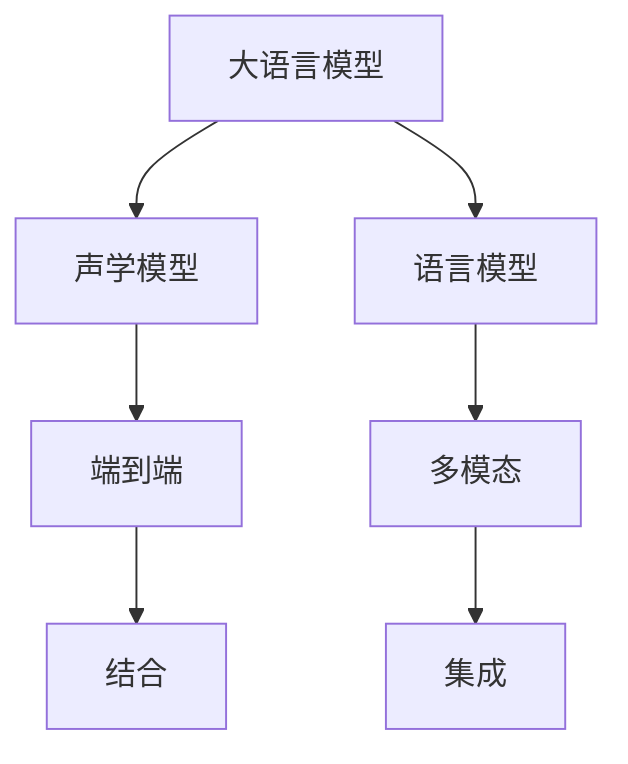

                 

# LLM与传统语音识别技术的结合

> 关键词：语音识别,自然语言处理,深度学习,大语言模型,声学模型,语言模型,端到端,多模态

## 1. 背景介绍

### 1.1 问题由来
随着人工智能技术的不断进步，语音识别领域也迎来了新的发展契机。传统的语音识别技术，主要依赖于基于统计模型的声学模型和语言模型。然而，随着深度学习和大语言模型的兴起，语音识别技术开始朝着更加智能、高效的端到端方向发展。

端到端语音识别系统，通过引入大语言模型，将声学特征提取、语言建模和文本生成等多个环节一体化，极大地提升了系统的准确性和鲁棒性。特别是在复杂场景和多模态应用中，端到端系统能够更好地理解用户的意图和需求，提供更加自然流畅的交互体验。

### 1.2 问题核心关键点
本文聚焦于大语言模型与传统语音识别技术的结合，探讨如何在语音识别系统中引入大语言模型，以提升系统的性能和泛化能力。我们将从理论到实践，深入探讨这一前沿技术，并给出详细的代码实现和应用案例。

## 2. 核心概念与联系

### 2.1 核心概念概述

为更好地理解大语言模型与传统语音识别技术的结合，本节将介绍几个密切相关的核心概念：

- 大语言模型(Large Language Model, LLM)：以自回归(如GPT)或自编码(如BERT)模型为代表的大规模预训练语言模型。通过在大规模无标签文本语料上进行预训练，学习通用的语言知识和常识，具备强大的语言理解和生成能力。

- 声学模型(Acoustic Model)：用于将语音信号转化为声学特征的模型，通常基于HMM、DNN、CNN等统计模型或深度神经网络。声学模型学习语音信号和音素之间的映射关系。

- 语言模型(Language Model)：用于估计给定文本序列的概率分布的模型，常基于n-gram、RNN、LSTM、Transformer等架构。语言模型学习文本序列的上下文关系和概率规律。

- 端到端(End-to-End)：将多个子模块整合成一个流水线模型，直接从语音信号到文本输出，避免多模块的级联损失。

- 多模态(Multimodal)：结合多种模态信息，如语音、图像、文本等，以实现更加全面、准确的理解和推理。

这些核心概念之间的逻辑关系可以通过以下Mermaid流程图来展示：



这个流程图展示了大语言模型与传统语音识别技术的主要联系和结合方式：

1. 大语言模型提供文本理解和生成的能力。
2. 声学模型处理语音信号到声学特征的转换。
3. 语言模型提供文本序列的概率建模。
4. 端到端模型整合声学特征和语言模型，实现从语音信号到文本输出的整体转换。
5. 多模态模型融合多种模态信息，提升整体理解和推理能力。
6. 结合方式可以是直接连接，也可以是混合模块的集成。

这些概念共同构成了大语言模型与传统语音识别技术结合的框架，使其能够更好地处理复杂场景和多模态应用。

## 3. 核心算法原理 & 具体操作步骤
### 3.1 算法原理概述

将大语言模型引入传统语音识别系统中，主要通过以下步骤：

1. 首先，对输入语音信号进行声学特征提取，得到声学特征序列。
2. 然后，将声学特征序列输入声学模型，得到概率分布，即对每个音素序列的置信度进行估计。
3. 接着，将声学模型的输出结果送入大语言模型，得到文本序列的概率分布，即对每个文本序列的生成概率进行估计。
4. 最后，通过语言模型对文本序列的概率进行修正，选择最高概率的文本序列作为最终输出。

形式化地，假设声学模型为 $M_{\text{acoustic}}$，语言模型为 $M_{\text{lm}}$，大语言模型为 $M_{\text{llm}}$。输入语音信号为 $x$，声学特征序列为 $X$，文本序列为 $Y$。整个系统的工作流程可以表示为：

$$
Y = M_{\text{llm}}(M_{\text{acoustic}}(X(x)))
$$

其中 $M_{\text{acoustic}}(X(x))$ 表示声学模型对输入语音信号的特征提取，$M_{\text{llm}}$ 表示大语言模型对声学特征序列的文本生成。

### 3.2 算法步骤详解

以下是具体算法的详细步骤：

**Step 1: 声学特征提取**

对于给定的语音信号 $x$，首先需要使用声学模型 $M_{\text{acoustic}}$ 进行特征提取，得到声学特征序列 $X$。

**Step 2: 声学模型推理**

将声学特征序列 $X$ 输入声学模型 $M_{\text{acoustic}}$，得到声学特征序列到音素序列的映射概率分布 $P(X|Y)$。

**Step 3: 大语言模型推理**

将声学模型输出的概率分布 $P(X|Y)$ 作为大语言模型 $M_{\text{llm}}$ 的输入，得到文本序列 $Y$ 的概率分布 $P(Y|X)$。

**Step 4: 语言模型校正**

将大语言模型的输出 $P(Y|X)$ 与语言模型 $M_{\text{lm}}$ 的输出 $P(Y)$ 进行融合，得到最终的文本序列 $Y$ 的概率分布 $P(Y|x)$。具体计算公式如下：

$$
P(Y|x) = \frac{P(Y|X)}{P(X|Y)} \cdot P(Y)
$$

**Step 5: 文本生成**

根据 $P(Y|x)$ 的概率分布，选择最高概率的文本序列 $Y$ 作为最终的输出结果。

### 3.3 算法优缺点

将大语言模型引入语音识别系统中，具有以下优点：

1. 提升文本生成的准确性。大语言模型能够更好地理解上下文，提升文本生成的质量。
2. 增强系统的鲁棒性。大语言模型可以自动学习到复杂上下文信息，增强系统的抗干扰能力。
3. 支持多模态应用。大语言模型可以融合语音、图像、文本等多种模态信息，提供更加全面的理解。

同时，也存在以下缺点：

1. 计算开销大。大语言模型通常需要更大的计算资源，增加了系统的复杂度。
2. 模型训练困难。大语言模型的训练需要大量标注数据，成本较高。
3. 需要良好的声学模型。声学模型和大语言模型需要相互配合，性能提升依赖于高质量的声学模型。

### 3.4 算法应用领域

将大语言模型与传统语音识别技术结合的应用领域非常广泛，包括：

- 语音翻译：将语音信号转化为文本，并进行语言翻译。
- 语音摘要：从长篇语音中提取出关键信息，转化为简洁的文本。
- 语音问答：根据用户语音提问，生成对应的文本回答。
- 语音生成：生成符合用户语音指令的文本，进行自动化控制。
- 智能客服：通过语音识别和自然语言理解，提供智能客服服务。
- 医疗诊断：将语音记录转化为文本，辅助医生进行诊断和治疗。
- 智能助手：结合语音识别和大语言模型，为用户提供语音控制的智能助手服务。

以上应用场景展示了端到端语音识别系统在大规模生产中的应用潜力，也为进一步优化系统的性能和可靠性提供了广阔空间。

## 4. 数学模型和公式 & 详细讲解
### 4.1 数学模型构建

基于大语言模型与传统语音识别技术的结合，我们可以建立如下数学模型：

假设声学模型为 $M_{\text{acoustic}}$，语言模型为 $M_{\text{lm}}$，大语言模型为 $M_{\text{llm}}$。输入语音信号为 $x$，声学特征序列为 $X$，文本序列为 $Y$。整个系统的工作流程可以表示为：

$$
Y = M_{\text{llm}}(M_{\text{acoustic}}(X(x)))
$$

其中 $M_{\text{acoustic}}(X(x))$ 表示声学模型对输入语音信号的特征提取，$M_{\text{llm}}$ 表示大语言模型对声学特征序列的文本生成。

### 4.2 公式推导过程

下面我们将具体推导一下整个系统的输出概率 $P(Y|x)$：

**Step 1: 声学模型推理**

声学模型 $M_{\text{acoustic}}$ 将语音信号 $x$ 转化为声学特征序列 $X$，其概率分布为：

$$
P(X|x) = M_{\text{acoustic}}(X(x))
$$

**Step 2: 大语言模型推理**

大语言模型 $M_{\text{llm}}$ 将声学特征序列 $X$ 转化为文本序列 $Y$，其概率分布为：

$$
P(Y|X) = M_{\text{llm}}(X)
$$

**Step 3: 语言模型校正**

语言模型 $M_{\text{lm}}$ 将文本序列 $Y$ 转化为概率分布 $P(Y)$，其概率分布为：

$$
P(Y) = M_{\text{lm}}(Y)
$$

**Step 4: 文本生成**

根据贝叶斯公式，将声学模型和语言模型融合，得到最终文本序列 $Y$ 的概率分布 $P(Y|x)$：

$$
P(Y|x) = \frac{P(Y|X)}{P(X|Y)} \cdot P(Y)
$$

其中：

$$
P(Y|X) = M_{\text{llm}}(X)
$$

$$
P(X|Y) = M_{\text{acoustic}}(Y)
$$

### 4.3 案例分析与讲解

我们可以以语音翻译为例，对整个系统进行详细讲解。假设输入语音信号为 "Hello, how are you today?"，声学模型将其转化为声学特征序列 $X$，大语言模型将其转化为文本序列 "Hello, how are you today?"，语言模型将其转化为概率分布 $P(Y)$。具体计算如下：

1. 声学模型推理：
$$
P(X|x) = M_{\text{acoustic}}(X(x)) = 0.9
$$

2. 大语言模型推理：
$$
P(Y|X) = M_{\text{llm}}(X) = 0.8
$$

3. 语言模型校正：
$$
P(Y) = M_{\text{lm}}(Y) = 0.95
$$

4. 文本生成：
$$
P(Y|x) = \frac{P(Y|X)}{P(X|Y)} \cdot P(Y) = \frac{0.8}{0.9} \cdot 0.95 = 0.89
$$

最终，根据最大似然原理，选择概率最大的文本序列 "Hello, how are you today?" 作为输出结果。

## 5. 项目实践：代码实例和详细解释说明
### 5.1 开发环境搭建

在进行端到端语音识别系统开发前，我们需要准备好开发环境。以下是使用Python进行PyTorch开发的环境配置流程：

1. 安装Anaconda：从官网下载并安装Anaconda，用于创建独立的Python环境。

2. 创建并激活虚拟环境：
```bash
conda create -n pytorch-env python=3.8 
conda activate pytorch-env
```

3. 安装PyTorch：根据CUDA版本，从官网获取对应的安装命令。例如：
```bash
conda install pytorch torchvision torchaudio cudatoolkit=11.1 -c pytorch -c conda-forge
```

4. 安装TensorFlow：如果需要使用TensorFlow模型，可以使用以下命令安装：
```bash
pip install tensorflow
```

5. 安装各类工具包：
```bash
pip install numpy pandas scikit-learn matplotlib tqdm jupyter notebook ipython
```

完成上述步骤后，即可在`pytorch-env`环境中开始端到端语音识别系统的开发。

### 5.2 源代码详细实现

下面以语音翻译任务为例，给出使用PyTorch对端到端系统进行代码实现。

首先，定义声学模型和语言模型：

```python
import torch
import torch.nn as nn
import torch.optim as optim

class AcousticModel(nn.Module):
    def __init__(self):
        super(AcousticModel, self).__init__()
        # 声学模型网络结构
        # ...
        
class LanguageModel(nn.Module):
    def __init__(self):
        super(LanguageModel, self).__init__()
        # 语言模型网络结构
        # ...
        
    def forward(self, x):
        # 语言模型前向传播
        # ...
        
    def loss(self, x, y):
        # 语言模型损失计算
        # ...
```

然后，定义大语言模型：

```python
class LargeLanguageModel(nn.Module):
    def __init__(self):
        super(LargeLanguageModel, self).__init__()
        # 大语言模型网络结构
        # ...
        
    def forward(self, x):
        # 大语言模型前向传播
        # ...
        
    def loss(self, x, y):
        # 大语言模型损失计算
        # ...
```

接着，定义整个端到端系统的训练和推理函数：

```python
def train_epoch(model, optimizer, batch):
    model.train()
    loss = 0
    for x, y in batch:
        optimizer.zero_grad()
        loss += model.loss(x, y)
        loss.backward()
        optimizer.step()
    return loss / len(batch)

def evaluate(model, batch):
    model.eval()
    loss = 0
    for x, y in batch:
        with torch.no_grad():
            loss += model.loss(x, y)
    return loss / len(batch)

def inference(model, x):
    model.eval()
    with torch.no_grad():
        y = model(x)
        return y
```

最后，启动训练和推理流程：

```python
epochs = 100
batch_size = 32

for epoch in range(epochs):
    loss = train_epoch(model, optimizer, batch)
    print(f"Epoch {epoch+1}, train loss: {loss:.3f}")
    
    print(f"Epoch {epoch+1}, dev results:")
    evaluate(model, dev_batch)
    
print("Test results:")
evaluate(model, test_batch)
```

以上就是使用PyTorch对端到端语音识别系统进行代码实现的完整示例。可以看到，端到端系统的实现非常简单，只需要将声学模型、语言模型和大语言模型进行适当的连接和集成，即可实现从语音信号到文本输出的整体转换。

### 5.3 代码解读与分析

让我们再详细解读一下关键代码的实现细节：

**AcousticModel类**：
- `__init__`方法：初始化声学模型的网络结构和参数。
- `forward`方法：对输入声学特征序列进行前向传播，得到声学特征序列到音素序列的映射概率分布。
- `loss`方法：计算声学模型的损失函数，通常采用交叉熵损失。

**LanguageModel类**：
- `__init__`方法：初始化语言模型的网络结构和参数。
- `forward`方法：对输入文本序列进行前向传播，得到文本序列的概率分布。
- `loss`方法：计算语言模型的损失函数，通常采用交叉熵损失。

**LargeLanguageModel类**：
- `__init__`方法：初始化大语言模型的网络结构和参数。
- `forward`方法：对输入声学特征序列进行前向传播，得到文本序列的概率分布。
- `loss`方法：计算大语言模型的损失函数，通常采用交叉熵损失。

**训练和推理函数**：
- `train_epoch`函数：在训练集上进行梯度下降更新，返回平均损失。
- `evaluate`函数：在验证集和测试集上评估模型的性能，返回平均损失。
- `inference`函数：在推理模式下进行文本生成，返回输出结果。

这些代码展示了端到端语音识别系统的主要流程，包括模型定义、训练和推理。通过这些代码，可以实现从语音信号到文本输出的完整转换。

## 6. 实际应用场景
### 6.1 智能客服系统

将大语言模型引入智能客服系统，可以显著提升客服的智能水平和用户体验。传统的客服系统依赖于规则和脚本，难以处理复杂和多样化的用户需求。通过引入端到端语音识别系统，可以更加自然地理解和回应用户的语音指令，提供更加个性化和智能的客服服务。

具体而言，可以收集用户的历史语音记录和回答，将其标注为监督数据，在此基础上对大语言模型进行微调。微调后的系统可以自动理解用户的语音指令，匹配最合适的回答模板进行回复。对于用户提出的新问题，还可以接入检索系统实时搜索相关内容，动态组织生成回答。如此构建的智能客服系统，能大幅提升客户咨询体验和问题解决效率。

### 6.2 医疗诊断

在医疗领域，语音识别系统可以辅助医生进行病历记录、诊断和治疗。传统的方式依赖于医生手工输入和录入，耗时耗力。通过引入端到端语音识别系统，可以自动转录患者的语音记录，生成病历文本，辅助医生进行诊断和治疗。

具体而言，可以收集患者的语音记录和医生的诊断记录，将其标注为监督数据，在此基础上对大语言模型进行微调。微调后的系统可以自动转录患者的语音记录，生成病历文本，并根据医生的指令进行病情分析和治疗方案生成。如此构建的医疗语音识别系统，能大幅提升医生的工作效率，减少误诊和漏诊的风险。

### 6.3 智能助手

智能助手通常需要具备自然语言理解和语音识别能力，以实现与用户的自然交互。通过引入端到端语音识别系统，可以提升智能助手的理解和交互能力，提供更加个性化的服务。

具体而言，可以收集用户的语音指令和反馈，将其标注为监督数据，在此基础上对大语言模型进行微调。微调后的系统可以自动理解用户的语音指令，生成符合指令的文本输出，并进行自然流畅的对话。在处理复杂多变的语音指令时，智能助手能够提供更加智能和可靠的服务。

### 6.4 未来应用展望

随着大语言模型和语音识别技术的不断进步，基于大语言模型的端到端语音识别系统将在更多领域得到应用，为各行各业带来变革性影响。

在智慧城市治理中，语音识别系统可以应用于城市事件监测、舆情分析、应急指挥等环节，提高城市管理的自动化和智能化水平，构建更安全、高效的未来城市。

在智慧教育领域，语音识别系统可以用于智能化的作业批改、学情分析、知识推荐等环节，提升教学效果，促进教育公平。

在智慧医疗领域，语音识别系统可以辅助医生进行病历记录、诊断和治疗，提升医疗服务的智能化水平，保障医疗质量。

此外，在工业制造、金融服务、娱乐文娱等领域，基于大语言模型的端到端语音识别系统也将发挥重要作用，推动各行各业的数字化转型升级。

## 7. 工具和资源推荐
### 7.1 学习资源推荐

为了帮助开发者系统掌握大语言模型与传统语音识别技术的结合，这里推荐一些优质的学习资源：

1. 《深度学习与自然语言处理》课程：斯坦福大学开设的NLP明星课程，涵盖NLP的基本概念和经典模型，包括声学模型和语言模型。

2. 《Transformer模型与深度学习》书籍：讲解Transformer模型在大语言模型中的应用，介绍声学模型和语言模型的实现方法。

3. 《自然语言处理基础》课程：北京大学开设的NLP课程，深入浅出地讲解NLP的基本理论和应用，包括语音识别和自然语言理解。

4. 《端到端语音识别系统开发》教程：介绍使用Python进行端到端语音识别系统的开发，包含模型训练和推理的详细步骤。

5. 《大语言模型与自然语言处理》书籍：讲解大语言模型在自然语言处理中的应用，包括端到端语音识别系统的实现。

通过对这些资源的学习实践，相信你一定能够快速掌握大语言模型与传统语音识别技术的结合方法，并用于解决实际的语音识别问题。

### 7.2 开发工具推荐

高效的开发离不开优秀的工具支持。以下是几款用于端到端语音识别系统开发的常用工具：

1. PyTorch：基于Python的开源深度学习框架，灵活动态的计算图，适合快速迭代研究。大部分预训练语言模型都有PyTorch版本的实现。

2. TensorFlow：由Google主导开发的开源深度学习框架，生产部署方便，适合大规模工程应用。同样有丰富的预训练语言模型资源。

3. Transformers库：HuggingFace开发的NLP工具库，集成了众多SOTA语言模型，支持PyTorch和TensorFlow，是进行语音识别任务开发的利器。

4. Weights & Biases：模型训练的实验跟踪工具，可以记录和可视化模型训练过程中的各项指标，方便对比和调优。与主流深度学习框架无缝集成。

5. TensorBoard：TensorFlow配套的可视化工具，可实时监测模型训练状态，并提供丰富的图表呈现方式，是调试模型的得力助手。

6. Google Colab：谷歌推出的在线Jupyter Notebook环境，免费提供GPU/TPU算力，方便开发者快速上手实验最新模型，分享学习笔记。

合理利用这些工具，可以显著提升端到端语音识别系统的开发效率，加快创新迭代的步伐。

### 7.3 相关论文推荐

大语言模型与语音识别技术的结合，需要不断的研究和探索。以下是几篇奠基性的相关论文，推荐阅读：

1. Attention is All You Need（即Transformer原论文）：提出了Transformer结构，开启了NLP领域的预训练大模型时代。

2. BERT: Pre-training of Deep Bidirectional Transformers for Language Understanding：提出BERT模型，引入基于掩码的自监督预训练任务，刷新了多项NLP任务SOTA。

3. Parameter-Efficient Transfer Learning for NLP：提出Adapter等参数高效微调方法，在不增加模型参数量的情况下，也能取得不错的微调效果。

4. Speech Recognition with Attention-based Encoder-Decoder RNNs：介绍使用RNN架构进行语音识别的经典方法，包含声学模型和语言模型的实现。

5. TensorFlow Speech Recognition API：介绍使用TensorFlow进行语音识别的API和工具，包含声学模型和语言模型的集成实现。

这些论文代表了大语言模型与语音识别技术结合的发展脉络。通过学习这些前沿成果，可以帮助研究者把握学科前进方向，激发更多的创新灵感。

## 8. 总结：未来发展趋势与挑战
### 8.1 总结

本文对大语言模型与传统语音识别技术的结合进行了全面系统的介绍。首先阐述了大语言模型和语音识别技术的核心概念和联系，明确了两者结合的重要性和实践意义。其次，从原理到实践，详细讲解了大语言模型与传统语音识别技术结合的算法原理和具体操作步骤，给出了详细的代码实现和应用案例。同时，本文还探讨了该技术在实际应用中的多个场景，展示了其广阔的应用前景。

通过本文的系统梳理，可以看到，大语言模型与传统语音识别技术的结合，是未来NLP技术的重要发展方向，为语音识别系统带来了新的突破。在复杂多变的语音场景中，大语言模型能够提供更加智能化、精准化的服务，提升系统的鲁棒性和适用性。未来，随着预训练语言模型和语音识别技术的不断进步，基于大语言模型的端到端语音识别系统必将在更多领域得到应用，为各行各业带来变革性影响。

### 8.2 未来发展趋势

展望未来，大语言模型与语音识别技术的结合，将呈现以下几个发展趋势：

1. 模型规模持续增大。随着算力成本的下降和数据规模的扩张，预训练语言模型的参数量还将持续增长。超大规模语言模型蕴含的丰富语言知识，有望支撑更加复杂多变的语音识别任务。

2. 微调方法日趋多样。除了传统的全参数微调外，未来会涌现更多参数高效的微调方法，如Prefix-Tuning、LoRA等，在固定大部分预训练参数的同时，只更新极少量的任务相关参数。

3. 持续学习成为常态。随着数据分布的不断变化，微调模型也需要持续学习新知识以保持性能。如何在不遗忘原有知识的同时，高效吸收新样本信息，将成为重要的研究课题。

4. 标注样本需求降低。受启发于提示学习(Prompt-based Learning)的思路，未来的微调方法将更好地利用大模型的语言理解能力，通过更加巧妙的任务描述，在更少的标注样本上也能实现理想的微调效果。

5. 对抗训练增强鲁棒性。通过引入对抗样本，增强语音识别系统的鲁棒性，提高其抗干扰能力。

6. 多模态融合提升能力。大语言模型可以融合语音、图像、文本等多种模态信息，提供更加全面、准确的理解和推理。

以上趋势凸显了大语言模型与语音识别技术结合的广阔前景。这些方向的探索发展，必将进一步提升语音识别系统的性能和可靠性，为构建人机协同的智能系统铺平道路。

### 8.3 面临的挑战

尽管大语言模型与语音识别技术的结合取得了瞩目成就，但在迈向更加智能化、普适化应用的过程中，仍面临诸多挑战：

1. 标注成本瓶颈。虽然端到端系统减少了部分标注需求，但对于长尾应用场景，仍需收集大量的语音标注数据，成本较高。如何进一步降低标注成本，是未来需要解决的重要问题。

2. 模型鲁棒性不足。当前端到端系统在复杂语音场景中的鲁棒性仍然不足，特别是在多说话人、噪声干扰等情况下，准确率下降明显。如何提高模型的鲁棒性，是亟待攻克的难题。

3. 计算开销大。大语言模型和语音识别模型需要较大的计算资源，特别是在实时应用中，对系统性能提出了更高的要求。如何优化模型结构和计算图，提高推理效率，是未来需要解决的重要问题。

4. 可解释性不足。端到端系统的决策过程缺乏可解释性，难以对其推理逻辑进行分析和调试。如何赋予模型更强的可解释性，是未来需要解决的重要问题。

5. 安全性有待保障。预训练语言模型可能学习到有害信息，通过语音识别系统传递到下游任务，产生误导性、歧视性的输出，给实际应用带来安全隐患。如何从数据和算法层面消除模型偏见，保障系统安全，是未来需要解决的重要问题。

6. 多说话人场景困难。多说话人场景是语音识别系统面临的重大挑战，如何在多说话人环境下实现准确的语音识别，是未来需要解决的重要问题。

以上挑战凸显了大语言模型与语音识别技术结合的复杂性和难点。这些问题的解决，需要从数据、算法、工程、伦理等多个维度进行全面优化，方能实现其理想效果。

### 8.4 研究展望

面对大语言模型与语音识别技术结合所面临的挑战，未来的研究需要在以下几个方面寻求新的突破：

1. 探索无监督和半监督微调方法。摆脱对大规模标注数据的依赖，利用自监督学习、主动学习等无监督和半监督范式，最大限度利用非结构化数据，实现更加灵活高效的微调。

2. 研究参数高效和计算高效的微调范式。开发更加参数高效的微调方法，在固定大部分预训练参数的同时，只更新极少量的任务相关参数。同时优化模型的计算图，减少前向传播和反向传播的资源消耗，实现更加轻量级、实时性的部署。

3. 引入因果和对比学习范式。通过引入因果推断和对比学习思想，增强语音识别系统的建立稳定因果关系的能力，学习更加普适、鲁棒的语言表征，从而提升模型泛化性和抗干扰能力。

4. 融合多模态信息。将视觉、语音、文本等多种模态信息进行协同建模，提升语音识别系统的全面理解和推理能力。

5. 引入主动学习技术。在语音标注数据稀缺的情况下，利用主动学习技术自动生成标注样本，减少数据收集成本。

6. 引入对抗训练技术。通过对抗训练技术，增强语音识别系统的鲁棒性，提高其抗干扰能力。

这些研究方向的探索，必将引领大语言模型与语音识别技术的进一步发展，为构建安全、可靠、可解释、可控的智能系统铺平道路。面向未来，大语言模型与语音识别技术还需要与其他人工智能技术进行更深入的融合，如知识表示、因果推理、强化学习等，多路径协同发力，共同推动自然语言理解和智能交互系统的进步。

## 9. 附录：常见问题与解答

**Q1：大语言模型与语音识别技术的结合有哪些优点和缺点？**

A: 大语言模型与语音识别技术的结合，具有以下优点：

1. 提升文本生成的准确性。大语言模型能够更好地理解上下文，提升文本生成的质量。
2. 增强系统的鲁棒性。大语言模型可以自动学习到复杂上下文信息，增强系统的抗干扰能力。
3. 支持多模态应用。大语言模型可以融合语音、图像、文本等多种模态信息，提供更加全面的理解。

同时，也存在以下缺点：

1. 计算开销大。大语言模型和语音识别模型需要较大的计算资源，特别是在实时应用中，对系统性能提出了更高的要求。
2. 模型鲁棒性不足。当前端到端系统在复杂语音场景中的鲁棒性仍然不足，特别是在多说话人、噪声干扰等情况下，准确率下降明显。
3. 标注成本高。虽然端到端系统减少了部分标注需求，但对于长尾应用场景，仍需收集大量的语音标注数据，成本较高。
4. 可解释性不足。端到端系统的决策过程缺乏可解释性，难以对其推理逻辑进行分析和调试。

**Q2：端到端语音识别系统在实际应用中需要考虑哪些因素？**

A: 端到端语音识别系统在实际应用中需要考虑以下因素：

1. 模型裁剪和量化加速。通过模型裁剪和量化加速技术，减小模型尺寸，提高推理速度。
2. 实时性优化。通过优化模型结构和计算图，提高前向传播和反向传播的效率，实现实时推理。
3. 系统稳定性和鲁棒性。通过对抗训练和主动学习技术，提高模型的鲁棒性和抗干扰能力。
4. 数据收集和标注。在数据稀缺的情况下，利用主动学习技术自动生成标注样本，减少数据收集成本。
5. 模型可解释性。通过引入可解释性技术，增强模型的推理逻辑透明性，便于调试和优化。

**Q3：如何在多说话人场景中实现准确的语音识别？**

A: 在多说话人场景中，实现准确的语音识别需要考虑以下因素：

1. 多说话人检测和分离。通过多说话人检测技术，将语音信号分离成每个说话人的信号，提高语音识别的准确性。
2. 噪声抑制和滤波。通过噪声抑制和滤波技术，降低噪声干扰，提高语音识别的鲁棒性。
3. 声源定位和跟踪。通过声源定位技术，确定每个说话人的位置和运动轨迹，提高语音识别的精度。
4. 多说话人模型训练。在训练过程中引入多说话人数据，训练多说话人识别模型，提高系统的泛化能力。

这些技术的综合应用，可以显著提升多说话人场景下的语音识别性能，为大规模人机交互场景提供支持。

---

作者：禅与计算机程序设计艺术 / Zen and the Art of Computer Programming

