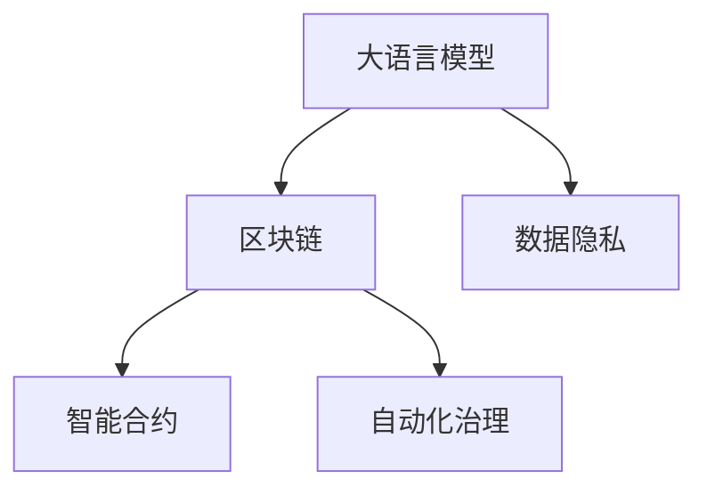
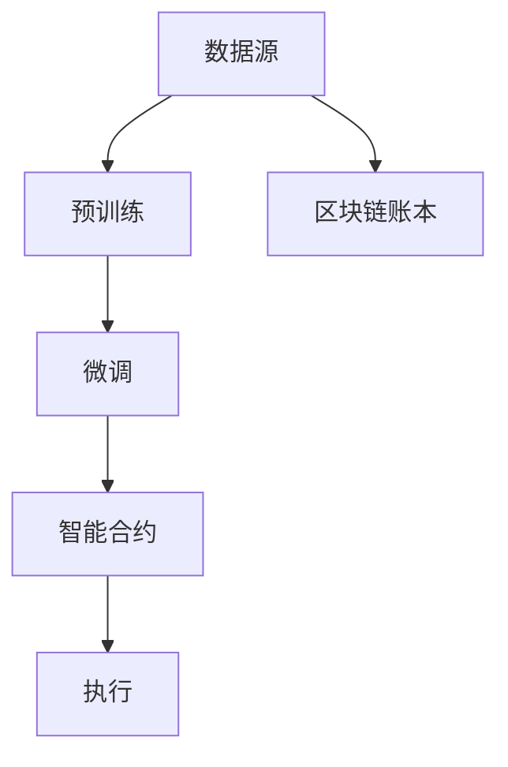

                 

# LLM与区块链技术的结合前景

> 关键词：大语言模型(LLM), 区块链(Blockchain), 人工智能(AI), 数据隐私, 智能合约, 自动化治理

## 1. 背景介绍

在过去的十年中，人工智能（AI）特别是深度学习（DL）技术取得了飞速的进步，其中大语言模型（LLM）是当前最火热的领域之一。LLM 能够理解和生成自然语言，已经在多个领域展现出巨大的潜力，如自然语言处理（NLP）、智能客服、内容生成等。与此同时，区块链技术也逐渐从比特币等加密货币的附属品转变为一种基础架构，为数字经济提供了信任与透明的基础。

两者看似无关的技术，在数据隐私、自动化治理、智能合约等领域却展现了巨大的结合前景。本篇文章将深入探讨大语言模型与区块链技术的结合前景，分析其潜在应用与挑战。

## 2. 核心概念与联系

### 2.1 核心概念概述

**大语言模型(LLM):** 是一种基于Transformer架构的深度神经网络，通过大量文本数据的自监督预训练和下游任务的微调，具备理解、生成自然语言的能力。代表模型包括GPT、BERT等。

**区块链(Blockchain):** 是一种分布式账本技术，以去中心化、透明、不可篡改为特征。其核心在于通过加密算法和共识机制保证数据的完整性和可信度。

**数据隐私:** 在处理个人和敏感数据时，确保用户隐私不被泄露，减少信息被滥用的风险。

**智能合约:** 一种自动执行合约条款的计算机程序，能够实现去中心化金融（DeFi）、供应链管理等自动化操作。

**自动化治理:** 利用智能合约和区块链，实现自动化、透明、公正的组织或系统的治理，如DAO（去中心化自治组织）。

这些核心概念之间的关系可以通过以下Mermaid流程图来展示：



该流程图展示了大语言模型与区块链技术的联系：

1. 大语言模型可以用于区块链应用中的数据隐私保护、智能合约的编写与执行、自动化治理的实施。
2. 区块链技术为数据隐私提供了分布式、不可篡改的存储基础，保障智能合约和自动化治理的执行透明度与安全性。

### 2.2 核心概念原理和架构的 Mermaid 流程图

以下是一个简单的Mermaid流程图，展示了大语言模型与区块链技术的基本架构与联系：



该流程图展示了数据源经过预训练和微调后，生成的智能合约在区块链上进行执行的流程：

1. 数据源提供大量文本数据，用于大语言模型的预训练。
2. 预训练后的模型，通过微调得到适合特定应用场景的模型。
3. 模型编写智能合约，执行在区块链上。
4. 智能合约执行的结果，被记录在区块链账本中，确保数据的不可篡改和透明性。

## 3. 核心算法原理 & 具体操作步骤

### 3.1 算法原理概述

基于大语言模型的区块链应用，本质上是一种将AI与区块链技术结合的创新方式。其核心思想是将LLM生成的信息，通过智能合约在区块链上进行自动化执行，实现数据隐私保护、自动化治理等功能。

具体而言，大语言模型在区块链上的应用可以分为以下几个步骤：

1. **数据收集与预处理**：收集用户数据，并进行隐私保护处理，如数据脱敏、去标识化等。
2. **模型预训练**：在大量无标注文本数据上预训练LLM，学习通用语言表示。
3. **任务微调**：在特定应用场景的任务数据上微调LLM，得到适应该场景的模型。
4. **智能合约编写与执行**：利用微调后的LLM编写智能合约，并部署到区块链上执行。
5. **数据记录与治理**：在区块链上记录智能合约执行结果，实现数据透明性和不可篡改性，并通过自动化治理规则进行管理。

### 3.2 算法步骤详解

以下是基于大语言模型的区块链应用的具体操作步骤：

1. **数据收集与预处理**
   - 收集用户数据，如用户行为数据、交易记录等。
   - 对数据进行预处理，如去标识化、数据脱敏等，确保数据隐私。

2. **模型预训练**
   - 选择适合的预训练模型，如BERT、GPT等。
   - 在大量无标注文本数据上预训练模型，学习通用的语言表示。

3. **任务微调**
   - 收集特定应用场景的标注数据。
   - 在标注数据上微调模型，得到适应该场景的模型。

4. **智能合约编写与执行**
   - 利用微调后的模型编写智能合约。
   - 将智能合约部署到区块链上，并执行。

5. **数据记录与治理**
   - 在区块链上记录智能合约执行结果。
   - 利用自动化治理规则，对数据进行管理与监控。

### 3.3 算法优缺点

基于大语言模型的区块链应用，具有以下优点：

1. **自动化处理**：智能合约可以自动执行规则，减少人工干预，提升效率。
2. **数据透明性**：区块链的不可篡改特性，保证了数据的透明性和可信度。
3. **隐私保护**：通过隐私保护技术，确保用户数据不被泄露。
4. **去中心化治理**：通过智能合约实现去中心化的自治，减少中心化管理的风险。

同时，该方法也存在以下局限性：

1. **计算资源消耗**：预训练和微调LLM需要大量计算资源，可能不适用于小规模应用。
2. **模型可解释性不足**：复杂的LLM模型难以解释其内部工作机制，可能存在"黑盒"问题。
3. **技术门槛高**：需要同时具备AI与区块链技术的专业知识，才能有效实现。
4. **安全性风险**：智能合约代码的漏洞可能导致严重安全问题，如资金损失等。

### 3.4 算法应用领域

基于大语言模型的区块链应用，在多个领域展现出巨大潜力，如金融、供应链、医疗等。以下是几个典型的应用场景：

1. **金融领域**
   - 利用智能合约进行资产管理，如自动化理财、保险理赔等。
   - 利用LLM生成合同文本，提高合约编写效率。

2. **供应链管理**
   - 利用智能合约进行供应链溯源、合同管理。
   - 利用LLM分析供应链数据，提高管理效率。

3. **医疗领域**
   - 利用智能合约进行患者数据管理，确保数据隐私。
   - 利用LLM分析医疗记录，辅助诊断。

4. **社交媒体**
   - 利用智能合约管理内容发布与版权保护。
   - 利用LLM生成高质量内容，提升用户体验。

这些应用场景展示了LLM与区块链技术的巨大潜力，未来将在更多领域得到广泛应用。

## 4. 数学模型和公式 & 详细讲解 & 举例说明

### 4.1 数学模型构建

在基于大语言模型的区块链应用中，数学模型的构建主要集中在智能合约的设计与执行上。以下是一个简单的数学模型构建示例：

1. **智能合约模型**
   - 输入：用户行为数据、交易记录等。
   - 处理：利用微调后的LLM模型，编写智能合约。
   - 输出：智能合约执行结果，记录在区块链账本中。

2. **自动化治理模型**
   - 输入：智能合约执行结果、用户反馈等。
   - 处理：利用LLM模型，分析数据，生成治理规则。
   - 输出：自动化执行的治理决策。

### 4.2 公式推导过程

以下是一个简单的智能合约执行的数学模型推导过程：

假设智能合约的执行结果为 $y$，输入为 $x$，模型为 $M_{\theta}$，其中 $\theta$ 为模型参数。智能合约的执行过程可以表示为：

$$ y = M_{\theta}(x) $$

其中，$M_{\theta}$ 为利用微调后的LLM模型编写的智能合约执行函数。通过 $x$ 的输入，输出 $y$ 的执行结果。

### 4.3 案例分析与讲解

以一个简单的智能合约为例，展示大语言模型在区块链上的应用：

1. **合约输入**：用户提交的支付请求。
2. **模型预处理**：利用LLM模型对支付请求进行语义理解。
3. **模型推理**：根据支付请求，生成智能合约的执行函数。
4. **合约执行**：将支付请求与执行函数输入智能合约，执行结果记录在区块链上。

## 5. 项目实践：代码实例和详细解释说明

### 5.1 开发环境搭建

在进行基于大语言模型的区块链应用开发时，需要搭建一个兼顾AI与区块链开发环境的开发环境。以下是一个基本的开发环境搭建流程：

1. **安装Python与PyTorch**：
   - 确保Python版本为3.7以上。
   - 使用conda或pip安装PyTorch。

2. **安装区块链开发工具**：
   - 安装以太坊开发工具（如Ganache）。
   - 安装Python的Web3库，用于与区块链进行交互。

3. **安装LLM模型**：
   - 使用HuggingFace等库安装预训练的LLM模型。

### 5.2 源代码详细实现

以下是一个简单的基于大语言模型的智能合约示例：

```python
import torch
from transformers import BertForSequenceClassification
from web3 import Web3

# 加载预训练模型
model = BertForSequenceClassification.from_pretrained('bert-base-uncased', num_labels=2)
model.eval()

# 连接区块链网络
w3 = Web3(Web3.HTTPProvider('http://localhost:8545'))
account = w3.eth.account.from_private_key(private_key='your_private_key')

# 编写智能合约
def make_smart_contract(message):
    token_id = hash(message)
    label = model(torch.tensor(token_id, dtype=torch.long).unsqueeze(0)).logits.argmax().item()
    return label

# 部署智能合约
contract_address = deploy_smart_contract(w3, account, make_smart_contract)

# 执行智能合约
result = contract_address.functions.execute().call()

# 记录结果
record_result(result)
```

### 5.3 代码解读与分析

以下是代码的详细解读与分析：

1. **预训练模型加载**：加载预训练的BERT模型，并进行推理。
2. **区块链连接**：使用Web3库连接本地的以太坊网络，并加载私钥。
3. **智能合约编写**：定义智能合约的逻辑，将用户提交的消息进行哈希，然后通过预训练模型进行推理，生成智能合约的执行结果。
4. **智能合约部署**：将编写的智能合约部署到区块链上。
5. **智能合约执行**：调用智能合约的执行函数，获取执行结果。
6. **结果记录**：将智能合约的执行结果记录在区块链账本中。

## 6. 实际应用场景

### 6.1 智能合约与支付
基于大语言模型的智能合约在支付场景中展现出巨大潜力。用户提交的支付请求，可以经过预训练模型的理解，生成智能合约的执行函数。例如，一个简单的智能合约可以判断支付请求是否符合特定的条件，如金额是否达到门槛，是否为重复支付等。

### 6.2 供应链溯源
在供应链管理中，智能合约可以记录货物的溯源信息，利用大语言模型分析供应链数据，生成自动化治理规则。例如，一个智能合约可以自动记录货物的生产、运输、到达等信息，并在出现问题时，通过LLM模型生成应急处理方案。

### 6.3 医疗数据管理
在医疗领域，智能合约可以管理患者数据，确保数据隐私。例如，一个智能合约可以记录患者的健康数据，并根据患者的隐私设置，控制数据的访问权限。

### 6.4 未来应用展望

基于大语言模型的区块链应用，未来将在更多领域得到广泛应用，为智能合约、数据治理等带来新的突破。

1. **金融领域**：利用智能合约进行自动化理财、保险理赔等，利用LLM生成合同文本。
2. **供应链管理**：利用智能合约进行溯源、合同管理，利用LLM分析供应链数据。
3. **医疗领域**：利用智能合约管理患者数据，利用LLM分析医疗记录。
4. **社交媒体**：利用智能合约管理内容发布与版权保护，利用LLM生成高质量内容。

## 7. 工具和资源推荐

### 7.1 学习资源推荐

为了帮助开发者系统掌握大语言模型与区块链技术的结合，这里推荐一些优质的学习资源：

1. **《深度学习与区块链技术》书籍**：介绍深度学习与区块链的基本原理，结合实际应用案例，帮助理解两者结合的应用场景。
2. **HuggingFace官方文档**：包含大量预训练模型的详细介绍，以及如何在区块链上部署和使用LLM模型的教程。
3. **Ethereum官方文档**：介绍以太坊开发的基础知识，以及如何部署和调用智能合约。
4. **以太坊开发社区**：提供大量的智能合约开发教程和案例，帮助开发者学习和实践。

### 7.2 开发工具推荐

高效的开发离不开优秀的工具支持。以下是几款用于大语言模型与区块链开发工具：

1. **PyTorch**：基于Python的深度学习框架，支持大规模模型训练和推理。
2. **Web3**：Python库，支持与以太坊等区块链网络的交互。
3. **HuggingFace Transformers**：提供大量预训练模型，支持微调和部署。
4. **Ganache**：以太坊开发工具，提供本地测试网络，支持智能合约的开发和测试。
5. **VS Code**：支持多种语言的开发环境，兼容Python、Solidity等。

合理利用这些工具，可以显著提升大语言模型与区块链技术的开发效率，加快创新迭代的步伐。

### 7.3 相关论文推荐

大语言模型与区块链技术的结合，涉及多个前沿研究领域。以下是几篇奠基性的相关论文，推荐阅读：

1. **《区块链与人工智能的结合》**：介绍区块链技术在AI领域的应用，探讨大语言模型在区块链上的应用场景。
2. **《利用智能合约进行数据隐私保护》**：讨论智能合约在数据隐私保护中的应用，利用大语言模型生成隐私保护策略。
3. **《基于大语言模型的智能合约自动化治理》**：探讨利用智能合约进行自动化治理的方法，结合大语言模型生成治理规则。

## 8. 总结：未来发展趋势与挑战

### 8.1 总结

本文对基于大语言模型的区块链应用进行了全面系统的介绍。首先阐述了大语言模型与区块链技术的研究背景和意义，明确了两者结合在数据隐私、智能合约、自动化治理等方面的巨大潜力。其次，从原理到实践，详细讲解了智能合约的编写与执行过程，给出了智能合约开发的具体代码实例。同时，本文还探讨了智能合约在实际应用中的多个场景，展示了其广阔的应用前景。

通过本文的系统梳理，可以看到，基于大语言模型的区块链应用正在成为区块链领域的重要范式，极大地拓展了区块链技术的创新空间。在区块链和AI技术的双重加持下，未来将涌现更多创新应用，为数字经济的发展注入新的动力。

### 8.2 未来发展趋势

展望未来，大语言模型与区块链技术的结合将呈现以下几个发展趋势：

1. **技术融合加速**：随着区块链和AI技术的不断发展，两者的结合将更加紧密，出现更多创新应用场景。
2. **数据隐私保护**：利用区块链的不可篡改特性，结合大语言模型生成隐私保护策略，提升数据安全性。
3. **智能合约自动化**：结合大语言模型，实现智能合约的自动编写与执行，提高效率和安全性。
4. **自动化治理**：利用区块链的透明性，结合大语言模型生成自动化治理规则，提升治理效率。
5. **跨链应用**：结合不同区块链网络的特点，利用大语言模型进行跨链数据交换与协同。

以上趋势凸显了大语言模型与区块链技术的巨大潜力，这些方向的探索发展，将进一步提升区块链技术在AI领域的价值。

### 8.3 面临的挑战

尽管大语言模型与区块链技术的结合带来了巨大潜力，但在实现过程中，仍面临诸多挑战：

1. **计算资源消耗**：大语言模型的训练和推理需要大量计算资源，可能不适用于小规模应用。
2. **模型可解释性不足**：复杂的LLM模型难以解释其内部工作机制，可能存在"黑盒"问题。
3. **技术门槛高**：需要同时具备AI与区块链技术的专业知识，才能有效实现。
4. **安全性风险**：智能合约代码的漏洞可能导致严重安全问题，如资金损失等。
5. **跨链互操作性**：不同区块链网络之间的数据交换与协同，存在技术和协议上的挑战。

尽管存在这些挑战，但随着区块链和AI技术的不断发展，相信这些难题终将一一克服，大语言模型与区块链技术的结合必将在未来发挥更大的价值。

### 8.4 研究展望

面向未来，大语言模型与区块链技术的结合研究需要在以下几个方面寻求新的突破：

1. **计算效率提升**：研究更高效的模型训练和推理方法，减少计算资源消耗。
2. **模型可解释性增强**：开发更可解释的模型，增强LLM的透明度和可信度。
3. **跨链互操作性改进**：研究跨链互操作的技术框架，提升不同区块链之间的协同效率。
4. **隐私保护技术发展**：结合区块链的不可篡改特性，开发更先进的隐私保护技术。
5. **自动化治理规则生成**：结合大语言模型，生成更全面、合理的自动化治理规则。

这些研究方向的探索，必将引领大语言模型与区块链技术的结合研究迈向更高的台阶，为构建智能合约、数据隐私保护等智能系统提供新的方法。

## 9. 附录：常见问题与解答

**Q1：如何处理大语言模型与区块链之间的交互？**

A: 使用Web3库，将大语言模型的推理结果作为智能合约的输入，执行智能合约的逻辑，并将执行结果记录在区块链账本中。

**Q2：在智能合约中使用大语言模型，需要考虑哪些问题？**

A: 在智能合约中使用大语言模型，需要考虑模型的可解释性、推理效率、安全性等问题。建议使用参数高效微调方法，减小模型参数量，提升推理效率。

**Q3：大语言模型与区块链技术结合的实际应用场景有哪些？**

A: 大语言模型与区块链技术结合的实际应用场景包括智能合约、供应链溯源、医疗数据管理、内容版权保护等。

**Q4：如何优化大语言模型在区块链上的性能？**

A: 优化大语言模型在区块链上的性能，可以从以下方面入手：
1. 选择更高效的模型架构和推理方法。
2. 使用参数高效微调方法，减少计算资源消耗。
3. 优化模型压缩和稀疏化，减少存储空间和计算量。
4. 结合区块链的不可篡改特性，确保模型的稳定性和可靠性。

通过合理优化，可以显著提升大语言模型在区块链上的性能，使其在实际应用中发挥更大的价值。

---

作者：禅与计算机程序设计艺术 / Zen and the Art of Computer Programming

