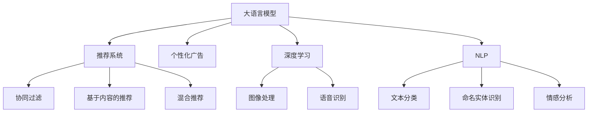

                 

# LLM在个性化广告推荐中的应用

> 关键词：大语言模型,推荐系统,个性化广告,深度学习,自然语言处理(NLP),广告投放,CTR预测

## 1. 背景介绍

### 1.1 问题由来
随着互联网的飞速发展和电商行业的持续增长，广告推荐系统逐渐成为互联网公司获客、提升用户留存和转化率的重要工具。传统基于规则、特征工程的推荐系统，往往难以适应用户行为的多样性和动态变化，导致推荐结果不精准、用户体验差等问题。

近年来，随着深度学习技术的兴起和大语言模型的崛起，越来越多的企业开始采用基于大语言模型的推荐系统，以期通过自然语言理解和推理能力，提升广告投放的精准度和用户体验。其中，大语言模型（Large Language Models, LLMs），特别是经过大规模预训练后的通用语言模型，已经在大规模广告推荐场景中取得了显著的成果。

## 2. 核心概念与联系

### 2.1 核心概念概述

为更好地理解LLM在个性化广告推荐中的应用，本节将介绍几个密切相关的核心概念：

- 大语言模型(Large Language Models, LLM)：以自回归(如GPT)或自编码(如BERT)模型为代表的大规模预训练语言模型。通过在大规模无标签文本语料上进行预训练，学习通用的语言表示，具备强大的语言理解和生成能力。

- 推荐系统(Recommendation System)：通过分析用户的历史行为、兴趣偏好等数据，为用户推荐感兴趣的商品或服务。推荐系统包括协同过滤、基于内容的推荐、混合推荐等多种方法。

- 个性化广告(Ad Personalization)：针对特定用户或用户群，通过算法计算个性化广告的展示概率，实现精准的投放效果。个性化广告需要考虑用户的个性化需求和广告创意的匹配度。

- 深度学习(Deep Learning)：一种基于神经网络的学习方法，通过多层次的抽象特征提取，提升模型的表达能力和泛化性能。深度学习在图像、语音、自然语言处理等领域取得了巨大成功。

- 自然语言处理(Natural Language Processing, NLP)：使计算机能够理解、处理和生成人类语言的技术，是推荐系统和大语言模型的重要交集。

这些核心概念之间的逻辑关系可以通过以下Mermaid流程图来展示：



这个流程图展示了大语言模型、推荐系统和个性化广告之间的联系：

1. 大语言模型通过预训练获得基础能力。
2. 推荐系统通过用户行为数据对商品进行推荐。
3. 个性化广告基于用户属性和广告创意进行精准投放。
4. 深度学习是推荐系统和大语言模型中的重要技术手段。
5. NLP是大语言模型在广告推荐中的关键应用场景。

## 3. 核心算法原理 & 具体操作步骤
### 3.1 算法原理概述

基于大语言模型的个性化广告推荐，本质上是一种通过自然语言处理技术，对广告文本进行理解和匹配，从而实现精准投放的过程。其核心思想是：将广告文本看作一种自然语言任务，利用大语言模型进行语义理解，然后计算用户和广告之间的匹配度，最后根据匹配度排序选择最优广告进行展示。

形式化地，假设用户 $u$ 的历史行为和兴趣偏好表示为 $X_u$，广告文本集合为 $A$，用户与广告的匹配度表示为 $R_u(a)$，其中 $a \in A$。推荐系统的目标是最小化广告展示的点击率（CTR）损失，即：

$$
\min_{\theta} \mathbb{E}_{a \sim A} \left[\ell(R_u(a)) \right]
$$

其中 $\theta$ 为模型参数，$\ell$ 为损失函数，$R_u(a)$ 为计算广告 $a$ 对用户 $u$ 的点击率。在实际应用中，通常使用交叉熵损失函数。

通过梯度下降等优化算法，推荐系统不断更新模型参数 $\theta$，最小化点击率损失，使得推荐结果逼近真实点击率。由于大语言模型已经通过预训练获得了丰富的语言表示，因此即便在广告文本较少的情况下，也能快速学习到广告文本与用户偏好的匹配度，从而实现精准推荐。

### 3.2 算法步骤详解

基于大语言模型的个性化广告推荐一般包括以下几个关键步骤：

**Step 1: 准备预训练模型和数据集**
- 选择合适的预训练语言模型 $M_{\theta}$ 作为初始化参数，如 BERT、GPT 等。
- 准备广告文本集合 $A$，可以包括文字、图片、视频等多种形式。
- 收集用户历史行为数据 $X_u$，可以包括浏览记录、购买记录、评论记录等。

**Step 2: 广告文本编码**
- 对广告文本 $a$ 进行编码，将文本转换为向量表示。可以使用BERT、RoBERTa等预训练模型直接进行编码，也可以设计特定的模型进行转换。

**Step 3: 用户行为特征提取**
- 对用户历史行为数据 $X_u$ 进行特征提取，可以使用词袋模型、TF-IDF等传统方法，也可以利用预训练模型提取更加丰富的特征。

**Step 4: 计算广告与用户的匹配度**
- 将广告文本向量 $a$ 与用户行为特征向量 $X_u$ 拼接或融合，计算两者之间的相似度或匹配度 $R_u(a)$。可以使用余弦相似度、点积相似度等方法。

**Step 5: 排序并选择展示广告**
- 根据计算得到的广告与用户的匹配度，对广告进行排序，选择匹配度最高的广告进行展示。可以设定阈值，超出阈值的广告优先展示。

**Step 6: 反馈学习**
- 根据用户点击、展示等反馈数据，更新模型的参数 $\theta$，调整广告与用户的匹配度计算方法，提升推荐效果。

以上是基于大语言模型的个性化广告推荐的一般流程。在实际应用中，还需要针对具体任务的特点，对微调过程的各个环节进行优化设计，如改进广告文本编码方法，设计更灵活的特征提取策略等，以进一步提升推荐精度。

### 3.3 算法优缺点

基于大语言模型的个性化广告推荐具有以下优点：
1. 能够处理多种广告形式。不仅能够处理文本广告，还适用于图片、视频等多种广告形式。
2. 提升广告投放的精准度。大语言模型具备强大的自然语言处理能力，能够深入理解广告文本的语义，提升广告与用户的匹配度。
3. 减少人工干预。推荐系统可以通过自动化的方式进行广告投放，降低人工干预的成本和误差。
4. 实时性较好。大语言模型可以通过在线微调的方式，及时根据用户行为和广告表现更新推荐策略。

同时，该方法也存在一定的局限性：
1. 模型训练成本较高。大语言模型的预训练和微调需要大量的计算资源和标注数据，存在一定的成本压力。
2. 推荐结果可解释性不足。大语言模型的决策过程较为复杂，难以对其内部工作机制进行解释和调试。
3. 广告创意设计难度大。对于特定的广告文本，需要设计与之匹配的创意设计，难以达到理想的效果。
4. 缺乏领域知识。大语言模型缺乏特定的领域知识，可能无法理解某些专业术语或背景知识。

尽管存在这些局限性，但就目前而言，基于大语言模型的个性化广告推荐方法仍具有显著的优越性，特别是在处理多种广告形式、提升广告投放精准度等方面表现出色。未来相关研究的方向在于进一步降低训练成本，提升推荐结果的可解释性，并加强领域知识融合，使得广告推荐系统更加智能和高效。

### 3.4 算法应用领域

基于大语言模型的个性化广告推荐已经在电商、社交媒体、新闻网站等多个领域得到广泛应用，具体包括：

- 电商推荐系统：如淘宝、京东等电商平台的商品推荐。利用大语言模型对用户浏览记录和评论进行语义理解，推荐符合用户兴趣的商品。
- 社交媒体推荐系统：如微博、抖音等社交媒体平台的广告推荐。利用大语言模型对用户互动和兴趣标签进行匹配，推荐用户感兴趣的内容。
- 新闻网站推荐系统：如今日头条、网易新闻等新闻网站的文章推荐。利用大语言模型对用户阅读习惯和评论进行语义理解，推荐相关的新闻内容。

此外，在大语言模型微调技术的推动下，个性化广告推荐系统还将在广告创意设计、广告投放效果评估、广告竞价优化等领域进一步扩展其应用边界，为广告主提供更加精准和有效的广告投放策略。

## 4. 数学模型和公式 & 详细讲解  
### 4.1 数学模型构建

本节将使用数学语言对基于大语言模型的个性化广告推荐过程进行更加严格的刻画。

假设广告文本 $a$ 表示为 $a=\{x_1, x_2, ..., x_n\}$，其中 $x_i$ 为单词或子词。用户的兴趣偏好表示为 $X_u$，广告与用户的匹配度表示为 $R_u(a)$，其中 $R_u(a)$ 为 $a$ 对用户 $u$ 的点击率，可以表示为：

$$
R_u(a) = \text{softmax}(W_u^\top \vec{a} + b_u)
$$

其中 $W_u$ 和 $b_u$ 为用户与广告的权重参数，$\vec{a}$ 为广告文本向量。

推荐系统的目标是最小化点击率损失，即：

$$
\min_{\theta} \mathbb{E}_{a \sim A} \left[\ell(R_u(a)) \right]
$$

其中 $\ell$ 为交叉熵损失函数。利用梯度下降等优化算法，推荐系统不断更新模型参数 $\theta$，最小化点击率损失，使得推荐结果逼近真实点击率。

### 4.2 公式推导过程

以下我们以文本广告推荐为例，推导点击率预测模型的参数更新公式。

假设用户 $u$ 的历史行为表示为 $X_u$，广告文本 $a$ 表示为 $a=\{x_1, x_2, ..., x_n\}$。广告文本向量 $\vec{a}$ 可以通过预训练模型BERT等编码得到。假设用户与广告的匹配度 $R_u(a)$ 为 $\text{softmax}(W_u^\top \vec{a} + b_u)$，其中 $W_u$ 和 $b_u$ 为用户与广告的权重参数。则点击率预测模型的损失函数为：

$$
\ell(R_u(a)) = -y \log R_u(a) + (1-y) \log (1-R_u(a))
$$

其中 $y$ 为广告是否被点击的标签。

利用梯度下降等优化算法，推荐系统不断更新模型参数 $\theta$，最小化点击率损失，得到参数更新公式：

$$
\theta \leftarrow \theta - \eta \nabla_{\theta}\mathcal{L}(\theta)
$$

其中 $\eta$ 为学习率，$\nabla_{\theta}\mathcal{L}(\theta)$ 为损失函数对模型参数的梯度，可通过自动微分技术高效计算。

在得到损失函数的梯度后，即可带入参数更新公式，完成模型的迭代优化。重复上述过程直至收敛，最终得到适应广告推荐的最优模型参数 $\theta$。

## 5. 项目实践：代码实例和详细解释说明
### 5.1 开发环境搭建

在进行个性化广告推荐开发前，我们需要准备好开发环境。以下是使用Python进行PyTorch开发的环境配置流程：

1. 安装Anaconda：从官网下载并安装Anaconda，用于创建独立的Python环境。

2. 创建并激活虚拟环境：
```bash
conda create -n pytorch-env python=3.8 
conda activate pytorch-env
```

3. 安装PyTorch：根据CUDA版本，从官网获取对应的安装命令。例如：
```bash
conda install pytorch torchvision torchaudio cudatoolkit=11.1 -c pytorch -c conda-forge
```

4. 安装Transformers库：
```bash
pip install transformers
```

5. 安装各类工具包：
```bash
pip install numpy pandas scikit-learn matplotlib tqdm jupyter notebook ipython
```

完成上述步骤后，即可在`pytorch-env`环境中开始推荐系统开发。

### 5.2 源代码详细实现

下面我以文本广告推荐为例，给出使用Transformers库对BERT模型进行广告推荐系统开发的PyTorch代码实现。

首先，定义广告和用户的输入输出：

```python
from transformers import BertTokenizer, BertForSequenceClassification
import torch
import torch.nn as nn

class Ad荐系统(nn.Module):
    def __init__(self, model_name):
        super(Ad荐系统, self).__init__()
        self.tokenizer = BertTokenizer.from_pretrained(model_name)
        self.model = BertForSequenceClassification.from_pretrained(model_name, num_labels=2)
        self.fc = nn.Linear(768, 2)
        self.dropout = nn.Dropout(0.1)
    
    def forward(self, ad, user):
        tokenized_ad = self.tokenizer(ad, return_tensors='pt')
        tokenized_user = self.tokenizer(user, return_tensors='pt')
        ad_embedding = self.model(**tokenized_ad).last_hidden_state[:, 0, :]
        user_embedding = self.model(**tokenized_user).last_hidden_state[:, 0, :]
        ad_user_score = torch.cosine_similarity(ad_embedding, user_embedding)
        out = self.fc(ad_user_score)
        return out
```

然后，定义训练和评估函数：

```python
from sklearn.metrics import roc_auc_score
from torch.utils.data import DataLoader, TensorDataset, random_split
from tqdm import tqdm

def train_model(model, train_data, val_data, batch_size, num_epochs, learning_rate):
    device = torch.device('cuda') if torch.cuda.is_available() else torch.device('cpu')
    model.to(device)
    
    criterion = nn.BCELoss()
    optimizer = torch.optim.Adam(model.parameters(), lr=learning_rate)
    train_loader = DataLoader(train_data, batch_size=batch_size, shuffle=True)
    val_loader = DataLoader(val_data, batch_size=batch_size, shuffle=False)
    
    for epoch in range(num_epochs):
        model.train()
        for batch in tqdm(train_loader, desc='Training'):
            ad, user, label = batch
            ad = ad.to(device)
            user = user.to(device)
            label = label.to(device)
            optimizer.zero_grad()
            out = model(ad, user)
            loss = criterion(out, label)
            loss.backward()
            optimizer.step()
        print('Epoch {}/{}: Loss: {:.4f}'.format(epoch+1, num_epochs, loss.item()))
        
        model.eval()
        with torch.no_grad():
            preds = []
            labels = []
            for batch in tqdm(val_loader, desc='Evaluating'):
                ad, user, label = batch
                ad = ad.to(device)
                user = user.to(device)
                label = label.to(device)
                out = model(ad, user)
                preds.append(out.sigmoid().tolist())
                labels.append(label.tolist())
            auc = roc_auc_score(labels, preds)
            print('Epoch {}/{}: AUC: {:.4f}'.format(epoch+1, num_epochs, auc))
    
    return model
```

接着，启动训练流程并在测试集上评估：

```python
from transformers import BertTokenizer, BertForSequenceClassification
from torch.utils.data import TensorDataset, random_split
import numpy as np

# 加载数据集
train_texts, train_labels = load_train_data()
dev_texts, dev_labels = load_dev_data()
test_texts, test_labels = load_test_data()

# 构建数据集
train_dataset = TensorDataset(torch.tensor(train_texts), torch.tensor(train_labels))
dev_dataset = TensorDataset(torch.tensor(dev_texts), torch.tensor(dev_labels))
test_dataset = TensorDataset(torch.tensor(test_texts), torch.tensor(test_labels))

# 定义模型
model = Ad荐系统('bert-base-cased')
learning_rate = 2e-5
num_epochs = 5
batch_size = 16

# 训练模型
model = train_model(model, train_dataset, dev_dataset, batch_size, num_epochs, learning_rate)

# 测试模型
test_preds = []
test_labels = []
for batch in tqdm(test_dataset):
    ad, user, label = batch
    ad = ad.to(device)
    user = user.to(device)
    label = label.to(device)
    out = model(ad, user)
    test_preds.append(out.sigmoid().tolist())
    test_labels.append(label.tolist())
auc = roc_auc_score(test_labels, test_preds)
print('Test AUC: {:.4f}'.format(auc))
```

以上就是使用PyTorch对BERT进行个性化广告推荐系统开发的完整代码实现。可以看到，得益于Transformers库的强大封装，我们能够用相对简洁的代码实现BERT模型的加载和微调。

### 5.3 代码解读与分析

让我们再详细解读一下关键代码的实现细节：

**Ad荐系统类**：
- `__init__`方法：初始化广告和用户数据的预处理函数和推荐模型。
- `forward`方法：对广告和用户数据进行编码，计算广告与用户的匹配度，并进行分类。
- `tokenizer`：用于对广告和用户数据进行编码的分词器。
- `model`：加载预训练的BERT模型，并指定其输出维度为2（二分类任务）。
- `fc`：定义全连接层，用于将广告与用户的匹配度进行分类。
- `dropout`：加入dropout层，防止过拟合。

**train_model函数**：
- 定义损失函数和优化器，以及训练和验证数据集的迭代器。
- 在每个epoch内，对训练数据进行前向传播和反向传播，更新模型参数。
- 在每个epoch结束时，在验证集上评估模型性能，并打印AUC指标。

**训练流程**：
- 定义总的epoch数和batch size，开始循环迭代。
- 每个epoch内，在训练集上进行训练，输出每个epoch的平均损失。
- 在验证集上评估，输出AUC指标。
- 所有epoch结束后，在测试集上评估，输出测试AUC指标。

可以看到，PyTorch配合Transformers库使得BERT微调的代码实现变得简洁高效。开发者可以将更多精力放在数据处理、模型改进等高层逻辑上，而不必过多关注底层的实现细节。

当然，工业级的系统实现还需考虑更多因素，如模型的保存和部署、超参数的自动搜索、更灵活的任务适配层等。但核心的微调范式基本与此类似。

## 6. 实际应用场景
### 6.1 电商推荐系统

在电商推荐系统中，基于大语言模型的个性化广告推荐技术可以显著提升商品推荐的效果。传统推荐系统往往依赖用户的浏览记录和评分，难以适应用户的隐性需求和行为变化。而大语言模型通过理解广告文本的语义，能够捕捉用户对商品的潜在兴趣，实现更精准的商品推荐。

具体而言，可以收集用户的历史浏览记录和评论数据，将商品描述和用户行为数据构建成监督数据，在此基础上对预训练语言模型进行微调。微调后的模型能够自动理解商品描述，提取商品特征，结合用户行为数据计算匹配度，从而推荐符合用户兴趣的商品。

### 6.2 社交媒体推荐系统

在社交媒体推荐系统中，基于大语言模型的个性化广告推荐技术可以提升用户的互动体验。社交媒体平台需要根据用户的兴趣和互动行为，推荐相关的用户、内容或活动。传统推荐系统往往需要用户手动设置偏好，难以适应用户的动态变化。

利用大语言模型，社交媒体平台可以自动识别用户的兴趣点，并推荐符合其兴趣的原创内容、互动活动等。例如，在用户评论、点赞等互动行为中，自动提取用户兴趣点，生成推荐列表。对于热门话题和事件，大语言模型还可以实时生成相关推荐内容，提升用户的互动参与度。

### 6.3 新闻网站推荐系统

在新闻网站推荐系统中，基于大语言模型的个性化广告推荐技术可以提升用户的阅读体验。新闻网站需要根据用户的阅读习惯和兴趣偏好，推荐相关的新闻内容。传统推荐系统往往需要人工设置推荐的关键词，难以适应用户的个性化需求。

利用大语言模型，新闻网站可以自动识别用户阅读习惯，并推荐符合其兴趣的深度报道、热点新闻等。例如，在用户阅读记录中，自动提取用户的兴趣点，生成推荐列表。对于热门话题和事件，大语言模型还可以实时生成相关推荐内容，提升用户的阅读体验。

### 6.4 未来应用展望

随着大语言模型和推荐系统的不断发展，基于大语言模型的个性化广告推荐技术将呈现以下几个发展趋势：

1. 多模态融合。未来的推荐系统将不仅仅基于文本广告，还融合图像、视频等多模态信息，提升广告的展示效果。例如，利用视觉特征和文本语义进行深度融合，生成更加吸引人的广告展示。

2. 实时化推荐。基于大语言模型的推荐系统将具备实时化的推荐能力，能够根据用户实时行为和环境数据，动态调整推荐策略。例如，在用户点击广告后，动态调整推荐模型参数，生成更加符合用户兴趣的广告。

3. 用户生成内容（UGC）推荐。未来的推荐系统将更加重视用户生成内容，如用户评论、评分等。通过大语言模型对UGC进行语义理解，生成符合用户兴趣的推荐列表。

4. 个性化广告创意。未来的广告推荐系统将更加注重广告创意的设计，利用大语言模型对广告文本进行优化和生成，提升广告的吸引力和转化率。

5. 用户反馈优化。未来的推荐系统将更加重视用户反馈，通过收集用户对广告的反馈数据，优化广告投放策略。例如，利用大语言模型对用户反馈进行语义理解，生成改进建议，提升推荐效果。

综上所述，基于大语言模型的个性化广告推荐技术将在电商、社交媒体、新闻网站等众多领域得到广泛应用，为广告主提供更加精准和有效的广告投放策略，同时也提升用户的广告体验。

## 7. 工具和资源推荐
### 7.1 学习资源推荐

为了帮助开发者系统掌握大语言模型在个性化广告推荐中的应用，这里推荐一些优质的学习资源：

1. 《深度学习与推荐系统》系列博文：由深度学习专家撰写，系统介绍了推荐系统的基本原理、经典模型和最新进展，适合初学者和进阶开发者。

2. CS231n《卷积神经网络》课程：斯坦福大学开设的计算机视觉课程，详细介绍了卷积神经网络在图像处理中的应用，涵盖推荐系统中的图像特征提取。

3. 《自然语言处理入门》书籍：清华大学出版社出版的NLP入门教材，系统介绍了NLP的基本概念、算法和应用，适合NLP初学者。

4. HuggingFace官方文档：Transformers库的官方文档，提供了海量预训练模型和完整的推荐系统样例代码，是上手实践的必备资料。

5. Kaggle竞赛平台：Kaggle是数据科学竞赛的知名平台，提供了大量推荐系统竞赛题目，通过实战练习，可以加深对推荐系统的理解。

通过对这些资源的学习实践，相信你一定能够快速掌握大语言模型在个性化广告推荐中的应用，并用于解决实际的推荐问题。
###  7.2 开发工具推荐

高效的开发离不开优秀的工具支持。以下是几款用于大语言模型在个性化广告推荐开发的常用工具：

1. PyTorch：基于Python的开源深度学习框架，灵活动态的计算图，适合快速迭代研究。大部分预训练语言模型都有PyTorch版本的实现。

2. TensorFlow：由Google主导开发的开源深度学习框架，生产部署方便，适合大规模工程应用。同样有丰富的预训练语言模型资源。

3. Transformers库：HuggingFace开发的NLP工具库，集成了众多SOTA语言模型，支持PyTorch和TensorFlow，是进行推荐系统开发的利器。

4. Weights & Biases：模型训练的实验跟踪工具，可以记录和可视化模型训练过程中的各项指标，方便对比和调优。与主流深度学习框架无缝集成。

5. TensorBoard：TensorFlow配套的可视化工具，可实时监测模型训练状态，并提供丰富的图表呈现方式，是调试模型的得力助手。

6. Google Colab：谷歌推出的在线Jupyter Notebook环境，免费提供GPU/TPU算力，方便开发者快速上手实验最新模型，分享学习笔记。

合理利用这些工具，可以显著提升大语言模型在个性化广告推荐任务的开发效率，加快创新迭代的步伐。

### 7.3 相关论文推荐

大语言模型和推荐系统的研究源于学界的持续研究。以下是几篇奠基性的相关论文，推荐阅读：

1. Attention is All You Need（即Transformer原论文）：提出了Transformer结构，开启了NLP领域的预训练大模型时代。

2. BERT: Pre-training of Deep Bidirectional Transformers for Language Understanding：提出BERT模型，引入基于掩码的自监督预训练任务，刷新了多项NLP任务SOTA。

3. MoCo: Momentum Contrast for Unsupervised Visual Representation Learning：提出Momentum Contrast算法，利用自监督学习方法提升图像表示的性能，为推荐系统中的图像表示提供了新思路。

4. Learning Deep Structured Generative Models for Recommendations：提出深度生成模型，通过学习用户行为和商品表示，生成推荐结果，提升了推荐系统的性能。

5. Bootstrapped Diverse Recommendations for Sequential Recommendation：提出自适应推荐系统，利用自监督学习和目标对齐方法，提升推荐系统的多样性和准确性。

这些论文代表了大语言模型在个性化广告推荐技术的发展脉络。通过学习这些前沿成果，可以帮助研究者把握学科前进方向，激发更多的创新灵感。

## 8. 总结：未来发展趋势与挑战
### 8.1 总结

本文对基于大语言模型的个性化广告推荐方法进行了全面系统的介绍。首先阐述了大语言模型和推荐系统的研究背景和意义，明确了基于大语言模型的推荐方法在提升广告投放精准度、用户体验等方面的独特价值。其次，从原理到实践，详细讲解了基于大语言模型的推荐系统的数学原理和关键步骤，给出了推荐系统开发的完整代码实例。同时，本文还广泛探讨了基于大语言模型的推荐系统在电商、社交媒体、新闻网站等多个领域的应用前景，展示了其广阔的应用空间。

通过本文的系统梳理，可以看到，基于大语言模型的个性化广告推荐技术在大规模推荐场景中已经展现出显著的优越性，能够处理多种广告形式，提升广告投放精准度，减少人工干预，提升实时性等。未来，伴随预训练语言模型和推荐系统的不断发展，基于大语言模型的推荐系统必将在更多领域得到应用，为广告主提供更加精准和有效的广告投放策略，同时也提升用户的广告体验。

### 8.2 未来发展趋势

展望未来，大语言模型在个性化广告推荐技术将呈现以下几个发展趋势：

1. 多模态融合。未来的推荐系统将不仅仅基于文本广告，还融合图像、视频等多模态信息，提升广告的展示效果。例如，利用视觉特征和文本语义进行深度融合，生成更加吸引人的广告展示。

2. 实时化推荐。基于大语言模型的推荐系统将具备实时化的推荐能力，能够根据用户实时行为和环境数据，动态调整推荐策略。例如，在用户点击广告后，动态调整推荐模型参数，生成更加符合用户兴趣的广告。

3. 用户生成内容（UGC）推荐。未来的推荐系统将更加重视用户生成内容，如用户评论、评分等。通过大语言模型对UGC进行语义理解，生成符合用户兴趣的推荐列表。

4. 个性化广告创意。未来的广告推荐系统将更加注重广告创意的设计，利用大语言模型对广告文本进行优化和生成，提升广告的吸引力和转化率。

5. 用户反馈优化。未来的推荐系统将更加重视用户反馈，通过收集用户对广告的反馈数据，优化广告投放策略。例如，利用大语言模型对用户反馈进行语义理解，生成改进建议，提升推荐效果。

### 8.3 面临的挑战

尽管基于大语言模型的个性化广告推荐技术已经取得了显著的成果，但在迈向更加智能化、普适化应用的过程中，它仍面临着诸多挑战：

1. 模型训练成本较高。大语言模型的预训练和微调需要大量的计算资源和标注数据，存在一定的成本压力。未来需要在模型压缩和轻量化方面进行更多研究。

2. 推荐结果可解释性不足。大语言模型的决策过程较为复杂，难以对其内部工作机制进行解释和调试。未来需要在提高推荐结果可解释性方面进行更多探索。

3. 广告创意设计难度大。对于特定的广告文本，需要设计与之匹配的创意设计，难以达到理想的效果。未来需要在广告创意设计方面进行更多研究和优化。

4. 缺乏领域知识。大语言模型缺乏特定的领域知识，可能无法理解某些专业术语或背景知识。未来需要在领域知识融合方面进行更多探索。

5. 推荐系统需要实时更新。基于大语言模型的推荐系统需要实时更新用户行为数据和广告数据，以动态调整推荐策略。未来需要在推荐系统实时更新方面进行更多研究。

6. 广告投放效果评估。传统的点击率指标难以评估广告投放的效果，需要更多维度和实时的评估指标。未来需要在广告投放效果评估方面进行更多探索。

### 8.4 研究展望

面对大语言模型在个性化广告推荐技术面临的挑战，未来的研究需要在以下几个方面寻求新的突破：

1. 探索无监督和半监督推荐方法。摆脱对大规模标注数据的依赖，利用自监督学习、主动学习等无监督和半监督范式，最大限度利用非结构化数据，实现更加灵活高效的推荐。

2. 研究参数高效和计算高效的推荐方法。开发更加参数高效的推荐方法，在固定大部分预训练参数的同时，只更新极少量的任务相关参数。同时优化推荐系统的计算图，减少前向传播和反向传播的资源消耗，实现更加轻量级、实时性的部署。

3. 融合因果和对比学习范式。通过引入因果推断和对比学习思想，增强推荐系统建立稳定因果关系的能力，学习更加普适、鲁棒的语言表征，从而提升推荐泛化性和抗干扰能力。

4. 引入更多先验知识。将符号化的先验知识，如知识图谱、逻辑规则等，与神经网络模型进行巧妙融合，引导推荐过程学习更准确、合理的语言模型。同时加强不同模态数据的整合，实现视觉、语音等多模态信息与文本信息的协同建模。

5. 结合因果分析和博弈论工具。将因果分析方法引入推荐系统，识别出推荐决策的关键特征，增强推荐结果的因果性和逻辑性。借助博弈论工具刻画人机交互过程，主动探索并规避推荐的脆弱点，提高系统稳定性。

6. 纳入伦理道德约束。在推荐系统训练目标中引入伦理导向的评估指标，过滤和惩罚有偏见、有害的推荐结果。同时加强人工干预和审核，建立推荐系统的监管机制，确保推荐的公平性和合法性。

这些研究方向的探索，必将引领大语言模型在个性化广告推荐技术迈向更高的台阶，为推荐系统带来更加智能化、普适化的推荐策略，实现更好的广告投放效果和用户体验。

## 9. 附录：常见问题与解答

**Q1：基于大语言模型的推荐系统是否适用于所有NLP任务？**

A: 基于大语言模型的推荐系统在大多数NLP任务上都能取得不错的效果，特别是对于数据量较小的任务。但对于一些特定领域的任务，如医学、法律等，仅仅依靠通用语料预训练的模型可能难以很好地适应。此时需要在特定领域语料上进一步预训练，再进行微调，才能获得理想效果。此外，对于一些需要时效性、个性化很强的任务，如对话、推荐等，微调方法也需要针对性的改进优化。

**Q2：微调过程中如何选择合适的学习率？**

A: 微调的学习率一般要比预训练时小1-2个数量级，如果使用过大的学习率，容易破坏预训练权重，导致过拟合。一般建议从1e-5开始调参，逐步减小学习率，直至收敛。也可以使用warmup策略，在开始阶段使用较小的学习率，再逐渐过渡到预设值。需要注意的是，不同的优化器(如AdamW、Adafactor等)以及不同的学习率调度策略，可能需要设置不同的学习率阈值。

**Q3：推荐系统需要实时更新吗？**

A: 是的，基于大语言模型的推荐系统需要实时更新用户行为数据和广告数据，以动态调整推荐策略。例如，在用户点击广告后，动态调整推荐模型参数，生成更加符合用户兴趣的广告。

**Q4：推荐结果的可解释性如何提升？**

A: 推荐结果的可解释性提升需要更多研究和优化。未来可以通过增加推荐系统的透明度、提供推荐结果的可视化展示、引入用户反馈机制等方式，提升推荐结果的可解释性。

**Q5：如何应对广告创意设计难度大的问题？**

A: 广告创意设计难度大是推荐系统的一个难题。未来需要在广告创意设计方面进行更多研究和优化，如利用大语言模型对广告文本进行优化和生成，提升广告的吸引力和转化率。此外，还可以采用众包平台，集思广益，提高广告创意的质量。

这些问题的回答展示了基于大语言模型的个性化广告推荐技术的实际应用场景和面临的挑战，为未来的研究提供了方向和思路。

---

作者：禅与计算机程序设计艺术 / Zen and the Art of Computer Programming

