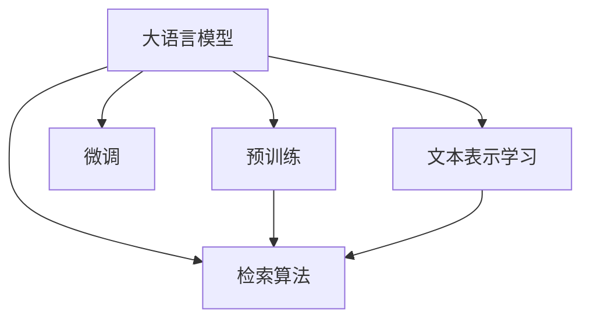

                 

# LLM在信息检索领域的技术创新

> 关键词：大语言模型, 信息检索, 自然语言处理(NLP), 预训练模型, 微调,Fine-tuning, 检索准确性, 深度学习, 文本处理

## 1. 背景介绍

### 1.1 问题由来

信息检索是计算机科学领域的一项核心技术，旨在高效地获取相关文档或数据。传统的基于关键词匹配的信息检索方法存在诸多局限，如搜索结果相关性差、无法处理语义信息等。近年来，随着深度学习技术在自然语言处理(NLP)领域的迅速发展，信息检索领域也开始引入大语言模型(Large Language Models, LLM)，以提升检索任务的准确性和效率。

大语言模型是一种基于深度神经网络的模型，通过大规模无标签数据进行预训练，学习到通用的语言表示。这些模型已经在多种NLP任务上取得了突破性的表现，包括文本分类、问答、翻译等。在信息检索领域，大语言模型被用于文本表示学习、查询重写、文档排序等环节，显著提升了检索系统的性能。

### 1.2 问题核心关键点

信息检索系统中，大语言模型的应用主要体现在两个方面：

- **文本表示学习**：通过预训练或微调，学习文本的语义表示，提升文本相似度计算的精度。
- **检索算法优化**：利用大语言模型的语义理解和生成能力，改进检索算法，提升搜索结果的相关性和质量。

目前，大语言模型在信息检索领域的研究集中在预训练模型、微调方法、检索算法等方面，取得了丰硕的研究成果。这些技术创新不仅提升了信息检索系统的效率，还拓展了其应用边界，推动了NLP技术在实际场景中的应用。

## 2. 核心概念与联系

### 2.1 核心概念概述

为更好地理解大语言模型在信息检索领域的应用，本节将介绍几个关键概念及其联系：

- **大语言模型**：指基于深度学习架构的预训练模型，如BERT、GPT、RoBERTa等，通过大规模无标签文本数据进行预训练，学习到通用的语言表示。
- **预训练模型**：指在大规模无标签数据上训练的模型，用于提取数据中的高级特征，提升模型性能。
- **微调(Fine-tuning)**：指在大规模预训练模型的基础上，利用有标签数据进行微调，使其适应特定任务的需求。
- **文本表示学习**：指将文本映射到低维向量空间，学习文本的语义表示，用于计算文本相似度、文本分类等。
- **检索算法**：指信息检索系统中用于排序和检索的相关算法，如倒排索引、向量空间模型等。

这些概念之间的联系可以通过以下Mermaid流程图来展示：



这个流程图展示了从大语言模型的预训练，到微调、文本表示学习、检索算法的应用过程。预训练模型通过大规模无标签数据学习到通用的语言表示，微调模型进一步适应特定任务，文本表示学习提升文本相似度计算精度，检索算法基于文本表示进行排序和检索，最终完成信息检索任务。

## 3. 核心算法原理 & 具体操作步骤

### 3.1 算法原理概述

基于大语言模型的信息检索系统，主要包括以下几个关键步骤：

1. **文本表示学习**：将待检索文本和文档库中的文本映射到低维向量空间，计算它们的相似度。
2. **文本编码**：利用大语言模型对文本进行编码，得到文本的语义表示。
3. **检索排序**：基于文本表示计算检索结果的相关性，排序后返回最相关的文档。

在文本表示学习过程中，常用的方法包括：

- **词嵌入**：将单词或短语映射到低维向量空间，保留其语义信息。如Word2Vec、GloVe等。
- **句子嵌入**：将整个句子映射到低维向量空间，学习句子的语义表示。如Doc2Vec、Bow2Vec等。
- **预训练语言模型**：如BERT、GPT、RoBERTa等，直接学习文本的语义表示，提升检索任务的性能。

### 3.2 算法步骤详解

以下是基于大语言模型的信息检索系统的主要步骤和关键实现：

**Step 1: 准备数据集**
- 收集待检索文本和文档库中的文本。
- 使用预训练语言模型（如BERT、GPT、RoBERTa等）对文本进行编码，得到文本的语义表示。
- 将文本表示向量存储到倒排索引中。

**Step 2: 文本编码**
- 利用预训练语言模型对待检索文本进行编码，得到文本的语义表示。
- 使用模型参数微调或冻结策略，选择合适的文本表示方法。

**Step 3: 相似度计算**
- 使用文本表示计算待检索文本与文档库中文本的相似度。
- 根据相似度排序，返回最相关的文档。

**Step 4: 检索排序**
- 利用检索算法（如向量空间模型、TF-IDF等）对文档库中的文本进行排序。
- 根据排序结果返回最相关的文档。

### 3.3 算法优缺点

基于大语言模型的信息检索系统具有以下优点：

1. **提升检索准确性**：大语言模型能够学习到更丰富的语义信息，提升文本表示的精度，从而提升检索任务的准确性。
2. **拓展应用边界**：大语言模型可以在多种NLP任务上进行微调，应用于文本分类、问答、摘要等任务，提升检索系统的功能。
3. **提高处理效率**：大语言模型可以加速文本编码和相似度计算过程，提升检索系统的处理效率。

同时，该方法也存在一些局限性：

1. **计算资源消耗大**：大语言模型参数量庞大，训练和推理过程中需要消耗大量的计算资源。
2. **依赖数据质量**：预训练和微调模型的效果很大程度上取决于训练数据的质量，数据质量差会影响模型性能。
3. **对抗攻击敏感**：大语言模型可能对对抗攻击敏感，如输入噪声、数据分布变化等，影响检索系统的稳定性。
4. **可解释性不足**：大语言模型作为黑盒模型，其内部工作机制难以解释，影响系统的可信度和可控性。

尽管存在这些局限性，但就目前而言，基于大语言模型的信息检索方法仍然是提升检索系统性能的重要手段。未来相关研究的重点在于如何进一步降低计算资源消耗，提高模型鲁棒性，增强系统的可解释性和安全性等因素。

### 3.4 算法应用领域

大语言模型在信息检索领域的应用广泛，覆盖了多个领域，例如：

- **搜索引擎**：如百度、Google等主流搜索引擎，利用大语言模型提升检索结果的相关性和用户满意度。
- **数字图书馆**：如图书馆的电子书籍检索系统，利用大语言模型提升搜索结果的精准度和覆盖率。
- **学术数据库**：如ResearchGate、PubMed等学术数据库，利用大语言模型提升文献检索和论文推荐的效果。
- **法律检索**：如法律数据库的案例检索系统，利用大语言模型提升法律条文和案例的检索效率和准确性。
- **金融数据库**：如金融市场的股票、债券、基金等数据检索系统，利用大语言模型提升金融数据的处理和分析能力。

除了上述这些经典应用外，大语言模型还被创新性地应用于更多领域中，如医疗检索、新闻推荐、智能客服等，为信息检索技术带来了新的突破。

## 4. 数学模型和公式 & 详细讲解 & 举例说明

### 4.1 数学模型构建

在大语言模型基础上进行信息检索任务时，通常会构建以下数学模型：

设文本 $x_i \in \mathbb{R}^d$ 表示待检索文本，文档库中文档 $d_j \in \mathbb{R}^d$ 表示文本的语义表示，$S$ 表示文档库中的所有文本。文本 $x_i$ 与文档 $d_j$ 的相似度定义为 $s(x_i, d_j)$，检索系统的目标是最小化文本 $x_i$ 与所有文档 $d_j \in S$ 的相似度误差，即：

$$
\mathop{\arg\min}_{d_j} \sum_{j=1}^N s(x_i, d_j)
$$

其中 $s(x_i, d_j)$ 表示文本 $x_i$ 与文档 $d_j$ 的相似度。常用的相似度计算方法包括余弦相似度、欧氏距离、Jaccard距离等。

### 4.2 公式推导过程

以余弦相似度为例，文本 $x_i$ 与文档 $d_j$ 的余弦相似度定义为：

$$
s(x_i, d_j) = \frac{x_i^T d_j}{\|x_i\|\|d_j\|}
$$

其中 $x_i^T$ 表示 $x_i$ 的转置，$\|x_i\|$ 表示 $x_i$ 的欧氏范数。根据上述公式，文本 $x_i$ 与文档库中所有文档 $d_j \in S$ 的余弦相似度矩阵为 $S_{ij} = s(x_i, d_j)$。

检索系统的目标是最小化相似度误差，即：

$$
\mathop{\arg\min}_{S} \sum_{i=1}^M \sum_{j=1}^N S_{ij}
$$

其中 $M$ 表示待检索文本的数量，$N$ 表示文档库中文档的数量。

### 4.3 案例分析与讲解

以Google的BERT语言模型为例，其应用于信息检索任务的流程如下：

1. **文本编码**：使用BERT对文本进行编码，得到文本的语义表示。
2. **相似度计算**：计算待检索文本与文档库中所有文档的余弦相似度。
3. **检索排序**：利用余弦相似度矩阵对文档库中的文本进行排序，返回最相关的文档。

在实际应用中，BERT的编码器参数可以微调，以适应特定的检索任务。例如，在学术论文检索中，可以微调BERT的分类器，使其能够更好地识别不同学科领域的论文。

## 5. 项目实践：代码实例和详细解释说明

### 5.1 开发环境搭建

在进行信息检索任务开发时，需要准备相关的开发环境。以下是使用Python进行信息检索系统开发的环境配置流程：

1. 安装Anaconda：从官网下载并安装Anaconda，用于创建独立的Python环境。

2. 创建并激活虚拟环境：
```bash
conda create -n ir-env python=3.8 
conda activate ir-env
```

3. 安装必要的Python库：
```bash
pip install torch transformers scikit-learn pandas numpy
```

4. 安装Google Cloud：安装Google Cloud SDK，用于访问和处理Google云上的数据。

5. 安装TensorFlow：根据CUDA版本，从官网获取对应的安装命令。例如：
```bash
conda install pytorch torchvision torchaudio cudatoolkit=11.1 -c pytorch -c conda-forge
```

### 5.2 源代码详细实现

这里我们以BERT应用于文本分类为例，给出使用Transformers库进行信息检索系统的PyTorch代码实现。

首先，定义文本分类任务的数据处理函数：

```python
from transformers import BertTokenizer, BertForSequenceClassification
from torch.utils.data import Dataset
import torch

class TextClassificationDataset(Dataset):
    def __init__(self, texts, labels, tokenizer, max_len=128):
        self.texts = texts
        self.labels = labels
        self.tokenizer = tokenizer
        self.max_len = max_len
        
    def __len__(self):
        return len(self.texts)
    
    def __getitem__(self, item):
        text = self.texts[item]
        label = self.labels[item]
        
        encoding = self.tokenizer(text, return_tensors='pt', max_length=self.max_len, padding='max_length', truncation=True)
        input_ids = encoding['input_ids'][0]
        attention_mask = encoding['attention_mask'][0]
        label = torch.tensor(label, dtype=torch.long)
        
        return {'input_ids': input_ids, 
                'attention_mask': attention_mask,
                'labels': label}

# 创建dataset
tokenizer = BertTokenizer.from_pretrained('bert-base-cased')

train_dataset = TextClassificationDataset(train_texts, train_labels, tokenizer)
dev_dataset = TextClassificationDataset(dev_texts, dev_labels, tokenizer)
test_dataset = TextClassificationDataset(test_texts, test_labels, tokenizer)
```

然后，定义模型和优化器：

```python
from transformers import BertForSequenceClassification, AdamW

model = BertForSequenceClassification.from_pretrained('bert-base-cased', num_labels=num_classes)

optimizer = AdamW(model.parameters(), lr=2e-5)
```

接着，定义训练和评估函数：

```python
from torch.utils.data import DataLoader
from tqdm import tqdm
from sklearn.metrics import classification_report

device = torch.device('cuda') if torch.cuda.is_available() else torch.device('cpu')
model.to(device)

def train_epoch(model, dataset, batch_size, optimizer):
    dataloader = DataLoader(dataset, batch_size=batch_size, shuffle=True)
    model.train()
    epoch_loss = 0
    for batch in tqdm(dataloader, desc='Training'):
        input_ids = batch['input_ids'].to(device)
        attention_mask = batch['attention_mask'].to(device)
        labels = batch['labels'].to(device)
        model.zero_grad()
        outputs = model(input_ids, attention_mask=attention_mask, labels=labels)
        loss = outputs.loss
        epoch_loss += loss.item()
        loss.backward()
        optimizer.step()
    return epoch_loss / len(dataloader)

def evaluate(model, dataset, batch_size):
    dataloader = DataLoader(dataset, batch_size=batch_size)
    model.eval()
    preds, labels = [], []
    with torch.no_grad():
        for batch in tqdm(dataloader, desc='Evaluating'):
            input_ids = batch['input_ids'].to(device)
            attention_mask = batch['attention_mask'].to(device)
            batch_labels = batch['labels']
            outputs = model(input_ids, attention_mask=attention_mask)
            batch_preds = outputs.logits.argmax(dim=2).to('cpu').tolist()
            batch_labels = batch_labels.to('cpu').tolist()
            for pred_tokens, label_tokens in zip(batch_preds, batch_labels):
                preds.append(pred_tokens)
                labels.append(label_tokens)
                
    print(classification_report(labels, preds))
```

最后，启动训练流程并在测试集上评估：

```python
epochs = 5
batch_size = 16

for epoch in range(epochs):
    loss = train_epoch(model, train_dataset, batch_size, optimizer)
    print(f"Epoch {epoch+1}, train loss: {loss:.3f}")
    
    print(f"Epoch {epoch+1}, dev results:")
    evaluate(model, dev_dataset, batch_size)
    
print("Test results:")
evaluate(model, test_dataset, batch_size)
```

以上就是使用PyTorch对BERT进行文本分类任务微调的完整代码实现。可以看到，得益于Transformers库的强大封装，我们可以用相对简洁的代码完成BERT模型的加载和微调。

### 5.3 代码解读与分析

让我们再详细解读一下关键代码的实现细节：

**TextClassificationDataset类**：
- `__init__`方法：初始化文本、标签、分词器等关键组件。
- `__len__`方法：返回数据集的样本数量。
- `__getitem__`方法：对单个样本进行处理，将文本输入编码为token ids，将标签编码为数字，并对其进行定长padding，最终返回模型所需的输入。

**标签与id的映射**
- 定义了标签与数字id之间的映射关系，用于将token-wise的预测结果解码回真实的标签。

**训练和评估函数**：
- 使用PyTorch的DataLoader对数据集进行批次化加载，供模型训练和推理使用。
- 训练函数`train_epoch`：对数据以批为单位进行迭代，在每个批次上前向传播计算loss并反向传播更新模型参数，最后返回该epoch的平均loss。
- 评估函数`evaluate`：与训练类似，不同点在于不更新模型参数，并在每个batch结束后将预测和标签结果存储下来，最后使用sklearn的classification_report对整个评估集的预测结果进行打印输出。

**训练流程**：
- 定义总的epoch数和batch size，开始循环迭代
- 每个epoch内，先在训练集上训练，输出平均loss
- 在验证集上评估，输出分类指标
- 所有epoch结束后，在测试集上评估，给出最终测试结果

可以看到，PyTorch配合Transformers库使得BERT微调的代码实现变得简洁高效。开发者可以将更多精力放在数据处理、模型改进等高层逻辑上，而不必过多关注底层的实现细节。

当然，工业级的系统实现还需考虑更多因素，如模型的保存和部署、超参数的自动搜索、更灵活的任务适配层等。但核心的微调范式基本与此类似。

## 6. 实际应用场景

### 6.1 智能搜索系统

基于大语言模型的智能搜索系统能够显著提升搜索体验和准确性。传统的关键词匹配方式往往只能返回最相关的文档，而无法理解查询的语义。利用大语言模型进行文本表示学习，可以更好地理解查询的意图，并返回更符合用户期望的搜索结果。

例如，当用户搜索“人工智能”时，大语言模型能够理解查询的语义，并返回最相关的论文、博客、新闻等。此外，系统还可以根据用户的行为记录，进行个性化推荐，提升搜索的准确性和满意度。

### 6.2 数字图书馆

数字图书馆是信息检索领域的重要应用场景，利用大语言模型能够提升检索结果的相关性和用户体验。例如，在搜索结果页面中，系统可以提供摘要、引用次数、作者信息等相关信息，使用户更容易找到有用的资源。

此外，数字图书馆还可以利用大语言模型进行文档分类、主题标注等，提升图书馆的检索功能和资源管理效率。例如，将图书馆中的所有书籍和文献进行分类，方便用户快速找到感兴趣的领域。

### 6.3 学术数据库

学术数据库如PubMed、ResearchGate等，利用大语言模型可以提升论文检索和推荐的效果。通过预训练和微调，大语言模型能够学习到论文的语义表示，从而提升论文的排序和推荐精度。

例如，在论文推荐系统中，系统可以基于用户的历史阅读记录和兴趣标签，推荐最相关的论文。此外，系统还可以利用大语言模型进行论文摘要生成，提升搜索结果的可读性和吸引力。

## 7. 工具和资源推荐

### 7.1 学习资源推荐

为了帮助开发者系统掌握大语言模型在信息检索领域的应用，这里推荐一些优质的学习资源：

1. 《Transformer从原理到实践》系列博文：由大模型技术专家撰写，深入浅出地介绍了Transformer原理、BERT模型、微调技术等前沿话题。

2. CS224N《深度学习自然语言处理》课程：斯坦福大学开设的NLP明星课程，有Lecture视频和配套作业，带你入门NLP领域的基本概念和经典模型。

3. 《Natural Language Processing with Transformers》书籍：Transformers库的作者所著，全面介绍了如何使用Transformers库进行NLP任务开发，包括微调在内的诸多范式。

4. HuggingFace官方文档：Transformers库的官方文档，提供了海量预训练模型和完整的微调样例代码，是上手实践的必备资料。

5. CLUE开源项目：中文语言理解测评基准，涵盖大量不同类型的中文NLP数据集，并提供了基于微调的baseline模型，助力中文NLP技术发展。

通过对这些资源的学习实践，相信你一定能够快速掌握大语言模型在信息检索领域的应用精髓，并用于解决实际的NLP问题。

### 7.2 开发工具推荐

高效的开发离不开优秀的工具支持。以下是几款用于大语言模型微调开发的常用工具：

1. PyTorch：基于Python的开源深度学习框架，灵活动态的计算图，适合快速迭代研究。大部分预训练语言模型都有PyTorch版本的实现。

2. TensorFlow：由Google主导开发的开源深度学习框架，生产部署方便，适合大规模工程应用。同样有丰富的预训练语言模型资源。

3. Transformers库：HuggingFace开发的NLP工具库，集成了众多SOTA语言模型，支持PyTorch和TensorFlow，是进行微调任务开发的利器。

4. Weights & Biases：模型训练的实验跟踪工具，可以记录和可视化模型训练过程中的各项指标，方便对比和调优。与主流深度学习框架无缝集成。

5. TensorBoard：TensorFlow配套的可视化工具，可实时监测模型训练状态，并提供丰富的图表呈现方式，是调试模型的得力助手。

6. Google Cloud：提供高性能的云服务，支持大规模数据存储和处理，适合复杂的信息检索系统部署。

合理利用这些工具，可以显著提升大语言模型微调任务的开发效率，加快创新迭代的步伐。

### 7.3 相关论文推荐

大语言模型在信息检索领域的研究源于学界的持续研究。以下是几篇奠基性的相关论文，推荐阅读：

1. Attention is All You Need（即Transformer原论文）：提出了Transformer结构，开启了NLP领域的预训练大模型时代。

2. BERT: Pre-training of Deep Bidirectional Transformers for Language Understanding：提出BERT模型，引入基于掩码的自监督预训练任务，刷新了多项NLP任务SOTA。

3. Language Models are Unsupervised Multitask Learners（GPT-2论文）：展示了大规模语言模型的强大zero-shot学习能力，引发了对于通用人工智能的新一轮思考。

4. Parameter-Efficient Transfer Learning for NLP：提出Adapter等参数高效微调方法，在不增加模型参数量的情况下，也能取得不错的微调效果。

5. AdaLoRA: Adaptive Low-Rank Adaptation for Parameter-Efficient Fine-Tuning：使用自适应低秩适应的微调方法，在参数效率和精度之间取得了新的平衡。

这些论文代表了大语言模型在信息检索领域的发展脉络。通过学习这些前沿成果，可以帮助研究者把握学科前进方向，激发更多的创新灵感。

## 8. 总结：未来发展趋势与挑战

### 8.1 总结

本文对基于大语言模型的信息检索技术进行了全面系统的介绍。首先阐述了大语言模型和微调技术的研究背景和意义，明确了微调在拓展预训练模型应用、提升检索系统性能方面的独特价值。其次，从原理到实践，详细讲解了信息检索系统的数学模型和关键步骤，给出了微调任务开发的完整代码实例。同时，本文还广泛探讨了信息检索技术在智能搜索系统、数字图书馆、学术数据库等多个领域的应用前景，展示了微调范式的巨大潜力。此外，本文精选了微调技术的各类学习资源，力求为读者提供全方位的技术指引。

通过本文的系统梳理，可以看到，基于大语言模型的信息检索方法正在成为NLP领域的重要范式，极大地拓展了预训练语言模型的应用边界，催生了更多的落地场景。受益于大规模语料的预训练，微调模型以更低的时间和标注成本，在小样本条件下也能取得理想的检索效果，有力推动了NLP技术的产业化进程。未来，伴随预训练语言模型和微调方法的持续演进，相信NLP技术将在更广阔的应用领域大放异彩，深刻影响人类的生产生活方式。

### 8.2 未来发展趋势

展望未来，大语言模型在信息检索领域的应用趋势将呈现以下几个方面：

1. **模型规模持续增大**：随着算力成本的下降和数据规模的扩张，预训练语言模型的参数量还将持续增长。超大规模语言模型蕴含的丰富语言知识，有望支撑更加复杂多变的检索任务。

2. **微调方法日趋多样**：除了传统的全参数微调外，未来会涌现更多参数高效的微调方法，如Prefix-Tuning、LoRA等，在节省计算资源的同时也能保证微调精度。

3. **持续学习成为常态**：随着数据分布的不断变化，微调模型也需要持续学习新知识以保持性能。如何在不遗忘原有知识的同时，高效吸收新样本信息，将成为重要的研究课题。

4. **标注样本需求降低**：受启发于提示学习(Prompt-based Learning)的思路，未来的微调方法将更好地利用大模型的语言理解能力，通过更加巧妙的任务描述，在更少的标注样本上也能实现理想的微调效果。

5. **多模态检索崛起**：当前的检索主要聚焦于纯文本数据，未来会进一步拓展到图像、视频、语音等多模态数据微调。多模态信息的融合，将显著提升检索系统的性能和覆盖面。

6. **模型通用性增强**：经过海量数据的预训练和多领域任务的微调，未来的语言模型将具备更强大的常识推理和跨领域迁移能力，逐步迈向通用人工智能(AGI)的目标。

以上趋势凸显了大语言模型在信息检索领域的广阔前景。这些方向的探索发展，必将进一步提升检索系统的性能和应用范围，为人类认知智能的进化带来深远影响。

### 8.3 面临的挑战

尽管大语言模型在信息检索领域的研究已经取得了丰硕的成果，但在迈向更加智能化、普适化应用的过程中，它仍面临着诸多挑战：

1. **标注成本瓶颈**：尽管微调可以降低标注数据的需求，但对于长尾应用场景，难以获得充足的高质量标注数据，成为制约微调性能的瓶颈。如何进一步降低微调对标注样本的依赖，将是一大难题。

2. **模型鲁棒性不足**：当前微调模型面对域外数据时，泛化性能往往大打折扣。对于测试样本的微小扰动，微调模型的预测也容易发生波动。如何提高微调模型的鲁棒性，避免灾难性遗忘，还需要更多理论和实践的积累。

3. **推理效率有待提高**：大规模语言模型虽然精度高，但在实际部署时往往面临推理速度慢、内存占用大等效率问题。如何在保证性能的同时，简化模型结构，提升推理速度，优化资源占用，将是重要的优化方向。

4. **可解释性亟需加强**：当前微调模型更像是"黑盒"系统，其内部工作机制难以解释，影响系统的可信度和可控性。如何赋予微调模型更强的可解释性，将是亟待攻克的难题。

5. **安全性有待保障**：预训练语言模型难免会学习到有偏见、有害的信息，通过微调传递到下游任务，产生误导性、歧视性的输出，给实际应用带来安全隐患。如何从数据和算法层面消除模型偏见，避免恶意用途，确保输出的安全性，也将是重要的研究课题。

6. **知识整合能力不足**：现有的微调模型往往局限于任务内数据，难以灵活吸收和运用更广泛的先验知识。如何让微调过程更好地与外部知识库、规则库等专家知识结合，形成更加全面、准确的信息整合能力，还有很大的想象空间。

正视微调面临的这些挑战，积极应对并寻求突破，将是大语言模型在信息检索领域走向成熟的必由之路。相信随着学界和产业界的共同努力，这些挑战终将一一被克服，大语言模型在信息检索领域必将在构建人机协同的智能系统方面发挥更大的作用。

### 8.4 研究展望

面对大语言模型在信息检索领域面临的挑战，未来的研究需要在以下几个方面寻求新的突破：

1. **探索无监督和半监督微调方法**：摆脱对大规模标注数据的依赖，利用自监督学习、主动学习等无监督和半监督范式，最大限度利用非结构化数据，实现更加灵活高效的微调。

2. **研究参数高效和计算高效的微调范式**：开发更加参数高效的微调方法，在固定大部分预训练参数的同时，只更新极少量的任务相关参数。同时优化微调模型的计算图，减少前向传播和反向传播的资源消耗，实现更加轻量级、实时性的部署。

3. **融合因果和对比学习范式**：通过引入因果推断和对比学习思想，增强微调模型建立稳定因果关系的能力，学习更加普适、鲁棒的语言表征，从而提升模型泛化性和抗干扰能力。

4. **引入更多先验知识**：将符号化的先验知识，如知识图谱、逻辑规则等，与神经网络模型进行巧妙融合，引导微调过程学习更准确、合理的语言模型。同时加强不同模态数据的整合，实现视觉、语音等多模态信息与文本信息的协同建模。

5. **结合因果分析和博弈论工具**：将因果分析方法引入微调模型，识别出模型决策的关键特征，增强输出解释的因果性和逻辑性。借助博弈论工具刻画人机交互过程，主动探索并规避模型的脆弱点，提高系统稳定性。

6. **纳入伦理道德约束**：在模型训练目标中引入伦理导向的评估指标，过滤和惩罚有偏见、有害的输出倾向。同时加强人工干预和审核，建立模型行为的监管机制，确保输出符合人类价值观和伦理道德。

这些研究方向的探索，必将引领大语言模型在信息检索领域的创新发展，为构建安全、可靠、可解释、可控的智能系统铺平道路。面向未来，大语言模型在信息检索领域还需要与其他人工智能技术进行更深入的融合，如知识表示、因果推理、强化学习等，多路径协同发力，共同推动自然语言理解和智能交互系统的进步。只有勇于创新、敢于突破，才能不断拓展语言模型的边界，让智能技术更好地造福人类社会。

## 9. 附录：常见问题与解答

**Q1：大语言模型在信息检索领域的应用是否需要大规模标注数据？**

A: 大语言模型在信息检索领域的应用可以通过微调来实现，而微调通常只需要小规模的标注数据。例如，利用用户的历史搜索记录和行为数据，即可进行微调，提升检索系统的相关性和用户满意度。对于某些特殊领域或任务，可能需要更多的标注数据，但相对于从头训练来说，微调所需的标注数据量显著减少。

**Q2：如何提高大语言模型在信息检索领域的鲁棒性？**

A: 提高大语言模型在信息检索领域的鲁棒性需要从多个方面入手：
1. 数据增强：通过数据扩充、对抗样本生成等方式，增加模型的泛化能力。
2. 正则化技术：如L2正则、Dropout、Early Stopping等，防止模型过拟合。
3. 多任务学习：同时进行多个相关任务的微调，提升模型的稳定性和鲁棒性。
4. 模型裁剪：去除不必要的层和参数，减小模型尺寸，提高推理效率和鲁棒性。
5. 自适应学习：采用自适应学习算法，使模型能够动态调整自身参数以适应新数据。

**Q3：如何在信息检索系统中实现大语言模型的高效部署？**

A: 在信息检索系统中实现大语言模型的高效部署需要考虑以下几个方面：
1. 模型裁剪：去除不必要的层和参数，减小模型尺寸，加快推理速度。
2. 量化加速：将浮点模型转为定点模型，压缩存储空间，提高计算效率。
3. 服务化封装：将模型封装为标准化服务接口，便于集成调用。
4. 弹性伸缩：根据请求流量动态调整资源配置，平衡服务质量和成本。
5. 监控告警：实时采集系统指标，设置异常告警阈值，确保服务稳定性。

合理利用这些技术手段，可以显著提升大语言模型在信息检索系统中的部署效率和性能。

**Q4：大语言模型在信息检索中如何应对长尾应用场景？**

A: 在长尾应用场景中，标注数据通常非常稀缺，导致传统的微调方法难以发挥作用。为了应对这一挑战，可以采用以下策略：
1. 利用无监督或半监督学习：通过自监督或主动学习的方法，最大限度利用非结构化数据进行模型训练。
2. 引入知识图谱：通过整合知识图谱等外部知识源，提升模型的泛化能力和语义理解能力。
3. 多模态融合：结合文本、图像、语音等多种模态的数据，提升模型的综合理解和表达能力。
4. 跨领域迁移学习：利用预训练模型在不同领域间的迁移学习能力，提升模型在不同任务上的泛化性能。

通过这些方法，可以显著提升大语言模型在长尾应用场景中的表现，解决标注数据不足的问题。

**Q5：大语言模型在信息检索中的可解释性不足如何处理？**

A: 大语言模型在信息检索中的可解释性不足，可以通过以下方法进行处理：
1. 引入可解释性模型：如LIME、SHAP等，对模型的预测结果进行解释。
2. 使用提示学习：通过精心设计输入模板，引导模型进行特定任务推理，增加模型的可解释性。
3. 设计可解释性算法：如Causal Analysis等，增强模型的决策过程的可解释性。
4. 多模型集成：通过集成多个模型的预测结果，提高预测的稳定性和可解释性。

通过这些方法，可以在一定程度上提升大语言模型在信息检索中的可解释性，增加系统的可信度和可控性。

---

作者：禅与计算机程序设计艺术 / Zen and the Art of Computer Programming

