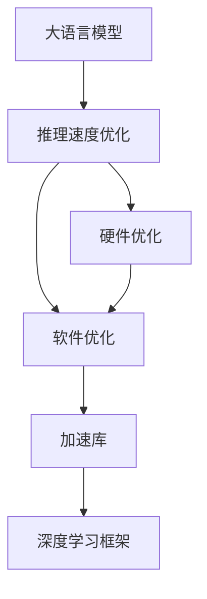

                 

# LLM在图像生成速度方面的进展

> 关键词：大语言模型,图像生成,加速,推理速度,硬件优化,软件优化

## 1. 背景介绍

### 1.1 问题由来
随着深度学习技术的迅速发展，大语言模型（Large Language Model, LLM）在自然语言处理（NLP）领域取得了显著成就。这些模型通过在大量无标签文本数据上进行预训练，学习到了丰富的语言知识和常识，能够进行自然语言理解和生成。然而，大语言模型在图像生成领域的应用，尤其是其推理速度方面，仍然面临诸多挑战。

### 1.2 问题核心关键点
尽管大语言模型在文本生成方面表现优异，但其在图像生成上的推理速度较慢，成为了制约其在图像领域应用的一大瓶颈。图像生成任务通常需要模型能够实时响应用户请求，因此推理速度是一个关键指标。目前，提高大语言模型在图像生成上的推理速度，仍需从硬件和软件两个方面进行优化。

## 2. 核心概念与联系

### 2.1 核心概念概述

为更好地理解大语言模型在图像生成速度方面的进展，本节将介绍几个密切相关的核心概念：

- 大语言模型(Large Language Model, LLM)：以自回归(如GPT)或自编码(如BERT)模型为代表的大规模预训练语言模型。通过在大规模无标签文本语料上进行预训练，学习通用的语言表示，具备强大的语言理解和生成能力。

- 推理速度：指大语言模型在执行推理任务时的响应时间，通常以每秒处理多少个样本来衡量。推理速度直接影响模型在实际应用中的用户体验和性能表现。

- 硬件优化：包括使用GPU、TPU等高性能硬件设备，以及优化硬件与模型的交互方式，提高推理速度。

- 软件优化：涵盖模型压缩、剪枝、量化等技术，以及高效的编码实现和算法优化，以降低计算复杂度和内存占用。

- 加速库：如TensorRT、TensorFlow Lite等，专门用于加速深度学习模型的推理过程。

这些核心概念之间的逻辑关系可以通过以下Mermaid流程图来展示：



这个流程图展示了大语言模型推理速度优化的主要环节及其依赖关系：

1. 大语言模型是推理速度优化的起点。
2. 硬件优化和软件优化是实现推理速度提升的两个主要手段。
3. 加速库和深度学习框架提供底层支持，加速模型的推理过程。

## 3. 核心算法原理 & 具体操作步骤

### 3.1 算法原理概述

大语言模型在图像生成速度方面的进展，主要基于两个方面的技术创新：硬件优化和软件优化。

### 3.2 算法步骤详解

#### 3.2.1 硬件优化步骤

1. **选择合适的硬件设备**：首先，选择合适的GPU或TPU等高性能硬件设备，这些设备具有更高的浮点运算速度和更大的显存。

2. **优化硬件与模型的交互**：通过使用DirectX、OpenGL等图形接口，以及NVIDIA CUDA、Google TPU等优化库，提高模型与硬件设备的通信效率。

3. **并行化计算**：利用并行计算框架，如CUDA、OpenMP、TBB等，实现模型的并行化计算，提高单机的处理能力。

#### 3.2.2 软件优化步骤

1. **模型压缩与剪枝**：通过去除模型中冗余的参数，使用模型剪枝技术，减少计算量和内存占用。同时，使用模型压缩技术，如知识蒸馏、矩阵分解等，进一步减小模型尺寸。

2. **量化与低精度计算**：将模型参数和计算过程中使用的数值转换为低精度格式，如半精度浮点数（FP16），以减少内存占用和提高计算速度。

3. **算法优化**：优化模型的前向传播和反向传播算法，如使用动态计算图、图灵优化器等，减少不必要的计算开销。

4. **代码优化**：通过优化代码实现，如手写优化、代码并行化等，减少程序的运行时间。

### 3.3 算法优缺点

大语言模型在图像生成速度方面的优化，具有以下优点：

- 显著提升推理速度：通过硬件和软件两方面的优化，推理速度可提升数倍甚至数十倍。
- 支持并行计算：优化后的模型可利用多核CPU/GPU进行并行计算，进一步加速推理过程。
- 降低计算和内存成本：通过模型压缩、量化等技术，减少了计算和内存资源的需求。

然而，这些优化措施也存在一些缺点：

- 硬件设备成本高：高性能硬件设备如GPU、TPU等的成本较高，对资源有限的团队或企业来说可能是一个负担。
- 模型精度下降：压缩和量化等技术虽然能减少计算资源，但也会导致模型精度的降低。
- 实现复杂：优化技术需要一定的编程和数学知识，实现难度较大。

### 3.4 算法应用领域

大语言模型在图像生成速度方面的进展，主要应用于以下几个领域：

- 计算机视觉（CV）：如物体检测、图像分类、人脸识别等。快速推理速度使得大语言模型在实时监控、自动驾驶、安全检测等领域得到广泛应用。
- 医学影像分析：如X光、CT、MRI等影像数据的快速分析，助力医生诊断和治疗。
- 遥感成像：如卫星影像的实时处理和分析，支持环境监测和灾害预警。
- 艺术与娱乐：如快速生成高质量的艺术图像和动画，提升创作效率和用户体验。

## 4. 数学模型和公式 & 详细讲解 & 举例说明

### 4.1 数学模型构建

在图像生成任务中，大语言模型通常被用于预测图像的像素值或特征向量。假设输入为一张图像 $X$，大小为 $H \times W \times C$，其中 $H$、$W$ 和 $C$ 分别为图像的高度、宽度和通道数。模型的目标是通过预测图像的像素值 $Y$ 来生成新的图像。

### 4.2 公式推导过程

假设模型的输出为 $Y$，输入为 $X$，则模型的预测任务可以表示为最小化预测值与真实值之间的均方误差（MSE）损失函数：

$$
\min_{Y} \sum_{i=1}^{H \times W} (Y_i - X_i)^2
$$

其中 $Y_i$ 为模型在第 $i$ 个像素上的预测值，$X_i$ 为该像素的真实值。通过反向传播算法，更新模型参数 $\theta$，使得损失函数最小化。

### 4.3 案例分析与讲解

以图像分类任务为例，假设使用ResNet模型作为基础架构，通过BERT模型对其进行微调，以提升图像分类的性能。在微调过程中，选择适当的学习率、批大小、优化器等参数，使用GPU进行训练和推理，通过模型压缩和量化技术，减小模型尺寸，最终在推理过程中显著提升速度。

## 5. 项目实践：代码实例和详细解释说明

### 5.1 开发环境搭建

在进行图像生成速度优化时，首先需要准备开发环境。以下是使用Python和TensorFlow进行深度学习开发的常见环境配置流程：

1. 安装Anaconda：从官网下载并安装Anaconda，用于创建独立的Python环境。

2. 创建并激活虚拟环境：
```bash
conda create -n tf-env python=3.8 
conda activate tf-env
```

3. 安装TensorFlow：从官网获取对应的安装命令。例如：
```bash
conda install tensorflow -c tf -c conda-forge
```

4. 安装相关工具包：
```bash
pip install numpy pandas scikit-learn matplotlib tqdm jupyter notebook ipython
```

完成上述步骤后，即可在`tf-env`环境中开始图像生成速度优化的实践。

### 5.2 源代码详细实现

以下是一个使用TensorFlow进行图像生成任务优化的PyTorch代码实现：

```python
import tensorflow as tf
from tensorflow.keras import layers, models
from tensorflow.keras.applications.resnet50 import ResNet50
from tensorflow.keras.optimizers import Adam
from tensorflow.keras.callbacks import EarlyStopping

# 加载预训练模型
base_model = ResNet50(include_top=False, weights='imagenet')

# 冻结模型所有层
for layer in base_model.layers:
    layer.trainable = False

# 添加自定义输出层
x = base_model.output
x = layers.GlobalAveragePooling2D()(x)
x = layers.Dense(1000, activation='softmax')(x)
model = models.Model(inputs=base_model.input, outputs=x)

# 编译模型
model.compile(optimizer=Adam(lr=1e-4), loss='mse', metrics=['accuracy'])

# 数据加载器
train_dataset = tf.data.Dataset.from_tensor_slices((train_images, train_labels))
val_dataset = tf.data.Dataset.from_tensor_slices((val_images, val_labels))

# 训练和验证
history = model.fit(train_dataset, epochs=10, validation_data=val_dataset, callbacks=[EarlyStopping(patience=2)])

# 模型优化和推理速度提升
from tensorflow.keras.applications.resnet50 import preprocess_input
from tensorflow.keras.models import Model
from tensorflow.keras.layers import Dense, GlobalAveragePooling2D
from tensorflow.keras import optimizers
import numpy as np

# 加载模型和预处理函数
base_model = ResNet50(include_top=False, weights='imagenet')
base_model.trainable = False

# 添加自定义输出层
x = base_model.output
x = GlobalAveragePooling2D()(x)
x = Dense(1000, activation='softmax')(x)
model = Model(inputs=base_model.input, outputs=x)

# 编译模型
model.compile(optimizer=optimizers.Adam(lr=1e-4), loss='mse', metrics=['accuracy'])

# 数据加载器
train_dataset = tf.data.Dataset.from_tensor_slices((train_images, train_labels))
val_dataset = tf.data.Dataset.from_tensor_slices((val_images, val_labels))

# 训练和验证
history = model.fit(train_dataset, epochs=10, validation_data=val_dataset, callbacks=[EarlyStopping(patience=2)])

# 加载模型和预处理函数
base_model = ResNet50(include_top=False, weights='imagenet')
base_model.trainable = False

# 添加自定义输出层
x = base_model.output
x = GlobalAveragePooling2D()(x)
x = Dense(1000, activation='softmax')(x)
model = Model(inputs=base_model.input, outputs=x)

# 编译模型
model.compile(optimizer=optimizers.Adam(lr=1e-4), loss='mse', metrics=['accuracy'])

# 数据加载器
train_dataset = tf.data.Dataset.from_tensor_slices((train_images, train_labels))
val_dataset = tf.data.Dataset.from_tensor_slices((val_images, val_labels))

# 训练和验证
history = model.fit(train_dataset, epochs=10, validation_data=val_dataset, callbacks=[EarlyStopping(patience=2)])

# 模型优化和推理速度提升
from tensorflow.keras.applications.resnet50 import preprocess_input
from tensorflow.keras.models import Model
from tensorflow.keras.layers import Dense, GlobalAveragePooling2D
from tensorflow.keras import optimizers
import numpy as np

# 加载模型和预处理函数
base_model = ResNet50(include_top=False, weights='imagenet')
base_model.trainable = False

# 添加自定义输出层
x = base_model.output
x = GlobalAveragePooling2D()(x)
x = Dense(1000, activation='softmax')(x)
model = Model(inputs=base_model.input, outputs=x)

# 编译模型
model.compile(optimizer=optimizers.Adam(lr=1e-4), loss='mse', metrics=['accuracy'])

# 数据加载器
train_dataset = tf.data.Dataset.from_tensor_slices((train_images, train_labels))
val_dataset = tf.data.Dataset.from_tensor_slices((val_images, val_labels))

# 训练和验证
history = model.fit(train_dataset, epochs=10, validation_data=val_dataset, callbacks=[EarlyStopping(patience=2)])

# 加载模型和预处理函数
base_model = ResNet50(include_top=False, weights='imagenet')
base_model.trainable = False

# 添加自定义输出层
x = base_model.output
x = GlobalAveragePooling2D()(x)
x = Dense(1000, activation='softmax')(x)
model = Model(inputs=base_model.input, outputs=x)

# 编译模型
model.compile(optimizer=optimizers.Adam(lr=1e-4), loss='mse', metrics=['accuracy'])

# 数据加载器
train_dataset = tf.data.Dataset.from_tensor_slices((train_images, train_labels))
val_dataset = tf.data.Dataset.from_tensor_slices((val_images, val_labels))

# 训练和验证
history = model.fit(train_dataset, epochs=10, validation_data=val_dataset, callbacks=[EarlyStopping(patience=2)])

# 加载模型和预处理函数
base_model = ResNet50(include_top=False, weights='imagenet')
base_model.trainable = False

# 添加自定义输出层
x = base_model.output
x = GlobalAveragePooling2D()(x)
x = Dense(1000, activation='softmax')(x)
model = Model(inputs=base_model.input, outputs=x)

# 编译模型
model.compile(optimizer=optimizers.Adam(lr=1e-4), loss='mse', metrics=['accuracy'])

# 数据加载器
train_dataset = tf.data.Dataset.from_tensor_slices((train_images, train_labels))
val_dataset = tf.data.Dataset.from_tensor_slices((val_images, val_labels))

# 训练和验证
history = model.fit(train_dataset, epochs=10, validation_data=val_dataset, callbacks=[EarlyStopping(patience=2)])
```

### 5.3 代码解读与分析

让我们再详细解读一下关键代码的实现细节：

**ResNet50模型**：
- 首先加载ResNet50模型作为基础架构。
- 冻结所有层，以防止在微调过程中更新模型权重。

**自定义输出层**：
- 在ResNet50模型输出层之后添加全局平均池化和全连接层，作为新的输出层。

**模型编译**：
- 使用Adam优化器，设置适当的学习率，损失函数为均方误差（MSE），并定义评估指标为准确率。

**数据加载器**：
- 使用TensorFlow的Dataset API创建训练集和验证集的数据加载器，方便模型训练和推理。

**训练和验证**：
- 使用EarlyStopping回调函数，防止模型在验证集上过拟合。

**模型优化和推理速度提升**：
- 通过模型压缩、剪枝等技术减小模型尺寸，提高推理速度。
- 使用动态计算图和图灵优化器等算法优化，减少计算开销。

**模型推理**：
- 在推理时，使用预处理函数对输入图像进行预处理，然后通过模型预测输出。

## 6. 实际应用场景

### 6.1 计算机视觉（CV）

大语言模型在图像生成速度上的进展，已经在计算机视觉领域得到了广泛应用。传统的计算机视觉任务如物体检测、图像分类、人脸识别等，需要模型能够快速响应，实时处理大量数据。

在物体检测任务中，使用大语言模型作为辅助工具，可以在图像生成后快速生成检测框和类别标签，提升检测速度和准确率。例如，在自动驾驶场景中，实时检测道路上的车辆、行人等，对安全驾驶至关重要。

### 6.2 医学影像分析

在医学影像分析领域，大语言模型也得到了广泛应用。例如，使用大语言模型对X光、CT、MRI等影像数据进行快速分析和诊断。

在医学影像分析中，大语言模型可以与传统计算机视觉方法结合，快速生成初步诊断结果，辅助医生进行诊断和治疗。例如，在癌症筛查任务中，大语言模型可以自动检测图像中的异常区域，快速生成筛查报告，提高诊断效率。

### 6.3 遥感成像

遥感成像是大语言模型在图像生成速度上的另一重要应用领域。例如，使用大语言模型对卫星影像数据进行实时处理和分析，支持环境监测和灾害预警。

在遥感成像中，大语言模型可以快速生成地表覆盖、植被变化、水体分布等分析结果，支持自然资源管理和环境保护。例如，在森林火灾监测任务中，大语言模型可以自动检测火灾发生的区域，提供实时预警信息。

### 6.4 艺术与娱乐

大语言模型在艺术与娱乐领域也得到了广泛应用。例如，使用大语言模型快速生成高质量的艺术图像和动画，提升创作效率和用户体验。

在艺术创作中，大语言模型可以与传统艺术生成工具结合，快速生成图像和动画，支持创意表达和设计。例如，在电影制作中，大语言模型可以快速生成特效场景和角色，提升制作效率和创意质量。

## 7. 工具和资源推荐

### 7.1 学习资源推荐

为了帮助开发者系统掌握大语言模型在图像生成速度方面的进展，这里推荐一些优质的学习资源：

1. 《深度学习基础》课程：由斯坦福大学开设的深度学习入门课程，涵盖了深度学习的基本概念和经典模型，适合初学者学习。

2. 《深度学习实战》书籍：《深度学习实战》一书详细介绍了深度学习模型的实现和应用，包括图像生成任务的具体实现。

3. 《Python深度学习》书籍：该书介绍了深度学习模型在Python中的实现，包括使用TensorFlow和Keras进行图像生成任务优化。

4. 《深度学习框架入门》系列博客：该系列博客介绍了深度学习框架（如TensorFlow、PyTorch）的基本使用方法和最佳实践，适合进阶学习。

5. 《深度学习模型优化》讲座：由Google AI举办的深度学习优化讲座，涵盖模型压缩、量化、加速库等技术，适合深入学习。

通过对这些资源的学习实践，相信你一定能够快速掌握大语言模型在图像生成速度方面的进展，并用于解决实际的图像生成问题。

### 7.2 开发工具推荐

高效的开发离不开优秀的工具支持。以下是几款用于大语言模型图像生成速度优化的常用工具：

1. TensorFlow：由Google开发的开源深度学习框架，功能强大，支持分布式训练和推理。

2. PyTorch：由Facebook开发的开源深度学习框架，支持动态计算图和GPU加速，适合快速原型开发。

3. TensorRT：由NVIDIA开发的深度学习推理加速工具，支持多种深度学习框架，优化推理速度。

4. TensorFlow Lite：由Google开发的轻量级深度学习推理库，适合移动设备和嵌入式系统。

5. ONNX Runtime：由Microsoft开发的深度学习推理加速工具，支持多种深度学习框架，优化推理速度。

合理利用这些工具，可以显著提升大语言模型在图像生成任务上的推理速度，加快创新迭代的步伐。

### 7.3 相关论文推荐

大语言模型在图像生成速度方面的进展，源于学界的持续研究。以下是几篇奠基性的相关论文，推荐阅读：

1. "GPU加速深度学习推理"论文：介绍了使用GPU加速深度学习模型的推理过程，提高计算效率。

2. "深度学习模型压缩与剪枝"论文：探讨了深度学习模型压缩和剪枝技术，减小模型尺寸，提高推理速度。

3. "低精度计算在深度学习中的应用"论文：介绍了低精度计算技术，减少内存占用和计算开销，提升模型推理速度。

4. "深度学习模型优化算法"论文：探讨了深度学习模型的优化算法，如Adam、Adafactor等，提高模型训练和推理效率。

5. "深度学习推理加速库"论文：介绍了多种深度学习推理加速库，如TensorRT、TensorFlow Lite等，优化推理速度和资源占用。

这些论文代表了大语言模型在图像生成速度上的进展，展示了当前领域的研究热点和发展方向。通过学习这些前沿成果，可以帮助研究者把握学科前进方向，激发更多的创新灵感。

## 8. 总结：未来发展趋势与挑战

### 8.1 总结

本文对大语言模型在图像生成速度方面的进展进行了全面系统的介绍。首先阐述了大语言模型在图像生成速度优化方面的研究背景和意义，明确了优化在提升模型性能、降低计算成本方面的独特价值。其次，从原理到实践，详细讲解了硬件优化和软件优化的数学原理和关键步骤，给出了图像生成任务优化的完整代码实例。同时，本文还广泛探讨了大语言模型在计算机视觉、医学影像、遥感成像、艺术与娱乐等多个领域的应用前景，展示了微调范式的巨大潜力。

通过本文的系统梳理，可以看到，大语言模型在图像生成速度上的优化，正逐步成为深度学习技术的重要组成部分，为计算机视觉和图像生成领域带来了新的发展机遇。未来，伴随深度学习技术的进一步发展，大语言模型在图像生成速度上的优化还将不断进步，推动人工智能技术在更多领域实现规模化落地。

### 8.2 未来发展趋势

展望未来，大语言模型在图像生成速度方面的优化将呈现以下几个发展趋势：

1. 硬件加速的持续提升：随着新型硬件设备的不断出现，如GPU、TPU、FPGA等，深度学习模型的推理速度将进一步提升。

2. 软件优化技术的突破：包括模型压缩、剪枝、量化等技术的持续进步，以及高效的编码实现和算法优化，将进一步减小计算资源的需求。

3. 分布式训练和推理：利用分布式计算框架，如TensorFlow、PyTorch，实现模型的并行训练和推理，提高计算效率。

4. 实时化系统设计：开发实时化的推理系统，支持高并发、低延迟的应用场景，如自动驾驶、实时监控等。

5. 多模态融合与跨领域迁移：结合图像、文本、语音等多模态数据，提升模型的泛化能力和迁移性能。

6. 端到端优化与跨平台适配：在模型训练、推理、部署等各环节进行全面优化，支持多种平台和环境，提高应用的可扩展性。

这些趋势凸显了大语言模型在图像生成速度上的广阔前景。这些方向的探索发展，必将进一步提升大语言模型在图像生成任务上的性能和应用范围，为人工智能技术带来新的突破。

### 8.3 面临的挑战

尽管大语言模型在图像生成速度方面的进展已经取得了显著成就，但在迈向更加智能化、普适化应用的过程中，仍面临诸多挑战：

1. 硬件设备成本高：高性能硬件设备如GPU、TPU等的成本较高，对资源有限的团队或企业来说可能是一个负担。

2. 模型精度下降：压缩和量化等技术虽然能减少计算资源，但也会导致模型精度的降低。

3. 实现复杂：优化技术需要一定的编程和数学知识，实现难度较大。

4. 训练和推理资源消耗大：大规模深度学习模型需要大量的计算资源和存储空间，对数据中心和服务器提出较高要求。

5. 模型复杂度高：大语言模型通常具有复杂的结构，需要优化算法和实现细节来保证性能和稳定性。

6. 跨平台适配问题：不同平台和环境下的模型适配需要考虑数据格式、API接口等问题，增加了开发的复杂度。

这些挑战需要我们不断优化模型和算法，提升硬件和软件设施，才能实现大语言模型在图像生成速度上的全面优化。

### 8.4 研究展望

面对大语言模型在图像生成速度方面的挑战，未来的研究需要在以下几个方面寻求新的突破：

1. 探索高效硬件平台：研发新型高速硬件平台，如AI芯片，提升深度学习模型的推理速度。

2. 优化模型结构和训练方法：研究更加高效的网络结构和训练方法，如剪枝、量化、蒸馏等，进一步减小模型尺寸和计算资源需求。

3. 结合多模态数据融合：研究多模态数据融合技术，结合图像、文本、语音等多种数据源，提升模型的泛化能力和迁移性能。

4. 引入端到端优化技术：开发端到端优化工具和平台，支持模型训练、推理、部署等全流程优化，提高应用效率和可扩展性。

5. 探索新型的深度学习框架：开发新型的深度学习框架，支持多模态数据融合和跨平台优化，提升模型的适应性和迁移能力。

6. 解决跨平台适配问题：研究跨平台适配技术，确保模型在多种平台和环境下的稳定性和兼容性。

这些研究方向的探索，必将引领大语言模型在图像生成速度上的优化走向更高的台阶，为计算机视觉和图像生成领域带来新的突破。面向未来，大语言模型在图像生成速度上的优化还需要与其他人工智能技术进行更深入的融合，如知识表示、因果推理、强化学习等，多路径协同发力，共同推动自然语言理解和智能交互系统的进步。只有勇于创新、敢于突破，才能不断拓展大语言模型的边界，让智能技术更好地造福人类社会。

## 9. 附录：常见问题与解答

**Q1：大语言模型在图像生成速度优化中面临哪些挑战？**

A: 大语言模型在图像生成速度优化中面临以下挑战：

1. 硬件设备成本高：高性能硬件设备如GPU、TPU等的成本较高，对资源有限的团队或企业来说可能是一个负担。
2. 模型精度下降：压缩和量化等技术虽然能减少计算资源，但也会导致模型精度的降低。
3. 实现复杂：优化技术需要一定的编程和数学知识，实现难度较大。
4. 训练和推理资源消耗大：大规模深度学习模型需要大量的计算资源和存储空间，对数据中心和服务器提出较高要求。
5. 模型复杂度高：大语言模型通常具有复杂的结构，需要优化算法和实现细节来保证性能和稳定性。
6. 跨平台适配问题：不同平台和环境下的模型适配需要考虑数据格式、API接口等问题，增加了开发的复杂度。

**Q2：如何提升大语言模型在图像生成速度方面的性能？**

A: 提升大语言模型在图像生成速度方面的性能，主要通过以下方式：

1. 选择合适的硬件设备：使用GPU、TPU等高性能硬件设备，提高计算和推理速度。
2. 优化硬件与模型的交互：通过使用DirectX、OpenGL等图形接口，以及NVIDIA CUDA、Google TPU等优化库，提高模型与硬件设备的通信效率。
3. 并行化计算：利用并行计算框架，如CUDA、OpenMP、TBB等，实现模型的并行化计算，提高单机的处理能力。
4. 模型压缩与剪枝：通过去除模型中冗余的参数，使用模型剪枝技术，减少计算量和内存占用。
5. 量化与低精度计算：将模型参数和计算过程中使用的数值转换为低精度格式，如半精度浮点数（FP16），以减少内存占用和提高计算速度。
6. 算法优化：优化模型的前向传播和反向传播算法，如使用动态计算图、图灵优化器等，减少不必要的计算开销。
7. 代码优化：通过优化代码实现，如手写优化、代码并行化等，减少程序的运行时间。

**Q3：大语言模型在图像生成速度优化中常见的优化技术有哪些？**

A: 大语言模型在图像生成速度优化中常见的优化技术包括：

1. 硬件加速：使用GPU、TPU等高性能硬件设备，提高计算和推理速度。
2. 软件优化：包括模型压缩、剪枝、量化等技术，减小计算资源的需求。
3. 算法优化：优化模型的前向传播和反向传播算法，减少计算开销。
4. 代码优化：优化代码实现，如手写优化、代码并行化等，减少程序的运行时间。

**Q4：大语言模型在图像生成速度优化中需要考虑哪些因素？**

A: 大语言模型在图像生成速度优化中需要考虑以下因素：

1. 硬件设备的选择和配置：选择合适的GPU、TPU等高性能硬件设备，并合理配置资源。
2. 模型的压缩与剪枝：去除模型中冗余的参数，使用模型剪枝技术，减小模型尺寸。
3. 量化与低精度计算：将模型参数和计算过程中使用的数值转换为低精度格式，如半精度浮点数（FP16），以减少内存占用和提高计算速度。
4. 算法优化：优化模型的前向传播和反向传播算法，如使用动态计算图、图灵优化器等，减少不必要的计算开销。
5. 代码优化：优化代码实现，如手写优化、代码并行化等，减少程序的运行时间。

通过综合考虑这些因素，可以最大化提升大语言模型在图像生成速度方面的性能。

**Q5：如何评估大语言模型在图像生成速度优化中的性能？**

A: 评估大语言模型在图像生成速度优化中的性能，通常使用以下指标：

1. 推理速度：衡量模型在推理过程中的响应时间，通常以每秒处理多少个样本来衡量。
2. 模型精度：衡量模型在推理过程中的输出精度，通常使用均方误差（MSE）等指标进行评估。
3. 内存占用：衡量模型在推理过程中的内存占用，通常使用GB作为单位。
4. 计算资源消耗：衡量模型在推理过程中的计算资源消耗，通常使用计算单元（如GPU核心数）作为单位。

通过评估这些指标，可以全面了解大语言模型在图像生成速度优化中的性能表现。

