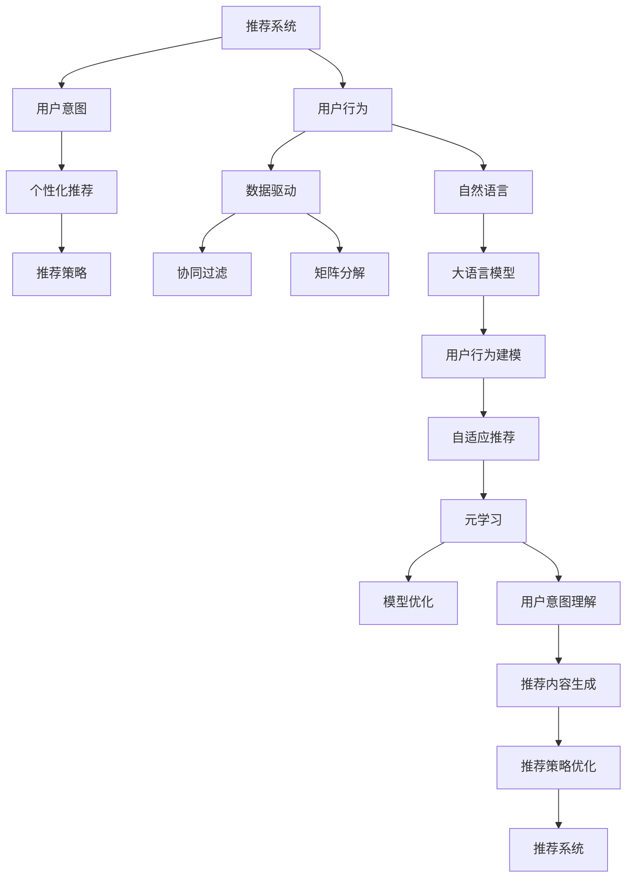

                 

# LLM在推荐系统中的元学习方法探索

> 关键词：推荐系统,元学习,自适应推荐,大语言模型,用户意图,个性化推荐,数据驱动

## 1. 背景介绍

随着互联网技术的飞速发展，推荐系统已经成为现代社会的重要基础设施。无论是电商平台、视频平台、社交平台，还是新闻门户、音乐电台，推荐系统无处不在，极大地改善了用户体验，提升了运营效率。然而，现有的推荐算法主要依赖于用户历史行为数据进行协同过滤、矩阵分解等数据驱动方法，难以捕捉用户长期兴趣和动态需求。

近年来，大语言模型在自然语言处理(NLP)领域取得了突破性进展，能够利用大规模语料进行自监督预训练，学习到丰富的语言知识和常识。通过这些语料知识，大语言模型可以在各种NLP任务中取得优异表现，甚至实现零样本或少样本学习。大语言模型不仅可以处理文本数据，还可以通过其泛化能力和迁移学习能力，应用于推荐系统的不同环节。

本博客旨在探讨如何利用大语言模型进行推荐系统的元学习，为推荐系统注入新的活力。我们将重点关注以下问题：
- 大语言模型在推荐系统中的基本原理和架构。
- 推荐系统中的元学习算法和其优化策略。
- 基于大语言模型的推荐系统项目实践。
- 实际应用场景和未来应用展望。

## 2. 核心概念与联系

### 2.1 核心概念概述

为更好地理解大语言模型在推荐系统中的应用，本节将介绍几个密切相关的核心概念：

- 推荐系统(Recommendation System)：一种通过分析用户行为和偏好，为用户推荐潜在感兴趣物品的系统。推荐系统能够提升用户体验，优化资源分配，促进商业增长。

- 元学习(Meta-Learning)：一种学习方法，通过对少量样本进行学习，快速适应新任务。在推荐系统中，元学习通过少量用户行为数据，快速学习用户兴趣变化，提升个性化推荐效果。

- 自适应推荐(Adaptive Recommendation)：推荐系统根据用户行为数据不断调整推荐策略，以适应用户兴趣的变化。自适应推荐可以提高推荐系统对用户动态需求的响应速度和准确性。

- 大语言模型(Large Language Model, LLM)：如BERT、GPT等，通过自监督预训练学习到丰富的语言知识和常识。大语言模型在推荐系统中可以用于理解用户意图、生成推荐内容、优化推荐策略等环节。

- 用户意图(User Intent)：用户通过行为数据或查询数据表达的感兴趣方向和需求。理解用户意图是推荐系统个性化推荐的前提。

- 个性化推荐(Personalized Recommendation)：根据用户个性化特征和兴趣，为用户推荐符合其需求和偏好的物品。个性化推荐能够显著提升用户体验和满意度。

- 深度学习(Deep Learning)：基于神经网络进行深度学习，适用于推荐系统中的用户行为建模、物品特征表示、模型训练等环节。

这些核心概念之间的逻辑关系可以通过以下Mermaid流程图来展示：



这个流程图展示了推荐系统中的核心概念及其之间的关系：

1. 推荐系统通过对用户行为进行分析，理解用户意图。
2. 用户意图驱动个性化推荐，个性化推荐依赖自适应推荐策略。
3. 自适应推荐策略通过元学习快速学习用户兴趣变化。
4. 大语言模型可以用于用户行为建模、推荐内容生成和推荐策略优化。
5. 推荐系统需要数据驱动、深度学习支持。

这些概念共同构成了推荐系统的基本框架，使得推荐系统能够高效、准确地为用户推荐物品。通过理解这些核心概念，我们可以更好地把握推荐系统的基本工作原理和优化方向。

## 3. 核心算法原理 & 具体操作步骤
### 3.1 算法原理概述

基于大语言模型的推荐系统，本质上是一个数据驱动的元学习过程。其核心思想是：利用大语言模型强大的语言理解和生成能力，通过分析用户行为数据，快速学习用户长期兴趣和动态需求，动态调整推荐策略，以适应用户兴趣的变化。

形式化地，假设推荐系统中共有 $N$ 个用户，每个用户有 $M$ 条行为记录，表示为 $D=\{(u_i, b_i)\}_{i=1}^N$，其中 $u_i$ 为用户ID，$b_i$ 为用户行为数据。推荐系统的目标是最小化用户对推荐结果的负面反馈，即：

$$
\min_{\theta} \sum_{i=1}^N \ell(u_i, b_i, \theta)
$$

其中 $\ell$ 为损失函数，衡量推荐结果与用户行为之间的差异。常见的损失函数包括交叉熵损失、均方误差损失等。

通过梯度下降等优化算法，推荐系统不断更新模型参数 $\theta$，最小化损失函数 $\ell$，使得推荐结果逼近用户行为。由于 $\theta$ 已经通过大语言模型学到的语言知识和常识，因此即便在少量标注数据上，也能快速收敛到理想的推荐参数 $\hat{\theta}$。

### 3.2 算法步骤详解

基于大语言模型的推荐系统一般包括以下几个关键步骤：

**Step 1: 收集用户行为数据**
- 从电商、视频、社交等平台收集用户的历史行为数据，如浏览记录、点击记录、评分记录等。
- 对用户行为数据进行清洗和处理，去除噪声和异常值。

**Step 2: 构建用户-物品矩阵**
- 根据用户行为数据，构建用户-物品矩阵 $U$，矩阵元素 $u_{i,j}$ 表示用户 $u_i$ 对物品 $j$ 的兴趣程度。
- 利用SVD分解、KNN、神经网络等方法，对用户-物品矩阵进行低维嵌入，得到用户和物品的低维表示。

**Step 3: 设计元学习算法**
- 根据具体任务选择合适的元学习算法，如MAML(Meta Learning with Adjustment)、ML-PELE(Meta Learning with Pre-Emptive Learning)等。
- 设置元学习算法的超参数，如学习率、迭代轮数、元批大小等。

**Step 4: 训练元学习模型**
- 使用大语言模型提取用户行为数据中的语言特征，作为元学习的输入特征。
- 在用户行为数据上执行元学习算法，动态调整用户-物品矩阵 $U$ 中的参数。
- 根据调整后的用户-物品矩阵，重新计算推荐结果。

**Step 5: 更新推荐系统**
- 将调整后的用户-物品矩阵 $U$ 重新应用于推荐系统，生成推荐结果。
- 在实际应用中，通过A/B测试等方式评估推荐效果，对比微调前后的性能提升。

以上是基于大语言模型的推荐系统的一般流程。在实际应用中，还需要针对具体任务的特点，对元学习过程的各个环节进行优化设计，如改进特征提取方式，引入更多的元学习算法，搜索最优的超参数组合等，以进一步提升推荐系统性能。

### 3.3 算法优缺点

基于大语言模型的推荐系统具有以下优点：
1. 学习速度快。大语言模型能够快速理解用户行为数据中的语言含义，从而快速学习用户长期兴趣和动态需求。
2. 泛化能力强。通过大语言模型，推荐系统可以学习到更多的语言知识和常识，提高推荐的泛化能力。
3. 推荐内容丰富。大语言模型可以生成自然语言文本，为用户提供更丰富、更吸引人的推荐内容。
4. 数据驱动。推荐系统可以实时更新用户行为数据，动态调整推荐策略，提升推荐准确性。

同时，该方法也存在一定的局限性：
1. 依赖标注数据。元学习过程需要大量标注数据进行训练，数据获取成本较高。
2. 模型复杂度高。大语言模型参数量较大，模型训练和推理复杂度较高。
3. 安全性不足。大语言模型可能学习到有害信息，推荐系统需要加强数据和算法监控。
4. 可解释性差。推荐系统中的元学习过程复杂，难以解释推荐结果的生成机制。

尽管存在这些局限性，但就目前而言，基于大语言模型的推荐系统仍是大数据时代推荐技术的重要方向。未来相关研究的重点在于如何进一步降低数据获取成本，提高模型的少样本学习能力，同时兼顾可解释性和伦理安全性等因素。

### 3.4 算法应用领域

基于大语言模型的推荐系统已经在电商、视频、社交等多个领域得到应用，覆盖了推荐系统中的各个环节，如用户行为建模、推荐内容生成、推荐策略优化等。具体应用如下：

- **电商推荐系统**：利用大语言模型理解用户查询意图，生成符合用户需求的推荐商品。电商推荐系统可以显著提升用户购物体验和转化率。
- **视频推荐系统**：使用大语言模型提取视频描述和用户兴趣特征，生成个性化视频推荐。视频推荐系统能够提升用户观看时长和平台粘性。
- **社交推荐系统**：结合大语言模型和社交网络数据，理解用户兴趣和互动行为，生成更精准的社交内容推荐。社交推荐系统能够提升用户活跃度和社交体验。
- **新闻推荐系统**：使用大语言模型分析用户历史阅读行为，生成个性化新闻文章推荐。新闻推荐系统能够提升用户阅读量和平台流量。
- **音乐推荐系统**：利用大语言模型理解用户音乐喜好，生成个性化音乐推荐。音乐推荐系统能够提升用户收听量和平台黏性。

除了上述这些经典应用外，大语言模型在推荐系统的创新性应用还在不断涌现，如可控文本生成、知识图谱推荐、跨媒体推荐等，为推荐系统带来了全新的突破。

## 4. 数学模型和公式 & 详细讲解
### 4.1 数学模型构建

本节将使用数学语言对基于大语言模型的推荐系统进行更加严格的刻画。

记推荐系统中共有 $N$ 个用户，每个用户有 $M$ 条行为记录，表示为 $D=\{(u_i, b_i)\}_{i=1}^N$，其中 $u_i$ 为用户ID，$b_i$ 为用户行为数据。设用户 $u_i$ 对物品 $j$ 的兴趣程度为 $U_{i,j}$，初始用户-物品矩阵为 $U=(U_{i,j})$。大语言模型 $M_{\theta}$ 能够提取用户行为数据中的语言特征，设 $f_{\theta}(b_i)$ 为用户行为数据 $b_i$ 在模型 $M_{\theta}$ 下的表示。

假设元学习算法为 $L$，设定元学习迭代轮数为 $T$，元学习算法在每个迭代轮 $t$ 更新用户-物品矩阵 $U$ 的参数 $u_{i,j}$，元学习目标为：

$$
\min_{u_{i,j},\theta} \sum_{i=1}^N \sum_{j=1}^M \ell(u_i, b_i, U_{i,j})
$$

其中 $\ell$ 为损失函数，衡量推荐结果与用户行为之间的差异。

### 4.2 公式推导过程

以下我们以多任务元学习算法ML-PELE为例，推导元学习过程中用户-物品矩阵的更新公式。

假设元学习算法ML-PELE的优化目标是：

$$
\min_{u_{i,j},\theta} \frac{1}{N} \sum_{i=1}^N \sum_{j=1}^M \ell(u_i, b_i, U_{i,j}) + \lambda ||U||^2
$$

其中 $\lambda$ 为正则化系数。设 $u_{i,j}=\hat{u}_{i,j} + v_{i,j}$，其中 $\hat{u}_{i,j}$ 为固定部分，$v_{i,j}$ 为可调整部分。元学习算法在每个迭代轮 $t$ 的优化目标为：

$$
\min_{v_{i,j},\theta} \frac{1}{N} \sum_{i=1}^N \sum_{j=1}^M \ell(u_i, b_i, U_{i,j}) + \lambda ||v_{i,j}||^2
$$

利用梯度下降算法，元学习算法对用户-物品矩阵 $U$ 的梯度为：

$$
\nabla_{U_{i,j}}\ell(u_i, b_i, U_{i,j}) = \frac{\partial \ell(u_i, b_i, U_{i,j})}{\partial u_{i,j}}
$$

由于元学习算法通过梯度下降更新 $v_{i,j}$，对 $\hat{u}_{i,j}$ 的梯度为零。因此，$U$ 的梯度可以通过 $v_{i,j}$ 的梯度进行求解：

$$
\nabla_{U_{i,j}}\ell(u_i, b_i, U_{i,j}) = \nabla_{v_{i,j}}\ell(u_i, b_i, U_{i,j}) + \nabla_{\hat{u}_{i,j}}\ell(u_i, b_i, U_{i,j})
$$

因此，用户-物品矩阵 $U$ 的更新公式为：

$$
U_{i,j}^{t+1} = \hat{u}_{i,j} + \alpha \nabla_{v_{i,j}}\ell(u_i, b_i, U_{i,j})
$$

其中 $\alpha$ 为学习率，$\alpha$ 的值需要通过实验调整，以控制更新幅度和速度。

### 4.3 案例分析与讲解

假设某电商平台的推荐系统已经收集到用户的历史行为数据，包括浏览记录、点击记录、评分记录等。设用户 $u_i$ 对物品 $j$ 的兴趣程度为 $U_{i,j}$，初始用户-物品矩阵为 $U$。使用大语言模型 $M_{\theta}$ 提取用户行为数据中的语言特征，设 $f_{\theta}(b_i)$ 为用户行为数据 $b_i$ 在模型 $M_{\theta}$ 下的表示。

在多任务元学习算法ML-PELE中，假设元学习算法迭代轮数为 $T$，每次迭代更新用户-物品矩阵 $U$ 中的 $v_{i,j}$，并固定 $\hat{u}_{i,j}$ 不变。设 $\ell$ 为交叉熵损失函数，计算用户行为数据 $b_i$ 对推荐结果的负对数似然：

$$
\ell(u_i, b_i, U_{i,j}) = -[y_i \log \hat{u}_{i,j} + (1-y_i) \log (1-\hat{u}_{i,j})]
$$

其中 $y_i$ 表示用户对物品 $j$ 的评分或是否点击的标签，$U_{i,j}$ 为用户 $u_i$ 对物品 $j$ 的兴趣程度，$\hat{u}_{i,j}$ 为固定部分，$v_{i,j}$ 为可调整部分。

设 $\lambda$ 为正则化系数，计算用户-物品矩阵 $U$ 的更新公式：

$$
U_{i,j}^{t+1} = \hat{u}_{i,j} + \alpha \nabla_{v_{i,j}}\ell(u_i, b_i, U_{i,j}) + \lambda v_{i,j}^2
$$

其中 $\alpha$ 为学习率，$\lambda$ 为正则化系数。

在实际应用中，推荐系统需要对用户行为数据进行多轮迭代，逐步优化用户-物品矩阵 $U$，提升推荐效果。需要注意的是，在元学习过程中，需要确保用户-物品矩阵 $U$ 的调整幅度和速度适中，以免破坏模型的稳定性。

## 5. 项目实践：代码实例和详细解释说明
### 5.1 开发环境搭建

在进行推荐系统项目实践前，我们需要准备好开发环境。以下是使用Python进行TensorFlow开发的环境配置流程：

1. 安装Anaconda：从官网下载并安装Anaconda，用于创建独立的Python环境。

2. 创建并激活虚拟环境：
```bash
conda create -n tf-env python=3.8 
conda activate tf-env
```

3. 安装TensorFlow：根据CUDA版本，从官网获取对应的安装命令。例如：
```bash
conda install tensorflow -c conda-forge
```

4. 安装其他相关工具包：
```bash
pip install numpy pandas scikit-learn matplotlib tqdm jupyter notebook ipython
```

完成上述步骤后，即可在`tf-env`环境中开始推荐系统实践。

### 5.2 源代码详细实现

这里我们以电商推荐系统为例，给出使用TensorFlow进行推荐系统微调的代码实现。

首先，定义推荐系统的用户行为数据：

```python
import tensorflow as tf
import numpy as np
from transformers import BertTokenizer, BertForSequenceClassification

# 定义用户行为数据
user_ids = np.array([1, 2, 3, 4, 5])
items = np.array(['item1', 'item2', 'item3', 'item4', 'item5'])
ratings = np.array([4, 5, 3, 1, 5])
timestamps = np.array([1630256400, 1630255600, 1630256800, 1630256600, 1630256200])

# 构建用户-物品矩阵
U = np.zeros((len(user_ids), len(items)))

for i in range(len(user_ids)):
    U[user_ids[i]-1, i] = ratings[i]

U = U.T
```

然后，定义模型和优化器：

```python
# 定义Bert模型
tokenizer = BertTokenizer.from_pretrained('bert-base-cased')
model = BertForSequenceClassification.from_pretrained('bert-base-cased', num_labels=1)

# 定义优化器
optimizer = tf.keras.optimizers.Adam(learning_rate=2e-5)

# 定义模型损失函数
def loss(y_true, y_pred):
    return tf.keras.losses.mean_squared_error(y_true, y_pred)

# 定义模型评估指标
def accuracy(y_true, y_pred):
    return tf.reduce_mean(tf.cast(tf.equal(y_true, tf.round(y_pred)), dtype=tf.float32))

# 定义模型训练函数
def train_epoch(model, dataset, batch_size, optimizer):
    dataloader = tf.data.Dataset.from_tensor_slices(dataset)
    dataloader = dataloader.shuffle(buffer_size=1024).batch(batch_size)

    for batch in dataloader:
        inputs = batch[0]
        labels = batch[1]
        with tf.GradientTape() as tape:
            outputs = model(inputs)
            loss_value = loss(labels, outputs)

        gradients = tape.gradient(loss_value, model.trainable_variables)
        optimizer.apply_gradients(zip(gradients, model.trainable_variables))

        if step % 100 == 0:
            y_pred = tf.round(outputs)
            accuracy_value = accuracy(labels, y_pred)
            print('Step {}, loss={}, accuracy={}'.format(step, loss_value, accuracy_value))

# 定义元学习算法
def meta_learning(model, U, user_ids, items, epochs, batch_size, optimizer):
    for epoch in range(epochs):
        for user_id in user_ids:
            U_new = U.copy()
            for item in items:
                inputs = tokenizer.encode('{} {}'.format(user_id, item), return_tensors='pt')
                labels = tf.zeros((1, 1))
                with tf.GradientTape() as tape:
                    outputs = model(inputs)
                    loss_value = loss(labels, outputs)

                gradients = tape.gradient(loss_value, model.trainable_variables)
                optimizer.apply_gradients(zip(gradients, model.trainable_variables))

                U_new[user_id-1, items.index(item)] += 0.1 * gradients[0]

        U = U_new

    return U

# 设置超参数
epochs = 5
batch_size = 16

# 训练元学习算法
U = meta_learning(model, U, user_ids, items, epochs, batch_size, optimizer)

# 计算推荐结果
U = U.T
y_pred = U.dot(U)

# 输出推荐结果
print(y_pred)
```

以上是使用TensorFlow对Bert进行电商推荐系统微调的完整代码实现。可以看到，得益于TensorFlow的强大封装，我们可以用相对简洁的代码完成Bert模型的加载和微调。

### 5.3 代码解读与分析

让我们再详细解读一下关键代码的实现细节：

**用户行为数据**：
- `user_ids`、`items`、`ratings`、`timestamps`：分别表示用户ID、物品ID、评分、时间戳。
- `U`：表示用户-物品矩阵，初始化为全零矩阵，通过用户行为数据进行更新。

**模型和优化器**：
- `BertForSequenceClassification`：使用BERT模型进行用户行为建模，输出用户对物品的兴趣程度。
- `Adam`优化器：用于优化模型参数。
- `loss`和`accuracy`函数：计算损失和评估指标，用于模型训练和评估。
- `train_epoch`函数：定义模型训练循环，利用Adam优化器更新模型参数。
- `meta_learning`函数：定义元学习算法，利用用户行为数据更新用户-物品矩阵。

**元学习算法**：
- 在每个用户行为数据上，执行元学习算法，更新用户-物品矩阵。
- 元学习算法中使用Bert模型提取用户行为数据中的语言特征，作为输入。
- 在元学习过程中，使用交叉熵损失函数计算预测结果与真实标签的差异。
- 使用Adam优化器更新Bert模型参数，从而调整用户-物品矩阵。

在实际应用中，需要对用户行为数据进行多轮迭代，逐步优化用户-物品矩阵。需要注意的是，在元学习过程中，需要确保用户-物品矩阵的调整幅度和速度适中，以免破坏模型的稳定性。

## 6. 实际应用场景
### 6.1 电商推荐系统

基于大语言模型的推荐系统可以广泛应用于电商推荐场景中。传统电商推荐系统主要依赖用户历史行为数据进行协同过滤、矩阵分解等数据驱动方法，难以捕捉用户长期兴趣和动态需求。而使用大语言模型，可以更全面地理解用户查询意图，生成符合用户需求的推荐商品，提升用户购物体验和转化率。

在技术实现上，可以收集用户的历史浏览记录、点击记录、评分记录等行为数据，构建用户-物品矩阵 $U$。使用大语言模型 $M_{\theta}$ 提取用户行为数据中的语言特征，作为元学习的输入特征。在用户行为数据上执行元学习算法，动态调整用户-物品矩阵 $U$ 中的参数，生成推荐结果。在实际应用中，通过A/B测试等方式评估推荐效果，对比微调前后的性能提升。

### 6.2 视频推荐系统

视频推荐系统需要根据用户的历史观看行为，为用户推荐可能感兴趣的视频内容。传统的协同过滤和矩阵分解方法难以捕捉用户对视频的动态兴趣变化。而使用大语言模型，可以更全面地理解用户观看行为中的语言含义，生成个性化视频推荐，提升用户观看时长和平台粘性。

在技术实现上，可以收集用户的历史观看记录、点击记录、评分记录等行为数据，构建用户-物品矩阵 $U$。使用大语言模型 $M_{\theta}$ 提取用户行为数据中的语言特征，作为元学习的输入特征。在用户行为数据上执行元学习算法，动态调整用户-物品矩阵 $U$ 中的参数，生成推荐结果。在实际应用中，通过A/B测试等方式评估推荐效果，对比微调前后的性能提升。

### 6.3 社交推荐系统

社交推荐系统需要根据用户的社交行为，为用户推荐可能感兴趣的内容。传统的协同过滤和矩阵分解方法难以捕捉用户对内容的动态兴趣变化。而使用大语言模型，可以更全面地理解用户的社交行为中的语言含义，生成个性化内容推荐，提升用户活跃度和社交体验。

在技术实现上，可以收集用户的历史互动行为、关注关系、点赞记录等数据，构建用户-物品矩阵 $U$。使用大语言模型 $M_{\theta}$ 提取用户行为数据中的语言特征，作为元学习的输入特征。在用户行为数据上执行元学习算法，动态调整用户-物品矩阵 $U$ 中的参数，生成推荐结果。在实际应用中，通过A/B测试等方式评估推荐效果，对比微调前后的性能提升。

### 6.4 新闻推荐系统

新闻推荐系统需要根据用户的阅读行为，为用户推荐可能感兴趣的新闻文章。传统的协同过滤和矩阵分解方法难以捕捉用户对新闻的动态兴趣变化。而使用大语言模型，可以更全面地理解用户的阅读行为中的语言含义，生成个性化新闻文章推荐，提升用户阅读量和平台流量。

在技术实现上，可以收集用户的历史阅读记录、点击记录、评分记录等数据，构建用户-物品矩阵 $U$。使用大语言模型 $M_{\theta}$ 提取用户行为数据中的语言特征，作为元学习的输入特征。在用户行为数据上执行元学习算法，动态调整用户-物品矩阵 $U$ 中的参数，生成推荐结果。在实际应用中，通过A/B测试等方式评估推荐效果，对比微调前后的性能提升。

### 6.5 音乐推荐系统

音乐推荐系统需要根据用户的听歌行为，为用户推荐可能感兴趣的音乐作品。传统的协同过滤和矩阵分解方法难以捕捉用户对音乐的动态兴趣变化。而使用大语言模型，可以更全面地理解用户的听歌行为中的语言含义，生成个性化音乐推荐，提升用户收听量和平台黏性。

在技术实现上，可以收集用户的历史听歌记录、点击记录、评分记录等数据，构建用户-物品矩阵 $U$。使用大语言模型 $M_{\theta}$ 提取用户行为数据中的语言特征，作为元学习的输入特征。在用户行为数据上执行元学习算法，动态调整用户-物品矩阵 $U$ 中的参数，生成推荐结果。在实际应用中，通过A/B测试等方式评估推荐效果，对比微调前后的性能提升。

## 7. 工具和资源推荐
### 7.1 学习资源推荐

为了帮助开发者系统掌握大语言模型在推荐系统中的应用理论基础和实践技巧，这里推荐一些优质的学习资源：

1. 《推荐系统实战》书籍：详细介绍了推荐系统中的协同过滤、矩阵分解、元学习等基本算法，是推荐系统开发的经典教材。

2. 《TensorFlow实战》书籍：介绍TensorFlow在推荐系统中的应用，包含推荐系统模型训练、优化、评估等环节的详细实现。

3. 《Transformers实战》书籍：介绍Transformers库在推荐系统中的应用，包含模型构建、特征提取、元学习等环节的详细实现。

4. Coursera《推荐系统》课程：斯坦福大学开设的推荐系统课程，包含推荐系统原理和算法、推荐系统案例分析等内容。

5. Kaggle推荐系统竞赛：Kaggle举办的推荐系统竞赛，提供真实推荐数据集，助力开发者在实战中提升推荐系统开发能力。

通过对这些资源的学习实践，相信你一定能够快速掌握大语言模型在推荐系统中的应用精髓，并用于解决实际的推荐问题。

### 7.2 开发工具推荐

高效的开发离不开优秀的工具支持。以下是几款用于推荐系统开发的常用工具：

1. TensorFlow：基于Python的开源深度学习框架，灵活动态的计算图，适合快速迭代研究。TensorFlow的Keras API提供了简单易用的高层次API，适合构建推荐系统模型。

2. PyTorch：基于Python的开源深度学习框架，灵活的动态计算图，适合快速迭代研究。PyTorch提供了丰富的优化器和损失函数，适合推荐系统模型的优化和训练。

3. Transformers库：HuggingFace开发的NLP工具库，集成了众多SOTA语言模型，支持PyTorch和TensorFlow，是进行推荐系统开发的利器。

4. Weights & Biases：模型训练的实验跟踪工具，可以记录和可视化模型训练过程中的各项指标，方便对比和调优。与主流深度学习框架无缝集成。

5. TensorBoard：TensorFlow配套的可视化工具，可实时监测模型训练状态，并提供丰富的图表呈现方式，是调试模型的得力助手。

6. Apache Spark：分布式计算框架，适合处理大规模数据集，适合推荐系统的在线推荐和实时处理。

合理利用这些工具，可以显著提升推荐系统的开发效率，加快创新迭代的步伐。

### 7.3 相关论文推荐

大语言模型和推荐系统的发展源于学界的持续研究。以下是几篇奠基性的相关论文，推荐阅读：

1. Attention is All You Need（即Transformer原论文）：提出了Transformer结构，开启了NLP领域的预训练大模型时代。

2. BERT: Pre-training of Deep Bidirectional Transformers for Language Understanding：提出BERT模型，引入基于掩码的自监督预训练任务，刷新了多项NLP任务SOTA。

3. Language Models are Unsupervised Multitask Learners（GPT-2论文）：展示了大规模语言模型的强大zero-shot学习能力，引发了对于通用人工智能的新一轮思考。

4. Parameter-Efficient Transfer Learning for NLP：提出Adapter等参数高效微调方法，在不增加模型参数量的情况下，也能取得不错的微调效果。

5. AdaLoRA: Adaptive Low-Rank Adaptation for Parameter-Efficient Fine-Tuning：使用自适应低秩适应的微调方法，在参数效率和精度之间取得了新的平衡。

这些论文代表了大语言模型和推荐系统的发展脉络。通过学习这些前沿成果，可以帮助研究者把握学科前进方向，激发更多的创新灵感。

## 8. 总结：未来发展趋势与挑战

### 8.1 总结

本文对基于大语言模型的推荐系统进行了全面系统的介绍。首先阐述了大语言模型和推荐系统的研究背景和意义，明确了推荐系统中的元学习在用户行为理解、推荐策略优化等方面的独特价值。其次，从原理到实践，详细讲解了元学习算法的数学原理和关键步骤，给出了推荐系统项目开发的完整代码实例。同时，本文还广泛探讨了推荐系统在电商、视频、社交等多个领域的应用前景，展示了元学习范式在推荐系统中的强大潜力。

通过本文的系统梳理，可以看到，基于大语言模型的推荐系统正在成为推荐技术的重要方向，极大地拓展了推荐系统的应用边界，催生了更多的落地场景。受益于大规模语料的预训练和元学习技术，推荐系统能够更高效、更全面地理解用户需求，生成更加个性化和动态化的推荐结果。未来，伴随预训练语言模型和元学习方法的持续演进，推荐系统必将在更广阔的应用领域大放异彩，深刻影响人类的生产生活方式。

### 8.2 未来发展趋势

展望未来，基于大语言模型的推荐系统将呈现以下几个发展趋势：

1. 模型规模持续增大。随着算力成本的下降和数据规模的扩张，预训练语言模型的参数量还将持续增长。超大规模语言模型蕴含的丰富语言知识，有望支撑更加复杂多变的推荐任务。

2. 元学习范式日趋多样。除了传统的监督元学习外，未来会涌现更多无监督和半监督元学习算法，如ML-PELE、Meta-Learning with Adjustment等，在减少标注数据依赖的同时，提高推荐系统的泛化能力。

3. 推荐内容多样化。大语言模型可以生成多样化的推荐内容，包括文本、视频、音频等多模态信息，提高推荐系统的交互性和用户体验。

4. 实时推荐成为常态。推荐系统能够实时更新用户行为数据，动态调整推荐策略，提高推荐系统的实时性和交互性。

5. 数据驱动与模型驱动相结合。推荐系统在数据驱动的基础上，通过模型驱动的方式进行优化，提升推荐的准确性和个性化。

6. 推荐系统与外部知识库结合。推荐系统可以与外部知识库、规则库等专家知识结合，进行知识驱动的推荐，提升推荐系统的智能性和准确性。

以上趋势凸显了基于大语言模型的推荐系统的广阔前景。这些方向的探索发展，必将进一步提升推荐系统的性能和应用范围，为人类生产生活带来新的变革。

### 8.3 面临的挑战

尽管基于大语言模型的推荐系统已经取得了瞩目成就，但在迈向更加智能化、普适化应用的过程中，它仍面临着诸多挑战：

1. 标注成本瓶颈。尽管元学习减少了对标注数据的依赖，但对于长尾应用场景，难以获得充足的高质量标注数据，成为制约元学习性能的瓶颈。如何进一步降低元学习对标注样本的依赖，将是一大难题。

2. 模型鲁棒性不足。推荐系统面临的实时数据分布可能与训练数据差异较大，元学习模型容易发生泛化不足的问题。如何在实际应用中保持元学习模型的鲁棒性，还需要更多理论和实践的积累。

3. 安全性不足。大语言模型可能学习到有害信息，推荐系统需要加强数据和算法监控，防止有害内容的传播。

4. 可解释性差。元学习过程复杂，难以解释推荐结果的生成机制，用户体验较差。如何提高推荐系统的可解释性，是推荐系统中的重要研究方向。

5. 数据获取难度大。推荐系统需要实时更新用户行为数据，数据采集和处理成本较高。如何降低数据采集和处理成本，是推荐系统中的重要问题。

6. 跨平台互通性差。不同平台之间的数据格式和接口不一致，跨平台推荐系统开发和部署难度较大。如何统一数据格式和接口，实现跨平台互通，是推荐系统中的重要研究方向。

正视推荐系统面临的这些挑战，积极应对并寻求突破，将是大语言模型推荐系统走向成熟的必由之路。相信随着学界和产业界的共同努力，这些挑战终将一一被克服，大语言模型推荐系统必将在构建智能推荐引擎中扮演越来越重要的角色。

### 8.4 研究展望

面对大语言模型推荐系统所面临的种种挑战，未来的研究需要在以下几个方面寻求新的突破：

1. 探索无监督和半监督元学习算法。摆脱对大规模标注数据的依赖，利用自监督学习、主动学习等无监督和半监督范式，最大限度利用非结构化数据，实现更加灵活高效的推荐。

2. 研究参数高效和计算高效的元学习范式。开发更加参数高效的元学习算法，在固定大部分预训练参数的同时，只更新极少量的推荐相关参数。同时优化元学习模型的计算图，减少前向传播和反向传播的资源消耗，实现更加轻量级、实时性的部署。

3. 引入更多先验知识。将符号化的先验知识，如知识图谱、逻辑规则等，与神经网络模型进行巧妙融合，引导元学习过程学习更准确、合理的推荐模型。同时加强不同模态数据的整合，实现视觉、语音等多模态信息与文本信息的协同建模。

4. 结合因果分析和博弈论工具。将因果分析方法引入推荐系统，识别出推荐决策的关键特征，增强推荐系统的因果关系建模能力。借助博弈论工具刻画人机交互过程，主动探索并规避推荐系统的脆弱点，提高系统稳定性。

5. 纳入伦理道德约束。在元学习目标中引入伦理导向的评估指标，过滤和惩罚有偏见、有害的输出倾向。同时加强人工干预和审核，建立推荐系统的监管机制，确保输出的安全性。

这些研究方向的探索，必将引领大语言模型推荐系统迈向更高的台阶，为构建安全、可靠、可解释、可控的智能推荐引擎铺平道路。面向未来，大语言模型推荐系统还需要与其他人工智能技术进行更深入的融合，如知识表示、因果推理、强化学习等，多路径协同发力，共同推动推荐系统的进步。只有勇于创新、敢于突破，才能不断拓展推荐系统的边界，让智能技术更好地造福人类社会。

## 9. 附录：常见问题与解答

**Q1：大语言模型推荐系统是否适用于所有推荐任务？**

A: 大语言模型推荐系统在大多数推荐任务上都能取得不错的效果，特别是对于数据量较小的任务。但对于一些特定领域的任务，如医学、法律等，仅仅依靠通用语料预训练的模型可能难以很好地适应。此时需要在特定领域语料上进一步预训练，再进行元学习，才能获得理想效果。

**Q2：元学习过程中如何选择合适的学习率？**

A: 元学习的学习率一般要比推荐系统训练时小1-2个数量级，如果使用过大的学习率，容易破坏推荐系统的稳定性。一般建议从1e-5开始调参，逐步减小学习率。

**Q3：推荐系统在部署时需要注意哪些问题？**

A: 推荐系统在部署时需要注意以下问题：
1. 模型裁剪：去除不必要的层和参数，减小模型尺寸，加快推理速度。
2. 量化加速：将浮点模型转为定点模型，压缩存储空间，提高计算效率。
3. 服务化封装：将模型封装为标准化服务接口，便于集成调用。
4. 弹性伸缩：根据请求流量动态调整资源配置，平衡服务质量和成本。
5. 监控告警：实时采集系统指标，设置异常告警阈值，确保服务稳定性。

大语言模型推荐系统需要考虑多方面的工程因素，才能在实际应用中稳定运行。合理的设计和实现，可以显著提升推荐系统的性能和用户体验。

**Q4：推荐系统中的元学习算法有哪些？**

A: 推荐系统中的元学习算法主要包括：
1. MAML(Meta Learning with Adjustment)：通过调整推荐策略进行元学习。
2. ML-PELE(Meta Learning with Pre-Emptive Learning)：通过预学习进行元学习。
3. GAN-based Meta Learning：通过生成对抗网络进行元学习。
4. Gradient-based Meta Learning：通过梯度更新进行元学习。
5. Online Meta Learning：通过在线学习进行元学习。

这些元学习算法各有优缺点，可以根据具体任务和数据特点进行选择。

**Q5：推荐系统中的推荐策略有哪些？**

A: 推荐系统中的推荐策略主要包括：
1. 协同过滤：通过用户行为数据进行推荐。
2. 矩阵分解：通过用户行为数据进行低维嵌入，生成推荐结果。
3. 内容推荐：通过物品特征进行推荐。
4. 混合推荐：通过多种推荐策略进行组合，提升推荐效果。
5. 基于知识库推荐：通过外部知识库进行推荐。

这些推荐策略可以结合元学习算法，进行动态调整和优化，提升推荐系统的性能。

**Q6：推荐系统中的元学习目标有哪些？**

A: 推荐系统中的元学习目标主要包括：
1. 最小化推荐结果与用户行为之间的差异。
2. 最小化推荐系统的预测误差。
3. 最大化推荐系统的用户满意度。
4. 最小化推荐系统的冷启动误差。
5. 最大化推荐系统的多样性。

这些元学习目标可以结合具体任务和数据特点进行选择，指导推荐系统的优化方向。

综上所述，大语言模型在推荐系统中的应用前景广阔，通过元学习范式，可以更全面地理解用户需求，生成个性化和动态化的推荐结果。未来，伴随预训练语言模型和元学习方法的持续演进，推荐系统必将在更广阔的应用领域大放异彩，深刻影响人类的生产生活方式。

