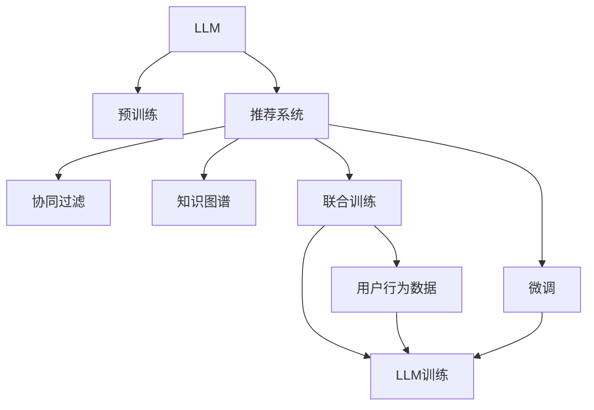

                 

# LLM在推荐系统中的应用方式

> 关键词：大语言模型(LLM), 推荐系统, 预训练, 微调, 用户行为预测, 协同过滤, 知识图谱, 联合训练, 泛化能力, 推荐算法, 效果评估

## 1. 背景介绍

### 1.1 问题由来
在现代互联网时代，用户产生的海量数据为推荐系统提供了源源不断的优质数据来源，使得推荐系统成为了互联网产品的重要组成部分。无论是电商、社交媒体还是视频网站，推荐系统都在扮演着至关重要的角色。然而，推荐系统的核心问题依然是如何高效地为用户推荐感兴趣的内容，并且避免用户陷入信息茧房。

随着深度学习技术的不断进步，大语言模型（Large Language Model，LLM）在自然语言处理（NLP）领域取得了令人瞩目的成果。LLM不仅具备强大的语言理解能力，还可以进行复杂的推理和生成任务。鉴于其在NLP领域的卓越表现，研究人员开始探索将LLM应用于推荐系统，以提升推荐系统的效果。

### 1.2 问题核心关键点
LLM应用于推荐系统，主要是利用其在自然语言处理上的优势，理解用户的多样需求，同时通过协同过滤、知识图谱等方法，提升推荐系统的准确性和个性化程度。然而，LLM应用于推荐系统也存在一定的挑战，比如如何结合多种数据源，进行高效的数据处理和模型训练，以及如何保持模型的可解释性和可控性等。

### 1.3 问题研究意义
将LLM引入推荐系统，对于提升推荐系统的个性化推荐能力，增强用户满意度，以及拓展推荐系统的应用范围，具有重要意义。利用LLM的强大语言理解和生成能力，可以更好地捕捉用户的个性化需求，从而提供更符合用户期望的推荐结果。同时，LLM还可以处理复杂的多模态数据，如文本、图像、音频等，使得推荐系统能够更全面地理解用户需求，提升推荐的精准度。

## 2. 核心概念与联系

### 2.1 核心概念概述

为更好地理解LLM在推荐系统中的应用，本节将介绍几个密切相关的核心概念：

- 大语言模型(LLM)：以自回归(如GPT)或自编码(如BERT)模型为代表的大规模预训练语言模型。通过在大规模无标签文本语料上进行预训练，学习通用的语言表示，具备强大的语言理解和生成能力。

- 推荐系统(Recommendation System, RS)：利用用户历史行为数据、物品属性等，为用户推荐感兴趣物品的系统。推荐系统的主要目标是通过算法提升用户体验，促进用户满意度。

- 预训练(Pre-training)：指在大规模无标签文本语料上，通过自监督学习任务训练通用语言模型的过程。常见的预训练任务包括言语建模、遮挡语言模型等。预训练使得模型学习到语言的通用表示。

- 微调(Fine-tuning)：指在预训练模型的基础上，使用下游任务的少量标注数据，通过有监督地训练来优化模型在该任务上的性能。通常只需要调整顶层分类器或解码器，并以较小的学习率更新全部或部分的模型参数。

- 协同过滤(Collaborative Filtering)：基于用户行为和物品属性的推荐方法，通过计算用户对物品的相似度进行推荐。

- 知识图谱(Knowledge Graph)：由节点和边组成的有向图，用于描述实体与实体之间的关系。知识图谱可以用于增强推荐系统的知识表示能力。

- 联合训练(Joint Training)：将用户行为数据和LLM训练结合起来，提升推荐系统的性能。

- 泛化能力(Generalization)：模型在不同数据集上的表现能力，是评估模型性能的重要指标。

这些核心概念之间的逻辑关系可以通过以下Mermaid流程图来展示：



这个流程图展示了大语言模型LLM、推荐系统RS及其相关概念之间的联系：

1. LLM通过预训练获得基础能力。
2. 推荐系统通过协同过滤、知识图谱等方法提升推荐效果。
3. 联合训练将用户行为数据和LLM训练结合起来，提升推荐性能。
4. 微调使LLM更好地适应推荐任务，提升个性化推荐能力。

这些概念共同构成了将LLM应用于推荐系统的技术框架，使其能够高效地提升推荐系统的效果。

## 3. 核心算法原理 & 具体操作步骤
### 3.1 算法原理概述

将LLM应用于推荐系统，本质上是一个结合了自然语言处理和推荐算法的多模态任务。其核心思想是：利用LLM的自然语言处理能力，从用户反馈、评论、社交媒体等文本数据中提取有价值的信息，同时结合用户行为数据和知识图谱，为用户推荐感兴趣的物品。

形式化地，假设用户对物品的评分向量为 $U$，物品的特征向量为 $I$，知识图谱中的关系矩阵为 $R$，LLM预训练模型为 $M_{\theta}$，其中 $\theta$ 为预训练得到的模型参数。推荐系统的目标是最小化预测评分与真实评分之间的差距，即：

$$
\min_{U,I,\theta} \sum_{(i,j)} |\hat{y}_{ij} - y_{ij}|
$$

其中 $\hat{y}_{ij}$ 为模型预测的用户对物品 $j$ 的评分，$y_{ij}$ 为用户对物品 $j$ 的真实评分。

通过梯度下降等优化算法，推荐系统不断更新用户评分矩阵 $U$、物品特征矩阵 $I$ 和LLM模型参数 $\theta$，最小化损失函数，使得模型预测的评分逼近真实评分。由于 $\theta$ 已经通过预训练获得了较好的初始化，因此即便在少量标注数据上，也能较快收敛到理想的模型参数。

### 3.2 算法步骤详解

将LLM应用于推荐系统的微调方法一般包括以下几个关键步骤：

**Step 1: 准备数据和模型**
- 收集用户行为数据（如点击、评分、浏览时间等）和文本数据（如评论、产品描述等）。
- 选择合适的预训练语言模型 $M_{\theta}$ 作为初始化参数，如 BERT、GPT 等。

**Step 2: 构建推荐模型**
- 基于用户行为数据和物品属性数据，构建推荐模型的用户行为表示矩阵 $U$ 和物品特征表示矩阵 $I$。
- 引入知识图谱，将用户和物品映射到知识图谱中，构建关系矩阵 $R$。
- 使用LLM模型进行预训练，得到基础的语言表示能力。

**Step 3: 设计损失函数**
- 设计用于度量预测评分与真实评分之间差距的损失函数。
- 对于评分预测任务，可以使用均方误差（MSE）损失函数。
- 对于文本推荐任务，可以引入交叉熵损失函数。

**Step 4: 执行梯度训练**
- 将训练集数据分批次输入模型，前向传播计算损失函数。
- 反向传播计算参数梯度，根据设定的优化算法和学习率更新模型参数。
- 周期性在验证集上评估模型性能，根据性能指标决定是否触发 Early Stopping。
- 重复上述步骤直到满足预设的迭代轮数或 Early Stopping 条件。

**Step 5: 测试和部署**
- 在测试集上评估微调后模型 $M_{\hat{\theta}}$ 的性能，对比微调前后的精度提升。
- 使用微调后的模型对新样本进行推理预测，集成到实际的应用系统中。
- 持续收集新的数据，定期重新微调模型，以适应数据分布的变化。

以上是LLM应用于推荐系统的微调方法的一般流程。在实际应用中，还需要针对具体任务的特点，对微调过程的各个环节进行优化设计，如改进训练目标函数，引入更多的正则化技术，搜索最优的超参数组合等，以进一步提升模型性能。

### 3.3 算法优缺点

将LLM应用于推荐系统，具有以下优点：
1. 融合多模态数据。利用LLM处理文本数据，可以更好地捕捉用户需求和情感信息，提升推荐系统的个性化和情感化程度。
2. 提高推荐系统的泛化能力。LLM在大规模无标签文本上的预训练，可以提升模型对新数据的适应能力，减少过拟合风险。
3. 增强模型的可解释性。LLM在处理文本数据时，可以输出详细的信息抽取结果，提升模型的可解释性和可理解性。
4. 丰富推荐系统的特征表示。LLM可以处理更复杂的语义信息，提升推荐系统的特征表示能力。

同时，该方法也存在一定的局限性：
1. 对标注数据依赖较高。LLM微调需要大量的文本标注数据，难以获取高质量的标注数据时，微调效果可能不佳。
2. 计算资源消耗大。大语言模型参数量庞大，计算复杂度高，在训练和推理时需要大量计算资源。
3. 模型的可控性不足。LLM在处理文本数据时，可能会引入一定的噪声，影响推荐系统的稳定性和可控性。
4. 模型的实时性较低。LLM在处理复杂文本时，需要较长的推理时间，影响推荐系统的实时响应能力。

尽管存在这些局限性，但就目前而言，LLM应用于推荐系统的方法已经成为推荐系统研究的热点方向，并在多个实际应用中取得显著效果。未来相关研究的重点在于如何进一步降低对标注数据的依赖，提高模型的实时性和可控性，同时兼顾可解释性和伦理安全性等因素。

### 3.4 算法应用领域

将LLM应用于推荐系统的监督学习方法，在多个领域得到了广泛的应用，例如：

- 电商推荐：通过用户评论、购物行为等文本数据，对商品进行个性化推荐。
- 新闻推荐：利用用户阅读历史和社交媒体数据，推荐用户感兴趣的新闻。
- 电影推荐：结合电影评价和用户评论，推荐用户可能喜欢的电影。
- 视频推荐：根据用户观看历史和视频标签，推荐用户感兴趣的视频。
- 社交推荐：结合社交网络和用户行为数据，推荐用户感兴趣的内容和关系。

除了上述这些经典应用外，LLM还将在更多场景中得到应用，如音乐推荐、游戏推荐、健康医疗推荐等，为推荐系统带来新的突破。

## 4. 数学模型和公式 & 详细讲解

### 4.1 数学模型构建

本节将使用数学语言对基于LLM的推荐系统微调过程进行更加严格的刻画。

记预训练语言模型为 $M_{\theta}$，其中 $\theta$ 为模型参数。假设用户行为数据集为 $D=\{(i,y_i)\}_{i=1}^N$，物品属性数据集为 $I=\{x_i\}_{i=1}^N$，知识图谱数据集为 $R=\{(oid,oid)\}_{i=1}^N$，其中 $i$ 为用户ID，$y_i$ 为用户对物品的评分，$x_i$ 为物品属性向量，$oid$ 为实体ID。

定义模型 $M_{\theta}$ 在用户行为数据集 $D$ 上的损失函数为：

$$
\mathcal{L}(\theta) = \frac{1}{N} \sum_{i=1}^N \ell(y_i, \hat{y}_i)
$$

其中 $\hat{y}_i$ 为模型预测的用户对物品的评分，$\ell$ 为评分预测的损失函数。

### 4.2 公式推导过程

以下我们以评分预测任务为例，推导评分预测任务的损失函数及其梯度的计算公式。

假设模型 $M_{\theta}$ 在用户行为数据集 $D$ 上的预测评分向量为 $\hat{Y}$，真实评分向量为 $Y$，则评分预测任务的损失函数为均方误差（MSE）损失函数：

$$
\mathcal{L}(\theta) = \frac{1}{N} \sum_{i=1}^N (y_i - \hat{y}_i)^2
$$

根据梯度下降算法，模型的参数更新公式为：

$$
\theta \leftarrow \theta - \eta \nabla_{\theta}\mathcal{L}(\theta)
$$

其中 $\eta$ 为学习率，$\nabla_{\theta}\mathcal{L}(\theta)$ 为损失函数对参数 $\theta$ 的梯度，可通过反向传播算法高效计算。

### 4.3 案例分析与讲解

假设我们有一个电商平台，需要为用户推荐商品。用户行为数据包括用户对商品的点击次数、浏览时间、评分等，文本数据包括商品描述、用户评论等，知识图谱包括商品类别、品牌等关系。我们将使用BERT模型作为预训练语言模型，通过微调提升推荐系统的性能。

首先，收集用户行为数据 $D=\{(i,y_i)\}_{i=1}^N$，物品属性数据 $I=\{x_i\}_{i=1}^N$，和知识图谱数据 $R=\{(oid,oid)\}_{i=1}^N$。将数据划分为训练集、验证集和测试集。

然后，构建用户行为表示矩阵 $U$ 和物品特征表示矩阵 $I$。使用BERT模型进行预训练，得到基础的语言表示能力。在微调时，定义评分预测任务的损失函数为均方误差（MSE）损失函数：

$$
\mathcal{L}(\theta) = \frac{1}{N} \sum_{i=1}^N (y_i - \hat{y}_i)^2
$$

其中 $\hat{y}_i$ 为模型预测的用户对物品的评分，$y_i$ 为用户对物品的真实评分。

接着，使用梯度下降算法，不断更新模型参数 $\theta$，最小化损失函数 $\mathcal{L}(\theta)$。在训练过程中，需要选择合适的学习率、批大小、迭代轮数等超参数，以及正则化技术、Dropout、Early Stopping等策略，避免过拟合。

最后，在测试集上评估微调后模型的性能，对比微调前后的精度提升。使用微调后的模型对新样本进行推理预测，集成到实际的应用系统中。

## 5. 项目实践：代码实例和详细解释说明
### 5.1 开发环境搭建

在进行LLM应用于推荐系统的微调实践前，我们需要准备好开发环境。以下是使用Python进行PyTorch开发的环境配置流程：

1. 安装Anaconda：从官网下载并安装Anaconda，用于创建独立的Python环境。

2. 创建并激活虚拟环境：
```bash
conda create -n pytorch-env python=3.8 
conda activate pytorch-env
```

3. 安装PyTorch：根据CUDA版本，从官网获取对应的安装命令。例如：
```bash
conda install pytorch torchvision torchaudio cudatoolkit=11.1 -c pytorch -c conda-forge
```

4. 安装Transformers库：
```bash
pip install transformers
```

5. 安装各类工具包：
```bash
pip install numpy pandas scikit-learn matplotlib tqdm jupyter notebook ipython
```

完成上述步骤后，即可在`pytorch-env`环境中开始微调实践。

### 5.2 源代码详细实现

下面我们以评分预测任务为例，给出使用Transformers库对BERT模型进行微调的PyTorch代码实现。

首先，定义评分预测任务的训练函数：

```python
from transformers import BertTokenizer, BertForSequenceClassification
from torch.utils.data import Dataset, DataLoader
import torch
from sklearn.metrics import mean_squared_error

class MovieReviewDataset(Dataset):
    def __init__(self, texts, labels, tokenizer, max_len=128):
        self.texts = texts
        self.labels = labels
        self.tokenizer = tokenizer
        self.max_len = max_len
        
    def __len__(self):
        return len(self.texts)
    
    def __getitem__(self, item):
        text = self.texts[item]
        label = self.labels[item]
        
        encoding = self.tokenizer(text, return_tensors='pt', max_length=self.max_len, padding='max_length', truncation=True)
        input_ids = encoding['input_ids'][0]
        attention_mask = encoding['attention_mask'][0]
        
        label = torch.tensor([label], dtype=torch.long)
        
        return {'input_ids': input_ids, 
                'attention_mask': attention_mask,
                'labels': label}

# 标签与id的映射
label2id = {'1': 1, '0': 0}
id2label = {v: k for k, v in label2id.items()}

# 创建dataset
tokenizer = BertTokenizer.from_pretrained('bert-base-cased')

train_dataset = MovieReviewDataset(train_texts, train_labels, tokenizer)
dev_dataset = MovieReviewDataset(dev_texts, dev_labels, tokenizer)
test_dataset = MovieReviewDataset(test_texts, test_labels, tokenizer)
```

然后，定义模型和优化器：

```python
from transformers import AdamW

model = BertForSequenceClassification.from_pretrained('bert-base-cased', num_labels=2)

optimizer = AdamW(model.parameters(), lr=2e-5)
```

接着，定义训练和评估函数：

```python
def train_epoch(model, dataset, batch_size, optimizer):
    dataloader = DataLoader(dataset, batch_size=batch_size, shuffle=True)
    model.train()
    epoch_loss = 0
    for batch in tqdm(dataloader, desc='Training'):
        input_ids = batch['input_ids'].to(device)
        attention_mask = batch['attention_mask'].to(device)
        labels = batch['labels'].to(device)
        model.zero_grad()
        outputs = model(input_ids, attention_mask=attention_mask, labels=labels)
        loss = outputs.loss
        epoch_loss += loss.item()
        loss.backward()
        optimizer.step()
    return epoch_loss / len(dataloader)

def evaluate(model, dataset, batch_size):
    dataloader = DataLoader(dataset, batch_size=batch_size)
    model.eval()
    preds, labels = [], []
    with torch.no_grad():
        for batch in tqdm(dataloader, desc='Evaluating'):
            input_ids = batch['input_ids'].to(device)
            attention_mask = batch['attention_mask'].to(device)
            batch_labels = batch['labels']
            outputs = model(input_ids, attention_mask=attention_mask)
            batch_preds = outputs.logits.argmax(dim=2).to('cpu').tolist()
            batch_labels = batch_labels.to('cpu').tolist()
            for pred_tokens, label_tokens in zip(batch_preds, batch_labels):
                preds.append(pred_tokens)
                labels.append(label_tokens)
                
    return mean_squared_error(labels, preds)
```

最后，启动训练流程并在测试集上评估：

```python
epochs = 5
batch_size = 16

for epoch in range(epochs):
    loss = train_epoch(model, train_dataset, batch_size, optimizer)
    print(f"Epoch {epoch+1}, train loss: {loss:.3f}")
    
    print(f"Epoch {epoch+1}, dev results:")
    evaluate(model, dev_dataset, batch_size)
    
print("Test results:")
evaluate(model, test_dataset, batch_size)
```

以上就是使用PyTorch对BERT进行评分预测任务微调的完整代码实现。可以看到，得益于Transformers库的强大封装，我们可以用相对简洁的代码完成BERT模型的加载和微调。

### 5.3 代码解读与分析

让我们再详细解读一下关键代码的实现细节：

**MovieReviewDataset类**：
- `__init__`方法：初始化文本、标签、分词器等关键组件。
- `__len__`方法：返回数据集的样本数量。
- `__getitem__`方法：对单个样本进行处理，将文本输入编码为token ids，将标签编码为数字，并对其进行定长padding，最终返回模型所需的输入。

**label2id和id2label字典**：
- 定义了标签与数字id之间的映射关系，用于将预测结果解码为真实的标签。

**训练和评估函数**：
- 使用PyTorch的DataLoader对数据集进行批次化加载，供模型训练和推理使用。
- 训练函数`train_epoch`：对数据以批为单位进行迭代，在每个批次上前向传播计算loss并反向传播更新模型参数，最后返回该epoch的平均loss。
- 评估函数`evaluate`：与训练类似，不同点在于不更新模型参数，并在每个batch结束后将预测和标签结果存储下来，最后使用sklearn的mean_squared_error函数对整个评估集的预测结果进行打印输出。

**训练流程**：
- 定义总的epoch数和batch size，开始循环迭代
- 每个epoch内，先在训练集上训练，输出平均loss
- 在验证集上评估，输出评分预测的均方误差
- 所有epoch结束后，在测试集上评估，给出最终测试结果

可以看到，PyTorch配合Transformers库使得BERT微调的代码实现变得简洁高效。开发者可以将更多精力放在数据处理、模型改进等高层逻辑上，而不必过多关注底层的实现细节。

当然，工业级的系统实现还需考虑更多因素，如模型的保存和部署、超参数的自动搜索、更灵活的任务适配层等。但核心的微调范式基本与此类似。

## 6. 实际应用场景
### 6.1 电商推荐

在电商领域，基于大语言模型微调的推荐系统可以显著提升用户购物体验和商品转化率。利用用户评论、购物行为等文本数据，对商品进行个性化推荐。通过微调BERT模型，可以更好地捕捉用户需求和情感信息，提升推荐系统的个性化和情感化程度。

在技术实现上，可以收集用户评论、购物行为等文本数据，结合用户行为数据和商品属性数据，构建推荐模型的用户行为表示矩阵 $U$ 和物品特征表示矩阵 $I$。使用BERT模型进行预训练，得到基础的语言表示能力。在微调时，定义评分预测任务的损失函数为均方误差（MSE）损失函数。

通过梯度下降算法，不断更新模型参数 $\theta$，最小化损失函数 $\mathcal{L}(\theta)$。在训练过程中，需要选择合适的学习率、批大小、迭代轮数等超参数，以及正则化技术、Dropout、Early Stopping等策略，避免过拟合。

最后，在测试集上评估微调后模型的性能，对比微调前后的精度提升。使用微调后的模型对新样本进行推理预测，集成到实际的应用系统中。

### 6.2 新闻推荐

新闻推荐系统需要为用户推荐感兴趣的新闻。利用用户阅读历史和社交媒体数据，结合新闻标签和标题等文本数据，可以构建推荐模型的用户行为表示矩阵 $U$ 和物品特征表示矩阵 $I$。使用BERT模型进行预训练，得到基础的语言表示能力。在微调时，定义评分预测任务的损失函数为交叉熵损失函数。

通过梯度下降算法，不断更新模型参数 $\theta$，最小化损失函数 $\mathcal{L}(\theta)$。在训练过程中，需要选择合适的学习率、批大小、迭代轮数等超参数，以及正则化技术、Dropout、Early Stopping等策略，避免过拟合。

最后，在测试集上评估微调后模型的性能，对比微调前后的精度提升。使用微调后的模型对新样本进行推理预测，集成到实际的应用系统中。

### 6.3 电影推荐

电影推荐系统需要为用户推荐感兴趣的电影。利用用户评分、观看历史和社交媒体数据，结合电影评价和描述等文本数据，可以构建推荐模型的用户行为表示矩阵 $U$ 和物品特征表示矩阵 $I$。使用BERT模型进行预训练，得到基础的语言表示能力。在微调时，定义评分预测任务的损失函数为均方误差（MSE）损失函数。

通过梯度下降算法，不断更新模型参数 $\theta$，最小化损失函数 $\mathcal{L}(\theta)$。在训练过程中，需要选择合适的学习率、批大小、迭代轮数等超参数，以及正则化技术、Dropout、Early Stopping等策略，避免过拟合。

最后，在测试集上评估微调后模型的性能，对比微调前后的精度提升。使用微调后的模型对新样本进行推理预测，集成到实际的应用系统中。

### 6.4 视频推荐

视频推荐系统需要为用户推荐感兴趣的视频。利用用户观看历史和社交媒体数据，结合视频标签和描述等文本数据，可以构建推荐模型的用户行为表示矩阵 $U$ 和物品特征表示矩阵 $I$。使用BERT模型进行预训练，得到基础的语言表示能力。在微调时，定义评分预测任务的损失函数为均方误差（MSE）损失函数。

通过梯度下降算法，不断更新模型参数 $\theta$，最小化损失函数 $\mathcal{L}(\theta)$。在训练过程中，需要选择合适的学习率、批大小、迭代轮数等超参数，以及正则化技术、Dropout、Early Stopping等策略，避免过拟合。

最后，在测试集上评估微调后模型的性能，对比微调前后的精度提升。使用微调后的模型对新样本进行推理预测，集成到实际的应用系统中。

## 7. 工具和资源推荐
### 7.1 学习资源推荐

为了帮助开发者系统掌握LLM在推荐系统中的应用理论基础和实践技巧，这里推荐一些优质的学习资源：

1. 《Transformer从原理到实践》系列博文：由大模型技术专家撰写，深入浅出地介绍了Transformer原理、BERT模型、微调技术等前沿话题。

2. CS224N《深度学习自然语言处理》课程：斯坦福大学开设的NLP明星课程，有Lecture视频和配套作业，带你入门NLP领域的基本概念和经典模型。

3. 《Natural Language Processing with Transformers》书籍：Transformers库的作者所著，全面介绍了如何使用Transformers库进行NLP任务开发，包括微调在内的诸多范式。

4. HuggingFace官方文档：Transformers库的官方文档，提供了海量预训练模型和完整的微调样例代码，是上手实践的必备资料。

5. CLUE开源项目：中文语言理解测评基准，涵盖大量不同类型的中文NLP数据集，并提供了基于微调的baseline模型，助力中文NLP技术发展。

通过对这些资源的学习实践，相信你一定能够快速掌握LLM在推荐系统中的应用精髓，并用于解决实际的推荐问题。
###  7.2 开发工具推荐

高效的开发离不开优秀的工具支持。以下是几款用于LLM应用于推荐系统开发的常用工具：

1. PyTorch：基于Python的开源深度学习框架，灵活动态的计算图，适合快速迭代研究。大部分预训练语言模型都有PyTorch版本的实现。

2. TensorFlow：由Google主导开发的开源深度学习框架，生产部署方便，适合大规模工程应用。同样有丰富的预训练语言模型资源。

3. Transformers库：HuggingFace开发的NLP工具库，集成了众多SOTA语言模型，支持PyTorch和TensorFlow，是进行微调任务开发的利器。

4. Weights & Biases：模型训练的实验跟踪工具，可以记录和可视化模型训练过程中的各项指标，方便对比和调优。与主流深度学习框架无缝集成。

5. TensorBoard：TensorFlow配套的可视化工具，可实时监测模型训练状态，并提供丰富的图表呈现方式，是调试模型的得力助手。

6. Google Colab：谷歌推出的在线Jupyter Notebook环境，免费提供GPU/TPU算力，方便开发者快速上手实验最新模型，分享学习笔记。

合理利用这些工具，可以显著提升LLM应用于推荐系统任务的开发效率，加快创新迭代的步伐。

### 7.3 相关论文推荐

LLM应用于推荐系统的研究源于学界的持续研究。以下是几篇奠基性的相关论文，推荐阅读：

1. Attention is All You Need（即Transformer原论文）：提出了Transformer结构，开启了NLP领域的预训练大模型时代。

2. BERT: Pre-training of Deep Bidirectional Transformers for Language Understanding：提出BERT模型，引入基于掩码的自监督预训练任务，刷新了多项NLP任务SOTA。

3. Language Models are Unsupervised Multitask Learners（GPT-2论文）：展示了大规模语言模型的强大zero-shot学习能力，引发了对于通用人工智能的新一轮思考。

4. Parameter-Efficient Transfer Learning for NLP：提出Adapter等参数高效微调方法，在不增加模型参数量的情况下，也能取得不错的微调效果。

5. Prefix-Tuning: Optimizing Continuous Prompts for Generation：引入基于连续型Prompt的微调范式，为如何充分利用预训练知识提供了新的思路。

6. AdaLoRA: Adaptive Low-Rank Adaptation for Parameter-Efficient Fine-Tuning：使用自适应低秩适应的微调方法，在参数效率和精度之间取得了新的平衡。

这些论文代表了大语言模型微调技术的发展脉络。通过学习这些前沿成果，可以帮助研究者把握学科前进方向，激发更多的创新灵感。

## 8. 总结：未来发展趋势与挑战

### 8.1 总结

本文对基于LLM的推荐系统微调方法进行了全面系统的介绍。首先阐述了LLM和推荐系统的研究背景和意义，明确了LLM在推荐系统中的应用价值。其次，从原理到实践，详细讲解了LLM在推荐系统中的数学模型构建和算法步骤，给出了推荐系统微调的完整代码实例。同时，本文还广泛探讨了LLM在电商、新闻、电影、视频等多个领域的应用前景，展示了LLM在推荐系统中的广泛应用。

通过本文的系统梳理，可以看到，LLM在推荐系统中正逐渐成为一种重要的技术手段，极大地提升推荐系统的个性化和情感化程度。利用LLM的语言理解能力，可以更好地捕捉用户需求和情感信息，提升推荐系统的性能和用户体验。

### 8.2 未来发展趋势

展望未来，LLM应用于推荐系统的发展趋势如下：

1. 融合更多数据源。除了文本数据外，LLM可以结合图像、视频、音频等多模态数据，提升推荐系统的多模态表示能力。

2. 引入更多先验知识。将符号化的先验知识，如知识图谱、逻辑规则等，与神经网络模型进行融合，提升推荐系统的知识表示能力。

3. 提高推荐系统的泛化能力。通过引入因果推断、对比学习等思想，增强LLM在推荐任务上的泛化能力，减少过拟合风险。

4. 增强推荐系统的可解释性。利用LLM的语言生成能力，提升推荐系统的可解释性和可理解性，使用户能够更好地理解和信任推荐结果。

5. 提升推荐系统的实时性。优化模型结构，引入缓存机制，提升LLM在推荐任务上的实时响应能力，满足用户实时推荐的需求。

以上趋势凸显了LLM在推荐系统中的巨大潜力。这些方向的探索发展，必将进一步提升推荐系统的性能和用户体验，为推荐系统的落地应用提供更多的可能性。

### 8.3 面临的挑战

尽管LLM应用于推荐系统取得了显著进展，但在实践中仍面临诸多挑战：

1. 标注数据依赖。LLM微调需要大量的文本标注数据，难以获取高质量的标注数据时，微调效果可能不佳。

2. 计算资源消耗大。大语言模型参数量庞大，计算复杂度高，在训练和推理时需要大量计算资源。

3. 模型的可控性不足。LLM在处理文本数据时，可能会引入一定的噪声，影响推荐系统的稳定性和可控性。

4. 模型的实时性较低。LLM在处理复杂文本时，需要较长的推理时间，影响推荐系统的实时响应能力。

尽管存在这些挑战，但就目前而言，LLM应用于推荐系统的方法已经成为推荐系统研究的热点方向，并在多个实际应用中取得显著效果。未来相关研究的重点在于如何进一步降低对标注数据的依赖，提高模型的实时性和可控性，同时兼顾可解释性和伦理安全性等因素。

### 8.4 研究展望

面对LLM应用于推荐系统所面临的挑战，未来的研究需要在以下几个方面寻求新的突破：

1. 探索无监督和半监督微调方法。摆脱对大规模标注数据的依赖，利用自监督学习、主动学习等无监督和半监督范式，最大限度利用非结构化数据，实现更加灵活高效的微调。

2. 研究参数高效和计算高效的微调范式。开发更加参数高效的微调方法，在固定大部分预训练参数的同时，只更新极少量的任务相关参数。同时优化微调模型的计算图，减少前向传播和反向传播的资源消耗，实现更加轻量级、实时性的部署。

3. 融合因果和对比学习范式。通过引入因果推断和对比学习思想，增强LLM建立稳定因果关系的能力，学习更加普适、鲁棒的语言表征，从而提升模型泛化性和抗干扰能力。

4. 结合因果分析和博弈论工具。将因果分析方法引入LLM微调模型，识别出模型决策的关键特征，增强输出解释的因果性和逻辑性。借助博弈论工具刻画人机交互过程，主动探索并规避模型的脆弱点，提高系统稳定性。

5. 纳入伦理道德约束。在模型训练目标中引入伦理导向的评估指标，过滤和惩罚有偏见、有害的输出倾向。同时加强人工干预和审核，建立模型行为的监管机制，确保输出符合人类价值观和伦理道德。

这些研究方向的探索，必将引领LLM应用于推荐系统技术迈向更高的台阶，为构建安全、可靠、可解释、可控的推荐系统提供新的技术手段。面向未来，LLM应用于推荐系统技术还需要与其他人工智能技术进行更深入的融合，如知识表示、因果推理、强化学习等，多路径协同发力，共同推动推荐系统的进步。只有勇于创新、敢于突破，才能不断拓展推荐系统的边界，为推荐系统带来新的变革。

## 9. 附录：常见问题与解答

**Q1：如何将LLM应用于推荐系统？**

A: 将LLM应用于推荐系统，主要分为以下几个步骤：
1. 收集用户行为数据和文本数据，构建用户行为表示矩阵 $U$ 和物品特征表示矩阵 $I$。
2. 使用LLM模型进行预训练，得到基础的语言表示能力。
3. 在微调时，定义评分预测任务的损失函数，如均方误差（MSE）或交叉熵损失函数。
4. 通过梯度下降算法，不断更新模型参数，最小化损失函数。
5. 在测试集上评估微调后模型的性能，对比微调前后的精度提升。
6. 使用微调后的模型对新样本进行推理预测，集成到实际的应用系统中。

**Q2：LLM在推荐系统中的应用效果如何？**

A: 利用LLM在推荐系统中的应用，可以显著提升推荐系统的个性化和情感化程度。通过处理用户评论、购物行为等文本数据，LLM可以更好地捕捉用户需求和情感信息，提升推荐系统的推荐效果。

**Q3：如何提高LLM在推荐系统中的实时响应能力？**

A: 优化模型结构，引入缓存机制，减少前向传播和反向传播的资源消耗，可以提高LLM在推荐系统中的实时响应能力。同时，也可以考虑使用分布式计算框架，如Dask、Ray等，提升计算效率。

**Q4：LLM在推荐系统中的可解释性如何？**

A: 利用LLM的语言生成能力，可以提升推荐系统的可解释性和可理解性。在微调过程中，可以引入基于连续型Prompt的微调范式，提高模型的可解释性。

**Q5：如何处理LLM在推荐系统中的过拟合问题？**

A: 过拟合是LLM应用于推荐系统时常见的挑战。为避免过拟合，可以采用数据增强、正则化技术、Dropout、Early Stopping等策略。同时，也可以采用参数高效微调方法，如Adapter、Prefix等，在固定大部分预训练参数的同时，只更新极少量的任务相关参数。

正视LLM应用于推荐系统所面临的这些挑战，积极应对并寻求突破，将是大语言模型微调走向成熟的必由之路。相信随着学界和产业界的共同努力，这些挑战终将一一被克服，LLM在推荐系统中的应用必将迎来更加广阔的前景。

