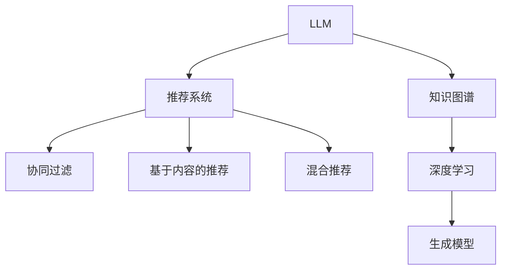

                 

# LLM在推荐系统中的应用进展

> 关键词：
1. 大语言模型 (LLM)
2. 推荐系统
3. 知识图谱
4. 神经网络
5. 协同过滤
6. 深度学习
7. 推荐精度

## 1. 背景介绍

### 1.1 问题由来

在过去的十年中，推荐系统已经从一个辅助性的决策支持工具，成为了线上业务的核心驱动力。通过个性化推荐，电商平台和内容平台能够显著提升用户体验，增加用户留存和转化率。然而，随着用户需求和市场环境的变化，传统推荐系统的瓶颈也逐渐显现，亟需新范式和新模型的突破。

近年来，大语言模型（LLM）以其强大的语言理解和生成能力，逐步成为推荐系统中的新兴力量。LLM通过深度学习的方法，在文本数据上训练出的知识表示能力，可以为推荐系统提供全新的数据表征方式和推荐逻辑。这一趋势不仅体现在新兴的AI推荐系统中，也在传统推荐系统的协同过滤和基于内容的推荐中得到应用。

### 1.2 问题核心关键点

LLM在推荐系统中的应用，主要体现在以下几个核心关键点：

- **知识表示能力**：LLM能够从海量文本数据中学习到丰富的语义信息，这些知识可以在推荐系统中被转化为新的数据表示方式，提升推荐逻辑的复杂性和准确性。
- **个性化推荐**：利用LLM的上下文理解能力，推荐系统可以实现更加个性化的推荐，用户不仅可以根据兴趣相似度，还可以根据文本语义相似度进行匹配。
- **多模态融合**：LLM可以与图像、音频等多模态数据进行融合，提升推荐系统的信息获取能力和用户体验。
- **异常推荐生成**：LLM的生成能力可以用于推荐系统的异常推荐生成，在推荐结果出现偏差时，LLM可以生成替代推荐，提升推荐系统的鲁棒性。
- **跨领域应用**：LLM在通用语言模型的基础上，可以在不同的领域（如电商、社交、视频等）中应用，提升推荐系统在不同场景下的适应性。

## 2. 核心概念与联系

### 2.1 核心概念概述

为了更好地理解LLM在推荐系统中的应用，本节将介绍几个密切相关的核心概念：

- **大语言模型 (LLM)**：以Transformer架构为代表的大规模预训练语言模型。通过在大规模无标签文本语料上进行预训练，学习通用的语言表示，具备强大的语言理解和生成能力。
- **推荐系统**：利用用户行为数据和物品特征，为用户提供个性化推荐服务的系统。常见的推荐方法包括协同过滤、基于内容的推荐、混合推荐等。
- **知识图谱**：由实体、关系和属性构成的知识网络，用于描述现实世界中的复杂关系。知识图谱可以与推荐系统结合，提升推荐的精度和多样化。
- **协同过滤**：一种基于用户行为相似性的推荐方法，通过计算用户和物品之间的相似度进行推荐。
- **深度学习**：一种基于神经网络的机器学习方法，通过大量数据训练，自动提取特征，实现高效准确的推荐。
- **生成模型**：一种可以生成新数据的数据模型，如变分自编码器、生成对抗网络等，用于提升推荐系统的多样性和鲁棒性。

这些核心概念之间的逻辑关系可以通过以下Mermaid流程图来展示：



这个流程图展示了大语言模型、推荐系统与其他技术之间的联系：

1. LLM通过预训练学习通用语言知识，为推荐系统提供了新的数据表示方式。
2. 推荐系统可以利用LLM的上下文理解能力，实现更加个性化的推荐。
3. 深度学习作为推荐系统的主流方法，可以从LLM学习到的知识表示中受益。
4. 知识图谱和生成模型可以与LLM结合，进一步提升推荐系统的多样性和鲁棒性。

## 3. 核心算法原理 & 具体操作步骤

### 3.1 算法原理概述

LLM在推荐系统中的应用，主要基于以下几个算法原理：

- **知识表示学习**：通过预训练模型在文本数据上学习到的知识表示，可以用于提升推荐系统中的用户和物品表示，从而提升推荐精度。
- **上下文感知推荐**：利用LLM的上下文理解能力，可以理解用户和物品之间的语义关系，进行更加灵活的推荐。
- **生成式推荐**：LLM的生成能力可以用于推荐系统的异常推荐生成，在推荐结果出现偏差时，LLM可以生成替代推荐，提升推荐系统的鲁棒性。

### 3.2 算法步骤详解

基于LLM的推荐系统一般包括以下几个关键步骤：

**Step 1: 准备数据集和预训练模型**
- 收集用户行为数据、物品特征数据和文本语料，划分为训练集、验证集和测试集。
- 选择大语言模型作为预训练模型，如GPT、BERT等，使用其预训练的权重进行初始化。

**Step 2: 构建推荐模型**
- 将用户行为数据和物品特征数据转换为模型可接受的格式，如向量化。
- 根据任务类型，设计合适的推荐模型架构，如MLP、RNN、Transformer等。
- 使用预训练模型作为上下文信息源，利用自然语言处理技术，进行用户、物品和上下文向量的编码。

**Step 3: 训练模型并微调**
- 使用训练集数据训练推荐模型，通过反向传播算法更新模型参数。
- 在验证集上评估模型性能，调整超参数以避免过拟合。
- 使用测试集进行最终性能测试，评估推荐精度。

**Step 4: 应用模型进行推荐**
- 将新用户的行为数据和物品特征数据输入推荐模型，获取推荐结果。
- 根据推荐结果生成推荐页面或列表，展示给用户。
- 持续收集用户反馈，定期重新训练和微调模型。

### 3.3 算法优缺点

基于LLM的推荐系统有以下优点：

1. **知识表示能力强**：LLM可以从文本数据中学习到丰富的语义信息，提升推荐系统中的数据表示能力。
2. **上下文感知推荐**：利用LLM的上下文理解能力，可以实现更加个性化的推荐，提升推荐效果。
3. **生成式推荐**：LLM的生成能力可以用于异常推荐生成，提升推荐系统的鲁棒性。
4. **跨领域应用广泛**：LLM可以在不同的领域和场景中进行应用，提升推荐系统的适应性。

同时，该方法也存在一些缺点：

1. **计算资源需求高**：LLM通常需要大规模的计算资源进行预训练和微调，对硬件设施要求较高。
2. **训练时间长**：由于数据规模和模型复杂度较大，训练时间和迭代次数较长，开发周期较长。
3. **解释性不足**：LLM作为"黑盒"模型，其内部机制和推理逻辑难以解释，难以进行调试和优化。
4. **数据质量和标注成本高**：高质量的标注数据和文本语料是LLM在推荐系统中应用的前提，数据质量和标注成本较高。

尽管存在这些缺点，但LLM在推荐系统中的应用前景仍然广阔，特别是在数据质量和标注成本相对较高的垂直领域，如金融、医疗、教育等。未来相关研究的重点在于如何降低计算资源需求，提高模型训练速度，增强模型可解释性，以及优化数据质量和标注成本等方面。

### 3.4 算法应用领域

基于LLM的推荐系统已经广泛应用于以下几个领域：

1. **电商推荐**：利用用户行为和商品描述，通过LLM进行上下文理解，实现个性化商品推荐。
2. **内容推荐**：通过用户评论、文章摘要等文本数据，利用LLM进行内容生成和相似度匹配，提升推荐效果。
3. **社交推荐**：利用用户社交网络和文本数据，通过LLM进行关系理解和语义匹配，提升推荐多样性。
4. **金融推荐**：利用用户行为和金融产品描述，通过LLM进行情感分析和市场预测，提升推荐精度。
5. **教育推荐**：利用学生行为和课程描述，通过LLM进行内容生成和关系匹配，提升推荐个性化。

除了这些经典应用场景外，LLM还可以结合其他技术手段，创新性地应用于更多场景中，如推荐算法优化、推荐系统融合、推荐结果解释等，为推荐系统带来新的突破。随着预训练模型和推荐方法的不断进步，相信基于LLM的推荐系统将在更多领域得到应用，为推荐技术带来新的活力。

## 4. 数学模型和公式 & 详细讲解 & 举例说明

### 4.1 数学模型构建

本节将使用数学语言对基于LLM的推荐系统进行更加严格的刻画。

记用户行为数据为 $x \in \mathbb{R}^n$，物品特征数据为 $y \in \mathbb{R}^m$。假设推荐系统采用线性回归模型，模型的输出为：

$$
\hat{y} = Wx + b
$$

其中 $W$ 为模型的权重矩阵，$b$ 为偏置向量。推荐系统使用的损失函数为均方误差损失函数：

$$
L = \frac{1}{N} \sum_{i=1}^N (\hat{y}_i - y_i)^2
$$

### 4.2 公式推导过程

以下是详细的公式推导过程。

将上述线性回归模型带入损失函数：

$$
L = \frac{1}{N} \sum_{i=1}^N (Wx_i + b - y_i)^2
$$

对权重 $W$ 进行优化，使损失函数最小化。使用梯度下降算法进行优化，得到权重更新公式：

$$
W \leftarrow W - \eta \frac{1}{N} \sum_{i=1}^N (Wx_i + b - y_i)(Wx_i + b - y_i)^T
$$

其中 $\eta$ 为学习率。

在实际应用中，为了方便计算，通常将用户行为数据 $x$ 和物品特征数据 $y$ 进行向量化处理，如将文本数据转换为词向量，将用户行为数据转换为隐向量。这些向量化处理过程可以通过自然语言处理技术实现，如使用BERT、GPT等预训练模型进行编码。

### 4.3 案例分析与讲解

以下以一个简单的电商推荐系统为例，进行详细分析。

假设用户行为数据为 $x$，物品特征数据为 $y$，利用LLM进行上下文理解，得到用户对每个物品的兴趣评分 $s_i$。将这些评分作为权重矩阵 $W$ 的输入，生成推荐结果：

$$
\hat{y} = Ws
$$

其中 $s$ 为利用LLM对用户和物品文本进行编码后得到的兴趣评分向量。

## 5. 项目实践：代码实例和详细解释说明

### 5.1 开发环境搭建

在进行推荐系统开发前，我们需要准备好开发环境。以下是使用Python进行PyTorch开发的环境配置流程：

1. 安装Anaconda：从官网下载并安装Anaconda，用于创建独立的Python环境。

2. 创建并激活虚拟环境：
```bash
conda create -n pytorch-env python=3.8 
conda activate pytorch-env
```

3. 安装PyTorch：根据CUDA版本，从官网获取对应的安装命令。例如：
```bash
conda install pytorch torchvision torchaudio cudatoolkit=11.1 -c pytorch -c conda-forge
```

4. 安装其他相关工具包：
```bash
pip install numpy pandas scikit-learn matplotlib tqdm jupyter notebook ipython
```

完成上述步骤后，即可在`pytorch-env`环境中开始推荐系统开发。

### 5.2 源代码详细实现

下面我们以基于BERT的电商推荐系统为例，给出使用PyTorch进行推荐系统开发的PyTorch代码实现。

首先，定义推荐系统的数据处理函数：

```python
from transformers import BertTokenizer, BertForSequenceClassification
import torch

class RecommendationDataset(Dataset):
    def __init__(self, texts, tags):
        self.tokenizer = BertTokenizer.from_pretrained('bert-base-cased')
        self.texts = texts
        self.tags = tags
        
    def __len__(self):
        return len(self.texts)
    
    def __getitem__(self, item):
        text = self.texts[item]
        label = self.tags[item]
        
        encoding = self.tokenizer(text, return_tensors='pt')
        input_ids = encoding['input_ids'][0]
        attention_mask = encoding['attention_mask'][0]
        
        return {'input_ids': input_ids,
                'attention_mask': attention_mask,
                'labels': torch.tensor(label, dtype=torch.long)}
```

然后，定义推荐模型和优化器：

```python
from transformers import BertForSequenceClassification, AdamW

model = BertForSequenceClassification.from_pretrained('bert-base-cased', num_labels=2, output_attentions=False)

optimizer = AdamW(model.parameters(), lr=2e-5)
```

接着，定义训练和评估函数：

```python
from torch.utils.data import DataLoader
from tqdm import tqdm
from sklearn.metrics import accuracy_score

device = torch.device('cuda') if torch.cuda.is_available() else torch.device('cpu')
model.to(device)

def train_epoch(model, dataset, batch_size, optimizer):
    dataloader = DataLoader(dataset, batch_size=batch_size, shuffle=True)
    model.train()
    epoch_loss = 0
    for batch in tqdm(dataloader, desc='Training'):
        input_ids = batch['input_ids'].to(device)
        attention_mask = batch['attention_mask'].to(device)
        labels = batch['labels'].to(device)
        model.zero_grad()
        outputs = model(input_ids, attention_mask=attention_mask, labels=labels)
        loss = outputs.loss
        epoch_loss += loss.item()
        loss.backward()
        optimizer.step()
    return epoch_loss / len(dataloader)

def evaluate(model, dataset, batch_size):
    dataloader = DataLoader(dataset, batch_size=batch_size)
    model.eval()
    preds, labels = [], []
    with torch.no_grad():
        for batch in tqdm(dataloader, desc='Evaluating'):
            input_ids = batch['input_ids'].to(device)
            attention_mask = batch['attention_mask'].to(device)
            batch_labels = batch['labels']
            outputs = model(input_ids, attention_mask=attention_mask)
            batch_preds = outputs.logits.argmax(dim=2).to('cpu').tolist()
            batch_labels = batch_labels.to('cpu').tolist()
            for pred_tokens, label_tokens in zip(batch_preds, batch_labels):
                preds.append(pred_tokens)
                labels.append(label_tokens)
    
    print('Accuracy:', accuracy_score(labels, preds))
```

最后，启动训练流程并在测试集上评估：

```python
epochs = 5
batch_size = 16

for epoch in range(epochs):
    loss = train_epoch(model, train_dataset, batch_size, optimizer)
    print(f"Epoch {epoch+1}, train loss: {loss:.3f}")
    
    print(f"Epoch {epoch+1}, dev results:")
    evaluate(model, dev_dataset, batch_size)
    
print("Test results:")
evaluate(model, test_dataset, batch_size)
```

以上就是使用PyTorch对BERT进行电商推荐系统微调的完整代码实现。可以看到，得益于Transformers库的强大封装，我们可以用相对简洁的代码完成BERT模型的加载和微调。

### 5.3 代码解读与分析

让我们再详细解读一下关键代码的实现细节：

**RecommendationDataset类**：
- `__init__`方法：初始化文本、标签、分词器等关键组件。
- `__len__`方法：返回数据集的样本数量。
- `__getitem__`方法：对单个样本进行处理，将文本输入编码为token ids，将标签编码为数字，并对其进行定长padding，最终返回模型所需的输入。

**模型定义和训练**：
- 使用BertForSequenceClassification模型作为推荐模型的顶层分类器，设置输出维度为2，表示二分类任务。
- 使用AdamW优化器进行模型参数的更新，设置学习率为2e-5。
- 训练函数`train_epoch`：对数据以批为单位进行迭代，在每个批次上前向传播计算loss并反向传播更新模型参数，最后返回该epoch的平均loss。
- 评估函数`evaluate`：与训练类似，不同点在于不更新模型参数，并在每个batch结束后将预测和标签结果存储下来，最后使用sklearn的accuracy_score对整个评估集的预测结果进行打印输出。

**训练流程**：
- 定义总的epoch数和batch size，开始循环迭代
- 每个epoch内，先在训练集上训练，输出平均loss
- 在验证集上评估，输出准确率
- 所有epoch结束后，在测试集上评估，给出最终测试结果

可以看到，PyTorch配合Transformers库使得BERT微调的代码实现变得简洁高效。开发者可以将更多精力放在数据处理、模型改进等高层逻辑上，而不必过多关注底层的实现细节。

当然，工业级的系统实现还需考虑更多因素，如模型的保存和部署、超参数的自动搜索、更灵活的任务适配层等。但核心的微调范式基本与此类似。

## 6. 实际应用场景

### 6.1 电商推荐

电商推荐系统是推荐系统中最为典型的应用场景。通过用户的行为数据和物品特征，电商平台可以实时推荐个性化商品，提升用户购物体验和转化率。

在技术实现上，可以收集用户的浏览、点击、购买等行为数据，以及商品标题、描述、标签等特征数据。利用BERT等预训练语言模型，对文本数据进行编码，得到用户和物品的向量表示。将这些向量输入到推荐模型中，输出推荐结果。在推荐结果中加入用户历史行为和物品特征的权重，生成最终推荐列表。

### 6.2 内容推荐

内容推荐系统广泛应用于视频、音乐、文章等领域的推荐。通过用户评论、点赞、观看时长等行为数据，以及视频、文章等内容的文本数据，利用BERT等预训练语言模型，对文本数据进行编码，得到用户和内容的向量表示。将这些向量输入到推荐模型中，输出推荐结果。

在推荐结果中加入用户历史行为和内容特征的权重，生成最终推荐列表。此外，还可以通过多模态融合，将视频、音频等多模态数据与文本数据结合，提升推荐效果。

### 6.3 社交推荐

社交推荐系统广泛应用于微博、微信等社交平台。通过用户的社交网络数据和文本数据，利用BERT等预训练语言模型，对文本数据进行编码，得到用户和物品的向量表示。将这些向量输入到推荐模型中，输出推荐结果。

在推荐结果中加入用户社交网络关系和文本数据的权重，生成最终推荐列表。此外，还可以结合社交网络结构，利用图卷积网络(GCN)等方法，提升推荐效果。

### 6.4 未来应用展望

随着BERT等预训练语言模型的不断进步，基于LLM的推荐系统将在更多领域得到应用，为推荐技术带来新的突破。

在智慧医疗领域，利用患者病历、医生记录等文本数据，结合BERT等预训练语言模型，可以实现医疗推荐系统的个性化推荐。推荐系统可以根据医生的历史诊疗数据，推荐合适的治疗方案和药品。

在智能教育领域，利用学生作业、教师评价等文本数据，结合BERT等预训练语言模型，可以实现教育推荐系统的个性化推荐。推荐系统可以根据学生的学习行为和课程内容，推荐合适的学习资源和练习题。

在智慧城市治理中，利用城市事件、舆情评论等文本数据，结合BERT等预训练语言模型，可以实现城市事件推荐系统。推荐系统可以根据城市事件的历史数据和实时评论，推荐热门事件和相关新闻。

除了这些应用场景外，LLM还可以结合其他技术手段，创新性地应用于更多领域，如推荐算法优化、推荐系统融合、推荐结果解释等，为推荐系统带来新的活力。

## 7. 工具和资源推荐

### 7.1 学习资源推荐

为了帮助开发者系统掌握大语言模型在推荐系统中的应用，这里推荐一些优质的学习资源：

1. 《Transformer from scratch》系列博文：由大模型技术专家撰写，深入浅出地介绍了Transformer原理、BERT模型、推荐系统等前沿话题。

2. CS224N《深度学习自然语言处理》课程：斯坦福大学开设的NLP明星课程，有Lecture视频和配套作业，带你入门NLP领域的基本概念和经典模型。

3. 《Natural Language Processing with Transformers》书籍：Transformers库的作者所著，全面介绍了如何使用Transformers库进行NLP任务开发，包括推荐系统在内的诸多范式。

4. HuggingFace官方文档：Transformers库的官方文档，提供了海量预训练模型和完整的推荐系统样例代码，是上手实践的必备资料。

5. Kaggle推荐系统竞赛：Kaggle平台上有众多推荐系统竞赛，可以参与实战，积累推荐系统开发经验。

通过对这些资源的学习实践，相信你一定能够快速掌握大语言模型在推荐系统中的应用，并用于解决实际的推荐问题。

### 7.2 开发工具推荐

高效的开发离不开优秀的工具支持。以下是几款用于推荐系统开发的常用工具：

1. PyTorch：基于Python的开源深度学习框架，灵活动态的计算图，适合快速迭代研究。大多数预训练语言模型都有PyTorch版本的实现。

2. TensorFlow：由Google主导开发的开源深度学习框架，生产部署方便，适合大规模工程应用。同样有丰富的预训练语言模型资源。

3. Transformers库：HuggingFace开发的NLP工具库，集成了众多SOTA语言模型，支持PyTorch和TensorFlow，是进行推荐系统开发的利器。

4. Weights & Biases：模型训练的实验跟踪工具，可以记录和可视化模型训练过程中的各项指标，方便对比和调优。与主流深度学习框架无缝集成。

5. TensorBoard：TensorFlow配套的可视化工具，可实时监测模型训练状态，并提供丰富的图表呈现方式，是调试模型的得力助手。

6. Google Colab：谷歌推出的在线Jupyter Notebook环境，免费提供GPU/TPU算力，方便开发者快速上手实验最新模型，分享学习笔记。

合理利用这些工具，可以显著提升推荐系统开发的效率，加快创新迭代的步伐。

### 7.3 相关论文推荐

大语言模型和推荐系统的发展源于学界的持续研究。以下是几篇奠基性的相关论文，推荐阅读：

1. Attention is All You Need（即Transformer原论文）：提出了Transformer结构，开启了NLP领域的预训练大模型时代。

2. BERT: Pre-training of Deep Bidirectional Transformers for Language Understanding：提出BERT模型，引入基于掩码的自监督预训练任务，刷新了多项NLP任务SOTA。

3. Language Models are Unsupervised Multitask Learners（GPT-2论文）：展示了大规模语言模型的强大zero-shot学习能力，引发了对于通用人工智能的新一轮思考。

4. Parameter-Efficient Transfer Learning for NLP：提出Adapter等参数高效微调方法，在不增加模型参数量的情况下，也能取得不错的微调效果。

5. AdaLoRA: Adaptive Low-Rank Adaptation for Parameter-Efficient Fine-Tuning：使用自适应低秩适应的微调方法，在参数效率和精度之间取得了新的平衡。

6. Attentive Recommendation Networks with Novel Graph Neural Networks：结合BERT等预训练语言模型，提出了一种新的图神经网络模型，提升了推荐系统的效果。

这些论文代表了大语言模型和推荐系统的发展脉络。通过学习这些前沿成果，可以帮助研究者把握学科前进方向，激发更多的创新灵感。

## 8. 总结：未来发展趋势与挑战

### 8.1 总结

本文对基于LLM的推荐系统进行了全面系统的介绍。首先阐述了LLM在推荐系统中的应用背景和意义，明确了LLM在推荐系统中的强大能力和广阔前景。其次，从原理到实践，详细讲解了LLM在推荐系统中的应用流程，包括数据准备、模型构建、训练评估等关键步骤，给出了推荐系统开发的完整代码实现。同时，本文还广泛探讨了LLM在推荐系统中的实际应用场景，展示了LLM在推荐系统中的应用价值。

通过本文的系统梳理，可以看到，基于LLM的推荐系统已经成为推荐系统中的新兴力量，极大地拓展了推荐系统的应用边界，催生了更多的落地场景。受益于大规模语料的预训练，LLM在推荐系统中具备强大的知识表示能力，能够从文本数据中学习到丰富的语义信息，提升推荐逻辑的复杂性和准确性。未来，随着预训练模型和推荐方法的不断进步，基于LLM的推荐系统必将在更多领域得到应用，为推荐技术带来新的活力。

### 8.2 未来发展趋势

展望未来，基于LLM的推荐系统将呈现以下几个发展趋势：

1. **知识表示能力更强**：LLM能够从大规模文本数据中学习到更加丰富的语义信息，提升推荐系统中的数据表示能力。
2. **上下文感知推荐更灵活**：利用LLM的上下文理解能力，可以实现更加灵活的推荐逻辑，提升推荐效果。
3. **生成式推荐更鲁棒**：LLM的生成能力可以用于异常推荐生成，提升推荐系统的鲁棒性。
4. **多模态融合更广泛**：LLM可以与图像、音频等多模态数据进行融合，提升推荐系统的信息获取能力和用户体验。
5. **推荐算法优化更深入**：结合LLM的推荐系统将利用其强大的语言理解能力，进行推荐算法优化，提升推荐精度和多样性。
6. **推荐系统融合更广泛**：结合LLM的推荐系统将与其他AI技术（如知识图谱、强化学习等）进行更深入的融合，形成更加全面的推荐系统。

以上趋势凸显了基于LLM的推荐系统在推荐系统中的广阔前景。这些方向的探索发展，必将进一步提升推荐系统的性能和应用范围，为推荐技术带来新的突破。

### 8.3 面临的挑战

尽管基于LLM的推荐系统已经取得了显著的进展，但在迈向更加智能化、普适化应用的过程中，它仍面临着诸多挑战：

1. **计算资源需求高**：LLM通常需要大规模的计算资源进行预训练和微调，对硬件设施要求较高。
2. **训练时间长**：由于数据规模和模型复杂度较大，训练时间和迭代次数较长，开发周期较长。
3. **解释性不足**：LLM作为"黑盒"模型，其内部机制和推理逻辑难以解释，难以进行调试和优化。
4. **数据质量和标注成本高**：高质量的标注数据和文本语料是LLM在推荐系统中应用的前提，数据质量和标注成本较高。
5. **推荐结果的可解释性不足**：LLM的推荐结果难以解释，难以满足一些高风险应用（如医疗、金融等）的解释性要求。
6. **推荐系统的鲁棒性不足**：LLM的推荐系统在面对异常数据时，可能会产生误导性推荐，需要进一步提升鲁棒性。

尽管存在这些挑战，但基于LLM的推荐系统的发展潜力仍然巨大。未来相关研究需要在计算资源、模型解释性、数据标注等方面进行更深入的研究，提升推荐系统的可用性和可靠性。

### 8.4 研究展望

面向未来，基于LLM的推荐系统需要在以下几个方面寻求新的突破：

1. **降低计算资源需求**：研究更加高效的预训练和微调方法，降低对计算资源的需求，提升模型的开发和部署效率。
2. **提高模型解释性**：研究如何增强推荐系统的可解释性，使得推荐结果更加透明和可信。
3. **优化数据标注成本**：研究更高效的数据标注和生成方法，降低推荐系统开发的数据标注成本。
4. **提升推荐结果的鲁棒性**：研究如何提高推荐系统的鲁棒性，减少异常推荐的风险。
5. **结合其他AI技术**：研究如何将LLM与知识图谱、强化学习等AI技术进行融合，形成更加全面的推荐系统。
6. **探索新应用场景**：研究如何将LLM应用于新的推荐场景，如推荐系统的实时性优化、推荐系统的跨领域应用等。

这些研究方向的探索，必将引领基于LLM的推荐系统迈向更高的台阶，为推荐技术带来新的活力。

## 9. 附录：常见问题与解答

**Q1：大语言模型在推荐系统中如何利用文本语料进行知识表示？**

A: 大语言模型可以通过预训练学习到丰富的语义信息，这些知识表示能力可以在推荐系统中被转化为新的数据表示方式。具体而言，可以通过以下步骤进行知识表示：

1. 收集文本语料：收集包含用户行为、物品特征、评论等文本数据的语料库。
2. 预训练语言模型：使用预训练语言模型（如BERT、GPT等）在文本语料上进行预训练，学习通用语言知识。
3. 编码文本数据：将用户行为数据、物品特征数据等转换为模型可接受的格式，如词向量、隐向量等。
4. 特征融合：将编码后的文本数据与用户行为数据、物品特征数据等特征数据进行融合，形成更加全面的数据表示。
5. 推荐模型训练：将融合后的数据输入到推荐模型中，训练模型学习用户和物品之间的语义关系，生成推荐结果。

**Q2：如何提高大语言模型在推荐系统中的推荐精度？**

A: 提高大语言模型在推荐系统中的推荐精度，可以从以下几个方面进行优化：

1. 数据预处理：确保数据质量，进行数据清洗和标注，避免数据噪声对模型的影响。
2. 模型选择：选择合适的预训练模型和推荐模型架构，根据任务特点进行模型选择。
3. 超参数调优：进行超参数调优，如学习率、批大小、迭代次数等，找到最优的模型参数。
4. 特征工程：进行特征工程，选择对推荐效果有影响的特征，优化特征提取和融合过程。
5. 多任务学习：结合多任务学习，提升模型的泛化能力和鲁棒性。
6. 在线学习：采用在线学习算法，实时更新模型参数，提升推荐系统的实时性和适应性。

**Q3：大语言模型在推荐系统中如何处理多模态数据？**

A: 大语言模型可以结合多模态数据进行推荐系统优化，提升推荐系统的多样性和鲁棒性。具体而言，可以通过以下步骤进行多模态数据处理：

1. 数据收集：收集包含文本、图像、音频等多模态数据的用户行为和物品特征数据。
2. 数据编码：将文本数据转换为模型可接受的格式，如词向量、隐向量等。将图像、音频等多模态数据进行编码，得到特征表示。
3. 特征融合：将不同模态的特征表示进行融合，形成更加全面的数据表示。
4. 推荐模型训练：将融合后的数据输入到推荐模型中，训练模型学习用户和物品之间的多模态关系，生成推荐结果。

**Q4：大语言模型在推荐系统中的推荐结果如何解释？**

A: 大语言模型在推荐系统中的推荐结果可以通过以下方式进行解释：

1. 特征解释：通过解释推荐结果中的特征权重，分析模型对用户和物品的评分贡献，理解推荐逻辑。
2. 模型可视化：使用模型可视化工具，如图像、图形等，展示推荐模型的内部结构和工作流程，帮助理解模型的决策过程。
3. 解释性方法：结合解释性方法，如LIME、SHAP等，解释推荐结果中的模型预测，提供推荐结果的可信度和合理性。

**Q5：大语言模型在推荐系统中的鲁棒性如何提升？**

A: 提升大语言模型在推荐系统中的鲁棒性，可以从以下几个方面进行优化：

1. 数据增强：通过数据增强技术，扩充训练数据集，增加模型的泛化能力。
2. 对抗训练：引入对抗样本，提升模型对噪声和异常数据的鲁棒性。
3. 异常检测：结合异常检测算法，识别和过滤异常推荐，提升推荐系统的稳定性。
4. 模型微调：对模型进行微调，调整模型参数，提升模型对异常数据的适应性。
5. 知识图谱融合：将知识图谱与推荐系统结合，利用知识图谱的知识结构，提升推荐系统的鲁棒性。

通过以上方法的综合应用，可以显著提升大语言模型在推荐系统中的鲁棒性，减少异常推荐的风险。

---

作者：禅与计算机程序设计艺术 / Zen and the Art of Computer Programming

