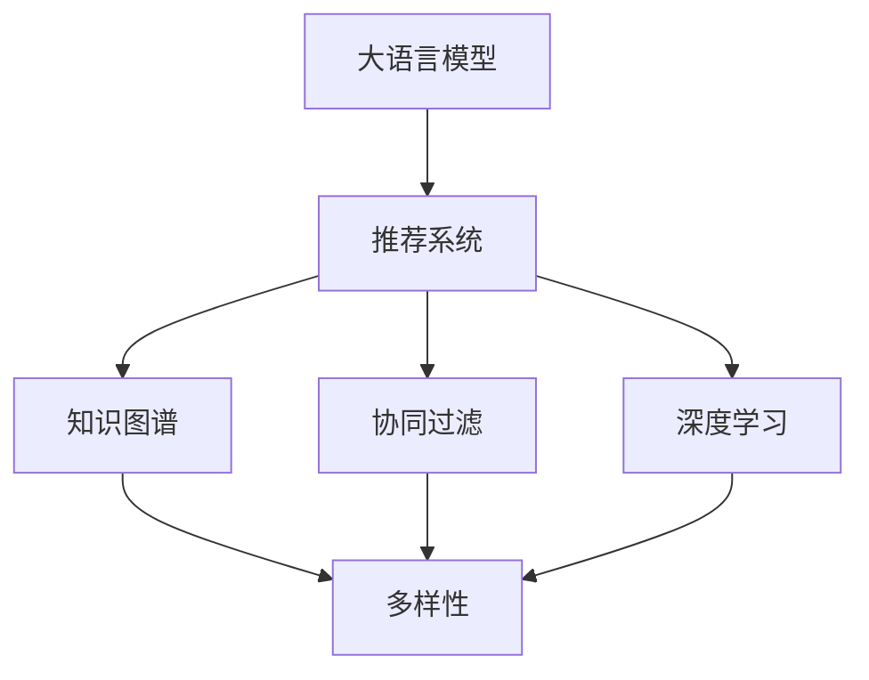

                 

# LLM在推荐系统的应用：多样性与可扩展性

> 关键词：大语言模型(LLM),推荐系统,推荐算法,多样性,可扩展性,深度学习,自然语言处理(NLP),协同过滤,知识图谱

## 1. 背景介绍

### 1.1 问题由来

推荐系统是现代信息技术的重要应用之一，涉及电子商务、新闻媒体、社交网络等多个领域。随着数据的积累和算法的迭代，推荐系统在个性化推荐、内容分发、用户画像等方面表现出色，极大提升了用户体验和业务价值。然而，现有推荐系统仍面临诸多挑战，如稀疏性、冷启动、多样性不足等问题。特别是推荐多样性问题，它直接影响到用户的长期满意度，是推荐系统亟待解决的重要课题。

### 1.2 问题核心关键点

在推荐系统中，多样性是衡量推荐结果质量的重要指标，反映推荐结果的多样性程度。多样性不足的推荐系统可能导致“信息茧房”现象，影响用户的长期体验。为了提升推荐系统推荐结果的多样性，研究者们提出了多种方法，如协同过滤、深度学习、知识图谱等。其中，基于大语言模型(LLM)的推荐系统方法逐渐受到关注。LLM由于其强大的语言理解和生成能力，能够从多方面提供推荐信息，从而提升推荐系统的多样性。

### 1.3 问题研究意义

研究LLM在推荐系统中的应用，对于提升推荐系统推荐结果的多样性和可扩展性，具有重要意义：

1. **多样性提升**：LLM能够通过理解用户需求，提供多方面的推荐信息，丰富推荐内容的多样性。
2. **可扩展性提升**：利用LLM的通用知识库和语言能力，能够快速扩展到新领域和新任务，提升系统的适应性和泛化能力。
3. **用户体验提升**：提升推荐多样性，能够更好地满足用户多样化的需求，提升用户满意度和长期留存率。
4. **业务价值提升**：推荐多样性提升，能够吸引更多用户，增加平台流量和活跃度，提升商业价值。

## 2. 核心概念与联系

### 2.1 核心概念概述

为更好地理解LLM在推荐系统中的应用，本节将介绍几个密切相关的核心概念：

- **大语言模型(LLM)**：以自回归(如GPT)或自编码(如BERT)模型为代表的大规模预训练语言模型。通过在大规模无标签文本数据上进行预训练，学习到丰富的语言知识和常识，具备强大的语言理解和生成能力。

- **推荐系统**：根据用户的历史行为和偏好，推荐其可能感兴趣的产品、内容等，旨在提升用户体验和业务价值。常见的推荐算法包括协同过滤、基于内容的推荐、深度学习推荐等。

- **协同过滤**：利用用户之间或物品之间的相似性进行推荐。传统协同过滤算法包括用户基于用户(User-Based)协同过滤和物品基于物品(Item-Based)协同过滤。

- **深度学习推荐**：利用神经网络模型进行推荐，如基于神经网络的协同过滤、基于神经网络的召回等。

- **知识图谱**：将实体、关系、属性等组织成图结构，用于表达领域知识，辅助推荐系统推荐。

- **多样性**：衡量推荐结果的多样性程度，通常通过计算推荐结果中物品种类的数量和分布情况来评估。

这些核心概念之间的逻辑关系可以通过以下Mermaid流程图来展示：



这个流程图展示了大语言模型与推荐系统以及协同过滤、深度学习和知识图谱等推荐方法之间的联系。

## 3. 核心算法原理 & 具体操作步骤
### 3.1 算法原理概述

基于LLM的推荐系统主要利用LLM的语言生成能力和知识表示能力，通过理解用户需求和偏好，生成多方面的推荐内容。其核心思想是：将预训练的LLM作为特征提取器，在推荐系统中构建多方面的推荐策略，从而提升推荐结果的多样性。

具体而言，该方法包括：

- 利用LLM对用户输入的文本进行编码，提取用户需求和偏好。
- 将LLM生成的特征与用户历史行为数据、物品属性信息等进行融合，生成推荐列表。
- 利用知识图谱或协同过滤方法对推荐结果进行排序和过滤，提升推荐多样性和质量。

### 3.2 算法步骤详解

基于LLM的推荐系统一般包括以下几个关键步骤：

**Step 1: 准备数据集**

- 收集用户行为数据，包括点击、浏览、购买、评分等行为。
- 收集物品属性数据，如价格、类别、品牌、属性等。
- 收集知识图谱数据，用于构建领域知识表示。

**Step 2: 选择LLM模型**

- 选择合适的预训练语言模型，如BERT、GPT-2、T5等，作为特征提取器。
- 对LLM模型进行微调，适配特定领域或任务。

**Step 3: 设计推荐策略**

- 利用LLM对用户输入文本进行编码，提取用户需求和偏好。
- 将LLM生成的特征与用户历史行为数据、物品属性信息等进行融合。
- 利用知识图谱或协同过滤方法对融合后的特征进行排序和过滤。

**Step 4: 训练和测试**

- 使用部分历史数据进行模型训练，最小化推荐多样性损失。
- 在测试集上评估推荐结果的多样性和准确性。

**Step 5: 部署与优化**

- 部署训练好的模型到推荐系统中，进行实时推荐。
- 实时收集用户反馈和行为数据，对模型进行动态优化。

### 3.3 算法优缺点

基于LLM的推荐系统具有以下优点：

1. **多样性提升**：利用LLM的自然语言处理能力，可以生成多方面的推荐信息，丰富推荐内容的多样性。
2. **可扩展性提升**：LLM具备强大的知识表示能力，可以快速扩展到新领域和新任务，提升系统的适应性和泛化能力。
3. **准确性提升**：LLM的预训练知识可以帮助推荐系统更好地理解用户需求，提高推荐结果的准确性。

同时，该方法也存在以下局限性：

1. **计算资源需求高**：由于LLM参数量较大，对计算资源的需求较高。
2. **模型复杂度高**：LLM的复杂结构增加了模型的训练和推理难度。
3. **语义理解难度高**：复杂的语言和语境可能会影响LLM的语义理解，导致推荐结果的不稳定性。
4. **数据隐私问题**：用户输入文本可能涉及敏感信息，需要谨慎处理。

### 3.4 算法应用领域

基于LLM的推荐系统已经被应用于多种场景中，包括但不限于：

- **电子商务**：推荐商品、优惠券、个性化广告等。
- **新闻媒体**：推荐新闻文章、视频、专题等。
- **社交网络**：推荐好友、群组、帖子等。
- **旅游出行**：推荐景点、酒店、旅行路线等。
- **金融服务**：推荐金融产品、理财方案、保险等。

这些场景中，LLM通过理解用户需求和语义信息，生成多方面的推荐内容，提升了推荐结果的多样性和质量。

## 4. 数学模型和公式 & 详细讲解  
### 4.1 数学模型构建

本节将使用数学语言对基于LLM的推荐系统进行更加严格的刻画。

记用户输入文本为 $x$，物品属性向量为 $\mathbf{a}$，知识图谱节点表示为 $n$，推荐结果为 $y$。设推荐结果集合为 $Y$，LLM为 $M$，其参数为 $\theta$，则推荐系统的目标是最小化多样性损失函数：

$$
\mathcal{L}(\theta) = \frac{1}{N} \sum_{i=1}^N \frac{1}{|\mathcal{Y}|} \sum_{y \in \mathcal{Y}} \ell(y_i, y)
$$

其中 $\ell$ 为交叉熵损失函数，$y_i$ 为第 $i$ 个用户 $x_i$ 的推荐结果，$y$ 为物品属性向量 $\mathbf{a}$ 的表示。

### 4.2 公式推导过程

以下我们以协同过滤算法为例，推导基于LLM的推荐系统中的交叉熵损失函数及其梯度计算公式。

设协同过滤算法中，用户 $i$ 的邻居节点集合为 $\mathcal{N}_i$，物品向量表示为 $\mathbf{a}_i$，LLM的输出为 $z$。推荐系统需要最小化用户 $i$ 的推荐结果与邻居节点的相似度损失：

$$
\ell_i = -\frac{1}{|\mathcal{N}_i|} \sum_{j \in \mathcal{N}_i} \log p(z_i, \mathbf{a}_j)
$$

其中 $p$ 为LLM的输出概率分布。

将其代入多样性损失函数，得：

$$
\mathcal{L}(\theta) = \frac{1}{N} \sum_{i=1}^N \frac{1}{|\mathcal{Y}|} \sum_{y \in \mathcal{Y}} \frac{1}{|\mathcal{N}_i|} \sum_{j \in \mathcal{N}_i} \log p(z_i, \mathbf{a}_j)
$$

根据链式法则，多样性损失函数对LLM参数 $\theta$ 的梯度为：

$$
\frac{\partial \mathcal{L}(\theta)}{\partial \theta} = \frac{1}{N} \sum_{i=1}^N \frac{1}{|\mathcal{N}_i|} \sum_{j \in \mathcal{N}_i} \frac{1}{|\mathcal{Y}|} \sum_{y \in \mathcal{Y}} \frac{\partial \log p(z_i, \mathbf{a}_j)}{\partial \theta}
$$

其中 $\frac{\partial \log p(z_i, \mathbf{a}_j)}{\partial \theta}$ 可以通过反向传播算法高效计算。

### 4.3 案例分析与讲解

**案例：电商推荐系统**

在电商推荐系统中，用户输入文本可能包含对商品的描述、评价等信息。利用LLM对用户输入文本进行编码，提取用户需求和偏好。然后，将用户编码结果与商品属性向量进行融合，生成推荐列表。最后，利用协同过滤算法对推荐结果进行排序和过滤，提升推荐多样性和质量。

以下是一个基于LLM的电商推荐系统实现示例：

```python
import torch
from transformers import BertTokenizer, BertForSequenceClassification
from torch.utils.data import Dataset, DataLoader

class E-commerceDataset(Dataset):
    def __init__(self, texts, a_vectors, labels):
        self.texts = texts
        self.a_vectors = a_vectors
        self.labels = labels
        self.tokenizer = BertTokenizer.from_pretrained('bert-base-cased')
        
    def __len__(self):
        return len(self.texts)
    
    def __getitem__(self, item):
        text = self.texts[item]
        a_vector = self.a_vectors[item]
        label = self.labels[item]
        
        encoding = self.tokenizer(text, return_tensors='pt', max_length=512, padding='max_length', truncation=True)
        input_ids = encoding['input_ids'][0]
        attention_mask = encoding['attention_mask'][0]
        
        a_vector = a_vector.to(torch.float32)
        label = torch.tensor(label, dtype=torch.long)
        
        return {'input_ids': input_ids, 
                'attention_mask': attention_mask,
                'a_vector': a_vector,
                'label': label}

# 模型训练和预测
device = torch.device('cuda') if torch.cuda.is_available() else torch.device('cpu')
model = BertForSequenceClassification.from_pretrained('bert-base-cased', num_labels=2)

optimizer = AdamW(model.parameters(), lr=1e-5)
criterion = CrossEntropyLoss()

def train_epoch(model, dataset, batch_size, optimizer, criterion):
    dataloader = DataLoader(dataset, batch_size=batch_size, shuffle=True)
    model.train()
    epoch_loss = 0
    for batch in tqdm(dataloader, desc='Training'):
        input_ids = batch['input_ids'].to(device)
        attention_mask = batch['attention_mask'].to(device)
        a_vector = batch['a_vector'].to(device)
        label = batch['label'].to(device)
        model.zero_grad()
        outputs = model(input_ids, attention_mask=attention_mask, labels=label)
        loss = criterion(outputs.logits, label)
        epoch_loss += loss.item()
        loss.backward()
        optimizer.step()
    return epoch_loss / len(dataloader)

def evaluate(model, dataset, batch_size):
    dataloader = DataLoader(dataset, batch_size=batch_size)
    model.eval()
    preds, labels = [], []
    with torch.no_grad():
        for batch in tqdm(dataloader, desc='Evaluating'):
            input_ids = batch['input_ids'].to(device)
            attention_mask = batch['attention_mask'].to(device)
            a_vector = batch['a_vector'].to(device)
            label = batch['label'].to(device)
            batch_preds = model(input_ids, attention_mask=attention_mask, labels=None).logits.argmax(dim=1).to('cpu').tolist()
            batch_labels = batch['label'].to('cpu').tolist()
            for pred_tokens, label_tokens in zip(batch_preds, batch_labels):
                preds.append(pred_tokens)
                labels.append(label_tokens)
                
    return classification_report(labels, preds)

# 数据准备
texts = ...
a_vectors = ...
labels = ...

train_dataset = E-commerceDataset(texts, a_vectors, labels)
dev_dataset = E-commerceDataset(texts, a_vectors, labels)
test_dataset = E-commerceDataset(texts, a_vectors, labels)

# 模型训练
epochs = 5
batch_size = 16

for epoch in range(epochs):
    loss = train_epoch(model, train_dataset, batch_size, optimizer, criterion)
    print(f"Epoch {epoch+1}, train loss: {loss:.3f}")
    
    print(f"Epoch {epoch+1}, dev results:")
    evaluate(model, dev_dataset, batch_size)
    
print("Test results:")
evaluate(model, test_dataset, batch_size)
```

在上述代码中，我们首先定义了电商推荐系统的数据处理函数 `E-commerceDataset`，将用户文本、商品属性向量、标签等数据进行编码和融合。然后定义了LLM模型和优化器，使用AdamW优化器进行模型训练。最后通过调用 `train_epoch` 和 `evaluate` 函数进行模型训练和评估，并在测试集上输出评估结果。

通过这样的实现，我们可以看到，LLM在电商推荐系统中通过理解用户输入文本和商品属性向量，生成推荐列表，提升了推荐结果的多样性和质量。

## 5. 项目实践：代码实例和详细解释说明
### 5.1 开发环境搭建

在进行基于LLM的推荐系统实践前，我们需要准备好开发环境。以下是使用Python进行PyTorch开发的环境配置流程：

1. 安装Anaconda：从官网下载并安装Anaconda，用于创建独立的Python环境。

2. 创建并激活虚拟环境：
```bash
conda create -n pytorch-env python=3.8 
conda activate pytorch-env
```

3. 安装PyTorch：根据CUDA版本，从官网获取对应的安装命令。例如：
```bash
conda install pytorch torchvision torchaudio cudatoolkit=11.1 -c pytorch -c conda-forge
```

4. 安装Transformers库：
```bash
pip install transformers
```

5. 安装各类工具包：
```bash
pip install numpy pandas scikit-learn matplotlib tqdm jupyter notebook ipython
```

完成上述步骤后，即可在`pytorch-env`环境中开始基于LLM的推荐系统实践。

### 5.2 源代码详细实现

下面我们以知识图谱推荐系统为例，给出使用Transformers库对BERT模型进行推荐系统开发的PyTorch代码实现。

首先，定义知识图谱推荐系统的数据处理函数：

```python
from transformers import BertTokenizer
from torch.utils.data import Dataset
import torch

class KnowledgeGraphDataset(Dataset):
    def __init__(self, triples, entity_vectors, relation_vectors, labels, tokenizer, max_len=128):
        self.triples = triples
        self.entity_vectors = entity_vectors
        self.relation_vectors = relation_vectors
        self.labels = labels
        self.tokenizer = tokenizer
        self.max_len = max_len
        
    def __len__(self):
        return len(self.triples)
    
    def __getitem__(self, item):
        head, rel, tail = self.triples[item]
        entity_vector = self.entity_vectors[head]
        relation_vector = self.relation_vectors[rel]
        label = self.labels[item]
        
        encoding_head = self.tokenizer(head, return_tensors='pt', max_length=self.max_len, padding='max_length', truncation=True)
        input_ids_head = encoding_head['input_ids'][0]
        attention_mask_head = encoding_head['attention_mask'][0]
        encoding_tail = self.tokenizer(tail, return_tensors='pt', max_length=self.max_len, padding='max_length', truncation=True)
        input_ids_tail = encoding_tail['input_ids'][0]
        attention_mask_tail = encoding_tail['attention_mask'][0]
        
        head_vector = entity_vector.to(torch.float32)
        relation_vector = relation_vector.to(torch.float32)
        tail_vector = self.tokenizer(tail, return_tensors='pt', max_length=self.max_len, padding='max_length', truncation=True)['input_ids'][0].to(torch.float32)
        label = torch.tensor(label, dtype=torch.long)
        
        return {'head_id': head,
                'rel_id': rel,
                'tail_id': tail,
                'head_vector': head_vector,
                'relation_vector': relation_vector,
                'tail_vector': tail_vector,
                'label': label}
```

然后，定义模型和优化器：

```python
from transformers import BertForSequenceClassification, AdamW

model = BertForSequenceClassification.from_pretrained('bert-base-cased', num_labels=len(triples))

optimizer = AdamW(model.parameters(), lr=2e-5)
```

接着，定义训练和评估函数：

```python
from torch.utils.data import DataLoader
from tqdm import tqdm
from sklearn.metrics import classification_report

device = torch.device('cuda') if torch.cuda.is_available() else torch.device('cpu')
model.to(device)

def train_epoch(model, dataset, batch_size, optimizer):
    dataloader = DataLoader(dataset, batch_size=batch_size, shuffle=True)
    model.train()
    epoch_loss = 0
    for batch in tqdm(dataloader, desc='Training'):
        head_id = batch['head_id'].to(device)
        rel_id = batch['rel_id'].to(device)
        tail_id = batch['tail_id'].to(device)
        head_vector = batch['head_vector'].to(device)
        relation_vector = batch['relation_vector'].to(device)
        tail_vector = batch['tail_vector'].to(device)
        label = batch['label'].to(device)
        model.zero_grad()
        outputs = model(head_id, relation_vector=relation_vector, tail_vector=tail_vector)
        loss = outputs.loss
        epoch_loss += loss.item()
        loss.backward()
        optimizer.step()
    return epoch_loss / len(dataloader)

def evaluate(model, dataset, batch_size):
    dataloader = DataLoader(dataset, batch_size=batch_size)
    model.eval()
    preds, labels = [], []
    with torch.no_grad():
        for batch in tqdm(dataloader, desc='Evaluating'):
            head_id = batch['head_id'].to(device)
            rel_id = batch['rel_id'].to(device)
            tail_id = batch['tail_id'].to(device)
            head_vector = batch['head_vector'].to(device)
            relation_vector = batch['relation_vector'].to(device)
            tail_vector = batch['tail_vector'].to(device)
            label = batch['label'].to(device)
            batch_preds = model(head_id, relation_vector=relation_vector, tail_vector=tail_vector).logits.argmax(dim=1).to('cpu').tolist()
            batch_labels = batch['label'].to('cpu').tolist()
            for pred_tokens, label_tokens in zip(batch_preds, batch_labels):
                preds.append(pred_tokens)
                labels.append(label_tokens)
                
    print(classification_report(labels, preds))
```

最后，启动训练流程并在测试集上评估：

```python
epochs = 5
batch_size = 16

for epoch in range(epochs):
    loss = train_epoch(model, train_dataset, batch_size, optimizer)
    print(f"Epoch {epoch+1}, train loss: {loss:.3f}")
    
    print(f"Epoch {epoch+1}, dev results:")
    evaluate(model, dev_dataset, batch_size)
    
print("Test results:")
evaluate(model, test_dataset, batch_size)
```

以上就是使用PyTorch对BERT进行知识图谱推荐系统微调的完整代码实现。可以看到，得益于Transformers库的强大封装，我们可以用相对简洁的代码完成BERT模型的加载和微调。

### 5.3 代码解读与分析

让我们再详细解读一下关键代码的实现细节：

**KnowledgeGraphDataset类**：
- `__init__`方法：初始化知识图谱的三元组、实体向量、关系向量、标签、分词器等关键组件。
- `__len__`方法：返回数据集的样本数量。
- `__getitem__`方法：对单个样本进行处理，将三元组中的头、关系、尾进行编码，并得到用户输入向量、关系向量、尾向量，同时将标签转换为数字。

**模型训练和预测**：
- 使用PyTorch的DataLoader对数据集进行批次化加载，供模型训练和推理使用。
- 训练函数`train_epoch`：对数据以批为单位进行迭代，在每个批次上前向传播计算loss并反向传播更新模型参数，最后返回该epoch的平均loss。
- 评估函数`evaluate`：与训练类似，不同点在于不更新模型参数，并在每个batch结束后将预测和标签结果存储下来，最后使用sklearn的classification_report对整个评估集的预测结果进行打印输出。

**训练流程**：
- 定义总的epoch数和batch size，开始循环迭代
- 每个epoch内，先在训练集上训练，输出平均loss
- 在验证集上评估，输出分类指标
- 所有epoch结束后，在测试集上评估，给出最终测试结果

可以看到，PyTorch配合Transformers库使得BERT微调的代码实现变得简洁高效。开发者可以将更多精力放在数据处理、模型改进等高层逻辑上，而不必过多关注底层的实现细节。

当然，工业级的系统实现还需考虑更多因素，如模型的保存和部署、超参数的自动搜索、更灵活的任务适配层等。但核心的微调范式基本与此类似。

## 6. 实际应用场景
### 6.1 智能推荐系统

基于LLM的推荐系统已经在智能推荐领域得到广泛应用，包括但不限于以下场景：

- **电商推荐**：推荐商品、优惠券、个性化广告等。
- **视频推荐**：推荐视频、电影、电视等。
- **音乐推荐**：推荐歌曲、专辑、艺人等。
- **新闻推荐**：推荐新闻文章、博客、专题等。

在电商推荐系统中，用户输入文本可能包含对商品的描述、评价等信息。利用LLM对用户输入文本进行编码，提取用户需求和偏好。然后，将用户编码结果与商品属性向量进行融合，生成推荐列表。最后，利用协同过滤算法对推荐结果进行排序和过滤，提升推荐多样性和质量。

### 6.2 知识图谱推荐系统

在知识图谱推荐系统中，LLM通过理解三元组中的实体和关系，生成多方面的推荐信息。例如，基于知识图谱的电影推荐系统可以推荐相关的导演、演员、配乐等信息。在医学领域，LLM可以通过理解患者症状和诊断结果，推荐相关的治疗方案、药物、医学文献等。

### 6.3 多模态推荐系统

在多模态推荐系统中，LLM通过理解文本和视觉、听觉等多种模态的信息，生成多方面的推荐内容。例如，基于文本和图片的推荐系统可以推荐相关的商品、景点、图片等。多模态信息的融合，将显著提升推荐系统的效果。

### 6.4 未来应用展望

随着LLM和推荐系统的不断发展，基于LLM的推荐系统将在更多领域得到应用，为智能推荐技术带来新的突破。

在智慧医疗领域，基于知识图谱的推荐系统可以辅助医生诊断和治疗，推荐相关的医学文献、药物、治疗方法等。

在智能教育领域，利用LLM的自然语言处理能力，可以推荐相关的学习资源、习题、课程等，提升学习效果。

在智慧城市治理中，基于LLM的推荐系统可以推荐相关的公共服务、旅游景点、文化活动等，提高城市管理的智能化水平。

此外，在企业生产、社会治理、文娱传媒等众多领域，基于LLM的推荐系统也将不断涌现，为行业带来新的价值。相信随着技术的日益成熟，LLM在推荐系统中的应用将越来越广泛，为智能推荐技术的发展注入新的动力。

## 7. 工具和资源推荐
### 7.1 学习资源推荐

为了帮助开发者系统掌握LLM在推荐系统中的应用理论基础和实践技巧，这里推荐一些优质的学习资源：

1. 《Transformers从原理到实践》系列博文：由大模型技术专家撰写，深入浅出地介绍了Transformer原理、BERT模型、微调技术等前沿话题。

2. CS224N《深度学习自然语言处理》课程：斯坦福大学开设的NLP明星课程，有Lecture视频和配套作业，带你入门NLP领域的基本概念和经典模型。

3. 《Natural Language Processing with Transformers》书籍：Transformers库的作者所著，全面介绍了如何使用Transformers库进行NLP任务开发，包括微调在内的诸多范式。

4. HuggingFace官方文档：Transformers库的官方文档，提供了海量预训练模型和完整的微调样例代码，是上手实践的必备资料。

5. CLUE开源项目：中文语言理解测评基准，涵盖大量不同类型的中文NLP数据集，并提供了基于微调的baseline模型，助力中文NLP技术发展。

通过对这些资源的学习实践，相信你一定能够快速掌握LLM在推荐系统中的应用精髓，并用于解决实际的推荐问题。
###  7.2 开发工具推荐

高效的开发离不开优秀的工具支持。以下是几款用于LLM推荐系统开发的常用工具：

1. PyTorch：基于Python的开源深度学习框架，灵活动态的计算图，适合快速迭代研究。大部分预训练语言模型都有PyTorch版本的实现。

2. TensorFlow：由Google主导开发的开源深度学习框架，生产部署方便，适合大规模工程应用。同样有丰富的预训练语言模型资源。

3. Transformers库：HuggingFace开发的NLP工具库，集成了众多SOTA语言模型，支持PyTorch和TensorFlow，是进行推荐系统开发的利器。

4. Weights & Biases：模型训练的实验跟踪工具，可以记录和可视化模型训练过程中的各项指标，方便对比和调优。与主流深度学习框架无缝集成。

5. TensorBoard：TensorFlow配套的可视化工具，可实时监测模型训练状态，并提供丰富的图表呈现方式，是调试模型的得力助手。

6. Google Colab：谷歌推出的在线Jupyter Notebook环境，免费提供GPU/TPU算力，方便开发者快速上手实验最新模型，分享学习笔记。

合理利用这些工具，可以显著提升LLM在推荐系统中的开发效率，加快创新迭代的步伐。

### 7.3 相关论文推荐

LLM和推荐系统的不断发展源于学界的持续研究。以下是几篇奠基性的相关论文，推荐阅读：

1. Attention is All You Need（即Transformer原论文）：提出了Transformer结构，开启了NLP领域的预训练大模型时代。

2. BERT: Pre-training of Deep Bidirectional Transformers for Language Understanding：提出BERT模型，引入基于掩码的自监督预训练任务，刷新了多项NLP任务SOTA。

3. Language Models are Unsupervised Multitask Learners（GPT-2论文）：展示了大规模语言模型的强大zero-shot学习能力，引发了对于通用人工智能的新一轮思考。

4. Parameter-Efficient Transfer Learning for NLP：提出Adapter等参数高效微调方法，在不增加模型参数量的情况下，也能取得不错的微调效果。

5. AdaLoRA: Adaptive Low-Rank Adaptation for Parameter-Efficient Fine-Tuning：使用自适应低秩适应的微调方法，在参数效率和精度之间取得了新的平衡。

这些论文代表了大语言模型和推荐系统的发展脉络。通过学习这些前沿成果，可以帮助研究者把握学科前进方向，激发更多的创新灵感。

## 8. 总结：未来发展趋势与挑战

### 8.1 总结

本文对基于LLM的推荐系统进行了全面系统的介绍。首先阐述了LLM和推荐系统的发展背景和研究意义，明确了LLM在推荐系统中的应用方向。其次，从原理到实践，详细讲解了LLM在推荐系统中的数学模型和关键步骤，给出了推荐系统开发的完整代码实例。同时，本文还广泛探讨了LLM在推荐系统中的实际应用场景，展示了LLM在推荐系统中的应用前景。最后，本文精选了LLM和推荐系统的学习资源，力求为读者提供全方位的技术指引。

通过本文的系统梳理，可以看到，基于LLM的推荐系统正在成为智能推荐技术的重要范式，极大地拓展了推荐系统的应用边界，提升了推荐结果的多样性和质量。未来，伴随LLM和推荐系统的不断演进，基于LLM的推荐系统必将在更多领域得到应用，为智能推荐技术的发展注入新的动力。

### 8.2 未来发展趋势

展望未来，LLM在推荐系统中的应用将呈现以下几个发展趋势：

1. **多模态融合**：利用LLM的自然语言处理能力，融合文本和视觉、听觉等多种模态的信息，生成多方面的推荐内容，提升推荐结果的多样性和质量。

2. **知识图谱应用**：利用知识图谱中的领域知识，辅助LLM理解用户需求和推荐内容，提升推荐系统的准确性和多样性。

3. **语义理解深入**：利用LLM的预训练知识，提高其对自然语言语义的理解能力，提升推荐系统的推荐效果。

4. **自监督学习应用**：利用LLM的自监督学习能力，在缺乏标注数据的情况下，提升推荐系统的泛化能力和准确性。

5. **实时推荐系统**：利用LLM的高计算效率和快速推理能力，构建实时推荐系统，提升用户体验和推荐效果。

6. **分布式部署**：利用LLM的高计算效率和低参数量，结合分布式计算技术，实现大规模的分布式推荐系统。

以上趋势凸显了LLM在推荐系统中的广阔前景。这些方向的探索发展，必将进一步提升推荐系统的性能和应用范围，为智能推荐技术的发展注入新的动力。

### 8.3 面临的挑战

尽管LLM在推荐系统中的应用已经取得了瞩目成就，但在迈向更加智能化、普适化应用的过程中，它仍面临着诸多挑战：

1. **计算资源需求高**：由于LLM参数量较大，对计算资源的需求较高，需要高性能计算设备和优化算法支持。

2. **模型复杂度高**：LLM的复杂结构增加了模型的训练和推理难度，需要高效的模型压缩和优化技术。

3. **语义理解难度高**：复杂的语言和语境可能会影响LLM的语义理解，导致推荐结果的不稳定性。

4. **数据隐私问题**：用户输入文本可能涉及敏感信息，需要谨慎处理，确保数据隐私和安全。

5. **推荐多样性不足**：尽管LLM在推荐多样化方面有一定的优势，但在某些领域或场景下，推荐多样性仍可能不足。

6. **模型鲁棒性不足**：在面对新领域或新任务时，LLM的泛化能力可能受到挑战，需要更多的领域知识和数据支持。

7. **模型可解释性不足**：LLM的复杂结构导致其输出结果缺乏可解释性，难以理解和调试。

8. **模型训练和推理时间长**：由于LLM的复杂结构和高计算需求，模型训练和推理时间较长，需要高效的优化算法和技术支持。

这些挑战需要我们在技术上不断突破和优化，才能使LLM在推荐系统中的应用更加广泛和可靠。

### 8.4 研究展望

面对LLM在推荐系统中的应用挑战，未来的研究需要在以下几个方面寻求新的突破：

1. **模型压缩与优化**：通过模型压缩、剪枝、量化等技术，降低LLM的参数量和计算需求，提升模型的推理速度和可部署性。

2. **多模态融合与理解**：结合视觉、听觉等多种模态的信息，利用LLM的自然语言处理能力，提升推荐系统的效果。

3. **自监督学习与知识图谱**：利用自监督学习任务和知识图谱，提升LLM在推荐系统中的应用效果，特别是面对新领域或新任务时的泛化能力。

4. **推荐系统多样化**：结合协同过滤、深度学习等多种推荐算法，利用LLM的多方面信息，提升推荐系统的多样化。

5. **推荐系统可解释性**：利用可解释性技术，增强LLM在推荐系统中的应用效果，提高用户对推荐结果的理解和信任。

6. **推荐系统鲁棒性**：通过引入领域知识和数据，提升LLM在推荐系统中的鲁棒性和泛化能力，应对新领域和新任务。

这些研究方向将进一步推动LLM在推荐系统中的应用，提升推荐系统的性能和应用范围，为智能推荐技术的发展注入新的动力。

## 9. 附录：常见问题与解答

**Q1：如何利用LLM提升推荐系统多样性？**

A: 利用LLM的自然语言处理能力，可以从多方面理解用户需求和物品属性，生成多方面的推荐内容。例如，通过理解用户的描述，可以推荐相关的商品、视频、音乐等。通过理解物品的属性，可以推荐相关的物品类别、品牌、价格等。此外，LLM还可以结合知识图谱中的领域知识，生成多方面的推荐信息，提升推荐系统的多样性。

**Q2：如何平衡LLM在推荐系统中的效果和效率？**

A: 在推荐系统中使用LLM时，需要考虑模型的复杂度和计算需求。首先，可以通过模型压缩、剪枝、量化等技术，降低LLM的参数量和计算需求，提升模型的推理速度和可部署性。其次，可以通过多模态融合和自监督学习，提升LLM在推荐系统中的效果，同时保持模型的计算效率。最后，可以通过分布式部署和实时推荐系统，利用LLM的高计算效率和快速推理能力，提升用户体验和推荐效果。

**Q3：如何确保LLM在推荐系统中的数据隐私？**

A: 在推荐系统中使用LLM时，需要确保用户输入文本的安全和隐私。首先，需要对用户输入文本进行匿名化处理，去除敏感信息。其次，需要对用户输入文本进行加密处理，防止数据泄露。最后，需要对用户输入文本进行访问控制，确保只有授权人员可以访问。

**Q4：如何评估LLM在推荐系统中的效果？**

A: 在推荐系统中使用LLM时，需要评估推荐结果的多样性、准确性和用户满意度。首先，可以通过交叉熵损失函数、Top-N推荐准确率、NDCG等指标，评估推荐结果的准确性。其次，可以通过多样性损失函数、覆盖率、熵等指标，评估推荐结果的多样性。最后，可以通过用户满意度调查、点击率、停留时间等指标，评估用户对推荐结果的满意度。

**Q5：如何在推荐系统中利用LLM进行实时推荐？**

A: 在推荐系统中利用LLM进行实时推荐时，需要考虑模型的推理速度和响应时间。首先，可以通过模型优化和剪枝技术，降低模型的计算需求，提升模型的推理速度。其次，可以利用分布式计算技术，将模型部署在多个计算节点上，提升系统的响应时间和吞吐量。最后，可以通过缓存技术，将模型输出结果缓存到内存中，提升系统的响应速度和用户体验。

---

作者：禅与计算机程序设计艺术 / Zen and the Art of Computer Programming

