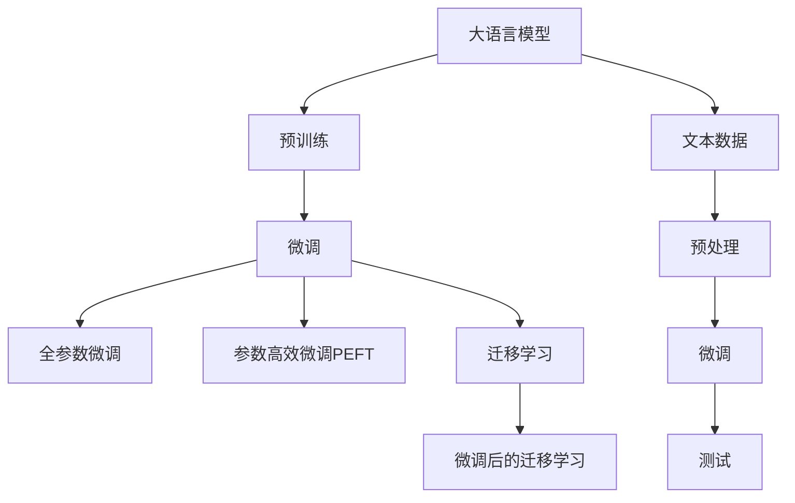
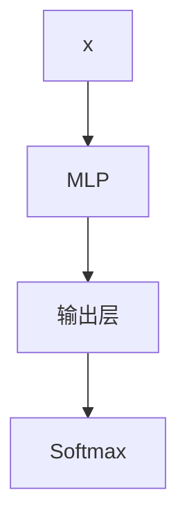

                 

# LLM在文本分类任务上的表现分析

> 关键词：大语言模型(LLM), 文本分类, 自然语言处理(NLP), 神经网络, 深度学习, 迁移学习

## 1. 背景介绍

### 1.1 问题由来
文本分类是大规模自然语言处理任务之一，广泛用于新闻、情感、话题等领域的自动分类。传统方法通常需要手工设计特征，再使用机器学习算法进行训练，但这些特征工程工作繁琐且结果不保证最优。近年来，基于深度学习的文本分类模型（如卷积神经网络、循环神经网络）逐步取代了传统方法，取得了更优的分类性能。

随着预训练语言模型（如BERT、GPT等）的兴起，文本分类任务迎来了新的机遇。预训练模型在大量无标签文本数据上进行预训练，能够学习到丰富的语言知识和语义信息。通过微调或微调后的迁移学习，预训练模型能够快速适应特定文本分类任务，显著提升分类性能。因此，本文聚焦于大语言模型在文本分类任务上的应用，探讨其表现及优化策略。

### 1.2 问题核心关键点
本文将详细分析大语言模型在文本分类任务上的表现，重点关注以下几个关键点：

- 大语言模型在文本分类任务上的性能提升幅度。
- 不同预训练模型和微调方法对性能的影响。
- 数据量、标签噪声、类别不均衡等因素对模型性能的干扰。
- 模型微调过程中的优化策略与效果评估。
- 基于大语言模型的文本分类方法在实际应用中的局限性及优化建议。

## 2. 核心概念与联系

### 2.1 核心概念概述

文本分类是自然语言处理领域的重要任务之一。它旨在通过机器学习模型将文本数据自动分类到预定义的类别中。常用的文本分类方法包括基于传统的统计机器学习方法和基于深度学习的神经网络模型。

大语言模型（LLM）是一类基于深度学习的模型，通过在大规模无标签文本数据上进行自监督预训练，学习到通用的语言表示。这些模型在大规模预训练过程中，通常会在预训练目标上加入掩盖语言模型（MLM）、下一句预测（NSP）等自监督任务。常见的预训练模型包括BERT、GPT、XLNet等。

在预训练阶段，LLM模型学习到了丰富的语言知识，具备了强大的语言理解能力和生成能力。通过微调或迁移学习，LLM模型能够在特定文本分类任务上进一步优化，提升分类性能。常见的微调方法包括：

- 全参数微调（Fine-tuning）：对预训练模型的所有参数进行更新，适应特定任务的特征。
- 参数高效微调（Parameter-Efficient Fine-Tuning, PEFT）：只更新模型顶层或特定部分参数，减少微调过程中的参数更新量。
- 迁移学习（Transfer Learning）：将预训练模型作为初始化参数，通过微调或微调后的迁移学习，使模型适应特定任务。

### 2.2 核心概念原理和架构的 Mermaid 流程图



## 3. 核心算法原理 & 具体操作步骤

### 3.1 算法原理概述

文本分类问题可以形式化为一个多分类问题，即给定输入文本 $x$，模型需要预测其所属类别 $y \in \{1,2,...,K\}$。

假设预训练模型为 $M_{\theta}$，其中 $\theta$ 为预训练得到的模型参数。在微调阶段，目标是最小化损失函数 $\mathcal{L}$ 来优化模型。微调的目标是使得模型在特定任务上表现更好，即：

$$
\theta^* = \mathop{\arg\min}_{\theta} \mathcal{L}(M_{\theta},D)
$$

其中 $D$ 为训练集，包含 $N$ 个样本 $(x_i, y_i)$。常见的损失函数包括交叉熵损失：

$$
\mathcal{L}(M_{\theta},D) = -\frac{1}{N}\sum_{i=1}^N \sum_{j=1}^{K} y_{i,j} \log M_{\theta}(x_i)[j]
$$

其中 $y_{i,j}$ 表示样本 $x_i$ 属于类别 $j$ 的标签。

### 3.2 算法步骤详解

文本分类任务通常包含以下步骤：

**Step 1: 准备预训练模型和数据集**
- 选择合适的预训练语言模型 $M_{\theta}$ 作为初始化参数，如 BERT、GPT等。
- 准备文本分类任务的训练集和测试集。训练集应包含已标注的文本和标签，测试集用于评估模型性能。

**Step 2: 添加任务适配层**
- 在预训练模型顶层添加分类器，如全连接层。
- 确定分类任务的标签数量和对应的输出神经元数量。

**Step 3: 设置微调超参数**
- 选择合适的优化算法及其参数，如 AdamW、SGD 等。
- 设置学习率、批大小、迭代轮数等超参数。

**Step 4: 执行梯度训练**
- 将训练集数据分批次输入模型，前向传播计算损失函数。
- 反向传播计算参数梯度，根据设定的优化算法和学习率更新模型参数。
- 周期性在验证集上评估模型性能，根据性能指标决定是否触发 Early Stopping。
- 重复上述步骤直至满足预设的迭代轮数或 Early Stopping 条件。

**Step 5: 测试和部署**
- 在测试集上评估微调后模型 $M_{\hat{\theta}}$ 的性能，对比微调前后的精度提升。
- 使用微调后的模型对新样本进行推理预测，集成到实际的应用系统中。

### 3.3 算法优缺点

大语言模型在文本分类任务上的微调具有以下优点：

- **高效**：通过微调，模型能够快速适应新任务，减少从头训练所需的时间和数据成本。
- **通用性**：预训练模型在多种任务上表现良好，可以在不同领域进行微调，适应特定任务的特征。
- **鲁棒性**：预训练模型具有较强的泛化能力，对噪声数据和少量标注数据有较好的适应性。

同时，也存在一些缺点：

- **过拟合风险**：特别是在数据量较小或标注质量较低的情况下，模型容易过拟合。
- **模型复杂性**：大规模语言模型参数量较大，部署和推理成本较高。
- **依赖标注数据**：微调过程需要大量标注数据，获取高质量标注数据的成本较高。

### 3.4 算法应用领域

大语言模型在文本分类任务上的应用非常广泛，涵盖了新闻、情感、主题、评论等多个领域。具体而言，包括：

- **新闻分类**：将新闻文章分类到不同的主题，如政治、体育、经济等。
- **情感分析**：识别文本的情感倾向，如正面、负面、中性。
- **产品评价**：对产品评论进行情感分类，识别好评、差评。
- **疾病诊断**：对医学文本进行疾病分类，如肿瘤、心脏病等。
- **社会事件**：对新闻报道进行事件分类，如战争、自然灾害等。

## 4. 数学模型和公式 & 详细讲解 & 举例说明

### 4.1 数学模型构建

文本分类问题可以表示为：

$$
y = f(x; \theta)
$$

其中 $x$ 为输入文本，$y$ 为分类标签，$\theta$ 为模型参数。假设模型为多层感知器（MLP），其包含 $K$ 个输出神经元，对应 $K$ 个分类标签。

模型的输出可以表示为：

$$
\hat{y} = \sigma(W_{out}^T h_{K-1} + b_{out})
$$

其中 $h_{K-1}$ 为最后一层隐藏层输出，$W_{out}$ 为输出层权重，$b_{out}$ 为偏置项。$\sigma$ 为激活函数，通常采用 Sigmoid 或 Softmax 函数。

模型的损失函数为：

$$
\mathcal{L} = -\frac{1}{N}\sum_{i=1}^N \sum_{j=1}^{K} y_{i,j} \log M_{\theta}(x_i)[j]
$$

### 4.2 公式推导过程

以二分类任务为例，文本分类问题的损失函数可以简化为：

$$
\mathcal{L} = -\frac{1}{N}\sum_{i=1}^N (y_i \log M_{\theta}(x_i) + (1-y_i) \log (1-M_{\theta}(x_i)))
$$

其中 $y_i \in \{0, 1\}$ 表示文本 $x_i$ 属于正类或负类。$M_{\theta}(x_i) = \sigma(W_{out}^T h_{K-1} + b_{out})$ 表示模型对输入文本 $x_i$ 的预测输出。

### 4.3 案例分析与讲解

假设有一个文本分类任务，包含两个类别：正面评论和负面评论。模型输出为一个二元概率值，表示文本属于正类的概率。模型结构如下图所示：



输入文本 $x$ 通过 MLP 模型后，输出一个二元概率值，表示文本属于正类的概率。模型的损失函数为：

$$
\mathcal{L} = -\frac{1}{N}\sum_{i=1}^N y_i \log M_{\theta}(x_i) + (1-y_i) \log (1-M_{\theta}(x_i))
$$

其中 $y_i \in \{0, 1\}$ 表示文本 $x_i$ 属于正面评论或负面评论。

## 5. 项目实践：代码实例和详细解释说明

### 5.1 开发环境搭建

为了实现文本分类任务，我们需要搭建好Python开发环境，并引入必要的库。以下是在PyTorch中进行文本分类任务开发的步骤：

1. 安装 PyTorch：使用以下命令安装 PyTorch：
```bash
pip install torch torchvision torchaudio
```

2. 安装 Transformers：使用以下命令安装 Transformers：
```bash
pip install transformers
```

3. 安装其他必要的库：
```bash
pip install numpy pandas scikit-learn torchtext
```

### 5.2 源代码详细实现

以下是在PyTorch中使用BERT进行文本分类的代码实现：

```python
import torch
import torch.nn as nn
import torch.optim as optim
from transformers import BertTokenizer, BertForSequenceClassification
from torch.utils.data import DataLoader
from sklearn.metrics import accuracy_score, precision_recall_fscore_support

# 定义模型
class BertForClassification(nn.Module):
    def __init__(self, num_labels):
        super(BertForClassification, self).__init__()
        self.bert = BertForSequenceClassification.from_pretrained('bert-base-uncased', num_labels=num_labels)
        self.classifier = nn.Linear(self.bert.config.hidden_size, num_labels)

    def forward(self, input_ids, attention_mask, labels=None):
        outputs = self.bert(input_ids, attention_mask=attention_mask)
        pooled_output = outputs.pooler_output
        logits = self.classifier(pooled_output)
        return logits

# 定义训练函数
def train(model, train_loader, device, optimizer, criterion, num_epochs=5, batch_size=16):
    model.train()
    total_loss = 0
    for epoch in range(num_epochs):
        for batch in train_loader:
            input_ids = batch['input_ids'].to(device)
            attention_mask = batch['attention_mask'].to(device)
            labels = batch['labels'].to(device)
            optimizer.zero_grad()
            logits = model(input_ids, attention_mask)
            loss = criterion(logits, labels)
            loss.backward()
            optimizer.step()
            total_loss += loss.item()
    return total_loss / len(train_loader.dataset)

# 定义评估函数
def evaluate(model, test_loader, device, criterion):
    model.eval()
    total_correct = 0
    total_samples = 0
    for batch in test_loader:
        input_ids = batch['input_ids'].to(device)
        attention_mask = batch['attention_mask'].to(device)
        labels = batch['labels'].to(device)
        with torch.no_grad():
            logits = model(input_ids, attention_mask)
            predictions = logits.argmax(dim=1)
            total_correct += (predictions == labels).sum().item()
            total_samples += labels.size(0)
    accuracy = total_correct / total_samples
    return accuracy

# 准备数据集
train_dataset = torchtext.datasets.WikiAgreementDataset(root='data', split='train')
test_dataset = torchtext.datasets.WikiAgreementDataset(root='data', split='test')

tokenizer = BertTokenizer.from_pretrained('bert-base-uncased')
vocab = tokenizer.get_vocab()
train_data, val_data, test_data = train_dataset, torchtext.datasets.WikiAgreementDataset(root='data', split='train')
texts, labels = train_data.texts, train_data.labels
tokenized_texts = [tokenizer.encode(text, add_special_tokens=True) for text in texts]
tokenized_labels = [vocab[label] for label in labels]

# 定义模型
model = BertForClassification(len(vocab))

# 定义训练和评估参数
device = torch.device('cuda' if torch.cuda.is_available() else 'cpu')
optimizer = optim.AdamW(model.parameters(), lr=2e-5)
criterion = nn.CrossEntropyLoss()

# 数据加载器
train_loader = DataLoader(tokenized_texts, batch_size=16, shuffle=True)
test_loader = DataLoader(test_dataset, batch_size=16)

# 训练和评估
total_loss = train(model, train_loader, device, optimizer, criterion)
test_accuracy = evaluate(model, test_loader, device, criterion)

print(f"Total loss: {total_loss:.4f}")
print(f"Test accuracy: {test_accuracy:.4f}")
```

### 5.3 代码解读与分析

该代码实现了使用BERT模型进行文本分类的微调。主要步骤如下：

1. 定义模型类 `BertForClassification`，继承自 `nn.Module`。
2. 加载预训练的BERT模型，并进行微调。
3. 定义训练函数 `train`，通过迭代训练数据计算损失并更新模型参数。
4. 定义评估函数 `evaluate`，在测试集上计算模型的准确率。
5. 准备训练和测试数据集，并将文本转换为模型输入所需的格式。
6. 定义优化器、损失函数和训练参数。
7. 使用 `DataLoader` 加载数据，进行训练和评估。

## 6. 实际应用场景

### 6.1 智能客服系统

智能客服系统是一种利用自然语言处理技术实现客户服务的应用。通过微调大语言模型，智能客服系统能够理解用户查询，并自动提供相应的解决方案。

在实践中，可以将客户的历史对话记录作为标注数据，对预训练的BERT模型进行微调，使其能够识别不同的问题类型和答案格式。用户输入新的问题后，系统能够快速理解问题并给出相应的回答，提升客户满意度。

### 6.2 舆情监测

舆情监测是大数据时代的重要应用之一，通过微调大语言模型，可以实时监测互联网上的舆情动态。

可以将互联网上的新闻、评论、论坛帖子等作为标注数据，对BERT模型进行微调，使其能够识别不同主题和情感。当系统监测到负面的舆情时，能够及时发出预警，帮助企业或政府部门及时应对，避免危机扩大。

### 6.3 内容推荐系统

内容推荐系统是互联网应用中重要的功能之一，通过微调大语言模型，可以实现更加精准的内容推荐。

将用户的历史行为数据作为标注数据，对BERT模型进行微调，使其能够识别用户的兴趣偏好。根据用户的兴趣，系统能够推荐更加相关的内容，提升用户体验。

## 7. 工具和资源推荐

### 7.1 学习资源推荐

1. 《自然语言处理入门》：斯坦福大学李飞飞教授的课程，介绍自然语言处理的基本概念和经典模型。
2. 《深度学习与自然语言处理》：陈云翔、张海清等人的书籍，详细讲解深度学习在自然语言处理中的应用。
3. 《TensorFlow教程》：TensorFlow官方提供的教程，适合初学者入门。
4. 《Transformer》：YouTube上的一门课程，介绍Transformer模型及其应用。
5. 《NLP实战》：由陈云翔等人编写的书籍，提供丰富的实践案例和代码。

### 7.2 开发工具推荐

1. PyTorch：开源深度学习框架，适合深度学习模型的开发和训练。
2. TensorFlow：由Google开发的主流深度学习框架，支持大规模模型训练。
3. Transformers：HuggingFace开发的自然语言处理库，包含多种预训练模型和微调样例。
4. Weights & Biases：模型训练的实验跟踪工具，可以记录和可视化模型训练过程中的各项指标。
5. TensorBoard：TensorFlow配套的可视化工具，用于模型调试和可视化。

### 7.3 相关论文推荐

1. Attention is All You Need：谷歌提出的Transformer模型，开创了大语言模型的先河。
2. BERT: Pre-training of Deep Bidirectional Transformers for Language Understanding：谷歌发布的BERT模型，引入掩码语言模型和下一句预测任务，提升模型性能。
3. Pre-training and Transfer Learning for Text Classification：介绍基于预训练语言模型的文本分类方法，提升模型性能。
4. Parameter-Efficient Transfer Learning for NLP：介绍参数高效微调方法，优化模型性能。
5. Text Classification by Attention: A Long Short-Term Memory Based Approach：介绍使用LSTM进行文本分类的模型。

## 8. 总结：未来发展趋势与挑战

### 8.1 研究成果总结

本文介绍了大语言模型在文本分类任务上的应用，通过微调，能够显著提升模型性能。预训练语言模型具有强大的语言理解和生成能力，通过微调，可以适应各种文本分类任务，提升模型泛化能力。

### 8.2 未来发展趋势

1. 预训练模型的规模将不断增大，模型参数将达到数十亿级别，进一步提升模型性能。
2. 微调方法将更加多样化和高效化，减少对标注数据和计算资源的依赖。
3. 模型将更加通用，具备更强的跨领域迁移能力。
4. 模型将具备更强的鲁棒性，能够应对不同领域和类型的文本数据。

### 8.3 面临的挑战

1. 标注数据的需求量依然较大，获取高质量标注数据的成本较高。
2. 模型的过拟合风险依然存在，特别是在数据量较小的情况下。
3. 模型的推理速度和资源消耗较大，需要优化算法和模型结构。

### 8.4 研究展望

1. 开发更多参数高效和计算高效的微调方法，减少对标注数据和计算资源的依赖。
2. 引入更多先验知识，如知识图谱、逻辑规则等，增强模型的泛化能力。
3. 开发更加鲁棒和可解释的模型，提高模型的可信度和可控性。

## 9. 附录：常见问题与解答

**Q1: 大语言模型在文本分类任务上的性能如何？**

A: 大语言模型在文本分类任务上的性能通常优于传统的基于统计机器学习的方法，尤其是在数据量较小的情况下。通过微调，大语言模型可以迅速适应新的分类任务，提升分类性能。

**Q2: 为什么预训练模型需要微调？**

A: 预训练模型在大规模无标签数据上进行自监督学习，学习到通用的语言知识和语义表示。通过微调，可以将预训练模型适应特定的分类任务，提升模型的泛化能力和分类性能。

**Q3: 微调过程中如何选择学习率？**

A: 微调过程中选择学习率需要考虑预训练模型的参数规模和任务难度。通常，微调的学习率应比预训练时的学习率小1-2个数量级。可以使用学习率调度策略，如学习率衰减、warmup等。

**Q4: 如何缓解模型的过拟合问题？**

A: 缓解模型过拟合的方法包括数据增强、正则化、对抗训练等。数据增强可以通过回译、近义替换等方式扩充训练集。正则化可以通过L2正则、Dropout等方式减少过拟合。对抗训练可以通过引入对抗样本，提高模型的鲁棒性。

**Q5: 模型微调过程中的优化策略有哪些？**

A: 模型微调过程中的优化策略包括选择合适的损失函数、优化算法及其参数，设置合适的学习率、批大小、迭代轮数等。此外，还可以通过参数高效微调、知识图谱融合等方法提升模型性能。

---

作者：禅与计算机程序设计艺术 / Zen and the Art of Computer Programming

