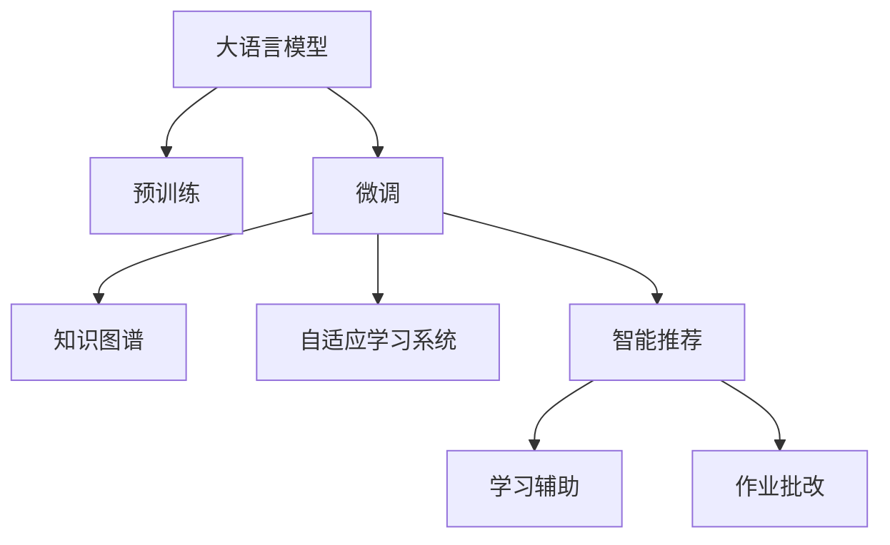

                 

# LLM在智能个性化学习系统中的应用探索

## 1. 背景介绍

### 1.1 问题由来
在教育领域，个性化学习已经成为教育技术的重要发展方向。传统的教育方式往往采用“一刀切”的教学模式，难以满足不同学生的多样化学习需求。而个性化学习则通过对学习者的行为数据、学习风格等进行建模，提供适应每个学习者的定制化学习路径和内容，从而显著提升学习效果和教育质量。

近年来，随着人工智能技术的不断进步，特别是大语言模型(LLM)的问世，为个性化学习系统的构建提供了新的思路和方法。通过使用LLM进行智能推荐、学习辅助、作业批改等功能，可以实现更加高效、个性化、智能化的学习体验。

### 1.2 问题核心关键点
基于LLM的个性化学习系统，其核心在于利用语言模型的强大语言理解和生成能力，结合学生的学习行为数据，为其提供个性化的学习资源推荐和互动式学习辅助。具体来说，可以通过以下几个关键步骤实现：

1. 收集学生的学习行为数据，如点击、浏览、参与讨论等。
2. 使用LLM对学生的学习轨迹进行建模，预测其后续的学习兴趣和需求。
3. 根据预测结果，为学生提供个性化的学习资源推荐。
4. 利用LLM生成适合学生的学习辅助材料，如习题、解析、知识图谱等。
5. 对学生的作业进行智能批改，并给出详细的解析和建议。

这些步骤可以显著提升个性化学习的精准度和效率，帮助学生更好地掌握知识，提高学习成效。

### 1.3 问题研究意义
开发基于LLM的智能个性化学习系统，对于推动教育公平、提升教育质量、促进知识普及具有重要意义：

1. 降低教育成本。利用AI技术自动生成学习资源，减少人力成本，使得优质教育资源能够覆盖更多学生。
2. 提升学习效果。通过个性化推荐和辅助，适应每个学生的学习特点，提高学习效率和成就感。
3. 增强互动性。利用自然语言处理技术，使得学生和教师之间的互动更加便捷自然，增强学习体验。
4. 适应时代发展。随着互联网和移动互联网的普及，个性化学习系统可以随时随地提供学习支持，适应现代学习方式的变化。

## 2. 核心概念与联系

### 2.1 核心概念概述

为了更好地理解LLM在个性化学习系统中的应用，本节将介绍几个密切相关的核心概念：

- 大语言模型(LLM)：以自回归(如GPT)或自编码(如BERT)模型为代表的大规模预训练语言模型。通过在海量无标签文本语料上进行预训练，学习通用的语言表示，具备强大的语言理解和生成能力。

- 预训练(Pre-training)：指在大规模无标签文本语料上，通过自监督学习任务训练通用语言模型的过程。常见的预训练任务包括言语建模、遮挡语言模型等。预训练使得模型学习到语言的通用表示。

- 微调(Fine-tuning)：指在预训练模型的基础上，使用下游任务的少量标注数据，通过有监督学习优化模型在特定任务上的性能。通常只需要调整顶层分类器或解码器，并以较小的学习率更新全部或部分的模型参数。

- 迁移学习(Transfer Learning)：指将一个领域学习到的知识，迁移应用到另一个不同但相关的领域的学习范式。大模型的预训练-微调过程即是一种典型的迁移学习方式。

- 知识图谱(Knowledge Graph)：一种结构化语义表示形式，用于描述实体之间的复杂关系，支持知识推理和智能推荐。

- 自适应学习系统(Adaptive Learning System)：利用人工智能技术，根据学生的学习行为数据，自动调整学习内容和路径，实现个性化学习。

这些核心概念之间的逻辑关系可以通过以下Mermaid流程图来展示：



这个流程图展示了大语言模型在个性化学习系统中的应用路径：

1. 大语言模型通过预训练获得基础能力。
2. 微调使其更好地适应特定学习任务。
3. 结合知识图谱进行知识推理和关联，增强推荐和辅助的精准度。
4. 通过自适应学习系统实现个性化路径和内容推荐。
5. 利用智能推荐和作业批改提升学习体验和效果。

这些概念共同构成了基于LLM的智能个性化学习系统的应用框架，使其能够为学生提供高效、精准、智能的学习支持。

## 3. 核心算法原理 & 具体操作步骤

### 3.1 算法原理概述

基于LLM的个性化学习系统，本质上是一个有监督的细粒度迁移学习过程。其核心思想是：将预训练的大语言模型视作一个强大的"特征提取器"，通过在学生的学习行为数据上进行有监督的微调，学习出学生个性化的知识图谱和兴趣模型，从而能够为其推荐合适的学习资源和辅助材料，实现个性化学习。

形式化地，假设预训练模型为 $M_{\theta}$，其中 $\theta$ 为预训练得到的模型参数。给定学生的学习行为数据集 $D=\{(x_i,y_i)\}_{i=1}^N$，微调的目标是找到新的模型参数 $\hat{\theta}$，使得：

$$
\hat{\theta}=\mathop{\arg\min}_{\theta} \mathcal{L}(M_{\theta},D)
$$

其中 $\mathcal{L}$ 为针对学习任务设计的损失函数，用于衡量模型预测输出与真实标签之间的差异。常见的损失函数包括交叉熵损失、均方误差损失等。

通过梯度下降等优化算法，微调过程不断更新模型参数 $\theta$，最小化损失函数 $\mathcal{L}$，使得模型输出逼近真实标签。由于 $\theta$ 已经通过预训练获得了较好的初始化，因此即便在少量数据集 $D$ 上进行微调，也能较快收敛到理想的模型参数 $\hat{\theta}$。

### 3.2 算法步骤详解

基于LLM的个性化学习系统微调一般包括以下几个关键步骤：

**Step 1: 准备预训练模型和数据集**
- 选择合适的预训练语言模型 $M_{\theta}$ 作为初始化参数，如 BERT、GPT 等。
- 准备学生的学习行为数据集 $D$，划分为训练集、验证集和测试集。一般要求学习行为数据与预训练数据的分布不要差异过大。

**Step 2: 添加任务适配层**
- 根据学习任务类型，在预训练模型顶层设计合适的输出层和损失函数。
- 对于推荐任务，通常在顶层添加线性分类器和交叉熵损失函数。
- 对于辅助任务，利用预训练语言模型生成相应的文本内容，并以负对数似然为损失函数。

**Step 3: 设置微调超参数**
- 选择合适的优化算法及其参数，如 AdamW、SGD 等，设置学习率、批大小、迭代轮数等。
- 设置正则化技术及强度，包括权重衰减、Dropout、Early Stopping等。
- 确定冻结预训练参数的策略，如仅微调顶层，或全部参数都参与微调。

**Step 4: 执行梯度训练**
- 将学习行为数据分批次输入模型，前向传播计算损失函数。
- 反向传播计算参数梯度，根据设定的优化算法和学习率更新模型参数。
- 周期性在验证集上评估模型性能，根据性能指标决定是否触发 Early Stopping。
- 重复上述步骤直到满足预设的迭代轮数或 Early Stopping 条件。

**Step 5: 测试和部署**
- 在测试集上评估微调后模型 $M_{\hat{\theta}}$ 的性能，对比微调前后的精度提升。
- 使用微调后的模型对新学生的学习行为进行预测，生成推荐内容并集成到实际的学习系统中。
- 持续收集新的学习行为数据，定期重新微调模型，以适应数据分布的变化。

以上是基于LLM的个性化学习系统微调的一般流程。在实际应用中，还需要针对具体学习任务的特点，对微调过程的各个环节进行优化设计，如改进训练目标函数，引入更多的正则化技术，搜索最优的超参数组合等，以进一步提升模型性能。

### 3.3 算法优缺点

基于LLM的个性化学习系统微调方法具有以下优点：
1. 灵活高效。只需准备学生的少量学习行为数据，即可对预训练模型进行快速适配，生成个性化的学习资源。
2. 覆盖广泛。适用于各种学习场景，如K12、大学、职业培训等，不同领域的学习任务都可以进行微调。
3. 效果显著。在学术界和工业界的诸多学习任务上，基于微调的方法已经刷新了最先进的性能指标。

同时，该方法也存在一定的局限性：
1. 依赖行为数据。微调的效果很大程度上取决于学习行为数据的全面性和质量，获取高质量学习行为数据的成本较高。
2. 数据隐私问题。学习行为数据往往包含个人隐私信息，如何保护数据隐私是一个需要解决的重要问题。
3. 过拟合风险。在样本数量较少的情况下，微调模型容易过拟合学生的学习行为，影响泛化性能。
4. 模型的复杂性。大语言模型的复杂度较高，微调后模型的推理开销较大，可能影响学习系统的响应速度。

尽管存在这些局限性，但就目前而言，基于LLM的个性化学习系统微调方法仍然是一种高效、精准的个性化学习解决方案。未来相关研究的重点在于如何进一步降低微调对行为数据的依赖，提高模型的少样本学习和跨领域迁移能力，同时兼顾数据隐私和模型效率等因素。

### 3.4 算法应用领域

基于LLM的个性化学习系统微调方法在教育领域已经得到了广泛的应用，覆盖了几乎所有常见学习任务，例如：

- 推荐系统：为学生推荐适合的学习资源和材料。将学生的学习行为作为监督信号，训练推荐模型预测学生对不同资源的兴趣。
- 智能辅助：生成适应学生学习进度的习题和解析。根据学生的学习轨迹和表现，动态生成适合其水平的学习材料。
- 作业批改：对学生的作业进行智能批改，并给出详细的解析和建议。利用自然语言处理技术自动评价和纠错，提升批改效率。
- 学习路径规划：根据学生的学习行为数据，自动调整学习路径，推荐适合的课程和学习模块。
- 互动式学习：通过自然语言处理技术，实现学生和教师的互动式交流，增强学习体验。
- 个性化视频：根据学生的学习需求，生成个性化的学习视频和动画。利用LLM生成视频脚本和配音，制作适合学生的教学内容。

除了上述这些经典任务外，个性化学习系统微调还被创新性地应用到更多场景中，如个性化教材开发、虚拟教师、智能评测等，为教育技术带来了全新的突破。随着预训练语言模型和微调方法的不断进步，相信个性化学习系统必将在更多教育领域大放异彩。

## 4. 数学模型和公式 & 详细讲解

### 4.1 数学模型构建

本节将使用数学语言对基于LLM的个性化学习系统微调过程进行更加严格的刻画。

记预训练语言模型为 $M_{\theta}$，其中 $\theta$ 为预训练得到的模型参数。假设个性化学习任务的学习行为数据集为 $D=\{(x_i,y_i)\}_{i=1}^N$，其中 $x_i$ 为学生的学习行为数据，$y_i$ 为对应的推荐或辅助标签。

定义模型 $M_{\theta}$ 在数据样本 $(x,y)$ 上的损失函数为 $\ell(M_{\theta}(x),y)$，则在数据集 $D$ 上的经验风险为：

$$
\mathcal{L}(\theta) = \frac{1}{N} \sum_{i=1}^N \ell(M_{\theta}(x_i),y_i)
$$

微调的优化目标是最小化经验风险，即找到最优参数：

$$
\theta^* = \mathop{\arg\min}_{\theta} \mathcal{L}(\theta)
$$

在实践中，我们通常使用基于梯度的优化算法（如SGD、Adam等）来近似求解上述最优化问题。设 $\eta$ 为学习率，$\lambda$ 为正则化系数，则参数的更新公式为：

$$
\theta \leftarrow \theta - \eta \nabla_{\theta}\mathcal{L}(\theta) - \eta\lambda\theta
$$

其中 $\nabla_{\theta}\mathcal{L}(\theta)$ 为损失函数对参数 $\theta$ 的梯度，可通过反向传播算法高效计算。

### 4.2 公式推导过程

以下我们以推荐系统为例，推导交叉熵损失函数及其梯度的计算公式。

假设模型 $M_{\theta}$ 在输入 $x$ 上的输出为 $\hat{y}=M_{\theta}(x) \in [0,1]$，表示模型预测学生对资源 $y$ 的兴趣概率。真实标签 $y \in \{0,1\}$。则二分类交叉熵损失函数定义为：

$$
\ell(M_{\theta}(x),y) = -[y\log \hat{y} + (1-y)\log (1-\hat{y})]
$$

将其代入经验风险公式，得：

$$
\mathcal{L}(\theta) = -\frac{1}{N}\sum_{i=1}^N [y_i\log M_{\theta}(x_i)+(1-y_i)\log(1-M_{\theta}(x_i))]
$$

根据链式法则，损失函数对参数 $\theta_k$ 的梯度为：

$$
\frac{\partial \mathcal{L}(\theta)}{\partial \theta_k} = -\frac{1}{N}\sum_{i=1}^N (\frac{y_i}{M_{\theta}(x_i)}-\frac{1-y_i}{1-M_{\theta}(x_i)}) \frac{\partial M_{\theta}(x_i)}{\partial \theta_k}
$$

其中 $\frac{\partial M_{\theta}(x_i)}{\partial \theta_k}$ 可进一步递归展开，利用自动微分技术完成计算。

在得到损失函数的梯度后，即可带入参数更新公式，完成模型的迭代优化。重复上述过程直至收敛，最终得到适应学习任务的最优模型参数 $\theta^*$。

## 5. 项目实践：代码实例和详细解释说明

### 5.1 开发环境搭建

在进行个性化学习系统微调实践前，我们需要准备好开发环境。以下是使用Python进行PyTorch开发的环境配置流程：

1. 安装Anaconda：从官网下载并安装Anaconda，用于创建独立的Python环境。

2. 创建并激活虚拟环境：
```bash
conda create -n pytorch-env python=3.8 
conda activate pytorch-env
```

3. 安装PyTorch：根据CUDA版本，从官网获取对应的安装命令。例如：
```bash
conda install pytorch torchvision torchaudio cudatoolkit=11.1 -c pytorch -c conda-forge
```

4. 安装Transformers库：
```bash
pip install transformers
```

5. 安装各类工具包：
```bash
pip install numpy pandas scikit-learn matplotlib tqdm jupyter notebook ipython
```

完成上述步骤后，即可在`pytorch-env`环境中开始微调实践。

### 5.2 源代码详细实现

下面我以推荐系统为例，给出使用Transformers库对BERT模型进行微调的PyTorch代码实现。

首先，定义推荐任务的数据处理函数：

```python
from transformers import BertTokenizer
from torch.utils.data import Dataset
import torch

class RecommendationDataset(Dataset):
    def __init__(self, features, labels, tokenizer, max_len=128):
        self.features = features
        self.labels = labels
        self.tokenizer = tokenizer
        self.max_len = max_len
        
    def __len__(self):
        return len(self.features)
    
    def __getitem__(self, item):
        feature = self.features[item]
        label = self.labels[item]
        
        encoding = self.tokenizer(feature, return_tensors='pt', max_length=self.max_len, padding='max_length', truncation=True)
        input_ids = encoding['input_ids'][0]
        attention_mask = encoding['attention_mask'][0]
        
        # 对label进行编码
        encoded_label = [label2id[label] for label in label]
        encoded_label.extend([label2id['O']] * (self.max_len - len(encoded_label)))
        labels = torch.tensor(encoded_label, dtype=torch.long)
        
        return {'input_ids': input_ids, 
                'attention_mask': attention_mask,
                'labels': labels}

# 标签与id的映射
label2id = {'O': 0, 'R1': 1, 'R2': 2, 'R3': 3, 'R4': 4, 'R5': 5, 'R6': 6, 'R7': 7, 'R8': 8, 'R9': 9, 'R10': 10, 'R11': 11, 'R12': 12, 'R13': 13, 'R14': 14, 'R15': 15}
id2label = {v: k for k, v in label2id.items()}

# 创建dataset
tokenizer = BertTokenizer.from_pretrained('bert-base-cased')

train_dataset = RecommendationDataset(train_features, train_labels, tokenizer)
dev_dataset = RecommendationDataset(dev_features, dev_labels, tokenizer)
test_dataset = RecommendationDataset(test_features, test_labels, tokenizer)
```

然后，定义模型和优化器：

```python
from transformers import BertForTokenClassification, AdamW

model = BertForTokenClassification.from_pretrained('bert-base-cased', num_labels=len(label2id))

optimizer = AdamW(model.parameters(), lr=2e-5)
```

接着，定义训练和评估函数：

```python
from torch.utils.data import DataLoader
from tqdm import tqdm
from sklearn.metrics import classification_report

device = torch.device('cuda') if torch.cuda.is_available() else torch.device('cpu')
model.to(device)

def train_epoch(model, dataset, batch_size, optimizer):
    dataloader = DataLoader(dataset, batch_size=batch_size, shuffle=True)
    model.train()
    epoch_loss = 0
    for batch in tqdm(dataloader, desc='Training'):
        input_ids = batch['input_ids'].to(device)
        attention_mask = batch['attention_mask'].to(device)
        labels = batch['labels'].to(device)
        model.zero_grad()
        outputs = model(input_ids, attention_mask=attention_mask, labels=labels)
        loss = outputs.loss
        epoch_loss += loss.item()
        loss.backward()
        optimizer.step()
    return epoch_loss / len(dataloader)

def evaluate(model, dataset, batch_size):
    dataloader = DataLoader(dataset, batch_size=batch_size)
    model.eval()
    preds, labels = [], []
    with torch.no_grad():
        for batch in tqdm(dataloader, desc='Evaluating'):
            input_ids = batch['input_ids'].to(device)
            attention_mask = batch['attention_mask'].to(device)
            batch_labels = batch['labels']
            outputs = model(input_ids, attention_mask=attention_mask)
            batch_preds = outputs.logits.argmax(dim=2).to('cpu').tolist()
            batch_labels = batch_labels.to('cpu').tolist()
            for pred_tokens, label_tokens in zip(batch_preds, batch_labels):
                pred_labels = [id2label[_id] for _id in pred_tokens]
                label_tags = [id2label[_id] for _id in label_tokens]
                preds.append(pred_labels[:len(label_tags)])
                labels.append(label_tags)
                
    print(classification_report(labels, preds))
```

最后，启动训练流程并在测试集上评估：

```python
epochs = 5
batch_size = 16

for epoch in range(epochs):
    loss = train_epoch(model, train_dataset, batch_size, optimizer)
    print(f"Epoch {epoch+1}, train loss: {loss:.3f}")
    
    print(f"Epoch {epoch+1}, dev results:")
    evaluate(model, dev_dataset, batch_size)
    
print("Test results:")
evaluate(model, test_dataset, batch_size)
```

以上就是使用PyTorch对BERT进行推荐系统微调的完整代码实现。可以看到，得益于Transformers库的强大封装，我们可以用相对简洁的代码完成BERT模型的加载和微调。

### 5.3 代码解读与分析

让我们再详细解读一下关键代码的实现细节：

**RecommendationDataset类**：
- `__init__`方法：初始化特征、标签、分词器等关键组件。
- `__len__`方法：返回数据集的样本数量。
- `__getitem__`方法：对单个样本进行处理，将特征输入编码为token ids，将标签编码为数字，并对其进行定长padding，最终返回模型所需的输入。

**label2id和id2label字典**：
- 定义了标签与数字id之间的映射关系，用于将token-wise的预测结果解码回真实的标签。

**训练和评估函数**：
- 使用PyTorch的DataLoader对数据集进行批次化加载，供模型训练和推理使用。
- 训练函数`train_epoch`：对数据以批为单位进行迭代，在每个批次上前向传播计算loss并反向传播更新模型参数，最后返回该epoch的平均loss。
- 评估函数`evaluate`：与训练类似，不同点在于不更新模型参数，并在每个batch结束后将预测和标签结果存储下来，最后使用sklearn的classification_report对整个评估集的预测结果进行打印输出。

**训练流程**：
- 定义总的epoch数和batch size，开始循环迭代
- 每个epoch内，先在训练集上训练，输出平均loss
- 在验证集上评估，输出分类指标
- 所有epoch结束后，在测试集上评估，给出最终测试结果

可以看到，PyTorch配合Transformers库使得BERT微调的代码实现变得简洁高效。开发者可以将更多精力放在数据处理、模型改进等高层逻辑上，而不必过多关注底层的实现细节。

当然，工业级的系统实现还需考虑更多因素，如模型的保存和部署、超参数的自动搜索、更灵活的任务适配层等。但核心的微调范式基本与此类似。

## 6. 实际应用场景
### 6.1 智能个性化学习系统

基于LLM的个性化学习系统已经在多个教育平台得到应用，并取得了显著效果。以下是几个典型的应用场景：

**智能推荐系统**：通过分析学生的学习行为数据，预测其后续的学习需求，为其推荐适合的学习资源和材料。如阅读推荐、视频推荐、习题推荐等。

**智能辅助系统**：利用自然语言处理技术，自动生成习题、解析、笔记等辅助材料，帮助学生更好地理解和掌握知识点。

**作业批改系统**：对学生的作业进行自动批改和解析，提供详细的评分和反馈，提升作业批改效率。

**学习路径规划系统**：根据学生的学习行为数据，自动调整学习路径和课程推荐，帮助学生制定合适的学习计划。

**互动式学习系统**：通过自然语言处理技术，实现学生和教师的互动式交流，提升学习体验。

这些应用场景展示了LLM在个性化学习系统中的广泛应用，为学生的个性化学习提供了强大的支持。

### 6.2 未来应用展望

随着LLM技术的发展和普及，基于LLM的个性化学习系统也将不断拓展应用范围，提升学习效率和效果。以下是一些未来的发展趋势：

1. 多模态融合：未来的个性化学习系统将不仅局限于文本数据，还将融合图像、视频、音频等多模态信息，构建更加全面、精准的学习体验。

2. 跨领域迁移：LLM的泛化能力将进一步提升，可以应用于更广泛的教育领域，如职业培训、远程教育、游戏教育等。

3. 个性化推荐算法优化：随着推荐算法的发展，个性化学习系统将能够更好地适应学生的个性化需求，提供更加精准的推荐服务。

4. 自适应学习路径优化：通过学习行为分析，自动调整学习路径，帮助学生更加高效地掌握知识。

5. 智能辅助工具丰富：利用自然语言处理技术，开发更多的智能辅助工具，如智能翻译、智能阅读、智能笔记等。

6. 学习行为分析深入：通过深度学习技术，对学生的学习行为进行更深入的分析，发现学习规律和知识漏洞，提供有针对性的学习建议。

7. 学习路径自适应调整：根据学生的学习进度和反馈，动态调整学习路径，适应学生的学习节奏和风格。

这些趋势表明，基于LLM的个性化学习系统将不断完善和扩展，为学生提供更加智能、个性化、高效的学习支持，提升教育质量和学习成效。

## 7. 工具和资源推荐
### 7.1 学习资源推荐

为了帮助开发者系统掌握LLM在个性化学习系统中的应用，这里推荐一些优质的学习资源：

1. 《Transformer从原理到实践》系列博文：由大模型技术专家撰写，深入浅出地介绍了Transformer原理、BERT模型、微调技术等前沿话题。

2. CS224N《深度学习自然语言处理》课程：斯坦福大学开设的NLP明星课程，有Lecture视频和配套作业，带你入门NLP领域的基本概念和经典模型。

3. 《Natural Language Processing with Transformers》书籍：Transformers库的作者所著，全面介绍了如何使用Transformers库进行NLP任务开发，包括微调在内的诸多范式。

4. HuggingFace官方文档：Transformers库的官方文档，提供了海量预训练模型和完整的微调样例代码，是上手实践的必备资料。

5. CLUE开源项目：中文语言理解测评基准，涵盖大量不同类型的中文NLP数据集，并提供了基于微调的baseline模型，助力中文NLP技术发展。

通过对这些资源的学习实践，相信你一定能够快速掌握LLM在个性化学习系统中的应用，并用于解决实际的NLP问题。
###  7.2 开发工具推荐

高效的开发离不开优秀的工具支持。以下是几款用于LLM微调开发的常用工具：

1. PyTorch：基于Python的开源深度学习框架，灵活动态的计算图，适合快速迭代研究。大部分预训练语言模型都有PyTorch版本的实现。

2. TensorFlow：由Google主导开发的开源深度学习框架，生产部署方便，适合大规模工程应用。同样有丰富的预训练语言模型资源。

3. Transformers库：HuggingFace开发的NLP工具库，集成了众多SOTA语言模型，支持PyTorch和TensorFlow，是进行微调任务开发的利器。

4. Weights & Biases：模型训练的实验跟踪工具，可以记录和可视化模型训练过程中的各项指标，方便对比和调优。与主流深度学习框架无缝集成。

5. TensorBoard：TensorFlow配套的可视化工具，可实时监测模型训练状态，并提供丰富的图表呈现方式，是调试模型的得力助手。

6. Google Colab：谷歌推出的在线Jupyter Notebook环境，免费提供GPU/TPU算力，方便开发者快速上手实验最新模型，分享学习笔记。

合理利用这些工具，可以显著提升LLM微调的开发效率，加快创新迭代的步伐。

### 7.3 相关论文推荐

LLM和微调技术的发展源于学界的持续研究。以下是几篇奠基性的相关论文，推荐阅读：

1. Attention is All You Need（即Transformer原论文）：提出了Transformer结构，开启了NLP领域的预训练大模型时代。

2. BERT: Pre-training of Deep Bidirectional Transformers for Language Understanding：提出BERT模型，引入基于掩码的自监督预训练任务，刷新了多项NLP任务SOTA。

3. Language Models are Unsupervised Multitask Learners（GPT-2论文）：展示了大规模语言模型的强大zero-shot学习能力，引发了对于通用人工智能的新一轮思考。

4. Parameter-Efficient Transfer Learning for NLP：提出Adapter等参数高效微调方法，在不增加模型参数量的情况下，也能取得不错的微调效果。

5. Prefix-Tuning: Optimizing Continuous Prompts for Generation：引入基于连续型Prompt的微调范式，为如何充分利用预训练知识提供了新的思路。

6. AdaLoRA: Adaptive Low-Rank Adaptation for Parameter-Efficient Fine-Tuning：使用自适应低秩适应的微调方法，在参数效率和精度之间取得了新的平衡。

这些论文代表了大语言模型微调技术的发展脉络。通过学习这些前沿成果，可以帮助研究者把握学科前进方向，激发更多的创新灵感。

## 8. 总结：未来发展趋势与挑战

### 8.1 总结

本文对基于LLM的个性化学习系统微调方法进行了全面系统的介绍。首先阐述了LLM和微调技术的研究背景和意义，明确了微调在拓展预训练模型应用、提升学习效果方面的独特价值。其次，从原理到实践，详细讲解了LLM微调的数学原理和关键步骤，给出了微调任务开发的完整代码实例。同时，本文还广泛探讨了微调方法在推荐系统、智能辅助、作业批改等多个教育领域的应用前景，展示了微调范式的巨大潜力。

通过本文的系统梳理，可以看到，基于LLM的个性化学习系统微调方法正在成为教育技术的重要范式，极大地提升了个性化学习的精准度和效率，推动了教育公平和教育质量的提升。未来，伴随LLM技术的发展和优化，个性化学习系统必将在更多教育领域大放异彩，为教育技术带来新的突破。

### 8.2 未来发展趋势

展望未来，基于LLM的个性化学习系统微调技术将呈现以下几个发展趋势：

1. 模型规模持续增大。随着算力成本的下降和数据规模的扩张，预训练语言模型的参数量还将持续增长。超大规模语言模型蕴含的丰富语言知识，有望支撑更加复杂多变的学习任务微调。

2. 微调方法日趋多样。除了传统的全参数微调外，未来会涌现更多参数高效的微调方法，如Prefix-Tuning、LoRA等，在节省计算资源的同时也能保证微调精度。

3. 持续学习成为常态。随着学习行为数据的不断变化，微调模型也需要持续学习新知识以保持性能。如何在不遗忘原有知识的同时，高效吸收新样本信息，将成为重要的研究课题。

4. 标注样本需求降低。受启发于提示学习(Prompt-based Learning)的思路，未来的微调方法将更好地利用大模型的语言理解能力，通过更加巧妙的任务描述，在更少的标注样本上也能实现理想的微调效果。

5. 多模态微调崛起。当前的微调主要聚焦于纯文本数据，未来会进一步拓展到图像、视频、语音等多模态数据微调。多模态信息的融合，将显著提升语言模型对现实世界的理解和建模能力。

6. 模型通用性增强。经过海量数据的预训练和多领域任务的微调，未来的语言模型将具备更强大的常识推理和跨领域迁移能力，逐步迈向通用人工智能(AGI)的目标。

以上趋势凸显了基于LLM的个性化学习系统微调技术的广阔前景。这些方向的探索发展，必将进一步提升个性化学习系统的性能和应用范围，为教育技术带来革命性影响。

### 8.3 面临的挑战

尽管基于LLM的个性化学习系统微调技术已经取得了瞩目成就，但在迈向更加智能化、普适化应用的过程中，它仍面临着诸多挑战：

1. 学习行为数据获取难度大。获取高质量的学习行为数据，需要结合学生的实际学习过程，这对学校的技术要求较高。

2. 数据隐私问题复杂。学习行为数据往往包含个人隐私信息，如何保护数据隐私是一个需要解决的重要问题。

3. 过拟合风险高。在样本数量较少的情况下，微调模型容易过拟合学生的学习行为，影响泛化性能。

4. 模型的复杂性高。大语言模型的复杂度较高，微调后模型的推理开销较大，可能影响学习系统的响应速度。

尽管存在这些挑战，但就目前而言，基于LLM的个性化学习系统微调方法仍然是一种高效、精准的个性化学习解决方案。未来相关研究的重点在于如何进一步降低微调对行为数据的依赖，提高模型的少样本学习和跨领域迁移能力，同时兼顾数据隐私和模型效率等因素。

### 8.4 研究展望

面对基于LLM的个性化学习系统微调所面临的种种挑战，未来的研究需要在以下几个方面寻求新的突破：

1. 探索无监督和半监督微调方法。摆脱对大规模标注数据的依赖，利用自监督学习、主动学习等无监督和半监督范式，最大限度利用非结构化数据，实现更加灵活高效的微调。

2. 研究参数高效和计算高效的微调范式。开发更加参数高效的微调方法，在固定大部分预训练参数的同时，只更新极少量的任务相关参数。同时优化微调模型的计算图，减少前向传播和反向传播的资源消耗，实现更加轻量级、实时性的部署。

3. 融合因果和对比学习范式。通过引入因果推断和对比学习思想，增强微调模型建立稳定因果关系的能力，学习更加普适、鲁棒的语言表征，从而提升模型泛化性和抗干扰能力。

4. 引入更多先验知识。将符号化的先验知识，如知识图谱、逻辑规则等，与神经网络模型进行巧妙融合，引导微调过程学习更准确、合理的语言模型。同时加强不同模态数据的整合，实现视觉、语音等多模态信息与文本信息的协同建模。

5. 结合因果分析和博弈论工具。将因果分析方法引入微调模型，识别出模型决策的关键特征，增强输出解释的因果性和逻辑性。借助博弈论工具刻画人机交互过程，主动探索并规避模型的脆弱点，提高系统稳定性。

6. 纳入伦理道德约束。在模型训练目标中引入伦理导向的评估指标，过滤和惩罚有偏见、有害的输出倾向。同时加强人工干预和审核，建立模型行为的监管机制，确保输出符合人类价值观和伦理道德。

这些研究方向的探索，必将引领基于LLM的个性化学习系统微调技术迈向更高的台阶，为构建安全、可靠、可解释、可控的智能系统铺平道路。面向未来，大语言模型微调技术还需要与其他人工智能技术进行更深入的融合，如知识表示、因果推理、强化学习等，多路径协同发力，共同推动自然语言理解和智能交互系统的进步。只有勇于创新、敢于突破，才能不断拓展语言模型的边界，让智能技术更好地造福人类社会。

## 9. 附录：常见问题与解答

**Q1：LLM在个性化学习系统中的应用是否仅限于文本数据？**

A: 虽然LLM主要应用于文本数据，但其泛化能力可以扩展到其他模态的数据。例如，可以将视频、音频等数据进行自然语言描述，再利用LLM进行推荐和辅助。这种多模态的融合，可以提升个性化学习系统的智能化水平。

**Q2：LLM微调时如何选择优化器和学习率？**

A: 一般而言，AdamW优化器在微调中表现较好，学习率可以从1e-5开始调参，逐步减小学习率，直至收敛。也可以使用warmup策略，在开始阶段使用较小的学习率，再逐渐过渡到预设值。不同的优化器和学习率调度策略可能需要设置不同的参数。

**Q3：LLM微调时如何进行数据增强？**

A: 数据增强可以通过回译、近义替换等方式扩充训练集，增加数据多样性。例如，对输入文本进行随机替换、插入、删除等操作，生成新的训练样本。同时可以加入噪声或扰动，增强模型的鲁棒性。

**Q4：LLM在个性化学习系统中的性能如何评估？**

A: 性能评估可以通过分类准确率、F1分数、ROC曲线等指标来衡量。具体评估方法根据任务类型而定，如推荐系统可以使用AUC、P@K等指标，智能辅助系统可以使用BLEU、ROUGE等指标。

**Q5：LLM在个性化学习系统中的应用是否受到领域特定数据的限制？**

A: 受限于领域特定数据的获取和质量，LLM在个性化学习系统中的应用确实存在一定的局限性。如果数据质量不高或数据量较少，模型的泛化性能可能受到影响。因此，在实际应用中，需要不断收集和标注更多的数据，提升模型性能。

通过本文的系统梳理，可以看到，基于LLM的个性化学习系统微调方法正在成为教育技术的重要范式，极大地提升了个性化学习的精准度和效率，推动了教育公平和教育质量的提升。未来，伴随LLM技术的发展和优化，个性化学习系统必将在更多教育领域大放异彩，为教育技术带来新的突破。

---

作者：禅与计算机程序设计艺术 / Zen and the Art of Computer Programming

