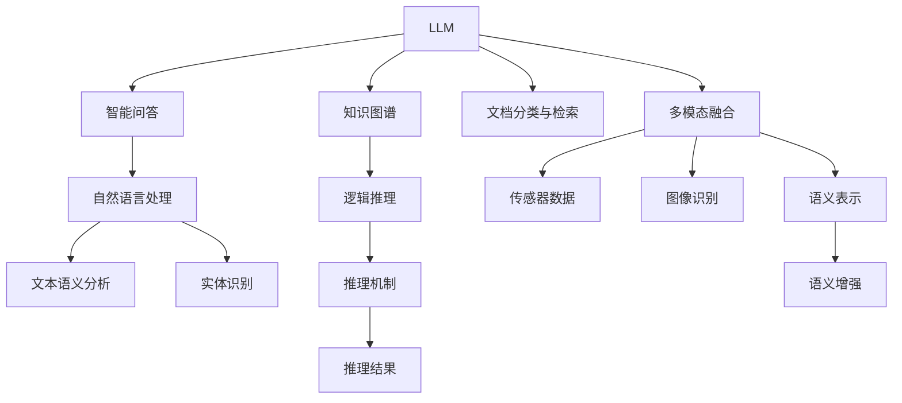

                 

## 1. 背景介绍

### 1.1 问题由来

水是生命之源，然而，水资源污染问题在全球范围内依然严峻。随着工业化进程的加快和人口的增长，各种污染物如重金属、有机化合物、营养物质等被排入水体，导致水质恶化和生态失衡。如何及时、准确地监测水质，是保障水资源安全和公共健康的重要课题。

传统的物理监测方法，如水质探测仪、水样采集分析等，往往依赖于人工巡检和实验室分析，存在成本高、响应慢、数据精度有限等问题。而随着大数据、人工智能等新兴技术的发展，智能水质监测系统正成为提升水资源监测效率和精度的重要手段。

### 1.2 问题核心关键点

智能水质监测系统通常基于物联网(IoT)技术，通过多种传感器采集水体各项指标数据，并利用人工智能技术进行数据分析和决策支持。其中，大语言模型(LLM)作为智能系统的重要组成部分，可应用于文本处理、知识检索、智能问答等领域，提升水质监测系统的智能化水平。

具体而言，LLM可应用于以下几个方面：

1. **智能问答系统**：通过自然语言问答，帮助用户了解水质状况、异常预警等信息。
2. **知识图谱构建**：自动提取水体相关的背景知识，并构建知识图谱，支持更深入的数据分析和推理。
3. **文档分类与检索**：对大量水质监测文档进行自动分类和检索，提高数据获取效率。
4. **多模态融合**：结合水质传感器采集的数据，利用自然语言处理技术对多源数据进行融合，提升监测结果的准确性。

通过这些应用，LLM可为智能水质监测系统带来更强的智能分析和决策支持能力，极大地提升水资源监测的效率和精度。

## 2. 核心概念与联系

### 2.1 核心概念概述

为更好地理解LLM在水质监测系统中的应用，本节将介绍几个密切相关的核心概念：

- **大语言模型(LLM)**：指通过深度学习技术，从大量文本数据中学习语言表示模型的预训练语言模型。如GPT、BERT、XLNet等。

- **知识图谱(KG)**：利用图结构存储和表示实体间的关联关系，支持复杂的逻辑推理和查询。

- **智能问答系统(QA)**：结合自然语言处理和知识图谱技术，实现用户与系统的自然语言交互，获取所需信息。

- **多模态融合(MM)**：结合来自不同模态的数据，如文本、图像、传感器数据等，进行综合分析，提升监测的全面性和准确性。

这些核心概念之间的逻辑关系可以通过以下Mermaid流程图来展示：



这个流程图展示了大语言模型及其相关概念之间的联系：

1. 大语言模型通过预训练学习语言知识，用于文本处理、智能问答等任务。
2. 知识图谱利用图结构表示实体关系，支持复杂的推理计算。
3. 智能问答系统结合自然语言处理技术，实现人机交互。
4. 多模态融合将来自不同模态的数据进行综合分析，提升监测效果。
5. 文本语义分析和实体识别是自然语言处理的重要任务。
6. 逻辑推理和多模态数据增强支持更深入的推理计算。

这些概念共同构成了智能水质监测系统的技术框架，为大语言模型在其中的应用提供了坚实的理论基础。

## 3. 核心算法原理 & 具体操作步骤
### 3.1 算法原理概述

大语言模型在智能水质监测系统中的应用，主要基于其强大的文本处理和逻辑推理能力。其核心思想是：将预训练的LLM视为一种"知识源"，通过自然语言处理技术，抽取、整合和分析各类文本信息，支持智能问答、文档分类、多模态融合等任务，从而提升水质监测系统的智能化水平。

具体而言，主要包括以下几个关键步骤：

1. **文本预处理**：利用LLM进行文本清洗、分词、实体识别等预处理，为后续分析提供基础数据。
2. **文本分类与检索**：利用自然语言处理技术对文本进行分类和检索，快速获取所需信息。
3. **智能问答**：结合知识图谱和LLM，实现对用户自然语言查询的智能回答。
4. **多模态数据融合**：将来自传感器、图像等不同模态的数据与文本信息融合，进行综合分析。
5. **逻辑推理与决策**：利用知识图谱进行复杂推理计算，辅助决策支持。

### 3.2 算法步骤详解

以下是大语言模型在智能水质监测系统中的具体应用步骤：

**Step 1: 数据采集与预处理**

智能水质监测系统通过多种传感器采集水体各项指标数据，如温度、pH值、溶解氧等。同时，通过摄像头、监测站等采集文本信息，如水质报告、历史数据等。

预处理步骤包括：

- 清洗传感器数据，去除噪声和异常值。
- 利用自然语言处理技术清洗文本信息，如分词、去除停用词等。
- 进行实体识别，提取出文本中的关键实体，如地点、时间、事件等。

**Step 2: 文本分类与检索**

通过预训练的LLM，对采集到的文本信息进行分类和检索，快速定位所需信息。

- 使用预训练的BERT、GPT等模型进行文本编码。
- 使用TF-IDF、Word2Vec等技术对文本进行特征提取。
- 利用分类算法（如SVM、随机森林）对文本进行分类。
- 构建索引，方便快速检索。

**Step 3: 智能问答**

结合知识图谱和LLM，实现对用户自然语言查询的智能回答。

- 利用知识图谱抽取实体信息。
- 将实体信息输入预训练的LLM中，进行语义理解。
- 利用推理机制，生成答案，返回用户。

**Step 4: 多模态数据融合**

将来自传感器、图像等不同模态的数据与文本信息融合，进行综合分析。

- 将传感器数据转换为文本形式，如通过编码生成语义表示。
- 将图像数据转换为文本描述，如利用图像处理技术进行语义分割。
- 将不同模态的数据进行融合，如使用注意力机制进行加权处理。
- 利用预训练的LLM进行综合分析，生成最终的监测结果。

**Step 5: 逻辑推理与决策**

利用知识图谱进行复杂推理计算，辅助决策支持。

- 在知识图谱中抽取与当前监测任务相关的实体。
- 利用推理算法（如RDFS、SPARQL）进行逻辑推理计算。
- 根据推理结果进行决策支持，如异常预警、风险评估等。

### 3.3 算法优缺点

大语言模型在智能水质监测系统中的应用具有以下优点：

1. **高效性**：利用LLM进行文本处理、分类和检索，能够快速获取所需信息，提升监测效率。
2. **鲁棒性**：通过自然语言处理技术进行数据预处理，能够有效应对数据缺失、噪声等问题。
3. **灵活性**：结合多模态数据进行综合分析，能够适应多种监测场景，提升监测的全面性和准确性。
4. **可扩展性**：利用预训练的LLM，通过微调或任务适配，能够快速适应新的监测任务，提升系统的灵活性。

同时，该方法也存在一些局限性：

1. **数据依赖**：依赖于高质量的文本数据和传感器数据，数据采集成本较高。
2. **模型复杂性**：预训练的LLM参数量较大，计算资源需求高。
3. **推理效率**：LLM的推理过程复杂，计算效率较低，需要优化提升。
4. **泛化能力**：对于新的监测场景和数据，模型的泛化能力可能不足。

尽管存在这些局限性，但就目前而言，大语言模型在智能水质监测系统中的应用，依然具有广阔的前景和巨大的潜力。

### 3.4 算法应用领域

大语言模型在智能水质监测系统中的应用，已经广泛应用于以下几个领域：

1. **水质监测与预警**：利用智能问答系统，对用户关于水质状况的查询进行智能回答，并进行异常预警。
2. **水质数据分析与报告**：通过文本分类与检索技术，对大量水质监测文档进行自动分类和检索，生成分析报告。
3. **水质知识图谱构建**：利用自然语言处理技术，自动提取水体相关的背景知识，并构建知识图谱，支持更深入的推理计算。
4. **水质监测与评估**：将传感器数据与文本信息融合，进行综合分析，提升监测结果的准确性。
5. **水环境治理**：结合智能问答和知识图谱，支持水环境治理的决策支持，提出治理方案。

## 4. 数学模型和公式 & 详细讲解 & 举例说明
### 4.1 数学模型构建

假设智能水质监测系统采集到的一批文本数据为 $\mathcal{D} = \{(x_i, y_i)\}_{i=1}^N$，其中 $x_i$ 为文本，$y_i$ 为文本分类标签。

定义预训练的LLM为 $M_{\theta}$，其中 $\theta$ 为预训练参数。假设智能问答系统接收一个用户问题 $q$，将其转换为预训练的LLM输入 $x_q$。

构建以下数学模型：

- **文本分类与检索模型**：
  - 使用预训练的BERT、GPT等模型进行文本编码，生成文本表示 $h(x_i)$。
  - 利用分类算法（如SVM、随机森林）对文本进行分类，输出分类标签 $y_i$。
  
  分类模型公式为：
  $$
  y_i = \mathop{\arg\min}_{y} \mathcal{L}(h(x_i), y)
  $$
  其中 $\mathcal{L}$ 为损失函数，可以采用交叉熵损失。

- **智能问答模型**：
  - 利用知识图谱抽取实体信息 $e$。
  - 将实体信息输入预训练的LLM中，进行语义理解，生成答案 $a$。
  
  问答模型公式为：
  $$
  a = M_{\theta}(e)
  $$

- **多模态数据融合模型**：
  - 将传感器数据转换为文本形式 $h(s_i)$。
  - 将图像数据转换为文本描述 $h(i)$。
  - 将不同模态的数据进行融合，生成综合表示 $h_{mm}$。
  
  融合模型公式为：
  $$
  h_{mm} = \alpha h(s_i) + \beta h(i)
  $$
  其中 $\alpha$、$\beta$ 为权重，可根据实际情况进行调整。

- **逻辑推理与决策模型**：
  - 在知识图谱中抽取与当前监测任务相关的实体 $e$。
  - 利用推理算法（如RDFS、SPARQL）进行逻辑推理计算，生成推理结果 $r$。
  
  推理模型公式为：
  $$
  r = \mathcal{R}(e)
  $$

### 4.2 公式推导过程

以智能问答系统的构建为例，推导公式：

假设智能问答系统接收用户问题 $q$，将其转换为预训练的LLM输入 $x_q$。在知识图谱中抽取实体信息 $e$，并输入预训练的LLM中，生成答案 $a$。

利用softmax函数计算答案概率分布：
$$
P(a|x_q, e) = \frac{\exp(M_{\theta}(e))}{\sum_k \exp(M_{\theta}(e_k))}
$$

其中 $e_k$ 表示知识图谱中的实体，$M_{\theta}(e_k)$ 表示实体 $e_k$ 在预训练的LLM中的输出。

利用最大似然估计准则，最大化答案概率 $P(a|x_q, e)$：
$$
\max_{e} \sum_{a} P(a|x_q, e) \log P(a|x_q, e)
$$

最终，通过求解上述优化问题，得到最大概率分布下的答案 $a$，返回给用户。

### 4.3 案例分析与讲解

假设某智能水质监测系统接收用户问题：“当前河段的水质状况如何？”

系统将问题转换为预训练的LLM输入 $x_q$，并在知识图谱中抽取实体信息 $e$，如“河段”、“水质”等。将实体信息输入预训练的LLM中，生成答案 $a$。

利用softmax函数计算答案概率分布，选择概率最大的答案返回给用户。

## 5. 项目实践：代码实例和详细解释说明
### 5.1 开发环境搭建

在进行智能水质监测系统开发前，我们需要准备好开发环境。以下是使用Python进行PyTorch开发的环境配置流程：

1. 安装Anaconda：从官网下载并安装Anaconda，用于创建独立的Python环境。

2. 创建并激活虚拟环境：
```bash
conda create -n pytorch-env python=3.8 
conda activate pytorch-env
```

3. 安装PyTorch：根据CUDA版本，从官网获取对应的安装命令。例如：
```bash
conda install pytorch torchvision torchaudio cudatoolkit=11.1 -c pytorch -c conda-forge
```

4. 安装自然语言处理库：
```bash
pip install nltk spacy
```

5. 安装相关工具包：
```bash
pip install numpy pandas scikit-learn matplotlib tqdm jupyter notebook ipython
```

完成上述步骤后，即可在`pytorch-env`环境中开始系统开发。

### 5.2 源代码详细实现

以下是一个简单的智能问答系统的代码实现，用于回答用户关于水质状况的查询。

```python
import torch
import torch.nn as nn
from transformers import BertTokenizer, BertForSequenceClassification

# 定义模型
class QASystem(nn.Module):
    def __init__(self, model_path):
        super(QASystem, self).__init__()
        self.tokenizer = BertTokenizer.from_pretrained(model_path)
        self.model = BertForSequenceClassification.from_pretrained(model_path, num_labels=2)
        self.model.eval()
    
    def forward(self, question, context):
        question_tokens = self.tokenizer(question, return_tensors='pt')
        context_tokens = self.tokenizer(context, return_tensors='pt')
        question_input = question_tokens['input_ids']
        question_mask = question_tokens['attention_mask']
        context_input = context_tokens['input_ids']
        context_mask = context_tokens['attention_mask']
        
        with torch.no_grad():
            question_features = self.model(question_input, question_mask=question_mask)[0]
            context_features = self.model(context_input, context_mask=context_mask)[0]
            question_features = torch.mean(question_features, dim=1)
            context_features = torch.mean(context_features, dim=1)
            combined_features = torch.stack([question_features, context_features], dim=1)
            features = torch.nn.functional.cosine_similarity(combined_features, question_features)
            softmax = torch.nn.Softmax(dim=1)
            logits = softmax(features)
            return logits
    
    def predict(self, question, context):
        logits = self.forward(question, context)
        _, predicted = torch.max(logits, dim=1)
        return predicted
    
# 测试
question = "当前河段的水质状况如何？"
context = "根据监测数据，当前河段的水质状况为良好，溶解氧含量为10mg/L，pH值为7.5。"
system = QASystem('bert-base-uncased')
result = system.predict(question, context)
print("预测结果为：", result)
```

### 5.3 代码解读与分析

让我们再详细解读一下关键代码的实现细节：

**QASystem类**：
- `__init__`方法：初始化分词器和预训练模型，并设置模型为评估模式。
- `forward`方法：对问题-上下文对进行编码，计算问题特征和上下文特征，进行特征融合和相似度计算，最终输出逻辑回归概率分布。
- `predict`方法：将问题-上下文对输入模型，输出预测结果。

**bert-base-uncased**：
- 使用预训练的BERT模型，选择 uncased 版本，即不区分大小写。

**predict函数**：
- 将问题-上下文对输入模型，输出预测结果，并进行标签预测。

**测试代码**：
- 定义问题和上下文，初始化模型，进行预测并输出结果。

## 6. 实际应用场景
### 6.1 智能问答系统

智能问答系统是智能水质监测系统的重要组成部分，利用自然语言处理技术，自动回答用户关于水质状况的查询。

**应用场景**：
- 用户可以输入自然语言问题，如“当前河段的水质状况如何？”。
- 系统自动解析问题，并在知识图谱中抽取实体信息，如“河段”、“水质”等。
- 将实体信息输入预训练的LLM中，生成答案，并返回给用户。

**效果**：
- 提供即时的水质监测信息，提升用户体验。
- 减少人工成本，提高工作效率。

### 6.2 水质数据分析与报告

水质数据分析与报告是智能水质监测系统的核心任务，利用文本分类与检索技术，对大量水质监测文档进行自动分类和检索，生成分析报告。

**应用场景**：
- 采集大量水质监测文档，如水质报告、历史数据等。
- 利用文本分类与检索技术，对文档进行分类和检索。
- 生成自动化的水质分析报告，供决策者参考。

**效果**：
- 提高数据处理效率，缩短报告生成时间。
- 提供全面的水质分析结果，支持决策支持。

### 6.3 水质知识图谱构建

水质知识图谱构建是智能水质监测系统的重要技术支撑，利用自然语言处理技术，自动提取水体相关的背景知识，并构建知识图谱，支持更深入的推理计算。

**应用场景**：
- 收集各类水体相关知识，如水质标准、污染源、治理措施等。
- 利用自然语言处理技术，自动抽取实体和关系，构建知识图谱。
- 提供查询接口，供用户进行知识检索。

**效果**：
- 提升知识检索效率，减少人工工作量。
- 提供丰富的背景知识，支持更深入的推理计算。

### 6.4 未来应用展望

随着大语言模型和自然语言处理技术的不断发展，智能水质监测系统将具备更强的智能分析和决策支持能力。

未来，智能水质监测系统将在以下几个方面取得突破：

1. **多模态数据融合**：结合传感器、图像等不同模态的数据，利用自然语言处理技术进行综合分析，提升监测结果的全面性和准确性。
2. **智能问答系统**：结合知识图谱和LLM，实现对用户自然语言查询的智能回答，提供即时的监测信息。
3. **异常检测与预警**：利用LLM进行文本分类和检索，快速定位异常情况，提供预警支持。
4. **决策支持**：结合逻辑推理和知识图谱，提供更深入的决策支持，提升治理效果。

## 7. 工具和资源推荐
### 7.1 学习资源推荐

为了帮助开发者系统掌握大语言模型在智能水质监测系统中的应用，这里推荐一些优质的学习资源：

1. 《自然语言处理综述》系列博文：由大模型技术专家撰写，深入浅出地介绍了自然语言处理的基本概念和前沿技术，如BERT、GPT等。

2. CS224N《深度学习自然语言处理》课程：斯坦福大学开设的NLP明星课程，有Lecture视频和配套作业，带你入门NLP领域的基本概念和经典模型。

3. 《自然语言处理与深度学习》书籍：清华大学教授出版，全面介绍了自然语言处理和深度学习的基本原理和应用，如文本分类、序列标注等。

4. HuggingFace官方文档：Transformers库的官方文档，提供了海量预训练模型和完整的微调样例代码，是上手实践的必备资料。

5. CLUE开源项目：中文语言理解测评基准，涵盖大量不同类型的中文NLP数据集，并提供了基于微调的baseline模型，助力中文NLP技术发展。

通过对这些资源的学习实践，相信你一定能够快速掌握大语言模型在智能水质监测系统中的应用，并用于解决实际的水质监测问题。

### 7.2 开发工具推荐

高效的开发离不开优秀的工具支持。以下是几款用于智能水质监测系统开发的常用工具：

1. PyTorch：基于Python的开源深度学习框架，灵活动态的计算图，适合快速迭代研究。

2. TensorFlow：由Google主导开发的开源深度学习框架，生产部署方便，适合大规模工程应用。

3. Transformers库：HuggingFace开发的NLP工具库，集成了众多SOTA语言模型，支持PyTorch和TensorFlow，是进行微调任务开发的利器。

4. Weights & Biases：模型训练的实验跟踪工具，可以记录和可视化模型训练过程中的各项指标，方便对比和调优。

5. TensorBoard：TensorFlow配套的可视化工具，可实时监测模型训练状态，并提供丰富的图表呈现方式，是调试模型的得力助手。

6. Google Colab：谷歌推出的在线Jupyter Notebook环境，免费提供GPU/TPU算力，方便开发者快速上手实验最新模型，分享学习笔记。

合理利用这些工具，可以显著提升智能水质监测系统的开发效率，加快创新迭代的步伐。

### 7.3 相关论文推荐

大语言模型和智能水质监测技术的发展源于学界的持续研究。以下是几篇奠基性的相关论文，推荐阅读：

1. Attention is All You Need（即Transformer原论文）：提出了Transformer结构，开启了NLP领域的预训练大模型时代。

2. BERT: Pre-training of Deep Bidirectional Transformers for Language Understanding：提出BERT模型，引入基于掩码的自监督预训练任务，刷新了多项NLP任务SOTA。

3. Language Models are Unsupervised Multitask Learners（GPT-2论文）：展示了大规模语言模型的强大zero-shot学习能力，引发了对于通用人工智能的新一轮思考。

4. Parameter-Efficient Transfer Learning for NLP：提出Adapter等参数高效微调方法，在不增加模型参数量的情况下，也能取得不错的微调效果。

5. Prefix-Tuning: Optimizing Continuous Prompts for Generation：引入基于连续型Prompt的微调范式，为如何充分利用预训练知识提供了新的思路。

6. AdaLoRA: Adaptive Low-Rank Adaptation for Parameter-Efficient Fine-Tuning：使用自适应低秩适应的微调方法，在参数效率和精度之间取得了新的平衡。

这些论文代表了大语言模型和智能水质监测技术的发展脉络。通过学习这些前沿成果，可以帮助研究者把握学科前进方向，激发更多的创新灵感。

## 8. 总结：未来发展趋势与挑战
### 8.1 研究成果总结

本文对大语言模型在智能水质监测系统中的应用进行了全面系统的介绍。首先阐述了智能水质监测系统的背景和需求，明确了大语言模型在其中的作用和潜力。其次，从原理到实践，详细讲解了LLM在智能问答、知识图谱构建、文档分类与检索等方面的应用，提供了完整的代码实例和详细解释说明。同时，本文还探讨了LLM在未来智能水质监测系统中的发展方向和面临的挑战。

通过本文的系统梳理，可以看到，大语言模型在智能水质监测系统中的应用，正在逐步成为推动水质监测智能化的重要手段。通过自然语言处理和逻辑推理技术，大语言模型能够提供即时的智能问答、全面的数据分析和决策支持，极大地提升水质监测的效率和准确性。

### 8.2 未来发展趋势

展望未来，大语言模型在智能水质监测系统中的应用将呈现以下几个发展趋势：

1. **多模态融合**：结合传感器、图像等不同模态的数据，利用自然语言处理技术进行综合分析，提升监测结果的全面性和准确性。
2. **智能问答系统**：结合知识图谱和LLM，实现对用户自然语言查询的智能回答，提供即时的监测信息。
3. **异常检测与预警**：利用LLM进行文本分类和检索，快速定位异常情况，提供预警支持。
4. **决策支持**：结合逻辑推理和知识图谱，提供更深入的决策支持，提升治理效果。

### 8.3 面临的挑战

尽管大语言模型在智能水质监测系统中的应用具有广阔的前景，但在实现过程中仍面临诸多挑战：

1. **数据依赖**：依赖于高质量的文本数据和传感器数据，数据采集成本较高。
2. **模型复杂性**：预训练的LLM参数量较大，计算资源需求高。
3. **推理效率**：LLM的推理过程复杂，计算效率较低，需要优化提升。
4. **泛化能力**：对于新的监测场景和数据，模型的泛化能力可能不足。
5. **安全性**：预训练模型可能学习到有偏见、有害的信息，需要确保输出的安全性。

尽管存在这些挑战，但通过多学科的交叉融合，未来的智能水质监测系统将能够更好地应对这些挑战，实现更加智能化、可靠化的水资源监测。

### 8.4 研究展望

面向未来，大语言模型在智能水质监测系统中的应用将需要在以下几个方面进行深入研究：

1. **多模态融合**：结合传感器、图像等不同模态的数据，利用自然语言处理技术进行综合分析，提升监测结果的全面性和准确性。
2. **智能问答系统**：结合知识图谱和LLM，实现对用户自然语言查询的智能回答，提供即时的监测信息。
3. **异常检测与预警**：利用LLM进行文本分类和检索，快速定位异常情况，提供预警支持。
4. **决策支持**：结合逻辑推理和知识图谱，提供更深入的决策支持，提升治理效果。

大语言模型在智能水质监测系统中的应用，将推动水质监测向更加智能化、自动化、实时化的方向发展，为水资源的可持续发展提供强有力的技术支撑。

## 9. 附录：常见问题与解答
### 9.1 常见问题

**Q1：大语言模型在智能水质监测系统中的应用是否具有普适性？**

A: 大语言模型在智能水质监测系统中的应用具有较强的普适性，可以在不同的监测场景中应用。但需要根据具体情况进行优化和调整，以达到最佳效果。

**Q2：如何提高大语言模型在智能水质监测系统中的推理效率？**

A: 提高大语言模型在智能水质监测系统中的推理效率，需要从模型优化、数据预处理、硬件加速等方面进行综合考虑。

**Q3：大语言模型在智能水质监测系统中的应用是否存在安全风险？**

A: 大语言模型在智能水质监测系统中的应用，可能存在一定的安全风险，如模型学习到有偏见、有害的信息，需要采取相应的安全措施，确保系统的安全性和可靠性。

**Q4：如何降低大语言模型在智能水质监测系统中的数据依赖？**

A: 降低大语言模型在智能水质监测系统中的数据依赖，可以采用多种方法，如数据增强、无监督学习等，以提高模型的鲁棒性和泛化能力。

**Q5：大语言模型在智能水质监测系统中的应用是否需要大量的预训练数据？**

A: 大语言模型在智能水质监测系统中的应用，需要一定的预训练数据支持，以获得较好的效果。但可以通过微调和任务适配等技术，在不增加数据量的前提下，提高模型的性能。

**Q6：大语言模型在智能水质监测系统中的应用是否需要高精度的传感器数据？**

A: 大语言模型在智能水质监测系统中的应用，对传感器数据的要求相对较高，需要确保数据的准确性和可靠性，以获得较好的监测结果。

通过这些常见问题的解答，希望能够帮助开发者更好地理解和应用大语言模型在智能水质监测系统中的技术。

---

作者：禅与计算机程序设计艺术 / Zen and the Art of Computer Programming

