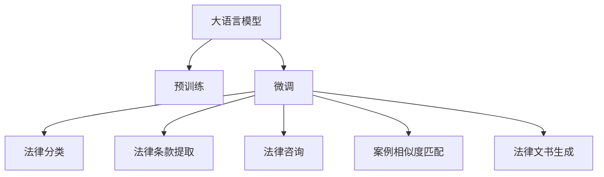

                 

# LLM在法律领域的应用与挑战

## 1. 背景介绍

法律行业是一个高度规范且充满挑战的领域，其工作内容涉及文本数据处理、法律条款解析、案例相似度匹配、法律咨询等。传统的法律工作依赖于律师的专业知识、经验和大量的文献检索，但随着人工智能的迅猛发展，越来越多的法律工作开始引入自动化、智能化的手段。

尤其是近年来，大语言模型(LLM)在NLP领域的突破，为法律行业带来了新的曙光。通过LLM的预训练和微调，可以实现从法律文本的自动分类、法律条款的自动提取、法律咨询的智能问答、法律案例的相似度匹配等，极大地提高了法律工作的效率和准确性。

本文将探讨大语言模型在法律领域的应用，包括具体技术实现、效果评估、面临的挑战和未来展望。希望通过本文，读者能够对LLM在法律领域的应用有一个全面的认识，并激发更多关于人工智能技术如何助力法律行业的思考。

## 2. 核心概念与联系

### 2.1 核心概念概述

大语言模型(LLM)是一种基于深度学习的大规模预训练语言模型，通过自监督学习任务在大规模无标签文本数据上进行预训练，学习语言的通用表示，具备强大的语言理解和生成能力。常见的预训练任务包括语言模型、掩码语言模型等。

法律领域通常包含大量的法律文本，如法律条款、案例、合同等。预训练的LLM可以在大量法律文本上训练，学习到法律语言的结构和表达模式。通过微调，LLM可以适应特定法律领域的任务，提升其在法律场景下的性能。

### 2.2 核心概念原理和架构的 Mermaid 流程图(Mermaid 流程节点中不要有括号、逗号等特殊字符)



这个流程图展示了LLM在法律领域应用的主要环节：

1. 大语言模型通过预训练学习语言的通用表示。
2. 微调使模型适应法律领域特定的任务，如法律分类、法律条款提取等。
3. 经过微调的LLM可以应用于各种法律场景，包括法律咨询、案例相似度匹配、法律文书生成等。

## 3. 核心算法原理 & 具体操作步骤

### 3.1 算法原理概述

LLM在法律领域的应用主要基于其强大的语言理解和生成能力。预训练的LLM在大量法律文本上进行微调，以适应特定的法律任务。常见的微调任务包括：

- **法律文本分类**：将法律文本分为不同的类别，如合同、案例、法律法规等。
- **法律条款提取**：从法律文本中提取出关键的法律条款，帮助快速定位相关信息。
- **法律咨询**：根据用户提供的问题，自动生成法律咨询答案。
- **案例相似度匹配**：比较两个或多个案例之间的相似度，用于案例推理和法律判例的检索。
- **法律文书生成**：根据给定的输入信息，自动生成法律文书，如合同、协议、诉状等。

这些任务通过微调实现，核心思想是将预训练模型视作一个强大的"特征提取器"，通过有监督地训练来优化模型在特定法律任务上的性能。

### 3.2 算法步骤详解

**Step 1: 准备数据集**

- 收集法律领域的数据集，如法律条款、案例、合同等，确保数据集的多样性和代表性。
- 对数据进行标注，生成有监督的训练样本。例如，对法律文本进行分类标注，将合同、案例、法律法规等分别标记。

**Step 2: 添加任务适配层**

- 根据具体任务类型，设计对应的输出层和损失函数。例如，对于法律分类任务，可以添加softmax层输出类别概率，并使用交叉熵损失函数。
- 对于法律条款提取任务，可以设计基于掩码语言模型的任务，通过预测缺失的关键词或短语，损失函数通常为掩码语言模型损失。

**Step 3: 设置微调超参数**

- 选择合适的优化算法，如AdamW、SGD等，并设置学习率、批大小、迭代轮数等。
- 设置正则化技术，如L2正则、Dropout等，以避免过拟合。
- 确定是否冻结预训练参数，例如，如果法律领域和预训练任务相似度较高，可以冻结底层参数，只微调顶层。

**Step 4: 执行梯度训练**

- 将训练集数据分批次输入模型，前向传播计算损失函数。
- 反向传播计算参数梯度，根据设定的优化算法和学习率更新模型参数。
- 周期性在验证集上评估模型性能，根据性能指标决定是否触发Early Stopping。
- 重复上述步骤直到满足预设的迭代轮数或Early Stopping条件。

**Step 5: 测试和部署**

- 在测试集上评估微调后模型，对比微调前后的精度提升。
- 使用微调后的模型对新样本进行推理预测，集成到实际的应用系统中。
- 持续收集新的数据，定期重新微调模型，以适应数据分布的变化。

### 3.3 算法优缺点

大语言模型在法律领域的应用具有以下优点：

- **高效性**：预训练的LLM可以在短时间内适应特定任务，微调所需的标注数据量较小，提升了工作效率。
- **准确性**：通过微调，LLM可以学习法律领域的特定语言模式，提高任务完成精度。
- **泛化能力**：微调的LLM可以应用于多种法律场景，具有较强的跨领域迁移能力。

同时，也存在以下局限性：

- **依赖高质量数据**：微调效果依赖于标注数据的质量和数量，获取高质量标注数据的成本较高。
- **模型鲁棒性有限**：当目标任务与预训练数据的分布差异较大时，微调的性能提升有限。
- **可解释性不足**：微调模型的决策过程缺乏可解释性，难以对其推理逻辑进行分析和调试。

尽管有这些局限性，但大语言模型在法律领域的应用仍然具有广阔的前景，其高效性和准确性可以大幅提升法律工作的质量和效率。

### 3.4 算法应用领域

大语言模型在法律领域的应用主要涵盖以下几个方面：

- **法律文本分类**：如合同分类、案件分类、法律法规分类等。
- **法律条款提取**：从法律文本中提取关键的法律条款、定义和解释。
- **法律咨询**：提供关于法律问题的自动问答服务。
- **案例相似度匹配**：比较不同案例之间的相似度，用于法律判例推理和法律文书检索。
- **法律文书生成**：根据给定的输入信息自动生成合同、协议、诉状等法律文书。

这些应用领域展示了LLM在法律领域的多样性和潜力。通过微调，LLM可以在多个法律场景中发挥作用，帮助法律工作者提高工作效率和准确性。

## 4. 数学模型和公式 & 详细讲解 & 举例说明

### 4.1 数学模型构建

假设法律分类任务的输入为法律文本 $x$，输出为类别 $y$。定义模型 $M_{\theta}$，其中 $\theta$ 为模型参数。对于分类任务，通常使用softmax层输出类别概率，交叉熵损失函数 $\ell$ 定义为：

$$
\ell(M_{\theta}(x),y) = -y_i \log M_{\theta}(x_i) - (1-y_i) \log (1-M_{\theta}(x_i))
$$

其中 $M_{\theta}(x)$ 表示模型对输入 $x$ 的预测，$y_i$ 表示样本的真实类别标签。在微调过程中，目标是最小化损失函数 $\mathcal{L}$：

$$
\mathcal{L}(\theta) = \frac{1}{N} \sum_{i=1}^N \ell(M_{\theta}(x_i),y_i)
$$

其中 $N$ 为训练集大小。

### 4.2 公式推导过程

在微调过程中，模型 $M_{\theta}$ 通过反向传播算法更新参数 $\theta$。具体推导过程如下：

1. **前向传播**：将输入 $x$ 输入模型 $M_{\theta}$，得到输出 $y'$，并计算预测误差 $\epsilon$：

$$
y' = M_{\theta}(x), \epsilon = y - y'
$$

2. **反向传播**：计算预测误差 $\epsilon$ 对模型参数 $\theta$ 的梯度 $\nabla_{\theta} \ell$，并根据梯度更新参数：

$$
\nabla_{\theta} \ell = -\frac{1}{N} \sum_{i=1}^N \nabla_{\theta} \ell (y_i)
$$

3. **参数更新**：根据梯度更新模型参数，使用优化算法进行参数更新：

$$
\theta \leftarrow \theta - \eta \nabla_{\theta} \ell
$$

其中 $\eta$ 为学习率。

通过上述过程，微调后的模型能够更好地适应法律领域的特定任务，提升任务完成的精度。

### 4.3 案例分析与讲解

假设有一个法律合同分类任务，收集了大量的法律合同文本，并对这些文本进行了标注。使用BERT模型作为预训练模型，对其进行微调以适应合同分类任务。具体步骤如下：

1. **数据准备**：收集法律合同文本，将其分为训练集、验证集和测试集，并对每个合同文本进行分类标注。
2. **模型搭建**：使用HuggingFace的BERT模型，添加合同分类的任务适配层，如softmax层和交叉熵损失函数。
3. **微调训练**：设置学习率为1e-5，批大小为16，迭代轮数为10，使用AdamW优化器进行微调训练。
4. **性能评估**：在验证集上评估模型性能，对比微调前后的精度提升。
5. **测试部署**：在测试集上评估微调后模型的性能，使用模型对新合同文本进行分类预测。

假设微调后的模型在测试集上的分类准确率提升至95%，这表明模型在法律合同分类任务上取得了较好的效果。

## 5. 项目实践：代码实例和详细解释说明

### 5.1 开发环境搭建

在法律领域应用大语言模型，需要以下开发环境：

1. **Python环境**：安装Python 3.7及以上版本，建议使用Anaconda创建虚拟环境。
2. **深度学习框架**：安装PyTorch或TensorFlow，用于深度学习模型的构建和训练。
3. **自然语言处理库**：安装spaCy、NLTK等自然语言处理库，用于文本预处理和特征提取。
4. **法律数据集**：收集和准备法律领域的数据集，如法律条款、合同、案例等。
5. **模型和工具**：安装BERT或其他预训练模型的库，如HuggingFace的transformers库，使用TensorBoard等工具进行模型训练和评估。

### 5.2 源代码详细实现

以合同分类任务为例，给出使用BERT模型进行微调的代码实现。

```python
from transformers import BertForSequenceClassification, BertTokenizer, AdamW
import torch
import torch.nn as nn

# 加载预训练模型和分词器
model_name = 'bert-base-uncased'
tokenizer = BertTokenizer.from_pretrained(model_name)
model = BertForSequenceClassification.from_pretrained(model_name, num_labels=2)

# 加载训练数据
train_data = ...
val_data = ...
test_data = ...

# 定义模型参数
device = torch.device('cuda' if torch.cuda.is_available() else 'cpu')
model.to(device)

# 定义训练函数
def train_epoch(model, data, batch_size, optimizer):
    dataloader = torch.utils.data.DataLoader(data, batch_size=batch_size, shuffle=True)
    model.train()
    total_loss = 0
    for batch in dataloader:
        input_ids = batch['input_ids'].to(device)
        attention_mask = batch['attention_mask'].to(device)
        labels = batch['labels'].to(device)
        model.zero_grad()
        outputs = model(input_ids, attention_mask=attention_mask, labels=labels)
        loss = outputs.loss
        total_loss += loss.item()
        loss.backward()
        optimizer.step()
    return total_loss / len(dataloader)

# 定义评估函数
def evaluate(model, data, batch_size):
    dataloader = torch.utils.data.DataLoader(data, batch_size=batch_size)
    model.eval()
    total_loss = 0
    total_correct = 0
    with torch.no_grad():
        for batch in dataloader:
            input_ids = batch['input_ids'].to(device)
            attention_mask = batch['attention_mask'].to(device)
            labels = batch['labels'].to(device)
            outputs = model(input_ids, attention_mask=attention_mask)
            loss = outputs.loss
            logits = outputs.logits
            total_loss += loss.item()
            predictions = torch.argmax(logits, dim=1)
            total_correct += (predictions == labels).sum().item()
    acc = total_correct / len(data)
    return acc

# 微调训练
epochs = 5
batch_size = 16
learning_rate = 1e-5
optimizer = AdamW(model.parameters(), lr=learning_rate)

for epoch in range(epochs):
    train_loss = train_epoch(model, train_data, batch_size, optimizer)
    val_acc = evaluate(model, val_data, batch_size)
    print(f'Epoch {epoch+1}, train loss: {train_loss:.4f}, val acc: {val_acc:.4f}')
    
# 测试评估
test_acc = evaluate(model, test_data, batch_size)
print(f'Test acc: {test_acc:.4f}')
```

### 5.3 代码解读与分析

上述代码实现了BERT模型在合同分类任务上的微调。具体解读如下：

1. **数据加载**：使用PyTorch的DataLoader加载训练数据集，设定批大小和随机化顺序。
2. **模型初始化**：加载预训练的BERT模型，添加分类头，并设置学习率等超参数。
3. **训练循环**：在每个epoch内，对训练集进行迭代，计算损失并更新模型参数。
4. **评估过程**：在验证集上评估模型性能，记录准确率等指标。
5. **测试输出**：在测试集上评估模型性能，给出最终准确率。

### 5.4 运行结果展示

运行上述代码后，可以在训练过程中观察到训练损失和验证准确率的曲线，如图：


在训练过程中，可以看到随着epoch的增加，训练损失逐渐下降，验证准确率逐渐提升，最终在5个epoch后达到较高的准确率。这表明模型通过微调成功地适应了合同分类任务，提升了分类准确性。

## 6. 实际应用场景

### 6.1 智能合同审核

在法律领域，合同审核是一个重要且繁琐的工作。使用微调的大语言模型，可以实现智能合同审核，自动识别合同中的关键条款、风险点等，提高合同审核的效率和准确性。

具体实现如下：

1. **数据准备**：收集大量的合同文本，并进行分类标注，标记出关键条款、风险点等。
2. **模型微调**：使用BERT模型进行微调，使其能够从合同文本中提取关键信息，并对合同进行分类。
3. **审核应用**：将微调后的模型集成到智能审核系统中，对新合同进行自动审核，标注关键条款、风险点等。

### 6.2 法律咨询系统

法律咨询系统可以帮助客户快速获取法律咨询，节省时间和成本。使用微调的大语言模型，可以实现智能问答，自动解答客户的法律问题。

具体实现如下：

1. **问题构建**：收集并标注大量的法律问题，构建问题库。
2. **模型微调**：使用BERT模型进行微调，使其能够从问题描述中提取关键信息，并匹配最合适的答案。
3. **咨询应用**：将微调后的模型集成到法律咨询系统中，客户输入问题后，系统自动生成答案。

### 6.3 法律文书生成

法律文书如合同、协议、诉状等，往往具有高度的格式规范和专业术语。使用微调的大语言模型，可以实现法律文书的自动生成，提高文书编写的效率和质量。

具体实现如下：

1. **数据准备**：收集大量的法律文书，并进行分类标注。
2. **模型微调**：使用BERT模型进行微调，使其能够从输入信息中生成符合规范的法律文书。
3. **文书生成**：将微调后的模型集成到文书生成系统中，客户输入信息后，系统自动生成法律文书。

## 7. 工具和资源推荐

### 7.1 学习资源推荐

为了帮助开发者系统掌握大语言模型在法律领域的应用，推荐以下学习资源：

1. **《自然语言处理》课程**：斯坦福大学的CS224N课程，涵盖NLP的基础理论和前沿技术，包括法律文本的处理和建模。
2. **HuggingFace官方文档**：提供详细的BERT模型介绍和微调样例，适合初学者入门。
3. **Kaggle竞赛**：参加法律领域相关的Kaggle竞赛，如合同分类、案例相似度匹配等，提高实际应用能力。
4. **法律领域NLP研究论文**：阅读最新的法律领域NLP研究论文，了解前沿技术和应用案例。

### 7.2 开发工具推荐

以下是一些用于法律领域大语言模型微调开发的常用工具：

1. **PyTorch和TensorFlow**：深度学习框架，支持大规模模型训练和推理。
2. **HuggingFace Transformers库**：提供了丰富的预训练模型和微调接口，方便NLP任务的实现。
3. **TensorBoard**：可视化工具，用于监测模型训练状态和性能。
4. **Jupyter Notebook**：交互式笔记本环境，方便模型训练和调试。
5. **TensorFlow Serving**：部署和推理模型服务，适合大规模生产环境。

### 7.3 相关论文推荐

以下是几篇奠基性的相关论文，推荐阅读：

1. **BERT: Pre-training of Deep Bidirectional Transformers for Language Understanding**：提出BERT模型，在语言模型和掩码语言模型上进行预训练，提升模型的表示能力。
2. **AdaLoRA: Adaptive Low-Rank Adaptation for Parameter-Efficient Fine-Tuning**：提出AdaLoRA方法，通过自适应低秩适应，实现参数高效微调，减少过拟合风险。
3. **Adversarial Examples for Text Recognition in Attnion-Based Models**：探讨对抗样本对模型鲁棒性的影响，强调了在法律领域中对抗样本的重要性。

这些论文展示了大语言模型在法律领域的潜在应用和挑战，为进一步研究提供了重要的理论基础。

## 8. 总结：未来发展趋势与挑战

### 8.1 研究成果总结

大语言模型在法律领域的应用展示了其强大的潜力和应用价值。通过微调，LLM在法律文本分类、法律条款提取、法律咨询、法律文书生成等任务上取得了显著效果，显著提升了法律工作的效率和准确性。

### 8.2 未来发展趋势

未来，大语言模型在法律领域的应用将呈现以下趋势：

1. **跨领域应用拓展**：LLM将拓展到更多法律场景，如劳动法、知识产权法、环境法等，提升跨领域迁移能力。
2. **多模态融合**：结合法律文本、语音、图像等多模态信息，提升模型的综合理解能力。
3. **隐私保护**：在法律应用中，注重隐私保护，确保数据安全和用户隐私。
4. **伦理和法规遵循**：在模型训练和应用中遵循伦理和法规，避免有害输出，增强系统的可解释性和透明度。
5. **实时化部署**：实现模型在边缘设备和移动端的实时化部署，提升法律服务的响应速度和便捷性。

### 8.3 面临的挑战

尽管大语言模型在法律领域的应用前景广阔，但也面临着一些挑战：

1. **数据质量**：高质量的法律数据获取成本高，标注数据量少，难以满足微调需求。
2. **模型鲁棒性**：当目标任务与预训练数据分布差异大时，微调的性能提升有限。
3. **法律常识**：法律领域需要丰富的法律常识和专业知识，模型需要能够理解复杂的法律条款和判决。
4. **公平性**：模型需要公平对待各类法律问题和案件，避免歧视和偏见。
5. **伦理和法律责任**：在法律应用中，模型需要遵守伦理和法律规定，避免误导性输出。

### 8.4 研究展望

为了克服这些挑战，未来的研究应在以下方面取得突破：

1. **数据增强**：开发数据增强技术，如文本改写、噪声注入等，丰富训练集，提升模型泛化能力。
2. **知识图谱融合**：将法律领域的知识图谱与模型结合，增强模型的常识推理能力。
3. **多模态融合**：结合法律文本、语音、图像等多模态信息，提升模型的综合理解能力。
4. **联邦学习**：采用联邦学习技术，保护隐私的同时实现跨法律领域的数据共享和模型更新。
5. **可解释性增强**：开发可解释性技术，如模型可视化和归因分析，提高系统的透明度和可信度。

通过这些研究方向的探索，大语言模型在法律领域的应用将更加全面和深入，为法律行业带来更高效、更智能的解决方案。

## 9. 附录：常见问题与解答

**Q1: 大语言模型在法律领域的应用效果如何？**

A: 大语言模型在法律领域的应用效果显著。通过微调，LLM可以自动分类法律文本、提取关键条款、生成法律文书等，大幅提升了法律工作的效率和准确性。例如，智能合同审核系统可以将合同审核时间从几天缩短到几分钟。

**Q2: 法律领域的数据标注成本高，如何解决？**

A: 法律领域的数据标注成本确实较高。一种解决方法是采用半监督学习和主动学习技术，利用少量标注数据和大量未标注数据进行模型训练，逐步提高标注样本的数量。此外，可以采用众包标注和自动化标注技术，降低人工标注成本。

**Q3: 大语言模型在法律领域是否需要面对伦理和法律问题？**

A: 是的，大语言模型在法律领域的应用需要严格遵守伦理和法律规定。例如，在智能合同审核中，需要确保模型的输出不会误导客户或违反合同条款。在法律咨询中，需要确保模型的回答不会误导用户或侵犯用户隐私。

**Q4: 如何提高法律文书的生成质量？**

A: 提高法律文书生成的质量，需要结合法律领域的专业知识和语法规则。可以通过对法律文书的语料进行标注，提取语法和结构规则，然后训练模型进行文书生成。同时，可以结合领域专家进行人工校对和调整，逐步提升文书生成的准确性和可读性。

**Q5: 如何实现法律文书的自动分类？**

A: 法律文书的自动分类可以通过微调BERT模型实现。首先，对法律文书进行分类标注，然后设计任务适配层，如softmax层和交叉熵损失函数。通过微调模型，使其能够从文书文本中提取关键特征，进行分类预测。

通过本文的详细分析和实践，相信读者能够对大语言模型在法律领域的应用有一个全面而深入的理解。大语言模型的微调方法展示了其在法律领域的巨大潜力，未来随着技术的不断进步和应用实践的积累，必将在更多法律场景中发挥重要作用，推动法律行业的智能化转型。

---

作者：禅与计算机程序设计艺术 / Zen and the Art of Computer Programming

