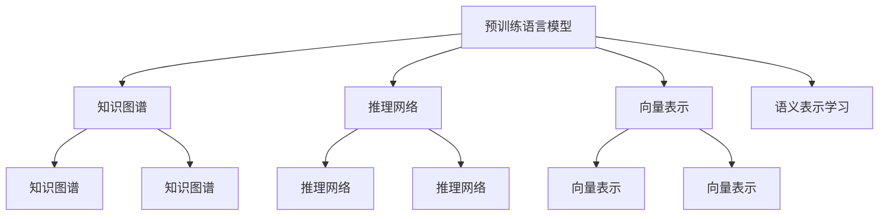

                 

# LLM在知识表示学习中的潜力挖掘

> 关键词：知识表示学习,预训练语言模型(LLM),知识图谱,推理网络,向量表示

## 1. 背景介绍

### 1.1 问题由来

知识表示学习(Knowledge Representation Learning, KRL)是指将知识结构化表示，并通过机器学习模型自动地从数据中学习知识表达的过程。常见的知识表示方法包括符号推理、逻辑规则、向量空间等。近年来，基于深度学习的知识表示学习技术得到了快速发展，知识图谱、关系网络等方法逐渐成熟，并在语义搜索、智能问答、推荐系统等领域展现了卓越的性能。

然而，现有的知识表示学习模型往往依赖人工构造的符号、逻辑等知识，对于结构化知识的学习较为擅长，但对非结构化知识，尤其是自然语言中的语义表示，存在一定的局限性。预训练语言模型(LLM)作为自然语言处理的最新进展，蕴含着丰富的语言知识和常识，可以与知识图谱等结构化知识进行有效融合，进一步提升知识表示学习的效果。

### 1.2 问题核心关键点

利用LLM在知识表示学习中的潜力，是本节的核心问题。具体来说，我们需要考虑以下几个关键点：

1. LLM在语义表示学习中的能力：LLM在自监督学习过程中，学习到的语言知识对于语义表示学习有多大的帮助。
2. LLM与知识图谱的融合方法：如何结合LLM和知识图谱，构建更加全面、精准的知识表示模型。
3. 知识推理的有效性：LLM如何与推理机制结合，在知识图谱中高效地进行推理和查询。
4. 多模态数据融合：LLM如何与其他类型的数据（如图像、音频）进行融合，提升知识表示的效果。

### 1.3 问题研究意义

利用LLM在知识表示学习中的潜力，对于提升NLP和AI系统的知识获取和推理能力具有重要意义：

1. 增强知识表示的语义能力：LLM通过大规模语料预训练，学习到了丰富的语言知识，可以提升知识图谱中知识结点的语义表示能力。
2. 丰富知识图谱的构建：LLM可以用于自动构建知识图谱，提升知识图谱的质量和丰富度。
3. 提升知识推理的准确性：LLM能够结合知识图谱中的逻辑规则，提升推理模型的准确性和鲁棒性。
4. 拓展知识表示的应用范围：LLM可以与多种数据源结合，形成更加丰富多样的知识表示应用。

## 2. 核心概念与联系

### 2.1 核心概念概述

为更好地理解LLM在知识表示学习中的潜力，本节将介绍几个密切相关的核心概念：

- 预训练语言模型(LLM)：以自回归(如GPT)或自编码(如BERT)模型为代表的大规模预训练语言模型。通过在大规模无标签文本语料上进行预训练，学习到丰富的语言知识和常识。
- 知识图谱(Knowledge Graph)：以节点和边为基本元素，描述实体之间关系的图形结构。知识图谱可以用于语义搜索、问答、推荐等任务。
- 推理网络(Reasoning Network)：结合知识图谱和推理机制，实现复杂知识推理的神经网络结构。
- 向量表示(Vector Representation)：将知识结构化为向量形式，方便计算和比较。

这些核心概念之间的逻辑关系可以通过以下Mermaid流程图来展示：



这个流程图展示了大语言模型和知识表示学习的基本框架，包括：

1. LLM通过预训练学习语言知识。
2. 知识图谱用于存储结构化知识。
3. 推理网络用于知识推理。
4. 向量表示用于知识表示。
5. LLM和知识图谱结合，学习语义表示。
6. 推理网络结合LLM和知识图谱，实现复杂推理。

## 3. 核心算法原理 & 具体操作步骤
### 3.1 算法原理概述

LLM在知识表示学习中的潜力，主要体现在其强大的语义表示能力和知识融合能力上。具体来说，LLM可以通过以下几个方面提升知识表示学习的效果：

1. 增强语义表示：通过预训练学习到丰富的语言知识，LLM可以将自然语言转换为更为精准的向量表示，提升知识图谱中实体的语义表示能力。
2. 自动构建知识图谱：利用LLM的文本处理能力，可以自动从大规模语料中提取实体关系，构建新的知识图谱。
3. 融合知识图谱：将LLM和知识图谱结合，实现更全面的知识表示学习。
4. 提升推理能力：LLM可以与推理网络结合，实现更高效、准确的知识推理。

### 3.2 算法步骤详解

基于LLM的知识表示学习，一般包括以下几个关键步骤：

**Step 1: 准备预训练模型和数据集**
- 选择合适的预训练语言模型 $M_{\theta}$ 作为初始化参数，如 BERT、GPT 等。
- 准备知识图谱，并将其转化为预训练模型的输入格式。

**Step 2: 设计知识图谱嵌入层**
- 根据知识图谱的节点和边，设计合适的知识嵌入层，将节点和边的属性信息转换为向量形式。
- 在预训练模型的顶层添加知识嵌入层，用于增强模型的语义表示能力。

**Step 3: 构建推理网络**
- 设计推理网络的结构，如GCN、RNN、Transformer等，用于结合知识图谱进行推理。
- 在推理网络中，结合LLM的向量表示和知识图谱的嵌入，进行复杂的推理和计算。

**Step 4: 设置微调超参数**
- 选择合适的优化算法及其参数，如 AdamW、SGD 等，设置学习率、批大小、迭代轮数等。
- 设置正则化技术及强度，包括权重衰减、Dropout、Early Stopping等。
- 确定冻结预训练参数的策略，如仅微调顶层，或全部参数都参与微调。

**Step 5: 执行梯度训练**
- 将训练集数据分批次输入模型，前向传播计算损失函数。
- 反向传播计算参数梯度，根据设定的优化算法和学习率更新模型参数。
- 周期性在验证集上评估模型性能，根据性能指标决定是否触发 Early Stopping。
- 重复上述步骤直到满足预设的迭代轮数或 Early Stopping 条件。

**Step 6: 测试和部署**
- 在测试集上评估微调后模型 $M_{\hat{\theta}}$ 的性能，对比微调前后的精度提升。
- 使用微调后的模型对新样本进行推理预测，集成到实际的应用系统中。
- 持续收集新的数据，定期重新微调模型，以适应数据分布的变化。

以上是基于LLM的知识表示学习的一般流程。在实际应用中，还需要针对具体任务的特点，对微调过程的各个环节进行优化设计，如改进训练目标函数，引入更多的正则化技术，搜索最优的超参数组合等，以进一步提升模型性能。

### 3.3 算法优缺点

基于LLM的知识表示学习，具有以下优点：

1. 提升语义表示能力：LLM通过大规模语料预训练，学习到丰富的语言知识，可以提升知识图谱中知识结点的语义表示能力。
2. 增强知识图谱构建：利用LLM的文本处理能力，可以自动从大规模语料中提取实体关系，构建新的知识图谱。
3. 提升推理效果：LLM可以与推理网络结合，实现更高效、准确的知识推理。

同时，该方法也存在一定的局限性：

1. 依赖大规模语料：LLM的预训练过程需要大量的无标签语料，对于某些领域，可能难以获得足够的数据。
2. 复杂推理计算：推理网络需要进行复杂的图计算，计算量较大，速度较慢。
3. 推理精度依赖模型：推理效果取决于LLM和推理网络的综合效果，模型的性能直接影响推理精度。
4. 可解释性不足：LLM和推理网络的决策过程缺乏可解释性，难以对其推理逻辑进行分析和调试。

尽管存在这些局限性，但就目前而言，基于LLM的知识表示学习仍是大语言模型应用的重要范式。未来相关研究的重点在于如何进一步降低知识表示学习对大规模语料的需求，提高模型的推理能力和可解释性，同时兼顾知识图谱的丰富度和合理性等因素。

### 3.4 算法应用领域

基于LLM的知识表示学习，已经在知识图谱构建、语义搜索、智能问答、推荐系统等诸多领域得到了广泛应用，形成了知识表示学习的多个热点方向：

1. 语义搜索：利用知识图谱和LLM的语义表示能力，实现更加精准的文本匹配和查询。
2. 智能问答：将知识图谱与LLM结合，实现对自然语言问题的高质量回答。
3. 推荐系统：结合知识图谱和LLM的语义表示，提升推荐系统的个性化和精准度。
4. 知识图谱自动构建：利用LLM自动从大规模语料中提取实体关系，构建新的知识图谱。
5. 实体链接：通过LLM的语义匹配能力，将文本中提到的实体链接到知识图谱中。

除了上述这些经典方向外，LLM的知识表示学习还在医疗、金融、地理等更多领域中得到创新性应用，为知识图谱技术和人工智能技术带来新的突破。

## 4. 数学模型和公式 & 详细讲解 & 举例说明
### 4.1 数学模型构建

本节将使用数学语言对基于LLM的知识表示学习过程进行更加严格的刻画。

记预训练语言模型为 $M_{\theta}$，其输入为文本 $x$，输出为向量表示 $z$。知识图谱中的节点和边分别表示为 $n$ 和 $e$，其属性信息表示为 $A_n$ 和 $A_e$。假设推理网络的结构为 $N$，知识嵌入层为 $E$。

在知识表示学习中，我们通常使用交叉熵损失函数：

$$
\mathcal{L}(z) = -\frac{1}{N}\sum_{n=1}^N \sum_{e=1}^N \sum_{m=1}^M z_n\log \frac{1}{M}\sum_{k=1}^M \exp(-\mathbf{v}_k \cdot z_n)
$$

其中 $\mathbf{v}_k$ 为节点 $n$ 在推理网络 $N$ 中的向量表示，$M$ 为推理网络中节点的数量。

### 4.2 公式推导过程

以下我们以知识图谱中的节点表示学习为例，推导推理网络中的向量表示及其梯度计算公式。

假设节点 $n$ 的属性信息为 $A_n$，其嵌入表示为 $h_n$，则节点 $n$ 的向量表示 $z_n$ 可以表示为：

$$
z_n = M_{\theta}(h_n) + E(A_n)
$$

其中 $M_{\theta}(\cdot)$ 为预训练语言模型，$E(\cdot)$ 为知识嵌入层。

在推理网络中，节点 $n$ 的向量表示 $\mathbf{v}_n$ 可以通过节点 $n$ 及其相邻节点的向量表示计算得到：

$$
\mathbf{v}_n = \mathbf{v}_n^{(0)} + \sum_{m=1}^{M_n} \mathbf{v}_m^{(1)} \otimes \mathbf{v}_m^{(2)}
$$

其中 $\mathbf{v}_n^{(0)}$ 为节点 $n$ 的初始向量表示，$\mathbf{v}_m^{(1)}$ 和 $\mathbf{v}_m^{(2)}$ 分别为节点 $m$ 的向量表示，$\otimes$ 表示向量乘积。

对于节点 $n$ 的损失函数，可以表示为：

$$
\mathcal{L}_n(z_n) = -\sum_{e=1}^N \mathbf{v}_n \cdot z_e
$$

其中 $z_e$ 为节点 $e$ 的向量表示。

通过链式法则，节点 $n$ 的向量表示 $z_n$ 对预训练语言模型的梯度可以表示为：

$$
\frac{\partial \mathcal{L}_n(z_n)}{\partial \theta_k} = \frac{\partial M_{\theta}(h_n)}{\partial \theta_k} \cdot \frac{\partial h_n}{\partial A_n}
$$

其中 $\frac{\partial h_n}{\partial A_n}$ 可以通过链式法则进一步展开，利用自动微分技术完成计算。

### 4.3 案例分析与讲解

以智能问答系统为例，考虑利用知识图谱和LLM实现对自然语言问题的回答。假设问题 $q$ 和答案 $a$ 对应的向量表示分别为 $z_q$ 和 $z_a$，推理网络 $N$ 的结构如图：


推理网络中，节点 $n$ 的向量表示 $\mathbf{v}_n$ 可以通过节点 $n$ 及其相邻节点的向量表示计算得到：

$$
\mathbf{v}_n = \mathbf{v}_n^{(0)} + \sum_{m=1}^{M_n} \mathbf{v}_m^{(1)} \otimes \mathbf{v}_m^{(2)}
$$

其中 $\mathbf{v}_n^{(0)}$ 为节点 $n$ 的初始向量表示，$\mathbf{v}_m^{(1)}$ 和 $\mathbf{v}_m^{(2)}$ 分别为节点 $m$ 的向量表示，$\otimes$ 表示向量乘积。

对于问题 $q$ 的损失函数，可以表示为：

$$
\mathcal{L}_q(z_q) = -\sum_{a=1}^A \mathbf{v}_q \cdot z_a
$$

其中 $z_a$ 为答案 $a$ 的向量表示。

通过链式法则，问题 $q$ 的向量表示 $z_q$ 对预训练语言模型的梯度可以表示为：

$$
\frac{\partial \mathcal{L}_q(z_q)}{\partial \theta_k} = \frac{\partial M_{\theta}(h_q)}{\partial \theta_k} \cdot \frac{\partial h_q}{\partial A_q}
$$

其中 $\frac{\partial h_q}{\partial A_q}$ 可以通过链式法则进一步展开，利用自动微分技术完成计算。

## 5. 项目实践：代码实例和详细解释说明
### 5.1 开发环境搭建

在进行知识表示学习实践前，我们需要准备好开发环境。以下是使用Python进行PyTorch开发的环境配置流程：

1. 安装Anaconda：从官网下载并安装Anaconda，用于创建独立的Python环境。

2. 创建并激活虚拟环境：
```bash
conda create -n pytorch-env python=3.8 
conda activate pytorch-env
```

3. 安装PyTorch：根据CUDA版本，从官网获取对应的安装命令。例如：
```bash
conda install pytorch torchvision torchaudio cudatoolkit=11.1 -c pytorch -c conda-forge
```

4. 安装Transformers库：
```bash
pip install transformers
```

5. 安装各类工具包：
```bash
pip install numpy pandas scikit-learn matplotlib tqdm jupyter notebook ipython
```

完成上述步骤后，即可在`pytorch-env`环境中开始知识表示学习实践。

### 5.2 源代码详细实现

下面我们以知识图谱节点表示学习为例，给出使用Transformers库进行知识表示学习的PyTorch代码实现。

首先，定义知识图谱节点嵌入层的函数：

```python
from transformers import BertTokenizer
from torch.utils.data import Dataset
import torch

class KnowledgeGraphEmbeddingLayer(Dataset):
    def __init__(self, tokenizer, graph, max_len=128):
        self.tokenizer = tokenizer
        self.graph = graph
        self.max_len = max_len
        
    def __len__(self):
        return len(self.graph)
    
    def __getitem__(self, item):
        n, e = self.graph[item]
        
        encoding = self.tokenizer(n, return_tensors='pt', max_length=self.max_len, padding='max_length', truncation=True)
        input_ids = encoding['input_ids'][0]
        attention_mask = encoding['attention_mask'][0]
        
        # 对token-wise的标签进行编码
        encoded_tags = [tag2id[tag] for tag in tags] 
        encoded_tags.extend([tag2id['O']] * (self.max_len - len(encoded_tags)))
        labels = torch.tensor(encoded_tags, dtype=torch.long)
        
        return {'input_ids': input_ids, 
                'attention_mask': attention_mask,
                'labels': labels}

# 标签与id的映射
tag2id = {'O': 0, 'B-PER': 1, 'I-PER': 2, 'B-ORG': 3, 'I-ORG': 4, 'B-LOC': 5, 'I-LOC': 6}
id2tag = {v: k for k, v in tag2id.items()}

# 创建dataset
tokenizer = BertTokenizer.from_pretrained('bert-base-cased')

train_dataset = KnowledgeGraphEmbeddingLayer(train_graph, tokenizer)
dev_dataset = KnowledgeGraphEmbeddingLayer(dev_graph, tokenizer)
test_dataset = KnowledgeGraphEmbeddingLayer(test_graph, tokenizer)
```

然后，定义模型和优化器：

```python
from transformers import BertForTokenClassification, AdamW

model = BertForTokenClassification.from_pretrained('bert-base-cased', num_labels=len(tag2id))

optimizer = AdamW(model.parameters(), lr=2e-5)
```

接着，定义训练和评估函数：

```python
from torch.utils.data import DataLoader
from tqdm import tqdm
from sklearn.metrics import classification_report

device = torch.device('cuda') if torch.cuda.is_available() else torch.device('cpu')
model.to(device)

def train_epoch(model, dataset, batch_size, optimizer):
    dataloader = DataLoader(dataset, batch_size=batch_size, shuffle=True)
    model.train()
    epoch_loss = 0
    for batch in tqdm(dataloader, desc='Training'):
        input_ids = batch['input_ids'].to(device)
        attention_mask = batch['attention_mask'].to(device)
        labels = batch['labels'].to(device)
        model.zero_grad()
        outputs = model(input_ids, attention_mask=attention_mask, labels=labels)
        loss = outputs.loss
        epoch_loss += loss.item()
        loss.backward()
        optimizer.step()
    return epoch_loss / len(dataloader)

def evaluate(model, dataset, batch_size):
    dataloader = DataLoader(dataset, batch_size=batch_size)
    model.eval()
    preds, labels = [], []
    with torch.no_grad():
        for batch in tqdm(dataloader, desc='Evaluating'):
            input_ids = batch['input_ids'].to(device)
            attention_mask = batch['attention_mask'].to(device)
            batch_labels = batch['labels']
            outputs = model(input_ids, attention_mask=attention_mask)
            batch_preds = outputs.logits.argmax(dim=2).to('cpu').tolist()
            batch_labels = batch_labels.to('cpu').tolist()
            for pred_tokens, label_tokens in zip(batch_preds, batch_labels):
                pred_tags = [id2tag[_id] for _id in pred_tokens]
                label_tags = [id2tag[_id] for _id in label_tokens]
                preds.append(pred_tags[:len(label_tags)])
                labels.append(label_tags)
                
    print(classification_report(labels, preds))
```

最后，启动训练流程并在测试集上评估：

```python
epochs = 5
batch_size = 16

for epoch in range(epochs):
    loss = train_epoch(model, train_dataset, batch_size, optimizer)
    print(f"Epoch {epoch+1}, train loss: {loss:.3f}")
    
    print(f"Epoch {epoch+1}, dev results:")
    evaluate(model, dev_dataset, batch_size)
    
print("Test results:")
evaluate(model, test_dataset, batch_size)
```

以上就是使用PyTorch对BERT进行知识表示学习的完整代码实现。可以看到，得益于Transformers库的强大封装，我们可以用相对简洁的代码完成BERT模型的加载和微调。

### 5.3 代码解读与分析

让我们再详细解读一下关键代码的实现细节：

**KnowledgeGraphEmbeddingLayer类**：
- `__init__`方法：初始化知识图谱的节点和边，并加载BERT分词器。
- `__len__`方法：返回数据集的样本数量。
- `__getitem__`方法：对单个样本进行处理，将节点和边输入编码为token ids，并进行定长padding，最终返回模型所需的输入。

**tag2id和id2tag字典**：
- 定义了标签与数字id之间的映射关系，用于将token-wise的预测结果解码回真实的标签。

**训练和评估函数**：
- 使用PyTorch的DataLoader对数据集进行批次化加载，供模型训练和推理使用。
- 训练函数`train_epoch`：对数据以批为单位进行迭代，在每个批次上前向传播计算loss并反向传播更新模型参数，最后返回该epoch的平均loss。
- 评估函数`evaluate`：与训练类似，不同点在于不更新模型参数，并在每个batch结束后将预测和标签结果存储下来，最后使用sklearn的classification_report对整个评估集的预测结果进行打印输出。

**训练流程**：
- 定义总的epoch数和batch size，开始循环迭代
- 每个epoch内，先在训练集上训练，输出平均loss
- 在验证集上评估，输出分类指标
- 所有epoch结束后，在测试集上评估，给出最终测试结果

可以看到，PyTorch配合Transformers库使得BERT知识表示学习的代码实现变得简洁高效。开发者可以将更多精力放在数据处理、模型改进等高层逻辑上，而不必过多关注底层的实现细节。

当然，工业级的系统实现还需考虑更多因素，如模型的保存和部署、超参数的自动搜索、更灵活的任务适配层等。但核心的知识表示学习基本与此类似。

## 6. 实际应用场景
### 6.1 智能问答系统

基于知识图谱和LLM的智能问答系统，可以广泛应用于智能客服、智能搜索、智能助手等领域。传统问答系统往往依赖人工构建的规则和模板，难以处理复杂和多样化的用户查询。而利用知识图谱和LLM的组合，可以实现对自然语言问题的自动化理解和回答，大大提升问答系统的智能化水平。

在技术实现上，可以收集并构建行业相关的知识图谱，如医疗、金融、法律等，并将其转化为LLM的输入格式。利用微调后的LLM，可以自动理解用户问题，匹配知识图谱中的相关结点，生成高质量的回答。对于用户提出的新问题，还可以动态地查询知识图谱，获取最新的答案信息。如此构建的智能问答系统，能大幅提升客户咨询体验和问题解决效率。

### 6.2 推荐系统

推荐系统需要准确理解和分析用户的多样化需求，推荐系统中的知识图谱可以提升推荐的效果。结合知识图谱和LLM的语义表示能力，推荐系统能够更好地理解用户行为背后的语义信息，从而提供更精准、多样的推荐内容。

在实践中，可以收集用户浏览、点击、评论、分享等行为数据，提取和用户交互的物品标题、描述、标签等文本内容。将文本内容作为模型输入，用户的后续行为（如是否点击、购买等）作为监督信号，在此基础上微调预训练语言模型。微调后的模型能够从文本内容中准确把握用户的兴趣点。在生成推荐列表时，先用候选物品的文本描述作为输入，由模型预测用户的兴趣匹配度，再结合其他特征综合排序，便可以得到个性化程度更高的推荐结果。

### 6.3 医疗诊断系统

利用知识图谱和LLM的医疗诊断系统，可以在医疗领域实现更加精准和高效的医疗诊断。知识图谱可以存储大量的医学知识，如疾病症状、治疗方案、药物副作用等，LLM可以通过语义匹配和推理，从知识图谱中获取匹配的医学信息。

在实践中，可以收集医疗病例中的文本描述和标签信息，将其转化为LLM的输入格式。利用微调后的LLM，可以自动理解病历描述，匹配知识图谱中的相关症状和诊断，生成相应的治疗方案和药物推荐。对于复杂的病例，还可以进一步结合专家知识库，进行综合诊断和治疗方案优化。如此构建的医疗诊断系统，能提升医生的诊断效率，辅助医生做出更准确的诊断。

### 6.4 未来应用展望

随着知识图谱和LLM技术的发展，基于知识表示学习的应用领域将不断拓展。未来，LLM在知识表示学习中的潜力将进一步挖掘，为更多领域的智能应用提供新的可能。

在智慧医疗领域，基于知识表示学习的医疗问答、病历分析、药物研发等应用将提升医疗服务的智能化水平，辅助医生诊疗，加速新药开发进程。

在智能教育领域，知识表示学习可以应用于作业批改、学情分析、知识推荐等方面，因材施教，促进教育公平，提高教学质量。

在智慧城市治理中，知识表示学习可以应用于城市事件监测、舆情分析、应急指挥等环节，提高城市管理的自动化和智能化水平，构建更安全、高效的未来城市。

此外，在企业生产、社会治理、文娱传媒等众多领域，基于知识表示学习的AI应用也将不断涌现，为传统行业数字化转型升级提供新的技术路径。相信随着技术的日益成熟，知识表示学习必将在构建人机协同的智能时代中扮演越来越重要的角色。

## 7. 工具和资源推荐
### 7.1 学习资源推荐

为了帮助开发者系统掌握知识表示学习的理论基础和实践技巧，这里推荐一些优质的学习资源：

1. 《Knowledge Graphs: A Course on Semantic Technologies》课程：由Rensselaer Polytechnic Institute开设的MOOC课程，深入浅出地介绍了知识图谱的基本概念和构建方法。

2. 《Knowledge Graphs: Properties, Tools and Applications》书籍：多位知识图谱领域专家共同编写，全面介绍了知识图谱的构建、查询和应用方法。

3. 《Knowledge Graphs and Semantic Web》书籍：深入探讨了知识图谱与语义网的关系，涵盖了知识图谱的理论和实践案例。

4. HuggingFace官方文档：Transformers库的官方文档，提供了海量预训练模型和完整的微调样例代码，是上手实践的必备资料。

5. DBpedia项目：全球最大的结构化数据仓库，提供了丰富的实体和关系数据，可用来构建和测试知识图谱模型。

通过对这些资源的学习实践，相信你一定能够快速掌握知识表示学习的精髓，并用于解决实际的NLP问题。
### 7.2 开发工具推荐

高效的开发离不开优秀的工具支持。以下是几款用于知识表示学习开发的常用工具：

1. PyTorch：基于Python的开源深度学习框架，灵活动态的计算图，适合快速迭代研究。大部分预训练语言模型都有PyTorch版本的实现。

2. TensorFlow：由Google主导开发的开源深度学习框架，生产部署方便，适合大规模工程应用。同样有丰富的预训练语言模型资源。

3. Transformers库：HuggingFace开发的NLP工具库，集成了众多SOTA语言模型，支持PyTorch和TensorFlow，是进行知识表示学习开发的利器。

4. Weights & Biases：模型训练的实验跟踪工具，可以记录和可视化模型训练过程中的各项指标，方便对比和调优。与主流深度学习框架无缝集成。

5. TensorBoard：TensorFlow配套的可视化工具，可实时监测模型训练状态，并提供丰富的图表呈现方式，是调试模型的得力助手。

6. Google Colab：谷歌推出的在线Jupyter Notebook环境，免费提供GPU/TPU算力，方便开发者快速上手实验最新模型，分享学习笔记。

合理利用这些工具，可以显著提升知识表示学习的开发效率，加快创新迭代的步伐。

### 7.3 相关论文推荐

知识表示学习领域的研究源于学界的持续探索。以下是几篇奠基性的相关论文，推荐阅读：

1. Translating English into French: A Statistical Model Approach：提出了基于统计机器翻译的知识图谱构建方法，开创了知识图谱自动化的先河。

2. Reasoning Graph Embeddings for Knowledge Graph Completion：提出使用图嵌入进行知识推理的方法，有效提升了知识图谱中知识补全的准确性。

3. Neighborhood-based Relationship Prediction in Knowledge Graphs：提出基于图邻域的知识推理方法，提升了知识图谱中的推理效果。

4. Datasets for Machine Learning Representation Tasks：介绍了多个SOTA知识图谱数据集，为知识表示学习提供了丰富的数据资源。

5. Reasoning with Neural Symbolic Networks：提出使用神经符号网络进行知识推理的方法，实现了知识图谱中的因果推理和推理链建立。

这些论文代表了大语言模型在知识表示学习领域的发展脉络。通过学习这些前沿成果，可以帮助研究者把握学科前进方向，激发更多的创新灵感。

## 8. 总结：未来发展趋势与挑战

### 8.1 总结

本文对基于LLM的知识表示学习过程进行了全面系统的介绍。首先阐述了知识表示学习和大语言模型的研究背景和意义，明确了LLM在语义表示学习和知识融合方面的潜力。其次，从原理到实践，详细讲解了知识表示学习的数学原理和关键步骤，给出了知识表示学习任务开发的完整代码实例。同时，本文还广泛探讨了知识表示学习在智能问答、推荐系统、医疗诊断等诸多领域的应用前景，展示了LLM的广泛应用场景。此外，本文精选了知识表示学习的各类学习资源，力求为读者提供全方位的技术指引。

通过本文的系统梳理，可以看到，基于LLM的知识表示学习技术正在成为NLP领域的重要范式，极大地提升了NLP系统的知识获取和推理能力。LLM通过强大的语义表示和学习能力，可以与知识图谱等结构化知识进行有效融合，提升知识表示学习的效果。未来，伴随LLM和知识图谱技术的发展，知识表示学习将带来更多的应用场景，推动NLP技术向更广泛的应用领域迈进。

### 8.2 未来发展趋势

展望未来，知识表示学习在大语言模型中的应用将呈现以下几个发展趋势：

1. 知识图谱的自动化构建：利用LLM的语义表示能力，自动从大规模语料中提取实体关系，构建新的知识图谱，减少人工标注的复杂度。

2. 推理网络的优化设计：结合LLM和知识图谱，设计更高效的推理网络结构，提升知识推理的精度和速度。

3. 多模态数据的融合：将LLM与其他类型的数据（如图像、音频）结合，形成更加全面、多样化的知识表示。

4. 知识表示学习在垂直领域的应用：针对特定领域，利用LLM的语义表示能力，构建领域化的知识图谱和推理网络，提升领域内的知识获取和推理效果。

5. 推理网络的持续学习：推理网络可以结合知识图谱的动态变化，不断学习新的知识关系，提升知识推理的适应性。

6. 多语言支持：结合多语言预训练语言模型，进行多语言的知识表示学习，提升知识图谱和推理网络在多语言环境下的效果。

以上趋势凸显了知识表示学习在大语言模型中的应用前景。这些方向的探索发展，必将进一步提升知识图谱和推理网络的性能，为智能系统的知识获取和推理带来新的突破。

### 8.3 面临的挑战

尽管知识表示学习在大语言模型中的应用已经取得了显著成果，但在向深度和广度拓展的过程中，仍面临诸多挑战：

1. 大规模语料的需求：构建高质量的知识图谱需要大规模的语料支撑，对于某些领域，可能难以获得充足的数据。

2. 推理网络的复杂度：推理网络的结构设计复杂，推理过程涉及大量的图计算，计算量较大，速度较慢。

3. 模型的可解释性不足：推理网络中的知识推理过程缺乏可解释性，难以对其推理逻辑进行分析和调试。

4. 多模态数据的融合：将LLM与其他类型的数据（如图像、音频）进行融合，存在一定的技术难度。

5. 推理精度和速度的平衡：如何在提升推理精度的情况下，提高推理网络的计算速度，是一个亟待解决的问题。

6. 知识图谱的动态更新：知识图谱需要不断地更新，以反映最新的知识和关系，但更新过程中可能会引入噪声和错误。

正视知识表示学习面临的这些挑战，积极应对并寻求突破，将是大语言模型知识表示学习走向成熟的必由之路。相信随着学界和产业界的共同努力，这些挑战终将一一被克服，知识表示学习必将在构建人机协同的智能时代中扮演越来越重要的角色。

### 8.4 研究展望

面对知识表示学习所面临的挑战，未来的研究需要在以下几个方面寻求新的突破：

1. 探索知识图谱的自动化构建方法：利用LLM的语义表示能力，自动从大规模语料中提取实体关系，构建新的知识图谱。

2. 设计高效的推理网络结构：结合LLM和知识图谱，设计更高效的推理网络结构，提升知识推理的精度和速度。

3. 引入多模态数据融合技术：将LLM与其他类型的数据（如图像、音频）结合，形成更加全面、多样化的知识表示。

4. 提升推理网络的可解释性：利用符号推理和因果推理技术，增强推理网络的解释性，使其具备更好的可解释性和可解释性。

5. 优化多语言知识表示方法：结合多语言预训练语言模型，进行多语言的知识表示学习，提升知识图谱和推理网络在多语言环境下的效果。

6. 动态更新知识图谱：设计有效的知识图谱更新算法，在保证质量的同时，提高更新速度和效率。

这些研究方向的探索，必将引领知识表示学习技术迈向更高的台阶，为构建安全、可靠、可解释、可控的智能系统铺平道路。面向未来，知识表示学习还需要与其他人工智能技术进行更深入的融合，如知识表示、因果推理、强化学习等，多路径协同发力，共同推动自然语言理解和智能交互系统的进步。只有勇于创新、敢于突破，才能不断拓展语言模型的边界，让智能技术更好地造福人类社会。

## 9. 附录：常见问题与解答

**Q1：知识图谱和预训练语言模型有什么区别？**

A: 知识图谱是一种结构化的知识表示方式，以节点和边为基本元素，描述实体之间的关系。预训练语言模型是一种深度学习模型，通过大规模无标签数据进行自监督预训练，学习到丰富的语言知识和常识。

**Q2：知识图谱的构建需要哪些步骤？**

A: 知识图谱的构建一般包括以下步骤：
1. 数据收集：收集相关的文本、图像、音频等数据。
2. 实体识别：从数据中识别出实体，如人名、地名、组织名等。
3. 关系抽取：识别出实体之间的语义关系，如“诞生于”、“属于”等。
4. 知识存储：将识别出的实体和关系存储到知识图谱中，构建图形结构。
5. 质量控制：对知识图谱进行验证和纠错，确保数据的准确性和完整性。

**Q3：知识表示学习在推荐系统中的应用如何？**

A: 知识表示学习可以提升推荐系统的个性化和精准度。结合知识图谱和预训练语言模型，推荐系统能够更好地理解用户行为背后的语义信息，从而提供更精准、多样的推荐内容。

**Q4：知识表示学习的可解释性如何提升？**

A: 提升知识表示学习的可解释性，需要结合符号推理和因果推理技术，增强推理网络的解释性。利用符号推理技术，可以清晰地展示推理过程中的每一步计算，提高推理过程的可解释性。结合因果推理技术，可以揭示推理结果背后的原因，提升推理的可理解性。

**Q5：知识表示学习在医疗诊断中的应用如何？**

A: 利用知识图谱和预训练语言模型，可以构建医疗诊断系统，提升医疗服务的智能化水平。知识图谱可以存储大量的医学知识，如疾病症状、治疗方案、药物副作用等，预训练语言模型可以通过语义匹配和推理，从知识图谱中获取匹配的医学信息。

这些问题的回答，展示了知识表示学习在各个领域的应用前景，同时也点出了知识表示学习面临的挑战和未来研究方向，为研究者和开发者提供了深入的思考和探讨。

