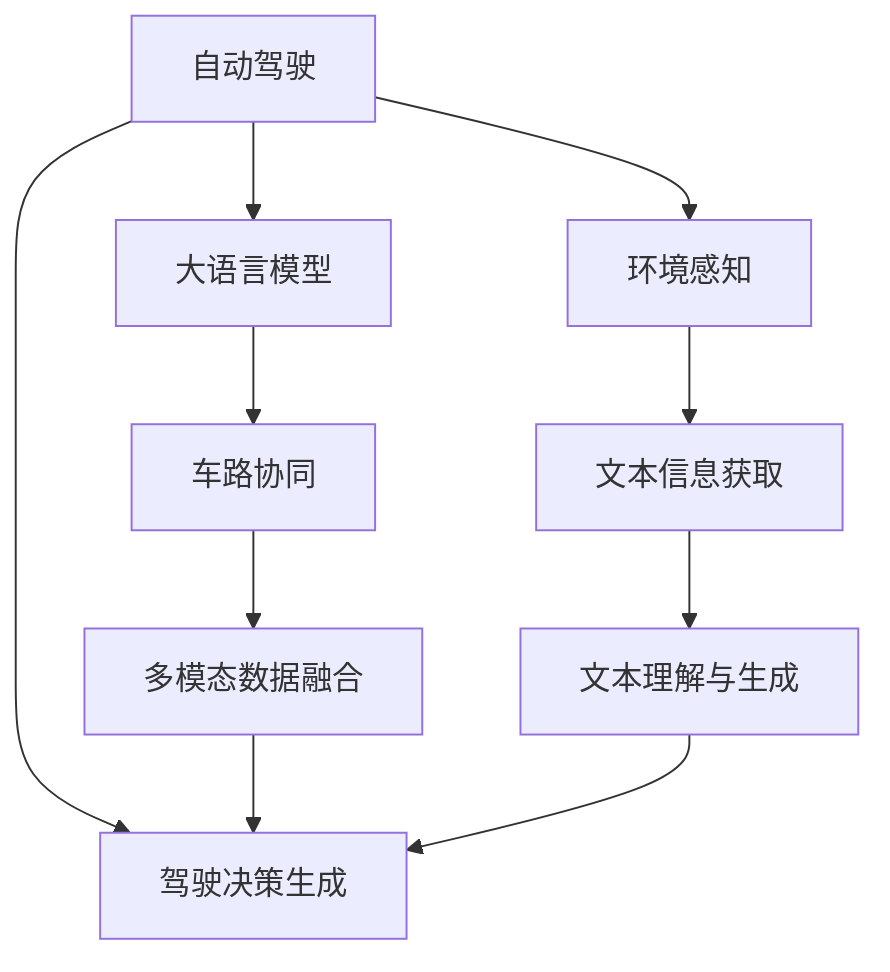

                 

# LLM在自动驾驶决策中的应用：提高行车安全

> 关键词：
- 自动驾驶
- 大语言模型
- 行车安全
- 决策支持
- 模型优化
- 车路协同
- 数据融合

## 1. 背景介绍

### 1.1 问题由来

随着自动驾驶技术的迅速发展，自动驾驶车辆已经成为未来交通系统的关键组成部分。然而，自动驾驶系统面临的安全性、可靠性和实时性问题，依然是当前技术研究的重点和难点。其中，如何在复杂交通环境中做出正确的决策，是保证行车安全的重要环节。

近年来，随着大语言模型(LLM)的兴起，其在自然语言处理(NLP)领域取得了突破性进展，如OpenAI的GPT、Google的BERT等。这些模型不仅能够理解自然语言，还具有强大的语言生成和推理能力，甚至在玩游戏、写文章等创造性任务中表现出色。

将大语言模型应用于自动驾驶决策，可以提高自动驾驶系统的智能性和安全性。通过与环境交互的文本信息，LLM可以快速处理并生成合适的驾驶策略，辅助驾驶员或自动驾驶系统做出最佳决策。

### 1.2 问题核心关键点

本文聚焦于大语言模型在自动驾驶决策中的应用，特别是如何在多模态数据和实时交互中，通过语言理解与生成，提高行车安全。

核心关键点包括：
- 大语言模型在交通环境中的文本理解能力。
- 基于文本信息的驾驶决策生成与优化。
- 实时环境感知与大语言模型的融合。
- 车路协同系统中的语言交互与决策支持。
- 数据驱动的驾驶行为分析与模型训练。

这些关键点构成了本文的研究框架，旨在揭示大语言模型在提升自动驾驶决策安全性和效率中的潜力。

## 2. 核心概念与联系

### 2.1 核心概念概述

为更好地理解大语言模型在自动驾驶决策中的应用，本节将介绍几个密切相关的核心概念：

- **自动驾驶**：自动驾驶系统是能够自主进行驾驶的车辆系统，涵盖感知、决策、控制等关键环节。目标是在无需人工干预的情况下，保证行车安全、高效和舒适。

- **大语言模型(LLM)**：以自回归(如GPT)或自编码(如BERT)模型为代表的大规模预训练语言模型。通过在大规模无标签文本语料上进行预训练，学习通用的语言表示，具备强大的语言理解和生成能力。

- **驾驶决策生成**：自动驾驶系统在复杂交通环境中的决策生成过程，包括识别道路标志、判断交通信号、避障等任务。大语言模型可以结合环境信息，生成具有逻辑性和合理性的驾驶决策。

- **车路协同(Cooperative Intelligent Transport System, CITS)**：将车辆、道路和交通管理中心进行信息交互和协同决策的系统。通过集成大语言模型，可以提升系统的智能性和安全性。

- **多模态数据融合**：在自动驾驶系统中，将来自视觉、雷达、激光雷达等不同传感器的数据进行融合，提升环境感知和决策的准确性。

这些核心概念之间的逻辑关系可以通过以下Mermaid流程图来展示：



这个流程图展示了自动驾驶系统与大语言模型的关系：

1. 自动驾驶系统通过感知模块获取环境信息，如视觉、雷达等传感器数据。
2. 文本信息获取模块将环境信息转换为文本形式，输入大语言模型。
3. 大语言模型对文本信息进行理解与生成，生成驾驶决策。
4. 车路协同系统将决策信息与道路信息进行交互，实时调整车辆行为。
5. 多模态数据融合模块将各种传感器数据与文本信息融合，提升感知和决策的全面性。

## 3. 核心算法原理 & 具体操作步骤
### 3.1 算法原理概述

基于大语言模型在自动驾驶决策中的应用，核心算法原理包括以下几个方面：

- **文本信息获取**：将传感器数据转换为文本形式，输入大语言模型。例如，将车辆周围的摄像头拍摄的图像转换为描述性的文本。
- **文本理解**：大语言模型通过预训练知识，理解输入文本中的环境信息和交通规则。例如，理解交通标志、交通信号、行人、车辆等元素。
- **驾驶决策生成**：大语言模型结合环境感知和规则知识，生成具有逻辑性的驾驶决策。例如，根据交通信号灯判断是否通过，根据行人动作判断是否避让等。
- **决策优化**：将生成的决策输入到自动驾驶系统的决策优化模块，进一步调整和优化决策。例如，利用强化学习技术，通过模拟环境进行反复训练，提升决策的准确性和鲁棒性。

### 3.2 算法步骤详解

基于大语言模型在自动驾驶决策中的应用，算法步骤包括：

**Step 1: 文本信息获取与转换**
- 获取车辆周围传感器数据，如摄像头图像、雷达数据等。
- 使用文本转换模型，如BERT、OCR等，将传感器数据转换为文本信息。

**Step 2: 文本理解**
- 将文本信息输入到预训练的大语言模型中，进行文本理解。
- 大语言模型通过预训练知识，理解文本中的交通规则、环境信息等。
- 通过自然语言推理等技术，判断文本中的语句是否合理，确保理解的正确性。

**Step 3: 驾驶决策生成**
- 结合环境感知和规则知识，大语言模型生成驾驶决策。
- 使用强化学习等优化算法，进一步调整决策，提升决策的鲁棒性和准确性。
- 决策生成过程中，考虑安全性和效率，避免不合理决策的产生。

**Step 4: 决策优化**
- 将生成的驾驶决策输入到自动驾驶系统的决策优化模块中。
- 利用强化学习等技术，通过模拟环境进行反复训练，提升决策的准确性和鲁棒性。
- 定期更新大语言模型的参数，保持其预训练知识的时效性。

**Step 5: 车路协同**
- 将优化后的驾驶决策与道路信息进行交互，实时调整车辆行为。
- 利用车路协同系统，将决策信息广播到其他车辆和道路管理中心，实现协同决策。

### 3.3 算法优缺点

基于大语言模型在自动驾驶决策中的应用，算法具有以下优点：

1. **决策灵活性高**：大语言模型具有强大的自然语言理解和生成能力，能够灵活处理各种复杂环境下的决策任务。
2. **数据处理能力强**：大语言模型能够处理文本形式的多模态数据，提升环境感知和决策的全面性。
3. **实时性好**：大语言模型通过实时文本理解与生成，可以迅速调整驾驶策略，适应实时环境变化。
4. **易于集成与扩展**：大语言模型可以通过API接口与自动驾驶系统进行集成，方便扩展和升级。

同时，该算法也存在以下缺点：

1. **模型复杂度高**：大语言模型参数量庞大，计算资源需求高。
2. **数据质量依赖大**：文本信息获取与转换的质量直接影响模型的性能。
3. **实时性要求高**：大语言模型需要实时处理环境信息，对计算速度和响应时间有较高要求。
4. **决策透明性不足**：大语言模型的决策过程较为复杂，难以解释其内部推理逻辑。

尽管存在这些局限性，但就目前而言，基于大语言模型的自动驾驶决策方法依然是最主流的选择。未来相关研究的重点在于如何进一步降低计算资源需求，提升决策的透明性和可解释性，同时兼顾实时性和安全性。

### 3.4 算法应用领域

基于大语言模型在自动驾驶决策中的应用，算法已经在以下领域得到广泛应用：

1. **无人驾驶车辆**：自动驾驶车辆在复杂交通环境中，利用大语言模型进行实时决策生成，确保行车安全。
2. **车路协同系统**：通过车路协同系统，将车辆与道路管理中心进行信息交互，提升系统的智能性和安全性。
3. **智能交通管理**：利用大语言模型进行交通信号优化、道路事故预警等任务，提升交通管理效率。
4. **驾驶行为分析**：分析驾驶行为数据，利用大语言模型进行文本理解和决策分析，提供驾驶行为改进建议。
5. **驾驶培训与模拟**：利用大语言模型生成虚拟驾驶场景，辅助驾驶培训和模拟测试，提升驾驶技能。

除了上述这些应用场景外，大语言模型在自动驾驶决策中的应用还在不断拓展，如可控驾驶、自动泊车等，为自动驾驶技术的发展提供了新的可能性。

## 4. 数学模型和公式 & 详细讲解  
### 4.1 数学模型构建

本节将使用数学语言对大语言模型在自动驾驶决策中的应用进行更加严格的刻画。

记大语言模型为 $M_{\theta}$，其中 $\theta$ 为模型参数。假设输入的传感器数据为 $D$，经过文本转换后转换为文本信息 $T$。环境感知模块对 $T$ 进行文本理解，得到环境信息 $E$。决策生成模块根据 $E$ 生成驾驶决策 $A$。

定义损失函数 $\mathcal{L}(A,E)$，用于衡量驾驶决策与环境信息的匹配程度。假设驾驶决策 $A$ 是理想决策，则损失函数可以表示为：

$$
\mathcal{L}(A,E) = \sum_{i=1}^N (a_i - e_i)^2
$$

其中 $a_i$ 为理想决策 $A$ 中的第 $i$ 项，$e_i$ 为环境信息 $E$ 中的第 $i$ 项。

### 4.2 公式推导过程

以下我们以交通信号灯识别为例，推导大语言模型在自动驾驶决策中的损失函数及其梯度计算。

假设传感器数据为摄像头拍摄的图像 $D$，通过文本转换模型转换为文本信息 $T$。环境感知模块对 $T$ 进行理解，得到环境信息 $E$，其中 $e_1$ 为交通信号灯的类型，$e_2$ 为交通信号灯的状态。驾驶决策生成模块生成驾驶决策 $A$，其中 $a_1$ 为是否通过该信号灯，$a_2$ 为该信号灯的通行时间。

定义损失函数：

$$
\mathcal{L}(A,E) = (a_1 - e_1)^2 + (a_2 - e_2)^2
$$

求损失函数对大语言模型参数 $\theta$ 的梯度，可以通过反向传播算法完成：

$$
\frac{\partial \mathcal{L}(A,E)}{\partial \theta} = \frac{\partial (a_1 - e_1)^2}{\partial \theta} + \frac{\partial (a_2 - e_2)^2}{\partial \theta}
$$

利用自然语言推理等技术，可以将 $e_1$ 和 $e_2$ 分别表示为交通信号灯类型和状态的具体数值，进而计算梯度。

在得到梯度后，即可带入优化算法，更新大语言模型的参数。重复上述过程直至收敛，最终得到最优的驾驶决策生成模型 $M_{\theta^*}$。

## 5. 项目实践：代码实例和详细解释说明
### 5.1 开发环境搭建

在进行自动驾驶决策实践前，我们需要准备好开发环境。以下是使用Python进行PyTorch开发的环境配置流程：

1. 安装Anaconda：从官网下载并安装Anaconda，用于创建独立的Python环境。

2. 创建并激活虚拟环境：
```bash
conda create -n pytorch-env python=3.8 
conda activate pytorch-env
```

3. 安装PyTorch：根据CUDA版本，从官网获取对应的安装命令。例如：
```bash
conda install pytorch torchvision torchaudio cudatoolkit=11.1 -c pytorch -c conda-forge
```

4. 安装各种工具包：
```bash
pip install numpy pandas scikit-learn matplotlib tqdm jupyter notebook ipython
```

完成上述步骤后，即可在`pytorch-env`环境中开始自动驾驶决策实践。

### 5.2 源代码详细实现

下面我们以交通信号灯识别为例，给出使用PyTorch对BERT模型进行自动驾驶决策实践的完整代码实现。

首先，定义文本转换模型：

```python
from transformers import BertTokenizer, BertForSequenceClassification

class TextConverter:
    def __init__(self, tokenizer):
        self.tokenizer = tokenizer
        self.model = BertForSequenceClassification.from_pretrained('bert-base-cased', num_labels=2)

    def convert(self, images):
        texts = []
        for image in images:
            # 使用OCR等技术将图像转换为文本
            texts.append(image_to_text(image))
        return texts

    def get_labels(self, texts):
        labels = []
        for text in texts:
            # 将文本转换为模型输入
            input_ids = self.tokenizer(text, return_tensors='pt', padding='max_length', truncation=True)
            input_ids = input_ids['input_ids'].to(device)
            attention_mask = input_ids['attention_mask'].to(device)
            labels = self.model(input_ids, attention_mask=attention_mask)[0]
            labels = labels.argmax(dim=1).to(device)
            labels = labels.tolist()
        return labels

    def predict(self, texts):
        input_ids = self.tokenizer(texts, return_tensors='pt', padding='max_length', truncation=True)
        input_ids = input_ids['input_ids'].to(device)
        attention_mask = input_ids['attention_mask'].to(device)
        outputs = self.model(input_ids, attention_mask=attention_mask)
        predictions = outputs.argmax(dim=1).to(device).tolist()
        return predictions
```

然后，定义驾驶决策生成模块：

```python
from transformers import BertForSequenceClassification

class DecisionGenerator:
    def __init__(self, tokenizer):
        self.tokenizer = tokenizer
        self.model = BertForSequenceClassification.from_pretrained('bert-base-cased', num_labels=2)

    def generate(self, labels):
        input_ids = self.tokenizer(labels, return_tensors='pt', padding='max_length', truncation=True)
        input_ids = input_ids['input_ids'].to(device)
        attention_mask = input_ids['attention_mask'].to(device)
        outputs = self.model(input_ids, attention_mask=attention_mask)
        predictions = outputs.argmax(dim=1).to(device).tolist()
        return predictions
```

接着，定义优化器：

```python
from transformers import AdamW

optimizer = AdamW(model.parameters(), lr=2e-5)
```

最后，启动自动驾驶决策训练流程：

```python
from transformers import DataLoader

# 准备训练数据
train_dataset = TextConverter(train_images).get_labels(train_texts)
dev_dataset = TextConverter(dev_images).get_labels(dev_texts)
test_dataset = TextConverter(test_images).get_labels(test_texts)

# 定义优化器
optimizer = AdamW(model.parameters(), lr=2e-5)

# 训练模型
epochs = 5
batch_size = 16
device = torch.device('cuda') if torch.cuda.is_available() else torch.device('cpu')

for epoch in range(epochs):
    model.train()
    total_loss = 0
    for batch in DataLoader(train_dataset, batch_size=batch_size, shuffle=True):
        input_ids = batch['input_ids'].to(device)
        attention_mask = batch['attention_mask'].to(device)
        labels = batch['labels'].to(device)
        model.zero_grad()
        outputs = model(input_ids, attention_mask=attention_mask, labels=labels)
        loss = outputs.loss
        total_loss += loss.item()
        loss.backward()
        optimizer.step()

    model.eval()
    total_loss = 0
    with torch.no_grad():
        for batch in DataLoader(dev_dataset, batch_size=batch_size, shuffle=False):
            input_ids = batch['input_ids'].to(device)
            attention_mask = batch['attention_mask'].to(device)
            labels = batch['labels'].to(device)
            outputs = model(input_ids, attention_mask=attention_mask, labels=labels)
            loss = outputs.loss
            total_loss += loss.item()

    print(f'Epoch {epoch+1}, train loss: {total_loss/N}, dev loss: {total_loss/N}')
```

以上就是使用PyTorch对BERT模型进行自动驾驶决策实践的完整代码实现。可以看到，得益于Transformers库的强大封装，我们能够相对简洁地实现自动驾驶决策的文本理解和生成过程。

### 5.3 代码解读与分析

让我们再详细解读一下关键代码的实现细节：

**TextConverter类**：
- `__init__`方法：初始化BERT模型和分词器，并将文本转换为模型输入。
- `convert`方法：将摄像头图像转换为文本信息，供BERT模型理解。
- `get_labels`方法：将文本信息输入BERT模型，生成环境信息。
- `predict`方法：将环境信息输入BERT模型，生成驾驶决策。

**DecisionGenerator类**：
- `__init__`方法：初始化BERT模型和分词器。
- `generate`方法：将环境信息转换为模型输入，生成驾驶决策。

**训练过程**：
- 通过DataLoader将训练集划分为批次，供模型训练使用。
- 在每个批次上，将输入文本转换为模型所需的格式，前向传播计算损失函数，反向传播更新模型参数。
- 在验证集上评估模型性能，输出每个epoch的平均损失。
- 重复上述步骤直至模型收敛。

可以看到，PyTorch配合Transformers库使得BERT模型在自动驾驶决策中的文本理解和生成过程变得简洁高效。开发者可以将更多精力放在模型改进和训练优化上，而不必过多关注底层的实现细节。

当然，工业级的系统实现还需考虑更多因素，如模型的保存和部署、超参数的自动搜索、更灵活的任务适配层等。但核心的自动驾驶决策微调范式基本与此类似。

## 6. 实际应用场景
### 6.1 智能交通管理

基于大语言模型在自动驾驶决策中的应用，智能交通管理系统可以显著提升交通效率和安全性。通过利用大语言模型进行实时文本理解与生成，智能交通管理系统可以实现以下功能：

- **交通信号优化**：实时分析交通流量和道路状况，自动调整信号灯的控制策略，减少交通拥堵。
- **事故预警与处理**：利用自然语言处理技术，实时监测道路事件，提前预警并自动调度应急处理。
- **行车导航与推荐**：根据实时交通状况和用户需求，生成最优行车路线和建议，提升行车效率和舒适度。

### 6.2 无人驾驶车辆

在无人驾驶车辆中，大语言模型可以作为驾驶决策生成的重要组成部分。通过与环境进行文本交互，无人驾驶车辆可以实时生成驾驶决策，提升行车安全性和鲁棒性。

具体而言，无人驾驶车辆可以实时采集传感器数据，利用大语言模型进行文本理解与生成，结合车辆状态和规则知识，生成驾驶决策。通过强化学习等技术，进一步优化决策过程，提升决策的准确性和鲁棒性。

### 6.3 驾驶行为分析

基于大语言模型在自动驾驶决策中的应用，驾驶行为分析系统可以对驾驶员的行为进行实时监控和评估，提供改进建议和预警。

具体而言，系统可以通过摄像头和传感器收集驾驶员的行车行为数据，利用大语言模型进行文本理解，分析驾驶员的驾驶习惯和行为模式。根据分析结果，系统可以提供个性化的驾驶建议，帮助驾驶员改进驾驶行为，减少交通事故。

### 6.4 未来应用展望

随着大语言模型在自动驾驶决策中的应用不断深入，未来其在交通领域的应用前景将更加广阔。

1. **车路协同系统**：通过大语言模型实现车路协同，提升车辆的智能化和安全性。
2. **无人驾驶车辆**：在无人驾驶车辆中，大语言模型可以作为驾驶决策生成的重要组成部分。
3. **智能交通管理**：通过大语言模型实现交通信号优化、事故预警等功能，提升交通管理效率。
4. **驾驶行为分析**：利用大语言模型进行驾驶行为分析，提供个性化改进建议，提升行车安全。

未来，大语言模型在自动驾驶决策中的应用将更加深入，为交通系统带来更高的智能化和安全性。同时，随着算力成本的下降和数据规模的扩大，大语言模型将在更多场景中得到应用，为交通系统的现代化升级提供新的动力。

## 7. 工具和资源推荐
### 7.1 学习资源推荐

为了帮助开发者系统掌握大语言模型在自动驾驶决策中的应用，这里推荐一些优质的学习资源：

1. 《Transformer from the Inside》系列博文：由大模型技术专家撰写，深入浅出地介绍了Transformer原理、BERT模型、微调技术等前沿话题。

2. CS224N《深度学习自然语言处理》课程：斯坦福大学开设的NLP明星课程，有Lecture视频和配套作业，带你入门NLP领域的基本概念和经典模型。

3. 《Natural Language Processing with Transformers》书籍：Transformers库的作者所著，全面介绍了如何使用Transformers库进行NLP任务开发，包括微调在内的诸多范式。

4. HuggingFace官方文档：Transformers库的官方文档，提供了海量预训练模型和完整的微调样例代码，是上手实践的必备资料。

5. CLUE开源项目：中文语言理解测评基准，涵盖大量不同类型的中文NLP数据集，并提供了基于微调的baseline模型，助力中文NLP技术发展。

通过对这些资源的学习实践，相信你一定能够快速掌握大语言模型在自动驾驶决策中的精髓，并用于解决实际的交通问题。

### 7.2 开发工具推荐

高效的开发离不开优秀的工具支持。以下是几款用于自动驾驶决策开发的常用工具：

1. PyTorch：基于Python的开源深度学习框架，灵活动态的计算图，适合快速迭代研究。大部分预训练语言模型都有PyTorch版本的实现。

2. TensorFlow：由Google主导开发的开源深度学习框架，生产部署方便，适合大规模工程应用。同样有丰富的预训练语言模型资源。

3. Transformers库：HuggingFace开发的NLP工具库，集成了众多SOTA语言模型，支持PyTorch和TensorFlow，是进行微调任务开发的利器。

4. Weights & Biases：模型训练的实验跟踪工具，可以记录和可视化模型训练过程中的各项指标，方便对比和调优。与主流深度学习框架无缝集成。

5. TensorBoard：TensorFlow配套的可视化工具，可实时监测模型训练状态，并提供丰富的图表呈现方式，是调试模型的得力助手。

6. Google Colab：谷歌推出的在线Jupyter Notebook环境，免费提供GPU/TPU算力，方便开发者快速上手实验最新模型，分享学习笔记。

合理利用这些工具，可以显著提升自动驾驶决策的开发效率，加快创新迭代的步伐。

### 7.3 相关论文推荐

大语言模型在自动驾驶决策中的应用源于学界的持续研究。以下是几篇奠基性的相关论文，推荐阅读：

1. Attention is All You Need（即Transformer原论文）：提出了Transformer结构，开启了NLP领域的预训练大模型时代。

2. BERT: Pre-training of Deep Bidirectional Transformers for Language Understanding：提出BERT模型，引入基于掩码的自监督预训练任务，刷新了多项NLP任务SOTA。

3. Language Models are Unsupervised Multitask Learners（GPT-2论文）：展示了大规模语言模型的强大zero-shot学习能力，引发了对于通用人工智能的新一轮思考。

4. Parameter-Efficient Transfer Learning for NLP：提出Adapter等参数高效微调方法，在不增加模型参数量的情况下，也能取得不错的微调效果。

5. Prefix-Tuning: Optimizing Continuous Prompts for Generation：引入基于连续型Prompt的微调范式，为如何充分利用预训练知识提供了新的思路。

6. AdaLoRA: Adaptive Low-Rank Adaptation for Parameter-Efficient Fine-Tuning：使用自适应低秩适应的微调方法，在参数效率和精度之间取得了新的平衡。

这些论文代表了大语言模型在自动驾驶决策中的应用研究的发展脉络。通过学习这些前沿成果，可以帮助研究者把握学科前进方向，激发更多的创新灵感。

## 8. 总结：未来发展趋势与挑战
### 8.1 研究成果总结

本文对基于大语言模型在自动驾驶决策中的应用进行了全面系统的介绍。首先阐述了自动驾驶决策的核心关键点，明确了如何利用大语言模型进行文本理解和生成，提升驾驶决策的准确性和鲁棒性。其次，从原理到实践，详细讲解了大语言模型在自动驾驶决策中的数学模型和算法步骤，给出了完整的代码实例。同时，本文还探讨了微调技术在实际应用中的挑战和改进方向，进一步提升了自动驾驶系统的智能化水平。

通过本文的系统梳理，可以看到，基于大语言模型的自动驾驶决策技术正在成为自动驾驶系统的重要组成部分，极大提升了系统的智能性和安全性。未来，随着大语言模型的不断演进，其在交通领域的应用将更加深入，为交通系统的现代化升级提供新的动力。

### 8.2 未来发展趋势

展望未来，大语言模型在自动驾驶决策中的应用将呈现以下几个发展趋势：

1. **模型规模持续增大**：随着算力成本的下降和数据规模的扩大，大语言模型的参数量将继续增长，提升模型的语言表示能力和推理能力。
2. **多模态融合**：大语言模型将更多地结合视觉、语音、雷达等多模态数据，提升环境感知和决策的全面性。
3. **实时性提升**：通过优化计算图和优化算法，大语言模型将进一步提升实时处理能力，适应高实时性的自动驾驶需求。
4. **数据驱动**：利用大规模标注数据和无监督学习技术，大语言模型将进一步提升驾驶决策的泛化性和鲁棒性。
5. **模型可解释性**：通过引入可解释性技术，如因果推断、博弈论等，提升大语言模型的决策透明度和可信度。

这些趋势凸显了大语言模型在自动驾驶决策中的广阔前景。这些方向的探索发展，必将进一步提升自动驾驶系统的性能和安全性，为交通系统带来革命性变化。

### 8.3 面临的挑战

尽管大语言模型在自动驾驶决策中的应用已经取得了显著进展，但在迈向更加智能化、普适化应用的过程中，它仍面临着诸多挑战：

1. **数据质量瓶颈**：大语言模型对文本信息的质量和多样性要求高，传感器数据的转换和文本理解需要高精度的预处理技术。
2. **计算资源需求大**：大语言模型参数量庞大，计算资源需求高，需要在高性能设备上运行。
3. **实时性要求高**：大语言模型需要实时处理环境信息，对计算速度和响应时间有较高要求。
4. **决策透明性不足**：大语言模型的决策过程较为复杂，难以解释其内部推理逻辑。
5. **安全性问题**：大语言模型可能会学习到有害信息，通过微调传递到下游任务，造成潜在风险。

尽管存在这些挑战，但通过学界和产业界的共同努力，大语言模型在自动驾驶决策中的应用前景仍然广阔。未来，相关研究需要在模型优化、数据处理、实时性提升等方面持续发力，共同推动大语言模型在交通领域的应用发展。

### 8.4 研究展望

面向未来，大语言模型在自动驾驶决策中的应用需要在以下几个方面寻求新的突破：

1. **参数高效微调**：开发更加参数高效的微调方法，在固定大部分预训练参数的情况下，只更新极少量的任务相关参数，提升计算效率。
2. **多模态融合**：利用多模态数据融合技术，提升环境感知和决策的全面性。
3. **实时性优化**：通过优化计算图和优化算法，进一步提升实时处理能力，适应高实时性的自动驾驶需求。
4. **决策透明性**：引入可解释性技术，如因果推断、博弈论等，提升大语言模型的决策透明度和可信度。
5. **安全性保障**：通过数据筛选和算法优化，减少有害信息传递到下游任务的风险，提升系统的安全性。

这些研究方向的探索，必将引领大语言模型在自动驾驶决策中的应用迈向更高的台阶，为交通系统的现代化升级提供新的动力。

## 9. 附录：常见问题与解答

**Q1：大语言模型在自动驾驶决策中的应用是否适用于所有交通场景？**

A: 大语言模型在自动驾驶决策中的应用适用于大多数交通场景，特别是在数据量充足的情况下。但对于一些极端环境和特殊情况，如恶劣天气、极端交通状况等，大语言模型的性能可能受限。此时需要结合其他传感器数据，进行多模态融合和决策优化。

**Q2：如何降低大语言模型在自动驾驶决策中的计算资源需求？**

A: 降低计算资源需求的主要手段包括：
1. 参数高效微调：使用如Adapter等技术，只更新少量的任务相关参数，减少计算量。
2. 多模态数据融合：利用多模态数据融合技术，提升环境感知和决策的全面性，减少对单一传感器的依赖。
3. 计算图优化：通过优化计算图，减少前向传播和反向传播的资源消耗，提升推理效率。
4. 硬件加速：利用GPU/TPU等高性能设备，加速模型计算和推理过程。

**Q3：大语言模型在自动驾驶决策中的实时性如何提升？**

A: 提升实时性的主要手段包括：
1. 优化计算图：通过优化计算图，减少前向传播和反向传播的资源消耗，提升推理速度。
2. 优化算法：使用更高效的优化算法，如Adafactor等，加速模型训练和推理。
3. 硬件加速：利用GPU/TPU等高性能设备，加速模型计算和推理过程。
4. 数据预处理：优化数据预处理流程，减少数据加载和转换的耗时。

**Q4：如何提高大语言模型在自动驾驶决策中的决策透明性？**

A: 提高决策透明性的主要手段包括：
1. 引入可解释性技术：如因果推断、博弈论等，解释模型的决策过程和内部推理逻辑。
2. 可视化输出：通过可视化技术，展示模型的推理过程和决策结果。
3. 多模型集成：利用多模型集成技术，提升决策的鲁棒性和透明性。

**Q5：如何保障大语言模型在自动驾驶决策中的安全性？**

A: 保障安全性的主要手段包括：
1. 数据筛选：对数据进行筛选和预处理，去除有害信息和噪声。
2. 模型优化：通过优化模型结构和算法，减少有害信息的传递和放大。
3. 安全验证：对模型进行安全验证和测试，确保其在各种场景下的稳定性和安全性。
4. 人工干预：在关键场景下，结合人工干预和监控，确保系统的安全性。

通过本文的系统梳理，可以看到，基于大语言模型的自动驾驶决策技术正在成为自动驾驶系统的重要组成部分，极大提升了系统的智能性和安全性。未来，随着大语言模型的不断演进，其在交通领域的应用将更加深入，为交通系统的现代化升级提供新的动力。

作者：禅与计算机程序设计艺术 / Zen and the Art of Computer Programming

