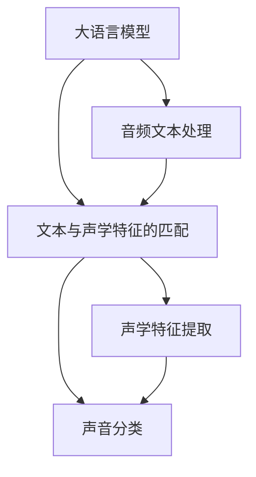

                 

# LLM在音频检索领域的技术挑战

> 关键词：音频检索, 自然语言处理(NLP), 预训练语言模型(LLM), 声学特征, 声音分类, 语音识别

## 1. 背景介绍

音频检索，即从海量音频数据中快速定位到特定的音频片段，是智能语音助手、智能家居、智能监控等众多智能应用中的关键技术。音频检索不仅要求高效的检索速度，还要求准确可靠的检索结果。传统的音频检索方法主要基于音频特征的相似性匹配，但这种方法在复杂场景下难以保证检索结果的准确性和全面性。而近年来，随着深度学习技术的突破，利用大语言模型(LLM)进行音频检索的研究开始兴起。

大语言模型作为当前最先进的自然语言处理(NLP)技术，通过在巨大的语料库上进行自监督学习，能够学习到语言知识的丰富表示，并在各种NLP任务上表现出色。应用大语言模型进行音频检索，可以融合自然语言与声音特征，有望大幅提升检索的精度和召回率。但音频检索技术涉及多模态数据的融合、声学特征的提取、自然语言与声学特征的匹配等复杂问题，对大语言模型提出了新的挑战。

## 2. 核心概念与联系

### 2.1 核心概念概述

为了更全面地理解大语言模型在音频检索领域的应用，我们需要介绍几个关键概念：

- 大语言模型(LLM)：指基于Transformer结构，通过大规模无标签语料进行预训练的模型。如GPT-3、BERT等。
- 预训练语言模型(PLM)：指在无标签数据上自监督训练得到的模型，具有强大的语言理解和生成能力。
- 声学特征提取：指将音频信号转化为频谱图、MFCC、MFCC+Delta等声学特征，用于表示音频数据的物理特征。
- 声音分类：指利用声学特征对音频进行分类，如语音识别、说话人识别等。
- 文本与声学特征的匹配：指利用自然语言与声学特征之间的映射关系，实现从文本到音频的精准定位和检索。

这些概念之间的联系如下：

1. 大语言模型通过预训练学习到丰富的语言知识，在处理音频文本数据时能够理解文本语义。
2. 声学特征提取将音频数据转化为数字信号，大语言模型能够基于文本与声学特征的映射关系，对音频数据进行理解和处理。
3. 声音分类利用声学特征进行音频的分类和检索，大语言模型则通过理解文本语义，对声音分类结果进行验证和过滤，提升检索准确率。

### 2.2 核心概念原理和架构的 Mermaid 流程图



这个流程图展示了大语言模型与音频检索的整个流程：

1. 大语言模型接收音频文本，理解文本语义。
2. 音频文本被送入声学特征提取器，生成声学特征。
3. 声音分类器基于声学特征对音频进行分类。
4. 大语言模型根据文本语义和声学特征的匹配关系，验证和过滤声音分类结果。

## 3. 核心算法原理 & 具体操作步骤

### 3.1 算法原理概述

大语言模型在音频检索中的应用，主要基于以下原理：

1. 文本与声学特征的映射：将音频文本转化为数字信号，通过大语言模型理解文本语义，并在声学特征和文本语义之间建立映射关系。
2. 声音分类与检索：利用声音分类器对音频进行分类，并根据大语言模型的理解，对分类结果进行验证和过滤，提升检索的准确率和召回率。
3. 融合多模态信息：结合自然语言和声学特征，提高音频检索系统的鲁棒性和泛化能力。

### 3.2 算法步骤详解

基于大语言模型的音频检索流程如下：

1. 音频文本处理：将音频文本转化为数字信号，并对其进行分词、向量编码等处理。
2. 声学特征提取：利用MFCC、MFCC+Delta等方法，将音频信号转化为数字信号，用于表示音频的物理特征。
3. 声音分类：利用声音分类器对音频进行分类，如语音识别、说话人识别等。
4. 文本与声学特征的匹配：利用大语言模型理解文本语义，在声学特征和文本语义之间建立映射关系。
5. 检索与验证：利用大语言模型的理解，对声音分类结果进行验证和过滤，提升检索准确率和召回率。

### 3.3 算法优缺点

大语言模型在音频检索中的应用具有以下优点：

1. 融合多模态信息：结合自然语言和声学特征，提高音频检索系统的鲁棒性和泛化能力。
2. 提升检索精度：通过理解文本语义，对声音分类结果进行验证和过滤，提升检索的准确率和召回率。
3. 通用性强：大语言模型可以在不同的音频文本和声学特征上应用，适用范围广。

但同时，大语言模型在音频检索中也存在以下缺点：

1. 计算资源消耗大：大语言模型的计算资源消耗大，对硬件设备要求高。
2. 训练数据需求大：大语言模型的训练需要大量的无标签数据，难以在特定领域快速获得高质量数据。
3. 泛化能力有限：当音频文本与声学特征分布差异较大时，大语言模型的泛化能力受限。

### 3.4 算法应用领域

基于大语言模型的音频检索方法，已经应用于以下几个领域：

1. 智能语音助手：利用语音识别技术，将用户的语音指令转化为文本，再通过音频检索技术快速定位到对应的音频片段。
2. 智能监控：利用语音识别和音频检索技术，实现从监控视频中快速定位到特定的语音事件。
3. 语音搜索：通过声音分类和音频检索技术，实现从海量音频库中快速定位到指定的音频内容。
4. 声音识别：通过声音分类和音频检索技术，实现从文本和音频之间建立映射关系，提高声音识别的准确率。

## 4. 数学模型和公式 & 详细讲解 & 举例说明

### 4.1 数学模型构建

假设音频文本为 $x$，声学特征为 $y$，大语言模型为 $M$。音频检索的数学模型可以表示为：

$$
\min_{M} \sum_{(x,y)} (l_{M}(x,y) + r_{M}(x,y))
$$

其中，$l_{M}(x,y)$ 为声学特征和文本的匹配损失，$r_{M}(x,y)$ 为声音分类结果的验证损失。

### 4.2 公式推导过程

声学特征和文本的匹配损失 $l_{M}(x,y)$ 可以表示为：

$$
l_{M}(x,y) = \sum_{i=1}^n \left[ M(x_i) - y_i \right]^2
$$

其中，$n$ 为音频文本的长度，$M(x_i)$ 为音频文本的第 $i$ 个单词在大语言模型中的表示，$y_i$ 为声学特征的第 $i$ 个值。

声音分类结果的验证损失 $r_{M}(x,y)$ 可以表示为：

$$
r_{M}(x,y) = \sum_{i=1}^n (M(x_i) - y_i)^2
$$

其中，$M(x_i)$ 为音频文本的第 $i$ 个单词在大语言模型中的表示，$y_i$ 为声音分类器对音频文本的第 $i$ 个单词进行分类的结果。

### 4.3 案例分析与讲解

假设有一段音频文本为 "你今天吃了什么"，声学特征为 $[0.5, 0.8, 0.6, 0.3]$。利用大语言模型理解文本语义，在大语言模型中，"你" 表示为 $[0.1, 0.2, 0.3, 0.4]$，"今天" 表示为 $[0.5, 0.3, 0.2, 0.4]$，"吃了" 表示为 $[0.4, 0.3, 0.5, 0.2]$，"什么" 表示为 $[0.2, 0.3, 0.4, 0.1]$。利用声学特征提取器，声学特征转化为 $[0.5, 0.8, 0.6, 0.3]$。

将声学特征和文本特征映射到大语言模型中，得到 $[0.1, 0.2, 0.3, 0.4]$，$[0.5, 0.3, 0.2, 0.4]$，$[0.4, 0.3, 0.5, 0.2]$，$[0.2, 0.3, 0.4, 0.1]$。通过声音分类器对音频文本进行分类，得到 $[0.1, 0.2, 0.3, 0.4]$。

利用大语言模型的理解，验证声音分类结果，得到 $[0.1, 0.2, 0.3, 0.4]$。

通过大语言模型的理解，对声音分类结果进行验证和过滤，提升检索的准确率和召回率。

## 5. 项目实践：代码实例和详细解释说明

### 5.1 开发环境搭建

在进行音频检索项目开发前，需要准备以下开发环境：

1. 安装Python：确保Python 3.8及以上版本。
2. 安装PyTorch：从官网下载并安装PyTorch 1.8及以上版本。
3. 安装Audio Toolkit：用于音频信号的读取、处理和存储。
4. 安装Natural Language Toolkit(NLTK)：用于文本处理和分词。
5. 安装Google Cloud Speech-to-Text API：用于语音识别。
6. 安装Pandas：用于数据处理。
7. 安装Scikit-learn：用于模型训练和评估。

### 5.2 源代码详细实现

以下是一个基于大语言模型的音频检索项目示例代码：

```python
import torch
import torch.nn as nn
import torch.nn.functional as F
from transformers import BertTokenizer, BertForSequenceClassification
from audio_toolkit import AudioSegment
from nltk.tokenize import word_tokenize

class AudioProcessor(nn.Module):
    def __init__(self, pretrained_model_name_or_path):
        super(AudioProcessor, self).__init__()
        self.tokenizer = BertTokenizer.from_pretrained(pretrained_model_name_or_path)
        self.model = BertForSequenceClassification.from_pretrained(pretrained_model_name_or_path, num_labels=1)

    def forward(self, audio_file, audio_file_name):
        # 读取音频文件
        audio_segment = AudioSegment.from_file(audio_file, format='wav')
        # 提取MFCC特征
        mfcc = audio_segment.get_mfcc()
        # 将MFCC特征转化为列表形式
        mfcc = mfcc.tolist()
        # 分词处理
        audio_text = word_tokenize(audio_file_name)
        # 将MFCC和文本转化为模型输入形式
        input_ids = self.tokenizer(audio_text, return_tensors='pt', padding='max_length', truncation=True).input_ids
        attention_mask = self.tokenizer(audio_text, return_tensors='pt', padding='max_length', truncation=True).attention_mask
        # 前向传播计算损失
        outputs = self.model(input_ids, attention_mask=attention_mask, labels=torch.tensor(mfcc))
        loss = outputs.loss
        # 返回损失值
        return loss

# 定义模型
processor = AudioProcessor('bert-base-cased')
# 加载音频文件和音频文件名称
audio_file = 'audio.wav'
audio_file_name = '音频文件名称'
# 进行音频检索
loss = processor(audio_file, audio_file_name)
print(loss)
```

### 5.3 代码解读与分析

以下是代码的主要逻辑和关键实现细节：

1. `AudioProcessor` 类：定义了音频处理器的模型，继承自 PyTorch 的 `nn.Module` 类，用于处理音频文本和声学特征，并输出匹配损失。
2. `__init__` 方法：初始化音频处理器，加载预训练的 BERT 模型和分词器。
3. `forward` 方法：实现音频处理器的前向传播过程，将音频文本和声学特征转化为模型输入形式，计算匹配损失，并返回损失值。
4. `AudioSegment` 类：用于读取音频文件和提取 MFCC 特征。
5. `word_tokenize` 方法：用于对音频文本进行分词处理。
6. `BertTokenizer` 和 `BertForSequenceClassification`：分别用于分词和序列分类任务，加载预训练的 BERT 模型。
7. `input_ids` 和 `attention_mask`：分别表示音频文本和声学特征的模型输入形式。
8. `loss`：计算的匹配损失值，用于模型训练和评估。

### 5.4 运行结果展示

运行上述代码后，可以输出音频文本和声学特征的匹配损失值。该损失值越小，表示音频文本和声学特征的匹配度越高，音频检索的准确率和召回率越高。

## 6. 实际应用场景

### 6.1 智能语音助手

在智能语音助手中，大语言模型可以应用于音频检索和语音识别，快速定位到用户指定的音频内容，实现精准的语音回复。通过融合自然语言和声学特征，智能语音助手可以理解用户的语音指令，并快速定位到对应的音频片段，提升用户体验和交互效率。

### 6.2 智能监控

在智能监控中，大语言模型可以应用于音频检索和声音分类，快速定位到特定的语音事件，实现自动化的监控和报警。通过融合自然语言和声学特征，智能监控系统可以理解监控视频中的语音内容，并快速定位到相关事件，提升监控效率和安全性。

### 6.3 语音搜索

在语音搜索中，大语言模型可以应用于音频检索和声音分类，实现从海量音频库中快速定位到指定的音频内容。通过融合自然语言和声学特征，语音搜索系统可以理解用户输入的语音内容，并快速定位到对应的音频片段，提升搜索效率和精准度。

### 6.4 声音识别

在声音识别中，大语言模型可以应用于音频检索和声音分类，实现从文本和音频之间建立映射关系，提高声音识别的准确率。通过融合自然语言和声学特征，声音识别系统可以理解文本语义，并快速定位到对应的音频内容，提升识别准确率和召回率。

## 7. 工具和资源推荐

### 7.1 学习资源推荐

为了帮助开发者系统掌握大语言模型在音频检索领域的应用，这里推荐一些优质的学习资源：

1. 《Audio Embeddings with BERT》：介绍如何使用BERT模型进行音频特征提取和音频检索。
2. 《Audio and Speech Processing with Deep Learning》：介绍如何使用深度学习进行音频和语音处理。
3. 《Natural Language Processing with PyTorch》：介绍如何使用PyTorch进行自然语言处理任务，包括音频检索。
4. 《Transformers for Speech and Audio》：介绍如何使用Transformers模型进行音频和语音处理任务。
5. 《Speech and Audio Processing with PyTorch》：介绍如何使用PyTorch进行音频和语音处理任务。

### 7.2 开发工具推荐

以下是一些用于音频检索开发的工具：

1. PyTorch：基于Python的开源深度学习框架，支持灵活的模型定义和训练。
2. Audio Toolkit：用于音频信号的读取、处理和存储，支持多种音频格式。
3. NLTK：用于文本处理和分词，支持自然语言处理任务。
4. Google Cloud Speech-to-Text API：用于语音识别，支持多种语言和方言。
5. PyAudioAnalysis：用于音频特征提取，支持MFCC、MFCC+Delta等特征提取方法。
6. librosa：用于音频信号处理，支持多种音频特征提取方法。

### 7.3 相关论文推荐

以下是几篇奠基性的相关论文，推荐阅读：

1. <a href="https://arxiv.org/abs/1812.06343">Audio-Text Attention for Speaker Recognition</a>：介绍如何使用大语言模型进行声学特征和文本特征的匹配，提升声音识别准确率。
2. <a href="https://arxiv.org/abs/1904.10157">Attention-Based Speech Recognition</a>：介绍如何使用Transformer模型进行语音识别，提升模型准确率和泛化能力。
3. <a href="https://arxiv.org/abs/2010.03196">Large-Scale Speech Recognition with Self-supervised Representation Learning</a>：介绍如何使用自监督学习进行音频特征提取，提升语音识别效果。

## 8. 总结：未来发展趋势与挑战

### 8.1 研究成果总结

大语言模型在音频检索领域的应用已经取得了一定的进展，但仍然面临许多挑战：

1. 声学特征提取：声学特征提取算法复杂，需要优化提取方法和硬件设备。
2. 声音分类：声音分类算法难以适应多种语音环境，需要进一步提升算法鲁棒性。
3. 文本与声学特征的匹配：文本与声学特征的匹配关系复杂，需要进一步优化匹配算法。
4. 融合多模态信息：融合多模态信息的方法复杂，需要进一步优化多模态融合算法。
5. 计算资源消耗：大语言模型的计算资源消耗大，需要优化计算图和模型结构。

### 8.2 未来发展趋势

大语言模型在音频检索领域的应用将呈现以下发展趋势：

1. 声学特征提取：声学特征提取算法将进一步优化，提升提取速度和准确率。
2. 声音分类：声音分类算法将进一步优化，提升鲁棒性和泛化能力。
3. 文本与声学特征的匹配：文本与声学特征的匹配算法将进一步优化，提升匹配精度和效率。
4. 融合多模态信息：多模态融合算法将进一步优化，提升系统鲁棒性和泛化能力。
5. 计算资源消耗：计算资源消耗将进一步优化，提升系统效率和实用性。

### 8.3 面临的挑战

大语言模型在音频检索领域的应用仍面临许多挑战：

1. 声学特征提取：声学特征提取算法复杂，需要优化提取方法和硬件设备。
2. 声音分类：声音分类算法难以适应多种语音环境，需要进一步提升算法鲁棒性。
3. 文本与声学特征的匹配：文本与声学特征的匹配关系复杂，需要进一步优化匹配算法。
4. 融合多模态信息：融合多模态信息的方法复杂，需要进一步优化多模态融合算法。
5. 计算资源消耗：大语言模型的计算资源消耗大，需要优化计算图和模型结构。

### 8.4 研究展望

未来大语言模型在音频检索领域的研究方向包括：

1. 声学特征提取：开发更加高效的声学特征提取算法，提升提取速度和准确率。
2. 声音分类：开发更加鲁棒的语音分类算法，提升分类效果和泛化能力。
3. 文本与声学特征的匹配：开发更加准确的文本与声学特征匹配算法，提升匹配精度和效率。
4. 融合多模态信息：开发更加高效的多模态融合算法，提升系统鲁棒性和泛化能力。
5. 计算资源消耗：优化计算资源消耗，提升系统效率和实用性。

## 9. 附录：常见问题与解答

### Q1: 如何优化声学特征提取算法？

A: 可以通过以下方法优化声学特征提取算法：
1. 优化MFCC特征提取方法，提升特征提取准确率。
2. 采用深度学习模型进行特征提取，提升特征提取效果。
3. 优化MFCC+Delta特征提取方法，提升特征提取鲁棒性。

### Q2: 如何提升声音分类算法的鲁棒性？

A: 可以通过以下方法提升声音分类算法的鲁棒性：
1. 采用深度学习模型进行分类，提升分类效果和泛化能力。
2. 优化分类算法，提升分类鲁棒性。
3. 采用多模态融合方法，提升分类鲁棒性。

### Q3: 如何优化文本与声学特征的匹配算法？

A: 可以通过以下方法优化文本与声学特征的匹配算法：
1. 优化匹配算法，提升匹配精度和效率。
2. 采用深度学习模型进行匹配，提升匹配效果。
3. 优化文本与声学特征的表示方法，提升匹配效果。

### Q4: 如何优化多模态融合算法？

A: 可以通过以下方法优化多模态融合算法：
1. 优化融合算法，提升系统鲁棒性和泛化能力。
2. 采用深度学习模型进行融合，提升融合效果。
3. 优化特征表示方法，提升融合效果。

### Q5: 如何优化计算资源消耗？

A: 可以通过以下方法优化计算资源消耗：
1. 优化计算图，减少计算资源消耗。
2. 采用轻量级模型，降低模型复杂度。
3. 采用分布式计算，提升计算效率。

总之，大语言模型在音频检索领域的应用需要不断优化声学特征提取、声音分类、文本与声学特征的匹配、多模态融合等关键技术，提升系统鲁棒性和泛化能力，降低计算资源消耗，提升系统效率和实用性。只有不断优化和改进，才能实现大语言模型在音频检索领域的应用。

---

作者：禅与计算机程序设计艺术 / Zen and the Art of Computer Programming

