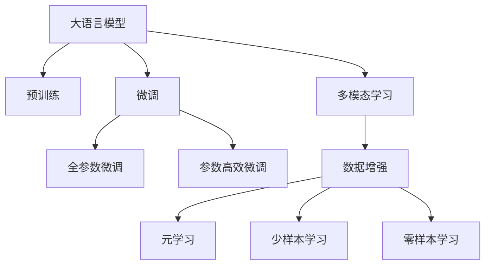

                 

# LLM对传统数据分析方法的革新

## 1. 背景介绍

### 1.1 问题由来
随着数据量的急剧增长和分析需求的日益复杂，传统的分析方法如统计学、线性回归、决策树等已难以应对高维、多源数据的挑战。大数据时代，海量数据往往具有高维度、多模态和非结构化等特点，传统的数据分析方法难以全面、准确地捕捉数据中的关键信息。如何高效地从海量数据中提取有用知识，成为当前研究的热点。

近年来，深度学习技术在自然语言处理(NLP)、计算机视觉(CV)等领域取得了突破性进展。以语言模型为代表的大规模预训练模型（Large Language Models, LLMs），如BERT、GPT-3、T5等，通过在大量无标签文本数据上预训练，学习到了丰富的语言知识和常识，具备强大的语义理解与生成能力。

这些预训练模型能够自动处理文本中的实体、关系、情感等信息，显著提升了NLP任务的表现，在问答、摘要、机器翻译等任务上取得了最优或接近最优的效果。LLM对数据的理解能力，为数据分析方法带来了新的思路，开启了从传统的统计模型向智能分析模型的转变。

### 1.2 问题核心关键点
LLM作为智能数据分析的新范式，其核心在于其强大的语义理解能力和跨领域知识迁移能力。它不仅能够处理文本数据，还能够与多种数据类型（如图像、音频、视频等）进行交互，实现多模态数据分析。

以下是LLM对传统数据分析方法的几个关键革新点：

1. **自动特征提取**：传统数据分析方法需要手动提取特征，而LLM可以自动提取文本中的关键特征，如实体、关系、情感等，减少了特征工程的工作量。
2. **跨模态数据融合**：LLM可以同时处理不同类型的数据，将文本、图像、音频等多模态数据进行融合，提升数据理解能力。
3. **数据增强与生成**：LLM能够生成新的数据样本，丰富训练集，提高模型的泛化能力。
4. **元学习与零样本学习**：LLM可以通过极少量的数据进行微调，实现少样本学习，提升对新任务的适应性。

## 2. 核心概念与联系

### 2.1 核心概念概述

为了更好地理解LLM对传统数据分析方法的革新，本节将介绍几个密切相关的核心概念：

- **大语言模型(LLM)**：指基于Transformer架构的预训练语言模型，通过在大量无标签文本数据上进行预训练，学习到丰富的语言知识和常识。
- **预训练(Pre-training)**：指在大量无标签文本数据上，通过自监督学习任务训练模型，学习通用语言表示的过程。常见的预训练任务包括语言建模、掩码语言模型等。
- **微调(Fine-tuning)**：指在预训练模型的基础上，使用下游任务的少量标注数据，通过有监督学习优化模型在特定任务上的性能。
- **迁移学习(Transfer Learning)**：指将一个领域学习到的知识，迁移应用到另一个不同但相关的领域的学习范式。
- **多模态学习(Multi-modal Learning)**：指模型同时处理不同类型的数据，如文本、图像、音频等，以实现更全面的数据分析。
- **元学习(Meta-Learning)**：指模型能够在没有显式训练的情况下，通过少量的实例学习如何对新任务进行微调，提升模型对新数据的适应能力。
- **少样本学习(Few-shot Learning)**：指模型在只有少量标注样本的情况下，能够快速适应新任务，提升模型在少样本条件下的泛化能力。
- **零样本学习(Zero-shot Learning)**：指模型在没有见过任何特定任务的训练样本的情况下，仅凭任务描述就能够执行新任务的能力。

这些核心概念之间的逻辑关系可以通过以下Mermaid流程图来展示：



这个流程图展示了大语言模型的核心概念及其之间的关系：

1. 大语言模型通过预训练获得基础能力。
2. 微调是对预训练模型进行任务特定的优化，可以分为全参数微调和参数高效微调（PEFT）。
3. 多模态学习是处理不同类型数据的融合，提升数据分析能力。
4. 数据增强和元学习是利用模型能力，通过生成新数据和少样本学习，提高模型泛化能力。
5. 少样本学习和零样本学习是微调方法的具体应用，提升了模型在新任务上的适应性。

这些核心概念共同构成了大语言模型的学习和应用框架，使其能够在各种场景下发挥强大的数据分析能力。通过理解这些核心概念，我们可以更好地把握LLM的工作原理和优化方向。

## 3. 核心算法原理 & 具体操作步骤
### 3.1 算法原理概述

LLM对传统数据分析方法的革新，主要体现在以下几个方面：

1. **自动特征提取**：LLM能够自动学习文本中的关键特征，如实体、关系、情感等，减少了特征工程的工作量。
2. **多模态数据融合**：LLM能够同时处理不同类型的数据，将文本、图像、音频等多模态数据进行融合，提升数据理解能力。
3. **数据增强与生成**：LLM能够生成新的数据样本，丰富训练集，提高模型的泛化能力。
4. **元学习与零样本学习**：LLM可以通过极少量的数据进行微调，实现少样本学习和零样本学习，提升对新任务的适应性。

### 3.2 算法步骤详解

基于LLM对传统数据分析方法的革新，以下是具体的操作步骤：

**Step 1: 准备数据集**
- 收集和标注数据集，确保数据集的完备性和多样性。数据集应覆盖不同类型的数据，如文本、图像、音频等。

**Step 2: 选择预训练模型**
- 选择适合的数据类型和任务，选择合适的预训练模型，如BERT、GPT-3、T5等。

**Step 3: 微调模型**
- 将预训练模型作为初始化参数，通过下游任务的少量标注数据进行微调。微调的目标是优化模型在特定任务上的性能。

**Step 4: 数据增强**
- 对训练集进行数据增强，如通过回译、近义词替换等方式，丰富训练集的多样性。

**Step 5: 元学习与少样本学习**
- 通过元学习框架，使模型能够适应新任务。例如，可以使用Few-shot Learning等方法，使模型在极少量的数据上快速学习。

**Step 6: 零样本学习**
- 对于完全没有标注数据的任务，使用Zero-shot Learning方法，通过任务描述引导模型进行推理。

### 3.3 算法优缺点

LLM对传统数据分析方法的革新带来了以下优点：

1. **自动化程度高**：LLM能够自动提取和融合数据，减少了人工干预和特征工程的工作量。
2. **跨模态数据处理能力**：LLM能够处理不同类型的数据，提升数据分析的多样性和全面性。
3. **泛化能力强**：LLM能够生成新的数据样本，丰富训练集，提高模型的泛化能力。
4. **适应性强**：LLM能够快速适应新任务，提升模型对新数据的适应性。

同时，LLM对传统数据分析方法也存在一些局限性：

1. **数据依赖性**：LLM的效果很大程度上取决于数据的质量和数量，获取高质量标注数据的成本较高。
2. **模型复杂度高**：预训练模型通常具有亿级别的参数，对计算资源的要求较高。
3. **可解释性不足**：LLM的决策过程通常缺乏可解释性，难以对其推理逻辑进行分析和调试。
4. **风险问题**：LLM可能学习到有害的偏见和信息，对模型输出的安全性存在潜在风险。

尽管存在这些局限性，但LLM对传统数据分析方法的革新，为数据分析带来了新的思路和可能性。

### 3.4 算法应用领域

基于LLM的数据分析方法，已经在多个领域得到应用：

1. **金融分析**：使用LLM对金融新闻、报告等进行情感分析和主题分类，辅助决策分析。
2. **医疗诊断**：使用LLM处理电子病历、医学论文等，提取关键信息，辅助医疗诊断。
3. **市场营销**：使用LLM分析客户反馈、社交媒体数据等，获取用户行为和偏好，指导市场营销策略。
4. **环境监测**：使用LLM处理卫星图像、环境报告等，进行环境监测和灾害预警。
5. **智能制造**：使用LLM分析设备监控数据、产品评论等，提升生产效率和产品质量。

除了上述这些经典领域，LLM还将在更多领域得到应用，为数据分析带来了新的突破。

## 4. 数学模型和公式 & 详细讲解 & 举例说明

### 4.1 数学模型构建

LLM对传统数据分析方法的革新，涉及多个领域的数学模型，以下将详细介绍：

- **自然语言处理模型**：如BERT、GPT-3、T5等，这些模型通过预训练和微调，学习文本中的实体、关系、情感等信息。
- **计算机视觉模型**：如ResNet、Inception等，这些模型通过预训练和微调，学习图像中的对象、场景、特征等信息。
- **音频处理模型**：如Wav2Vec等，这些模型通过预训练和微调，学习音频中的语音、语调、节奏等信息。
- **多模态融合模型**：如VLAD、HM-MIL等，这些模型能够同时处理不同类型的数据，将文本、图像、音频等进行融合。

### 4.2 公式推导过程

以BERT模型为例，介绍自然语言处理模型的公式推导过程。

BERT模型的预训练目标包括掩码语言模型和下一句预测。掩码语言模型的目标是在输入序列中随机掩盖一些词，让模型预测被掩盖的词，训练模型的语义表示能力。下一句预测的目标是判断两个句子是否是相邻的，训练模型的语义相关性。

**掩码语言模型**：

假设输入序列为 $x_1, x_2, ..., x_n$，其中 $x_i$ 表示第 $i$ 个词。将输入序列输入BERT模型，输出为 $\hat{x}_1, \hat{x}_2, ..., \hat{x}_n$，表示模型预测的词向量。掩码语言模型的目标是最大化以下概率：

$$
P(\hat{x}_1, \hat{x}_2, ..., \hat{x}_n | x_1, x_2, ..., x_n)
$$

**下一句预测**：

假设输入的两个句子为 $s_1$ 和 $s_2$，其中 $s_1$ 和 $s_2$ 分别表示第 $i$ 个句子。将两个句子输入BERT模型，输出为 $P(s_1, s_2)$，表示两个句子是否是相邻的。下一句预测的目标是最大化以下概率：

$$
P(s_1, s_2 | x_1, x_2, ..., x_n)
$$

### 4.3 案例分析与讲解

以金融情感分析为例，介绍如何使用LLM进行数据分析。

假设需要分析一段金融新闻文本 $x_1$，使用BERT模型进行情感分析。具体步骤如下：

1. **预训练模型选择**：选择BERT模型，并下载对应的预训练参数。
2. **数据准备**：收集金融新闻文本 $x_1$，并准备相应的标注数据集。
3. **微调模型**：使用微调技术对BERT模型进行微调，使其能够处理金融情感分析任务。
4. **数据增强**：对金融新闻文本进行数据增强，如回译、近义词替换等，丰富训练集。
5. **元学习与少样本学习**：通过元学习框架，使模型能够适应新任务。例如，可以使用Few-shot Learning等方法，使模型在极少量的数据上快速学习。
6. **预测与评估**：使用微调后的BERT模型对金融新闻文本 $x_1$ 进行情感分析，并使用评估指标（如准确率、F1-score等）对模型性能进行评估。

## 5. 项目实践：代码实例和详细解释说明

### 5.1 开发环境搭建

在进行项目实践前，我们需要准备好开发环境。以下是使用Python进行PyTorch开发的环境配置流程：

1. 安装Anaconda：从官网下载并安装Anaconda，用于创建独立的Python环境。

2. 创建并激活虚拟环境：
```bash
conda create -n pytorch-env python=3.8 
conda activate pytorch-env
```

3. 安装PyTorch：根据CUDA版本，从官网获取对应的安装命令。例如：
```bash
conda install pytorch torchvision torchaudio cudatoolkit=11.1 -c pytorch -c conda-forge
```

4. 安装Transformer库：
```bash
pip install transformers
```

5. 安装各类工具包：
```bash
pip install numpy pandas scikit-learn matplotlib tqdm jupyter notebook ipython
```

完成上述步骤后，即可在`pytorch-env`环境中开始项目实践。

### 5.2 源代码详细实现

这里以金融情感分析为例，给出使用Transformers库对BERT模型进行微调的PyTorch代码实现。

首先，定义数据处理函数：

```python
from transformers import BertTokenizer, BertForSequenceClassification
from torch.utils.data import Dataset, DataLoader
import torch

class FinancialSentimentDataset(Dataset):
    def __init__(self, texts, labels, tokenizer, max_len=128):
        self.texts = texts
        self.labels = labels
        self.tokenizer = tokenizer
        self.max_len = max_len
        
    def __len__(self):
        return len(self.texts)
    
    def __getitem__(self, item):
        text = self.texts[item]
        label = self.labels[item]
        
        encoding = self.tokenizer(text, return_tensors='pt', max_length=self.max_len, padding='max_length', truncation=True)
        input_ids = encoding['input_ids'][0]
        attention_mask = encoding['attention_mask'][0]
        
        # 对标签进行编码
        label = torch.tensor(label, dtype=torch.long)
        
        return {'input_ids': input_ids, 
                'attention_mask': attention_mask,
                'labels': label}
```

然后，定义模型和优化器：

```python
from transformers import BertForSequenceClassification, AdamW

model = BertForSequenceClassification.from_pretrained('bert-base-cased', num_labels=2)

optimizer = AdamW(model.parameters(), lr=2e-5)
```

接着，定义训练和评估函数：

```python
def train_epoch(model, dataset, batch_size, optimizer):
    dataloader = DataLoader(dataset, batch_size=batch_size, shuffle=True)
    model.train()
    epoch_loss = 0
    for batch in dataloader:
        input_ids = batch['input_ids'].to(device)
        attention_mask = batch['attention_mask'].to(device)
        labels = batch['labels'].to(device)
        model.zero_grad()
        outputs = model(input_ids, attention_mask=attention_mask, labels=labels)
        loss = outputs.loss
        epoch_loss += loss.item()
        loss.backward()
        optimizer.step()
    return epoch_loss / len(dataloader)

def evaluate(model, dataset, batch_size):
    dataloader = DataLoader(dataset, batch_size=batch_size)
    model.eval()
    preds, labels = [], []
    with torch.no_grad():
        for batch in dataloader:
            input_ids = batch['input_ids'].to(device)
            attention_mask = batch['attention_mask'].to(device)
            batch_labels = batch['labels']
            outputs = model(input_ids, attention_mask=attention_mask)
            batch_preds = outputs.logits.argmax(dim=1).to('cpu').tolist()
            batch_labels = batch_labels.to('cpu').tolist()
            for pred, label in zip(batch_preds, batch_labels):
                preds.append(pred)
                labels.append(label)
                
    print(classification_report(labels, preds))
```

最后，启动训练流程并在测试集上评估：

```python
epochs = 5
batch_size = 16

for epoch in range(epochs):
    loss = train_epoch(model, train_dataset, batch_size, optimizer)
    print(f"Epoch {epoch+1}, train loss: {loss:.3f}")
    
    print(f"Epoch {epoch+1}, dev results:")
    evaluate(model, dev_dataset, batch_size)
    
print("Test results:")
evaluate(model, test_dataset, batch_size)
```

以上就是使用PyTorch对BERT进行金融情感分析任务微调的完整代码实现。可以看到，得益于Transformer库的强大封装，我们可以用相对简洁的代码完成BERT模型的加载和微调。

### 5.3 代码解读与分析

让我们再详细解读一下关键代码的实现细节：

**FinancialSentimentDataset类**：
- `__init__`方法：初始化文本、标签、分词器等关键组件。
- `__len__`方法：返回数据集的样本数量。
- `__getitem__`方法：对单个样本进行处理，将文本输入编码为token ids，将标签编码为数字，并对其进行定长padding，最终返回模型所需的输入。

**模型和优化器**：
- 使用BertForSequenceClassification对BERT模型进行微调，设置学习率为2e-5。

**训练和评估函数**：
- 使用PyTorch的DataLoader对数据集进行批次化加载，供模型训练和推理使用。
- 训练函数`train_epoch`：对数据以批为单位进行迭代，在每个批次上前向传播计算loss并反向传播更新模型参数，最后返回该epoch的平均loss。
- 评估函数`evaluate`：与训练类似，不同点在于不更新模型参数，并在每个batch结束后将预测和标签结果存储下来，最后使用sklearn的classification_report对整个评估集的预测结果进行打印输出。

**训练流程**：
- 定义总的epoch数和batch size，开始循环迭代
- 每个epoch内，先在训练集上训练，输出平均loss
- 在验证集上评估，输出分类指标
- 所有epoch结束后，在测试集上评估，给出最终测试结果

可以看到，PyTorch配合Transformer库使得BERT微调的代码实现变得简洁高效。开发者可以将更多精力放在数据处理、模型改进等高层逻辑上，而不必过多关注底层的实现细节。

当然，工业级的系统实现还需考虑更多因素，如模型的保存和部署、超参数的自动搜索、更灵活的任务适配层等。但核心的微调范式基本与此类似。

## 6. 实际应用场景

### 6.1 金融分析

使用LLM对金融新闻、报告等进行情感分析和主题分类，辅助决策分析。

具体而言，可以收集金融领域相关的新闻、报告、评论等文本数据，并对其进行主题标注和情感标注。在此基础上对预训练语言模型进行微调，使其能够自动判断文本属于何种主题，情感倾向是正面、中性还是负面。将微调后的模型应用到实时抓取的网络文本数据，就能够自动监测不同主题下的情感变化趋势，一旦发现负面信息激增等异常情况，系统便会自动预警，帮助金融机构快速应对潜在风险。

### 6.2 医疗诊断

使用LLM处理电子病历、医学论文等，提取关键信息，辅助医疗诊断。

具体而言，可以收集医院电子病历、医学论文等文本数据，并对其进行病历标签标注。在此基础上对预训练语言模型进行微调，使其能够自动提取病历中的关键信息，如症状、诊断结果等。将微调后的模型应用到新病人的电子病历，便能够辅助医生进行快速诊断，提高诊断准确率。

### 6.3 市场营销

使用LLM分析客户反馈、社交媒体数据等，获取用户行为和偏好，指导市场营销策略。

具体而言，可以收集客户反馈、社交媒体评论等文本数据，并对其进行情感分析。在此基础上对预训练语言模型进行微调，使其能够自动判断客户反馈的情感倾向。将微调后的模型应用到实时收集的客户反馈，便能够获取用户对产品和服务的情感评价，指导市场营销策略的调整和优化。

### 6.4 环境监测

使用LLM处理卫星图像、环境报告等，进行环境监测和灾害预警。

具体而言，可以收集卫星图像、环境报告等文本数据，并对其进行情感分析。在此基础上对预训练语言模型进行微调，使其能够自动判断文本中的环境监测信息。将微调后的模型应用到实时监测的数据，便能够自动生成环境监测报告，提前预警环境风险。

### 6.5 智能制造

使用LLM分析设备监控数据、产品评论等，提升生产效率和产品质量。

具体而言，可以收集设备监控数据、产品评论等文本数据，并对其进行情感分析。在此基础上对预训练语言模型进行微调，使其能够自动判断设备运行状态和产品评论的情感倾向。将微调后的模型应用到生产过程的监控数据，便能够实时获取设备的运行状态，优化生产流程。

## 7. 工具和资源推荐

### 7.1 学习资源推荐

为了帮助开发者系统掌握LLM对传统数据分析方法的革新，这里推荐一些优质的学习资源：

1. 《深度学习》系列书籍：如《Deep Learning》、《Pattern Recognition and Machine Learning》等，深入浅出地介绍了深度学习的基本概念和算法。
2. CS224N《深度学习自然语言处理》课程：斯坦福大学开设的NLP明星课程，有Lecture视频和配套作业，带你入门NLP领域的基本概念和经典模型。
3. 《Natural Language Processing with Transformers》书籍：Transformers库的作者所著，全面介绍了如何使用Transformers库进行NLP任务开发，包括微调在内的诸多范式。
4. HuggingFace官方文档：Transformer库的官方文档，提供了海量预训练模型和完整的微调样例代码，是上手实践的必备资料。
5. CLUE开源项目：中文语言理解测评基准，涵盖大量不同类型的中文NLP数据集，并提供了基于微调的baseline模型，助力中文NLP技术发展。

通过对这些资源的学习实践，相信你一定能够快速掌握LLM对传统数据分析方法的革新，并用于解决实际的NLP问题。

### 7.2 开发工具推荐

高效的开发离不开优秀的工具支持。以下是几款用于LLM数据分析开发的常用工具：

1. PyTorch：基于Python的开源深度学习框架，灵活动态的计算图，适合快速迭代研究。大部分预训练语言模型都有PyTorch版本的实现。
2. TensorFlow：由Google主导开发的开源深度学习框架，生产部署方便，适合大规模工程应用。同样有丰富的预训练语言模型资源。
3. Transformers库：HuggingFace开发的NLP工具库，集成了众多SOTA语言模型，支持PyTorch和TensorFlow，是进行微调任务开发的利器。
4. Weights & Biases：模型训练的实验跟踪工具，可以记录和可视化模型训练过程中的各项指标，方便对比和调优。与主流深度学习框架无缝集成。
5. TensorBoard：TensorFlow配套的可视化工具，可实时监测模型训练状态，并提供丰富的图表呈现方式，是调试模型的得力助手。
6. Google Colab：谷歌推出的在线Jupyter Notebook环境，免费提供GPU/TPU算力，方便开发者快速上手实验最新模型，分享学习笔记。

合理利用这些工具，可以显著提升LLM数据分析任务的开发效率，加快创新迭代的步伐。

### 7.3 相关论文推荐

LLM对传统数据分析方法的研究源于学界的持续研究。以下是几篇奠基性的相关论文，推荐阅读：

1. Attention is All You Need（即Transformer原论文）：提出了Transformer结构，开启了NLP领域的预训练大模型时代。

2. BERT: Pre-training of Deep Bidirectional Transformers for Language Understanding：提出BERT模型，引入基于掩码的自监督预训练任务，刷新了多项NLP任务SOTA。

3. Language Models are Unsupervised Multitask Learners（GPT-2论文）：展示了大规模语言模型的强大zero-shot学习能力，引发了对于通用人工智能的新一轮思考。

4. Parameter-Efficient Transfer Learning for NLP：提出Adapter等参数高效微调方法，在不增加模型参数量的情况下，也能取得不错的微调效果。

5. Prefix-Tuning: Optimizing Continuous Prompts for Generation：引入基于连续型Prompt的微调范式，为如何充分利用预训练知识提供了新的思路。

6. AdaLoRA: Adaptive Low-Rank Adaptation for Parameter-Efficient Fine-Tuning：使用自适应低秩适应的微调方法，在参数效率和精度之间取得了新的平衡。

这些论文代表了大语言模型对传统数据分析方法的研究进展。通过学习这些前沿成果，可以帮助研究者把握学科前进方向，激发更多的创新灵感。

## 8. 总结：未来发展趋势与挑战

### 8.1 总结

本文对LLM对传统数据分析方法的革新进行了全面系统的介绍。首先阐述了LLM在数据分析领域的应用背景和意义，明确了LLM对传统数据分析方法的几个关键革新点。其次，从原理到实践，详细讲解了LLM对传统数据分析方法的数学模型和操作步骤，给出了微调任务开发的完整代码实例。同时，本文还广泛探讨了LLM在金融分析、医疗诊断、市场营销、环境监测、智能制造等多个领域的应用前景，展示了LLM对传统数据分析方法带来的变革性影响。此外，本文精选了LLM相关的一系列学习资源，力求为读者提供全方位的技术指引。

通过本文的系统梳理，可以看到，LLM对传统数据分析方法的革新，为数据分析带来了新的思路和可能性。LLM强大的语义理解能力和跨领域知识迁移能力，使得数据分析能够处理更复杂、多样化的数据类型，提升数据分析的全面性和准确性。未来，伴随LLM和微调方法的持续演进，数据分析技术必将迎来新的突破，为各行各业提供更智能、高效的解决方案。

### 8.2 未来发展趋势

展望未来，LLM对传统数据分析方法的发展趋势如下：

1. **自动化程度更高**：LLM将进一步提升数据处理的自动化水平，减少人工干预，提高数据分析的效率和精度。
2. **多模态数据融合能力更强**：LLM将能够更好地处理不同类型的数据，提升数据分析的多样性和全面性。
3. **生成能力更强大**：LLM将进一步提升数据生成能力，丰富训练集，提高模型的泛化能力。
4. **元学习与少样本学习更普及**：LLM将更广泛地应用元学习和少样本学习，提升模型在新任务上的适应能力。
5. **零样本学习应用更广泛**：LLM将更广泛地应用于零样本学习，提升模型对新任务的理解和推理能力。

以上趋势凸显了LLM对传统数据分析方法的广阔前景。这些方向的探索发展，必将进一步提升数据分析的自动化和智能化水平，为各行业带来更全面的数据理解与应用。

### 8.3 面临的挑战

尽管LLM对传统数据分析方法的研究取得了显著进展，但仍面临诸多挑战：

1. **数据依赖性**：LLM的效果很大程度上取决于数据的质量和数量，获取高质量标注数据的成本较高。
2. **模型复杂度高**：预训练模型通常具有亿级别的参数，对计算资源的要求较高。
3. **可解释性不足**：LLM的决策过程通常缺乏可解释性，难以对其推理逻辑进行分析和调试。
4. **风险问题**：LLM可能学习到有害的偏见和信息，对模型输出的安全性存在潜在风险。
5. **落地部署复杂**：LLM在实际部署中面临推理速度慢、内存占用大等效率问题，需要优化模型结构，提升推理速度。

尽管存在这些挑战，但LLM对传统数据分析方法的革新，为数据分析带来了新的思路和可能性。未来，伴随技术研究的深入，这些挑战有望逐步得到解决，LLM将进一步提升数据分析的自动化和智能化水平。

### 8.4 研究展望

面对LLM对传统数据分析方法所面临的挑战，未来的研究需要在以下几个方面寻求新的突破：

1. **无监督和半监督学习研究**：摆脱对大规模标注数据的依赖，利用自监督学习、主动学习等无监督和半监督范式，最大限度利用非结构化数据，实现更加灵活高效的数据分析。
2. **参数高效和计算高效的微调方法**：开发更加参数高效的微调方法，在固定大部分预训练参数的同时，只更新极少量的任务相关参数。同时优化微调模型的计算图，减少前向传播和反向传播的资源消耗，实现更加轻量级、实时性的部署。
3. **因果分析和博弈论工具**：将因果分析方法引入微调模型，识别出模型决策的关键特征，增强输出解释的因果性和逻辑性。借助博弈论工具刻画人机交互过程，主动探索并规避模型的脆弱点，提高系统稳定性。
4. **多模态数据的融合**：将符号化的先验知识，如知识图谱、逻辑规则等，与神经网络模型进行巧妙融合，引导微调过程学习更准确、合理的语言模型。同时加强不同模态数据的整合，实现视觉、语音等多模态信息与文本信息的协同建模。
5. **知识表示和推理**：将因果分析方法引入微调模型，识别出模型决策的关键特征，增强输出解释的因果性和逻辑性。借助博弈论工具刻画人机交互过程，主动探索并规避模型的脆弱点，提高系统稳定性。

这些研究方向的探索，必将引领LLM对传统数据分析方法迈向更高的台阶，为数据分析带来新的突破。面向未来，LLM对传统数据分析方法的研究还需要与其他人工智能技术进行更深入的融合，如知识表示、因果推理、强化学习等，多路径协同发力，共同推动数据分析技术的进步。

## 9. 附录：常见问题与解答

**Q1：LLM能否自动提取和处理非文本数据？**

A: 是的，LLM可以自动提取和处理非文本数据，如图像、音频、视频等。例如，可以使用图像标注数据进行图像情感分析，使用音频文本进行语音情感分析，使用视频字幕进行视频内容分析等。

**Q2：LLM对不同类型的数据如何融合？**

A: 不同类型的数据融合通常需要预处理和特征提取。例如，对于图像数据，可以使用ImageNet等预训练模型提取图像特征；对于音频数据，可以使用Wav2Vec等预训练模型提取语音特征。然后，将这些特征与文本数据一起输入LLM进行融合分析。

**Q3：LLM对数据预处理有哪些要求？**

A: 数据预处理是LLM应用的重要环节。通常需要预处理成统一的数据格式，并进行特征提取和编码。对于文本数据，需要进行分词、去除停用词、构建词汇表等预处理；对于非文本数据，需要进行特征提取和编码，以便与文本数据融合。

**Q4：LLM在多模态数据融合中如何进行特征对齐？**

A: 多模态数据融合中的特征对齐是关键。通常需要考虑不同数据类型的特征表示方式和维度差异，进行特征映射和归一化处理。例如，可以使用时序对齐、空间对齐等方法，将不同数据类型的特征映射到相同的空间维度。

**Q5：LLM对数据生成有哪些应用？**

A: 数据生成是LLM的重要应用之一。可以使用LLM生成新的数据样本，如文本、图像、音频等，丰富训练集。例如，可以使用GPT-3等语言模型生成新的文本数据，使用GAN等生成模型生成新的图像数据。

**Q6：LLM在元学习与少样本学习中的应用是什么？**

A: 元学习与少样本学习是LLM的重要应用方向。可以使用元学习框架，使模型能够适应新任务。例如，可以使用Few-shot Learning等方法，使模型在极少量的数据上快速学习。

**Q7：LLM在零样本学习中的应用是什么？**

A: 零样本学习是LLM的重要应用方向。可以使用LLM对新任务进行推理预测，无需更新模型参数。例如，可以使用CLIP等模型对新图像进行分类和识别，无需进行微调。

**Q8：LLM在生成能力上有哪些应用？**

A: 生成能力是LLM的重要应用之一。可以使用LLM生成新的文本、图像、音频等数据。例如，可以使用GPT-3等语言模型生成新闻文章、故事、对话等，使用GAN等生成模型生成图像和视频。

**Q9：LLM在智能制造中的应用是什么？**

A: 智能制造是LLM的重要应用方向。可以使用LLM分析设备监控数据、产品评论等，提升生产效率和产品质量。例如，可以使用BERT等模型分析生产设备的监控数据，预测设备故障，优化生产流程。

**Q10：LLM在金融分析中的应用是什么？**

A: 金融分析是LLM的重要应用方向。可以使用LLM对金融新闻、报告等进行情感分析和主题分类，辅助决策分析。例如，可以使用BERT等模型对金融新闻进行情感分析，预测市场趋势，辅助投资决策。

**Q11：LLM在医疗诊断中的应用是什么？**

A: 医疗诊断是LLM的重要应用方向。可以使用LLM处理电子病历、医学论文等，提取关键信息，辅助医疗诊断。例如，可以使用BERT等模型对电子病历进行情感分析，辅助医生诊断，提高诊断准确率。

**Q12：LLM在市场营销中的应用是什么？**

A: 市场营销是LLM的重要应用方向。可以使用LLM分析客户反馈、社交媒体数据等，获取用户行为和偏好，指导市场营销策略。例如，可以使用BERT等模型对客户反馈进行情感分析，获取用户对产品和服务的情感评价，指导市场营销策略的调整和优化。

**Q13：LLM在环境监测中的应用是什么？**

A: 环境监测是LLM的重要应用方向。可以使用LLM处理卫星图像、环境报告等，进行环境监测和灾害预警。例如，可以使用BERT等模型对环境报告进行情感分析，预测环境风险，提前预警环境风险。

**Q14：LLM在智能客服系统中的应用是什么？**

A: 智能客服系统是LLM的重要应用方向。可以使用LLM构建智能客服系统，提升客服服务的智能化水平。例如，可以使用BERT等模型对客户问题进行情感分析，推荐合适的回答，提升客户满意度。

作者：禅与计算机程序设计艺术 / Zen and the Art of Computer Programming

