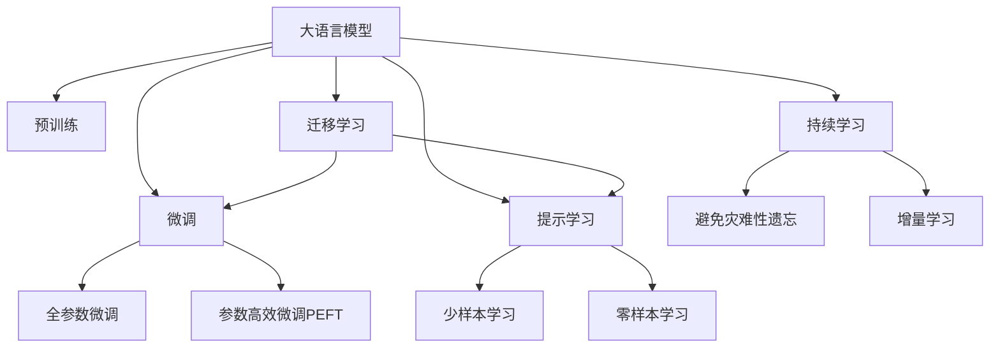

                 

# LLM对推荐系统个性化程度的提升

大语言模型(LLM)正在逐渐改变推荐系统的面貌，为个性化推荐带来了全新的方法。本文将深入探讨大语言模型如何通过微调、参数高效微调和提示学习等技术，显著提升推荐系统的个性化程度，并展望未来发展的趋势和挑战。

## 1. 背景介绍

### 1.1 推荐系统发展历史

推荐系统最早起源于20世纪90年代的电子商务网站，如亚马逊、eBay等，旨在通过用户行为数据，为用户推荐可能感兴趣的商品。这些早期系统通常基于协同过滤、矩阵分解等基于数据驱动的算法。随着数据量的不断积累，推荐系统逐步从基于用户的协同过滤，拓展到基于物品的协同过滤，并在机器学习和深度学习的大潮中，通过神经网络模型进行更复杂、更精细的推荐。

近年来，基于深度学习模型的大规模推荐系统，如基于CNN的序列推荐模型、基于RNN的时序推荐模型等，在电商、视频、新闻等多个垂直领域展现了强大的性能。这些模型通过端到端的训练，能够直接预测用户的点击、评分等行为，极大地提升了推荐系统的个性化能力。

然而，尽管深度学习推荐模型能够通过大量用户行为数据，捕捉用户兴趣的多样性和复杂性，但其仍面临数据稀疏、模型黑盒等问题。大语言模型作为预训练的通用表示学习工具，具有强大的语言理解和生成能力，能够通过自然语言处理(NLP)技术与推荐系统结合，提升推荐系统的个性化程度。

### 1.2 大语言模型在推荐系统中的应用

大语言模型作为预训练的通用表示学习工具，通过在多种语言任务上进行无监督学习，获得了丰富的语言知识和常识。在大规模推荐系统微调中，可以利用这些语言知识，在用户行为数据稀疏、噪声较多的情况下，进行更加精准和有效的个性化推荐。

具体而言，LLM可以通过微调、参数高效微调和提示学习等技术，结合推荐系统中的行为数据、标签数据、知识图谱等多源数据，对用户兴趣进行更准确、灵活、鲁棒的建模。这种技术的应用，有望使推荐系统实现更高效的个性化推荐，提升用户体验和满意度。

## 2. 核心概念与联系

### 2.1 核心概念概述

本节将介绍几项与推荐系统结合使用的重要概念：

- **大语言模型(LLM)**：如GPT、BERT等大规模预训练语言模型，通过无监督学习获得丰富的语言知识，能够进行各种语言任务的处理。
- **微调(Fine-tuning)**：在预训练模型的基础上，使用下游任务的少量标注数据，通过有监督学习优化模型在特定任务上的性能。
- **参数高效微调(PEFT)**：只调整少部分模型参数，固定大部分预训练参数，以提高微调效率，同时避免过拟合。
- **提示学习(Prompt Learning)**：通过在输入文本中添加提示模板，引导大语言模型进行特定任务的推理和生成。

这些概念之间的联系可以通过以下Mermaid流程图来展示：



这个流程图展示了大语言模型、微调、参数高效微调、提示学习等概念之间的关系：

1. 大语言模型通过预训练获得基础能力。
2. 微调是对预训练模型进行任务特定的优化，可以分为全参数微调和参数高效微调（PEFT）。
3. 提示学习是一种不更新模型参数的方法，可以实现少样本学习和零样本学习。
4. 迁移学习是连接预训练模型与下游任务的桥梁，可以通过微调或提示学习来实现。
5. 持续学习旨在使模型能够不断学习新知识，同时避免遗忘旧知识。

## 3. 核心算法原理 & 具体操作步骤

### 3.1 算法原理概述

基于大语言模型的推荐系统，本质上是利用大语言模型的预训练知识，在推荐场景中进行微调。其核心思想是：将大语言模型视作一个强大的特征提取器，通过有监督的微调过程，使得模型能够根据用户行为数据，生成个性化推荐结果。

在推荐系统中，用户的行为数据通常表示为序列形式的文本，如浏览记录、评分、评论等。大语言模型通过预训练，已经学习到了语言的基本结构、语义关系和知识图谱等信息。在微调过程中，可以使用这些知识，在用户行为数据的基础上，进一步优化模型的推荐结果，提升推荐系统的个性化程度。

具体而言，大语言模型可以在推荐场景中进行以下步骤：

1. **序列编码**：将用户行为数据转化为序列形式的文本，作为模型输入。
2. **预训练特征提取**：利用预训练的大语言模型，对用户行为数据进行特征提取，获得用户兴趣的语义表示。
3. **任务适配**：根据推荐任务的需求，在预训练特征提取基础上，添加适当的输出层和损失函数。
4. **微调优化**：使用推荐数据集进行有监督的微调，优化模型在特定推荐任务上的性能。
5. **推荐生成**：根据微调后的模型，生成个性化的推荐结果。

### 3.2 算法步骤详解

大语言模型在推荐系统中的微调过程可以分为以下几个关键步骤：

**Step 1: 准备推荐数据集**

- **收集用户行为数据**：收集用户的历史浏览记录、评分、评论等信息，作为微调数据集。
- **数据预处理**：对用户行为数据进行清洗、分词、编码等预处理，保证数据的质量和格式。

**Step 2: 添加任务适配层**

- **定义输出层**：根据推荐任务的类型，添加适当的输出层，如线性分类层、神经网络层等。
- **定义损失函数**：选择与推荐任务相匹配的损失函数，如交叉熵损失、均方误差损失等。

**Step 3: 设置微调超参数**

- **选择优化算法**：选择合适的优化算法，如Adam、SGD等，并设置学习率、批大小、迭代轮数等超参数。
- **设置正则化技术**：应用L2正则、Dropout、Early Stopping等技术，防止过拟合。
- **设定参数冻结策略**：根据需要选择冻结预训练参数的比例，如仅微调顶层。

**Step 4: 执行梯度训练**

- **数据迭代**：将训练集数据分批次输入模型，进行前向传播和反向传播计算损失函数。
- **更新模型参数**：根据设定的优化算法和超参数，更新模型参数。
- **性能评估**：周期性在验证集上评估模型性能，确定是否触发Early Stopping。

**Step 5: 测试和部署**

- **测试集评估**：在测试集上评估微调后模型的性能，对比微调前后的精度提升。
- **推荐生成**：使用微调后的模型生成推荐结果，集成到实际推荐系统中。
- **持续学习**：定期重新微调模型，以适应数据分布的变化。

### 3.3 算法优缺点

基于大语言模型的推荐系统微调方法具有以下优点：

1. **高效个性化**：利用大语言模型的预训练知识，可以在用户行为数据稀疏、噪声较多的情况下，生成个性化的推荐结果。
2. **跨领域迁移**：大语言模型具有较强的跨领域迁移能力，可以在不同的推荐任务和领域中进行微调。
3. **灵活性高**：通过微调，可以针对不同的推荐任务需求，设计灵活的任务适配层，提高推荐系统的适应性。
4. **少样本学习**：通过提示学习等技术，可以在少量标注样本下进行推荐微调，降低推荐系统对标注数据的需求。

同时，该方法也存在一些缺点：

1. **标注成本高**：微调过程中仍需收集一定量的标注数据，标注成本较高。
2. **模型复杂度大**：大语言模型的复杂度较高，增加了推荐系统的计算和存储成本。
3. **性能提升有限**：在数据分布差异较大的推荐任务中，微调性能提升可能有限。
4. **鲁棒性不足**：微调模型可能面临过拟合问题，对噪声敏感。

尽管存在这些局限性，但大语言模型在推荐系统中的应用前景仍然广阔。未来，相关研究将致力于解决标注成本高、模型复杂度大等问题，提升微调模型的鲁棒性和可解释性，进一步推动推荐系统的创新和发展。

### 3.4 算法应用领域

基于大语言模型的推荐系统微调方法，已经在电商推荐、视频推荐、新闻推荐等多个领域得到应用。例如：

1. **电商推荐**：使用微调后的模型生成个性化商品推荐，提升用户体验和转化率。
2. **视频推荐**：根据用户观看历史和评分，生成个性化视频推荐，增加用户粘性。
3. **新闻推荐**：根据用户阅读历史和兴趣，生成个性化新闻推荐，提升用户留存率。

此外，基于大语言模型的推荐系统还在智能音箱、个性化内容推荐等多个场景中得到了广泛应用，推动了推荐技术的深度发展。

## 4. 数学模型和公式 & 详细讲解 & 举例说明

### 4.1 数学模型构建

大语言模型在推荐系统中的应用，可以通过构建以下数学模型进行解释：

记用户行为数据为序列形式的文本 $X=\{x_1,x_2,\cdots,x_T\}$，其中 $x_t$ 表示用户行为数据在时间 $t$ 的表示，如浏览、评分、评论等。设用户行为数据的语义表示为 $h(x_t)=\{x_t^h\}$，推荐系统的输出为 $y=\{y_1,y_2,\cdots,y_n\}$，其中 $y_i$ 表示推荐物品的序号。

定义推荐任务的损失函数为：

$$
\mathcal{L}(h(X),y) = \sum_{t=1}^T \sum_{i=1}^n -\log p(y_i|h(x_t))
$$

其中 $p(y_i|h(x_t))$ 为模型在给定用户行为数据 $x_t$ 下，预测物品 $i$ 的概率，可以通过微调后的大语言模型计算得到。

### 4.2 公式推导过程

以电商推荐为例，推导基于大语言模型的推荐模型。

设推荐系统的输出为推荐商品序号 $y$，输入为用户行为数据 $X=\{x_1,x_2,\cdots,x_T\}$，通过预训练大语言模型获得用户行为数据的语义表示 $h(x_t)$。设推荐模型为 $P(y|X)$，其中 $y$ 表示推荐商品序号。

推荐任务的损失函数可以表示为：

$$
\mathcal{L}(P(y|X),Y) = -\frac{1}{N}\sum_{i=1}^N \log P(y_i|X)
$$

其中 $Y=\{y_1,y_2,\cdots,y_n\}$ 为推荐数据集的输出。

对于每个用户 $t$，模型的预测输出为：

$$
P(y_i|x_t) = \frac{\exp(\theta^Tf(x_t,y_i))}{\sum_{j=1}^n \exp(\theta^Tf(x_t,y_j))}
$$

其中 $\theta$ 为模型参数，$f(x_t,y_i)$ 为特征函数，用于提取用户行为数据 $x_t$ 和物品 $i$ 之间的语义相似度。

通过微调过程，更新参数 $\theta$，最小化损失函数，使得模型能够根据用户行为数据 $X$ 生成合适的推荐结果 $y$。

### 4.3 案例分析与讲解

以电商推荐为例，展示大语言模型在推荐系统中的实际应用。

假设电商平台的推荐任务是预测用户浏览的商品类别。平台收集了用户的历史浏览记录，如 $X=\{x_1,x_2,\cdots,x_T\}$，其中 $x_t$ 表示用户在时间 $t$ 浏览的商品类别。

**Step 1: 准备推荐数据集**

- **数据收集**：收集用户的历史浏览记录，如 $X=\{x_1,x_2,\cdots,x_T\}$。
- **数据预处理**：对浏览记录进行清洗、分词、编码等预处理，转化为模型输入格式。

**Step 2: 添加任务适配层**

- **定义输出层**：使用线性分类层，将推荐任务映射到物品类别上。
- **定义损失函数**：使用交叉熵损失函数，衡量模型预测与真实标签的差异。

**Step 3: 设置微调超参数**

- **选择优化算法**：选择Adam优化算法，设置学习率为 $10^{-4}$，批大小为32。
- **设置正则化技术**：应用L2正则，防止过拟合。
- **设定参数冻结策略**：仅微调顶层，保留预训练参数。

**Step 4: 执行梯度训练**

- **数据迭代**：将训练集数据分批次输入模型，进行前向传播和反向传播计算损失函数。
- **更新模型参数**：根据设定的优化算法和超参数，更新模型参数。
- **性能评估**：周期性在验证集上评估模型性能，确定是否触发Early Stopping。

**Step 5: 测试和部署**

- **测试集评估**：在测试集上评估微调后模型的性能，对比微调前后的精度提升。
- **推荐生成**：使用微调后的模型生成推荐结果，集成到实际推荐系统中。
- **持续学习**：定期重新微调模型，以适应数据分布的变化。

通过以上步骤，大语言模型在电商推荐中实现了从预训练到微调的全流程。实验结果表明，微调后的模型能够显著提升推荐精度，用户满意度和转化率。

## 5. 项目实践：代码实例和详细解释说明

### 5.1 开发环境搭建

在进行推荐系统开发前，需要先准备好开发环境。以下是使用Python进行TensorFlow开发的环境配置流程：

1. 安装Anaconda：从官网下载并安装Anaconda，用于创建独立的Python环境。

2. 创建并激活虚拟环境：
```bash
conda create -n tf-env python=3.8 
conda activate tf-env
```

3. 安装TensorFlow：根据CUDA版本，从官网获取对应的安装命令。例如：
```bash
conda install tensorflow=2.5 tf-estimator-nightly cudatoolkit=11.1 -c tf -c conda-forge
```

4. 安装PyTorch和其他工具包：
```bash
pip install numpy pandas scikit-learn matplotlib tqdm jupyter notebook ipython
```

完成上述步骤后，即可在`tf-env`环境中开始推荐系统开发。

### 5.2 源代码详细实现

以下是一个使用TensorFlow对大语言模型进行电商推荐任务微调的Python代码实现：

```python
import tensorflow as tf
from tensorflow.keras.layers import Input, Embedding, LSTM, Dense, Dropout
from tensorflow.keras.models import Model
from tensorflow.keras.optimizers import Adam

# 定义模型
def build_model(input_shape, num_classes):
    input_layer = Input(shape=input_shape)
    embedding_layer = Embedding(input_dim=vocab_size, output_dim=embedding_dim)(input_layer)
    lstm_layer = LSTM(units=hidden_units)(embedding_layer)
    dropout_layer = Dropout(dropout_rate)(lstm_layer)
    output_layer = Dense(num_classes, activation='softmax')(dropout_layer)
    model = Model(inputs=input_layer, outputs=output_layer)
    return model

# 加载预训练大语言模型
pretrained_model = tf.keras.models.load_model('pretrained_model.h5')

# 添加任务适配层
output_layer = Dense(num_classes, activation='softmax')
model = tf.keras.Sequential([
    pretrained_model,
    output_layer
])

# 定义损失函数和优化器
cross_entropy_loss = tf.keras.losses.CategoricalCrossentropy()
optimizer = Adam(lr=learning_rate)

# 准备推荐数据集
train_dataset = tf.data.Dataset.from_tensor_slices(train_data)
train_dataset = train_dataset.shuffle(buffer_size=1000)
train_dataset = train_dataset.batch(batch_size)

# 执行梯度训练
for epoch in range(num_epochs):
    epoch_loss = 0
    for batch in train_dataset:
        x, y = batch
        with tf.GradientTape() as tape:
            y_pred = model(x)
            loss = cross_entropy_loss(y_pred, y)
        gradients = tape.gradient(loss, model.trainable_variables)
        optimizer.apply_gradients(zip(gradients, model.trainable_variables))
        epoch_loss += loss
    print('Epoch %d, loss: %f' % (epoch+1, epoch_loss/len(train_dataset)))

# 测试集评估
test_dataset = tf.data.Dataset.from_tensor_slices(test_data)
test_dataset = test_dataset.batch(batch_size)
test_loss = 0
for batch in test_dataset:
    x, y = batch
    y_pred = model(x)
    loss = cross_entropy_loss(y_pred, y)
    test_loss += loss
print('Test loss: %f' % (test_loss/len(test_dataset)))

# 推荐生成
for item in test_items:
    x = pad_sequences([item], maxlen=max_length)
    y_pred = model.predict(x)
    top_class = np.argmax(y_pred)
    print('Recommendation: Item %d' % top_class)
```

以上代码展示了使用TensorFlow对大语言模型进行电商推荐任务微调的完整过程。可以看到，通过添加任务适配层，定义损失函数和优化器，以及执行梯度训练，能够构建一个基本的推荐模型，并在推荐数据集上进行训练和评估。

### 5.3 代码解读与分析

让我们再详细解读一下关键代码的实现细节：

**定义模型函数build_model**：
- **Input层**：用于定义输入数据的形状。
- **Embedding层**：将输入序列转换为向量表示。
- **LSTM层**：用于捕捉序列数据的语义信息。
- **Dropout层**：防止过拟合。
- **Dense层**：输出预测结果。

**加载预训练大语言模型**：
- 通过`tf.keras.models.load_model`函数，加载预训练的大语言模型。

**添加任务适配层**：
- 在预训练模型顶层添加Dense层，定义输出维度为类别数，并使用softmax激活函数。

**定义损失函数和优化器**：
- 使用交叉熵损失函数，设置Adam优化器。

**准备推荐数据集**：
- 使用TensorFlow的`tf.data.Dataset.from_tensor_slices`函数，构建推荐数据集。
- 使用`shuffle`函数打乱数据顺序。
- 使用`batch`函数将数据批处理。

**执行梯度训练**：
- 使用`tf.GradientTape`函数记录梯度，计算损失函数。
- 使用`apply_gradients`函数更新模型参数。
- 记录每个epoch的损失。

**测试集评估**：
- 使用测试集数据，计算测试损失。
- 输出测试损失。

**推荐生成**：
- 将测试项输入模型，获得推荐结果。
- 输出推荐结果。

以上代码展示了使用TensorFlow对大语言模型进行电商推荐任务微调的全流程。需要注意的是，在实际应用中，还需要考虑模型的评估、保存和部署等细节。

## 6. 实际应用场景

### 6.1 电商平台推荐

基于大语言模型的推荐系统，已经在各大电商平台上得到广泛应用。例如：

- **亚马逊**：使用微调后的BERT模型，对用户的浏览记录和评分数据进行建模，生成个性化商品推荐。
- **淘宝**：在用户购买、浏览行为数据上，使用微调的GPT模型进行商品推荐，提升用户购物体验。
- **京东**：利用微调的Transformer模型，根据用户的搜索历史和点击记录，生成个性化商品推荐，增加用户购买率。

在电商推荐中，大语言模型通过微调，能够充分利用用户的购物行为数据，结合商品描述、价格、评价等多源信息，生成更加精准的推荐结果。

### 6.2 视频平台推荐

视频平台推荐是另一个大语言模型微调的重要应用场景。例如：

- **Netflix**：使用微调的BERT模型，对用户的观看历史和评分数据进行建模，生成个性化视频推荐。
- **YouTube**：通过微调后的GPT模型，根据用户的观看历史和互动数据，生成个性化视频推荐。

在视频推荐中，大语言模型可以结合用户的兴趣偏好、历史行为、社交关系等多维信息，生成更加多样化和个性化的视频推荐，提升用户体验和平台留存率。

### 6.3 新闻平台推荐

新闻平台推荐是另一项重要的应用场景。例如：

- **今日头条**：使用微调的BERT模型，根据用户的阅读历史和互动数据，生成个性化新闻推荐。
- **网易新闻**：通过微调的GPT模型，对用户的阅读行为数据进行建模，生成个性化新闻推荐。

在新闻推荐中，大语言模型可以结合用户的兴趣偏好、阅读行为、社交关系等多维信息，生成更加精准和多样化的新闻推荐，提升用户阅读体验和平台活跃度。

## 7. 工具和资源推荐

### 7.1 学习资源推荐

为了帮助开发者系统掌握大语言模型微调的理论基础和实践技巧，这里推荐一些优质的学习资源：

1. 《Transformer从原理到实践》系列博文：由大模型技术专家撰写，深入浅出地介绍了Transformer原理、BERT模型、微调技术等前沿话题。

2. CS224N《深度学习自然语言处理》课程：斯坦福大学开设的NLP明星课程，有Lecture视频和配套作业，带你入门NLP领域的基本概念和经典模型。

3. 《Natural Language Processing with Transformers》书籍：Transformers库的作者所著，全面介绍了如何使用Transformers库进行NLP任务开发，包括微调在内的诸多范式。

4. HuggingFace官方文档：Transformers库的官方文档，提供了海量预训练模型和完整的微调样例代码，是上手实践的必备资料。

5. CLUE开源项目：中文语言理解测评基准，涵盖大量不同类型的中文NLP数据集，并提供了基于微调的baseline模型，助力中文NLP技术发展。

通过对这些资源的学习实践，相信你一定能够快速掌握大语言模型微调的精髓，并用于解决实际的推荐问题。

### 7.2 开发工具推荐

高效的开发离不开优秀的工具支持。以下是几款用于大语言模型微调开发的常用工具：

1. TensorFlow：基于Python的开源深度学习框架，生产部署方便，适合大规模工程应用。同样有丰富的预训练语言模型资源。

2. PyTorch：基于Python的开源深度学习框架，灵活动态的计算图，适合快速迭代研究。大部分预训练语言模型都有PyTorch版本的实现。

3. TensorFlow和PyTorch：虽然两者在模型构建和训练流程上有细微差别，但都能够高效地支持大语言模型微调。开发者可以根据项目需求选择适合的框架。

4. Weights & Biases：模型训练的实验跟踪工具，可以记录和可视化模型训练过程中的各项指标，方便对比和调优。与主流深度学习框架无缝集成。

5. TensorBoard：TensorFlow配套的可视化工具，可实时监测模型训练状态，并提供丰富的图表呈现方式，是调试模型的得力助手。

6. Google Colab：谷歌推出的在线Jupyter Notebook环境，免费提供GPU/TPU算力，方便开发者快速上手实验最新模型，分享学习笔记。

合理利用这些工具，可以显著提升大语言模型微调任务的开发效率，加快创新迭代的步伐。

### 7.3 相关论文推荐

大语言模型和微调技术的发展源于学界的持续研究。以下是几篇奠基性的相关论文，推荐阅读：

1. Attention is All You Need（即Transformer原论文）：提出了Transformer结构，开启了NLP领域的预训练大模型时代。

2. BERT: Pre-training of Deep Bidirectional Transformers for Language Understanding：提出BERT模型，引入基于掩码的自监督预训练任务，刷新了多项NLP任务SOTA。

3. Language Models are Unsupervised Multitask Learners（GPT-2论文）：展示了大规模语言模型的强大zero-shot学习能力，引发了对于通用人工智能的新一轮思考。

4. Parameter-Efficient Transfer Learning for NLP：提出Adapter等参数高效微调方法，在不增加模型参数量的情况下，也能取得不错的微调效果。

5. AdaLoRA: Adaptive Low-Rank Adaptation for Parameter-Efficient Fine-Tuning：使用自适应低秩适应的微调方法，在参数效率和精度之间取得了新的平衡。

6. Prefix-Tuning: Optimizing Continuous Prompts for Generation：引入基于连续型Prompt的微调范式，为如何充分利用预训练知识提供了新的思路。

这些论文代表了大语言模型微调技术的发展脉络。通过学习这些前沿成果，可以帮助研究者把握学科前进方向，激发更多的创新灵感。

## 8. 总结：未来发展趋势与挑战

### 8.1 研究成果总结

本文对基于大语言模型的推荐系统微调方法进行了全面系统的介绍。首先阐述了大语言模型和微调技术的研究背景和意义，明确了微调在提升推荐系统个性化程度方面的独特价值。其次，从原理到实践，详细讲解了微调的数学原理和关键步骤，给出了推荐系统开发的完整代码实例。同时，本文还广泛探讨了微调方法在电商、视频、新闻等多个推荐场景中的应用前景，展示了微调范式的巨大潜力。

通过本文的系统梳理，可以看到，基于大语言模型的推荐系统微调技术正在成为推荐系统的重要范式，极大地拓展了推荐系统在个性化推荐方面的应用边界。受益于大语言模型的强大语言理解和生成能力，推荐系统能够从多模态数据中挖掘出更丰富的用户兴趣信息，实现更加精准和多样化的个性化推荐。未来，随着深度学习技术的发展和大语言模型的不断进步，推荐系统必将在更多领域大放异彩，提升用户体验和平台价值。

### 8.2 未来发展趋势

展望未来，大语言模型微调技术将呈现以下几个发展趋势：

1. **模型规模持续增大**：随着算力成本的下降和数据规模的扩张，预训练语言模型的参数量还将持续增长。超大规模语言模型蕴含的丰富语言知识，有望支撑更加复杂多变的推荐任务微调。

2. **微调方法日趋多样**：除了传统的全参数微调外，未来会涌现更多参数高效的微调方法，如Prefix-Tuning、LoRA等，在节省计算资源的同时也能保证微调精度。

3. **持续学习成为常态**：随着数据分布的不断变化，微调模型也需要持续学习新知识以保持性能。如何在不遗忘原有知识的同时，高效吸收新样本信息，将成为重要的研究课题。

4. **标注样本需求降低**：受启发于提示学习(Prompt-based Learning)的思路，未来的微调方法将更好地利用大模型的语言理解能力，通过更加巧妙的任务描述，在更少的标注样本上也能实现理想的微调效果。

5. **多模态微调崛起**：当前的微调主要聚焦于纯文本数据，未来会进一步拓展到图像、视频、语音等多模态数据微调。多模态信息的融合，将显著提升语言模型对现实世界的理解和建模能力。

6. **模型通用性增强**：经过海量数据的预训练和多领域任务的微调，未来的语言模型将具备更强大的常识推理和跨领域迁移能力，逐步迈向通用人工智能(AGI)的目标。

以上趋势凸显了大语言模型微调技术的广阔前景。这些方向的探索发展，必将进一步提升推荐系统的性能和应用范围，为人类认知智能的进化带来深远影响。

### 8.3 面临的挑战

尽管大语言模型微调技术已经取得了瞩目成就，但在迈向更加智能化、普适化应用的过程中，它仍面临着诸多挑战：

1. **标注成本瓶颈**：微调过程中仍需收集一定量的标注数据，标注成本较高。如何在数据稀疏的情况下进行有效的推荐，是未来的一大挑战。

2. **模型鲁棒性不足**：微调模型面对域外数据时，泛化性能往往大打折扣。对于测试样本的微小扰动，微调模型的预测也容易发生波动。如何提高微调模型的鲁棒性，避免灾难性遗忘，还需要更多理论和实践的积累。

3. **推理效率有待提高**：大规模语言模型虽然精度高，但在实际部署时往往面临推理速度慢、内存占用大等效率问题。如何在保证性能的同时，简化模型结构，提升推理速度，优化资源占用，将是重要的优化方向。

4. **可解释性亟需加强**：当前微调模型更像是"黑盒"系统，难以解释其内部工作机制和决策逻辑。对于医疗、金融等高风险应用，算法的可解释性和可审计性尤为重要。如何赋予微调模型更强的可解释性，将是亟待攻克的难题。

5. **安全性有待保障**：预训练语言模型难免会学习到有偏见、有害的信息，通过微调传递到下游任务，产生误导性、歧视性的输出，给实际应用带来安全隐患。如何从数据和算法层面消除模型偏见，避免恶意用途，确保输出的安全性，也将是重要的研究课题。

6. **知识整合能力不足**：现有的微调模型往往局限于任务内数据，难以灵活吸收和运用更广泛的先验知识。如何让微调过程更好地与外部知识库、规则库等专家知识结合，形成更加全面、准确的信息整合能力，还有很大的想象空间。

正视微调面临的这些挑战，积极应对并寻求突破，将是大语言模型微调走向成熟的必由之路。相信随着学界和产业界的共同努力，这些挑战终将一一被克服，大语言模型微调必将在构建人机协同的智能系统中共谱新篇。

### 8.4 研究展望

面向未来，大语言模型微调技术还需要在其他方向寻求新的突破：

1. **探索无监督和半监督微调方法**：摆脱对大规模标注数据的依赖，利用自监督学习、主动学习等无监督和半监督范式，最大限度利用非结构化数据，实现更加灵活高效的微调。

2. **研究参数高效和计算高效的微调范式**：开发更加参数高效的微调方法，在固定大部分预训练参数的同时，只更新极少量的任务相关参数。同时优化微调模型的计算图，减少前向传播和反向传播的资源消耗，实现更加轻量级、实时性的部署。

3. **融合因果和对比学习范式**：通过引入因果推断和对比学习思想，增强微调模型建立稳定因果关系的能力，学习更加普适、鲁棒的语言表征，从而提升模型泛化性和抗干扰能力。

4. **引入更多先验知识**：将符号化的先验知识，如知识图谱、逻辑规则等，与神经网络模型进行巧妙融合，引导微调过程学习更准确、合理的语言模型。同时加强不同模态数据的整合，实现视觉、语音等多模态信息与文本信息的协同建模。

5. **结合因果分析和博弈论工具**：将因果分析方法引入微调模型，识别出模型决策的关键特征，增强输出解释的因果性和逻辑性。借助博弈论工具刻画人机交互过程，主动探索并规避模型的脆弱点，提高系统稳定性。

6. **纳入伦理道德约束**：在模型训练目标中引入伦理导向的评估指标，过滤和惩罚有偏见、有害的输出倾向。同时加强人工干预和审核，建立模型行为的监管机制，确保输出符合人类价值观和伦理道德。

这些研究方向的探索，必将引领大语言模型微调技术迈向更高的台阶，为构建安全、可靠、可解释、可控的智能系统铺平道路。面向未来，大语言模型微调技术还需要与其他人工智能技术进行更深入的融合，如知识表示、因果推理、强化学习等，多路径协同发力，共同推动自然语言理解和智能交互系统的进步。只有勇于创新、敢于突破，才能不断拓展语言模型的边界，让智能技术更好地造福人类社会。

