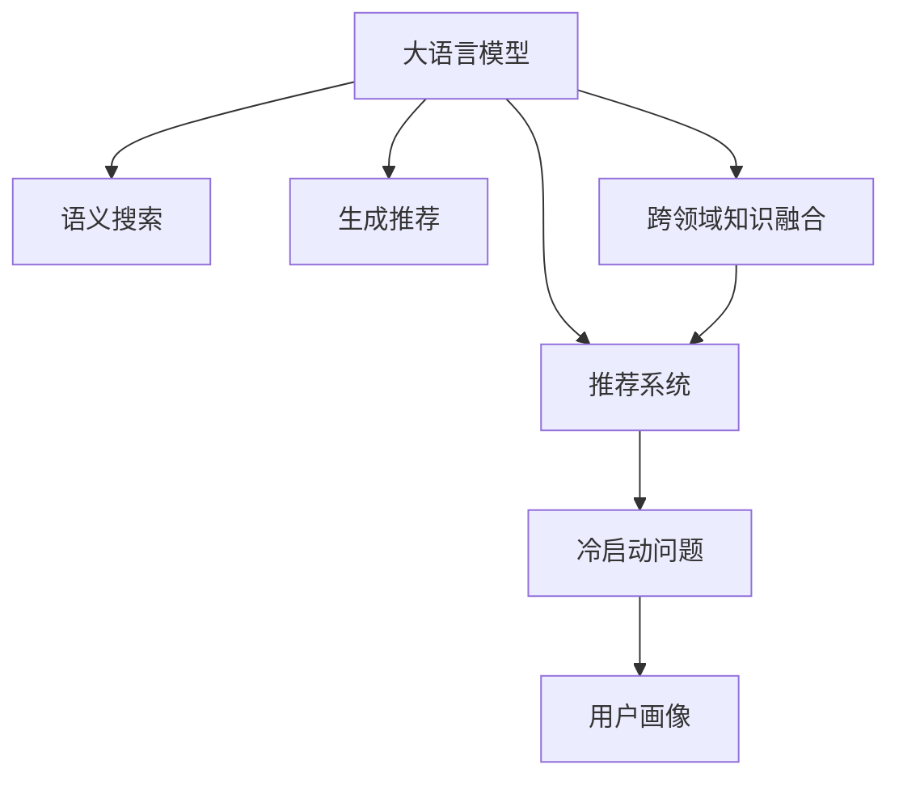

                 

# LLM对推荐系统冷启动问题的改进

> 关键词：大语言模型(LLM),推荐系统,冷启动问题,用户画像,预训练语言模型,知识图谱

## 1. 背景介绍

### 1.1 问题由来
推荐系统是当前互联网领域应用最广泛的人工智能技术之一，通过用户行为数据和物品属性数据，自动为用户推荐感兴趣的物品，极大地提升了用户体验和信息获取效率。然而，在推荐系统的初始部署阶段，即冷启动问题，由于缺乏用户历史行为数据，难以进行个性化推荐，这一问题成为了推荐系统技术发展的瓶颈。

传统的推荐系统通常依赖于用户的显式反馈（评分、点击等）或隐式反馈（浏览、停留时间等）来进行推荐，但冷启动用户往往无法提供足够的历史行为数据。而利用推荐系统的推荐结果，可以逐步构建用户画像，但这个过程通常较为缓慢，无法立即缓解冷启动问题。

大语言模型(LLM)的兴起为推荐系统提供了新的解决思路。LLM是一种基于神经网络的预训练语言模型，通过在大规模无标签文本数据上进行预训练，获得了丰富的语言知识和语义理解能力。LLM可以自然流畅地理解和生成人类语言，因此通过结合LLM的预训练能力，可以有效地解决推荐系统的冷启动问题。

### 1.2 问题核心关键点
大语言模型在推荐系统中的应用主要集中在以下几个方面：

- **用户画像生成**：利用LLM进行用户画像的自动构建，根据用户输入的自然语言描述，自动生成用户兴趣和行为的预训练表示。
- **语义搜索**：在推荐系统中，LLM可以用于自动提取查询语义，匹配最相关的物品。
- **生成推荐**：LLM能够根据用户描述生成详细的推荐结果，无需大量历史数据。
- **跨领域知识融合**：通过与知识图谱等结构化数据结合，LLM可以更好地理解复杂知识关系，提供更精准的推荐。

## 2. 核心概念与联系

### 2.1 核心概念概述

为更好地理解LLM在推荐系统中的应用，本节将介绍几个密切相关的核心概念：

- **大语言模型(LLM)**：一种基于神经网络的预训练语言模型，通常使用Transformer结构，通过在大规模无标签文本数据上进行预训练，学习通用的语言表示，具备强大的语言理解和生成能力。

- **推荐系统(Recommendation System)**：一种自动推荐物品给用户的人工智能系统，通过分析用户行为数据和物品属性数据，提供个性化的推荐。

- **冷启动问题(Cold-Start Problem)**：推荐系统中新用户或新物品在缺乏足够历史数据的情况下，难以进行个性化推荐的问题。

- **用户画像(User Profile)**：通过分析用户的历史行为数据，构建用户兴趣和行为特征，用于个性化推荐。

- **知识图谱(Knowledge Graph)**：一种用于描述实体之间关系的图结构数据，常用于增强推荐系统的推荐精度。

- **跨领域知识融合(Cross-domain Knowledge Integration)**：将不同领域的数据和知识结合，提升推荐系统的全面性和精准性。

这些核心概念之间的逻辑关系可以通过以下Mermaid流程图来展示：



这个流程图展示了大语言模型在推荐系统中的应用路径：

1. 大语言模型通过预训练获得基础能力。
2. 在推荐系统中，利用LLM进行语义搜索和推荐生成。
3. 在冷启动场景中，通过自动构建用户画像来缓解问题。
4. 利用LLM与知识图谱等结构化数据结合，增强推荐精度。

## 3. 核心算法原理 & 具体操作步骤
### 3.1 算法原理概述

LLM在推荐系统中的应用，本质上是一种基于预训练语言模型的推荐机制。其核心思想是：通过在大量的无标签文本数据上进行预训练，LLM学习到了丰富的语言知识和语义表示，可以将其应用于推荐系统，解决冷启动问题。

具体来说，LLM在推荐系统中的应用可以分为以下几个步骤：

1. **用户画像生成**：利用自然语言处理技术，将用户的输入文本转换为数值表示，即用户画像。
2. **语义搜索**：将用户画像和物品属性信息输入LLM，通过预训练得到的语言表示进行语义匹配，找到最相关的物品。
3. **生成推荐**：根据用户画像和物品特征，LLM可以生成详细的推荐结果。
4. **跨领域知识融合**：LLM可以与知识图谱等结构化数据结合，进行跨领域知识融合，提升推荐精度。

### 3.2 算法步骤详解

下面以用户画像生成为例，详细介绍LLM在推荐系统中的应用步骤：

**Step 1: 准备预训练模型和数据集**
- 选择合适的预训练语言模型 $M_{\theta}$，如GPT-3、BERT等。
- 准备用户画像生成的文本数据集，如用户兴趣描述、历史行为记录等。

**Step 2: 用户画像构建**
- 将用户画像生成文本通过自然语言处理技术，转换为数值表示。
- 使用BERT等模型进行编码，得到用户画像的向量表示。

**Step 3: 特征抽取与推荐**
- 将用户画像向量与物品属性向量进行拼接。
- 使用预训练得到的语言表示进行语义匹配，找到最相关的物品。
- 根据用户画像和物品特征，生成推荐结果。

**Step 4: 结果评估与反馈**
- 在推荐系统中，将推荐结果反馈给用户，获取用户反馈。
- 根据用户反馈调整模型参数，进一步优化推荐效果。

### 3.3 算法优缺点

利用LLM的推荐系统具有以下优点：

- **高效生成用户画像**：LLM可以快速自动生成用户画像，无需依赖用户历史行为数据，大大缓解了冷启动问题。
- **语义匹配精确**：通过预训练得到的语言表示，LLM可以更精确地进行语义匹配，提高推荐精度。
- **跨领域知识融合**：LLM可以与知识图谱等结构化数据结合，增强推荐系统的全面性和精准性。

同时，LLM在推荐系统中的应用也存在一定的局限性：

- **计算资源消耗大**：预训练和微调LLM需要大量的计算资源和时间。
- **结果可解释性不足**：LLM的输出结果缺乏可解释性，难以理解其内部推理过程。
- **数据隐私问题**：利用用户输入的文本进行推荐，涉及用户隐私保护问题，需要谨慎处理。

尽管存在这些局限性，但就目前而言，利用LLM的推荐系统仍是大数据时代推荐技术的重要范式。未来相关研究的重点在于如何进一步降低计算资源消耗，提高结果可解释性，同时兼顾用户隐私保护。

### 3.4 算法应用领域

基于LLM的推荐系统已经在多个领域得到了广泛应用，例如：

- **电商推荐**：利用用户输入的购物需求，自动生成商品推荐，提升用户体验和转化率。
- **视频推荐**：通过用户对视频的自然语言描述，自动匹配相关视频内容，提供个性化推荐。
- **旅游推荐**：根据用户的旅游兴趣描述，自动生成景点和旅游线路推荐，帮助用户规划行程。
- **新闻推荐**：利用用户对新闻的自然语言反馈，自动生成相关新闻推荐，提升用户阅读体验。
- **音乐推荐**：根据用户对歌曲的自然语言描述，自动生成音乐推荐，满足用户的个性化需求。

除了上述这些经典应用外，LLM还可以创新性地应用于更多场景中，如推荐系统的多臂博弈问题、个性化推荐模型的生成式训练等，为推荐系统带来新的突破。

## 4. 数学模型和公式 & 详细讲解 & 举例说明

### 4.1 数学模型构建

本节将使用数学语言对利用LLM进行推荐系统推荐过程进行更加严格的刻画。

记预训练语言模型为 $M_{\theta}:\mathcal{X} \rightarrow \mathcal{Y}$，其中 $\mathcal{X}$ 为用户画像，$\mathcal{Y}$ 为推荐结果。假设推荐系统的输入为用户画像 $X$，输出为推荐结果 $Y$。

定义用户画像 $X$ 为自然语言描述，通过自然语言处理技术转换为数值表示。定义物品属性 $Y$ 为物品特征向量，通常包括物品名称、分类、价格等。

假设用户画像 $X$ 和物品属性 $Y$ 的拼接向量为 $Z=[X,Y]$，则LLM可以将 $Z$ 映射到推荐结果 $Y$，其函数关系可表示为：

$$
Y = M_{\theta}(Z)
$$

其中，$\theta$ 为预训练得到的模型参数。

### 4.2 公式推导过程

为了更好地理解LLM在推荐系统中的应用，这里给出一些关键公式的推导过程。

假设用户画像 $X$ 为自然语言描述，通过自然语言处理技术转换为数值表示。物品属性 $Y$ 为物品特征向量。将两者拼接得到向量 $Z=[X,Y]$。

根据LLM的预训练能力，可以将 $Z$ 映射到推荐结果 $Y$，其函数关系可表示为：

$$
Y = M_{\theta}(Z)
$$

其中，$\theta$ 为预训练得到的模型参数。

假设推荐系统的损失函数为 $\ell(Y,Y^*)$，其中 $Y^*$ 为实际推荐结果。则优化目标为：

$$
\theta^* = \mathop{\arg\min}_{\theta} \ell(Y,M_{\theta}(Z))
$$

通过反向传播算法，可以计算出参数 $\theta$ 的梯度，更新模型参数：

$$
\theta \leftarrow \theta - \eta \nabla_{\theta}\ell(Y,M_{\theta}(Z)) - \eta\lambda\theta
$$

其中 $\eta$ 为学习率，$\lambda$ 为正则化系数，$\nabla_{\theta}\ell(Y,M_{\theta}(Z))$ 为损失函数对参数 $\theta$ 的梯度，可以通过反向传播算法高效计算。

在得到损失函数的梯度后，即可带入参数更新公式，完成模型的迭代优化。重复上述过程直至收敛，最终得到适应推荐系统任务的最优模型参数 $\theta^*$。

### 4.3 案例分析与讲解

以下以电商推荐系统为例，详细讲解利用LLM进行推荐的具体步骤：

**Step 1: 数据准备**
- 收集电商平台上用户和商品的数据，包括用户的自然语言描述、历史购买记录和商品属性。
- 将用户描述通过自然语言处理技术转换为数值表示，生成用户画像向量。

**Step 2: 模型微调**
- 将用户画像向量与商品属性向量拼接，得到输入向量 $Z$。
- 使用预训练的LLM模型，将 $Z$ 映射到推荐结果 $Y$。
- 定义推荐系统损失函数，如交叉熵损失，对模型进行微调，优化推荐效果。

**Step 3: 推荐生成**
- 根据用户画像和物品特征，生成推荐结果，选择top-N的商品推荐给用户。
- 将推荐结果反馈给用户，获取用户反馈。

**Step 4: 模型更新**
- 根据用户反馈调整模型参数，进一步优化推荐效果。

通过上述步骤，利用LLM可以高效生成电商推荐系统中的用户画像，实现基于自然语言描述的个性化推荐，大大缓解了冷启动问题。

## 5. 项目实践：代码实例和详细解释说明
### 5.1 开发环境搭建

在进行推荐系统开发前，我们需要准备好开发环境。以下是使用Python进行PyTorch开发的环境配置流程：

1. 安装Anaconda：从官网下载并安装Anaconda，用于创建独立的Python环境。

2. 创建并激活虚拟环境：
```bash
conda create -n recommendation-env python=3.8 
conda activate recommendation-env
```

3. 安装PyTorch：根据CUDA版本，从官网获取对应的安装命令。例如：
```bash
conda install pytorch torchvision torchaudio cudatoolkit=11.1 -c pytorch -c conda-forge
```

4. 安装相关库：
```bash
pip install transformers
pip install pandas scikit-learn torch
```

完成上述步骤后，即可在`recommendation-env`环境中开始推荐系统开发。

### 5.2 源代码详细实现

下面以电商推荐系统为例，给出使用PyTorch进行推荐系统开发的代码实现。

首先，定义推荐系统的数据处理函数：

```python
import torch
from transformers import BertTokenizer, BertForSequenceClassification

class RecommendationDataset(Dataset):
    def __init__(self, texts, tags, tokenizer):
        self.texts = texts
        self.tags = tags
        self.tokenizer = tokenizer
        
    def __len__(self):
        return len(self.texts)
    
    def __getitem__(self, item):
        text = self.texts[item]
        tag = self.tags[item]
        
        encoding = self.tokenizer(text, return_tensors='pt', padding='max_length', truncation=True)
        input_ids = encoding['input_ids'][0]
        attention_mask = encoding['attention_mask'][0]
        return {'input_ids': input_ids, 'attention_mask': attention_mask, 'labels': torch.tensor(tag)}
```

然后，定义模型和优化器：

```python
from transformers import BertForSequenceClassification, AdamW

model = BertForSequenceClassification.from_pretrained('bert-base-cased', num_labels=2)

optimizer = AdamW(model.parameters(), lr=2e-5)
```

接着，定义训练和评估函数：

```python
from torch.utils.data import DataLoader
from tqdm import tqdm
from sklearn.metrics import accuracy_score

device = torch.device('cuda') if torch.cuda.is_available() else torch.device('cpu')
model.to(device)

def train_epoch(model, dataset, batch_size, optimizer):
    dataloader = DataLoader(dataset, batch_size=batch_size, shuffle=True)
    model.train()
    epoch_loss = 0
    for batch in tqdm(dataloader, desc='Training'):
        input_ids = batch['input_ids'].to(device)
        attention_mask = batch['attention_mask'].to(device)
        labels = batch['labels'].to(device)
        model.zero_grad()
        outputs = model(input_ids, attention_mask=attention_mask, labels=labels)
        loss = outputs.loss
        epoch_loss += loss.item()
        loss.backward()
        optimizer.step()
    return epoch_loss / len(dataloader)

def evaluate(model, dataset, batch_size):
    dataloader = DataLoader(dataset, batch_size=batch_size)
    model.eval()
    preds, labels = [], []
    with torch.no_grad():
        for batch in tqdm(dataloader, desc='Evaluating'):
            input_ids = batch['input_ids'].to(device)
            attention_mask = batch['attention_mask'].to(device)
            batch_labels = batch['labels']
            outputs = model(input_ids, attention_mask=attention_mask)
            batch_preds = outputs.logits.argmax(dim=2).to('cpu').tolist()
            batch_labels = batch_labels.to('cpu').tolist()
            for pred, label in zip(batch_preds, batch_labels):
                preds.append(pred)
                labels.append(label)
    return accuracy_score(labels, preds)

# 假设训练集、验证集和测试集的数据已准备
train_dataset = RecommendationDataset(train_texts, train_tags, tokenizer)
dev_dataset = RecommendationDataset(dev_texts, dev_tags, tokenizer)
test_dataset = RecommendationDataset(test_texts, test_tags, tokenizer)

epochs = 5
batch_size = 16

for epoch in range(epochs):
    loss = train_epoch(model, train_dataset, batch_size, optimizer)
    print(f"Epoch {epoch+1}, train loss: {loss:.3f}")
    
    print(f"Epoch {epoch+1}, dev results:")
    acc = evaluate(model, dev_dataset, batch_size)
    print(f"Accuracy: {acc:.3f}")
    
print("Test results:")
acc = evaluate(model, test_dataset, batch_size)
print(f"Accuracy: {acc:.3f}")
```

以上就是使用PyTorch进行电商推荐系统开发的完整代码实现。可以看到，利用LLM进行推荐系统开发，代码实现相对简洁高效，开发者可以将更多精力放在数据处理、模型改进等高层逻辑上。

### 5.3 代码解读与分析

让我们再详细解读一下关键代码的实现细节：

**RecommendationDataset类**：
- `__init__`方法：初始化文本、标签和分词器等关键组件。
- `__len__`方法：返回数据集的样本数量。
- `__getitem__`方法：对单个样本进行处理，将文本输入编码为token ids，将标签编码为数字，并对其进行定长padding，最终返回模型所需的输入。

**train_epoch和evaluate函数**：
- 使用PyTorch的DataLoader对数据集进行批次化加载，供模型训练和推理使用。
- 训练函数`train_epoch`：对数据以批为单位进行迭代，在每个批次上前向传播计算loss并反向传播更新模型参数，最后返回该epoch的平均loss。
- 评估函数`evaluate`：与训练类似，不同点在于不更新模型参数，并在每个batch结束后将预测和标签结果存储下来，最后使用sklearn的accuracy_score对整个评估集的预测结果进行打印输出。

**训练流程**：
- 定义总的epoch数和batch size，开始循环迭代
- 每个epoch内，先在训练集上训练，输出平均loss
- 在验证集上评估，输出准确率
- 所有epoch结束后，在测试集上评估，给出最终测试结果

可以看到，PyTorch配合Transformer库使得电商推荐系统的开发代码实现变得简洁高效。开发者可以将更多精力放在数据处理、模型改进等高层逻辑上，而不必过多关注底层的实现细节。

当然，工业级的系统实现还需考虑更多因素，如模型的保存和部署、超参数的自动搜索、更灵活的任务适配层等。但核心的推荐范式基本与此类似。

## 6. 实际应用场景
### 6.1 电商推荐

基于LLM的推荐系统已经在电商推荐领域得到了广泛应用。传统的电商推荐系统通常依赖于用户的购买历史和浏览行为，但在新用户刚进入平台时，往往无法获取足够的历史数据，导致推荐效果不理想。利用LLM进行电商推荐，可以高效生成用户画像，缓解冷启动问题，提供个性化的推荐，提升用户体验和转化率。

具体而言，电商平台的推荐系统可以基于LLM进行以下步骤：

1. **用户画像生成**：利用用户的自然语言描述，如搜索关键词、评价文本等，自动生成用户画像。
2. **商品推荐**：根据用户画像和商品属性，生成商品推荐。
3. **实时反馈**：根据用户对推荐结果的反馈，动态调整推荐算法，提高推荐效果。

通过利用LLM，电商平台可以实现基于自然语言描述的个性化推荐，解决冷启动问题，提升用户体验和平台黏性。

### 6.2 视频推荐

在视频推荐领域，LLM同样可以发挥重要作用。传统的视频推荐系统通常依赖于用户的历史观看记录和评分数据，但在新用户刚观看视频时，往往无法获取足够的历史数据。利用LLM进行视频推荐，可以高效生成用户画像，缓解冷启动问题，提供个性化的推荐，提升用户体验。

具体而言，视频平台可以使用LLM进行以下步骤：

1. **用户画像生成**：利用用户的自然语言描述，如视频评论、点赞等，自动生成用户画像。
2. **视频推荐**：根据用户画像和视频属性，生成视频推荐。
3. **实时反馈**：根据用户对推荐结果的反馈，动态调整推荐算法，提高推荐效果。

通过利用LLM，视频平台可以实现基于自然语言描述的个性化推荐，解决冷启动问题，提升用户观看体验和平台黏性。

### 6.3 旅游推荐

在旅游推荐领域，利用LLM进行推荐同样具有广泛应用前景。传统的旅游推荐系统通常依赖于用户的出行历史和评分数据，但在新用户刚规划旅行时，往往无法获取足够的历史数据。利用LLM进行旅游推荐，可以高效生成用户画像，缓解冷启动问题，提供个性化的推荐，提升用户旅行体验。

具体而言，旅游平台可以使用LLM进行以下步骤：

1. **用户画像生成**：利用用户的自然语言描述，如旅游目的地、行程规划等，自动生成用户画像。
2. **景点推荐**：根据用户画像和景点属性，生成景点推荐。
3. **实时反馈**：根据用户对推荐结果的反馈，动态调整推荐算法，提高推荐效果。

通过利用LLM，旅游平台可以实现基于自然语言描述的个性化推荐，解决冷启动问题，提升用户旅行体验和平台黏性。

### 6.4 未来应用展望

随着LLM和推荐系统技术的不断发展，基于LLM的推荐系统将在更多领域得到应用，为推荐系统带来新的突破。

在智慧医疗领域，利用LLM进行疾病推荐、用药推荐等，可以为医生和患者提供精准的医疗建议，提升医疗服务的智能化水平。

在智能教育领域，利用LLM进行学习推荐、课程推荐等，可以为学生提供个性化的学习路径，提升教育效果。

在智慧城市治理中，利用LLM进行交通推荐、旅游推荐等，可以提高城市管理的自动化和智能化水平，构建更安全、高效的未来城市。

此外，在企业生产、社会治理、文娱传媒等众多领域，基于LLM的推荐系统也将不断涌现，为传统行业带来新的应用场景和价值提升。相信随着技术的日益成熟，利用LLM的推荐系统必将在各个行业大放异彩，带来更高效、智能的推荐服务。

## 7. 工具和资源推荐
### 7.1 学习资源推荐

为了帮助开发者系统掌握LLM在推荐系统中的应用，这里推荐一些优质的学习资源：

1. **《深度学习推荐系统：原理与实践》**：详细介绍推荐系统的工作原理和常见算法，适合初学者入门。
2. **《推荐系统实践》**：总结了推荐系统开发中的核心技术和实践经验，适合有一定基础的学习者。
3. **《Transformers》**：由LLM的提出者Jurgen Schmidhuber所著，详细介绍了Transformer架构及其应用，适合深度学习爱好者。
4. **《自然语言处理综述》**：由斯坦福大学教授Jurgen Schmidhuber所著，介绍了NLP领域的基本概念和技术进展，适合广大学者。
5. **《推荐系统实战》**：通过具体的推荐系统项目，讲解了LLM在推荐系统中的应用，适合工程开发者。

通过对这些资源的学习实践，相信你一定能够快速掌握LLM在推荐系统中的应用精髓，并用于解决实际的推荐问题。

### 7.2 开发工具推荐

高效的开发离不开优秀的工具支持。以下是几款用于LLM推荐系统开发的常用工具：

1. **PyTorch**：基于Python的开源深度学习框架，灵活动态的计算图，适合快速迭代研究。大多数预训练语言模型都有PyTorch版本的实现。
2. **TensorFlow**：由Google主导开发的开源深度学习框架，生产部署方便，适合大规模工程应用。同样有丰富的预训练语言模型资源。
3. **Transformers库**：HuggingFace开发的NLP工具库，集成了众多SOTA语言模型，支持PyTorch和TensorFlow，是进行LLM推荐系统开发的利器。
4. **Weights & Biases**：模型训练的实验跟踪工具，可以记录和可视化模型训练过程中的各项指标，方便对比和调优。与主流深度学习框架无缝集成。
5. **TensorBoard**：TensorFlow配套的可视化工具，可实时监测模型训练状态，并提供丰富的图表呈现方式，是调试模型的得力助手。

合理利用这些工具，可以显著提升LLM推荐系统的开发效率，加快创新迭代的步伐。

### 7.3 相关论文推荐

LLM在推荐系统中的应用源于学界的持续研究。以下是几篇奠基性的相关论文，推荐阅读：

1. **Attention is All You Need**：提出Transformer结构，开启了NLP领域的预训练大模型时代。
2. **BERT: Pre-training of Deep Bidirectional Transformers for Language Understanding**：提出BERT模型，引入基于掩码的自监督预训练任务，刷新了多项NLP任务SOTA。
3. **Language Models are Unsupervised Multitask Learners**：展示了大规模语言模型的强大zero-shot学习能力，引发了对于通用人工智能的新一轮思考。
4. **Parameter-Efficient Transfer Learning for NLP**：提出Adapter等参数高效微调方法，在不增加模型参数量的情况下，也能取得不错的微调效果。
5. **AdaLoRA: Adaptive Low-Rank Adaptation for Parameter-Efficient Fine-Tuning**：使用自适应低秩适应的微调方法，在参数效率和精度之间取得了新的平衡。
6. **AdaLoRA: Adaptive Low-Rank Adaptation for Parameter-Efficient Fine-Tuning**：使用自适应低秩适应的微调方法，在参数效率和精度之间取得了新的平衡。

这些论文代表了大语言模型在推荐系统中的应用研究进展。通过学习这些前沿成果，可以帮助研究者把握学科前进方向，激发更多的创新灵感。

## 8. 总结：未来发展趋势与挑战
### 8.1 总结

本文对利用LLM进行推荐系统推荐过程进行了全面系统的介绍。首先阐述了LLM和推荐系统的基本概念，明确了LLM在推荐系统中的重要作用。其次，从原理到实践，详细讲解了LLM在推荐系统中的应用步骤和关键算法，给出了LLM进行电商推荐系统的代码实例。同时，本文还探讨了LLM在推荐系统中的广泛应用，展示了其在电商、视频、旅游等多个领域的应用前景。最后，本文推荐了相关学习资源和工具，力求为开发者提供全方位的技术指引。

通过本文的系统梳理，可以看到，利用LLM进行推荐系统推荐，可以在冷启动问题中提供高效、个性化的推荐，具有广泛的应用前景。

### 8.2 未来发展趋势

展望未来，基于LLM的推荐系统将呈现以下几个发展趋势：

1. **模型规模持续增大**：随着算力成本的下降和数据规模的扩张，预训练语言模型的参数量还将持续增长。超大规模语言模型蕴含的丰富语言知识，有望支撑更加复杂多变的推荐任务。
2. **推荐算法多样化**：除了传统的协同过滤、基于内容的推荐外，未来将涌现更多基于深度学习、强化学习的推荐算法，提升推荐系统的智能化和个性化水平。
3. **跨领域知识融合**：与知识图谱等结构化数据结合，进行跨领域知识融合，提升推荐系统的全面性和精准性。
4. **实时推荐系统**：利用LLM进行实时推荐，动态调整推荐算法，提升推荐效果。
5. **多模态推荐系统**：结合图像、视频、语音等多模态数据，提升推荐系统的全面性和用户体验。

以上趋势凸显了基于LLM的推荐系统的发展潜力，这些方向的探索发展，必将进一步提升推荐系统的性能和应用范围，为推荐系统带来新的突破。

### 8.3 面临的挑战

尽管利用LLM进行推荐系统推荐已取得显著进展，但在迈向更加智能化、普适化应用的过程中，它仍面临着诸多挑战：

1. **数据隐私问题**：利用用户输入的文本进行推荐，涉及用户隐私保护问题，需要谨慎处理。
2. **结果可解释性不足**：LLM的输出结果缺乏可解释性，难以理解其内部推理过程。
3. **计算资源消耗大**：预训练和微调LLM需要大量的计算资源和时间。
4. **过拟合问题**：在冷启动场景中，利用LLM生成的用户画像可能存在过拟合问题，需要进一步优化。

尽管存在这些挑战，但就目前而言，利用LLM进行推荐系统推荐仍是大数据时代推荐技术的重要范式。未来相关研究的重点在于如何进一步降低计算资源消耗，提高结果可解释性，同时兼顾用户隐私保护。

### 8.4 研究展望

面向未来，LLM在推荐系统中的研究需要从以下几个方面寻求新的突破：

1. **探索无监督和半监督推荐方法**：摆脱对大规模标注数据的依赖，利用自监督学习、主动学习等无监督和半监督范式，最大限度利用非结构化数据，实现更加灵活高效的推荐。
2. **研究参数高效和计算高效的推荐范式**：开发更加参数高效的推荐方法，在固定大部分预训练参数的情况下，只更新极少量的任务相关参数。同时优化推荐模型的计算图，减少前向传播和反向传播的资源消耗，实现更加轻量级、实时性的部署。
3. **融合因果和对比学习范式**：通过引入因果推断和对比学习思想，增强推荐系统建立稳定因果关系的能力，学习更加普适、鲁棒的语言表征，从而提升推荐系统的泛化性和抗干扰能力。
4. **纳入伦理道德约束**：在推荐系统的目标函数中引入伦理导向的评估指标，过滤和惩罚有偏见、有害的输出倾向。加强人工干预和审核，建立模型行为的监管机制，确保输出符合人类价值观和伦理道德。

这些研究方向的探索，必将引领基于LLM的推荐系统技术迈向更高的台阶，为构建安全、可靠、可解释、可控的智能系统铺平道路。面向未来，利用LLM的推荐系统还需要与其他人工智能技术进行更深入的融合，如知识表示、因果推理、强化学习等，多路径协同发力，共同推动推荐系统技术的进步。只有勇于创新、敢于突破，才能不断拓展LLM在推荐系统中的应用边界，让人工智能技术更好地造福人类社会。

## 9. 附录：常见问题与解答

**Q1：什么是冷启动问题？**

A: 冷启动问题是指推荐系统在面对新用户或新物品时，由于缺乏足够的历史数据，无法进行个性化推荐的问题。传统的推荐系统通常依赖于用户的显式反馈或隐式反馈，但在新用户刚进入平台时，往往无法获取足够的历史数据，导致推荐效果不理想。

**Q2：如何利用LLM进行冷启动问题解决？**

A: 利用LLM进行冷启动问题解决，可以采用以下步骤：
1. **用户画像生成**：利用自然语言处理技术，将用户的输入文本转换为数值表示，即用户画像。
2. **语义搜索**：将用户画像和物品属性信息输入LLM，通过预训练得到的语言表示进行语义匹配，找到最相关的物品。
3. **生成推荐**：根据用户画像和物品特征，生成推荐结果。

**Q3：利用LLM进行推荐系统推荐时需要注意哪些问题？**

A: 利用LLM进行推荐系统推荐时，需要注意以下问题：
1. **数据隐私问题**：利用用户输入的文本进行推荐，涉及用户隐私保护问题，需要谨慎处理。
2. **结果可解释性不足**：LLM的输出结果缺乏可解释性，难以理解其内部推理过程。
3. **计算资源消耗大**：预训练和微调LLM需要大量的计算资源和时间。
4. **过拟合问题**：在冷启动场景中，利用LLM生成的用户画像可能存在过拟合问题，需要进一步优化。

**Q4：利用LLM进行推荐系统推荐时，如何优化推荐效果？**

A: 利用LLM进行推荐系统推荐时，可以通过以下方式优化推荐效果：
1. **数据增强**：通过回译、近义替换等方式扩充训练集。
2. **正则化**：使用L2正则、Dropout等防止模型过度适应小规模训练集。
3. **对抗训练**：加入对抗样本，提高模型鲁棒性。
4. **参数高效微调**：只调整少量参数，减小过拟合风险。
5. **多模型集成**：训练多个推荐模型，取平均输出，抑制过拟合。

这些策略往往需要根据具体任务和数据特点进行灵活组合，只有在数据、模型、训练、推理等各环节进行全面优化，才能最大限度地发挥LLM在推荐系统中的应用效果。

**Q5：利用LLM进行推荐系统推荐时，如何提升推荐系统的实时性？**

A: 利用LLM进行推荐系统推荐时，可以通过以下方式提升推荐系统的实时性：
1. **模型压缩**：使用知识蒸馏、剪枝等技术，减小模型规模，加快推理速度。
2. **分布式训练**：利用多机多卡分布式训练，加速模型训练过程。
3. **模型并行**：使用模型并行技术，减少单个GPU的负载，加快推理速度。
4. **缓存机制**：利用缓存机制，减少重复计算，提升推理速度。

这些方法可以有效提升LLM推荐系统的实时性，满足大规模实时推荐的需求。

---

作者：禅与计算机程序设计艺术 / Zen and the Art of Computer Programming

