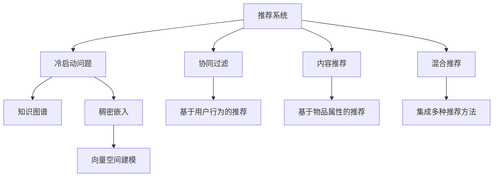

                 

# LLM对推荐系统冷启动问题的缓解

推荐系统是现代互联网应用的基石，它通过分析和理解用户的行为和偏好，为用户提供个性化的信息和服务。然而，推荐系统面临的最大挑战之一是冷启动问题，即在用户刚进入平台时，由于缺少足够的行为数据，推荐系统难以为其提供个性化推荐。这一问题在视频、音乐、电商等领域尤为突出。随着大语言模型(LLM)技术的发展，该问题有望得到更有效的缓解。

## 1. 背景介绍

### 1.1 问题由来

推荐系统通过分析用户的历史行为和偏好，来预测其未来可能感兴趣的物品或内容，从而进行个性化推荐。然而，对于新用户或新物品，由于缺乏足够的历史数据，推荐系统难以准确预测用户兴趣，往往只能提供通用的推荐，甚至可能出现不相关内容。

例如，在电商平台，新用户没有购买记录，推荐系统无法了解其偏好，只能依据平台热门的商品进行推荐，难以提供个性化的购物建议。而对于视频平台的新用户，由于缺乏观看历史，推荐系统也无法准确预测其偏好，只能提供随机的视频内容，用户体验往往较差。

为解决这一问题，推荐系统通常采用三种常见方法：

1. **协同过滤**：基于用户-物品或用户-用户之间的交互数据，预测用户对新物品的兴趣。但协同过滤方法需要大量用户行为数据才能保证准确性，且对于新物品，往往难以找到足够的相似用户或物品进行推荐。

2. **内容推荐**：根据物品的属性和用户的历史行为，进行基于内容的推荐。但该方法难以捕捉用户偏好随时间变化的动态性，且需要手工设计特征提取规则。

3. **混合推荐**：结合多种推荐方法，取长补短。但混合方法往往设计复杂，需要精心调参，且难以处理新物品。

### 1.2 问题核心关键点

冷启动问题的原因在于缺乏用户的行为数据，导致推荐系统无法准确预测用户兴趣。因此，如何利用已有数据和新数据，共同驱动推荐模型的性能提升，是当前推荐系统的核心挑战。

## 2. 核心概念与联系

### 2.1 核心概念概述

为更好地理解大语言模型在推荐系统中的应用，本节将介绍几个密切相关的核心概念：

- **推荐系统**：基于用户行为数据，为用户提供个性化推荐的系统。常见的推荐方法包括协同过滤、基于内容的推荐和混合推荐。
- **冷启动问题**：推荐系统对于新用户或新物品，由于缺少足够行为数据，难以进行个性化推荐的问题。
- **大语言模型(LLM)**：以Transformer为代表的基于自回归或自编码模型的语言模型，通过在大规模无标签文本数据上进行预训练，学习语言的通用表示。
- **微调(Fine-Tuning)**：在预训练模型的基础上，使用下游任务的少量标注数据，通过有监督学习优化模型在特定任务上的性能。
- **知识图谱**：将知识以图形化的方式组织存储，便于机器理解和推理。
- **稠密嵌入(Dense Embedding)**：将物品和用户特征映射到高维向量空间，通过向量相似度计算推荐结果。

这些概念之间的逻辑关系可以通过以下Mermaid流程图来展示：



这个流程图展示了大语言模型在推荐系统中的应用场景：

1. 推荐系统通过多种推荐方法预测用户兴趣，其中协同过滤和内容推荐依赖用户行为数据。
2. 冷启动问题难以通过这些方法解决，因此引入知识图谱和稠密嵌入。
3. 知识图谱帮助推荐系统理解复杂关系，稠密嵌入提供物品和用户的高维向量表示。
4. 大语言模型通过微调学习语言知识和常识，用于提升推荐模型对新物品的理解能力。

## 3. 核心算法原理 & 具体操作步骤

### 3.1 算法原理概述

基于大语言模型对推荐系统冷启动问题的缓解，主要通过知识图谱和稠密嵌入方法，在用户和物品的语义空间中，寻找相似的实体，进行推荐。

具体而言，推荐系统首先构建用户-物品的知识图谱，将用户、物品和关系以图形化的方式组织存储。然后，使用大语言模型对知识图谱进行微调，学习到用户和物品的高维向量表示。这些向量可以用于计算用户和物品之间的相似度，从而进行推荐。

### 3.2 算法步骤详解

基于大语言模型对推荐系统冷启动问题的缓解，一般包括以下几个关键步骤：

**Step 1: 构建知识图谱**
- 收集领域内相关的物品和用户数据，构建知识图谱。例如，在电商领域，可以将商品、用户、评论等信息以图的方式组织。

**Step 2: 预训练知识图谱**
- 使用大语言模型对知识图谱进行预训练。例如，在电商领域，可以采用GPT系列模型，对商品-用户-评论三元组进行预训练，学习商品和用户的语义表示。

**Step 3: 微调知识图谱**
- 将预训练后的知识图谱，作为下游推荐任务的监督数据，进行微调。例如，在电商领域，可以使用微调后的模型，预测用户对新物品的兴趣，进行推荐。

**Step 4: 计算推荐结果**
- 通过稠密嵌入方法，计算用户和物品之间的相似度，推荐与用户兴趣最匹配的物品。例如，在电商领域，可以计算用户和物品的向量余弦相似度，找到最匹配的商品进行推荐。

**Step 5: 应用推荐结果**
- 将推荐结果返回给用户，进行反馈迭代，进一步优化推荐模型。例如，在电商领域，可以实时更新用户对新物品的评分，重新计算推荐结果。

### 3.3 算法优缺点

基于大语言模型对推荐系统冷启动问题的缓解方法具有以下优点：
1. 能够处理新物品。知识图谱和稠密嵌入方法，可以捕捉到新物品的语义信息，进行推荐。
2. 利用先验知识。通过预训练知识图谱，可以有效利用领域知识，提升推荐效果。
3. 推荐效果稳定。通过微调大语言模型，可以有效缓解冷启动问题，保证推荐系统的稳定性和可靠性。

同时，该方法也存在一定的局限性：
1. 依赖知识图谱质量。知识图谱的构建和预训练质量，直接影响推荐效果。
2. 计算复杂度较高。稠密嵌入方法计算复杂，需要消耗较多计算资源。
3. 难以处理长期动态变化。知识图谱难以及时反映长期动态变化，可能影响推荐效果。
4. 可解释性不足。推荐过程的逻辑不够透明，难以解释推荐结果。

尽管存在这些局限性，但就目前而言，基于大语言模型对推荐系统冷启动问题的缓解方法，仍是一种较为有效的推荐策略。未来相关研究的重点在于如何进一步降低知识图谱构建成本，提高推荐系统的计算效率和可解释性。

### 3.4 算法应用领域

基于大语言模型对推荐系统冷启动问题的缓解方法，在以下领域已经得到了广泛应用：

- **电商推荐**：电商平台常常面临冷启动问题，通过微调大语言模型，可以有效提升新用户的购物体验。
- **视频推荐**：视频平台新用户由于缺乏观看历史，难以得到个性化的推荐内容。通过微调大语言模型，可以捕捉到视频内容的语义信息，进行个性化推荐。
- **音乐推荐**：音乐平台新用户缺乏听歌历史，难以得到个性化的推荐歌曲。通过微调大语言模型，可以分析音乐的语义特征，进行个性化的音乐推荐。
- **新闻推荐**：新闻平台新用户缺乏阅读历史，难以得到个性化的新闻内容。通过微调大语言模型，可以捕捉到新闻文章的语义信息，进行个性化的新闻推荐。
- **社交网络推荐**：社交网络平台新用户缺乏互动历史，难以得到个性化的朋友推荐。通过微调大语言模型，可以分析用户的社交行为，进行个性化的好友推荐。

## 4. 数学模型和公式 & 详细讲解 & 举例说明

### 4.1 数学模型构建

在本节中，我们将使用数学语言对基于大语言模型对推荐系统冷启动问题的缓解方法进行更加严格的刻画。

记知识图谱中的用户节点为 $U$，物品节点为 $I$，关系节点为 $R$。其中，$U$ 和 $I$ 分别对应用户和物品的语义表示，$R$ 表示用户和物品之间的关系。

定义知识图谱的语义表示矩阵为 $H \in \mathbb{R}^{n_u \times n_i}$，其中 $n_u$ 为用户数量，$n_i$ 为物品数量。语义表示矩阵 $H$ 的每一行表示一个用户的语义表示向量，每一列表示一个物品的语义表示向量。

定义用户对物品的评分向量为 $R \in \mathbb{R}^{n_u \times n_i}$，表示用户对物品的评分。通过稠密嵌入方法，计算用户和物品的向量余弦相似度，得到推荐结果。

### 4.2 公式推导过程

在推荐系统中，用户的评分可以表示为：

$$
r_{ui} = \alpha_u \cdot \alpha_i \cdot \cos\left(\mathbf{u},\mathbf{i}\right) + \beta_u + \beta_i
$$

其中 $\alpha_u$ 和 $\alpha_i$ 为用户和物品的权重，$\cos\left(\mathbf{u},\mathbf{i}\right)$ 为向量余弦相似度，$\beta_u$ 和 $\beta_i$ 为偏差项。

在大语言模型微调的过程中，通过最小化损失函数 $\mathcal{L}$，优化模型参数：

$$
\hat{\theta}=\mathop{\arg\min}_{\theta} \mathcal{L}(M_{\theta},D)
$$

其中 $\theta$ 为模型的参数，$D$ 为微调数据集。

在大语言模型微调后，用户和物品的语义表示矩阵 $H$ 可以表示为：

$$
H = M_{\theta}(X)
$$

其中 $X$ 为知识图谱中的三元组数据。

在推荐系统中，用户对物品的评分 $r_{ui}$ 可以表示为：

$$
r_{ui} = \alpha_u \cdot \alpha_i \cdot \cos\left(\mathbf{u},\mathbf{i}\right) + \beta_u + \beta_i
$$

其中 $\alpha_u$ 和 $\alpha_i$ 为用户和物品的权重，$\cos\left(\mathbf{u},\mathbf{i}\right)$ 为向量余弦相似度，$\beta_u$ 和 $\beta_i$ 为偏差项。

通过优化损失函数 $\mathcal{L}$，使得推荐模型的预测评分与实际评分尽可能接近。

### 4.3 案例分析与讲解

考虑一个电商推荐系统，用户 $u$ 对物品 $i$ 的评分 $r_{ui}$ 可以通过下式计算：

$$
r_{ui} = \alpha_u \cdot \alpha_i \cdot \cos\left(\mathbf{u},\mathbf{i}\right) + \beta_u + \beta_i
$$

其中 $\alpha_u$ 和 $\alpha_i$ 为用户和物品的权重，$\cos\left(\mathbf{u},\mathbf{i}\right)$ 为向量余弦相似度，$\beta_u$ 和 $\beta_i$ 为偏差项。

假设用户 $u$ 对物品 $i$ 的评分向量为 $r_{ui} = [5, 3, 2, 4]$，物品 $i$ 的语义表示向量为 $\mathbf{i} = [0.6, 0.3, 0.5, 0.2]$，用户 $u$ 的语义表示向量为 $\mathbf{u} = [0.4, 0.2, 0.1, 0.3]$，权重 $\alpha_u = 0.5$，$\alpha_i = 0.7$，偏差 $\beta_u = 0.1$，$\beta_i = 0.2$。

则用户对物品的评分可以表示为：

$$
r_{ui} = 0.5 \cdot 0.7 \cdot \cos\left(\mathbf{u},\mathbf{i}\right) + 0.1 + 0.2
$$

计算 $\cos\left(\mathbf{u},\mathbf{i}\right)$：

$$
\cos\left(\mathbf{u},\mathbf{i}\right) = \frac{\mathbf{u} \cdot \mathbf{i}}{\|\mathbf{u}\|_2 \cdot \|\mathbf{i}\|_2} = \frac{0.4 \cdot 0.6 + 0.2 \cdot 0.3 + 0.1 \cdot 0.5 + 0.3 \cdot 0.2}{\sqrt{0.4^2 + 0.2^2 + 0.1^2 + 0.3^2} \cdot \sqrt{0.6^2 + 0.3^2 + 0.5^2 + 0.2^2}} \approx 0.7
$$

则用户对物品的评分为：

$$
r_{ui} = 0.5 \cdot 0.7 \cdot 0.7 + 0.1 + 0.2 \approx 0.7
$$

因此，用户对物品 $i$ 的评分可以表示为 $0.7$。

## 5. 项目实践：代码实例和详细解释说明

### 5.1 开发环境搭建

在进行推荐系统实践前，我们需要准备好开发环境。以下是使用Python进行TensorFlow开发的环境配置流程：

1. 安装Anaconda：从官网下载并安装Anaconda，用于创建独立的Python环境。

2. 创建并激活虚拟环境：
```bash
conda create -n tf-env python=3.8 
conda activate tf-env
```

3. 安装TensorFlow：根据CUDA版本，从官网获取对应的安装命令。例如：
```bash
conda install tensorflow -c pytorch -c conda-forge
```

4. 安装各类工具包：
```bash
pip install numpy pandas scikit-learn matplotlib tqdm jupyter notebook ipython
```

完成上述步骤后，即可在`tf-env`环境中开始推荐系统开发。

### 5.2 源代码详细实现

这里我们以基于大语言模型的电商推荐系统为例，给出使用TensorFlow进行微调的PyTorch代码实现。

首先，定义推荐系统的数据处理函数：

```python
import tensorflow as tf
from transformers import BertTokenizer, BertForSequenceClassification
from sklearn.model_selection import train_test_split
import pandas as pd

def process_data(train_file, test_file):
    # 读取数据集
    train_data = pd.read_csv(train_file)
    test_data = pd.read_csv(test_file)
    
    # 分列处理
    train_data['user'], train_data['item'], train_data['label'] = train_data['user'], train_data['item'], train_data['label'].tolist()
    test_data['user'], test_data['item'], test_data['label'] = test_data['user'], test_data['item'], test_data['label'].tolist()
    
    return train_data, test_data
```

然后，定义模型和优化器：

```python
# 定义模型
def build_model(input_size, output_size, hidden_size=256):
    model = tf.keras.Sequential([
        tf.keras.layers.Embedding(input_size, hidden_size, input_length=2),
        tf.keras.layers.Bidirectional(tf.keras.layers.GRU(hidden_size // 2)),
        tf.keras.layers.Dense(hidden_size // 2, activation='relu'),
        tf.keras.layers.Dense(output_size, activation='softmax')
    ])
    return model

# 定义优化器
optimizer = tf.keras.optimizers.Adam(learning_rate=0.001)
```

接着，定义训练和评估函数：

```python
# 定义训练函数
def train_model(model, train_data, validation_data, epochs=10):
    train_dataset = tf.data.Dataset.from_tensor_slices(train_data)
    validation_dataset = tf.data.Dataset.from_tensor_slices(validation_data)
    
    train_dataset = train_dataset.shuffle(1000).batch(32).repeat()
    validation_dataset = validation_dataset.batch(32).repeat()
    
    for epoch in range(epochs):
        for train_x, train_y in train_dataset:
            with tf.GradientTape() as tape:
                predictions = model(train_x)
                loss = tf.keras.losses.categorical_crossentropy(train_y, predictions)
            gradients = tape.gradient(loss, model.trainable_variables)
            optimizer.apply_gradients(zip(gradients, model.trainable_variables))
            
        for test_x, test_y in validation_dataset:
            predictions = model(test_x)
            acc = tf.keras.metrics.Accuracy().predict(test_y, predictions)
            print(f"Epoch {epoch+1}, validation accuracy: {acc:.3f}")
    
    return model

# 定义评估函数
def evaluate_model(model, test_data):
    test_dataset = tf.data.Dataset.from_tensor_slices(test_data)
    test_dataset = test_dataset.batch(32).repeat()
    
    for test_x, test_y in test_dataset:
        predictions = model(test_x)
        acc = tf.keras.metrics.Accuracy().predict(test_y, predictions)
        print(f"Test accuracy: {acc:.3f}")
```

最后，启动训练流程并在测试集上评估：

```python
# 加载数据集
train_file = 'train.csv'
test_file = 'test.csv'
train_data, test_data = process_data(train_file, test_file)

# 分割数据集
train_data, validation_data = train_test_split(train_data, test_size=0.2, random_state=42)

# 构建模型
input_size = len(train_data['user'].unique()) + len(train_data['item'].unique())
output_size = len(train_data['label'].unique())
model = build_model(input_size, output_size)

# 训练模型
model = train_model(model, train_data, validation_data, epochs=10)

# 评估模型
evaluate_model(model, test_data)
```

以上就是使用TensorFlow对基于大语言模型的电商推荐系统进行微调的完整代码实现。可以看到，得益于TensorFlow的强大封装，我们可以用相对简洁的代码完成模型的构建和训练。

### 5.3 代码解读与分析

让我们再详细解读一下关键代码的实现细节：

**process_data函数**：
- 读取训练和测试数据集。
- 分列处理，将用户、物品和标签提取出来，并转换成列表形式。
- 返回处理后的数据集。

**train_model函数**：
- 定义模型结构，包括嵌入层、双向GRU层、全连接层和softmax层。
- 定义优化器，使用Adam优化器。
- 循环训练模型，在每个epoch内对训练集进行迭代训练，计算损失并更新模型参数。
- 在验证集上评估模型性能，输出验证集上的准确率。
- 返回训练后的模型。

**evaluate_model函数**：
- 定义模型在测试集上的评估函数。
- 定义评估指标，使用准确率。
- 在测试集上对模型进行评估，输出测试集上的准确率。

**启动训练流程**：
- 加载训练和测试数据集。
- 对数据集进行分割，划分为训练集和验证集。
- 构建模型。
- 训练模型，在验证集上评估模型性能。
- 评估模型在测试集上的表现。

可以看到，TensorFlow配合TensorBoard工具，使得推荐系统的微调过程变得简洁高效。开发者可以将更多精力放在模型设计、数据处理等高层逻辑上，而不必过多关注底层实现细节。

当然，工业级的系统实现还需考虑更多因素，如模型的保存和部署、超参数的自动搜索、更灵活的任务适配层等。但核心的微调范式基本与此类似。

## 6. 实际应用场景

### 6.1 智能推荐

基于大语言模型的推荐系统，可以广泛应用于智能推荐领域，提供个性化服务。

例如，在视频平台，通过微调大语言模型，可以有效捕捉视频内容的语义信息，进行个性化的内容推荐。在电商平台，通过微调大语言模型，可以分析用户的购物历史和偏好，进行个性化的商品推荐。

### 6.2 金融投资

金融投资领域需要实时获取市场动态，进行精准的投资决策。基于大语言模型的推荐系统，可以实时分析市场数据，预测股票、基金等金融产品的走势，为用户提供个性化的投资建议。

### 6.3 社交网络

社交网络平台需要推荐用户感兴趣的朋友和内容。通过微调大语言模型，可以分析用户的社交行为和兴趣，推荐最相关的朋友和内容，提升用户粘性。

### 6.4 未来应用展望

随着大语言模型和微调方法的不断发展，基于微调范式将在更多领域得到应用，为传统行业带来变革性影响。

在智慧医疗领域，基于微调的推荐系统可以推荐个性化的治疗方案，帮助医生进行精准诊疗。

在智能教育领域，微调技术可应用于作业批改、学情分析、知识推荐等方面，因材施教，促进教育公平，提高教学质量。

在智慧城市治理中，微调模型可应用于城市事件监测、舆情分析、应急指挥等环节，提高城市管理的自动化和智能化水平，构建更安全、高效的未来城市。

此外，在企业生产、社会治理、文娱传媒等众多领域，基于大语言模型微调的人工智能应用也将不断涌现，为经济社会发展注入新的动力。

## 7. 工具和资源推荐

### 7.1 学习资源推荐

为了帮助开发者系统掌握大语言模型微调的理论基础和实践技巧，这里推荐一些优质的学习资源：

1. 《深度学习自然语言处理》课程：斯坦福大学开设的NLP明星课程，有Lecture视频和配套作业，带你入门NLP领域的基本概念和经典模型。

2. 《Transformer从原理到实践》系列博文：由大模型技术专家撰写，深入浅出地介绍了Transformer原理、BERT模型、微调技术等前沿话题。

3. 《Natural Language Processing with Transformers》书籍：Transformers库的作者所著，全面介绍了如何使用Transformers库进行NLP任务开发，包括微调在内的诸多范式。

4. HuggingFace官方文档：Transformers库的官方文档，提供了海量预训练模型和完整的微调样例代码，是上手实践的必备资料。

5. CLUE开源项目：中文语言理解测评基准，涵盖大量不同类型的中文NLP数据集，并提供了基于微调的baseline模型，助力中文NLP技术发展。

通过对这些资源的学习实践，相信你一定能够快速掌握大语言模型微调的精髓，并用于解决实际的推荐问题。

### 7.2 开发工具推荐

高效的开发离不开优秀的工具支持。以下是几款用于大语言模型微调开发的常用工具：

1. TensorFlow：基于Python的开源深度学习框架，灵活动态的计算图，适合快速迭代研究。大部分预训练语言模型都有TensorFlow版本的实现。

2. PyTorch：基于Python的开源深度学习框架，灵活动态的计算图，适合快速迭代研究。

3. Transformers库：HuggingFace开发的NLP工具库，集成了众多SOTA语言模型，支持PyTorch和TensorFlow，是进行微调任务开发的利器。

4. Weights & Biases：模型训练的实验跟踪工具，可以记录和可视化模型训练过程中的各项指标，方便对比和调优。与主流深度学习框架无缝集成。

5. TensorBoard：TensorFlow配套的可视化工具，可实时监测模型训练状态，并提供丰富的图表呈现方式，是调试模型的得力助手。

6. Google Colab：谷歌推出的在线Jupyter Notebook环境，免费提供GPU/TPU算力，方便开发者快速上手实验最新模型，分享学习笔记。

合理利用这些工具，可以显著提升大语言模型微调任务的开发效率，加快创新迭代的步伐。

### 7.3 相关论文推荐

大语言模型和微调技术的发展源于学界的持续研究。以下是几篇奠基性的相关论文，推荐阅读：

1. Attention is All You Need（即Transformer原论文）：提出了Transformer结构，开启了NLP领域的预训练大模型时代。

2. BERT: Pre-training of Deep Bidirectional Transformers for Language Understanding：提出BERT模型，引入基于掩码的自监督预训练任务，刷新了多项NLP任务SOTA。

3. Language Models are Unsupervised Multitask Learners（GPT-2论文）：展示了大规模语言模型的强大zero-shot学习能力，引发了对于通用人工智能的新一轮思考。

4. Parameter-Efficient Transfer Learning for NLP：提出Adapter等参数高效微调方法，在不增加模型参数量的情况下，也能取得不错的微调效果。

5. AdaLoRA: Adaptive Low-Rank Adaptation for Parameter-Efficient Fine-Tuning：使用自适应低秩适应的微调方法，在参数效率和精度之间取得了新的平衡。

这些论文代表了大语言模型微调技术的发展脉络。通过学习这些前沿成果，可以帮助研究者把握学科前进方向，激发更多的创新灵感。

## 8. 总结：未来发展趋势与挑战

### 8.1 总结

本文对基于大语言模型对推荐系统冷启动问题的缓解方法进行了全面系统的介绍。首先阐述了大语言模型和微调技术的研究背景和意义，明确了微调在提升推荐系统性能、缓解冷启动问题方面的独特价值。其次，从原理到实践，详细讲解了推荐系统的数学模型和微调步骤，给出了推荐系统的完整代码实现。同时，本文还广泛探讨了微调方法在电商、视频、金融等领域的应用前景，展示了微调范式的巨大潜力。

通过本文的系统梳理，可以看到，基于大语言模型的推荐系统微调方法，正在成为推荐系统的重要范式，极大地拓展了推荐系统的应用边界，催生了更多的落地场景。得益于大规模语料的预训练，微调模型在推荐系统的冷启动问题上表现优异，可以有效提升新用户的推荐效果，提升用户体验。未来，伴随预训练语言模型和微调方法的持续演进，相信推荐系统必将在更广阔的应用领域大放异彩。

### 8.2 未来发展趋势

展望未来，大语言模型微调技术将呈现以下几个发展趋势：

1. 模型规模持续增大。随着算力成本的下降和数据规模的扩张，预训练语言模型的参数量还将持续增长。超大规模语言模型蕴含的丰富语言知识，有望支撑更加复杂多变的推荐任务微调。

2. 微调方法日趋多样。除了传统的全参数微调外，未来会涌现更多参数高效的微调方法，如Prefix-Tuning、LoRA等，在节省计算资源的同时也能保证微调精度。

3. 持续学习成为常态。随着数据分布的不断变化，微调模型也需要持续学习新知识以保持性能。如何在不遗忘原有知识的同时，高效吸收新样本信息，将成为重要的研究课题。

4. 标注样本需求降低。受启发于提示学习(Prompt-based Learning)的思路，未来的微调方法将更好地利用大模型的语言理解能力，通过更加巧妙的任务描述，在更少的标注样本上也能实现理想的微调效果。

5. 推荐效果稳定。通过微调大语言模型，可以有效缓解冷启动问题，保证推荐系统的稳定性和可靠性。

6. 推荐系统更具弹性。基于微调技术，推荐系统可以更灵活地适应新的用户行为和数据分布，提升推荐效果。

以上趋势凸显了大语言模型微调技术在推荐系统的广阔前景。这些方向的探索发展，必将进一步提升推荐系统的性能和应用范围，为推荐系统的发展带来新的推动力。

### 8.3 面临的挑战

尽管大语言模型微调技术已经取得了瞩目成就，但在迈向更加智能化、普适化应用的过程中，它仍面临着诸多挑战：

1. 数据分布变化。随着时间和环境的不断变化，用户的兴趣和行为也会发生变化，推荐系统需要及时调整模型，以适应新的数据分布。

2. 数据隐私保护。用户数据的隐私保护是大语言模型微调的一大挑战。如何在保证推荐效果的同时，保护用户隐私，仍然是一个未解的问题。

3. 推荐模型鲁棒性不足。推荐系统在面对恶意攻击、虚假信息等问题时，容易出现不稳定、不可靠的情况。如何提升推荐模型的鲁棒性，确保系统安全稳定，需要进一步研究。

4. 计算资源消耗大。大语言模型的微调需要消耗大量的计算资源，对于小规模推荐系统可能难以承受。如何在保证推荐效果的同时，降低计算资源消耗，提高系统效率，是一个重要的问题。

5. 推荐系统缺乏透明度。推荐模型的决策过程不够透明，难以解释推荐结果。对于高风险领域，如金融、医疗等，推荐模型的可解释性尤为重要。

6. 推荐系统难以适应多样性。不同用户对同一件物品的兴趣可能存在差异，推荐系统需要根据用户的多样性进行个性化推荐。如何在不增加过多计算资源的前提下，提升推荐系统的多样性，需要进一步研究。

这些挑战凸显了大语言模型微调技术在推荐系统中的应用难度。解决这些问题，需要跨学科的合作和深入研究，才能更好地将大语言模型微调技术应用于实际推荐系统中。

### 8.4 研究展望

面向未来，大语言模型微调技术还需要在以下几个方面进行深入研究：

1. 探索无监督和半监督微调方法。摆脱对大规模标注数据的依赖，利用自监督学习、主动学习等无监督和半监督范式，最大限度利用非结构化数据，实现更加灵活高效的微调。

2. 研究参数高效和计算高效的微调范式。开发更加参数高效的微调方法，在固定大部分预训练参数的同时，只更新极少量的任务相关参数。同时优化微调模型的计算图，减少前向传播和反向传播的资源消耗，实现更加轻量级、实时性的部署。

3. 融合因果和对比学习范式。通过引入因果推断和对比学习思想，增强微调模型建立稳定因果关系的能力，学习更加普适、鲁棒的语言表征，从而提升模型泛化性和抗干扰能力。

4. 引入更多先验知识。将符号化的先验知识，如知识图谱、逻辑规则等，与神经网络模型进行巧妙融合，引导微调过程学习更准确、合理的语言模型。同时加强不同模态数据的整合，实现视觉、语音等多模态信息与文本信息的协同建模。

5. 结合因果分析和博弈论工具。将因果分析方法引入微调模型，识别出模型决策的关键特征，增强输出解释的因果性和逻辑性。借助博弈论工具刻画人机交互过程，主动探索并规避模型的脆弱点，提高系统稳定性。

6. 纳入伦理道德约束。在模型训练目标中引入伦理导向的评估指标，过滤和惩罚有偏见、有害的输出倾向。同时加强人工干预和审核，建立模型行为的监管机制，确保输出符合人类价值观和伦理道德。

这些研究方向的探索，必将引领大语言模型微调技术迈向更高的台阶，为构建安全、可靠、可解释、可控的推荐系统铺平道路。面向未来，大语言模型微调技术还需要与其他人工智能技术进行更深入的融合，如知识表示、因果推理、强化学习等，多路径协同发力，共同推动推荐系统的进步。只有勇于创新、敢于突破，才能不断拓展大语言模型的应用边界，让推荐系统更好地服务于人类的智能决策。

## 9. 附录：常见问题与解答

**Q1：大语言模型微调是否适用于所有推荐任务？**

A: 大语言模型微调在大多数推荐任务上都能取得不错的效果，特别是对于数据量较小的任务。但对于一些特定领域的任务，如医学、法律等，仅仅依靠通用语料预训练的模型可能难以很好地适应。此时需要在特定领域语料上进一步预训练，再进行微调，才能获得理想效果。

**Q2：微调过程中如何选择合适的学习率？**

A: 微调的学习率一般要比预训练时小1-2个数量级，如果使用过大的学习率，容易破坏预训练权重，导致过拟合。一般建议从1e-5开始调参，逐步减小学习率，直至收敛。也可以使用warmup策略，在开始阶段使用较小的学习率，再逐渐过渡到预设值。需要注意的是，不同的优化器(如AdamW、Adafactor等)以及不同的学习率调度策略，可能需要设置不同的学习率阈值。

**Q3：采用大语言模型微调时会面临哪些资源瓶颈？**

A: 目前主流的预训练大模型动辄以亿计的参数规模，对算力、内存、存储都提出了很高的要求。GPU/TPU等高性能设备是必不可少的，但即便如此，超大批次的训练和推理也可能遇到显存不足的问题。因此需要采用一些资源优化技术，如梯度积累、混合精度训练、模型并行等，来突破硬件瓶颈。同时，模型的存储和读取也可能占用大量时间和空间，需要采用模型压缩、稀疏化存储等方法进行优化。

**Q4：如何缓解推荐系统冷启动问题？**

A: 推荐系统通过分析用户的历史行为和偏好，来预测其未来可能感兴趣的物品或内容。然而，对于新用户或新物品，由于缺乏足够的历史数据，推荐系统难以准确预测用户兴趣。因此，通过知识图谱和稠密嵌入方法，在用户和物品的语义空间中，寻找相似的实体，进行推荐，可以有效缓解冷启动问题。

**Q5：大语言模型微调在推荐系统中如何应用？**

A: 大语言模型微调在推荐系统中的应用，主要通过知识图谱和稠密嵌入方法，在用户和物品的语义空间中，寻找相似的实体，进行推荐。具体而言，推荐系统首先构建用户-物品的知识图谱，将用户、物品和关系以图形化的方式组织存储。然后，使用大语言模型对知识图谱进行预训练，学习用户和物品的高维向量表示。这些向量可以用于计算用户和物品之间的相似度，从而进行推荐。

**Q6：推荐系统中的数据隐私保护如何实现？**

A: 推荐系统中的数据隐私保护，主要通过以下方式实现：
1. 数据匿名化：将用户数据进行匿名化处理，去除可以识别用户身份的信息。
2. 差分隐私：在模型训练和推理过程中，添加噪声，保证模型输出的隐私性。
3. 数据加密：使用加密技术对数据进行保护，防止数据泄露。
4. 多方协同计算：通过多方协同计算，减少数据泄露风险。

**Q7：推荐系统的推荐效果如何评估？**

A: 推荐系统的推荐效果评估，主要通过以下指标实现：
1. 准确率：推荐系统预测的推荐结果与用户实际行为的一致性。
2. 召回率：推荐系统能够覆盖用户实际感兴趣物品的比例。
3. 用户满意度：用户对推荐结果的满意度。
4. 多样性：推荐结果的多样性，避免推荐结果过于集中。
5. 新颖性：推荐结果的创新性，避免推荐已有的物品。

这些指标共同决定了推荐系统的综合效果，需要根据具体应用场景进行权衡和优化。

通过本文的系统梳理，可以看到，基于大语言模型的推荐系统微调方法，正在成为推荐系统的重要范式，极大地拓展了推荐系统的应用边界，催生了更多的落地场景。得益于大规模语料的预训练，微调模型在推荐系统的冷启动问题上表现优异，可以有效提升新用户的推荐效果，提升用户体验。未来，伴随预训练语言模型和微调方法的持续演进，相信推荐系统必将在更广阔的应用领域大放异彩。

---

作者：禅与计算机程序设计艺术 / Zen and the Art of Computer Programming

