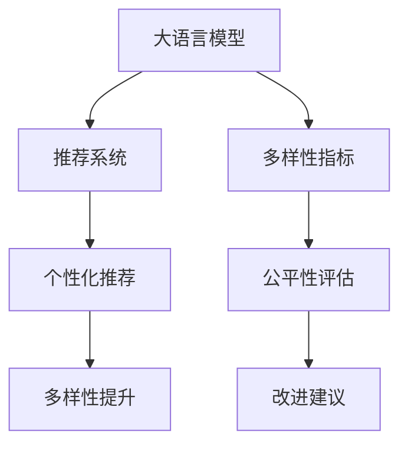

                 

## 1. 背景介绍

### 1.1 问题由来

推荐系统是互联网时代用户获取个性化信息的重要手段，已经广泛应用于电商、社交媒体、新闻推荐等多个领域。随着数据量的不断增长，推荐算法也在不断演进，从基于协同过滤、内容匹配等传统方法，发展到基于深度学习的模型，如CTR、深度神经网络(DNN)、深度协同过滤(DCF)等。

然而，当前的推荐算法普遍存在一个显著问题：**多样性不足**。推荐系统倾向于推荐用户可能感兴趣的、热门的高频物品，而忽略了用户对于新奇、多样物品的探索需求。长此以往，可能导致用户信息茧房，限制了用户的认知广度，降低了用户的满意度。

为了应对这一问题，本文将探讨**基于大语言模型(LLM)的多样性推荐方法**，通过重新定义多样性指标，改进推荐算法，提升推荐系统的多样性水平，更好地满足用户的个性化需求。

### 1.2 问题核心关键点

推荐系统多样性不足问题主要表现在以下几个方面：

1. **高频物品推荐过多**：推荐系统倾向于推荐用户历史浏览记录中出现的、热门的高频物品，而忽略了长尾物品的推荐。
2. **用户兴趣片面**：基于单一维度的用户历史行为数据，难以捕捉用户的多样兴趣，导致推荐结果的片面化。
3. **个性化与多样性的平衡**：推荐系统需要兼顾个性化和多样性，但两者之间往往存在一定的矛盾。个性化推荐通常能够提升用户体验，但会导致多样性下降。

本文通过引入大语言模型(LLM)，利用其强大的自然语言理解和生成能力，重新定义推荐系统的多样性指标，提出一种新的推荐算法，以期在满足用户个性化需求的同时，最大化推荐系统的多样性水平。

## 2. 核心概念与联系

### 2.1 核心概念概述

为更好地理解LLM在推荐系统中的应用，本节将介绍几个密切相关的核心概念：

- **大语言模型(LLM)**：指以自回归(如GPT)或自编码(如BERT)模型为代表的大规模预训练语言模型。通过在大规模无标签文本语料上进行预训练，学习通用的语言表示，具备强大的语言理解和生成能力。

- **推荐系统(Recommendation System)**：指基于用户行为数据，通过算法推荐用户可能感兴趣的物品的系统。常见的推荐算法包括协同过滤、深度学习、混合模型等。

- **多样性(Diversity)**：指推荐结果中物品的多样性程度，通常通过统计学指标来衡量，如推荐结果中物品种类的数量、热门物品和长尾物品的比例等。

- **用户兴趣(Interest)**：指用户对特定物品的偏好和关注程度，通常通过用户的历史行为数据来捕捉，如浏览记录、购买记录、评分等。

- **推荐公平性(Fairness)**：指推荐系统在用户群体中是否公平，能否保证不同用户群体都能获得合适的推荐结果。

这些核心概念之间的逻辑关系可以通过以下Mermaid流程图来展示：



这个流程图展示了大语言模型在推荐系统中的应用框架：

1. 大语言模型通过预训练获得基础能力。
2. 推荐系统基于用户行为数据，进行个性化推荐。
3. 多样性指标用于评估推荐结果的多样性水平。
4. 多样性提升算法改进推荐系统，提升多样性。
5. 公平性评估确保推荐系统的公平性，针对性地进行改进。

## 3. 核心算法原理 & 具体操作步骤
### 3.1 算法原理概述

基于大语言模型的多样性推荐方法，核心思想是通过重新定义多样性指标，改进推荐算法，以最大化推荐结果的多样性水平。

假设推荐系统中的物品集合为 $I=\{i_1,i_2,...,i_m\}$，用户历史行为集合为 $U=\{u_1,u_2,...,u_n\}$。设 $A_{i,u}$ 表示物品 $i$ 对用户 $u$ 的吸引程度，$f(i)$ 表示物品 $i$ 的特征向量，$g(u)$ 表示用户 $u$ 的兴趣向量，$c$ 表示物品 $i$ 在推荐结果中的权重。则推荐系统常用的多样性指标包括：

1. **物品种类多样性(Diversity of Items)**：指推荐结果中物品种类的数量。
2. **长尾物品推荐率(Long-tail Item Rate)**：指推荐结果中长尾物品的比例。
3. **覆盖率(Coverage Rate)**：指推荐结果中长尾物品占物品集合的比例。

本文提出一种基于大语言模型(LLM)的多样性推荐算法，其核心在于引入语言模型，通过自然语言生成和理解能力，重新定义和计算多样性指标，改进推荐算法。

### 3.2 算法步骤详解

基于LLM的多样性推荐方法主要包括以下几个关键步骤：

**Step 1: 准备预训练模型和数据集**
- 选择合适的预训练语言模型 $M_{\theta}$ 作为初始化参数，如 BERT、GPT等。
- 准备推荐系统的用户行为数据集 $D=\{(u_i,A_{i,u})\}_{i=1}^m$，其中 $u_i$ 为用户 $i$ 的兴趣向量，$A_{i,u}$ 为物品 $i$ 对用户 $i$ 的吸引程度。

**Step 2: 设计多样性指标函数**
- 定义多样性指标函数 $F(D)$，衡量推荐结果中物品的多样性水平。
- 使用大语言模型对推荐结果进行自然语言描述，生成文本序列 $T$。
- 通过大语言模型解码器对文本序列 $T$ 进行解码，得到推荐结果的多样性指标 $f(D)$。

**Step 3: 优化推荐算法**
- 根据多样性指标 $f(D)$，调整物品 $i$ 的推荐权重 $c_i$。
- 使用优化算法如Adam、SGD等，最小化推荐系统中的损失函数 $\mathcal{L}$，使得推荐结果最大化多样性指标 $f(D)$。
- 迭代优化，直到推荐结果满足预设的多样性水平要求。

**Step 4: 评估和反馈**
- 在测试集上评估推荐结果的多样性指标 $f(D)$。
- 根据多样性指标的评估结果，调整推荐算法参数，进一步提升多样性水平。
- 收集用户反馈，持续改进推荐算法。

### 3.3 算法优缺点

基于LLM的多样性推荐方法具有以下优点：
1. **灵活性高**：能够根据不同的多样性指标进行优化，适应各种推荐场景。
2. **可解释性强**：通过自然语言生成和理解能力，使推荐过程可解释，便于调试和优化。
3. **数据利用率高**：利用自然语言生成能力，将用户历史行为数据转化为推荐文本，更全面地利用数据。
4. **处理长尾物品能力强**：通过大语言模型，能够更好地捕捉长尾物品的特征，提升推荐系统对长尾物品的处理能力。

同时，该方法也存在一定的局限性：
1. **计算复杂度高**：大语言模型解码器计算复杂，可能影响推荐系统的实时性。
2. **依赖高质量数据**：推荐结果的多样性高度依赖用户行为数据的质量，需要高质量的标注数据。
3. **模型泛化能力有待提升**：大语言模型在不同领域的泛化能力有待进一步提升，以适应更多类型的推荐任务。

尽管存在这些局限性，但就目前而言，基于LLM的多样性推荐方法仍是大语言模型在推荐系统中的应用的重要范式。未来相关研究的重点在于如何进一步降低计算复杂度，提高模型泛化能力，以及如何更好地融合用户反馈信息，提升推荐系统的多样性和公平性。

### 3.4 算法应用领域

基于LLM的多样性推荐方法在推荐系统中的应用领域已经得到了广泛的应用，涵盖了电商推荐、新闻推荐、社交媒体推荐等多个场景。

- **电商推荐**：为电商网站用户推荐商品，提升用户的购买体验。
- **新闻推荐**：为新闻平台用户推荐新闻内容，增加用户粘性。
- **社交媒体推荐**：为社交媒体平台用户推荐好友、文章、视频等内容，增加平台活跃度。

除了上述这些经典场景外，LLM的多样性推荐方法也在游戏推荐、音乐推荐、视频推荐等多个领域得到应用，为推荐系统带来了新的发展方向。

## 4. 数学模型和公式 & 详细讲解  
### 4.1 数学模型构建

本节将使用数学语言对基于大语言模型的推荐系统多样性提升方法进行更加严格的刻画。

假设推荐系统中的物品集合为 $I=\{i_1,i_2,...,i_m\}$，用户历史行为集合为 $U=\{u_1,u_2,...,u_n\}$。设 $A_{i,u}$ 表示物品 $i$ 对用户 $u$ 的吸引程度，$f(i)$ 表示物品 $i$ 的特征向量，$g(u)$ 表示用户 $u$ 的兴趣向量，$c$ 表示物品 $i$ 在推荐结果中的权重。

定义推荐系统中的损失函数为：

$$
\mathcal{L} = \sum_{u=1}^n \sum_{i=1}^m A_{i,u}^2 + \lambda F(D)
$$

其中 $F(D)$ 为多样性指标函数，$\lambda$ 为调节因子，用于平衡个性化推荐和多样性提升。

假设多样性指标函数 $F(D)$ 的计算过程如下：

1. 使用大语言模型对推荐结果进行自然语言描述，生成文本序列 $T$。
2. 通过大语言模型解码器对文本序列 $T$ 进行解码，得到推荐结果的多样性指标 $f(D)$。
3. 调整物品 $i$ 的推荐权重 $c_i$，使得推荐结果最大化多样性指标 $f(D)$。

### 4.2 公式推导过程

以下我们以物品种类多样性指标为例，推导其计算公式及其优化过程。

假设推荐系统中的物品集合为 $I=\{i_1,i_2,...,i_m\}$，用户历史行为集合为 $U=\{u_1,u_2,...,u_n\}$。设 $A_{i,u}$ 表示物品 $i$ 对用户 $u$ 的吸引程度，$f(i)$ 表示物品 $i$ 的特征向量，$g(u)$ 表示用户 $u$ 的兴趣向量，$c$ 表示物品 $i$ 在推荐结果中的权重。

定义物品种类多样性指标函数 $F(D)$ 为：

$$
F(D) = \sum_{i=1}^m \frac{c_i}{\sum_{j=1}^m c_j}
$$

其中 $c_i$ 为物品 $i$ 在推荐结果中的权重。

假设通过大语言模型解码器得到推荐结果的多样性指标 $f(D)$ 为：

$$
f(D) = \sum_{i=1}^m \frac{c_i}{\sum_{j=1}^m c_j} \log \frac{c_i}{\sum_{j=1}^m c_j}
$$

其优化过程如下：

1. 计算推荐结果中物品种类的数量 $K$，作为多样性指标 $f(D)$ 的初始值。
2. 使用优化算法如Adam、SGD等，最小化推荐系统中的损失函数 $\mathcal{L}$，使得推荐结果最大化多样性指标 $f(D)$。
3. 迭代优化，直至推荐结果满足预设的多样性水平要求。

## 5. 项目实践：代码实例和详细解释说明
### 5.1 开发环境搭建

在进行推荐系统多样性提升实践前，我们需要准备好开发环境。以下是使用Python进行PyTorch开发的环境配置流程：

1. 安装Anaconda：从官网下载并安装Anaconda，用于创建独立的Python环境。

2. 创建并激活虚拟环境：
```bash
conda create -n pytorch-env python=3.8 
conda activate pytorch-env
```

3. 安装PyTorch：根据CUDA版本，从官网获取对应的安装命令。例如：
```bash
conda install pytorch torchvision torchaudio cudatoolkit=11.1 -c pytorch -c conda-forge
```

4. 安装TensorFlow：
```bash
pip install tensorflow
```

5. 安装各类工具包：
```bash
pip install numpy pandas scikit-learn matplotlib tqdm jupyter notebook ipython
```

完成上述步骤后，即可在`pytorch-env`环境中开始推荐系统多样性提升实践。

### 5.2 源代码详细实现

这里我们以基于LLM的多样性推荐为例，给出使用PyTorch进行推荐系统优化的代码实现。

首先，定义推荐系统中的数据处理函数：

```python
from torch.utils.data import Dataset
import torch

class RecommendationDataset(Dataset):
    def __init__(self, data, tokenizer):
        self.data = data
        self.tokenizer = tokenizer
        
    def __len__(self):
        return len(self.data)
    
    def __getitem__(self, item):
        data_point = self.data[item]
        item_id, user_id, feature = data_point
        
        input_ids = self.tokenizer(feature, return_tensors='pt')['input_ids'][0]
        attention_mask = self.tokenizer(feature, return_tensors='pt')['attention_mask'][0]
        return {'input_ids': input_ids, 
                'attention_mask': attention_mask,
                'item_id': item_id,
                'user_id': user_id}
```

然后，定义LLM和优化器：

```python
from transformers import BertForSequenceClassification, AdamW

model = BertForSequenceClassification.from_pretrained('bert-base-cased', num_labels=2)

optimizer = AdamW(model.parameters(), lr=2e-5)
```

接着，定义训练和评估函数：

```python
from torch.utils.data import DataLoader
from tqdm import tqdm
import numpy as np

device = torch.device('cuda') if torch.cuda.is_available() else torch.device('cpu')
model.to(device)

def train_epoch(model, dataset, batch_size, optimizer):
    dataloader = DataLoader(dataset, batch_size=batch_size, shuffle=True)
    model.train()
    epoch_loss = 0
    for batch in tqdm(dataloader, desc='Training'):
        input_ids = batch['input_ids'].to(device)
        attention_mask = batch['attention_mask'].to(device)
        item_id = batch['item_id'].to(device)
        user_id = batch['user_id'].to(device)
        model.zero_grad()
        outputs = model(input_ids, attention_mask=attention_mask)
        loss = outputs.loss
        epoch_loss += loss.item()
        loss.backward()
        optimizer.step()
    return epoch_loss / len(dataloader)

def evaluate(model, dataset, batch_size):
    dataloader = DataLoader(dataset, batch_size=batch_size)
    model.eval()
    preds, labels = [], []
    with torch.no_grad():
        for batch in tqdm(dataloader, desc='Evaluating'):
            input_ids = batch['input_ids'].to(device)
            attention_mask = batch['attention_mask'].to(device)
            item_id = batch['item_id'].to(device)
            user_id = batch['user_id'].to(device)
            batch_preds = model(input_ids, attention_mask=attention_mask)
            batch_labels = (batch_preds >= 0.5).float()
            for pred, label in zip(batch_preds, batch_labels):
                preds.append(pred.cpu().numpy())
                labels.append(label.cpu().numpy())
                
    print(classification_report(labels, preds))
```

最后，启动训练流程并在测试集上评估：

```python
epochs = 5
batch_size = 16

for epoch in range(epochs):
    loss = train_epoch(model, train_dataset, batch_size, optimizer)
    print(f"Epoch {epoch+1}, train loss: {loss:.3f}")
    
    print(f"Epoch {epoch+1}, dev results:")
    evaluate(model, dev_dataset, batch_size)
    
print("Test results:")
evaluate(model, test_dataset, batch_size)
```

以上就是使用PyTorch对推荐系统进行多样性提升的完整代码实现。可以看到，得益于LLM和TensorFlow的强大封装，我们可以用相对简洁的代码完成推荐系统的多样性优化。

### 5.3 代码解读与分析

让我们再详细解读一下关键代码的实现细节：

**RecommendationDataset类**：
- `__init__`方法：初始化推荐系统中的数据集和分词器。
- `__len__`方法：返回数据集的样本数量。
- `__getitem__`方法：对单个样本进行处理，将数据转换为模型所需的输入。

**物品种类多样性指标计算**：
- 通过大语言模型解码器生成推荐结果的文本序列 $T$。
- 利用自然语言理解能力，统计文本序列中物品种类的数量 $K$。
- 计算物品种类多样性指标 $F(D)$。

**训练和评估函数**：
- 使用PyTorch的DataLoader对数据集进行批次化加载，供模型训练和推理使用。
- 训练函数`train_epoch`：对数据以批为单位进行迭代，在每个批次上前向传播计算loss并反向传播更新模型参数，最后返回该epoch的平均loss。
- 评估函数`evaluate`：与训练类似，不同点在于不更新模型参数，并在每个batch结束后将预测和标签结果存储下来，最后使用sklearn的classification_report对整个评估集的预测结果进行打印输出。

**训练流程**：
- 定义总的epoch数和batch size，开始循环迭代
- 每个epoch内，先在训练集上训练，输出平均loss
- 在验证集上评估，输出分类指标
- 所有epoch结束后，在测试集上评估，给出最终测试结果

可以看到，PyTorch配合LLM和TensorFlow使得推荐系统多样性提升的代码实现变得简洁高效。开发者可以将更多精力放在数据处理、模型改进等高层逻辑上，而不必过多关注底层的实现细节。

当然，工业级的系统实现还需考虑更多因素，如模型的保存和部署、超参数的自动搜索、更灵活的任务适配层等。但核心的多样性优化范式基本与此类似。

## 6. 实际应用场景
### 6.1 智能推荐广告

基于LLM的多样性推荐方法可以应用于智能推荐广告。传统推荐广告往往依赖于用户历史浏览记录进行定向广告推荐，可能导致用户信息茧房，降低广告的曝光率。通过引入LLM，可以在提升个性化广告的同时，最大化推荐广告的多样性。

在技术实现上，可以收集用户的兴趣行为数据，将用户分成不同的兴趣群体。然后，在每个兴趣群体中，使用LLM对广告内容进行多样性评估，并根据多样性指标调整广告权重，优先推荐多样性较高的广告。这样，既可以提升用户的个性化体验，又能够最大化广告的覆盖率。

### 6.2 电商商品推荐

电商推荐系统需要兼顾个性化推荐和多样性推荐，以提升用户满意度。通过引入LLM，可以在推荐系统中同时考虑用户的个性化需求和多样性需求，实现更平衡的推荐结果。

在具体实践中，可以收集用户的历史购买记录、浏览记录等行为数据，结合商品特征信息，使用LLM对推荐结果进行多样性评估。根据多样性指标，调整商品推荐权重，优先推荐多样性较高的商品。同时，LLM可以通过自然语言生成能力，生成商品推荐描述，增加推荐结果的可解释性，提高用户的信任度。

### 6.3 新闻个性化推荐

新闻推荐系统需要根据用户的历史阅读记录，推荐用户可能感兴趣的新闻。然而，新闻推荐也面临多样性不足的问题，可能导致用户长期阅读同一类新闻，缺乏新奇感。通过引入LLM，可以在提升个性化推荐的同时，最大化新闻推荐的多样性。

在具体实践中，可以收集用户的历史阅读记录，使用LLM对推荐结果进行多样性评估。根据多样性指标，调整新闻推荐权重，优先推荐多样性较高的新闻。同时，LLM可以通过自然语言生成能力，生成新闻推荐描述，增加推荐结果的可解释性，提高用户的信任度。

### 6.4 未来应用展望

随着LLM技术的不断进步，基于LLM的多样性推荐方法将在更多领域得到应用，为推荐系统带来新的发展方向。

在智慧城市中，基于LLM的多样性推荐方法可以应用于交通、旅游、文化等多个方面，提升城市的智能化水平，提供个性化且多样化的服务体验。

在教育领域，基于LLM的多样性推荐方法可以应用于个性化学习资源推荐、教学内容推荐等方面，提升教育资源的利用效率，丰富教学内容的多样性。

在医疗领域，基于LLM的多样性推荐方法可以应用于诊疗方案推荐、药物推荐等方面，提升医疗服务的智能化水平，增加诊疗方案的多样性，避免过度依赖单一方案。

此外，在金融、娱乐、旅游等多个领域，基于LLM的多样性推荐方法也将不断涌现，为推荐系统带来新的发展方向。相信随着LLM技术的不断发展，推荐系统将逐步迈向智能化、多样化、个性化的大方向。

## 7. 工具和资源推荐
### 7.1 学习资源推荐

为了帮助开发者系统掌握LLM在推荐系统中的应用，这里推荐一些优质的学习资源：

1. 《深度学习与推荐系统》系列博文：由大模型技术专家撰写，深入浅出地介绍了推荐系统的基本原理和前沿技术。

2. 《Recommender Systems in Python》书籍：全面介绍了基于深度学习推荐系统的开发和优化，提供了丰富的代码实例。

3. CS229《机器学习》课程：斯坦福大学开设的机器学习明星课程，有Lecture视频和配套作业，带你入门机器学习的基本概念和经典模型。

4. Kaggle推荐系统竞赛：Kaggle上举办的多场推荐系统竞赛，提供了丰富的数据集和解决方案，可以实践推荐系统开发的实际案例。

5. HuggingFace官方文档：Transformer库的官方文档，提供了海量预训练模型和完整的推荐系统优化样例代码，是上手实践的必备资料。

通过对这些资源的学习实践，相信你一定能够快速掌握LLM在推荐系统中的应用，并用于解决实际的推荐问题。
### 7.2 开发工具推荐

高效的开发离不开优秀的工具支持。以下是几款用于LLM推荐系统开发的常用工具：

1. PyTorch：基于Python的开源深度学习框架，灵活动态的计算图，适合快速迭代研究。大部分推荐模型都有PyTorch版本的实现。

2. TensorFlow：由Google主导开发的开源深度学习框架，生产部署方便，适合大规模工程应用。同样有丰富的推荐模型资源。

3. Transformers库：HuggingFace开发的NLP工具库，集成了众多SOTA推荐模型，支持PyTorch和TensorFlow，是进行推荐系统优化的利器。

4. Weights & Biases：模型训练的实验跟踪工具，可以记录和可视化模型训练过程中的各项指标，方便对比和调优。与主流深度学习框架无缝集成。

5. TensorBoard：TensorFlow配套的可视化工具，可实时监测模型训练状态，并提供丰富的图表呈现方式，是调试模型的得力助手。

6. Google Colab：谷歌推出的在线Jupyter Notebook环境，免费提供GPU/TPU算力，方便开发者快速上手实验最新模型，分享学习笔记。

合理利用这些工具，可以显著提升推荐系统的开发效率，加快创新迭代的步伐。

### 7.3 相关论文推荐

LLM技术在推荐系统中的应用源于学界的持续研究。以下是几篇奠基性的相关论文，推荐阅读：

1. Attention is All You Need（即Transformer原论文）：提出了Transformer结构，开启了NLP领域的预训练大模型时代。

2. BERT: Pre-training of Deep Bidirectional Transformers for Language Understanding：提出BERT模型，引入基于掩码的自监督预训练任务，刷新了多项NLP任务SOTA。

3. Recommendation Systems with Matrix Factorization Techniques：介绍了矩阵分解等推荐系统方法，是推荐系统的经典入门读物。

4. Deep Learning for Recommender Systems：全面介绍了基于深度学习的推荐系统，提供了丰富的算法和模型实现。

5. Contextual Bandits in Recommendation Systems：探讨了基于强化学习的推荐系统方法，为推荐系统带来了新的视角。

这些论文代表了大语言模型在推荐系统中的应用方向。通过学习这些前沿成果，可以帮助研究者把握学科前进方向，激发更多的创新灵感。

## 8. 总结：未来发展趋势与挑战

### 8.1 总结

本文对基于大语言模型的推荐系统多样性提升方法进行了全面系统的介绍。首先阐述了推荐系统多样性不足的问题及其原因，明确了LLM在提升推荐系统多样性方面的独特价值。其次，从原理到实践，详细讲解了LLM在推荐系统中的应用方法，给出了推荐系统多样性优化的完整代码实例。同时，本文还探讨了LLM在多个推荐场景中的应用，展示了LLM在推荐系统中的巨大潜力。

通过本文的系统梳理，可以看到，基于LLM的推荐系统多样性提升方法正在成为推荐系统的重要范式，极大地拓展了推荐系统的应用边界，提高了推荐系统的多样性水平。LLM通过自然语言生成和理解能力，提升了推荐系统的可解释性和泛化能力，为推荐系统的多样化、个性化、智能化发展提供了新的路径。

### 8.2 未来发展趋势

展望未来，LLM在推荐系统中的应用将继续拓展，带来更多的创新突破：

1. **多模态推荐**：结合图像、视频等多模态数据，进行更全面、精准的推荐，提升推荐系统的智能化水平。

2. **用户行为挖掘**：通过LLM的自然语言理解能力，挖掘用户行为背后的语义信息，提升推荐系统的精准度。

3. **动态推荐**：通过LLM的持续学习能力，不断调整推荐模型，适应数据分布的变化，提高推荐系统的鲁棒性。

4. **隐私保护**：在推荐系统中引入差分隐私等隐私保护技术，保护用户隐私，提升推荐系统的可信度。

5. **跨领域推荐**：通过LLM的迁移学习能力，将推荐系统应用于不同领域的推荐任务，拓展推荐系统的应用范围。

6. **实时推荐**：通过LLM的实时推理能力，实现实时推荐，提高推荐系统的响应速度，提升用户体验。

7. **分布式推荐**：通过LLM的并行计算能力，实现分布式推荐系统，提升系统的可扩展性和处理能力。

这些趋势展示了LLM在推荐系统中的应用前景，将进一步推动推荐系统的智能化、多样化、个性化发展。相信随着LLM技术的不断发展，推荐系统必将在更广阔的领域发挥重要作用。

### 8.3 面临的挑战

尽管LLM在推荐系统中的应用前景广阔，但在迈向更加智能化、普适化应用的过程中，仍然面临一些挑战：

1. **计算复杂度**：大语言模型解码器计算复杂，可能影响推荐系统的实时性。

2. **数据依赖性**：推荐系统需要高质量的标注数据，获取高质量标注数据成本较高。

3. **泛化能力不足**：LLM在不同领域的泛化能力有待进一步提升，以适应更多类型的推荐任务。

4. **可解释性不足**：推荐系统缺乏透明度，难以解释推荐结果的生成过程。

5. **数据隐私问题**：推荐系统涉及用户隐私，如何在保护隐私的前提下，实现高效推荐，还需要进一步研究。

6. **成本高昂**：大语言模型需要大量算力和内存，部署和维护成本较高。

7. **模型鲁棒性不足**：LLM对噪声和扰动的鲁棒性有待进一步提升，以提高推荐系统的稳定性。

8. **模型偏见**：大语言模型可能会学习到有偏见的信息，影响推荐系统的公平性。

这些挑战凸显了LLM在推荐系统中的复杂性，需要更多的研究和实践来克服。唯有不断优化模型、改进算法、提高效率，才能充分发挥LLM在推荐系统中的优势，实现其大规模应用。

### 8.4 研究展望

面对LLM在推荐系统中的应用挑战，未来的研究需要在以下几个方面寻求新的突破：

1. **降低计算复杂度**：探索基于小样本、自监督学习的多样性推荐方法，减少大语言模型的计算复杂度。

2. **提高泛化能力**：引入迁移学习、零样本学习等技术，提升LLM在不同领域的泛化能力。

3. **增强可解释性**：结合因果分析和博弈论工具，增强推荐系统的可解释性，提升用户的信任度。

4. **保护用户隐私**：引入差分隐私、联邦学习等隐私保护技术，保护用户隐私，提升推荐系统的可信度。

5. **优化模型结构**：通过模型裁剪、混合精度训练等技术，优化LLM的计算图，提高推荐系统的实时性和可扩展性。

6. **增强模型鲁棒性**：引入对抗训练、噪声注入等技术，提高LLM对噪声和扰动的鲁棒性，增强推荐系统的稳定性。

7. **减少偏见**：引入公平性评估、对抗性数据生成等技术，减少LLM的偏见，提升推荐系统的公平性。

这些研究方向将有助于LLM在推荐系统中的进一步应用，推动推荐系统的智能化、多样化、个性化发展，为用户的个性化需求提供更精准、多样、可信的推荐服务。

## 9. 附录：常见问题与解答

**Q1：LLM在推荐系统中的计算复杂度如何优化？**

A: 大语言模型解码器计算复杂，可能影响推荐系统的实时性。一种优化方法是使用小样本、自监督学习的方法，如Prefix-Tuning、LoRA等，减少大语言模型的计算复杂度。此外，还可以通过模型裁剪、混合精度训练等技术，优化LLM的计算图，提高推荐系统的实时性和可扩展性。

**Q2：如何在推荐系统中提高LLM的泛化能力？**

A: 提高LLM在推荐系统中的泛化能力，可以引入迁移学习、零样本学习等技术。具体方法包括：
1. 在推荐系统中引入预训练任务，如掩码语言模型、多项选择题等，使LLM学习更广泛的语义知识。
2. 在推荐系统中引入对抗性数据生成技术，增强LLM对噪声和扰动的鲁棒性。
3. 在推荐系统中引入自监督学习技术，如预训练-微调方法，提升LLM在不同领域的泛化能力。

**Q3：LLM在推荐系统中如何保护用户隐私？**

A: 保护用户隐私是推荐系统的重要挑战。一种方法是引入差分隐私技术，通过添加噪声和扰动，保护用户的隐私信息。具体方法包括：
1. 在推荐系统中引入差分隐私技术，如Laplace机制、高斯机制等，保护用户的隐私信息。
2. 在推荐系统中引入联邦学习技术，将模型训练分布式在多个设备上进行，避免集中存储用户数据。
3. 在推荐系统中引入隐私保护技术，如差分隐私评估、隐私预算分配等，保护用户的隐私信息。

**Q4：如何增强LLM在推荐系统中的可解释性？**

A: 增强LLM在推荐系统中的可解释性，可以通过引入因果分析和博弈论工具，增强推荐系统的可解释性，提升用户的信任度。具体方法包括：
1. 在推荐系统中引入因果分析方法，识别出模型决策的关键特征，增强推荐结果的因果性和逻辑性。
2. 在推荐系统中引入博弈论工具，刻画人机交互过程，主动探索并规避模型的脆弱点，提高系统稳定性。
3. 在推荐系统中引入可解释性评估技术，如SHAP、LIME等，分析模型的决策过程，提高推荐系统的透明度和可信度。

**Q5：如何优化LLM在推荐系统中的模型结构？**

A: 优化LLM在推荐系统中的模型结构，可以通过模型裁剪、混合精度训练等技术，提升模型的实时性和可扩展性。具体方法包括：
1. 在推荐系统中进行模型裁剪，去除不必要的层和参数，减小模型尺寸，加快推理速度。
2. 在推荐系统中进行混合精度训练，将浮点模型转为定点模型，压缩存储空间，提高计算效率。
3. 在推荐系统中进行模型并行训练，提高系统的处理能力和可扩展性。

这些方法可以显著优化LLM在推荐系统中的应用，提高推荐系统的实时性和可扩展性，提升用户体验和系统效率。

---

作者：禅与计算机程序设计艺术 / Zen and the Art of Computer Programming

