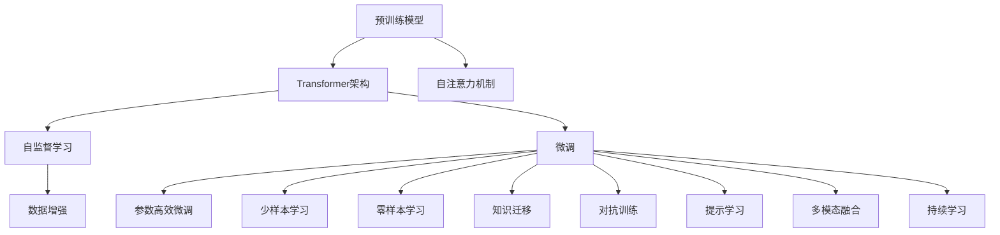

                 

## 1. 背景介绍

### 1.1 问题由来
近年来，随着深度学习技术的快速发展，大语言模型（Large Language Models, LLMs）在自然语言处理（NLP）领域取得了突破性的进展。这些模型通过在大规模无标签文本数据上进行预训练，学习到丰富的语言知识和常识，并可以通过少量的有标签数据在下游任务上进行微调（Fine-Tuning），取得优异的性能。这一系列技术创新对计算机科学产生了深远影响，尤其是在算法、计算、模型架构和应用领域。

### 1.2 问题核心关键点
大语言模型技术革新对计算机科学的影响主要体现在以下几个方面：
1. **算法革新**：引入了新的深度学习架构，如Transformer和自注意力机制，这些算法提高了模型的表达能力和学习效率。
2. **计算需求**：大模型的参数量极大，对计算资源的需求显著增加，推动了硬件和计算架构的发展。
3. **模型架构**：预训练和微调技术的发展，使得模型架构更加复杂，同时也在不断优化，以提高效率和性能。
4. **应用领域**：从NLP走向多模态，覆盖更多实际应用场景，如医疗、金融、智能推荐等。
5. **伦理与法律问题**：模型的偏见、隐私保护、公平性等问题引发了广泛的讨论和反思。

### 1.3 问题研究意义
大语言模型技术革新对计算机科学的研究意义在于：
- 推动深度学习算法的发展，为其他领域的算法创新提供借鉴。
- 推动计算机架构和硬件的发展，促进高性能计算技术的发展。
- 拓展应用领域，推动AI技术在各个行业的落地和应用。
- 引发了对伦理与法律问题的讨论，促进AI技术的健康发展。

## 2. 核心概念与联系

### 2.1 核心概念概述
为了更好地理解大语言模型技术革新对计算机科学的影响，我们先简要概述几个核心概念：

- **大语言模型（LLM）**：以Transformer架构为基础的预训练语言模型，通过在大规模无标签文本数据上进行预训练，学习到语言的通用表示，具备强大的语言理解和生成能力。
- **预训练（Pre-training）**：指在大规模无标签文本数据上，通过自监督学习任务训练语言模型的过程，使得模型学习到语言的通用知识。
- **微调（Fine-tuning）**：指在预训练模型的基础上，使用下游任务的少量标注数据，通过有监督学习优化模型在该任务上的性能。
- **Transformer**：一种基于自注意力机制的深度学习架构，在自然语言处理中应用广泛，尤其在大语言模型中。
- **自注意力机制**：一种机制，用于计算序列中不同位置元素之间的相互关系，提高模型的表达能力。
- **Transformer-XL**：一种扩展的Transformer架构，能够处理更长的序列。
- **GPT系列模型**：基于Transformer架构的一系列语言模型，包括GPT-1到GPT-3。
- **BERT**：一种双向预训练语言模型，广泛用于各种NLP任务。
- **Transformer-XL**：一种基于Transformer架构的模型，能够处理更长的序列。
- **Transformer-XL**：一种基于Transformer架构的模型，能够处理更长的序列。

### 2.2 核心概念原理和架构的 Mermaid 流程图



此流程图展示了预训练、微调和各种改进技术之间的关系，以及这些技术如何协同工作，提升大语言模型的性能。

## 3. 核心算法原理 & 具体操作步骤
### 3.1 算法原理概述

大语言模型的技术革新主要体现在算法和架构的改进上。以下是几个关键技术原理：

- **Transformer架构**：通过自注意力机制，模型能够高效地处理长序列，同时提升表达能力。
- **预训练-微调范式**：利用无标签数据进行预训练，然后使用少量标注数据进行微调，提升模型在特定任务上的性能。
- **自监督学习**：利用语言的内在结构，如掩码语言模型（Masked Language Model, MLM）和下一句预测（Next Sentence Prediction, NSP）等任务，训练语言模型。
- **大规模参数量**：大语言模型通常包含亿级别的参数，需要强大的计算资源进行训练。
- **计算图优化**：通过优化计算图，减少计算资源消耗，提升推理效率。
- **知识迁移**：通过迁移学习，将预训练模型在其他任务上的知识迁移到新任务中，提高新任务的性能。
- **少样本学习**：利用大语言模型在大量数据上预训练的知识，进行少样本学习，提升模型在新任务上的泛化能力。
- **零样本学习**：模型能够通过理解任务描述，直接生成答案或输出，无需标注数据。
- **持续学习**：模型能够不断从新数据中学习，避免遗忘旧知识，适应数据分布的变化。

### 3.2 算法步骤详解

大语言模型技术革新主要包括以下几个关键步骤：

**Step 1: 准备预训练模型和数据集**
- 选择合适的预训练模型，如BERT、GPT等。
- 准备下游任务的标注数据集，划分为训练集、验证集和测试集。

**Step 2: 设计任务适配层**
- 根据下游任务的类型，设计合适的输出层和损失函数。
- 对于分类任务，通常在顶层添加线性分类器和交叉熵损失函数。
- 对于生成任务，通常使用语言模型的解码器输出概率分布，并以负对数似然为损失函数。

**Step 3: 设置微调超参数**
- 选择合适的优化算法及其参数，如AdamW、SGD等，设置学习率、批大小、迭代轮数等。
- 设置正则化技术及强度，包括权重衰减、Dropout、Early Stopping等。
- 确定冻结预训练参数的策略，如仅微调顶层，或全部参数都参与微调。

**Step 4: 执行梯度训练**
- 将训练集数据分批次输入模型，前向传播计算损失函数。
- 反向传播计算参数梯度，根据设定的优化算法和学习率更新模型参数。
- 周期性在验证集上评估模型性能，根据性能指标决定是否触发Early Stopping。
- 重复上述步骤直到满足预设的迭代轮数或Early Stopping条件。

**Step 5: 测试和部署**
- 在测试集上评估微调后模型，对比微调前后的精度提升。
- 使用微调后的模型对新样本进行推理预测，集成到实际的应用系统中。
- 持续收集新的数据，定期重新微调模型，以适应数据分布的变化。

### 3.3 算法优缺点

大语言模型技术革新对计算机科学的影响主要体现在以下几个方面：

**优点**：
- **高效表达**：Transformer架构和自注意力机制使得模型能够高效地处理长序列，提升表达能力。
- **泛化能力强**：通过预训练-微调范式，模型能够很好地适应新任务，提升性能。
- **参数高效**：通过参数高效微调技术，在固定大部分预训练参数的情况下，仍可取得不错的提升。
- **鲁棒性强**：通过对抗训练等技术，模型能够更好地应对新数据和新任务，提升鲁棒性。

**缺点**：
- **资源需求高**：大模型的参数量极大，对计算资源的需求显著增加。
- **训练时间长**：大规模模型的训练时间较长，需要高性能计算资源。
- **可解释性差**：黑盒模型的决策过程难以解释，难以调试和优化。
- **数据依赖**：模型依赖于标注数据，标注成本较高。

### 3.4 算法应用领域

大语言模型技术革新在计算机科学中的应用领域非常广泛，以下是几个典型的应用场景：

1. **自然语言处理（NLP）**：文本分类、命名实体识别、关系抽取、问答系统、文本摘要、机器翻译、情感分析等。
2. **语音识别和处理**：语音转文本、语音生成、语音情感识别等。
3. **计算机视觉**：图像识别、目标检测、图像生成等。
4. **推荐系统**：商品推荐、新闻推荐、视频推荐等。
5. **智能交互系统**：智能客服、虚拟助手、对话机器人等。
6. **知识图谱和信息抽取**：从大规模非结构化数据中抽取结构化知识，构建知识图谱。
7. **跨领域知识迁移**：将预训练模型在其他任务上的知识迁移到新任务中，提高新任务的性能。
8. **多模态融合**：融合文本、图像、音频等多模态数据，提高系统的综合处理能力。
9. **持续学习**：模型能够不断从新数据中学习，避免遗忘旧知识，适应数据分布的变化。

## 4. 数学模型和公式 & 详细讲解  
### 4.1 数学模型构建

大语言模型的数学模型构建主要涉及以下几个方面：

- **自监督学习**：通过掩码语言模型（MLM）和下一句预测（NSP）等任务，训练语言模型。
- **预训练模型**：使用大规模无标签数据进行预训练，学习到语言的通用表示。
- **微调模型**：在预训练模型的基础上，使用下游任务的少量标注数据进行微调，提升模型在特定任务上的性能。

### 4.2 公式推导过程

以BERT模型的预训练过程为例，公式推导如下：

假设BERT模型由Transformer层组成，每个Transformer层包含自注意力机制、前馈神经网络和残差连接。对于每个输入序列，模型通过多个Transformer层进行编码，得到最终的表示向量。设输入序列长度为 $T$，模型输出为 $\mathbf{H}$，则预训练过程的损失函数为：

$$
\mathcal{L} = -\frac{1}{N} \sum_{i=1}^N \ell(\mathbf{h}_i^o, y_i)
$$

其中 $\mathbf{h}_i^o$ 为模型输出序列中第 $i$ 个位置的表示向量，$y_i$ 为对应位置的标签。

对于掩码语言模型（MLM）任务，假设输入序列中部分位置被掩码，模型需要预测被掩码位置的正确单词。损失函数为：

$$
\ell_{MLM} = -\frac{1}{N} \sum_{i=1}^N \log \text{Softmax}(\mathbf{h}_i^o, \mathbf{w})
$$

其中 $\mathbf{w}$ 为模型参数，$\text{Softmax}$ 函数用于计算模型输出与真实标签之间的交叉熵损失。

对于下一句预测（NSP）任务，模型需要预测输入序列和下一个句子是否连续。损失函数为：

$$
\ell_{NSP} = -\frac{1}{N} \sum_{i=1}^N \log \text{Softmax}(\mathbf{h}_i^o, y_i)
$$

其中 $y_i$ 为下一句的标签。

### 4.3 案例分析与讲解

以BERT模型的微调过程为例，分析其数学模型构建和公式推导。

假设模型在分类任务上进行微调，输入序列为 $\{x_1, x_2, ..., x_N\}$，对应标签为 $\{y_1, y_2, ..., y_N\}$。模型输出为 $\mathbf{H} = [\mathbf{h}_1^o, \mathbf{h}_2^o, ..., \mathbf{h}_N^o]$。微调过程中，模型需要最小化损失函数 $\mathcal{L}$。假设使用交叉熵损失，则微调的损失函数为：

$$
\mathcal{L} = -\frac{1}{N} \sum_{i=1}^N \log \text{Softmax}(\mathbf{h}_i^o, y_i)
$$

其中 $\text{Softmax}$ 函数用于计算模型输出与真实标签之间的交叉熵损失。

对于每个输入序列，模型需要先通过多个Transformer层进行编码，得到最终的表示向量 $\mathbf{h}_i^o$。然后，将 $\mathbf{h}_i^o$ 输入到全连接层，输出分类结果。微调过程中，模型的参数 $\theta$ 需要通过梯度下降等优化算法进行更新，以最小化损失函数 $\mathcal{L}$。

## 5. 项目实践：代码实例和详细解释说明
### 5.1 开发环境搭建

在进行大语言模型微调实践前，我们需要准备好开发环境。以下是使用Python进行PyTorch开发的环境配置流程：

1. 安装Anaconda：从官网下载并安装Anaconda，用于创建独立的Python环境。

2. 创建并激活虚拟环境：
```bash
conda create -n pytorch-env python=3.8 
conda activate pytorch-env
```

3. 安装PyTorch：根据CUDA版本，从官网获取对应的安装命令。例如：
```bash
conda install pytorch torchvision torchaudio cudatoolkit=11.1 -c pytorch -c conda-forge
```

4. 安装Transformers库：
```bash
pip install transformers
```

5. 安装各类工具包：
```bash
pip install numpy pandas scikit-learn matplotlib tqdm jupyter notebook ipython
```

完成上述步骤后，即可在`pytorch-env`环境中开始微调实践。

### 5.2 源代码详细实现

下面我们以命名实体识别（NER）任务为例，给出使用Transformers库对BERT模型进行微调的PyTorch代码实现。

首先，定义NER任务的数据处理函数：

```python
from transformers import BertTokenizer
from torch.utils.data import Dataset
import torch

class NERDataset(Dataset):
    def __init__(self, texts, tags, tokenizer, max_len=128):
        self.texts = texts
        self.tags = tags
        self.tokenizer = tokenizer
        self.max_len = max_len
        
    def __len__(self):
        return len(self.texts)
    
    def __getitem__(self, item):
        text = self.texts[item]
        tags = self.tags[item]
        
        encoding = self.tokenizer(text, return_tensors='pt', max_length=self.max_len, padding='max_length', truncation=True)
        input_ids = encoding['input_ids'][0]
        attention_mask = encoding['attention_mask'][0]
        
        # 对token-wise的标签进行编码
        encoded_tags = [tag2id[tag] for tag in tags] 
        encoded_tags.extend([tag2id['O']] * (self.max_len - len(encoded_tags)))
        labels = torch.tensor(encoded_tags, dtype=torch.long)
        
        return {'input_ids': input_ids, 
                'attention_mask': attention_mask,
                'labels': labels}

# 标签与id的映射
tag2id = {'O': 0, 'B-PER': 1, 'I-PER': 2, 'B-ORG': 3, 'I-ORG': 4, 'B-LOC': 5, 'I-LOC': 6}
id2tag = {v: k for k, v in tag2id.items()}

# 创建dataset
tokenizer = BertTokenizer.from_pretrained('bert-base-cased')

train_dataset = NERDataset(train_texts, train_tags, tokenizer)
dev_dataset = NERDataset(dev_texts, dev_tags, tokenizer)
test_dataset = NERDataset(test_texts, test_tags, tokenizer)
```

然后，定义模型和优化器：

```python
from transformers import BertForTokenClassification, AdamW

model = BertForTokenClassification.from_pretrained('bert-base-cased', num_labels=len(tag2id))

optimizer = AdamW(model.parameters(), lr=2e-5)
```

接着，定义训练和评估函数：

```python
from torch.utils.data import DataLoader
from tqdm import tqdm
from sklearn.metrics import classification_report

device = torch.device('cuda') if torch.cuda.is_available() else torch.device('cpu')
model.to(device)

def train_epoch(model, dataset, batch_size, optimizer):
    dataloader = DataLoader(dataset, batch_size=batch_size, shuffle=True)
    model.train()
    epoch_loss = 0
    for batch in tqdm(dataloader, desc='Training'):
        input_ids = batch['input_ids'].to(device)
        attention_mask = batch['attention_mask'].to(device)
        labels = batch['labels'].to(device)
        model.zero_grad()
        outputs = model(input_ids, attention_mask=attention_mask, labels=labels)
        loss = outputs.loss
        epoch_loss += loss.item()
        loss.backward()
        optimizer.step()
    return epoch_loss / len(dataloader)

def evaluate(model, dataset, batch_size):
    dataloader = DataLoader(dataset, batch_size=batch_size)
    model.eval()
    preds, labels = [], []
    with torch.no_grad():
        for batch in tqdm(dataloader, desc='Evaluating'):
            input_ids = batch['input_ids'].to(device)
            attention_mask = batch['attention_mask'].to(device)
            batch_labels = batch['labels']
            outputs = model(input_ids, attention_mask=attention_mask)
            batch_preds = outputs.logits.argmax(dim=2).to('cpu').tolist()
            batch_labels = batch_labels.to('cpu').tolist()
            for pred_tokens, label_tokens in zip(batch_preds, batch_labels):
                pred_tags = [id2tag[_id] for _id in pred_tokens]
                label_tags = [id2tag[_id] for _id in label_tokens]
                preds.append(pred_tags[:len(label_tokens)])
                labels.append(label_tags)
                
    print(classification_report(labels, preds))
```

最后，启动训练流程并在测试集上评估：

```python
epochs = 5
batch_size = 16

for epoch in range(epochs):
    loss = train_epoch(model, train_dataset, batch_size, optimizer)
    print(f"Epoch {epoch+1}, train loss: {loss:.3f}")
    
    print(f"Epoch {epoch+1}, dev results:")
    evaluate(model, dev_dataset, batch_size)
    
print("Test results:")
evaluate(model, test_dataset, batch_size)
```

以上就是使用PyTorch对BERT进行命名实体识别任务微调的完整代码实现。可以看到，得益于Transformers库的强大封装，我们可以用相对简洁的代码完成BERT模型的加载和微调。

### 5.3 代码解读与分析

让我们再详细解读一下关键代码的实现细节：

**NERDataset类**：
- `__init__`方法：初始化文本、标签、分词器等关键组件。
- `__len__`方法：返回数据集的样本数量。
- `__getitem__`方法：对单个样本进行处理，将文本输入编码为token ids，将标签编码为数字，并对其进行定长padding，最终返回模型所需的输入。

**tag2id和id2tag字典**：
- 定义了标签与数字id之间的映射关系，用于将token-wise的预测结果解码回真实的标签。

**训练和评估函数**：
- 使用PyTorch的DataLoader对数据集进行批次化加载，供模型训练和推理使用。
- 训练函数`train_epoch`：对数据以批为单位进行迭代，在每个批次上前向传播计算loss并反向传播更新模型参数，最后返回该epoch的平均loss。
- 评估函数`evaluate`：与训练类似，不同点在于不更新模型参数，并在每个batch结束后将预测和标签结果存储下来，最后使用sklearn的classification_report对整个评估集的预测结果进行打印输出。

**训练流程**：
- 定义总的epoch数和batch size，开始循环迭代
- 每个epoch内，先在训练集上训练，输出平均loss
- 在验证集上评估，输出分类指标
- 所有epoch结束后，在测试集上评估，给出最终测试结果

可以看到，PyTorch配合Transformers库使得BERT微调的代码实现变得简洁高效。开发者可以将更多精力放在数据处理、模型改进等高层逻辑上，而不必过多关注底层的实现细节。

当然，工业级的系统实现还需考虑更多因素，如模型的保存和部署、超参数的自动搜索、更灵活的任务适配层等。但核心的微调范式基本与此类似。

## 6. 实际应用场景
### 6.1 智能客服系统

基于大语言模型微调的对话技术，可以广泛应用于智能客服系统的构建。传统客服往往需要配备大量人力，高峰期响应缓慢，且一致性和专业性难以保证。而使用微调后的对话模型，可以7x24小时不间断服务，快速响应客户咨询，用自然流畅的语言解答各类常见问题。

在技术实现上，可以收集企业内部的历史客服对话记录，将问题和最佳答复构建成监督数据，在此基础上对预训练对话模型进行微调。微调后的对话模型能够自动理解用户意图，匹配最合适的答案模板进行回复。对于客户提出的新问题，还可以接入检索系统实时搜索相关内容，动态组织生成回答。如此构建的智能客服系统，能大幅提升客户咨询体验和问题解决效率。

### 6.2 金融舆情监测

金融机构需要实时监测市场舆论动向，以便及时应对负面信息传播，规避金融风险。传统的人工监测方式成本高、效率低，难以应对网络时代海量信息爆发的挑战。基于大语言模型微调的文本分类和情感分析技术，为金融舆情监测提供了新的解决方案。

具体而言，可以收集金融领域相关的新闻、报道、评论等文本数据，并对其进行主题标注和情感标注。在此基础上对预训练语言模型进行微调，使其能够自动判断文本属于何种主题，情感倾向是正面、中性还是负面。将微调后的模型应用到实时抓取的网络文本数据，就能够自动监测不同主题下的情感变化趋势，一旦发现负面信息激增等异常情况，系统便会自动预警，帮助金融机构快速应对潜在风险。

### 6.3 个性化推荐系统

当前的推荐系统往往只依赖用户的历史行为数据进行物品推荐，无法深入理解用户的真实兴趣偏好。基于大语言模型微调技术，个性化推荐系统可以更好地挖掘用户行为背后的语义信息，从而提供更精准、多样的推荐内容。

在实践中，可以收集用户浏览、点击、评论、分享等行为数据，提取和用户交互的物品标题、描述、标签等文本内容。将文本内容作为模型输入，用户的后续行为（如是否点击、购买等）作为监督信号，在此基础上微调预训练语言模型。微调后的模型能够从文本内容中准确把握用户的兴趣点。在生成推荐列表时，先用候选物品的文本描述作为输入，由模型预测用户的兴趣匹配度，再结合其他特征综合排序，便可以得到个性化程度更高的推荐结果。

### 6.4 未来应用展望

随着大语言模型微调技术的发展，其应用场景将更加广泛，带来更多的变革性影响。

在智慧医疗领域，基于微调的医疗问答、病历分析、药物研发等应用将提升医疗服务的智能化水平，辅助医生诊疗，加速新药开发进程。

在智能教育领域，微调技术可应用于作业批改、学情分析、知识推荐等方面，因材施教，促进教育公平，提高教学质量。

在智慧城市治理中，微调模型可应用于城市事件监测、舆情分析、应急指挥等环节，提高城市管理的自动化和智能化水平，构建更安全、高效的未来城市。

此外，在企业生产、社会治理、文娱传媒等众多领域，基于大语言模型微调的人工智能应用也将不断涌现，为经济社会发展注入新的动力。相信随着技术的日益成熟，微调方法将成为人工智能落地应用的重要范式，推动人工智能技术在各个行业的广泛应用。

## 7. 工具和资源推荐
### 7.1 学习资源推荐

为了帮助开发者系统掌握大语言模型微调的理论基础和实践技巧，这里推荐一些优质的学习资源：

1. 《Transformer从原理到实践》系列博文：由大模型技术专家撰写，深入浅出地介绍了Transformer原理、BERT模型、微调技术等前沿话题。

2. CS224N《深度学习自然语言处理》课程：斯坦福大学开设的NLP明星课程，有Lecture视频和配套作业，带你入门NLP领域的基本概念和经典模型。

3. 《Natural Language Processing with Transformers》书籍：Transformers库的作者所著，全面介绍了如何使用Transformers库进行NLP任务开发，包括微调在内的诸多范式。

4. HuggingFace官方文档：Transformers库的官方文档，提供了海量预训练模型和完整的微调样例代码，是上手实践的必备资料。

5. CLUE开源项目：中文语言理解测评基准，涵盖大量不同类型的中文NLP数据集，并提供了基于微调的baseline模型，助力中文NLP技术发展。

通过对这些资源的学习实践，相信你一定能够快速掌握大语言模型微调的精髓，并用于解决实际的NLP问题。
###  7.2 开发工具推荐

高效的开发离不开优秀的工具支持。以下是几款用于大语言模型微调开发的常用工具：

1. PyTorch：基于Python的开源深度学习框架，灵活动态的计算图，适合快速迭代研究。大部分预训练语言模型都有PyTorch版本的实现。

2. TensorFlow：由Google主导开发的开源深度学习框架，生产部署方便，适合大规模工程应用。同样有丰富的预训练语言模型资源。

3. Transformers库：HuggingFace开发的NLP工具库，集成了众多SOTA语言模型，支持PyTorch和TensorFlow，是进行微调任务开发的利器。

4. Weights & Biases：模型训练的实验跟踪工具，可以记录和可视化模型训练过程中的各项指标，方便对比和调优。与主流深度学习框架无缝集成。

5. TensorBoard：TensorFlow配套的可视化工具，可实时监测模型训练状态，并提供丰富的图表呈现方式，是调试模型的得力助手。

6. Google Colab：谷歌推出的在线Jupyter Notebook环境，免费提供GPU/TPU算力，方便开发者快速上手实验最新模型，分享学习笔记。

合理利用这些工具，可以显著提升大语言模型微调任务的开发效率，加快创新迭代的步伐。

### 7.3 相关论文推荐

大语言模型和微调技术的发展源于学界的持续研究。以下是几篇奠基性的相关论文，推荐阅读：

1. Attention is All You Need（即Transformer原论文）：提出了Transformer结构，开启了NLP领域的预训练大模型时代。

2. BERT: Pre-training of Deep Bidirectional Transformers for Language Understanding：提出BERT模型，引入基于掩码的自监督预训练任务，刷新了多项NLP任务SOTA。

3. Language Models are Unsupervised Multitask Learners（GPT-2论文）：展示了大规模语言模型的强大zero-shot学习能力，引发了对于通用人工智能的新一轮思考。

4. Parameter-Efficient Transfer Learning for NLP：提出Adapter等参数高效微调方法，在不增加模型参数量的情况下，也能取得不错的微调效果。

5. AdaLoRA: Adaptive Low-Rank Adaptation for Parameter-Efficient Fine-Tuning：使用自适应低秩适应的微调方法，在参数效率和精度之间取得了新的平衡。

6. Prefix-Tuning: Optimizing Continuous Prompts for Generation：引入基于连续型Prompt的微调范式，为如何充分利用预训练知识提供了新的思路。

这些论文代表了大语言模型微调技术的发展脉络。通过学习这些前沿成果，可以帮助研究者把握学科前进方向，激发更多的创新灵感。

## 8. 总结：未来发展趋势与挑战
### 8.1 总结

本文对大语言模型技术革新对计算机科学的影响进行了全面系统的介绍。首先阐述了大语言模型技术的发展背景和意义，明确了微调在拓展预训练模型应用、提升下游任务性能方面的独特价值。其次，从原理到实践，详细讲解了微调的数学原理和关键步骤，给出了微调任务开发的完整代码实例。同时，本文还广泛探讨了微调方法在智能客服、金融舆情、个性化推荐等多个行业领域的应用前景，展示了微调范式的巨大潜力。此外，本文精选了微调技术的各类学习资源，力求为读者提供全方位的技术指引。

通过本文的系统梳理，可以看到，基于大语言模型的微调技术革新对计算机科学的研究意义在于：
- 推动深度学习算法的发展，为其他领域的算法创新提供借鉴。
- 推动计算机架构和硬件的发展，促进高性能计算技术的发展。
- 拓展应用领域，推动AI技术在各个行业的落地和应用。
- 引发了对伦理与法律问题的讨论，促进AI技术的健康发展。

### 8.2 未来发展趋势

展望未来，大语言模型微调技术的发展趋势主要体现在以下几个方面：

1. **算法革新**：未来的微调算法将更加高效、智能，能够更好地处理长序列、跨领域的数据。
2. **计算需求**：随着大模型的参数量不断增加，未来的计算需求将更加旺盛，需要更多的高性能计算资源。
3. **模型架构**：未来的模型架构将更加灵活、可扩展，能够适应更多的应用场景。
4. **应用领域**：未来的微调技术将更加广泛地应用于各个行业，推动AI技术的产业化进程。
5. **伦理与法律问题**：未来的AI系统将更加注重伦理与法律问题，保障数据隐私和安全。
6. **可持续发展**：未来的AI系统将更加注重能源效率和环境友好，实现可持续发展。

### 8.3 面临的挑战

尽管大语言模型微调技术已经取得了显著进展，但在迈向更加智能化、普适化应用的过程中，仍面临以下挑战：

1. **资源瓶颈**：大模型的参数量极大，对计算资源的需求显著增加，需要更多的高性能计算资源。
2. **训练时间长**：大规模模型的训练时间较长，需要高效的优化算法和并行计算技术。
3. **模型可解释性差**：黑盒模型的决策过程难以解释，难以调试和优化。
4. **数据依赖**：模型依赖于标注数据，标注成本较高，且标注数据的质量和数量对模型性能有很大影响。
5. **模型鲁棒性不足**：模型面对新数据和新任务时，泛化性能往往大打折扣。
6. **安全性问题**：模型的偏见、隐私保护、公平性等问题引发了广泛的讨论和反思。

### 8.4 研究展望

未来的研究需要在以下几个方面寻求新的突破：

1. **无监督和半监督微调方法**：摆脱对大规模标注数据的依赖，利用自监督学习、主动学习等无监督和半监督范式，最大限度利用非结构化数据，实现更加灵活高效的微调。
2. **参数高效和计算高效的微调范式**：开发更加参数高效的微调方法，在固定大部分预训练参数的情况下，只更新极少量的任务相关参数。同时优化微调模型的计算图，减少前向传播和反向传播的资源消耗，实现更加轻量级、实时性的部署。
3. **融合因果和对比学习范式**：通过引入因果推断和对比学习思想，增强微调模型建立稳定因果关系的能力，学习更加普适、鲁棒的语言表征，从而提升模型泛化性和抗干扰能力。
4. **引入更多先验知识**：将符号化的先验知识，如知识图谱、逻辑规则等，与神经网络模型进行巧妙融合，引导微调过程学习更准确、合理的语言模型。同时加强不同模态数据的整合，实现视觉、语音等多模态信息与文本信息的协同建模。
5. **结合因果分析和博弈论工具**：将因果分析方法引入微调模型，识别出模型决策的关键特征，增强输出解释的因果性和逻辑性。借助博弈论工具刻画人机交互过程，主动探索并规避模型的脆弱点，提高系统稳定性。
6. **纳入伦理道德约束**：在模型训练目标中引入伦理导向的评估指标，过滤和惩罚有偏见、有害的输出倾向。同时加强人工干预和审核，建立模型行为的监管机制，确保输出符合人类价值观和伦理道德。

这些研究方向的探索，必将引领大语言模型微调技术迈向更高的台阶，为构建安全、可靠、可解释、可控的智能系统铺平道路。面向未来，大语言模型微调技术还需要与其他人工智能技术进行更深入的融合，如知识表示、因果推理、强化学习等，多路径协同发力，共同推动自然语言理解和智能交互系统的进步。只有勇于创新、敢于突破，才能不断拓展语言模型的边界，让智能技术更好地造福人类社会。

## 9. 附录：常见问题与解答

**Q1：大语言模型微调是否适用于所有NLP任务？**

A: 大语言模型微调在大多数NLP任务上都能取得不错的效果，特别是对于数据量较小的任务。但对于一些特定领域的任务，如医学、法律等，仅仅依靠通用语料预训练的模型可能难以很好地适应。此时需要在特定领域语料上进一步预训练，再进行微调，才能获得理想效果。此外，对于一些需要时效性、个性化很强的任务，如对话、推荐等，微调方法也需要针对性的改进优化。

**Q2：微调过程中如何选择合适的学习率？**

A: 微调的学习率一般要比预训练时小1-2个数量级，如果使用过大的学习率，容易破坏预训练权重，导致过拟合。一般建议从1e-5开始调参，逐步减小学习率，直至收敛。也可以使用warmup策略，在开始阶段使用较小的学习率，再逐渐过渡到预设值。需要注意的是，不同的优化器(如AdamW、Adafactor等)以及不同的学习率调度策略，可能需要设置不同的学习率阈值。

**Q3：采用大模型微调时会面临哪些资源瓶颈？**

A: 目前主流的预训练大模型动辄以亿计的参数规模，对算力、内存、存储都提出了很高的要求。GPU/TPU等高性能设备是必不可少的，但即便如此，超大批次的训练和推理也可能遇到显存不足的问题。因此需要采用一些资源优化技术，如梯度积累、混合精度训练、模型并行等，来突破硬件瓶颈。同时，模型的存储和读取也可能占用大量时间和空间，需要采用模型压缩、稀疏化存储等方法进行优化。

**Q4：如何缓解微调过程中的过拟合问题？**

A: 过拟合是微调面临的主要挑战，尤其是在标注数据不足的情况下。常见的缓解策略包括：
1. 数据增强：通过回译、近义替换等方式扩充训练集
2. 正则化：使用L2正则、Dropout、Early Stopping等避免过拟合
3. 对抗训练：引入对抗样本，提高模型鲁棒性
4. 参数高效微调：只调整少量参数(如Adapter、Prefix等)，减小过拟合风险
5. 多模型集成：训练多个微调模型，取平均输出，抑制过拟合

这些策略往往需要根据具体任务和数据特点进行灵活组合。只有在数据、模型、训练、推理等各环节进行全面优化，才能最大限度地发挥大模型微调的威力。

**Q5：微调模型在落地部署时需要注意哪些问题？**

A: 将微调模型转化为实际应用，还需要考虑以下因素：
1. 模型裁剪：去除不必要的层和参数，减小模型尺寸，加快推理速度
2. 量化加速：将浮点模型转为定点模型，压缩存储空间，提高计算效率
3. 服务化封装：将模型封装为标准化服务接口，便于集成调用
4. 弹性伸缩：根据请求流量动态调整资源配置，平衡服务质量和成本
5. 监控告警：实时采集系统指标，设置异常告警阈值，确保服务稳定性
6. 安全防护：采用访问鉴权、数据脱敏等措施，保障数据和模型安全

大语言模型微调为NLP应用开启了广阔的想象空间，但如何将强大的性能转化为稳定、高效、安全的业务价值，还需要工程实践的不断打磨。唯有从数据、算法、工程、业务等多个维度协同发力，才能真正实现人工智能技术在垂直行业的规模化落地。总之，微调需要开发者根据具体任务，不断迭代和优化模型、数据和算法，方能得到理想的效果。

---

作者：禅与计算机程序设计艺术 / Zen and the Art of Computer Programming

