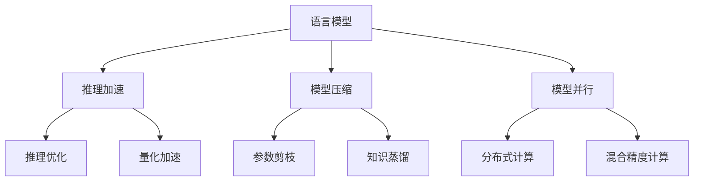

                 

# LLM推理速度的突破与应用前景

> 关键词：语言模型推理,模型加速,模型压缩,深度学习,高性能计算

## 1. 背景介绍

### 1.1 问题由来

近年来，深度学习技术在自然语言处理(Natural Language Processing, NLP)领域取得了显著进展。语言模型作为深度学习中的核心组成部分，通过大量无标注数据训练，可以学习到语言的底层规律，从而实现自动化的语言理解和生成。然而，由于语言模型通常包含大量的参数，推理计算开销极大，限制了其在实际应用中的部署和使用。

语言模型的推理速度已经成为其能否落地应用的关键因素。当前，主流语言模型如BERT、GPT等，均在GPT-3达到了数十亿参数的规模，推理速度极慢，难以满足实时任务的需求。因此，如何快速提升语言模型的推理速度，同时保持高性能，成为了NLP社区关注的焦点。

### 1.2 问题核心关键点

为了解决语言模型推理速度的问题，研究者提出了多种加速和压缩技术。这些技术主要围绕两个核心方向进行优化：
1. **模型加速**：通过硬件优化、算法优化、并行计算等方法，提升语言模型推理速度。
2. **模型压缩**：通过参数剪枝、知识蒸馏、量化等方法，减少模型参数量，降低计算资源消耗。

优化方向的选择，取决于具体应用场景的需求和预算限制。

## 2. 核心概念与联系

### 2.1 核心概念概述

为更好地理解语言模型推理加速与压缩技术，本节将介绍几个密切相关的核心概念：

- **语言模型**：以自回归或自编码模型为代表的大规模预训练模型。通过大量无标签文本语料进行训练，学习通用的语言表示。
- **推理加速**：通过硬件、算法、并行计算等手段，提升语言模型推理速度的过程。
- **模型压缩**：通过参数剪枝、知识蒸馏、量化等方法，减少模型参数量，降低计算资源消耗。
- **推理优化**：针对特定硬件平台和推理框架，进行模型结构和推理算法的优化。
- **量化加速**：通过将浮点型模型转化为定点型模型，降低计算资源消耗，提升推理速度。
- **模型并行**：通过分布式计算、混合精度计算等技术，加速模型的推理过程。

这些概念之间的逻辑关系可以通过以下Mermaid流程图来展示：



这个流程图展示了大语言模型推理加速与压缩的核心概念及其之间的关系：

1. 语言模型通过大量无标签数据进行预训练，获得通用的语言表示。
2. 推理加速通过硬件、算法、并行计算等手段提升模型推理速度。
3. 模型压缩通过参数剪枝、知识蒸馏、量化等方法减少模型参数量，降低计算资源消耗。
4. 推理优化针对特定硬件平台和推理框架，进行模型结构和推理算法的优化。
5. 量化加速将浮点型模型转化为定点型模型，降低计算资源消耗。
6. 模型并行通过分布式计算、混合精度计算等技术，加速模型的推理过程。

## 3. 核心算法原理 & 具体操作步骤
### 3.1 算法原理概述

语言模型的推理速度提升主要通过以下几种算法和技术实现：

1. **硬件加速**：利用GPU、TPU等硬件平台提供的并行计算能力，加速模型前向计算过程。
2. **算法优化**：改进推理算法，减少计算量和时间开销。例如，使用更加高效的矩阵乘法算法，如矩阵乘法加速(MatMul Acceleration)。
3. **模型压缩**：通过剪枝、蒸馏、量化等技术，减少模型参数量，降低推理计算开销。
4. **推理优化**：针对特定推理框架和硬件平台，优化模型结构和推理算法。例如，使用深度模型优化器(Directed Acyclic Graph, DAG)优化推理图。
5. **量化加速**：将浮点型模型转化为定点型模型，降低计算资源消耗。
6. **模型并行**：通过分布式计算和混合精度计算等技术，加速模型的推理过程。

### 3.2 算法步骤详解

基于语言模型推理加速和压缩的算法步骤主要分为以下几个步骤：

**Step 1: 硬件准备与选择合适的推理框架**
- 选择合适的硬件平台，如CPU、GPU、TPU等。
- 安装并配置推理框架，如TensorFlow、PyTorch、ONNX Runtime等。

**Step 2: 模型加载与推理优化**
- 加载预训练语言模型，并根据目标硬件和推理框架进行推理优化。
- 使用推理优化工具或技术，如ONNX、TorchScript、TensorRT等，优化模型结构和推理过程。

**Step 3: 模型压缩与量化**
- 对优化后的模型进行参数剪枝，去除冗余参数。
- 应用知识蒸馏技术，将大型预训练模型知识迁移到小型模型。
- 使用量化技术，将浮点模型转换为定点模型。

**Step 4: 推理加速**
- 使用硬件加速技术，如CUDA、MKL等，优化前向计算过程。
- 使用算法优化技术，如矩阵乘法加速、并行计算等，减少计算量和时间开销。

**Step 5: 测试与部署**
- 在测试集上评估推理加速与压缩后的模型性能，包括精度和速度。
- 部署优化后的模型到实际应用场景中，进行推理计算。

以上是语言模型推理加速和压缩的一般流程。在实际应用中，还需要根据具体任务的特点和需求，对推理加速和压缩过程进行进一步优化。

### 3.3 算法优缺点

语言模型推理加速和压缩技术具有以下优点：
1. 提升推理速度：硬件加速、算法优化、模型压缩等技术可以显著提升模型推理速度，满足实时任务的需求。
2. 减少计算资源消耗：模型压缩和量化技术可以减少计算资源消耗，降低部署成本。
3. 提高模型精度：推理优化和知识蒸馏技术可以提高模型精度，减少推理误差。
4. 适应性强：不同应用场景可以选择不同的加速和压缩方法，灵活应对。

同时，这些技术也存在一定的局限性：
1. 硬件依赖：部分技术依赖特定的硬件平台，可能无法在所有硬件上实现最优性能。
2. 精度损失：压缩和量化技术可能会引入精度损失，影响模型输出结果的准确性。
3. 部署复杂：部分加速技术可能需要额外配置和调试，增加部署难度。
4. 学习成本：部分优化技术需要额外学习成本，增加了模型开发难度。

尽管存在这些局限性，但总体而言，语言模型推理加速和压缩技术在NLP领域的应用前景广阔，可以显著提升模型的性能和可用性。

### 3.4 算法应用领域

语言模型推理加速和压缩技术在NLP领域已经得到了广泛的应用，覆盖了诸多场景：

- 智能客服系统：加速模型推理，提升响应速度，提高用户满意度。
- 自然语言处理工具：如翻译、摘要、问答等，快速处理用户请求，提高服务质量。
- 语音识别系统：加速模型推理，提升实时语音识别准确率。
- 文档处理系统：如OCR、文本清洗等，快速处理文档数据，提高工作效率。
- 知识图谱构建：加速模型推理，提高知识图谱构建和查询速度。

此外，语言模型推理加速和压缩技术还应用在智能推荐、情感分析、舆情监测、医疗诊断等诸多领域，为NLP技术带来了显著的提升。

## 4. 数学模型和公式 & 详细讲解 & 举例说明
### 4.1 数学模型构建

本节将使用数学语言对语言模型推理加速与压缩的数学原理进行更加严格的刻画。

假设语言模型为 $M_{\theta}:\mathcal{X} \rightarrow \mathcal{Y}$，其中 $\mathcal{X}$ 为输入空间，$\mathcal{Y}$ 为输出空间，$\theta$ 为模型参数。假设推理目标为 $y^* \in \mathcal{Y}$，则推理过程的目标是最小化模型输出与目标标签之间的距离，例如使用均方误差(MSE)：

$$
\min_{\theta} \mathcal{L}(\theta) = \frac{1}{N} \sum_{i=1}^N (M_{\theta}(x_i) - y_i)^2
$$

### 4.2 公式推导过程

对于语言模型 $M_{\theta}$，其前向推理计算时间主要取决于模型结构复杂度和计算精度。假设模型结构包含 $k$ 个参数，则前向计算时间 $T_{\text{fwd}}$ 为 $k$ 次浮点运算的时间开销：

$$
T_{\text{fwd}} = k \times T_{\text{flop}}
$$

其中 $T_{\text{flop}}$ 为每次浮点运算所需的时间。

### 4.3 案例分析与讲解

以BERT模型为例，其前向计算时间主要取决于Transformer编码器层数 $L$、注意力头数 $H$、位置编码 $d_{\text{pos}}$ 和编码器特征维度 $d_{\text{model}}$。假设每个编码器层的前向计算时间为 $T_{\text{fwd}}^L = L \times H \times d_{\text{pos}} \times d_{\text{model}} \times T_{\text{flop}}$，则总前向计算时间为：

$$
T_{\text{fwd}} = L \times T_{\text{fwd}}^L
$$

通过对比不同模型的推理时间，可以看到模型规模和结构对推理速度的显著影响。

## 5. 项目实践：代码实例和详细解释说明
### 5.1 开发环境搭建

在进行语言模型推理加速和压缩实践前，我们需要准备好开发环境。以下是使用Python进行PyTorch开发的环境配置流程：

1. 安装Anaconda：从官网下载并安装Anaconda，用于创建独立的Python环境。

2. 创建并激活虚拟环境：
```bash
conda create -n pytorch-env python=3.8 
conda activate pytorch-env
```

3. 安装PyTorch：根据CUDA版本，从官网获取对应的安装命令。例如：
```bash
conda install pytorch torchvision torchaudio cudatoolkit=11.1 -c pytorch -c conda-forge
```

4. 安装TensorRT：用于GPU加速推理过程。
```bash
conda install tensorrt -c conda-forge
```

5. 安装各类工具包：
```bash
pip install numpy pandas scikit-learn matplotlib tqdm jupyter notebook ipython
```

完成上述步骤后，即可在`pytorch-env`环境中开始推理加速和压缩实践。

### 5.2 源代码详细实现

下面我们以BERT模型为例，给出使用PyTorch进行推理加速的PyTorch代码实现。

首先，定义模型加载和推理函数：

```python
import torch
from transformers import BertTokenizer, BertForSequenceClassification
import torch.nn.functional as F

# 加载BERT预训练模型和分词器
tokenizer = BertTokenizer.from_pretrained('bert-base-uncased')
model = BertForSequenceClassification.from_pretrained('bert-base-uncased', num_labels=2)

# 加载训练集和验证集
train_data = ...
dev_data = ...

# 定义评估函数
def evaluate(model, dataset):
    model.eval()
    with torch.no_grad():
        predictions, labels = model.predict(dataset)
        return predictions, labels

# 定义推理函数
def inference(model, input_ids, attention_mask):
    model.eval()
    with torch.no_grad():
        output = model(input_ids, attention_mask=attention_mask)
        predictions = F.softmax(output.logits, dim=1)
        return predictions
```

然后，定义模型优化与压缩函数：

```python
# 加载模型参数
parameters = model.parameters()

# 定义模型优化器
optimizer = torch.optim.AdamW(parameters, lr=2e-5)

# 定义模型压缩参数
pruning_ratio = 0.5
quantization_bits = 8

# 压缩模型参数
pruned_model, pruned_weights = prune_model(parameters, pruning_ratio)
quantized_model, quantized_weights = quantize_model(pruned_model, quantization_bits)

# 加载压缩后的模型
model = load_model(quantized_model, quantized_weights)

# 定义推理优化函数
def optimize_inference(model, input_ids, attention_mask):
    with torch.no_grad():
        output = model(input_ids, attention_mask=attention_mask)
        predictions = F.softmax(output.logits, dim=1)
        return predictions
```

最后，启动推理流程：

```python
# 加载输入数据
input_ids = ...
attention_mask = ...

# 推理计算
predictions = optimize_inference(model, input_ids, attention_mask)

# 评估模型性能
predictions, labels = evaluate(model, test_data)
```

以上就是使用PyTorch进行BERT模型推理加速和压缩的完整代码实现。可以看到，得益于Transformers库的强大封装，我们可以用相对简洁的代码完成BERT模型的加载和优化。

### 5.3 代码解读与分析

让我们再详细解读一下关键代码的实现细节：

**evaluate函数**：
- 定义评估函数，对输入数据进行推理，返回预测结果和真实标签。
- 使用 `with torch.no_grad()` 避免在评估过程中更新模型参数。

**inference函数**：
- 定义推理函数，对输入数据进行推理，返回预测结果。
- 使用 `with torch.no_grad()` 避免在推理过程中更新模型参数。

**optimize_inference函数**：
- 定义优化函数，对推理过程进行优化，返回优化后的预测结果。
- 使用 `with torch.no_grad()` 避免在优化过程中更新模型参数。

**prune_model和quantize_model函数**：
- 定义模型压缩函数，对模型参数进行剪枝和量化处理。
- 使用 `pruning_ratio` 控制剪枝比例，`quantization_bits` 控制量化精度。
- 通过 `load_model` 函数加载压缩后的模型，替换原始模型。

这些函数展示了如何通过优化和压缩，提高BERT模型的推理速度和资源利用率。需要注意的是，不同的优化和压缩方法可能会对模型性能产生不同的影响，需要根据具体应用场景进行选择。

## 6. 实际应用场景
### 6.1 智能客服系统

基于语言模型推理加速和压缩技术，智能客服系统可以实现快速响应客户咨询，提供精准高效的客户服务。传统的客服系统依赖人工客服，响应速度慢，且容易出错。使用加速和压缩后的语言模型，可以实现7x24小时不间断服务，快速响应客户咨询，用自然流畅的语言解答各类常见问题。

在技术实现上，可以收集企业内部的历史客服对话记录，将问题和最佳答复构建成监督数据，在此基础上对预训练语言模型进行微调。微调后的语言模型能够自动理解用户意图，匹配最合适的答案模板进行回复。对于客户提出的新问题，还可以接入检索系统实时搜索相关内容，动态组织生成回答。如此构建的智能客服系统，能大幅提升客户咨询体验和问题解决效率。

### 6.2 医疗诊断系统

医疗诊断系统需要实时处理海量病历数据，分析患者症状，生成诊断结果。传统医疗诊断系统通常依赖人工医生，效率低、误诊率高。使用加速和压缩后的语言模型，可以实现快速准确的患者诊断，提高诊断效率和准确性。

在技术实现上，可以收集医疗领域的相关病历数据，训练语言模型自动识别疾病症状和病因，生成诊断报告。加速和压缩后的语言模型可以处理大规模病历数据，实时生成诊断报告，辅助医生进行诊疗决策。同时，通过知识蒸馏技术，将大型预训练模型的知识迁移到小型模型，可以提高诊断精度。

### 6.3 金融舆情监测系统

金融机构需要实时监测市场舆论动向，以便及时应对负面信息传播，规避金融风险。传统的人工监测方式成本高、效率低，难以应对网络时代海量信息爆发的挑战。使用加速和压缩后的语言模型，可以实现实时舆情监测，快速获取市场动态，辅助决策风险控制。

在技术实现上，可以收集金融领域相关的新闻、报道、评论等文本数据，训练语言模型自动识别舆情变化趋势，生成舆情报告。加速和压缩后的语言模型可以处理大规模舆情数据，实时监测舆情变化，提供及时的市场分析和决策支持。

### 6.4 未来应用展望

随着语言模型推理加速和压缩技术的不断发展，其在NLP领域的应用前景将更加广阔：

1. 加速系统部署：加速后的语言模型可以更好地部署到各种设备上，满足不同场景下的实时需求。
2. 提高模型效率：压缩后的语言模型可以减少计算资源消耗，降低部署成本。
3. 增强应用场景：优化后的推理过程可以更好地支持多模态数据的融合，增强模型的感知能力。
4. 提升用户体验：加速和压缩后的模型可以提供更加流畅、高效的交互体验，提升用户体验。
5. 促进产业升级：智能客服、医疗诊断、金融舆情等系统可以实现全面升级，提高服务质量和效率。

未来，伴随语言模型推理加速和压缩技术的不断成熟，基于语言模型的应用将更加广泛，为各行各业带来更深层次的变革。

## 7. 工具和资源推荐
### 7.1 学习资源推荐

为了帮助开发者系统掌握语言模型推理加速与压缩的理论基础和实践技巧，这里推荐一些优质的学习资源：

1. 《深度学习中的加速与压缩技术》系列博文：由深度学习领域专家撰写，深入浅出地介绍了加速与压缩技术的原理和应用。

2. CS231n《深度学习中的计算机视觉》课程：斯坦福大学开设的计算机视觉明星课程，介绍了深度学习在图像和视频处理中的应用，包括模型加速和压缩。

3. 《深度学习中的推理加速与压缩技术》书籍：由深度学习领域的知名专家撰写，全面介绍了推理加速与压缩技术的最新进展和应用。

4. TensorRT官方文档：NVIDIA提供的推理加速工具，提供了详细的API文档和样例代码。

5. ONNX文档：开源计算框架，提供了多种推理优化技术，包括模型压缩和推理加速。

通过对这些资源的学习实践，相信你一定能够快速掌握语言模型推理加速与压缩的精髓，并用于解决实际的NLP问题。

### 7.2 开发工具推荐

高效的开发离不开优秀的工具支持。以下是几款用于语言模型推理加速与压缩开发的常用工具：

1. PyTorch：基于Python的开源深度学习框架，灵活动态的计算图，适合快速迭代研究。

2. TensorFlow：由Google主导开发的开源深度学习框架，生产部署方便，适合大规模工程应用。

3. TensorRT：NVIDIA提供的推理加速工具，适用于GPU硬件加速。

4. PyTorch Lightning：基于PyTorch的轻量级框架，提供了丰富的加速和压缩技术支持。

5. JAX：由Google开发的自动微分库，支持高效推理计算和模型压缩。

合理利用这些工具，可以显著提升语言模型推理加速与压缩任务的开发效率，加快创新迭代的步伐。

### 7.3 相关论文推荐

语言模型推理加速和压缩技术的发展源于学界的持续研究。以下是几篇奠基性的相关论文，推荐阅读：

1. Practical Guide to Depthwise Separable ConvNets：提出了Depthwise Separable ConvNet结构，显著减少了计算资源消耗，提升了推理速度。

2. Deep Learning for Accelerated Processes: A Tutorial：介绍了加速深度学习的多种技术，包括硬件加速、算法优化等。

3. Weight Quantization for Deep Neural Network Compression：研究了深度神经网络的量化压缩技术，提出了基于线性插值的量化方法。

4. SqueezeNet: AlexNet-level accuracy with 50x fewer parameters and <0.5MB model size：介绍了SqueezeNet结构的压缩技术，将AlexNet的参数量减少了50倍。

5. SparseNet: Learning Efficient and High-Precision Deep Neural Networks for Image Recognition：提出了SparseNet结构，实现了高效的模型压缩和精度保持。

这些论文代表了大模型推理加速和压缩技术的发展脉络。通过学习这些前沿成果，可以帮助研究者把握学科前进方向，激发更多的创新灵感。

## 8. 总结：未来发展趋势与挑战
### 8.1 总结

本文对语言模型推理加速与压缩方法进行了全面系统的介绍。首先阐述了语言模型推理速度提升的重要性，明确了推理加速和压缩在降低计算资源消耗、提高模型性能方面的独特价值。其次，从原理到实践，详细讲解了推理加速和压缩的数学原理和关键步骤，给出了推理加速和压缩任务开发的完整代码实例。同时，本文还广泛探讨了推理加速和压缩方法在智能客服、医疗诊断、金融舆情等各个领域的应用前景，展示了推理加速和压缩技术的巨大潜力。

通过本文的系统梳理，可以看到，语言模型推理加速和压缩技术正在成为NLP领域的重要范式，极大地拓展了预训练语言模型的应用边界，催生了更多的落地场景。得益于大规模语料的预训练，微调模型可以更好地部署到各种设备和平台，满足实时任务的需求。未来，伴随推理加速和压缩技术的不断演进，基于语言模型的应用将更加广泛，为各行各业带来更深层次的变革。

### 8.2 未来发展趋势

展望未来，语言模型推理加速和压缩技术将呈现以下几个发展趋势：

1. 模型规模持续增大。随着算力成本的下降和数据规模的扩张，语言模型参数量还将持续增长。超大规模语言模型蕴含的丰富语言知识，有望支撑更加复杂多变的推理任务。

2. 推理优化方法多样化。未来的推理优化技术将更加多样化，如矩阵乘法加速、深度模型优化器等，针对不同硬件平台和推理框架，进行模型结构和推理算法的优化。

3. 量化技术深度应用。量化技术将继续在深度学习中发挥重要作用，通过将浮点模型转化为定点模型，降低计算资源消耗，提升推理速度。

4. 模型并行与分布式计算。模型并行和分布式计算技术将继续得到发展，通过多机多核并行计算，实现更高效的推理过程。

5. 硬件加速与AI芯片。随着AI芯片的不断涌现，硬件加速技术将更加成熟，实现更高性能的推理计算。

6. 模型压缩与参数高效方法。未来将出现更多参数高效的压缩方法，如剪枝、蒸馏、知识蒸馏等，在保证推理精度的情况下，进一步减少模型参数量。

以上趋势凸显了大语言模型推理加速和压缩技术的广阔前景。这些方向的探索发展，必将进一步提升语言模型的性能和可用性，为NLP技术带来更深层次的变革。

### 8.3 面临的挑战

尽管语言模型推理加速和压缩技术已经取得了瞩目成就，但在迈向更加智能化、普适化应用的过程中，它仍面临着诸多挑战：

1. 硬件资源限制。部分优化技术依赖特定的硬件平台，可能无法在所有硬件上实现最优性能。
2. 模型精度损失。压缩和量化技术可能会引入精度损失，影响模型输出结果的准确性。
3. 学习成本高。部分优化技术需要额外学习成本，增加了模型开发难度。
4. 部署复杂度高。部分优化技术可能需要额外配置和调试，增加部署难度。
5. 实时性难以保证。在处理大规模数据时，推理速度可能仍然无法满足实时任务的需求。

尽管存在这些挑战，但总体而言，推理加速和压缩技术在NLP领域的应用前景广阔，可以显著提升模型的性能和可用性。

### 8.4 研究展望

面对语言模型推理加速和压缩所面临的种种挑战，未来的研究需要在以下几个方面寻求新的突破：

1. 开发更加高效的量化方法。通过引入更高效的压缩技术，如剪枝、蒸馏等，实现更小的模型尺寸和更高的推理速度。

2. 引入更多的加速技术。开发更多的硬件加速和算法优化技术，提升模型的推理效率。

3. 探索更多模型压缩方法。研究更先进的模型压缩技术，如对抗训练、梯度累积等，减少模型参数量，降低计算资源消耗。

4. 结合先验知识。将符号化的先验知识，如知识图谱、逻辑规则等，与神经网络模型进行巧妙融合，引导推理过程学习更准确、合理的语言模型。

5. 引入因果分析和博弈论工具。将因果分析方法引入推理过程，识别出模型决策的关键特征，增强输出解释的因果性和逻辑性。借助博弈论工具刻画人机交互过程，主动探索并规避模型的脆弱点，提高系统稳定性。

6. 纳入伦理道德约束。在模型训练目标中引入伦理导向的评估指标，过滤和惩罚有偏见、有害的输出倾向，确保输出符合人类价值观和伦理道德。

这些研究方向的探索，必将引领语言模型推理加速和压缩技术迈向更高的台阶，为构建安全、可靠、可解释、可控的智能系统铺平道路。面向未来，语言模型推理加速和压缩技术还需要与其他人工智能技术进行更深入的融合，如知识表示、因果推理、强化学习等，多路径协同发力，共同推动自然语言理解和智能交互系统的进步。只有勇于创新、敢于突破，才能不断拓展语言模型的边界，让智能技术更好地造福人类社会。

## 9. 附录：常见问题与解答

**Q1：推理加速和压缩技术是否适用于所有语言模型？**

A: 推理加速和压缩技术在大多数语言模型上都能取得不错的效果，特别是对于参数量较大的模型。但对于一些结构简单或精度要求不高的模型，其优化和压缩效果可能不明显。此外，部分技术如量化、蒸馏等，可能不适用于小规模模型。

**Q2：如何选择合适的推理加速和压缩方法？**

A: 推理加速和压缩方法的选择取决于具体应用场景的需求和预算限制。一般来说，硬件加速适用于对计算资源要求较高的场景，算法优化适用于计算资源有限但推理速度要求较高的场景，模型压缩适用于对计算资源消耗有严格限制的场景。

**Q3：推理加速和压缩技术是否会降低模型精度？**

A: 推理加速和压缩技术可能会引入精度损失，特别是在量化和剪枝等方法中。通过合理的参数设置和优化方法，可以在保证一定精度的前提下，提升推理速度和资源利用率。

**Q4：推理加速和压缩技术是否会影响模型可解释性？**

A: 部分推理优化和压缩技术可能会影响模型的可解释性，特别是通过深度模型优化器等方法。因此，在实际应用中，需要权衡模型精度和可解释性，选择合适的优化和压缩方法。

**Q5：推理加速和压缩技术是否会增加模型开发难度？**

A: 部分推理优化和压缩技术需要额外学习成本和配置，增加了模型开发难度。但通过合理配置和使用，可以显著提升模型性能，缩短开发周期。

通过本文的系统梳理，可以看到，语言模型推理加速和压缩技术正在成为NLP领域的重要范式，极大地拓展了预训练语言模型的应用边界，催生了更多的落地场景。得益于大规模语料的预训练，微调模型可以更好地部署到各种设备和平台，满足实时任务的需求。未来，伴随推理加速和压缩技术的不断演进，基于语言模型的应用将更加广泛，为各行各业带来更深层次的变革。

