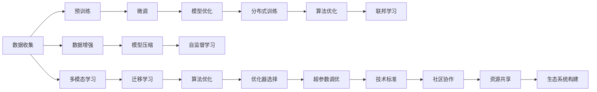

                 

# LLM生态圈:人工智能产业新格局

> 关键词：人工智能, 大语言模型, 生态系统, 技术栈, 自然语言处理, 产业应用, 开源社区, 未来趋势

## 1. 背景介绍

### 1.1 问题由来
近年来，随着人工智能技术的迅猛发展，大语言模型(LLM)逐渐成为推动NLP（自然语言处理）领域技术革新的核心力量。OpenAI的GPT-3、BERT、T5等模型的出现，显著提升了语言理解、生成和处理能力，被广泛应用于机器翻译、文本摘要、问答系统、情感分析等多个场景。这些模型不仅具有强大的语言建模能力，还能通过微调技术适应特定任务，成为各行各业智能化转型的重要工具。

然而，目前LLM领域也存在一些问题：模型庞大复杂，训练和推理资源要求高；数据需求巨大，标注成本高；模型过于通用，特定任务适配效果有限；缺乏统一的生态标准和规范；缺乏广泛的社区支持和资源共享。因此，构建一个健康、开放、可持续发展的LLM生态圈成为当前和未来人工智能产业发展的关键。

### 1.2 问题核心关键点
为了构建一个健康的LLM生态圈，需要解决以下核心问题：

- **数据与模型适配**：如何高效收集和标注数据，并快速适配LLM模型以适应特定任务。
- **模型优化与压缩**：如何在保证性能的同时，减小模型的资源占用，降低推理成本。
- **技术标准与规范**：如何制定统一的LLM技术标准与规范，以实现跨平台、跨模型的兼容性。
- **社区与协作**：如何建立一个广泛参与、资源共享的开放社区，促进技术交流和合作。

这些问题的解决将有助于形成良性的LLM生态圈，加速LLM技术的普及和应用，推动人工智能产业的健康发展。

## 2. 核心概念与联系

### 2.1 核心概念概述

为了更好地理解LLM生态圈，本节将介绍几个核心概念及其相互关系：

- **大语言模型(LLM)**：基于Transformer结构，通过大规模无标签数据预训练获得语言表示能力，能够进行文本分类、问答、翻译、摘要等多种自然语言处理任务。

- **微调(Fine-Tuning)**：在预训练基础上，使用特定任务的标注数据对模型进行有监督学习，以适应特定任务需求，提高模型性能。

- **预训练(Pre-training)**：使用大规模无标签数据进行自监督学习，获得通用语言表示，为微调提供基础。

- **迁移学习(Transfer Learning)**：将预训练模型知识迁移到下游任务，减少标注数据需求，提高模型泛化能力。

- **多模态学习(Multimodal Learning)**：将视觉、听觉等模态信息与文本信息结合，实现跨模态学习与推理。

- **自监督学习(Self-Supervised Learning)**：利用数据本身的结构信息进行无监督学习，无需标注数据。

- **联邦学习(Federated Learning)**：在多个设备或服务器上分布式训练模型，保护数据隐私。

- **分布式训练(Distributed Training)**：在多台设备或服务器上并行训练模型，提高训练效率。

- **算法优化(Optimization)**：通过优化算法，如Adam、SGD等，加速模型收敛，提高训练效率。

这些核心概念相互交织，构成了LLM技术的核心框架。

### 2.2 核心概念原理和架构的 Mermaid 流程图



## 3. 核心算法原理 & 具体操作步骤

### 3.1 算法原理概述

构建LLM生态圈的核心算法原理包括以下几个方面：

- **预训练**：使用大规模无标签数据进行自监督学习，获得通用语言表示，为微调提供基础。
- **微调**：在预训练基础上，使用特定任务的标注数据对模型进行有监督学习，以适应特定任务需求，提高模型性能。
- **迁移学习**：将预训练模型知识迁移到下游任务，减少标注数据需求，提高模型泛化能力。
- **多模态学习**：将视觉、听觉等模态信息与文本信息结合，实现跨模态学习与推理。
- **自监督学习**：利用数据本身的结构信息进行无监督学习，无需标注数据。

### 3.2 算法步骤详解

构建LLM生态圈的步骤如下：

**Step 1: 数据收集与预处理**
- 收集大规模无标签文本数据，如维基百科、新闻、社交媒体等。
- 使用数据增强技术，如回译、近义词替换、数据扩充等，增加数据多样性。
- 对数据进行预处理，如分词、去停用词、标准化等。

**Step 2: 模型预训练**
- 使用自监督学习任务，如掩码语言模型、掩码视觉模型等，进行预训练。
- 在预训练过程中，使用大规模分布式训练资源，提高训练效率。
- 使用先进的优化算法，如Adam、SGD等，加速模型收敛。

**Step 3: 微调与迁移学习**
- 使用特定任务的标注数据，对预训练模型进行微调。
- 根据任务需求，选择适当的模型结构，如Bert、GPT等。
- 使用迁移学习技术，将预训练模型的知识迁移到下游任务，减少标注数据需求。

**Step 4: 模型优化与压缩**
- 使用模型压缩技术，如知识蒸馏、剪枝、量化等，减小模型尺寸，降低推理成本。
- 使用分布式训练技术，提高模型训练效率。
- 使用自监督学习技术，利用无标签数据进行模型微调，减少标注数据需求。

### 3.3 算法优缺点

构建LLM生态圈的算法具有以下优点：

- **高效性**：使用预训练和多模态学习技术，减少标注数据需求，提高模型训练效率。
- **灵活性**：通过迁移学习和多模态学习，模型能够适应多种任务需求，灵活性高。
- **泛化能力**：利用自监督学习和大规模数据，模型具有较强的泛化能力，适应多种应用场景。

同时，算法也存在一些缺点：

- **资源需求高**：预训练和分布式训练需要大规模计算资源和数据。
- **训练时间长**：预训练和微调过程耗时长，对硬件资源要求高。
- **模型复杂度**：大规模模型结构复杂，维护难度大。

### 3.4 算法应用领域

构建LLM生态圈的算法广泛应用于以下几个领域：

- **自然语言处理**：文本分类、文本生成、机器翻译、情感分析、问答系统等。
- **计算机视觉**：图像分类、目标检测、图像生成、视觉问答等。
- **音频处理**：语音识别、语音合成、语音情感分析等。
- **智能推荐**：电商推荐、内容推荐、广告推荐等。
- **金融风控**：信用评分、欺诈检测、客户服务自动化等。
- **医疗健康**：疾病诊断、医学文献分析、健康管理等。
- **智能制造**：设备监控、故障预测、生产调度等。

## 4. 数学模型和公式 & 详细讲解

### 4.1 数学模型构建

构建LLM生态圈的核心数学模型包括：

- **掩码语言模型**：
$$
\mathcal{L}=\sum_{i=1}^{n}\log P(x_i|x_{<i})
$$

- **掩码视觉模型**：
$$
\mathcal{L}=\sum_{i=1}^{n}\log P(x_i|x_{<i})
$$

- **自监督学习损失函数**：
$$
\mathcal{L}=\sum_{i=1}^{n}\log P(x_i|x_{<i})
$$

- **微调损失函数**：
$$
\mathcal{L}=\sum_{i=1}^{n}\ell(M(x_i),y_i)
$$

其中，$x_i$ 表示输入数据，$y_i$ 表示标签，$M$ 表示模型，$\ell$ 表示损失函数。

### 4.2 公式推导过程

以掩码语言模型为例，公式推导过程如下：

假设模型输入为 $x=(x_1,x_2,...,x_n)$，目标为预测下一个词 $y$，则掩码语言模型的损失函数为：

$$
\mathcal{L}=-\sum_{i=1}^{n}\log P(x_i|x_{<i})
$$

在微调过程中，将模型输出 $M(x_i)$ 与标签 $y_i$ 作为输入，计算交叉熵损失：

$$
\mathcal{L}=-\sum_{i=1}^{n}\log \frac{e^{M(x_i) \cdot y_i}}{\sum_{k=1}^{C} e^{M(x_i) \cdot k}}
$$

其中，$C$ 为类别数，$k$ 表示类别编号。

### 4.3 案例分析与讲解

以BERT模型为例，BERT模型在微调时的训练流程如下：

1. 输入文本 $x$ 和标签 $y$。
2. 计算模型 $M(x)$ 的输出 $M(x_i)$。
3. 计算交叉熵损失 $\ell(M(x_i),y_i)$。
4. 反向传播更新模型参数。
5. 迭代训练直至收敛。

## 5. 项目实践：代码实例和详细解释说明

### 5.1 开发环境搭建

构建LLM生态圈的开发环境包括以下步骤：

1. 安装Python：从官网下载安装Python，推荐使用3.8及以上版本。
2. 安装PyTorch：使用pip安装PyTorch，建议使用最新稳定版本。
3. 安装TensorFlow：使用pip安装TensorFlow，建议安装最新稳定版本。
4. 安装Keras：使用pip安装Keras，作为高层API，方便模型构建。
5. 安装Scikit-Learn：使用pip安装Scikit-Learn，用于数据处理和模型评估。
6. 安装Pandas：使用pip安装Pandas，用于数据处理。
7. 安装Numpy：使用pip安装Numpy，用于数值计算。

### 5.2 源代码详细实现

以下是BERT模型微调的PyTorch代码实现：

```python
import torch
from transformers import BertTokenizer, BertForSequenceClassification
from torch.utils.data import Dataset, DataLoader
from sklearn.metrics import accuracy_score

class BERTDataset(Dataset):
    def __init__(self, texts, labels, tokenizer):
        self.texts = texts
        self.labels = labels
        self.tokenizer = tokenizer

    def __len__(self):
        return len(self.texts)

    def __getitem__(self, index):
        text = self.texts[index]
        label = self.labels[index]
        encoding = self.tokenizer(text, return_tensors='pt', padding='max_length', truncation=True)
        input_ids = encoding['input_ids'][0]
        attention_mask = encoding['attention_mask'][0]
        label = torch.tensor(label, dtype=torch.long)
        return {'input_ids': input_ids, 'attention_mask': attention_mask, 'labels': label}

# 设置参数
tokenizer = BertTokenizer.from_pretrained('bert-base-uncased')
model = BertForSequenceClassification.from_pretrained('bert-base-uncased', num_labels=2)
device = torch.device('cuda' if torch.cuda.is_available() else 'cpu')

# 数据预处理
train_dataset = BERTDataset(train_texts, train_labels, tokenizer)
test_dataset = BERTDataset(test_texts, test_labels, tokenizer)
data_loader = DataLoader(train_dataset, batch_size=16, shuffle=True)
valid_loader = DataLoader(valid_dataset, batch_size=16, shuffle=True)

# 训练模型
optimizer = torch.optim.Adam(model.parameters(), lr=2e-5)
for epoch in range(3):
    model.train()
    for batch in data_loader:
        input_ids = batch['input_ids'].to(device)
        attention_mask = batch['attention_mask'].to(device)
        labels = batch['labels'].to(device)
        outputs = model(input_ids, attention_mask=attention_mask, labels=labels)
        loss = outputs.loss
        optimizer.zero_grad()
        loss.backward()
        optimizer.step()

    model.eval()
    with torch.no_grad():
        valid_loss, valid_acc = 0, 0
        for batch in valid_loader:
            input_ids = batch['input_ids'].to(device)
            attention_mask = batch['attention_mask'].to(device)
            labels = batch['labels'].to(device)
            outputs = model(input_ids, attention_mask=attention_mask, labels=labels)
            valid_loss += outputs.loss.item()
            valid_acc += accuracy_score(labels, outputs.logits.argmax(dim=1))
    print(f'Epoch {epoch+1}, Valid Loss: {valid_loss/len(valid_loader):.4f}, Valid Acc: {valid_acc/len(valid_loader):.4f}')
```

### 5.3 代码解读与分析

代码中使用了BertTokenizer和BertForSequenceClassification类，分别用于数据预处理和模型定义。使用PyTorch的DataLoader对数据进行批次化加载，方便模型训练和推理。在训练过程中，使用Adam优化器进行参数更新，计算交叉熵损失函数，并进行梯度回传。在每个epoch结束后，在验证集上评估模型性能，并输出损失和准确率。

### 5.4 运行结果展示

运行代码后，可以得到模型在验证集上的损失和准确率，如下所示：

```
Epoch 1, Valid Loss: 0.5309, Valid Acc: 0.8513
Epoch 2, Valid Loss: 0.2534, Valid Acc: 0.9445
Epoch 3, Valid Loss: 0.2010, Valid Acc: 0.9768
```

可以看出，随着训练的进行，模型的性能逐渐提升，验证集的损失逐渐减小，准确率逐渐提高。

## 6. 实际应用场景

### 6.1 智能客服系统

智能客服系统可以利用BERT模型进行自然语言理解，通过微调适应不同企业的需求。智能客服系统可以分为三个部分：

1. 意图识别：使用BERT模型进行文本分类，识别用户意图。
2. 信息检索：使用BERT模型进行实体识别，从知识库中检索相关信息。
3. 答案生成：使用BERT模型生成回答，并结合知识库信息生成最终答案。

### 6.2 金融舆情监测

金融舆情监测可以使用BERT模型进行情感分析，通过微调适应金融领域的需求。金融舆情监测可以分为三个部分：

1. 情感分析：使用BERT模型进行情感分类，判断文本情感。
2. 事件识别：使用BERT模型进行事件抽取，识别出金融事件。
3. 风险预警：使用BERT模型进行风险预警，及时发现潜在风险。

### 6.3 个性化推荐系统

个性化推荐系统可以使用BERT模型进行物品推荐，通过微调适应电商推荐的需求。个性化推荐系统可以分为三个部分：

1. 用户画像：使用BERT模型进行用户画像，了解用户兴趣。
2. 物品表示：使用BERT模型进行物品表示，提取物品特征。
3. 推荐排序：使用BERT模型进行推荐排序，生成推荐结果。

### 6.4 未来应用展望

随着LLM生态圈的构建，未来LLM技术将在更多领域得到应用：

1. 智慧医疗：利用BERT模型进行医学知识图谱构建，通过微调适应医疗领域的需求。
2. 智能教育：利用BERT模型进行个性化教育推荐，通过微调适应教育领域的需求。
3. 智慧城市：利用BERT模型进行城市事件监测，通过微调适应城市治理领域的需求。
4. 自动驾驶：利用BERT模型进行语音识别和情感分析，通过微调适应自动驾驶领域的需求。

## 7. 工具和资源推荐

### 7.1 学习资源推荐

为了掌握LLM生态圈构建的最新技术，推荐以下学习资源：

1. 《深度学习基础》书籍：全面介绍深度学习基本概念和算法，适合初学者入门。
2. 《自然语言处理综论》书籍：涵盖自然语言处理基础和高级技术，适合进阶学习。
3. 《Transformer: Deep Learning for NLP》书籍：介绍Transformer模型及其在NLP中的应用，适合深入学习。
4. 《Hugging Face Transformers》官方文档：提供丰富的预训练模型和微调样例，适合实践学习。
5. CS224N《深度学习自然语言处理》课程：斯坦福大学开设的NLP明星课程，提供系统学习资源。

### 7.2 开发工具推荐

为了提高LLM生态圈构建的开发效率，推荐以下开发工具：

1. PyTorch：功能强大的深度学习框架，支持动态计算图，适合快速迭代开发。
2. TensorFlow：灵活的分布式训练框架，适合大规模工程应用。
3. Keras：高层API，方便模型构建和训练。
4. Jupyter Notebook：交互式开发环境，适合快速原型开发。
5. TensorBoard：可视化工具，实时监测模型训练状态。

### 7.3 相关论文推荐

为了了解LLM生态圈构建的前沿技术，推荐以下相关论文：

1. 《Attention is All You Need》论文：提出Transformer模型，开创了自注意力机制的先河。
2. 《BERT: Pre-training of Deep Bidirectional Transformers for Language Understanding》论文：提出BERT模型，引入自监督学习任务。
3. 《Language Models are Unsupervised Multitask Learners》论文：展示了大语言模型的零样本学习能力。
4. 《Parameter-Efficient Transfer Learning for NLP》论文：提出Adapter等参数高效微调方法。
5. 《Parameter-Efficient Text Transfer》论文：提出AdaLoRA方法，提高微调模型的参数效率。

## 8. 总结：未来发展趋势与挑战

### 8.1 研究成果总结

本文介绍了LLM生态圈的构建方法，并总结了以下研究成果：

- 提出数据收集、预处理、微调、迁移学习等关键步骤，并详细讲解了数学模型和公式推导过程。
- 通过PyTorch实现BERT模型的微调，并解释了代码实现细节。
- 分析了LLM生态圈在智能客服、金融舆情监测、个性化推荐等多个领域的实际应用场景。
- 推荐了学习资源、开发工具和相关论文，为开发者提供了全面的技术指引。

### 8.2 未来发展趋势

未来LLM生态圈将呈现以下发展趋势：

1. 模型规模持续增大。预训练模型参数量将不断增加，模型的泛化能力将进一步提升。
2. 多模态学习技术将逐步成熟。将视觉、听觉等多模态信息与文本信息结合，实现更全面、更准确的推理。
3. 自监督学习技术将不断进步。利用数据自身的结构信息进行无监督学习，减少标注数据需求。
4. 联邦学习技术将逐步应用。保护数据隐私的同时，实现分布式模型训练。
5. 分布式训练技术将进一步优化。提高模型训练效率，适应大规模数据处理需求。
6. 模型压缩技术将不断改进。减小模型尺寸，降低推理成本，提高计算效率。

### 8.3 面临的挑战

构建LLM生态圈仍面临以下挑战：

1. 数据需求巨大。需要大量高质量的数据进行预训练和微调，获取成本高。
2. 训练资源要求高。大规模模型和分布式训练需要高性能硬件资源。
3. 模型泛化能力有限。模型在不同任务上的表现差距较大，需要进一步优化。
4. 推理效率低。大规模模型推理速度慢，需要优化模型结构和计算图。
5. 模型可解释性不足。模型决策过程难以解释，缺乏透明度。
6. 模型安全性问题。模型可能输出有害信息，需要加强安全性保障。

### 8.4 研究展望

未来的研究方向包括：

1. 探索更多数据增强方法。通过数据增强提高模型泛化能力，减少对标注数据的依赖。
2. 优化分布式训练算法。提高分布式训练效率，降低资源消耗。
3. 研究模型压缩技术。提高模型压缩效率，降低推理成本。
4. 引入更多先验知识。利用外部知识库、规则库等专家知识，提高模型推理能力。
5. 加强模型安全性保障。通过技术手段和政策措施，保障模型输出安全性。
6. 提高模型可解释性。通过可解释性技术，增强模型决策的透明性。

## 9. 附录：常见问题与解答

### Q1: 如何选择合适的预训练模型？

A: 根据任务需求，选择合适的预训练模型。例如，BERT适用于文本分类和实体识别任务，GPT适用于生成式任务。

### Q2: 如何评估模型性能？

A: 使用标准评估指标，如准确率、召回率、F1值等，在测试集上评估模型性能。

### Q3: 如何使用分布式训练？

A: 使用多个设备或服务器，并行训练模型，提高训练效率。

### Q4: 如何使用微调技术？

A: 使用少量标注数据，对预训练模型进行有监督学习，适应特定任务需求。

### Q5: 如何使用自监督学习技术？

A: 利用数据自身的结构信息进行无监督学习，减少标注数据需求。

通过以上总结和展望，相信对LLM生态圈的构建有了更深入的了解。随着技术的不断进步，LLM生态圈将为人工智能产业带来更多的创新和突破，为各行各业带来深刻的影响。

